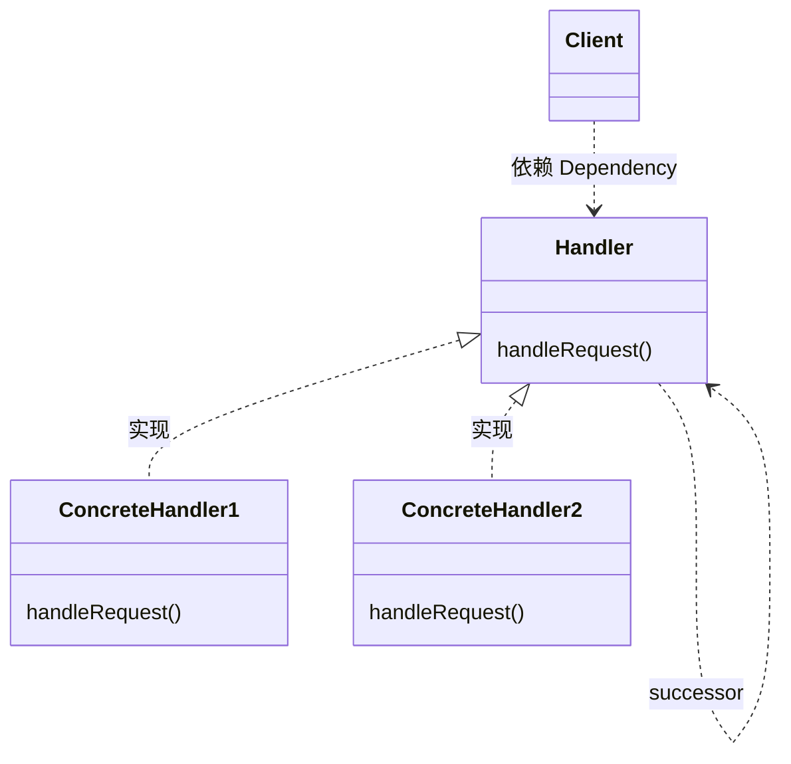
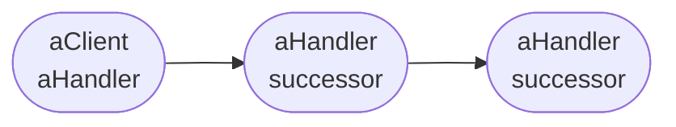

[TOC]


# 五、行为模式
行为模式涉及到算法和对象间职责的分配。行为模式不仅描述对象或类的模式，还描述它们之间的通信模式。

- 行为类模式使用继承机制在类间分派行为
- 行为对象模式使用对象复合而不是继承

## 5.1 <span id="5.1">CHAIN OF RESPONSIBILITY职责链</span>

类型：对象行为型模式

### 5.1.1 <span id="5.1.1">定义及类图</span>

使多个对象都有机会处理请求，从而避免请求的发送者和接受者之间的耦合关系。将这些对象连成一条链，并沿着这条链传递该请求，直到有一个对象处理它为止。

这一模式的想法是，给多个对象处理一个请求的机会，从而解耦发送者和接收者。该请求沿着对象链传递直至其中一个对象处理它。

Adapter 适配器的通用UML类图如下：

- 类适配器使用多重继承对一个接口与另一个接口进行匹配

上述类图说明如下：
- Handler，定义一个处理请求的接口，(可选)并实现后续链
- ConcreteHandler
  - 处理它所负责的请求
  - 可访问它的后续者
  - 如果可处理该请求，则处理；否则将该请求转发给它的后续者
- Client，向链上的具体处理者对象提交请求

一个典型的对象结构可能如下图所示：




当客户提交一个请求时，请求沿着责任链传递直至有一个ConcreteHandler对象负责处理它。


优缺点分析：
- (Adv) 降低耦合度。该模式使得一个对象无需知道是其他哪一个对象处理其请求。
  - 对象仅需知道该请求会被"正确"的处理
  - 接收者和发送者都没有对方的明确信息，且链中的对象不需要知道链的结构
  - 结果是责任链可简化为对象的相互连接。它们仅需保持一个指向其后续者的引用，而不需要保持它所有候选后续者的引用。
- (Adv) 增强了个对象指派职责的灵活性
  - 通过在运行时对该链进行动态的增加或修改来增加或改变处理一个请求的那些职责。
  - 将这种机制与静态的特例化处理对象的继承机制结合起来使用
- (Disadv) 不保证被接受，既然一个请求没有明确的接受者，那么就不能保证它一定会被处理
  - 请求可能一直到链的末端都得不到处理
  - 请求也可能因没有被正确配置而得不到处理


责任链的实现问题：
1. 实现后续者链的两种方法：
  - 定义新的链接，通常在Handler中定义，但也可由ConcreteHandler来定义
  - 使用已有的链接。
    - 使用已有的对象引用来形成后续者链。
    - 当已有的链接能支持所需的链时，完全可以使用它们。
2. 连接后续者，如果没有已有的引用可定义一个链，必须自行引入它们。这种情况下Handler不仅定义该请求的接口，通常也维护后续链接。

```C++
class HelpHandler {
public:
    HelpHandler(HelpHandler* s) : _successor(s) { }
    virtual void HandleHelp();
private:
    HelpHandler* _successor;
};

void HelpHandler::HandleHelp () {
    if (_successor) {
        _successor->HandleHelp();
    }
}
```
上述代码`HelpHandler(HelpHandler* s) : _successor(s) { }`为C++构造函数的初始化成员列表用法
> 成员初始化表达式列表
构造函数可以选择具有成员初始化表达式列表，该列表会在构造函数主体运行之前初始化类成员。 （成员初始化表达式列表与类型为 std::initializer_list<T> 的初始化表达式列表不同。）
首选成员初始化表达式列表，而不是在构造函数主体中赋值。 成员初始化表达式列表直接初始化成员。 以下示例演示了成员初始化表达式列表，该列表由冒号后的所有 identifier(argument) 表达式组成：
```C++
Box(int width, int length, int height)
        : m_width(width), m_length(length), m_height(height)
    {}
```

为便于理解，将上述C++转换为Java语言如下
```Java
public class HelpHandler {
    private HelpHandler _successor;

    public HelpHandler(HelpHandler s) {
        _successor = s;
    }

    public void HandleHelp() {
        if (_successor != null) {
            _successor.HandleHelp();
        }
    }
}

```

3. 表示请求


### 5.1.2 <span id="5.1.2">应用场景</span>

适用的场景包括：
- 有多个的对象可以处理一个请求，哪个对象处理该请求运行时刻自动确定
- 不明确指定接受者的情况下，向多个对象中的一个提交一个请求
- 可处理一个请求的对象集合应被动态指定


#### 5.1.2.1 <span id="5.1.2.1">Servlet Filters</span>

Java Servlet 规范 2.3 版引入了一种新的组件类型，称为`Filter`。`Filter`动态截获请求和响应，以转换或使用请求或响应中包含的信息。`Filter`本身通常不会创建响应，而是提供可以“附加”到任何类型的 servlet 或 JSP 页面的通用函数。

`Filter`很重要
- 首先，它们提供了将重复性任务封装在可重用单元中的能力。有组织的开发人员一直在寻找模块化代码的方法。模块化代码更易于管理和记录，更易于调试，如果做得好，可以在另一个设置中重用。
- 其次，过滤器可用于转换来自 servlet 或 JSP 页面的响应。Web 应用程序的一个常见任务是格式化发送回客户端的数据。客户端越来越多地需要格式（例如，WML），而不仅仅是 HTML。为了适应这些客户端，在功能齐全的 Web 应用程序中通常有一个强大的转换或筛选组件。

过滤器可以执行许多不同类型的功能，包括但不限于以下功能：

- 基于用户身份的身份验证阻止请求。
- Logging and auditing记录和审核 - 跟踪 Web 应用程序的用户。
- Image conversion图像转换-缩放地图等。
- Data compression数据压缩-缩小下载量。
- Localization-将请求和响应定位到特定区域设置。
- XML 内容的 XSL/T 转换将 Web 应用程序响应定位到多种类型的客户端。

单个`Filter`实例接收servlet请求和响应，FilterChain实例表示整个`Filter`链。然后，每个`Filter`都应该执行其工作，然后终止链，或者调用`chain.doFilter()`将控制权传递给下一个过滤器。


`Filter`接口中最重要的方法是`doFilter`方法，它是`Filter`的核心。此方法通常执行以下一些操作：

- 检查请求标头
- 如果请求对象希望修改请求标头或数据或完全阻止请求，则自定义该请求对象
- 如果响应对象希望修改响应标头或数据，则对其进行自定义
- 调用筛选器链中的下一个实体。如果当前`Filter`是链中以目标servlet结束的最后一个过滤器，那么下一个实体就是链末端的资源；否则，它就是WAR中配置的下一个`Filter`。它通过调用链对象上的`doFilter`方法来调用下一个实体（传入调用它的请求和响应，或者它可能创建的包装版本）。或者，它可以选择通过不调用下一个实体来阻止请求。在后一种情况下，`Filter`负责填写响应。
- 在调用链中的下一个`Filter`后检查响应标头
- 引发异常以指示处理中的错误


以下是认证过滤器的代码示例：
```Java
public class AuthenticatingFilter implements Filter {
    public void doFilter(ServletRequest request, ServletResponse response, FilterChain chain) 
      throws IOException, ServletException {
        HttpServletRequest httpRequest = (HttpServletRequest) request;
        if (!"MyAuthToken".equals(httpRequest.getHeader("X-Auth-Token")) {
             return;
        }
        chain.doFilter(request, response);
    }
}
```