[TOC]


# 三、创建型模式

## 迷宫案例的说明

迷宫的示例，其UML图如下：

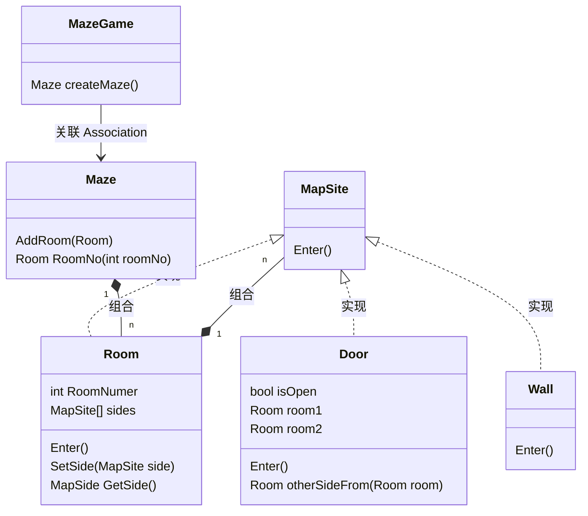

上述UML类图中：

- 类MapSite是所有迷宫组件的公共抽象类
- 类Room、Door、Wall是类MapSite的子类，即实现类；同时类Room又由Door和Wall组合而成
- 类Maze是表示Room集合
- 类MazeGame，由类的CreateMaze方法创建迷宫

创建迷宫的方法示例如下：

```java
public class MazeGame {
    Maze createMaze() {
        Maze maze = new Maze();
        Room r1 = new Room(1);
        Room r2 = new Room(2);
        Door door = new Door(r1, r2);
        
        maze.addRoom(r1);
        maze.addRoom(r2);
        r1.setSide(North, new Wall());
        r1.setSide(East, door);
        r1.setSide(West, new Wall());
        r1.setSide(South, new Wall());

        r2.setSide(North, new Wall());
        r2.setSide(East, new Wall());
        r2.setSide(West, door);
        r2.setSide(South, new Wall());
        
        return maze;
    }
    
}
```

上述代码分析：

- 仅创建两个房间，但是已经相当复杂
- 迷宫的布局硬编码
- 容易产生错误且不利于重用
- 扩张新的Room或Door的子类，创建迷宫的代码需要重写。这种情况下，改变的最大障碍是对实例化的类进行硬编码。

创建型模式提供了多种不同的方法从实例化它们的代码中除去了这些具体类的显式引用。思考：

- 如果createMaze调用虚函数而不是构造器来创建它需要的房间、墙壁或门，那么可以创建一个MazeGame的子类并重新定义这个虚函数，从而改变实例化的类。这一方法是Factory Method(3.3)模式的一个例子
- 如果传递一个对象给createMaze作为参数来创建房间、墙壁或门，那你可以传递不同的参数来改变房间、墙壁或门的类，这是是Abstract Factoryd(3.1)模式的一个例子
- 如果传递一个对象给createMaze，这个对象可以在它所建造的迷宫中使用增加房间、墙壁或门的操作，来全面创建一个新的迷宫，那么可以使用继承来改变迷宫的一些部分或迷宫的构造方式。这一方法是Builder(3.2)模式的一个例子
- 如果createMaze由多种原型的房间、墙壁或门对象参数化，它拷贝并将这些对象增加到迷宫中，那么可以用不同的对象替换这些原型对象以改变迷宫的构成。这一方法是Prototype(3.4)模式的一个例子
- 剩下的Singleton(3.5)创建型模式，可以保证每个游戏仅有一个迷宫，而且游戏对象可以迅速的访问它，而不需要求助于全局变量或函数。

## 3.1 <span id="3.1">Abstract Factory 抽象工厂</span>

类型：对象创建型模式

### 3.1.1 <span id="3.1.1">定义及类图</span>

提供一个创建一系列相关或相互依赖的对象的接口，而无需指定他们具体的类。

Abstract Factory 抽象工厂的通用UML类图如下：

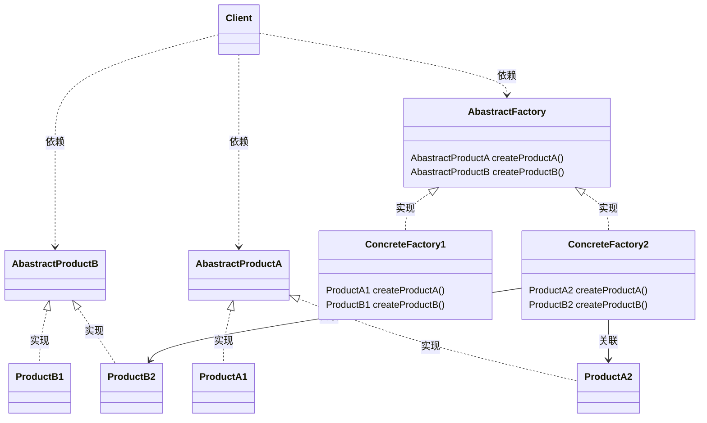
上述类图说明如下：
- AbastractFactory声明一个创建抽象对象的操作接口
- ConcreteFactory实现创建具体产品对象的操作
- AbastractProduct为一类产品对象声明一个接口
- ConcreteProduct定义一个将被相应的具体工厂对象创建的产品对象并实现AbastractProduct类的接口
- Client仅使用由AbastractFactory和AbastractProduct的接口
  - 对类Client而言，仅抽象的接口可见：AbastractFactory、AbastractProductA、AbastractProductB。隐藏具体的实现类，包括：ConcreteFactory1、ProductA1、ProductB1、ConcreteFactory2、ProductA2、ProductB2
  - AbastractFactory根据实现语言及实现的具体方式，可以是接口或类，因此ConcreteFactory1和AbastractFactory的关系可以是实现或继承。AbastractProductA和ProductA1的关系亦类似
  - 简化起见，图中类之间的关联并未一一标出。例如仅标出ConcreteFactory2类与产品类的关联关系，而未标出ConcreteFactory1与产品的关系

AbastractFactory模式的实现及优缺点说明：
- <font color="Blue">**优点**
  - 分离了具体的类
  - 使得易于交换产品系列
  - 有利于产品的一致性</font>
- <font color="Red">**缺点**：难以支持新种类的产品</font>
- AbstractFactory实现上的选择
  - **将工厂作为单件**，一个应用中一般每个产品系列只需一个ConcreteFacotory的实例，因此工厂最好实现为一个[Singleton](#3.5)
  - **创建产品**， AbstractFactory仅声明为一个创建产品的接口，真正创建产品是由ConcreteProduct子产品实现。最通常的一个办法是为每一个产品定义一个工厂方法[Factory Method](#3.3)。一个具体的工厂将为每个产品重新定义该工厂方法以指定产品。
    - <font color="Blue">**优点**：实现简单</font>
    - <font color="Red">**缺点**：要求每个产品系列都要有一个新的具体工厂子类，即使这些产品系列的差别很小</font>

### 3.1.2 <span id="3.1.2">应用场景</span>

适用的场景包括：

- 一个系统要独立与它的产品的创建、组合和表示时
- 一个系统要由多个产品系列中一个来配置时
- 强调一系列相关的产品对象的设计以便进行联合使用时
- 提供一个产品库，只想显示它们的接口而不是实现时

#### 3.1.2.1 <span id="3.1.2.1">迷宫的优化</span>

迷宫示例结合抽象工厂模式，部分新增及修改的UML类图如下：

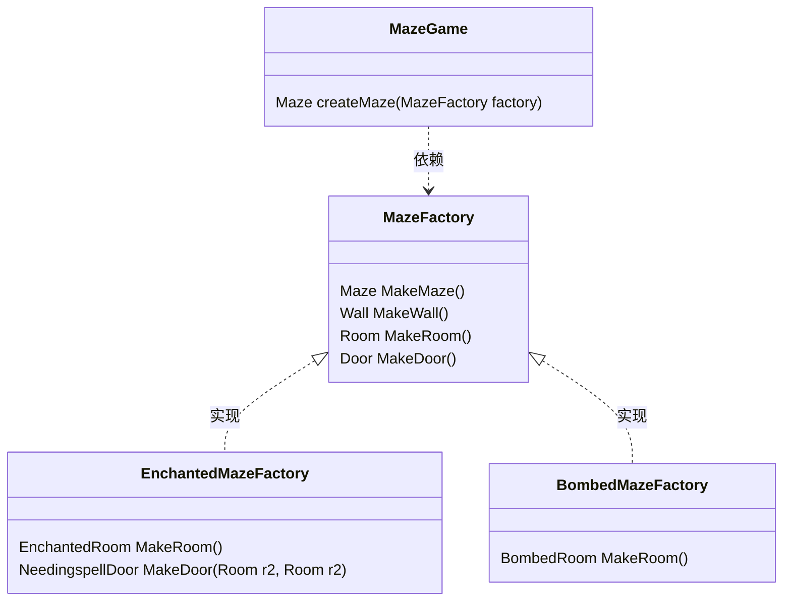

上述类图说明如下：

- 原先的实体产品类Room、Wall、Door应抽取出或修改为抽象产品类或接口（未在类图中标出），而新增的EnchantedRoom类、NeedingspellDoor类是Room、Door等抽象产品类的具体实现类
- MazeGame类对照抽象产品类的通用UML类图，对应为其中的Client类，在createMaze方法中增加MazeFactory实例用于迷宫的创建
- 原先，调用实体类的构造函数创建迷宫，修改为MazeFactory的MakeRoom()等方法，而隐藏了具体的产品类EnchantedRoom、BombedRoom等

具体的创建迷宫的MazeGame方法优化为

```java
public class MazeGame {
    Maze createMaze(MazeFactory factory) {
        Maze maze = factory.MakeMaze();
        Room r1 = factory.MakeRoom(1);
        Room r2 = factory.Room(2);
        Door door = factory.MakeDoor(r1, r2);
        
        maze.addRoom(r1);
        maze.addRoom(r2);
        r1.setSide(North, factory.MakeWall());
        r1.setSide(East, door);
        r1.setSide(West, factory.MakeWall());
        r1.setSide(South, factory.MakeWall());

        r2.setSide(North, factory.MakeWall());
        r2.setSide(East, factory.MakeWall());
        r2.setSide(West, door);
        r2.setSide(South, factory.MakeWall());
        
        return maze;
    }
}
```

#### 3.1.2.2 <span id="3.1.2.2">Fabric BCCSP</span>

Fabric BCCSP的UML类图结构如下：

BCCSP功能类图

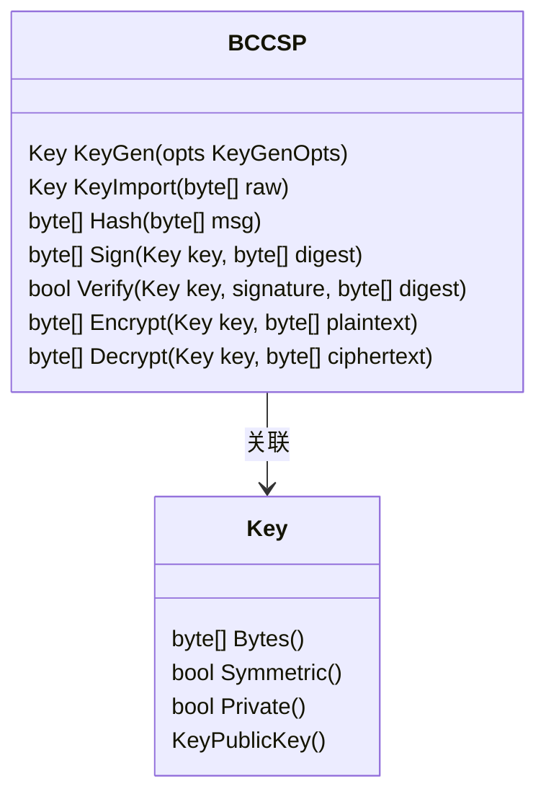

BCCSP(**B**lock**C**hain **C**rypto **S**ervice **P**rovider)区块链加密服务模块定义一组功能接口：

1.  密钥的管理：对称及非对称密钥的生成、导入、分散等
2.  Hash计算，计算hash的算法包括SHA1、SHA256、SAH384等
3.  非对称密钥的签名及验签功能，非对称密钥包括ECDSA、RSA等
4.  对称密钥的加密及解密功能，对称密钥包括3DES、AES等

因此BCCSP可以理解为一组产品或功能的集合类

Fabric提供抽象工厂，包括符合PKCS11规范的硬件加密实现pcksFactory以及软件加密swFactory的实现。同时根据国内商密的要求，扩展实现了国密算法，包括sm2非对称密钥、sm4对称密钥的密钥生命周期管理，以及相应sm3哈希、sm2签名验签、sm4加解密服务。
扩展算法有两种实现方法：
一种是在swFactory中新增算法，通过opts选项参数设置密钥类型，例如设置非对称加密类型：ECSDA或SM2
另一种实现方法，增加工厂实现类smFactory，实现国密的密钥管理及加解密功能

以增加工厂实现类，BCCSP应用抽象工厂模式的UML类图如下：

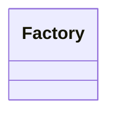

## 3.2 <span id="3.2">BUILDER 生成器</span>

类型：对象创建型模式

### 3.2.1 <span id="3.2.1">定义及类图</span>

将一个复杂对象的构建和它的表示分离，使得同样的构建过程可以创建不同的表示。

Builder生成器模式通用的UML类图结构如下

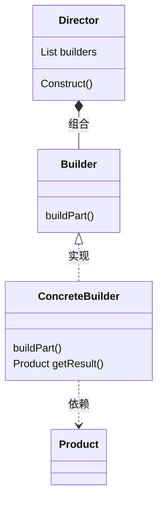
上述类图说明如下：
- Builder为创建一个Product对象的各个部件指定抽象接口对象
- ConcreteBuilder的作用包括:
  - 为实现Builder的接口以构造和装配该产品的各个部件
  - 定义并明确它所创建的表示
  - 提供一个检索产品的接口，类如GetRusult() 
- Director构造一个使用Builder接口的对象
  Director类中Construct()方法的代码伪码如下：
    ```java
    public construct() {
        for (builder : builders) {
            builder.buildPart()
        }
        Product product = xxx.getResult()
    }
    ```
- Product
  - 表示被构造的复杂对象。ConcreteBuilder创建该产品的内部表示并定义它的装配过程
  - 保护定义组成部件的类，包括将这些部件装配成最终产品的接口


一般的调用流程
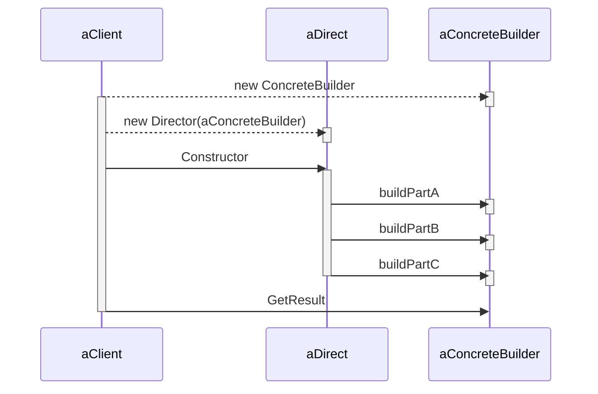
思考：
- 具体的ConcreteBuilder类是否对Client隐藏，提供单类模式或工厂方法？


Builder模式的优点或效果
- 它使你可以改变一个产品的内部表示
- 它将构造代码和表示代码分开
- 它使你可对构造过程进行更精细的控制


### 3.2.2 <span id="3.2.2">应用场景</span>

适用的场景包括：

- 当创建复杂对象的算法应该独立于该对象的组成部分以及它们的装配方法时。
- 当构造过程必须允许被构造对象有不同的表示时。

#### 3.2.2.1 <span id="3.1.2.1">迷宫的优化</span>

迷宫示例结合Builder模式，部分新增及修改的UML类图如下：

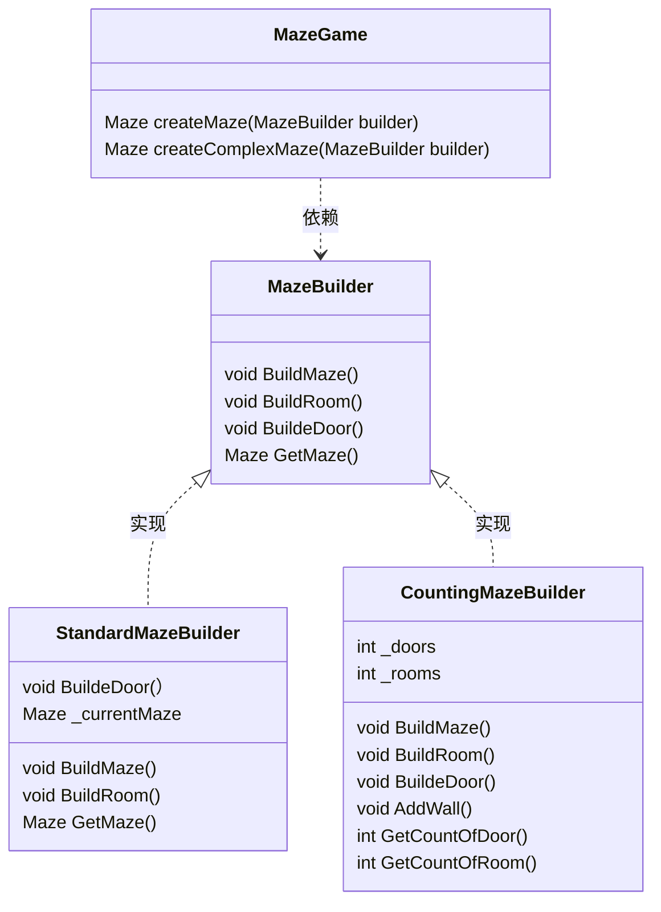

上述类图说明如下：
- 相比较于MazeFactory类的MakeXXX方法返回具体的组件对象，例如Maze、Room等，MazeBuilder类的buildXXX方法无返回值，当完成构造后，通过GetMaze方法获取最终的结果，即迷宫对象
- 一个特殊的CountingMazeBuilder类，它根本不创建迷宫，仅对创建不同种类的构件进行计数
- MazeBuilder可以仅为创建迷宫定义接口。由子类实现具体的工作
- 相比较于抽象工厂，Builder模式可以隐藏组件的类的层次结构。例如MazeGame并不关心Room和Door是否有公共的继承类或接口


## 3.3 <span id="3.3">FACTORY METHOD工厂方法</span>

类型：对象创建型模式

### 3.3.1 <span id="3.3.1">定义及类图</span>

工厂模式Factory Method定义一个用于创建对象的接口，让子类决定实例化哪个类。使实例化延迟到子类。

工厂模式的通用的类图结构如下：

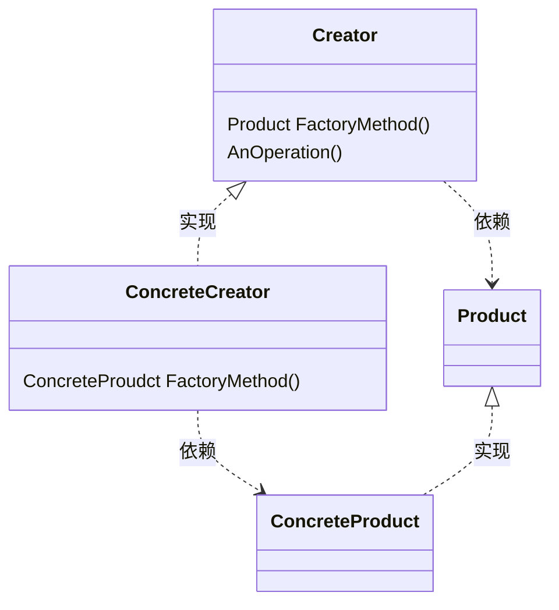
上述类图中
- Product是工厂方法创建的对象的接口或抽象类
- ConcreteProduct实现或继承Product
- Creator声明工厂方法，该方法返回一个Product类型的对象；Creator可以定义一个工厂方法的缺省实现，返回一个缺省的ConcreteProduct对象。可以调用工厂方法以创建一个Product对象
- ConcreteCreator重定义工厂方法以返回一个ConcreteProduct对象
- 优点：
  - 工厂方法不再将与特定应用有关的类绑定到你的代码中。代码仅处理Product类；因此它可以与用户扩展继承的任何ConcreteProduct类一起使用
- 缺点：
  - 仅仅为了创建一个特定的ConcreteProduct对象，就不得不创建Creator类的子类


工厂方法有两种实现效果，
1. 为子类提供挂钩hook，在类的内部创建对象比直接创建对象更灵活。给子类一个挂钩以提供对象的扩展版本
2. 连接平行的类层次。当一个类将它的一些职责委托给一个独立的类的时候，就产生平行类层次。

平行类层次的类图结构示意图如下：

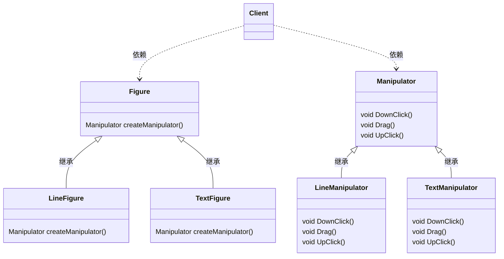
Figure类可以实现createManipulator方法，返回一个默认Manipulator的实例，而Figure子类可以继承这个默认的缺省实现--这样只是部分平行。

工厂方法的实现考虑下列问题：
- 主要有两种不同的情况：
  1. Creator类是接口或抽象类，不提供所声明工厂方法的实现
  2. Creator类是具体类或抽象类，为工厂方法提供一个缺省的实现。它所遵循的准则是：*用一个独立的操作创建对象，这样子类才能重定义它们的创建方法*
- 参数化工厂方法。
  - 工厂方法采用一个标识要被创建对象种类的参数。工厂方法创建的对象将共享Product接口
  - 重载一个参数化的工厂方法可以简单而有选择性的扩展或改变一个Creator生产的产品
    参数化工厂方法Create的示例：
    ```Java
    class Creator {
        public Creator(){}

        public Prodcut Create(ProductId id) {
            switch (id) {
                case PRODUCT_1:
                    return new Product1();
                case PRODUCT_2:
                    return new Product2();
                default:
                    return new Product1();
            }
        }
    }
    ```
- 特定语言的变化和问题。
  - 在Creator类的构造函数里不要调用工厂方法
  - lazy intialization
- 使用模板以避免创建子类*针对特定语言，类如C++*
- 命名约定


### 3.3.2 <span id="3.3.2">应用场景</span>

适用的场景包括：
- 当一个类不知道它必须创建的对象的类的时候
- 当一个类希望由它的子类来指定它所创建的对象的时候
- 当类将创建对象的职责委托给多个帮助子类中的某一个，并且你希望将哪一个帮助子类是代理者这一个信息局部化的时候


#### 3.3.2.1 <span id="3.3.2.1">迷宫的优化</span>

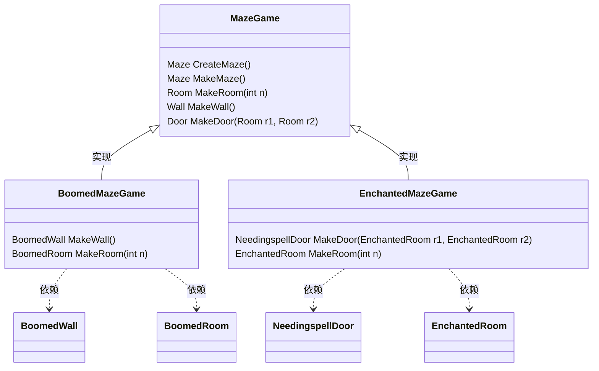
上述类图结构说明如下：
- 改造MazeGame类，增加工厂方法MakeMaze、MakeRoom、MakeDoor、MakeWall
- BoomedMazeGame、EnchantedMazeGame继承扩展MazeGame类，以提供特殊的Room及Door等对象

-MazeGame类的createMaze提供默认的迷宫实现
```Java
public class MazeGame {
    Maze createMaze(MazeFactory factory) {
        Maze maze = MakeMaze();
        Room r1 = MakeRoom(1);
        Room r2 = Room(2);
        Door door = MakeDoor(r1, r2);
        
        maze.addRoom(r1);
        maze.addRoom(r2);
        r1.setSide(North, MakeWall());
        r1.setSide(East, door);
        r1.setSide(West, MakeWall());
        r1.setSide(South, MakeWall());

        r2.setSide(North, MakeWall());
        r2.setSide(East, MakeWall());
        r2.setSide(West, door);
        r2.setSide(South, MakeWall());
        
        return maze;
    }
}
```
上述代码与抽象工厂分析比较如下
- 对象创建
  - 工厂方法Factory Method模式下，MazeGame类实现工厂方法MakeMaze、MakeRoom、MakeDoor、MakeWall，由createMaze调用MazeGame类的工厂方法（抽象方法）创建对象，代替原始的new操作符，实例化一个具体的类。
  - 抽象工厂Abstract Factory模式下，通过引入Facotry类，实例化MazeGame类时引入Facotry类的对象，由createMaze调用其依赖的Facotry类的方法MakeRoom、MakeDoor、MakeWall创建对象
- 对象灵活扩展
  - 工厂方法通过继承MazeGame类，增加不同的迷宫的构件类型
  - 抽象工厂通过不同的抽象工厂类，增加不同的迷宫的构件类型
- 小结
  - 结合到具体的迷宫，工厂方法通过实现多个MazeGame来扩展迷宫构件类型
  - 抽象工厂类，通过增加工厂方法，提供不同迷宫构件的套件。
  - 3.1节中**抽象工厂的实现可以采用工厂方法。**进一步增加理解


## 3.4 <span id="3.4">PROTOTYPE 原型</span>

类型：对象创建型模式

### 3.4.1 <span id="3.4.1">定义及类图</span>

用原型实例指定创建对象的种类，并且通过拷贝这些原型创建新的对象

工厂模式的通用的类图结构如下：

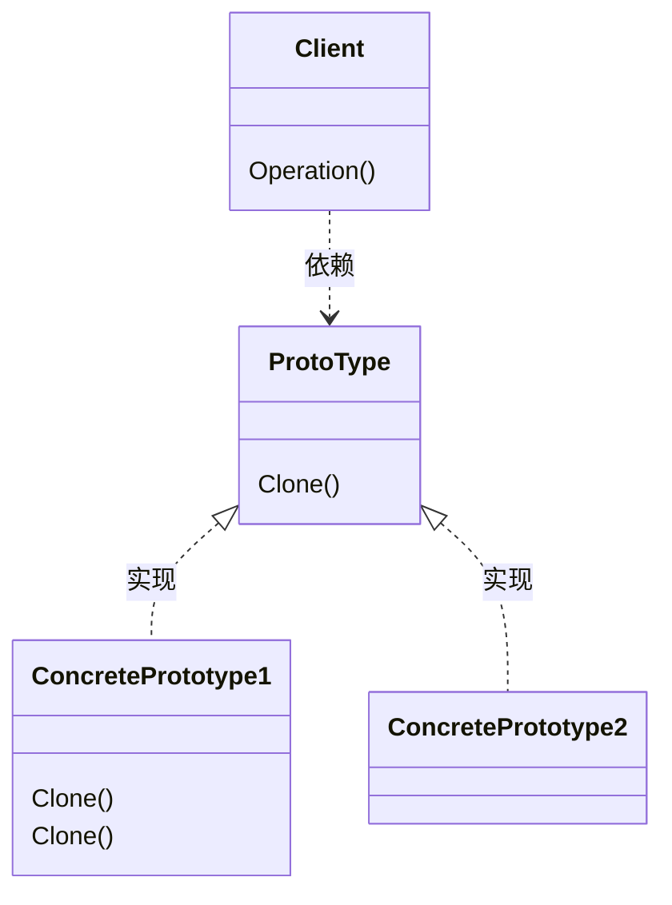
上述类图说明如下：
- Prototype声明一个克隆自身的接口
- ConcretePrototype实现一个克隆自身的操作
- Client让一个原型克隆自身从而创建一个新的对象

PROTOTYPE模式的作用及优缺点：
- 原型模式和Abstract Factory及Buidler模式一样，对客户隐藏了具体的产品类
- 使得客户无需改变即可使用与特定应用相关类
- 原型模式有如下优点：
  -  运行时刻增加和删除产品
  -  改变值以指定新对象
  -  改变结构以指定新对象
  -  减少子类构造
  -  用类动态配置应用


原型模式的实现需要考虑如下问题：
- 使用一个原型管理器，当一个系统中原型数目不固定时，要保持一个可用原型的注册表。这个注册表称为原型管理器
- 实现克隆操作，原型模式最大的困难在于正确的实现Clone操作，当对象包含循环引用时，这尤为棘手。
- 初始化克隆对象 部分程序需要使用一些值来初始化对象。一般说来，克隆操作时传递参数会破坏克隆接口的统一性。


### 3.4.2 <span id="3.4.2">应用场景</span>

适用的场景包括：
- 当一个系统应该独立于它的产品创建、构成和表示时，要使用原型模式
- 当要实例化的类是在运行时刻指定时，例如动态装载
- 为了避免创建一个于产品类层次平行的工厂类层次时
- 当一个类的实例只能由几个不同状态组合中的一种时。建立相应数目的原型并克隆它们可能比每次用合适的状态手工实例化该类更方便一些


#### 3.4.2.1 <span id="3.4.2.1">迷宫的优化</span>
将定义3.2.2.1节中[MazeFactory](#3.2.2.1)的子类MazePrototypeFactory。该子类将要要使用对象的原型来初始化，这样不需要仅为了改变墙壁或房间而生成子类了

迷宫示例结合原型模式（基于抽象工厂模式），部分新增及修改的UML类图如下：

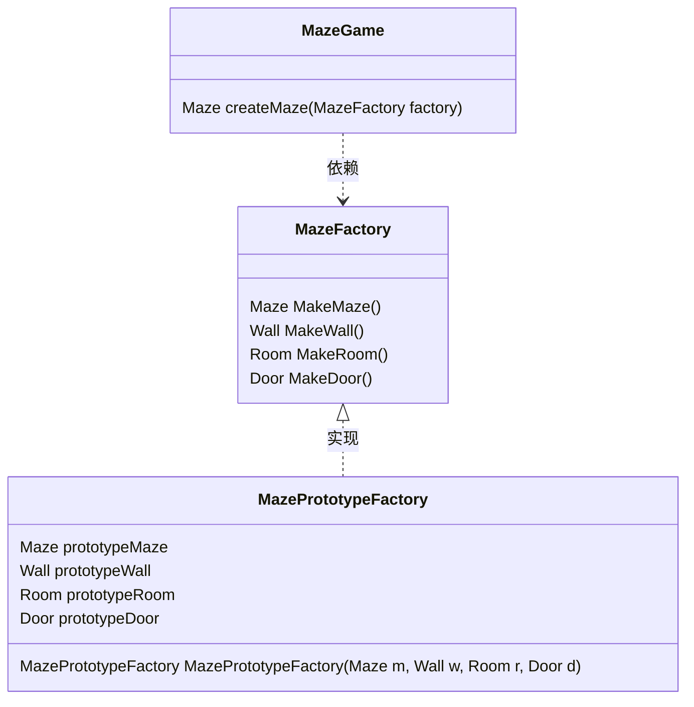
结合迷宫原型类图，其关键方法的实现说明：
- 遵循原型模式的通用类图定义，每个原型产品墙壁、房间和门都定义clone()接口
- 用于创建墙壁、房间和门的成员函数是相似的：每个的都要克隆一个原型，然后初始化。举例说明MazePrototypeFactory类中MakeWall和MakeDoor的成员方法的代码实现：
  ```Java
  public Wall MakeWall() {
    return prototypeWall.clone();
  }

  public Door MakeDoor(Room r1, Room r2) {
    Door door = prototypeDoor.clone();
    door.initialize(r1, r2);
    return door;
  }
  ```
- 只需使用基本迷宫构件的原型进行初始化，就可以由来创建一个原型的缺省的迷宫
  ```Java
  MazeGame game;
  MazePrototypeFactory prototype = new MazePrototypeFactory(
    new Maze(),new Wall(),
    new Roow(), new Door())
  
  Maze maze = game.CreateMaze(prototype)
  ```
- 为了改变迷宫的类型，用一个不同的原型结合来初始化MazePrototypeFactory，下面调用一个BoomedDoor及BoomedRoom来创建一个迷宫
  ```Java
  MazePrototypeFactory prototype = new MazePrototypeFactory(
    new Maze(),new Wall(),
    new BoomedRoom(), new BoomedDoor())
  ```


## 3.5 <span id="3.5">SINGLETON 单例</span>

类型：对象创建型模式

### 3.5.1 <span id="3.5.1">定义及类图</span>

保证一个类仅有一个实例，并提供一个访问它的全局点

单例模式的通用的类图结构如下：

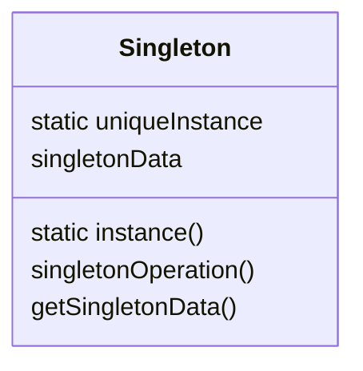
上述类图Singleton类说明如下：
- 定义一个instance操作，允许客户访问它的唯一实例
- 可能负责创建它自己的唯一实例


Singleton模式作用及优缺点：
- 只能通过Singleton的instance操作访问一个Singleton实例，
- 对唯一实例的受控访问
- 缩小名空间，单例模式是对全局变量的一种改进
- 允许对操作和表示的精化，Singleton类可以有子类，而且用这个扩展类的实例来配置一个应用是很容易的。
- 允许可变数目的实例
- 比类操作更灵活


单例模式的实现跟语言相关，单例模式需要考虑的实现问题：
- 保证一个唯一的实例
- 创建Singleton类的子类, 与其说定义子类不如说建立它的唯一实例，这样外部程序就可以使用它。
  - 指向单例实例的变量必须用子类的实例进行初始化
  - 另一个选择Singleton子类的方法是将Instance的实现从父类中分离出来并将它放入子类
  - 一个更灵活的方法是使用一个单例注册表，这个注册表在单例名称和单例实例之间建立映射。


### 3.5.2 <span id="3.5.2">应用场景</span>

适用的场景包括：
- 当类只能有一个实例而且客户可以从一个众所周知的访问点访问它时
- 当这个唯一实例应该是通过子类化可以扩展的，并且客户无需更改代码就能使用一个扩展的实例时。


#### 3.5.2.1 <span id="3.5.2.1">迷宫的优化</span>

基于抽象工厂模式，定义了MazeFactory类用于建造迷宫。MazeFactory定义了一个建造迷宫不同部件的接口。子类可以重新定义这些操作以返回特定产品类的实例，例如用BoomedWall对象代替普通的Wall对象。由于：
1. Maze应用仅需迷宫工厂的一个实例
2. 且这个实例对建造迷宫任何部件的代码都是可用的
这样就引入Singleton模式，将MazeFactory作为单例，我们无需借助全局变量就可以使迷宫对象具有全局可访问性。
不存在MazeFactory子类的情况下，代码优化如下：
```Java
public class MazeFactory {
    private MazeFactory instance;

    public static  MazeFactory instance() {
        if (instance == null) {
            instance = new MazeFactory()
        }
        return instance;
    }

    protected MazeFactory() {}
}
```

考虑当存在MazeFactory的多个子类时，而且应用必须决定使用哪个子类的情况下：
- 通过环境变量选择迷宫的种类或由应用指定迷宫的类型
- 通过lookup选择单例注册表，返回指定类型的MazeFactory子类


## <span id="A">附录A 其他</span>

> <https://mermaid.js.org/>

### <span id="A.1">A.1 UML示例</span>

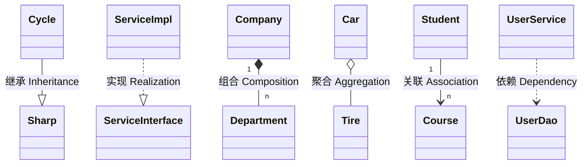

### <span id="A.2">A.2 时序图</span>

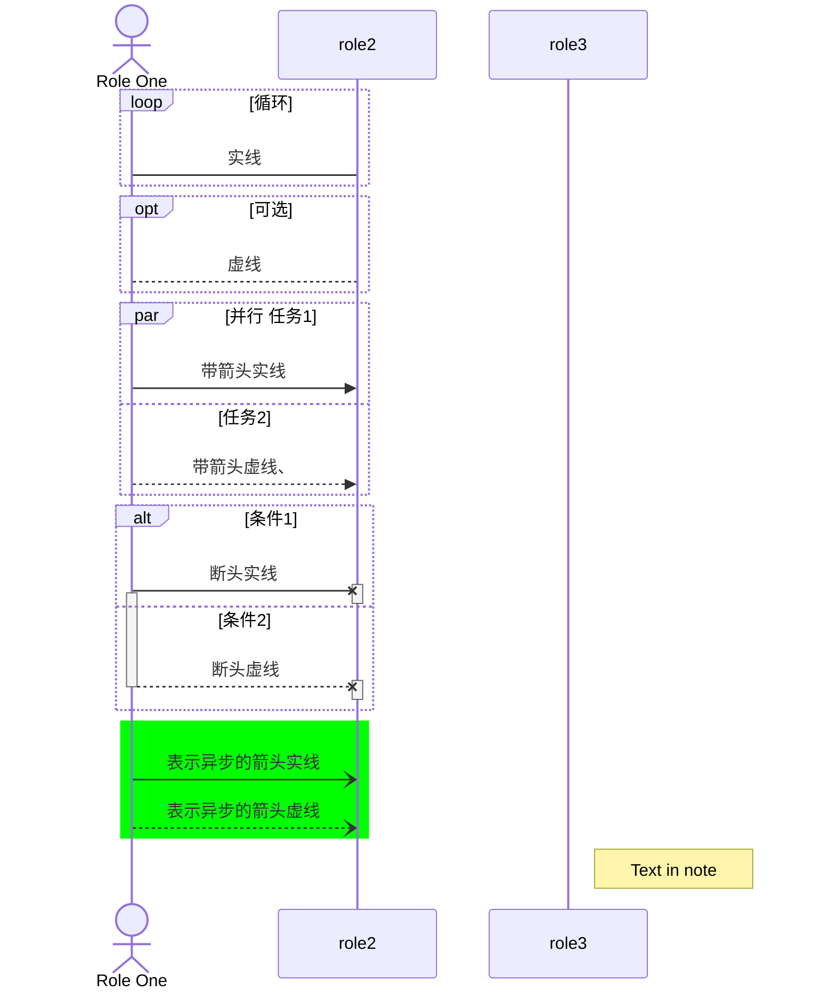
- 注意activate及deactivate区域标记
- 说明网易云笔记不支持如下标记，因此在示例中未展示
  - break
  - critical
