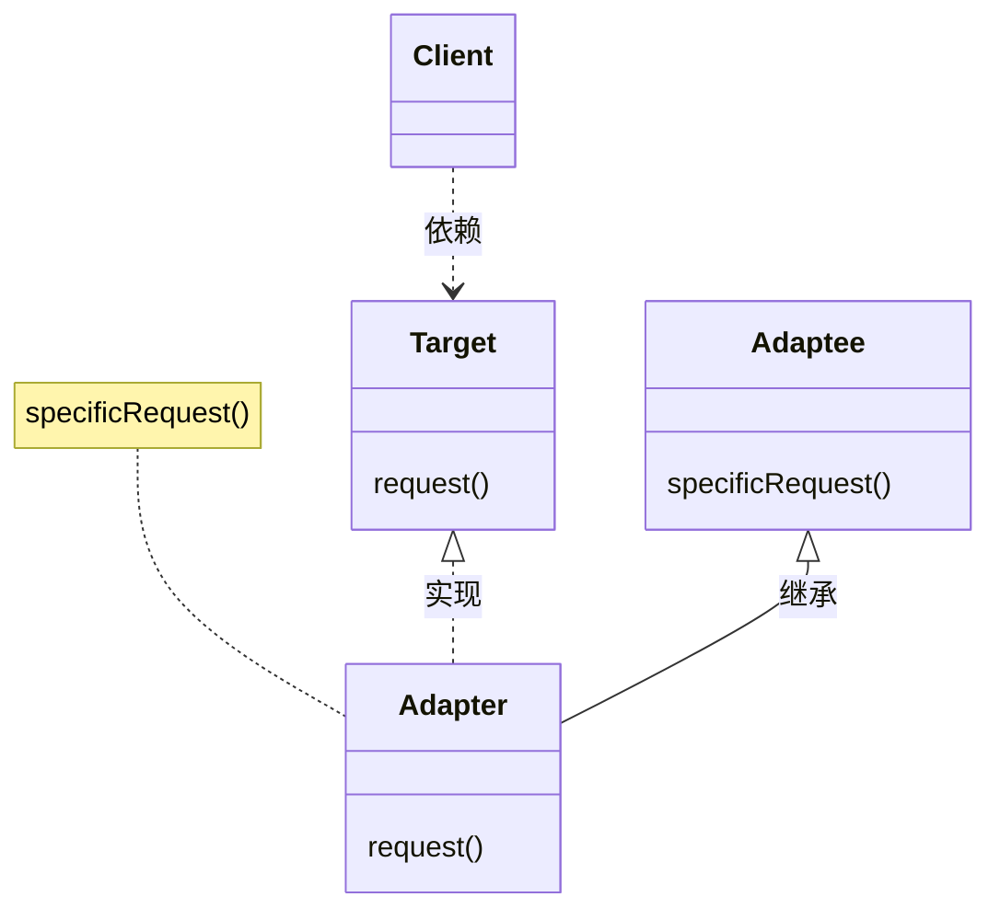
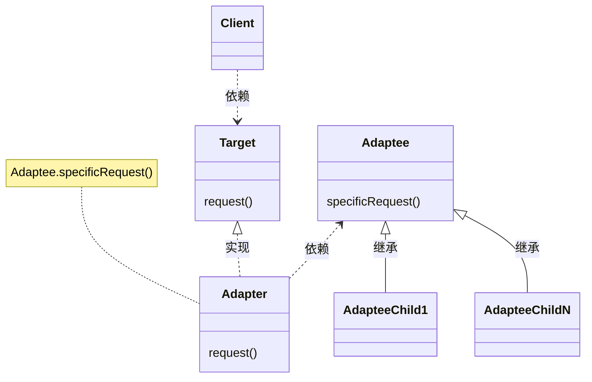
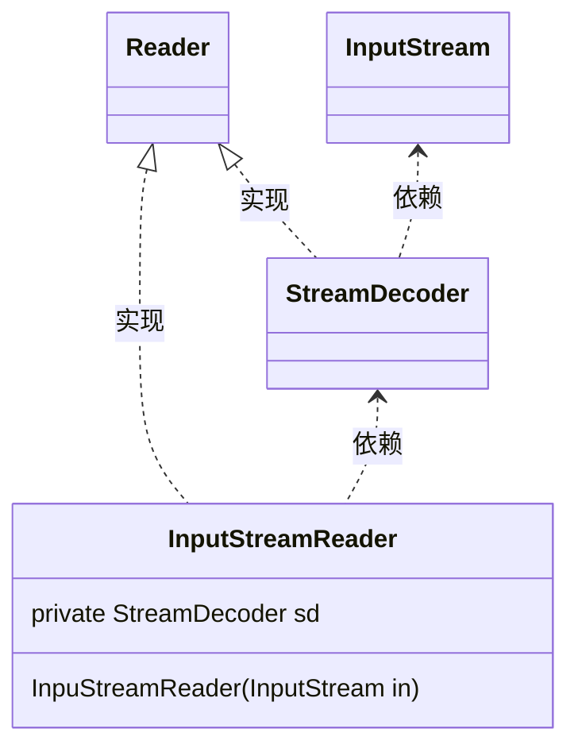
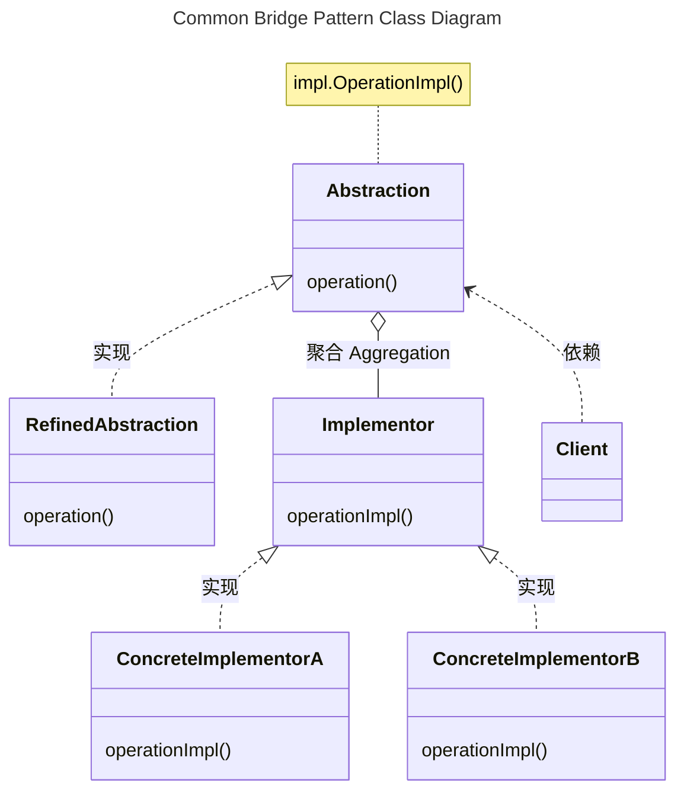
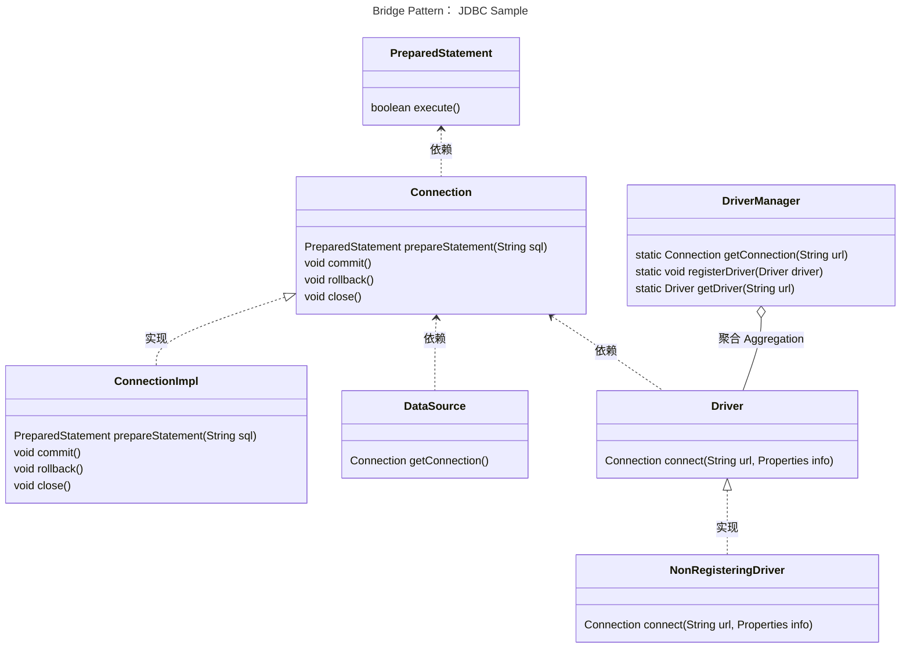
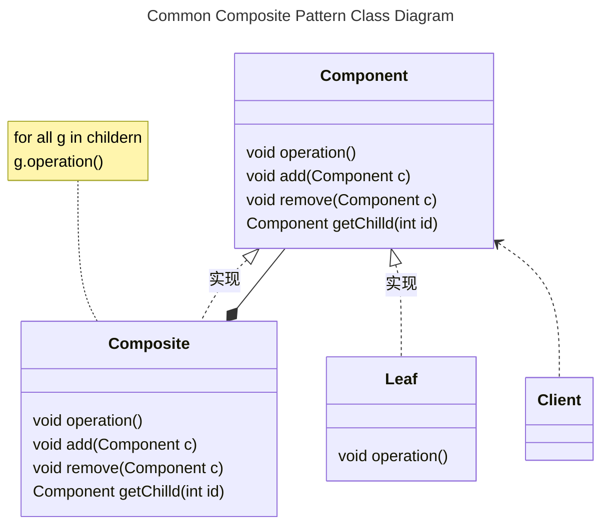

[TOC]


# 四、结构型模式
结构型模式涉及到如何组合类和对象以获得更大的结构。

- 结构型类模式
  采用继承机制来组合接口或实现，这一模式尤其有助于多个独立开的类库协同工作
- 结构型对象模式
  不是对接口和实现进行组合，而是描述了如何对一些对象进行组合，从而实现新功能的一些方法
  因为可以在运行时刻改变对象的组合关系，所以对象组合模式具有更大的灵活性。而这种机制用静态类组合是不可能实现的

> 思考：**体会两种模式的差异**
除了Adapter适配器模式是类对象结构型模式，其他Bridge桥接模式、Composite组成模式都是对象结构型模式。


## 4.1 <span id="4.1">ADAPTER 适配器</span>

类型：类对象结构型模式

### 4.1.1 <span id="4.1.1">定义及类图</span>

将一个类的接口转化为客户希望的另外一个接口。使得原本由于接口不兼容的而不能一起工作的类可以一起工作。也成为包装器Wrapper。

Adapter 适配器的通用UML类图如下：

- 类适配器使用多重继承对一个接口与另一个接口进行匹配

Adapter的实现specificRequest方法

- 对象匹配器依赖于对象组合

Adapter的调用adaptee.specificRequest方法


上述类图说明如下：
- Target，定义Client使用的特定领域相关的接口
- Client，与符合Target接口的对象协同
- Adaptee，定义一个已经存在的接口，这个接口需要适配
- Adapter，对Adpatee的接口与Target接口进行适配

Client在Adapter实现上调用一些操作，接着适配器调用Adaptee的操作实现这个请求

Adapter模式可以使用类适配器和对象适配器两种类型（比较上述两个类图结构），需要根据情况进行权衡
- 使用类适配器
  - 用一个具体的Adapter类对Adaptee和Target进行匹配。<font color="Red">*结果是当想要匹配一个类及所有它的子类是，类Adapter将不能胜任*</font>
  - 使得Adapter可以重定义Adaptee的部分行为，因为Adapter是Adaptee的一个子类
  - 仅仅引入一个对象，不需要额外的指针以间接得到Adaptee
  - **补充**对于类似Java不支持多重继承的语言，Target应定义为一个接口，而Adaptee可以是一个类
- 使用对象适配器
  - 允许Adapter与多个Adaptee，即Adaptee本身及其它的所有子类同时工作。Adaptee可以一次给所有的Adaptee添加功能
  - <font color="Red">*使得重定义Adaptee的行为比较困难。*</font>这就需要生成Adaptee的子类并且使得Adapter因为子类而不是Adaptee本身


使用Adapter模式需要考虑的一些其他因素有：
1. Adatper的匹配程度。Adapter的工作量取决于Target接口与Adaptee接口的相似程度
2. 可插入的Adatper
   - 当其他类使用一个类时，如果所需的假定条件越少，这个类就更具可复用性
   - 如果将接口匹配构建为一个类，就不需要假定对其他的类可见的是一个相同的接口。也就是说接口匹配，使得可以将自己的类加入到一些现有的系统中去
     > go语言的特性是更好的支持可插入Adapter
3. 使用双向适配器提供透明操作。一个潜在的问题，它不对所有的客户都透明。被适配的对象不再兼容Adaptee接口，因此并不是所有的Adaptee对象可以被使用的地方它都可以被使用。双向适配器提供了这样的透明性。在两个不同的客户需要用不同的方式查看同一个对象时，双向适配器尤其有用


实现Adapter模式，需要注意的一些问题：
1. 使用C++实现适配器类
2. 可插入的适配器，有三种方法可以实现可插入的适配器。首先为Adaptee找到一个“窄”接口，即可用于适配的最小操作集。包含较少的操作的“窄”接口更容易进行匹配，对于“窄”接口有以下三个实现途径：
   - 使用抽象操作，在Target类中定义“窄”Adaptee接口相应的抽象方法。由Adapter子类来实现这些抽象方法，并调用Adaptee接口来匹配具体的实现。
     ```mermaid
     classDiagram
     class TreeDisplay {
       getChildren(Node node)
       createGraphicNode(Node node)
       display()
       buildTree()
     }
     
     class DirectoryTreeDisplay {
       getChildren(Node node)
       createGraphicNode(Node node)
     }

     TreeDisplay<|.. DirectoryTreeDisplay : 实现
     FileSystemEntity <.. DirectoryTreeDisplay : 依赖
     ```
     上述类图中，
     - TreeDisplay承担Client和Target角色任务
     - DirectoryTreeDisplay承担Adapter角色任务
     - FileSystemEntity承担Adaptee角色任务

   - 使用代理对象，客户将请求发送到代理对象Target，客户进行一些选择，并将这些选择提供给代理对象，这样客户就可以对Adapter加以控制
     ```mermaid
     classDiagram
     class TreeDisplay {
       setDelegate(Delegate delegate)
       display()
       buildTree()
     }
     
     class TreeAccessorDelegate {
       getChildren(TreeDisplay display, Node node)
       createGraphicNode(TreeDisplay display, Node node)
     }

     class DirectoryBrowser {
       getChildren(TreeDisplay display, Node node)
       createGraphicNode(TreeDisplay display, Node node)
       createFile()
       deleteFile()
     }

     TreeAccessorDelegate <.. TreeDisplay : 依赖
     TreeAccessorDelegate <|.. DirectoryBrowser : 实现
     TreeDisplay <.. DirectoryBrowser : 依赖
     FileSystemEntity <.. DirectoryBrowser : 依赖
     ```
     上述类图中，
     - TreeDisplay承担Client角色任务
     - TreeAccessorDelegate承担Target角色任务
     - DirectoryBrowser承担Adapter角色任务
     - FileSystemEntity承担Adaptee角色任务

   - 参数化的适配器，用一个或多个模块对适配器进行参数化。


### 4.1.2 <span id="4.1.2">应用场景</span>

适用的场景包括：
- 需要要使用一个已经存在的类，而它的接口不符合你的需求
- 需要创建一个可以复用的类，该类可以与其他不相干的类或不可预见的类协同工作
- 需要使用一些已经存在的类，但是不可能对每一个都进行子类化以匹配他们的接口。对象适配器可以适配它的父类接口


### 4.1.2.1 <span id="4.1.2.1">MyBatis</span>


### 4.1.2.2 <span id="4.1.2.2">java.io.InputStreamReader</span>

InputStreamReader(InputStream in)构造函数，返回Reader接口的实现类


上述类图说明如下
- InputStreamReader、StreamDecoder、Reader为JDK中的类
- 其中InputStreamReader实现将InputStream接口转换为Reader接口，InputStream和Reader接口的差异如下：
  - InputStreamReader是用来读取字节流的
  - Reader是用来读取字符的，因此Reader和字符的编码结构相关，特别是涉及到ASCII码之外的语言编码
- InputStreamReader、StreamDecoder承担Adapter角色，将封装一个InputStream对象，并实现Reaer接口
- Reader为Target角色
- InputStream承担Adaptee角色

详情可参见StreamDecoder类中实现Reader接口中read方法的代码实现。读取InputStream中字节流，并根据编码要求，转换为字符流。


## 4.2 <span id="4.2">BRIDGE 桥接</span>

类型：对象结构型模式

### 4.2.1 <span id="4.2.1">定义及类图</span>

将抽象部分与它的实现部分分离，使得它们都可以独立的变化

动机
由于继承机制有两个不足之处：
- 不同种类的扩展，即继承一个父类，都需要定义一整套实现类。新增一套类型扩展，需要定义一整套类实现相关接口
- 继承机制使得客户代码于平台（Windows，linux，mac）和语言相关，很难将客户代码移植到其他平台和语言上去
BRIDGE桥接模式将类的抽象和定义于实现分离开，即以下类图中Abstraction及Implementor的分离


Bridge 桥接的通用UML类图如下：


上述桥接模式的类图说明如下：
- Abstraction，定义抽象类的接口，维护一个指向Implementor类型对象
- RefinedAbstraction， 扩充由Abstraction定义的接口
- Implementor，定义实现类的接口。
  - 该接口不一定与Abstraction的接口完全一致
  - 一般来讲，Implementor接口仅提供基本操作，而Abstraction则定义了基于这些基本操作的较高层次的操作。
- ConcreteImplementor，实现Implementor接口并定义它的具体实现


Bridge桥接模式的优点：
- 分离接口及其实现部分。
  - 一个实现未必不变的绑定在一个接口上。抽象类的实现可以在运行时刻进行配置，一个对象甚至可以在运行时刻改变它的实现。
  - 接口与实现的分离有助于分层，从而产生更好的结构化系统，系统的高层仅需知道Abstraction及Implementor即可
- 提高可扩充性，独立的扩充Abstraction及Implementor
- 实现细节对客户透明


实现Bridge桥接模式需要注意的问题：
- 仅有一个Implementor。仅有一个类是Bridge桥接模式退化的情况，没有必要创建一个抽象的Implementor类
- 创建正确的Implementor对象
- 共享Implementor对象
- 采用多重继承机制


### 4.2.2 <span id="4.2.2">应用场景</span>

适用的场景包括：
- 不希望在抽象和它的实现部分之间有一个固定的绑定关系
- 类的抽象以及它的实现都应该可以通过生成子类的方法加以扩充。Bridge模式使得可以对不同的抽象接口和实现部分进行组合，并分别对他们进行扩充。
- 对一个抽象的实现部分的修改应对客户的不产生影响，即客户代码不必重新编译
- 由于许多类要生成，这样一种类层次结构说明，需要将一个对象分解成两个部分，抽象定义和实现，通过桥接代替继承
- 需要在多个对象间共享实现，但同时要求客户并不知道这一点


### 4.2.2.1 <span id="4.2.2.1">JDBC API</span>

桥接模式允许抽象和实现之间的分离，以便它们可以彼此独立开发，但仍然有一种方式或桥梁来共存和交互。

Java 中的一个例子是 JDBC API。 它充当 Oracle、MySQL 和 PostgreSQL 等数据库及其特定实现之间的链接。

JDBC API 是一组标准接口，例如 Driver、Connection 和 ResultSet，仅举几例。 这使不同的数据库供应商可以有各自的实现。

从客户的视角
```java
// url is a String that can represent any database vendor.
// postgresql Vendor
// String url = "jdbc:postgresql://localhost/demo";

// MySQL Vendor
String url = "jdbc:mysql://localhost/demo";
Connection connection = DriverManager.getConnection(url);

```

jdbc的java.sql, javax.sql的桥接模式定义以及Implementor的具体实现示例mysql-connector-j的核心类图如下：



上述桥接模式的类图说明如下：
- 类DriverManager承担Bridge模式的Abstraction
- Driver、Connection以及PreparedStatement一系列接口，定义了Implementor的接口功能要求
- NonRegisteringDriver及ConnectionImpl为msyql-connector-j项目中，实现Implementor接口的一系列的扩展接口和类
- **个人理解**：接口javax.sql.DataSource承担RefinedAbstraction角色（*DataSource未继承DriverManager接口*）。
  - DataSource对象是Connection的物理数据源的工厂， 作为DriverManager的替代方法
  - DataSource对象是获取连接的首选方法。
  - 实现DataSource接口的对象通常会注册到基于JNDI的命名服务。


## 4.3 <span id="4.2">COMPOSITE 组合</span>

类型：对象结构型模式

### 4.3.1 <span id="4.3.1">定义及类图</span>

将对象组合成树形结构以表示“部分-整体”的层次结构。Composite组合模式使得用户对单个对象和组合对象的操作具有一致性。

动机
- 使用类似元件和容器的类时，对于开发者需要区别对待元件和容器对象，但对于用户而言，它们是一样的。对于不同类的区别适用，使得程序更加复杂


Composite组合模式的通用UML类图如下：


上述类图说明如下：
- Component，该模式的关键是定义一个抽象类，它**既可以**代表<u>图元</u>，**又**可以代表<u>图元的容器</u>。
  - 为组合中的对象声明接口
  - 在适当的情况下，实现所有类共有接口的缺省行为
  - 声明一个接口，拥有访问和管理Component的子组件
  - (Optional) 在递归结构中定义一个接口，用于访问一个父部件，并在合适的情况下实现它。
- Leaf
  - 在组合中表示叶节点对象，叶节点没有子节点
  - 在组合中定义图元对象的行为
- Composite
  - 定义有子部件的那些部件的行为
  - 存储子部件
  - 在Component接口中实现与子部件有关的操作
- Client，通过Component接口操纵组合部件的对象


Composite组合模式优缺点：
优点：
- 定义了包含基本对象和组合对象的类层次结构
- 简化客户代码， 可以一致的使用组合结构和单个对象
- 使得更容易增加新类型的组件， 客户程序不需要增加新的Component类而改变
- 补充：
  - 你可以利用多态和递归机制更方便地使用复杂树结构。
  - 开闭原则。 无需更改现有代码， 你就可以在应用中添加新元素， 使其成为对象树的一部分。
缺点：
- 使你的设计变得更加一般化。对于功能差异较大的类，提供公共接口或许会有困难。在特定情况下，你需要过度一般化组件接口，使其变得令人难以理解。
- 很难限制组合中的组件。


实现Composite组合模式的关注的问题：
1. 显示的父部件引用
2. 共享组件
3. 最大化Component接口
4. 声明管理子部件的操作
5. Component是否该实现一个Component列表
6. 子部件排序
7. 使用高速缓冲存储改善性能
8. 应该由谁删除Component
9. 存储组件最好用哪一种数据结构


### 4.3.2 <span id="4.3.2">应用场景</span>

适用的场景包括：
- 想表示对象的部分-整体层次结构
- 希望用户忽略组合对象和单个对象的不同，用户将统一使用组合对象中的所有对象


### 4.3.2.1 <span id="4.3.2.1">java.util.Map</span>

java.util.Map#putAll(Map)


