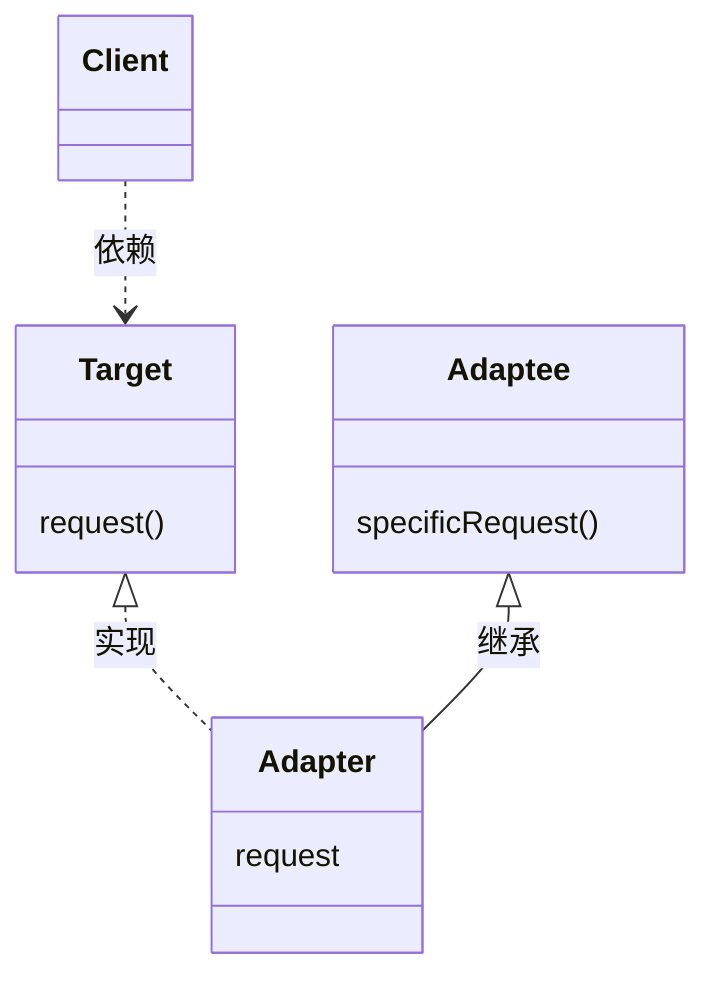
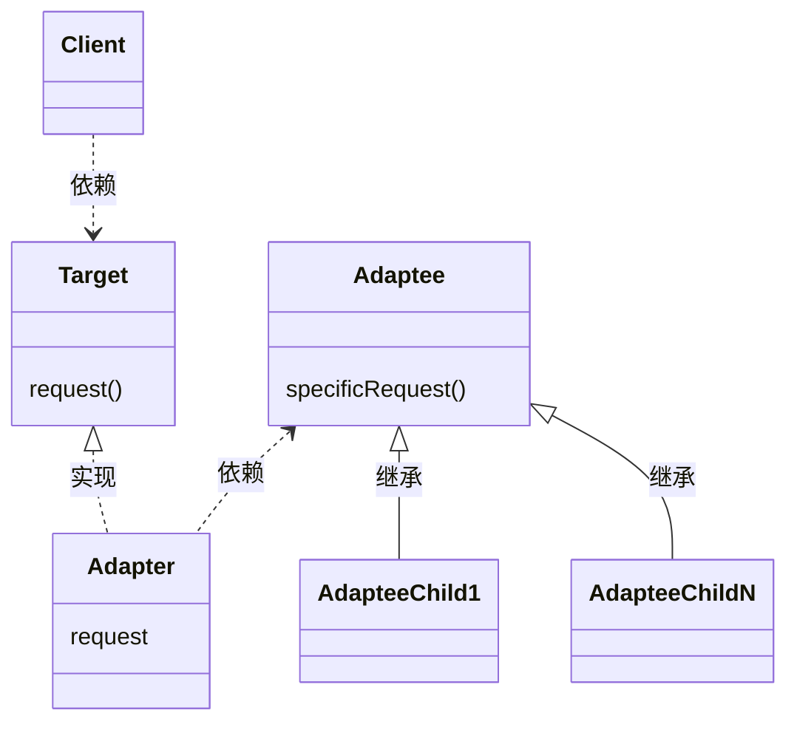
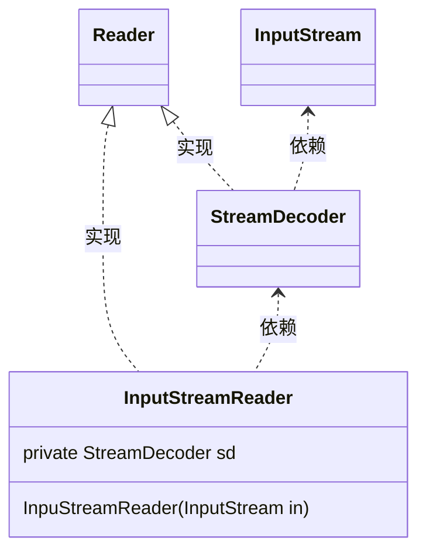
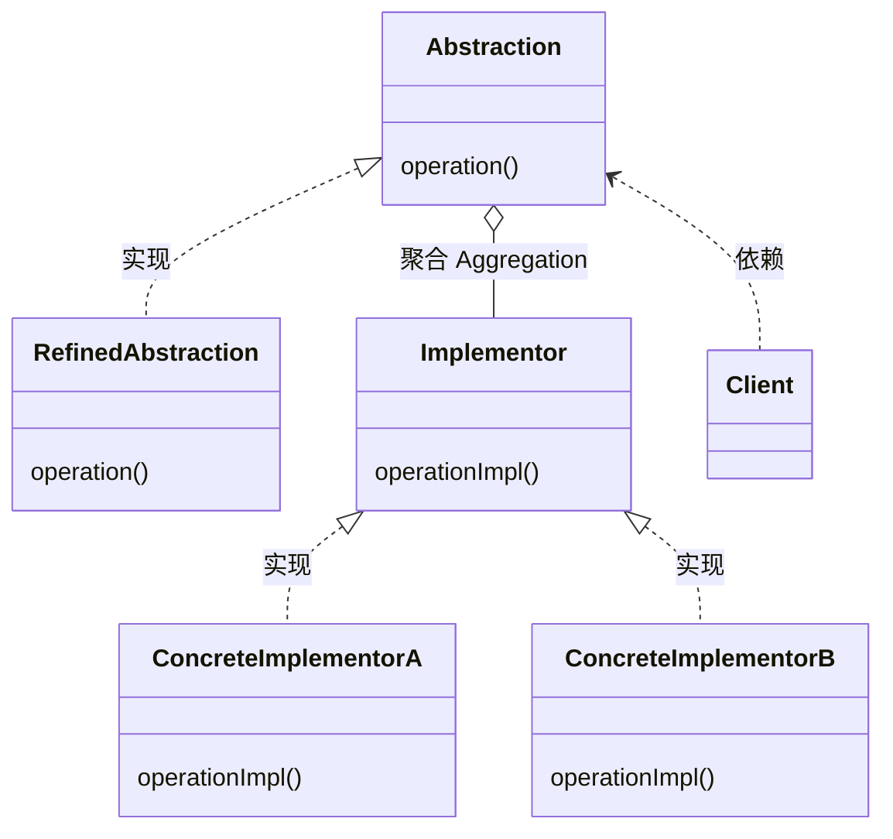

[TOC]


# 四、结构型模式
结构型模式涉及到如何组合类和对象以获得更大的结构。

- 结构型类模式
  采用继承机制来组合接口或实现，这一模式尤其有助于多个独立开的类库协同工作
- 结构型对象模式
  不是对接口和实现进行组合，而是描述了如何对一些对象进行组合，从而实现新功能的一些方法
  因为可以在运行时刻改变对象的组合关系，所以对象组合模式具有更大的灵活性。而这种机制用静态类组合是不可能实现的

> 思考：**体会两种模式的差异**
除了Adapter适配器模式是类对象结构型模式，其他Bridge桥接模式、Composite组成模式都是对象结构型模式。


## 4.1 <span id="4.1">ADAPTER 适配器</span>

类型：类对象结构型模式

### 4.1.1 <span id="4.1.1">定义及类图</span>

将一个类的接口转化为客户希望的另外一个接口。使得原本由于接口不兼容的而不能一起工作的类可以一起工作。也成为包装器Wrapper。

Adapter 适配器的通用UML类图如下：

- 类适配器使用多重继承对一个接口与另一个接口进行匹配

Adapter的实现specificRequest方法

- 对象匹配器依赖于对象组合

Adapter的调用adaptee.specificRequest方法


上述类图说明如下：
- Target，定义Client使用的特定领域相关的接口
- Client，与符合Target接口的对象协同
- Adaptee，定义一个已经存在的接口，这个接口需要适配
- Adapter，对Adpatee的接口与Target接口进行适配

Client在Adapter实现上调用一些操作，接着适配器调用Adaptee的操作实现这个请求

Adapter模式可以使用类适配器和对象适配器两种类型（比较上述两个类图结构），需要根据情况进行权衡
- 使用类适配器
  - 用一个具体的Adapter类对Adaptee和Target进行匹配。<font color="Red">*结果是当想要匹配一个类及所有它的子类是，类Adapter将不能胜任*</font>
  - 使得Adapter可以重定义Adaptee的部分行为，因为Adapter是Adaptee的一个子类
  - 仅仅引入一个对象，不需要额外的指针以间接得到Adaptee
  - **补充**对于类似Java不支持多重继承的语言，Target应定义为一个接口，而Adaptee可以是一个类
- 使用对象适配器
  - 允许Adapter与多个Adaptee，即Adaptee本身及其它的所有子类同时工作。Adaptee可以一次给所有的Adaptee添加功能
  - <font color="Red">*使得重定义Adaptee的行为比较困难。*</font>这就需要生成Adaptee的子类并且使得Adapter因为子类而不是Adaptee本身


使用Adapter模式需要考虑的一些其他因素有：
1. Adatper的匹配程度。Adapter的工作量取决于Target接口与Adaptee接口的相似程度
2. 可插入的Adatper
   - 当其他类使用一个类时，如果所需的假定条件越少，这个类就更具可复用性
   - 如果将接口匹配构建为一个类，就不需要假定对其他的类可见的是一个相同的接口。也就是说接口匹配，使得可以将自己的类加入到一些现有的系统中去
     > go语言的特性是更好的支持可插入Adapter
3. 使用双向适配器提供透明操作。一个潜在的问题，它不对所有的客户都透明。被适配的对象不再兼容Adaptee接口，因此并不是所有的Adaptee对象可以被使用的地方它都可以被使用。双向适配器提供了这样的透明性。在两个不同的客户需要用不同的方式查看同一个对象时，双向适配器尤其有用


实现Adapter模式，需要注意的一些问题：
1. 使用C++实现适配器类
2. 可插入的适配器，有三种方法可以实现可插入的适配器。首先为Adaptee找到一个“窄”接口，即可用于适配的最小操作集。包含较少的操作的“窄”接口更容易进行匹配，对于“窄”接口有以下三个实现途径：
   - 使用抽象操作，在Target类中定义“窄”Adaptee接口相应的抽象方法。由Adapter子类来实现这些抽象方法，并调用Adaptee接口来匹配具体的实现。
     ```mermaid
     classDiagram
     class TreeDisplay {
       getChildren(Node node)
       createGraphicNode(Node node)
       display()
       buildTree()
     }
     
     class DirectoryTreeDisplay {
       getChildren(Node node)
       createGraphicNode(Node node)
     }

     TreeDisplay<|.. DirectoryTreeDisplay : 实现
     FileSystemEntity <.. DirectoryTreeDisplay : 依赖
     ```
     上述类图中，
     - TreeDisplay承担Client和Target角色任务
     - DirectoryTreeDisplay承担Adapter角色任务
     - FileSystemEntity承担Adaptee角色任务

   - 使用代理对象，客户将请求发送到代理对象Target，客户进行一些选择，并将这些选择提供给代理对象，这样客户就可以对Adapter加以控制
     ```mermaid
     classDiagram
     class TreeDisplay {
       setDelegate(Delegate delegate)
       display()
       buildTree()
     }
     
     class TreeAccessorDelegate {
       getChildren(TreeDisplay display, Node node)
       createGraphicNode(TreeDisplay display, Node node)
     }

     class DirectoryBrowser {
       getChildren(TreeDisplay display, Node node)
       createGraphicNode(TreeDisplay display, Node node)
       createFile()
       deleteFile()
     }

     TreeAccessorDelegate <.. TreeDisplay : 依赖
     TreeAccessorDelegate <|.. DirectoryBrowser : 实现
     TreeDisplay <.. DirectoryBrowser : 依赖
     FileSystemEntity <.. DirectoryBrowser : 依赖
     ```
     上述类图中，
     - TreeDisplay承担Client角色任务
     - TreeAccessorDelegate承担Target角色任务
     - DirectoryBrowser承担Adapter角色任务
     - FileSystemEntity承担Adaptee角色任务

   - 参数化的适配器，用一个或多个模块对适配器进行参数化。


### 4.1.2 <span id="4.1.2">应用场景</span>

适用的场景包括：
- 需要要使用一个已经存在的类，而它的接口不符合你的需求
- 需要创建一个可以复用的类，该类可以与其他不相干的类或不可预见的类协同工作
- 需要使用一些已经存在的类，但是不可能对每一个都进行子类化以匹配他们的接口。对象适配器可以适配它的父类接口


### 4.1.2.1 <span id="4.1.2.1">MyBatis</span>


### 4.1.2.2 <span id="4.1.2.2">JDK</span>

InputStreamReader(InputStream in)构造函数，返回Reader接口的实现类




## 4.2 <span id="4.2">BRIDGE 桥接</span>

类型：对象结构型模式

### 4.2.1 <span id="4.2.1">定义及类图</span>

将抽象部分与它的实现部分分离，使得它们都可以独立的变化

Bridge 桥接的通用UML类图如下：


