[TOC]


# 四、结构型模式
结构型模式涉及到如何组合类和对象以获得更大的结构。

- 结构型类模式
  采用继承机制来组合接口或实现，这一模式尤其有助于多个独立开的类库协同工作
- 结构型对象模式
  不是对接口和实现进行组合，而是描述了如何对一些对象进行组合，从而实现新功能的一些方法
  因为可以在运行时刻改变对象的组合关系，所以对象组合模式具有更大的灵活性。而这种机制用静态类组合是不可能实现的

> 思考：**体会两种模式的差异**
除了Adapter适配器模式是类对象结构型模式，其他Bridge桥接模式、Composite组成模式都是对象结构型模式。


## 4.1 <span id="4.1">ADAPTER 适配器</span>

类型：类对象结构型模式

### 4.1.1 <span id="4.1.1">定义及类图</span>

将一个类的接口转化为客户希望的另外一个接口。使得原本由于接口不兼容的而不能一起工作的类可以一起工作。也成为包装器Wrapper。

Adapter 适配器的通用UML类图如下：

- 类适配器使用多重继承对一个接口与另一个接口进行匹配
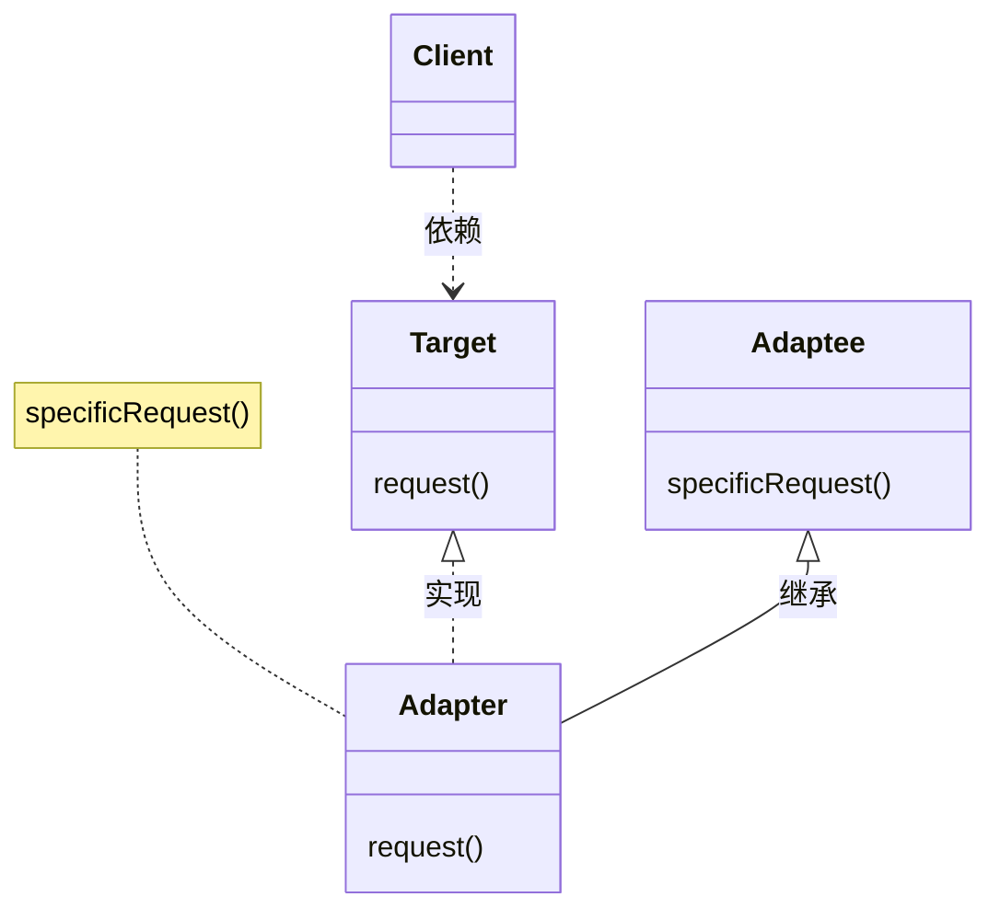
Adapter的实现specificRequest方法

- 对象匹配器依赖于对象组合
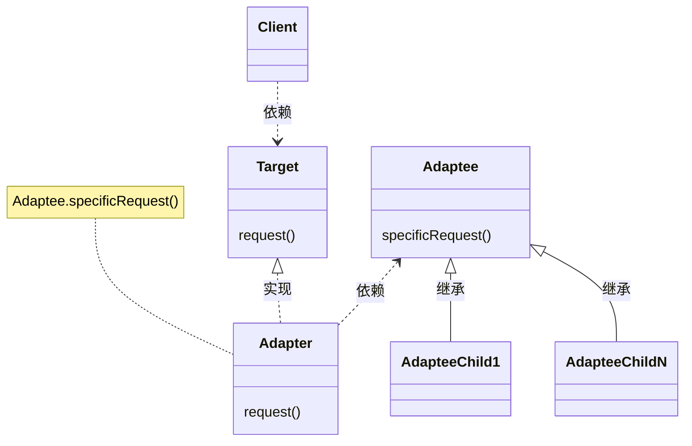
Adapter的调用adaptee.specificRequest方法


上述类图说明如下：
- Target，定义Client使用的特定领域相关的接口
- Client，与符合Target接口的对象协同
- Adaptee，定义一个已经存在的接口，这个接口需要适配
- Adapter，对Adpatee的接口与Target接口进行适配

Client在Adapter实现上调用一些操作，接着适配器调用Adaptee的操作实现这个请求

Adapter模式可以使用类适配器和对象适配器两种类型（比较上述两个类图结构），需要根据情况进行权衡
- 使用类适配器
  - 用一个具体的Adapter类对Adaptee和Target进行匹配。<font color="Red">*结果是当想要匹配一个类及所有它的子类是，类Adapter将不能胜任*</font>
  - 使得Adapter可以重定义Adaptee的部分行为，因为Adapter是Adaptee的一个子类
  - 仅仅引入一个对象，不需要额外的指针以间接得到Adaptee
  - **补充**对于类似Java不支持多重继承的语言，Target应定义为一个接口，而Adaptee可以是一个类
- 使用对象适配器
  - 允许Adapter与多个Adaptee，即Adaptee本身及其它的所有子类同时工作。Adaptee可以一次给所有的Adaptee添加功能
  - <font color="Red">*使得重定义Adaptee的行为比较困难。*</font>这就需要生成Adaptee的子类并且使得Adapter因为子类而不是Adaptee本身


使用Adapter模式需要考虑的一些其他因素有：
1. Adatper的匹配程度。Adapter的工作量取决于Target接口与Adaptee接口的相似程度
2. 可插入的Adatper
   - 当其他类使用一个类时，如果所需的假定条件越少，这个类就更具可复用性
   - 如果将接口匹配构建为一个类，就不需要假定对其他的类可见的是一个相同的接口。也就是说接口匹配，使得可以将自己的类加入到一些现有的系统中去
     > go语言的特性是更好的支持可插入Adapter
3. 使用双向适配器提供透明操作。一个潜在的问题，它不对所有的客户都透明。被适配的对象不再兼容Adaptee接口，因此并不是所有的Adaptee对象可以被使用的地方它都可以被使用。双向适配器提供了这样的透明性。在两个不同的客户需要用不同的方式查看同一个对象时，双向适配器尤其有用


实现Adapter模式，需要注意的一些问题：
1. 使用C++实现适配器类
2. 可插入的适配器，有三种方法可以实现可插入的适配器。首先为Adaptee找到一个“窄”接口，即可用于适配的最小操作集。包含较少的操作的“窄”接口更容易进行匹配，对于“窄”接口有以下三个实现途径：
   - 使用抽象操作，在Target类中定义“窄”Adaptee接口相应的抽象方法。由Adapter子类来实现这些抽象方法，并调用Adaptee接口来匹配具体的实现。
     ```mermaid
     classDiagram
     class TreeDisplay {
       getChildren(Node node)
       createGraphicNode(Node node)
       display()
       buildTree()
     }
     
     class DirectoryTreeDisplay {
       getChildren(Node node)
       createGraphicNode(Node node)
     }

     TreeDisplay<|.. DirectoryTreeDisplay : 实现
     FileSystemEntity <.. DirectoryTreeDisplay : 依赖
     ```
     上述类图中，
     - TreeDisplay承担Client和Target角色任务
     - DirectoryTreeDisplay承担Adapter角色任务
     - FileSystemEntity承担Adaptee角色任务

   - 使用代理对象，客户将请求发送到代理对象Target，客户进行一些选择，并将这些选择提供给代理对象，这样客户就可以对Adapter加以控制
     ```mermaid
     classDiagram
     class TreeDisplay {
       setDelegate(Delegate delegate)
       display()
       buildTree()
     }
     
     class TreeAccessorDelegate {
       getChildren(TreeDisplay display, Node node)
       createGraphicNode(TreeDisplay display, Node node)
     }

     class DirectoryBrowser {
       getChildren(TreeDisplay display, Node node)
       createGraphicNode(TreeDisplay display, Node node)
       createFile()
       deleteFile()
     }

     TreeAccessorDelegate <.. TreeDisplay : 依赖
     TreeAccessorDelegate <|.. DirectoryBrowser : 实现
     TreeDisplay <.. DirectoryBrowser : 依赖
     FileSystemEntity <.. DirectoryBrowser : 依赖
     ```
     上述类图中，
     - TreeDisplay承担Client角色任务
     - TreeAccessorDelegate承担Target角色任务
     - DirectoryBrowser承担Adapter角色任务
     - FileSystemEntity承担Adaptee角色任务

   - 参数化的适配器，用一个或多个模块对适配器进行参数化。


### 4.1.2 <span id="4.1.2">应用场景</span>

适用的场景包括：
- 需要要使用一个已经存在的类，而它的接口不符合你的需求
- 需要创建一个可以复用的类，该类可以与其他不相干的类或不可预见的类协同工作
- 需要使用一些已经存在的类，但是不可能对每一个都进行子类化以匹配他们的接口。对象适配器可以适配它的父类接口


#### 4.1.2.1 <span id="4.1.2.1">MyBatis</span>


#### 4.1.2.2 <span id="4.1.2.2">java.io.InputStreamReader</span>

InputStreamReader(InputStream in)构造函数，返回Reader接口的实现类

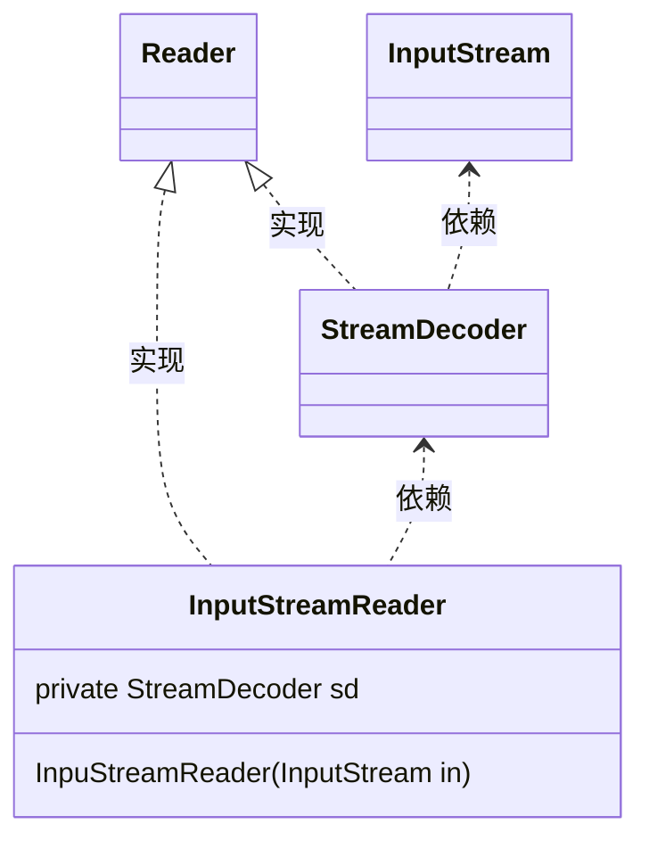
上述类图说明如下
- InputStreamReader、StreamDecoder、Reader为JDK中的类
- 其中InputStreamReader实现将InputStream接口转换为Reader接口，InputStream和Reader接口的差异如下：
  - InputStreamReader是用来读取字节流的
  - Reader是用来读取字符的，因此Reader和字符的编码结构相关，特别是涉及到ASCII码之外的语言编码
- InputStreamReader、StreamDecoder承担Adapter角色，将封装一个InputStream对象，并实现Reaer接口
- Reader为Target角色
- InputStream承担Adaptee角色

详情可参见StreamDecoder类中实现Reader接口中read方法的代码实现。读取InputStream中字节流，并根据编码要求，转换为字符流。


## 4.2 <span id="4.2">BRIDGE 桥接</span>

类型：对象结构型模式

### 4.2.1 <span id="4.2.1">定义及类图</span>

将抽象部分与它的实现部分分离，使得它们都可以独立的变化

动机
由于继承机制有两个不足之处：
- 不同种类的扩展，即继承一个父类，都需要定义一整套实现类。新增一套类型扩展，需要定义一整套类实现相关接口
- 继承机制使得客户代码于平台（Windows，linux，mac）和语言相关，很难将客户代码移植到其他平台和语言上去
BRIDGE桥接模式将类的抽象和定义于实现分离开，即以下类图中Abstraction及Implementor的分离


Bridge 桥接的通用UML类图如下：

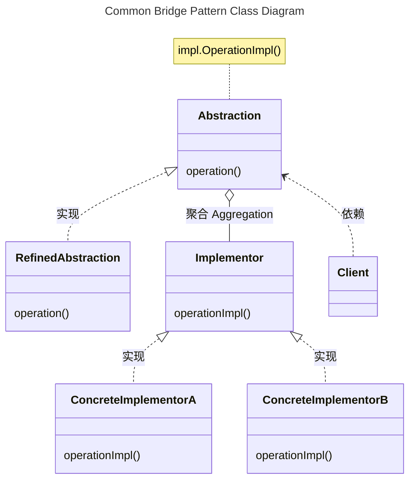
上述桥接模式的类图说明如下：
- Abstraction，定义抽象类的接口，维护一个指向Implementor类型对象
- RefinedAbstraction， 扩充由Abstraction定义的接口
- Implementor，定义实现类的接口。
  - 该接口不一定与Abstraction的接口完全一致
  - 一般来讲，Implementor接口仅提供基本操作，而Abstraction则定义了基于这些基本操作的较高层次的操作。
- ConcreteImplementor，实现Implementor接口并定义它的具体实现


Bridge桥接模式的优点：
- 分离接口及其实现部分。
  - 一个实现未必不变的绑定在一个接口上。抽象类的实现可以在运行时刻进行配置，一个对象甚至可以在运行时刻改变它的实现。
  - 接口与实现的分离有助于分层，从而产生更好的结构化系统，系统的高层仅需知道Abstraction及Implementor即可
- 提高可扩充性，独立的扩充Abstraction及Implementor
- 实现细节对客户透明


实现Bridge桥接模式需要注意的问题：
- 仅有一个Implementor。仅有一个类是Bridge桥接模式退化的情况，没有必要创建一个抽象的Implementor类
- 创建正确的Implementor对象
- 共享Implementor对象
- 采用多重继承机制


### 4.2.2 <span id="4.2.2">应用场景</span>

适用的场景包括：
- 不希望在抽象和它的实现部分之间有一个固定的绑定关系
- 类的抽象以及它的实现都应该可以通过生成子类的方法加以扩充。Bridge模式使得可以对不同的抽象接口和实现部分进行组合，并分别对他们进行扩充。
- 对一个抽象的实现部分的修改应对客户的不产生影响，即客户代码不必重新编译
- 由于许多类要生成，这样一种类层次结构说明，需要将一个对象分解成两个部分，抽象定义和实现，通过桥接代替继承
- 需要在多个对象间共享实现，但同时要求客户并不知道这一点


#### 4.2.2.1 <span id="4.2.2.1">JDBC API</span>

桥接模式允许抽象和实现之间的分离，以便它们可以彼此独立开发，但仍然有一种方式或桥梁来共存和交互。

Java 中的一个例子是 JDBC API。 它充当 Oracle、MySQL 和 PostgreSQL 等数据库及其特定实现之间的链接。

JDBC API 是一组标准接口，例如 Driver、Connection 和 ResultSet，仅举几例。 这使不同的数据库供应商可以有各自的实现。

从客户的视角
```java
// url is a String that can represent any database vendor.
// postgresql Vendor
// String url = "jdbc:postgresql://localhost/demo";

// MySQL Vendor
String url = "jdbc:mysql://localhost/demo";
Connection connection = DriverManager.getConnection(url);

```

jdbc的java.sql, javax.sql的桥接模式定义以及Implementor的具体实现示例mysql-connector-j的核心类图如下：


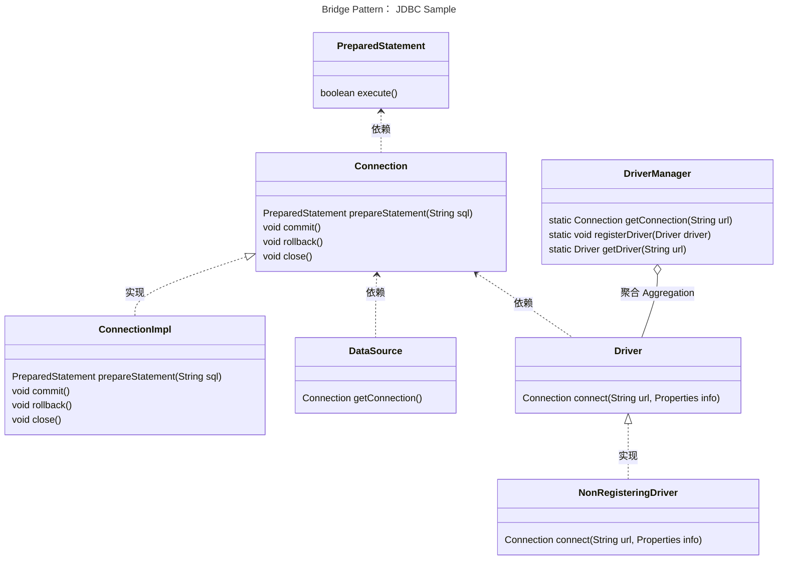
上述桥接模式的类图说明如下：
- 类DriverManager承担Bridge模式的Abstraction
- Driver、Connection以及PreparedStatement一系列接口，定义了Implementor的接口功能要求
- NonRegisteringDriver及ConnectionImpl为msyql-connector-j项目中，实现Implementor接口的一系列的扩展接口和类
- **个人理解**：接口javax.sql.DataSource承担RefinedAbstraction角色（*DataSource未继承DriverManager接口*）。
  - DataSource对象是Connection的物理数据源的工厂， 作为DriverManager的替代方法
  - DataSource对象是获取连接的首选方法。
  - 实现DataSource接口的对象通常会注册到基于JNDI的命名服务。


## 4.3 <span id="4.3">COMPOSITE 组合</span>

类型：对象结构型模式

### 4.3.1 <span id="4.3.1">定义及类图</span>

将对象组合成树形结构以表示“部分-整体”的层次结构。Composite组合模式使得用户对单个对象和组合对象的操作具有一致性。

动机
- 使用类似元件和容器的类时，对于开发者需要区别对待元件和容器对象，但对于用户而言，它们是一样的。对于不同类的区别适用，使得程序更加复杂


Composite组合模式的通用UML类图如下：

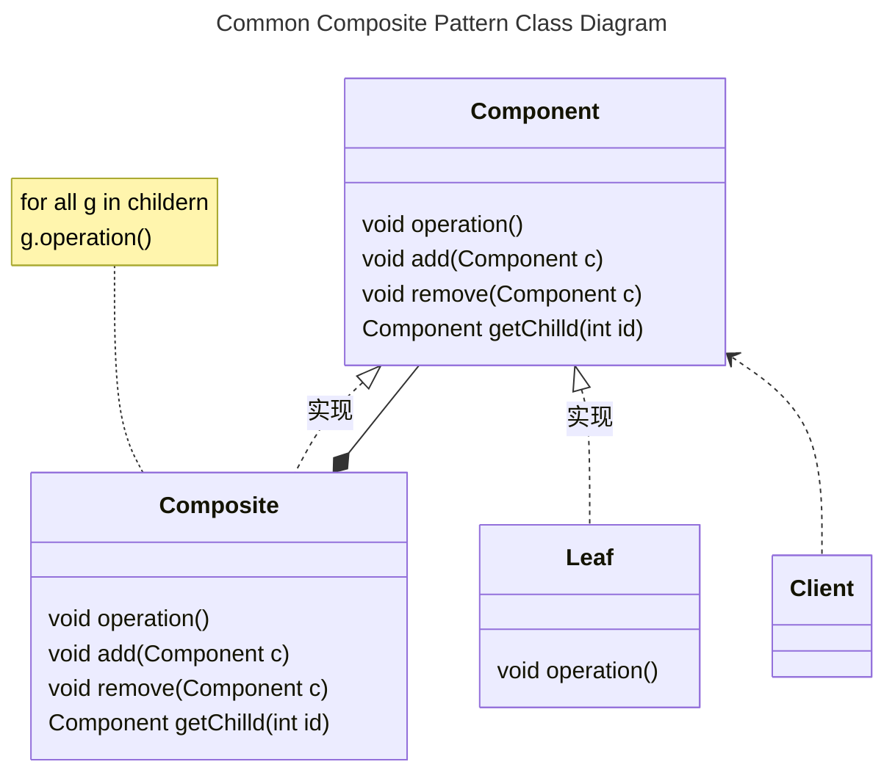
上述类图说明如下：
- Component，该模式的关键是定义一个抽象类，它**既可以**代表<u>图元</u>，**又**可以代表<u>图元的容器</u>。
  - 为组合中的对象声明接口
  - 在适当的情况下，实现所有类共有接口的缺省行为
  - 声明一个接口，拥有访问和管理Component的子组件
  - (Optional) 在递归结构中定义一个接口，用于访问一个父部件，并在合适的情况下实现它。
- Leaf
  - 在组合中表示叶节点对象，叶节点没有子节点
  - 在组合中定义图元对象的行为
- Composite
  - 定义有子部件的那些部件的行为
  - 存储子部件
  - 在Component接口中实现与子部件有关的操作
- Client，通过Component接口操纵组合部件的对象


Composite组合模式优缺点：
优点：
- 定义了包含基本对象和组合对象的类层次结构
- 简化客户代码， 可以一致的使用组合结构和单个对象
- 使得更容易增加新类型的组件， 客户程序不需要增加新的Component类而改变
- 补充：
  - 你可以利用多态和递归机制更方便地使用复杂树结构。
  - 开闭原则。 无需更改现有代码， 你就可以在应用中添加新元素， 使其成为对象树的一部分。
缺点：
- 使你的设计变得更加一般化。对于功能差异较大的类，提供公共接口或许会有困难。在特定情况下，你需要过度一般化组件接口，使其变得令人难以理解。
- 很难限制组合中的组件。


实现Composite组合模式的关注的问题：
- 显示的父部件引用

- 共享组件

- 最大化Component接口

- 声明管理子部件的操作：Composite类实现Add和Remove操作，但在类的哪个层次声明这些操作，需要在安全性和透明性之间作出权衡：
  - 在类层次结构的根部定义子节点的管理接口的方式具有良好的透明性，因为可以一致地使用所有的组件。但是以安全性为代价，例如在Leaf中增加和擅长对象
  - 在Composite类中定义管理子部件的方法具有良好的安全性。但是损失了透明性，因为Leaf和Composite类具有不同的接口。
  - 一种折中的办法，在Component类中声明一个`Composite GetComponent()`方法：
    - Component类中提供一个返回空指针的缺省操作
    - `GetComponent()`方法允许查询一个组件，是否是一个组合
    - 可以对返回的组合进行Add和Remove操作。

- Component是否该实现一个Component列表

- 子部件排序

- 使用高速缓冲存储改善性能

- 应该由谁删除Component

- 存储组件最好用哪一种数据结构


### 4.3.2 <span id="4.3.2">应用场景</span>

适用的场景包括：
- 想表示对象的部分-整体层次结构
- 希望用户忽略组合对象和单个对象的不同，用户将统一使用组合对象中的所有对象


#### 4.3.2.1 <span id="4.3.2.1">java.util.Map</span>

java.util.Map#putAll(Map)

代码示例如下：
```Java
Map<String, String> personAttributes = new HashMap<>();
personAttributes.put("site_role", "person");
personAttributes.put("access_role", "limited");

Map<String, String> groupAttributes = new HashMap<>();
personAttributes.put("group_role", "claims");

Map<String, String> secAttributes = new HashMap<>();
secAttributes.putAll(personAttributes);
secAttributes.putAll(groupAttributes);

```


## 4.4 <span id="4.4">DECORATOR 装饰</span>

类型：对象结构型模式

### 4.4.1 <span id="4.4.1">定义及类图</span>

Decorator装饰模式动态的给一个对象添加一些额外的职责。就增加功能来说，Decorator装饰模式相比生成子类更加灵活。

动机：
有时，希望给某个对象而不是整个类添加一些功能。
Decorator的子类为特定功能可以自由的添加一些操作。客户通常不会感觉到装饰过的组件与未装饰的组件之间的差异，也不会与装饰产生任何依赖关系。


Decorator装饰模式的通用UML类图如下：

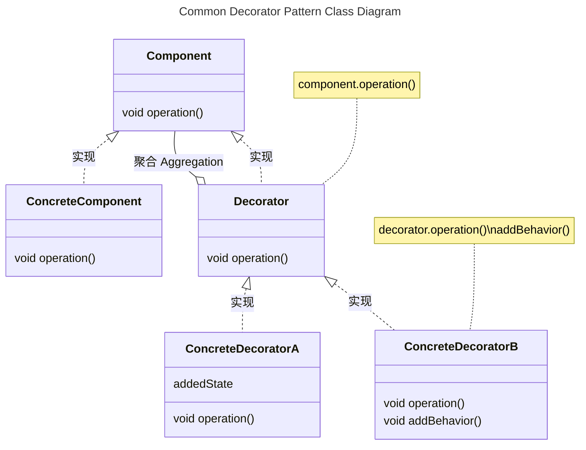
上述类图说明如下：
- Component，定义一个对象接口，可以给这些对象动态的添加职责
- ConcreteComponent，定义一个对象，可以给这个对象添加一些职责
- Decorator，维持一个指向Component对象的引用，并定义一个与Component接口一致的接口
- ConcreteDecorator，向组件添加职责


Decorator装饰模式有如下优缺点：
- 比静态继承更灵活
  - 用添加和分离的方法，用装饰在运行时刻增加和删除职责
  - 为特定的Component类提供多个不同的Decorator类，这就使得可以对一些职责进行混合和匹配。
- 避免在层次结构高层的类有太多的特征
  - Decorator装饰模式提供一个一种“即用即付”的方法来添加职责。它不试图在复杂的可定制的类中支持所有可预见的特征。相反，可以从一个简单的部件组合出复杂的功能。
  - 应用程序不必为不必要的特征付出代价
  - 可以独立的定义新类型的Decorator扩展
- Decorator与它的Component不一样，Decorator是一个透明的包装，使用装饰时不应该依赖对象标识
- 有许多小对象


实现Decorator装饰模式需要注意的问题：
- 接口的一致性
- 省略抽象的Decorator类
- 保持Component类的简单性
- 改变对象的外壳与改变对象的内核


### 4.4.2 <span id="4.4.2">应用场景</span>

适用的场景包括：
- 在不影响其他对象的情况下，以动态、透明的方式给单个对象添加职责
- 处理那些可以撤销的职责
- 当不能用生成子类的方式进行扩充时。


#### 4.4.2.1 <span id="4.4.2.1">java.io.Buffered*</span>

当我们想在不修改原始对象本身的情况下增强对象的行为时，这种模式就会发挥作用。这是通过向对象添加相同类型的包装器来实现的，以便为其附加额外的责任。

这个模式最普遍的用法之一可以在java.io包中找到，包括：
java.io.BufferedInputStream
java.io.BufferedReader
java.io.BufferedWriter


```Java
BufferedInputStream bis = new BufferedInputStream(new FileInputStream(new File("test.txt")));
while (bis.available() > 0) {
    char c = (char) bis.read();
    System.out.println("Char: " + c);
}
```
这里，BufferedInputStream正在修饰FileInputStream，以添加缓冲输入的功能。值得注意的是，这两个类都有InputStream作为共同的祖先。这意味着装饰的对象和正在装饰的对象都是相同的类型。这是装饰器模式的一个明确无误的指标。

BufferedInputStream作为Decorator装饰类，其相关类图及代码实现如下：

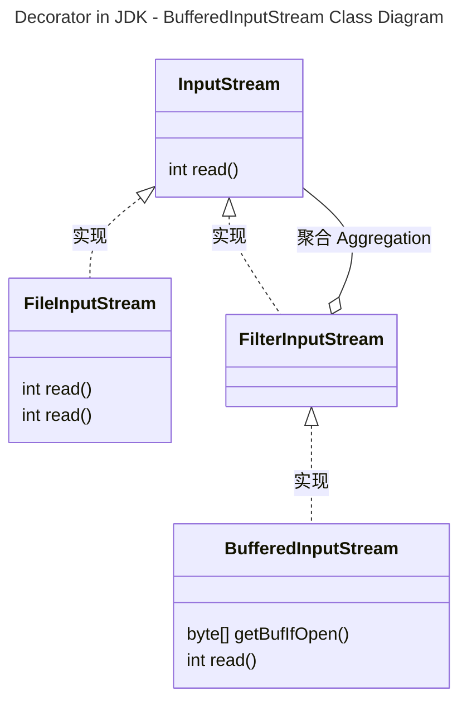
上述类图说明如下：
- `InputStream`相当于`Component`类
- `FileInputStream`相当于`ConcreteComponent`类
- `FilterInputStream`相当于`Decorator`类
- `BufferedInputStream`相当于`ConcreteDecorator`类

`FilterInputStream`类中read方法代码如下：
```Java
public class FilterInputStream extends InputStream {   
    protected volatile InputStream in;

    protected FilterInputStream(InputStream in) {
        this.in = in;
    }

    public int read() throws IOException {
        return in.read();
    }
}
```

`BufferedInputStream`类中read方法代码如下：
```Java
public class BufferedInputStream extends FilterInputStream {
    /**
     * The internal buffer array where the data is stored. When necessary,
     * it may be replaced by another array of
     * a different size.
     */
    protected volatile byte buf[];

    /**
     * Check to make sure that buffer has not been nulled out due to
     * close; if not return it;
     */
    private byte[] getBufIfOpen() throws IOException {
        byte[] buffer = buf;
        if (buffer == null)
            throw new IOException("Stream closed");
        return buffer;
    }

    public BufferedInputStream(InputStream in) {
        this(in, DEFAULT_BUFFER_SIZE);
    }
    public BufferedInputStream(InputStream in, int size) {
        super(in);
        if (size <= 0) {
            throw new IllegalArgumentException("Buffer size <= 0");
        }
        buf = new byte[size];
    }
    /**
     * Fills the buffer with more data, taking into account
     * shuffling and other tricks for dealing with marks.
     * Assumes that it is being called by a synchronized method.
     * This method also assumes that all data has already been read in,
     * hence pos > count.
     */
    private void fill() throws IOException {
        byte[] buffer = getBufIfOpen();
        if (markpos < 0)
            pos = 0;            /* no mark: throw away the buffer */
        else if (pos >= buffer.length)  /* no room left in buffer */
            if (markpos > 0) {  /* can throw away early part of the buffer */
                int sz = pos - markpos;
                System.arraycopy(buffer, markpos, buffer, 0, sz);
                pos = sz;
                markpos = 0;
            } else if (buffer.length >= marklimit) {
                markpos = -1;   /* buffer got too big, invalidate mark */
                pos = 0;        /* drop buffer contents */
            } else if (buffer.length >= MAX_BUFFER_SIZE) {
                throw new OutOfMemoryError("Required array size too large");
            } else {            /* grow buffer */
                int nsz = (pos <= MAX_BUFFER_SIZE - pos) ?
                        pos * 2 : MAX_BUFFER_SIZE;
                if (nsz > marklimit)
                    nsz = marklimit;
                byte nbuf[] = new byte[nsz];
                System.arraycopy(buffer, 0, nbuf, 0, pos);
                if (!bufUpdater.compareAndSet(this, buffer, nbuf)) {
                    // Can't replace buf if there was an async close.
                    // Note: This would need to be changed if fill()
                    // is ever made accessible to multiple threads.
                    // But for now, the only way CAS can fail is via close.
                    // assert buf == null;
                    throw new IOException("Stream closed");
                }
                buffer = nbuf;
            }
        count = pos;
        int n = getInIfOpen().read(buffer, pos, buffer.length - pos);
        if (n > 0)
            count = n + pos;
    }

    public synchronized int read() throws IOException {
        if (pos >= count) {
            fill();
            if (pos >= count)
                return -1;
        }
        return getBufIfOpen()[pos++] & 0xff;
    }
    
}
```
`BufferedInputStream`会通过`FileInputstream`进行一次磁盘IO, 一口气读取多个数据，`DEFAULT_BUFFER_SIZE`默认8192个字节先到自己的buf数组中【这样数据就在内存中】，后面即使你只读取1个字节，直接去buf中慢慢取。这样会减少直接对文件的IO，因为读取内存的数据更快。


#### 4.4.2.2 <span id="4.4.2.2">In Python</span>

装饰器是Python中非常强大和有用的工具，因为它允许程序员修改函数或类的行为。装饰器允许我们包装另一个函数，以扩展包装函数的行为，而无需永久修改它。我们可以将装饰器定义为类 为此，我们必须使用类的`__call__`方法。当用户需要创建一个充当函数的对象时，函数装饰器需要返回一个充当函数的对象，因此`__call__`可能很有用。例如带有 `*args` 和 `**kwargs` 的类装饰器：
为了使用带有参数 `*args` 和 `**kwargs` 的类装饰器，我们使用了`__call__`函数并在给定函数中传递了这两个参数

```Python
# Python program showing class decorator with *args and **kwargs
 
class MyDecorator:
    def __init__(self, function):
        self.function = function
     
    def __call__(self, *args, **kwargs):
 
        # We can add some code
        print("Before function")
 
        self.function(*args, **kwargs)
 
        # We can also add some code
        # after function call.
        print("After action")
     

# adding class decorator to the function
@MyDecorator
def function(name, message ='Hello'):
    print("{}, {}".format(message, name))
 
function("world", "hello")
```

使用类装饰器打印 执行程序所需的时间 ：
为了打印执行程序所需的时间，我们使用`__call__`函数并使用时间模块，以便我们可以获得程序的执行时间

```Python
# Python program to execute time of a program
 
# importing time module
from time import time
class Timer:
    def __init__(self, func):
        self.function = func
    def __call__(self, *args, **kwargs):
        start_time = time()
        result = self.function(*args, **kwargs)
        end_time = time()
        print("result is {}".format(result))
        print("Execution took {} seconds".format(end_time-start_time))

# adding a decorator to the function
@Timer
def some_function(delay):
    from time import sleep
    # Introducing some time delay to
    # simulate a time taking function.
    sleep(delay)
    return delay

some_function(3)
```

使用类装饰器检查错误参数：这种类型的类装饰器是最常用的。此装饰器在执行函数之前检查参数，防止函数过载，并使其能够仅存储逻辑和必要

```Python
# Python program checking error parameter using class decorator

class ErrorCheck:
    def __init__(self, function):
        self.function = function
    def __call__(self, *params):
        if any([isinstance(i, str) for i in params]):
            raise TypeError("parameter cannot be a string !!")
        else:
            return self.function(*params)

@ErrorCheck
def add_numbers(*numbers):
    return sum(numbers)

#  returns 6
print(add_numbers(1, 2, 3))

# raises Error. 
print(add_numbers(1, '2', 3))
```


## 4.5 <span id="4.5">FACADE 外观</span>

类型：对象结构型模式

### 4.5.1 <span id="4.5.1">定义及类图</span>

Facade外观模式为子系统中的一组接口提供一个一致的接口，Facade模式定义了一个高层的接口，这个接口使得这一子系统更加容易使用。

动机：
将一个系统划分成为若干个子系统有利于降低系统的复杂性。一个常见的设计目标是使子系统间的通信和相互依赖关系达到最小。它为子系统中较一般的的设施提供了一个单一而简单的界面。

原有系统之间调用图
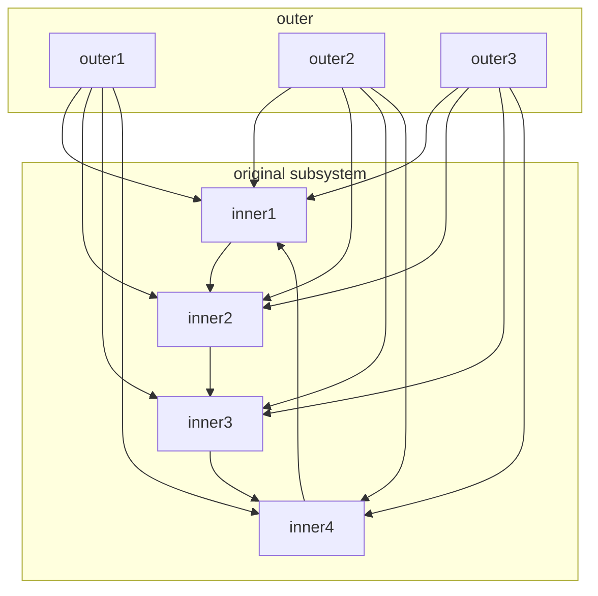

采用Facade模式后系统之间结构图
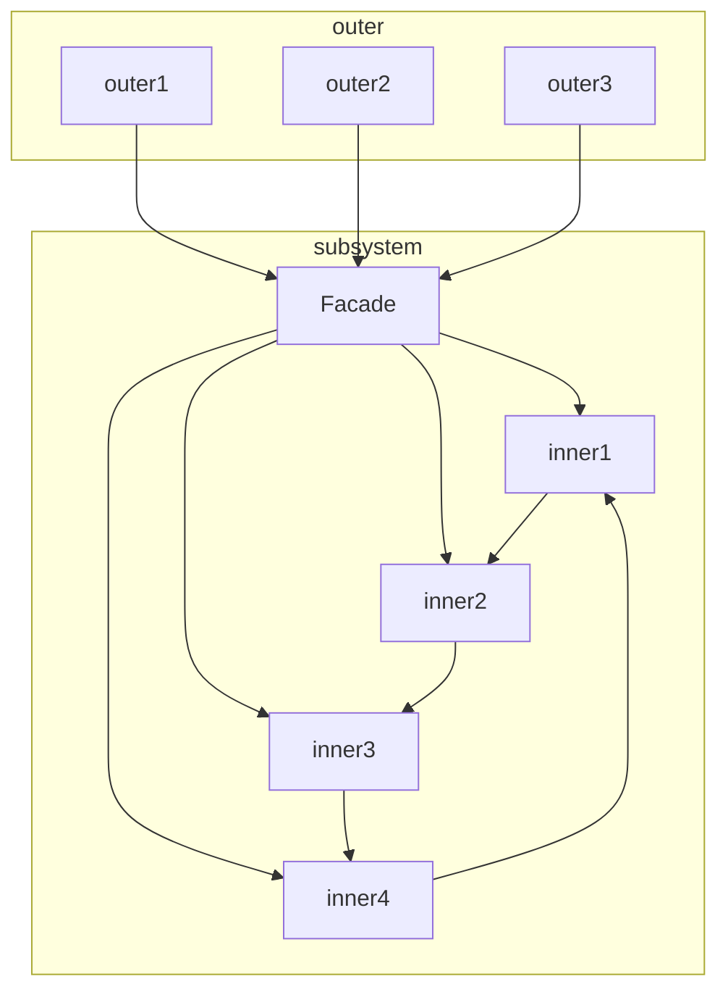
上述结构图说明如下：
- Facade
  - 知道那些子系统类负责处理请求
  - 将客户的请求代理给适当的子系统对象
- Subsystem
  - 实现子系统的功能
  - 处理由Facade对象指派的任务
  - 没有Facade的任何相关信息，即没有指向Facade的引用或指针


Facade外观模式的优点：
- 对客户屏蔽子系统组件，因此减少了客户处理的对象的数目并使得子系统使用起来更加方便
- 它实现了子系统与客户之间的松耦合关系，而子系统内部的功能组件往往是紧耦合的。松耦合关系使得子系统的组件变化不会影响到它的客户。
  - Facade模式有助于建立层次结构系统
  - 也有助于对对象之间的依赖关系分层，消除复杂的循环依赖
- 如果应用需要，并不限制它们使用子系统类。因此可以在易用性和通用性之间加以选择。


实现Facade模式需要注意的地方：
- 降低客户-子系统之间的耦合度
- 公共子系统类和私有子系统类。子系统与一个类的相似之处时，它们都有接口，并且它们都封装了一些东西
  - 类封装了状态和操作
  - 子系统封装了一些类


### 4.5.2 <span id="4.5.2">应用场景</span>

适用的场景包括：
- 当要为一个复杂子系统提供一个简单接口时
- 客户程序与抽象类的实现部分之间存在着很大的依赖性。引入Facade模式有助于将这个子系统与客户以及其他的子系统分离，可以提高子系统的独立性和可移植性。
- 当需要构建一个层次结构的子系统时


#### 4.5.2.1 <span id="4.5.2.1">java.lang.Class</span>


## 4.6 <span id="4.6">FLYWEIGHT 享元</span>

类型：对象结构型模式

### 4.6.1 <span id="4.6.1">定义及类图</span>

FlyWeight享元模式运用共享技术有效的支持大量细粒度的对象。

动机：
有些应用程序得益于在其整个设计过程中采用对象技术，但简单化的实现代价极大。例如文档编辑器的实现中，文本都有格式化和编辑功能，使用对象来表示文档中的每个字符会极大的提高应用程序的灵活性，但这种设计的缺点在于代价太大。即使一个中等大小的文档也可能要求成百上千的字符对象。所以通常并不是对每个字符都用一个对象来表示。

FlyWeight享元模式描述了如何共享对象，使得可以细粒度的使用它们而无需高昂的代价。

FlyWeight享元模式中，FlyWeight对象不能对它所运行的场景作出任何假设。其关键概念是内部状态和外部状态之间的区别：
- 内部状态存储于flyweight对象中，它包含了独立于flyweight场景的信息，这些信息使得flyweight可以被共享。
- 外部状态取决于FlyWeight场景，并根据场景而变化，因此不可以共享。
- 用户对象负责在必要时，将外部状态传递给flyweight
- 例如文本编辑器中的每个字母都可以创建一个flyweight共享对象，其内部状态是字符代码，而其他信息，比如字符的位置、风格、大小都是外部状态


FlyWeight享元模式的通用UML类图如下：

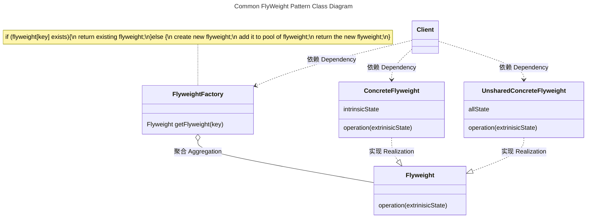
上述类图说明如下：
- Flyweight类，描述一个接口，通过这个接口flyweight可以接受并作用于外部状态
- ConcreteFlyweight类
  - 实现Flyweight接口，并为内部状态增加存储空间。
  - ConcreteFlyweight对象必须时可共享的。
  - 它所存储的状态必须是内部的；即，它必须独立于ConcreteFlyweight对象的场景
- UnsharedConcreteFlyweight类
  - 并非所有的Flyweight类子类都需要被共享。Flyweight接口使得共享成为可能，但它并不强制共享。
  - 在Flyweight对象结构的某些层次，UnsharedConcreteFlyweight对象通常将ConcreteFlyweight对象作为子节点。
- FlyweightFactory类
  - 创建并管理Flyweight对象
  - 确保合理的共享Flyweight对象，当用户请求一个flyweight对象时，FlyweightFactory对象提供一个已创建的实例或者创建一个新的实例
- Client类
  - 维持一个对Flyweight的引用
  - 计算或存储一个Flyweight的外部状态
- 类及对象之间的协作
  - Flyweight执行时所需的状态必定是内部的或外部的。
    - 内部状态存储于ConcreteFlyweight对象之中；
    - 外部对象则由Client对象存储或计算
    - 当用户调用Flyweight对象进行操作时，将该状态传递给它。
  - 用户不应直接对ConcreteFlyweight类进行实例化，而只能从FlyweightFactory对象得到ConcreteFlyweight对象，这可以保证对它们适当的进行共享。

实现FlyWeight享元模式所需注意的问题：
- 删除外部状态，FlyWeight享元模式的可用性很大程度上取决于是否容易识别外部状态并将它从共享对象中删除。理想情形是为外部状态可以由一个单独的对象结构计算得到，且该结构的存储要求非常小。
- 管理共享对象
  - 因为对象是共享的，用户不能直接对它进行实例化，FlyweightFactory可以帮助用户查找或创建某个特定的Flyweight对象
  - 共享还意味着某种形式的引用计数和垃圾回收


### 4.6.2 <span id="4.6.2">应用场景</span>

FlyWeight享元模式的有效性很大程度上取决于如何使用它以及在何处使用它
适用的场景包括：
- 一个应用程序使用大量的对象
- 完全由于使用大量的对象，造成很大的存储开销
- 对象的大多数状态都可以变为外部状态
- 如果删除对象的外部状态，那么可以用相对较少的共享对象取代很多组对象
- 应用程序不依赖于对象标识。由于FlyWeight对象可以被共享，对于概念上明显有别的对象，标识测试将其返回真值。


#### 4.6.2.1 <span id="4.6.2.1">java.lang.Integer</span>

缓存以高效地支持大量较小的对象，包括
- `java.lang.Integer#valueOf(int)`
- `java.lang.Boolean#valueOf(boolean)`
- `java.lang.Byte#valueOf(byte)`
- `java.lang.Character#valueOf(char)`

其中`java.lang.Integer#valueOf(int)`的代码实现如下：

```Java
public final class Integer extends Number implements Comparable<Integer> {

    public static Integer valueOf(int i) {
        if (i >= IntegerCache.low && i <= IntegerCache.high)
            return IntegerCache.cache[i + (-IntegerCache.low)];
        return new Integer(i);
    }

    private static class IntegerCache {
        static final int low = -128;
        static final int high;
        static final Integer cache[];

        static {
            // high value may be configured by property
            int h = 127;
            String integerCacheHighPropValue =
                sun.misc.VM.getSavedProperty("java.lang.Integer.IntegerCache.high");
            if (integerCacheHighPropValue != null) {
                try {
                    int i = parseInt(integerCacheHighPropValue);
                    i = Math.max(i, 127);
                    // Maximum array size is Integer.MAX_VALUE
                    h = Math.min(i, Integer.MAX_VALUE - (-low) -1);
                } catch( NumberFormatException nfe) {
                    // If the property cannot be parsed into an int, ignore it.
                }
            }
            high = h;

            cache = new Integer[(high - low) + 1];
            int j = low;
            for(int k = 0; k < cache.length; k++)
                cache[k] = new Integer(j++);

            // range [-128, 127] must be interned (JLS7 5.1.7)
            assert IntegerCache.high >= 127;
        }

        private IntegerCache() {}
    }
}

```


## 4.7 <span id="4.7">PROXY 代理</span>

类型：对象结构型模式

### 4.7.1 <span id="4.7.1">定义及类图</span>

Proxy代理模式为其他对象提供一种代理以控制对这个对象的访问。

动机：
对一个对象的进行访问控制的一个原因是为了只有在我们确实需要这个对象时才对它进行创建和初始化。对于开销很大的对象，应该根据需要进行创建。问题可采用Proxy，替代哪个真正的对象。


Proxy代理模式的通用UML类图如下：

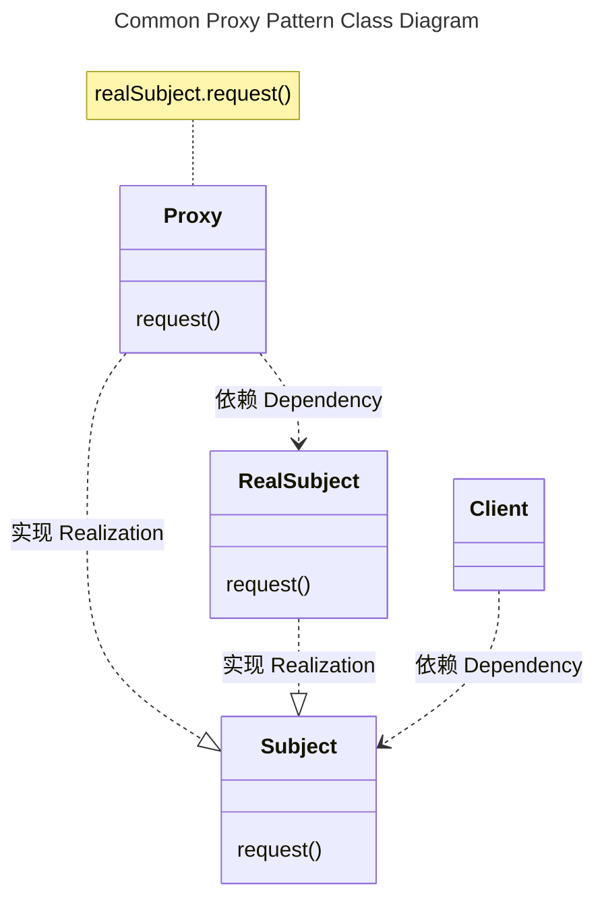
上述类图说明如下：
- Proxy，根据其种类，适当的时候向RealSubject转发请求
  - 保存一个引用使得代理可以访问实体。若RealSubject和Subject的接口相同，Proxy会引用Subject。
  - 提供一个与Subject的接口相同的接口，这样代理就可以用来代替实体
  - 控制对实体的存取，并可能负责创建和删除它
  - 其他功能依赖代理的类型：
    - Remote Proxy负责对请求及其参数进行编码，并向不同地址空间中的实体发送已编码的请求
    - Virtual Proxy可以缓存实体的附加信息，以便延迟对它的访问
    - Protection Proxy检查调用者是否具有实现一个请求所必需的访问权限
- Subject，定义RealSubject和Proxy的共有接口，这样就在任何使用RealSubject的地方都可以使用Proxy
- RealSubject，定义Proxy所代表的实体


### 4.7.2 <span id="4.7.2">应用场景</span>

Proxy代理模式在需要用比较通用的对象代替简单的指针或引用时，下面是一些可以使用Proxy代理常见情况：
- 远程代理
- 虚代理
- 保护代理
- 智能指引


#### 4.7.2.1 <span id="4.7.2.1">java.lang.reflect.Proxy</span>


