# Fabric Code Review

[TOC]

## 一、<span id="1.1">账本、配置及工具</span>

### 1.1 <span id="1.1">生成 configtxgen</span>

---

fabric-samples的first-network在目录channel-artifacts下，configtxgen工具生成会生成如下文件：

```
channel.tx
genesis.block
Org1MSPanchors.tx
Org2MSPanchors.tx
```

通过configtxlator工具可将上述文件转化为Json格式的可阅读格式

```
configtxlator proto_decode --type common.Envelope --input channel.tx
configtxlator proto_decode --type common.Block --input genesis.block 
configtxlator proto_decode --type common.Envelope --input Org1MSPanchors.tx
```

或

```
configtxgen -inspectBlock genesis.block 
configtxgen -inspectChannelCreateTx channel.tx
configtxgen -inspectChannelCreateTx Org1MSPanchors.tx
```

### 1.2、<span id="1.2">系统通道及应用通道的账本</span>

---

System Channel

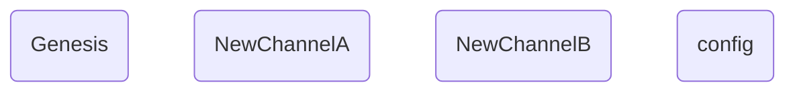

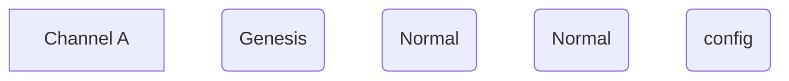


Orderer启动需要Genesis block,Genesis block规定了System Channel的配置。

#### 1.2.1 <span id="1.2.1">读取Genesis Bock</span>

---

`ORDERER_GENERAL_GENESISMETHOD=file|provisonal`
 如果设置为provisonal，使用如下配置参数，生成新的Genesis block

```
ORDERER_GENERAL_GENESISPROFILE
ORDERER_GENERAL_SYSTEMCHANNEL
```

在fabric-sample中的first-network使用ORDERER_GENERAL_GENESISMETHOD=file，因此启动byfn时，会使用configtxgen生成genesis.block。
first-network示例中的在scripts/fabric-samples/first-network/base/docker-compose-base.yaml文件中定义了如下配置信息：
`../channel-artifacts/genesis.block:/var/hyperledger/orderer/orderer.genesis.block`

在scripts/fabric-samples/first-network/base/peer-base.yaml文件中定义了如下配置信息：
`ORDERER_GENERAL_GENESISFILE=/var/hyperledger/orderer/orderer.genesis.block`

在orderer/common/server/main.go文件中代码中可以明白上述参数的用法：

```go
func extractBootstrapBlock(conf *localconfig.TopLevel) *cb.Block {
    var bootstrapBlock *cb.Block

    // Select the bootstrapping mechanism
    switch conf.General.GenesisMethod {
    case "provisional":
        bootstrapBlock = encoder.New(genesisconfig.Load(conf.General.GenesisProfile)).GenesisBlockForChannel(conf.General.SystemChannel)
    case "file":
        bootstrapBlock = file.New(conf.General.GenesisFile).GenesisBlock()
    default:
        logger.Panic("Unknown genesis method:", conf.General.GenesisMethod)
    }
    return bootstrapBlock
}
```

System Channel是管理链，当要创建一个用户链的时候，是要向System Channel发送一个创建用户链的交易，System Channel会将发送来的用户链的配置信息等作为用户链的Genesis,放在系统中。

Join peers操作，就是将User Channel Genesis从System Channel拿下来，然后送给peer,让peer指导去哪找到orderer节点，配置信息中包括了Orderer的锚节点（即endpoints)、涉及的哪些组织。

配置交易，不遵循上述打包规则，每个配置交易都会形成一个块，因为配置需要尽快生效。

> https://blog.csdn.net/scylhy/article/details/89847320

#### 1.2.2 <span id="1.2.2">创世区块</span>

---

systemchannel的创世区块有Consortiums配置项，而应用通道的创世区块有Application配置项。启动Orderer时，系统通道的对创世区块有效性验证会检查是否包含ConsortiumConfig
orderer/common/server/onboarding.go，包含如下方法

```go
// ValidateBootstrapBlock returns whether this block can be used as a bootstrap block.
// A bootstrap block is a block of a system channel, and needs to have a ConsortiumsConfig.
func ValidateBootstrapBlock(block *common.Block) error {
                    ......
    _, exists := bundle.ConsortiumsConfig()
    if !exists {
        return errors.New("the block isn't a system channel block because it lacks ConsortiumsConfig")
    }
    return nil
}
```

## 二、<span id="2">Orderer节点代码分析</span>

### 2.1 <span id="2.1">Orderer启动</span>
---

#### 2.1.1 <span id="2.1.1">Main方法</span>
文件orderer/common/server/main.go中，Orderer启动的入口`Main()`方法代码如下：
```go
// Main is the entry point of orderer process
func Main() {
	fullCmd := kingpin.MustParse(app.Parse(os.Args[1:]))

	// "version" command
	if fullCmd == version.FullCommand() {
		fmt.Println(metadata.GetVersionInfo())
		return
	}

	conf, err := localconfig.Load()
	if err != nil {
		logger.Error("failed to parse config: ", err)
		os.Exit(1)
	}
	initializeLogging()
	initializeLocalMsp(conf)

	prettyPrintStruct(conf)
	Start(fullCmd, conf)
}

// Start provides a layer of abstraction for benchmark test
func Start(cmd string, conf *localconfig.TopLevel) {
	bootstrapBlock := extractBootstrapBlock(conf)
	if err := ValidateBootstrapBlock(bootstrapBlock); err != nil {
		logger.Panicf("Failed validating bootstrap block: %v", err)
	}

	opsSystem := newOperationsSystem(conf.Operations, conf.Metrics)
	err := opsSystem.Start()
	if err != nil {
		logger.Panicf("failed to initialize operations subsystem: %s", err)
	}
	defer opsSystem.Stop()
	metricsProvider := opsSystem.Provider

	lf, _ := createLedgerFactory(conf, metricsProvider)
	sysChanLastConfigBlock := extractSysChanLastConfig(lf, bootstrapBlock)
	clusterBootBlock := selectClusterBootBlock(bootstrapBlock, sysChanLastConfigBlock)

	signer := localmsp.NewSigner()

	logObserver := floggingmetrics.NewObserver(metricsProvider)
	flogging.Global.SetObserver(logObserver)

	serverConfig := initializeServerConfig(conf, metricsProvider)
	grpcServer := initializeGrpcServer(conf, serverConfig)
	caSupport := &comm.CredentialSupport{
		AppRootCAsByChain:           make(map[string]comm.CertificateBundle),
		OrdererRootCAsByChainAndOrg: make(comm.OrgRootCAs),
		ClientRootCAs:               serverConfig.SecOpts.ClientRootCAs,
	}

	var r *replicationInitiator
	clusterServerConfig := serverConfig
	clusterGRPCServer := grpcServer // by default, cluster shares the same grpc server
	clusterClientConfig := comm.ClientConfig{SecOpts: &comm.SecureOptions{}, KaOpts: &comm.KeepaliveOptions{}}
	var clusterDialer *cluster.PredicateDialer

	var reuseGrpcListener bool
	typ := consensusType(bootstrapBlock)
	var serversToUpdate []*comm.GRPCServer

	clusterType := isClusterType(clusterBootBlock)
	if clusterType {
		logger.Infof("Setting up cluster for orderer type %s", typ)

		clusterClientConfig = initializeClusterClientConfig(conf)
		clusterDialer = &cluster.PredicateDialer{
			ClientConfig: clusterClientConfig,
		}

		r = createReplicator(lf, bootstrapBlock, conf, clusterClientConfig.SecOpts, signer)
		// Only clusters that are equipped with a recent config block can replicate.
		if conf.General.GenesisMethod == "file" {
			r.replicateIfNeeded(bootstrapBlock)
		}

		if reuseGrpcListener = reuseListener(conf, typ); !reuseGrpcListener {
			clusterServerConfig, clusterGRPCServer = configureClusterListener(conf, serverConfig, ioutil.ReadFile)
		}

		// If we have a separate gRPC server for the cluster,
		// we need to update its TLS CA certificate pool.
		serversToUpdate = append(serversToUpdate, clusterGRPCServer)
	}

	// if cluster is reusing client-facing server, then it is already
	// appended to serversToUpdate at this point.
	if grpcServer.MutualTLSRequired() && !reuseGrpcListener {
		serversToUpdate = append(serversToUpdate, grpcServer)
	}

	tlsCallback := func(bundle *channelconfig.Bundle) {
		logger.Debug("Executing callback to update root CAs")
		updateTrustedRoots(caSupport, bundle, serversToUpdate...)
		if clusterType {
			updateClusterDialer(caSupport, clusterDialer, clusterClientConfig.SecOpts.ServerRootCAs)
		}
	}

	sigHdr, err := signer.NewSignatureHeader()
	if err != nil {
		logger.Panicf("Failed creating a signature header: %v", err)
	}

	expirationLogger := flogging.MustGetLogger("certmonitor")
	crypto.TrackExpiration(
		serverConfig.SecOpts.UseTLS,
		serverConfig.SecOpts.Certificate,
		[][]byte{clusterClientConfig.SecOpts.Certificate},
		sigHdr.Creator,
		expirationLogger.Warnf, // This can be used to piggyback a metric event in the future
		time.Now(),
		time.AfterFunc)

	manager := initializeMultichannelRegistrar(clusterBootBlock, r, clusterDialer, clusterServerConfig, clusterGRPCServer, conf, signer, metricsProvider, opsSystem, lf, tlsCallback)
	mutualTLS := serverConfig.SecOpts.UseTLS && serverConfig.SecOpts.RequireClientCert
	expiration := conf.General.Authentication.NoExpirationChecks
	server := NewServer(manager, metricsProvider, &conf.Debug, conf.General.Authentication.TimeWindow, mutualTLS, expiration)

	logger.Infof("Starting %s", metadata.GetVersionInfo())
	go handleSignals(addPlatformSignals(map[os.Signal]func(){
		syscall.SIGTERM: func() {
			grpcServer.Stop()
			if clusterGRPCServer != grpcServer {
				clusterGRPCServer.Stop()
			}
		},
	}))

	if !reuseGrpcListener && clusterType {
		logger.Info("Starting cluster listener on", clusterGRPCServer.Address())
		go clusterGRPCServer.Start()
	}

	initializeProfilingService(conf)
	ab.RegisterAtomicBroadcastServer(grpcServer.Server(), server)
	logger.Info("Beginning to serve requests")
	grpcServer.Start()
}
```
上述代码分析如下：
- `lf, _ := createLedgerFactory(conf, metricsProvider)`根据配置信息生成账本的工厂类。`conf.General.LedgerType`环境变量，对应配置文件orderer.yaml中`General：LedgerType`，定义了Orderer节点的账本支持三种类型，详情参见7.2.2节[Orderer账本创建](#7.2.2)账本：
  - file： common/ledger/blockledger/file/factory.go
  - json： common/ledger/blockledger/json/factory.go
  - ram（默认）： common/ledger/blockledger/ram/factory.go


Orderer使用genesis.block作为初始的配置文件。最核心的为Registrar，是Orderer的资源管理器，包括通道、账本、共识等，其主要代码orderer/common/multichannel/registrar.go

```go
// Registrar serves as a point of access and control for the individual channel resources.
type Registrar struct {
    lock               sync.RWMutex
    chains             map[string]*ChainSupport
    config             localconfig.TopLevel
    consenters         map[string]consensus.Consenter
    ledgerFactory      blockledger.Factory
    signer             crypto.LocalSigner
    blockcutterMetrics *blockcutter.MetricssystemChannelID    string
    systemChannel      *ChainSupport
    templator          msgprocessor.ChannelConfigTemplator
    callbacks          []channelconfig.BundleActor
}
```

### 2.2 <span id="2.2">Config</span>

---

#### 2.2.1 <span id="2.2.1">Last Config</span>

执行完fabric-samples/first-network的启动命令后（注：如下命令匹配fabric1.4.6）

`./byfn.sh -up`

然后执行如下命令

```sh
docker exec cli peer channel fetch newest -o orderer.example.com:7050 -c mychannel --tls --cafile /opt/gopath/src/github.com/hyperledger/fabric/peer/crypto/ordererOrganizations/example.com/orderers/orderer.example.com/msp/tlscacerts/tlsca.example.com-cert.pem  newest.block
docker exec cli configtxgen -inspectBlock newest.block
```

block转换为JSON格式的末尾是区块的metadata

```json
"metadata": {
        "metadata": [
            "CgQKAggCEpEHCsYGCqkGCgpPcmRlcmVyTVNQEpoGLS0tLS1CRUdJTiBDRVJUSUZJQ0FURS0tLS0tCk1JSUNIakNDQWNTZ0F3SUJBZ0lRYW9MbGV5Y1I4OVNmZ1hFdFlqdmJXREFLQmdncWhrak9QUVFEQWpCcE1Rc3cKQ1FZRFZRUUdFd0pWVXpFVE1CRUdBMVVFQ0JNS1EyRnNhV1p2Y201cFlURVdNQlFHQTFVRUJ4TU5VMkZ1SUVaeQpZVzVqYVhOamJ6RVVNQklHQTFVRUNoTUxaWGhoYlhCc1pTNWpiMjB4RnpBVkJnTlZCQU1URG1OaExtVjRZVzF3CmJHVXVZMjl0TUI0WERUSXhNVEV3TnpBMU5ETXdNRm9YRFRNeE1URXdOVEExTkRNd01Gb3dhakVMTUFrR0ExVUUKQmhNQ1ZWTXhFekFSQmdOVkJBZ1RDa05oYkdsbWIzSnVhV0V4RmpBVUJnTlZCQWNURFZOaGJpQkdjbUZ1WTJsegpZMjh4RURBT0JnTlZCQXNUQjI5eVpHVnlaWEl4SERBYUJnTlZCQU1URTI5eVpHVnlaWEl1WlhoaGJYQnNaUzVqCmIyMHdXVEFUQmdjcWhrak9QUUlCQmdncWhrak9QUU1CQndOQ0FBVGM3a1F2eExKQUZaY2c5c3p2QTN1bHh4YVEKaXZFY3d4M3pxbGtwa00xdmMrcWZ2cEo3cW5rZWhCbUdwTXVrR1RoWTdyUXlvN1VsZytDY1BwbWN1enBobzAwdwpTekFPQmdOVkhROEJBZjhFQkFNQ0I0QXdEQVlEVlIwVEFRSC9CQUl3QURBckJnTlZIU01FSkRBaWdDRFJnL2V5CklkdHRZN1lzOVJJelBoV2JneW9zOW9xZXp6cGo1WWJTNjdvWjN6QUtCZ2dxaGtqT1BRUURBZ05JQURCRkFpRUEKd01hWHJwOE1aNG1jWWhMT0hoZlEwZUMzdTdqRnFyS1FEVVRoRzFYQ0JvWUNJRFlOaXZhREM2a3NOVndQK1pQNgpLYXYwM1dOVnVTL3pDcHFONEs5Tk9DSWQKLS0tLS1FTkQgQ0VSVElGSUNBVEUtLS0tLQoSGFg5GmoyamDh8ce5WGXsbVbzqUSxtr9ymhJGMEQCIFvWXPnkK0zkJDg1nnlnFJ06Twl4TR6bBuki2sMevJ9GAiAjXsJ6eAjNjO5jC1oC6I1O21LTqjCgzUlhwA3RiXYMqA==",
            "CgIIAg==",
            "",
            "",
            ""
        ]
    }
```

在protos/utils/blockutils.go文件中读取metadata中的last_config的相关代码，

```go
// GetLastConfigIndexFromBlock retrieves the index of the last config block as
// encoded in the block metadata
func GetLastConfigIndexFromBlock(block *cb.Block) (uint64, error) {
    md, err := GetMetadataFromBlock(block, cb.BlockMetadataIndex_LAST_CONFIG)
    lc := &cb.LastConfig{}
    err = proto.Unmarshal(md.Value, lc)
    return lc.Index, nil
}
// GetMetadataFromBlock retrieves metadata at the specified index.
func GetMetadataFromBlock(block *cb.Block, index cb.BlockMetadataIndex) (*cb.Metadata, error) {
    md := &cb.Metadata{}
    err := proto.Unmarshal(block.Metadata.Metadata[index], md)
    return md, nil
}
```

BlockMetadataIndex定义参加7.2节[BlockMetadata](#7.2)，可以看出LAST_CONFIG=1，即为metadata数组中第二项，其数据即是“CgIIAg==“，为BASE64编码

解密后的值即为0A020802，上述GetLastConfigIndexFromBlock方法读取后并Unmarshal成&cb.LastConfig{}后其index即为2。也就是说block2为最后的config block。根据最后区块中metadata中last_config定义，节点可以随时很方便的获取最后配置并更新配置信息，以增加组织等操作。也就能够帮助理解peer channel fetch config以及peer channel update的实现。

附录：从first-network生成的Orderer节点中账本文件系统中读取block信息

```go
import (
    "github.com/hyperledger/fabric/common/ledger/blockledger"
    fileledger "github.com/hyperledger/fabric/common/ledger/blockledger/file"
)
func TestGetLastConfigIndexFromLastBlock(t *testing.T) {
    var lf blockledger.Factory
    // docker cp orderer.example.com:/var/hyperledger/production/orderer ./
    var ld string = "/home/luming/orderer"
    metricsProvider := &disabled.Provider{}

    lf = fileledger.New(ld, metricsProvider)
    channelLedger, _ := lf.GetOrCreate("mychannel")
    height := channelLedger.Height()
    var i uint64
    //for i = 0; i < height; i++ {
    lastBlock := blockledger.GetBlock(channelLedger, 4)
    index, _ := utils.GetLastConfigIndexFromBlock(lastBlock)
    assert.Equal(t, index, uint64(2), "height %d block %d last config error", height, i)
    //}
}
```

#### 2.2.2 <span id="2.2.2">Config Sequence</span>

在配置区块中，有Sequence字段，作为配置的唯一标识，其在区块中数据如下所示：

```json
"data": {
    "config": {
        "channel_group": {
        },
        "sequence": "1"
    },
    "last_update": {
    }
}
```

ChainSupport{}结构体支持Sequence()方法

```go
// Sequence passes through to the underlying configtx.Validator
func (cs *ChainSupport) Sequence() uint64 {
    return cs.ConfigtxValidator().Sequence()
}
```

ChainSupport{}依赖的ledgerResources类型继承Resouce接口，包含ConfigtxValidator()方法。

文件common/channelconfig/api.go中Resources接口定义如下：

```go
// Resources is the common set of config resources for all channels
// Depending on whether chain is used at the orderer or at the peer, other
// config resources may be available
type Resources interface {
    // ConfigtxValidator returns the configtx.Validator for the channel
    ConfigtxValidator() configtx.Validator
    ... ...
}
```

文件common/configtx/configtx.go中Validator接口定义如下：

```go
// Validator provides a mechanism to propose config updates, see the config update results
// and validate the results of a config update.
type Validator interface {
    // Validate attempts to apply a configtx to become the new config
    Validate(configEnv *cb.ConfigEnvelope) error

    // Validate attempts to validate a new configtx against the current config state
    ProposeConfigUpdate(configtx *cb.Envelope) (*cb.ConfigEnvelope, error)

    // ChainID retrieves the chain ID associated with this manager
    ChainID() string

    // ConfigProto returns the current config as a proto
    ConfigProto() *cb.Config

    // Sequence returns the current sequence number of the config
    Sequence() uint64
}
```

common/configtx/validator.go

```go
// ValidatorImpl implements the Validator interface
type ValidatorImpl struct {
    channelID   string
    sequence    uint64
    configMap   map[string]comparable
    configProto *cb.Config
    namespace   string
    pm          policies.Manager
}

// NewValidatorImpl constructs a new implementation of the Validator interface.
func NewValidatorImpl(channelID string, config *cb.Config, namespace string, pm policies.Manager) (*ValidatorImpl, error) {
    ...    ...
    return &ValidatorImpl{
        namespace:   namespace,
        pm:          pm,
        sequence:    config.Sequence,
        configMap:   configMap,
        channelID:   channelID,
        configProto: config,
    }, nil
}

// ProposeConfigUpdate takes in an Envelope of type CONFIG_UPDATE and produces a
// ConfigEnvelope to be used as the Envelope Payload Data of a CONFIG message
func (vi *ValidatorImpl) ProposeConfigUpdate(configtx *cb.Envelope) (*cb.ConfigEnvelope, error) {
    return vi.proposeConfigUpdate(configtx)
}

func (vi *ValidatorImpl) proposeConfigUpdate(configtx *cb.Envelope) (*cb.ConfigEnvelope, error) {
    ... ...
    return &cb.ConfigEnvelope{
        Config: &cb.Config{
            Sequence:     vi.sequence + 1,
            ChannelGroup: channelGroup,
        },
        LastUpdate: configtx,
    }, nil
}

// Sequence returns the sequence number of the config
func (vi *ValidatorImpl) Sequence() uint64 {
    return vi.sequence
}
```

上述代码重点关注sequence的处理

- ValidatorImpl{}结构体构造方法NewValidatorImpl()，从输入参数中读取配置区块中sequence字段并为ValidatorImpl{}结构体赋值
- ProposeConfigUpdate初始化最新的配置区块，区块中sequence为vi.sequence + 1
- Sequence()方法返回结构体当前的方法。

`Registrar.newChain()`方法中`ledgerResources := r.newLedgerResources(configtx)`执行配置生成，`cs := newChainSupport(r, ledgerResources, r.consenters, r.signer, r.blockcutterMetrics)`并将ledgerResources赋值给ChainSupport。ValidatorImpl{}结构体构造方法调用如下：

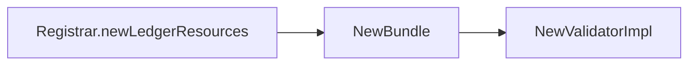

从ValidatorImpl{}结构体的实现中，可以发现sequence变量没有递增。初始化一个新的配置区块时sequence的值是vi.sequence + 1，那么新配置生效后，通道ChainSupport{}包含的ValidatorImpl{}变量必须更新，否则下一个配置区块的sequence值就无法递增了。Fabric时如何实现的？重点关注ProcessConfigMsg及WriteConfigBlock方法的实现。通过分析发现WriteConfigBlock方法代码实现（solo算法为例）：

```go
// WriteConfigBlock should be invoked for blocks which contain a config transaction.
// This call will block until the new config has taken effect, then will return
// while the block is written asynchronously to disk.
func (bw *BlockWriter) WriteConfigBlock(block *cb.Block, encodedMetadataValue []byte) {
    ctx, err := utils.ExtractEnvelope(block, 0)
    if err != nil {
        logger.Panicf("Told to write a config block, but could not get configtx: %s", err)
    }

    payload, err := utils.UnmarshalPayload(ctx.Payload)
    if err != nil {
        logger.Panicf("Told to write a config block, but configtx payload is invalid: %s", err)
    }

    if payload.Header == nil {
        logger.Panicf("Told to write a config block, but configtx payload header is missing")
    }

    chdr, err := utils.UnmarshalChannelHeader(payload.Header.ChannelHeader)
    if err != nil {
        logger.Panicf("Told to write a config block with an invalid channel header: %s", err)
    }

    switch chdr.Type {
    case int32(cb.HeaderType_ORDERER_TRANSACTION):
        ...    ...

    case int32(cb.HeaderType_CONFIG):
        configEnvelope, err := configtx.UnmarshalConfigEnvelope(payload.Data)
        if err != nil {
            logger.Panicf("Told to write a config block with new channel, but did not have config envelope encoded: %s", err)
        }

        err = bw.support.Validate(configEnvelope)
        if err != nil {
            logger.Panicf("Told to write a config block with new config, but could not apply it: %s", err)
        }

        bundle, err := bw.support.CreateBundle(chdr.ChannelId, configEnvelope.Config)
        if err != nil {
            logger.Panicf("Told to write a config block with a new config, but could not convert it to a bundle: %s", err)
        }

        oc, ok := bundle.OrdererConfig()
        if !ok {
            logger.Panicf("[channel: %s] OrdererConfig missing from bundle", bw.support.ChainID())
        }

        currentType := bw.support.SharedConfig().ConsensusType()
        nextType := oc.ConsensusType()
        if currentType != nextType {
            encodedMetadataValue = nil
            logger.Debugf("[channel: %s] Consensus-type migration: maintenance mode, change from %s to %s, setting metadata to nil",
                bw.support.ChainID(), currentType, nextType)
        }

        // Avoid Bundle update before the go-routine in WriteBlock() finished writing the previous block.
        // We do this (in particular) to prevent bw.support.Sequence() from advancing before the go-routine reads it.
        // In general, this prevents the StableBundle from changing before the go-routine in WriteBlock() finishes.
        bw.committingBlock.Lock()
        bw.committingBlock.Unlock()
        bw.support.Update(bundle)
    default:
        logger.Panicf("Told to write a config block with unknown header type: %v", chdr.Type)
    }

    bw.WriteBlock(block, encodedMetadataValue)
}
```

上述代码重点关注：

- 执行`bundle, err := bw.support.CreateBundle(chdr.ChannelId, configEnvelope.Config)`，输入参数configEnvelope.Config为写入区块的最新配置，其Sequence的值为通道ChainSuppport中的vi.sequece + 1, 因此新生成的bundle包含的sequence为ChainSupport.Suqence() + 1.
  
  - [5.2.2节](#5.2.2)中newChainSupport方法中`cs.BlockWriter = newBlockWriter(lastBlock, registrar, cs)`,cs即是ChainSupport结构体变量，赋值给BlockWriter{}结构体的中包含的blockWriterSupport{}接口变量，代码片段如下：
    ```go
    func newBlockWriter(lastBlock *cb.Block, r *Registrar, support blockWriterSupport) *BlockWriter {
        bw := &BlockWriter{
        support: support,
        }
    }
    ```
  
  - CreateBundle->channelconfig.NewBundle->configtx.NewValidatorImpl,NewValidatorImpl即为构造包含sequence的ValidatorImpl{}结构体方法。

- `bw.support.Update(bundle)`，即执行ChainSupport.Update(bundle)
  
  - 在文件common/channelconfig/bundlesource.go中Update具体实现如下：
     ```go
     func (bs *BundleSource) Update(newBundle *Bundle) {
        bs.bundle.Store(newBundle)
        for _, callback := range bs.callbacks {
           callback(newBundle)
        }
     }
     ```
    其中BundleSource{}结构体定义如下：
    ```go
    type BundleSource struct {
        atomic.Value
        callbacks []BundleActor
    }
    ```
    包含一个atomic.Value变量。执行Update方法，`bs.bundle.Store(newBundle)`写入最新的bundle，包含更新后的Sequence
  - 再重新来观察newLedgerResources方法的返回值：
    ```go
    return &ledgerResources{
       configResources: &configResources{
          mutableResources: channelconfig.NewBundleSource(bundle, r.callbacks...),
       },
       ReadWriter: ledger,
    }
    ```
    将bundle写入atomic.Value中

最后小结方法调用的trace如下：

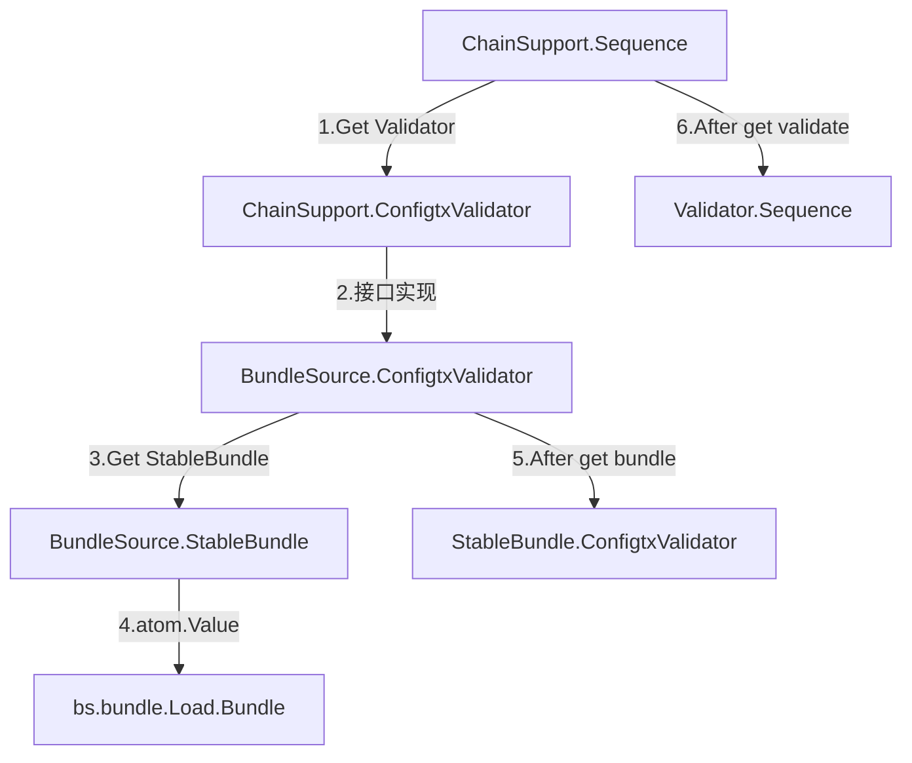
- 由于部分markdown的preivew工具在mermaid中不支持 * ，因此*Bundle的中的省略了 *

### 2.3 <span id="2.3">AtomicBroadcast</span>

---

在Orderer启动时，orderer/common/server/main.go有如下相关语句

```go
server := NewServer(manager, metricsProvider, &conf.Debug, conf.General.Authentication.TimeWindow, mutualTLS, expiration)
grpcServer := initializeGrpcServer(conf, serverConfig)   
ab.RegisterAtomicBroadcastServer(grpcServer.Server(), server)
grpcServer.Start()
```

文件中protos/orderer/ab.proto定义了AtomicBroadcast的两个消息服务：

```proto
service AtomicBroadcast {
    // broadcast receives a reply of Acknowledgement for each common.Envelope in order, indicating success or type of failure
    rpc Broadcast(stream common.Envelope) returns (stream BroadcastResponse) {}

    // deliver first requires an Envelope of type DELIVER_SEEK_INFO with Payload data as a mashaled SeekInfo message, then a stream of block replies is received.
    rpc Deliver(stream common.Envelope) returns (stream DeliverResponse) {}
}
```

在orderer/common/server/server.go有如下相关语句

```go
type server struct {
    bh    *broadcast.Handler
    dh    *deliver.Handler
    debug *localconfig.Debug
    *multichannel.Registrar
}

// NewServer creates an ab.AtomicBroadcastServer based on the broadcast target and ledger Reader
func NewServer(
	r *multichannel.Registrar,
	metricsProvider metrics.Provider,
	debug *localconfig.Debug,
	timeWindow time.Duration,
	mutualTLS bool,
	expirationCheckDisabled bool,
) ab.AtomicBroadcastServer {
	s := &server{
		dh: deliver.NewHandler(
			deliverSupport{Registrar: r},
			timeWindow,
			mutualTLS,
			deliver.NewMetrics(metricsProvider),
			expirationCheckDisabled,
		),
		bh: &broadcast.Handler{
			SupportRegistrar: broadcastSupport{Registrar: r},
			Metrics:          broadcast.NewMetrics(metricsProvider),
		},
		debug:     debug,
		Registrar: r,
	}
	return s
}

func (s *server) Broadcast(srv ab.AtomicBroadcast_BroadcastServer) error {
    logger.Debugf("Starting new Broadcast handler")
    defer func() {
        if r := recover(); r != nil {
            logger.Criticalf("Broadcast client triggered panic: %s\n%s", r, debug.Stack())
        }
        logger.Debugf("Closing Broadcast stream")
    }()
    return s.bh.Handle(&broadcastMsgTracer{
        AtomicBroadcast_BroadcastServer: srv,
        msgTracer: msgTracer{
            debug:    s.debug,
            function: "Broadcast",
        },
    })
}

// Deliver sends a stream of blocks to a client after ordering
func (s *server) Deliver(srv ab.AtomicBroadcast_DeliverServer) error {
    logger.Debugf("Starting new Deliver handler")
    defer func() {
        if r := recover(); r != nil {
            logger.Criticalf("Deliver client triggered panic: %s\n%s", r, debug.Stack())
        }
        logger.Debugf("Closing Deliver stream")
    }()

    policyChecker := func(env *cb.Envelope, channelID string) error {
        chain := s.GetChain(channelID)
        if chain == nil {
            return errors.Errorf("channel %s not found", channelID)
        }
        // In maintenance mode, we typically require the signature of /Channel/Orderer/Readers.
        // This will block Deliver requests from peers (which normally satisfy /Channel/Readers).
        sf := msgprocessor.NewSigFilter(policies.ChannelReaders, policies.ChannelOrdererReaders, chain)
        return sf.Apply(env)
    }
    deliverServer := &deliver.Server{
        PolicyChecker: deliver.PolicyCheckerFunc(policyChecker),
        Receiver: &deliverMsgTracer{
            Receiver: srv,
            msgTracer: msgTracer{
                debug:    s.debug,
                function: "Deliver",
            },
        },
        ResponseSender: &responseSender{
            AtomicBroadcast_DeliverServer: srv,
        },
    }
    return s.dh.Handle(srv.Context(), deliverServer)
}
```
从上述代码中，可以了解到orderer节点的server定义了两个Handler分别处理AtomicBroadcast中的Broadcast及Deliver方法。
- Orderer节点的Server核心实现了AtomicBroadcast的gRPC消息服务的Broadcast方法以及Deliver方法
- 文件中common/deliver/deliver.go定义了`Hanlder{}`结构体以及构造方法`NewHandler()`，用于后续的Deliver消息处理。
- 文件中orderer/common/broadcast/broadcast.go定义了`Hanlder{}`结构体用于后续的Broadcast消息处理。
- `server.Broadcast(srv ab.AtomicBroadcast_BroadcastServer)`方法实现了文件protos/orderer/ab.pb.go中`AtomicBroadcastServer{}`接口方法，实现*Broadcast消息*的服务器侧消息处理。
- `server.Deliver(srv ab.AtomicBroadcast_DeliverServer)`方法实现了文件protos/orderer/ab.pb.go中`AtomicBroadcastServer{}`接口方法，实现*Deliver消息*的服务器侧消息处理。
*注：文件中common/deliver/deliver.go定义了`Hanlder{}`结构体为Orderer节点和Deliver节点所共享*


#### 2.3.1 <span id="2.3.1">Broadcast服务</span>

在orderer/common/broadcast/broadcast.go中有如下相关语句

```go
// Handle reads requests from a Broadcast stream, processes them, and returns the responses to the stream
func (bh *Handler) Handle(srv ab.AtomicBroadcast_BroadcastServer) error {
    addr := util.ExtractRemoteAddress(srv.Context())
    logger.Debugf("Starting new broadcast loop for %s", addr)
    for {
        msg, err := srv.Recv()
        if err == io.EOF {
            logger.Debugf("Received EOF from %s, hangup", addr)
            return nil
        }
        if err != nil {
            logger.Warningf("Error reading from %s: %s", addr, err)
            return err
        }
        resp := bh.ProcessMessage(msg, addr)
        err = srv.Send(resp)
        if resp.Status != cb.Status_SUCCESS {
            return err
        }
        if err != nil {
            logger.Warningf("Error sending to %s: %s", addr, err)
            return err
        }
    }
}
```
上述代码的核心是bh.ProcessMessage(msg, addr)，该方法根据不同msg类型进行交易处理，包括peer channel create、peer channel update、peer chaincode instantiate等。在同上文件中的ProcessMessage方法的核心代码如下：

```go
// ProcessMessage validates and enqueues a single message
func (bh *Handler) ProcessMessage(msg *cb.Envelope, addr string) (resp *ab.BroadcastResponse) {
    chdr, isConfig, processor, err := bh.SupportRegistrar.BroadcastChannelSupport(msg)
    if err != nil {
        logger.Warningf("[channel: %s] Could not get message processor for serving %s: %s", tracker.ChannelID, addr, err)
        return &ab.BroadcastResponse{Status: cb.Status_BAD_REQUEST, Info: err.Error()}
    }
    if !isConfig {
        logger.Debugf("[channel: %s] Broadcast is processing normal message from %s with txid '%s' of type %s", chdr.ChannelId, addr, chdr.TxId, cb.HeaderType_name[chdr.Type])
        configSeq, err := processor.ProcessNormalMsg(msg)
        if err != nil {
            logger.Warningf("[channel: %s] Rejecting broadcast of normal message from %s because of error: %s", chdr.ChannelId, addr, err)
            return &ab.BroadcastResponse{Status: ClassifyError(err), Info: err.Error()}
        }
        if err = processor.WaitReady(); err != nil {
            logger.Warningf("[channel: %s] Rejecting broadcast of message from %s with SERVICE_UNAVAILABLE: rejected by Consenter: %s", chdr.ChannelId, addr, err)
            return &ab.BroadcastResponse{Status: cb.Status_SERVICE_UNAVAILABLE, Info: err.Error()}
        }
        err = processor.Order(msg, configSeq)
        if err != nil {
            logger.Warningf("[channel: %s] Rejecting broadcast of normal message from %s with SERVICE_UNAVAILABLE: rejected by Order: %s", chdr.ChannelId, addr, err)
            return &ab.BroadcastResponse{Status: cb.Status_SERVICE_UNAVAILABLE, Info: err.Error()}
        }
    } else { // isConfig
        logger.Debugf("[channel: %s] Broadcast is processing config update message from %s", chdr.ChannelId, addr)
        config, configSeq, err := processor.ProcessConfigUpdateMsg(msg)
        if err != nil {
            logger.Warningf("[channel: %s] Rejecting broadcast of config message from %s because of error: %s", chdr.ChannelId, addr, err)
            return &ab.BroadcastResponse{Status: ClassifyError(err), Info: err.Error()}
        }
        if err = processor.WaitReady(); err != nil {
            logger.Warningf("[channel: %s] Rejecting broadcast of message from %s with SERVICE_UNAVAILABLE: rejected by Consenter: %s", chdr.ChannelId, addr, err)
            return &ab.BroadcastResponse{Status: cb.Status_SERVICE_UNAVAILABLE, Info: err.Error()}
        }
        err = processor.Configure(config, configSeq)
        if err != nil {
            logger.Warningf("[channel: %s] Rejecting broadcast of config message from %s with SERVICE_UNAVAILABLE: rejected by Configure: %s", chdr.ChannelId, addr, err)
            return &ab.BroadcastResponse{Status: cb.Status_SERVICE_UNAVAILABLE, Info: err.Error()}
        }
    }
    logger.Debugf("[channel: %s] Broadcast has successfully enqueued message of type %s from %s", chdr.ChannelId, cb.HeaderType_name[chdr.Type], addr)
    return &ab.BroadcastResponse{Status: cb.Status_SUCCESS}
}
```

在orderer/common/multichannel/registrar.go的BroadcastChannelSupport方法代码如下：

```go
// BroadcastChannelSupport returns the message channel header, whether the message is a config update
// and the channel resources for a message or an error if the message is not a message which can
// be processed directly (like CONFIG and ORDERER_TRANSACTION messages)
func (r *Registrar) BroadcastChannelSupport(msg *cb.Envelope) (*cb.ChannelHeader, bool, *ChainSupport, error) {
    chdr, err := utils.ChannelHeader(msg)
    if err != nil {
        return nil, false, nil, fmt.Errorf("could not determine channel ID: %s", err)
    }

    cs := r.GetChain(chdr.ChannelId)
    // New channel creation
    if cs == nil {
        cs = r.systemChannel
    }

    isConfig := false
    switch cs.ClassifyMsg(chdr) {
    case msgprocessor.ConfigUpdateMsg:
        isConfig = true
    case msgprocessor.ConfigMsg:
        return chdr, false, nil, errors.New("message is of type that cannot be processed directly")
    default:
    }

    return chdr, isConfig, cs, nil
}
```

从上述代码可以看出，

- 执行`cs := r.GetChain(chdr.ChannelId)`，当`cs == nil`，表明需要通道创建，返回系统通道的ChainSupport结构体变量；否则返回消息中制定通道的ChainSupport结构体变量
- 当msgprocessor.ConfigUpdateMsg时，isConfig为true，当ConfigMsg和NormalMsg时都为false

orderer/common/msgprocessor/standardchannel.go中ClassifyMsg的方法如下：

```go
// ClassifyMsg inspects the message to determine which type of processing is necessary

func (s *StandardChannel) ClassifyMsg(chdr *cb.ChannelHeader) Classification {
    switch chdr.Type {
    case int32(cb.HeaderType_CONFIG_UPDATE):
        return ConfigUpdateMsg
    case int32(cb.HeaderType_ORDERER_TRANSACTION):
        // In order to maintain backwards compatibility, we must classify these messages
        return ConfigMsg
    case int32(cb.HeaderType_CONFIG):
        // In order to maintain backwards compatibility, we must classify these messages
        return ConfigMsg
    default:
        return NormalMsg
    }
}
```

在protos/common/common.pb.go中消息类型定义如下：

```go
const (
    HeaderType_MESSAGE              HeaderType = 0 //NormalMsg 
    HeaderType_CONFIG               HeaderType = 1 //ConfigMsg
    HeaderType_CONFIG_UPDATE        HeaderType = 2 //ConfigUpdateMsg
    HeaderType_ENDORSER_TRANSACTION HeaderType = 3 //NormalMsg 
    HeaderType_ORDERER_TRANSACTION  HeaderType = 4 //ConfigMsg 
    HeaderType_DELIVER_SEEK_INFO    HeaderType = 5 //NormalMsg 
    HeaderType_CHAINCODE_PACKAGE    HeaderType = 6 //NormalMsg 
    HeaderType_PEER_ADMIN_OPERATION HeaderType = 8 //NormalMsg 
    HeaderType_TOKEN_TRANSACTION    HeaderType = 9 //NormalMsg 
)
```

orderer/common/msgprocessor/msgprocessor.go中Classification以及Processor接口定义

```go
// Classification represents the possible message types for the system.
type Classification int
const (
    NormalMsg Classification = iota
    ConfigUpdateMsg
    ConfigMsg
)
```

```go
// Processor provides the methods necessary to classify and process any message which
// arrives through the Broadcast interface.
type Processor interface {
    // ClassifyMsg inspects the message header to determine which type of processing is necessary
    ClassifyMsg(chdr *cb.ChannelHeader) Classification

    // ProcessNormalMsg will check the validity of a message based on the current configuration.  It returns the current
    // configuration sequence number and nil on success, or an error if the message is not valid
    ProcessNormalMsg(env *cb.Envelope) (configSeq uint64, err error)

    // ProcessConfigUpdateMsg will attempt to apply the config update to the current configuration, and if successful
    // return the resulting config message and the configSeq the config was computed from.  If the config update message
    // is invalid, an error is returned.
    ProcessConfigUpdateMsg(env *cb.Envelope) (config *cb.Envelope, configSeq uint64, err error)

    // ProcessConfigMsg takes message of type `ORDERER_TX` or `CONFIG`, unpack the ConfigUpdate envelope embedded
    // in it, and call `ProcessConfigUpdateMsg` to produce new Config message of the same type as original message.
    // This method is used to re-validate and reproduce config message, if it's deemed not to be valid anymore.
    ProcessConfigMsg(env *cb.Envelope) (*cb.Envelope, uint64, error)
}
```

orderer/common/broadcast/broadcast.go中的定义了

```go
// ChannelSupport provides the backing resources needed to support broadcast on a channel
type ChannelSupport interface {
    msgprocessor.Processor
    Consenter
}

// Consenter provides methods to send messages through consensus
type Consenter interface {
    Order(env *cb.Envelope, configSeq uint64) error
    Configure(config *cb.Envelope, configSeq uint64) error
    WaitReady() error
}
```

在ProcessMessage方法中`chdr, isConfig, processor, err := bh.SupportRegistrar.BroadcastChannelSupport(msg)`，*SupportRegistrar*接口的在orderer/common/broadcast/broadcast.go中定义如下

```go
// ChannelSupportRegistrar provides a way for the Handler to look up the Support for a channel
type ChannelSupportRegistrar interface {
    // BroadcastChannelSupport returns the message channel header, whether the message is a config update
    // and the channel resources for a message or an error if the message is not a message which can
    // be processed directly (like CONFIG and ORDERER_TRANSACTION messages)
    BroadcastChannelSupport(msg *cb.Envelope) (*cb.ChannelHeader, bool, ChannelSupport, error)
}
```

因此上文中processor是ChannelSupport接口类型，包含msgprocessor.Processor和Consenter两个接口，其中msgprocessor.Processor接口对应系统通道和应用通道有不同的消息处理的实现，Consenter接口完成排序方法，根据排序算法solo、kafka、etcdraft算法不同，该接口有不同分支的实现。

##### 2.3.1.1 <span id="2.3.2.1">ProcessConfigUpdateMsg</span>

本节着重介绍Processor接口中的ProcessConfigUpdateMsg方法，上文中方法定义为`ProcessConfigUpdateMsg(env *cb.Envelope) (config *cb.Envelope, configSeq uint64, err error)`
输入输出的cb.Envelope的内部的格式时不同，输入的Envlope变量的JSON格式为：

```json
{
    "payload": {
        "data": {
            "config_update": {
                "channel_id": "mychannel",
                "isolated_data": {},
                "read_set": {
                },
                "write_set": {
                }
            },
            "signatures": []
        },
        "header": {
        }
    },
    "signature": null
}
```

输入参数与输出的关系图如下：

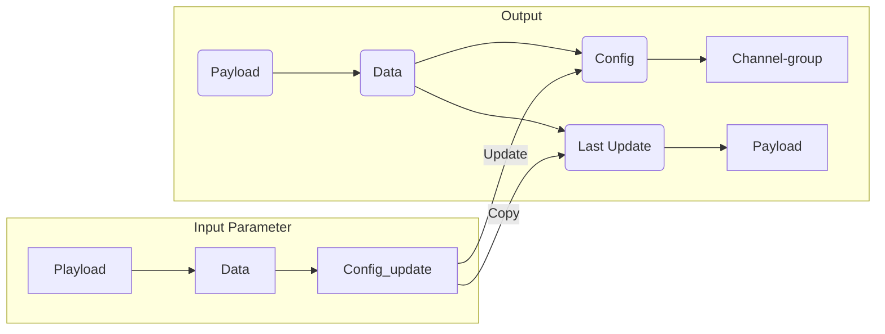

由上可知输入变量Envlope中包含 ***config_update*** 成员
输出格式详见[账本数据结构](#7.1)中的配置交易区块，输出到账本的变量Envlope包含 ***config*** 以及 ***last_config***。 last_config中包含的内容和config_update一致，config
结合到first-network

- 创建通道的channel.tx文件包含config_update

从Processor开始，接口和类关系图如下：

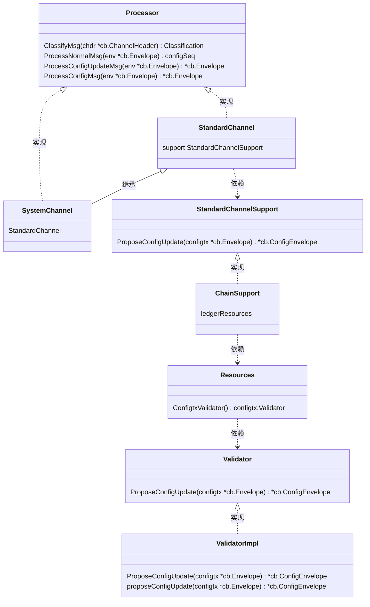

上图的接口和结构体说明：

- 接口Processor在文件orderer/common/msgprocessor/msgprocessor.go中
- 结构体SystemChannel在文件orderer/common/msgprocessor/systemchannel.go中
- 结构体StandardChannel和接口StandardChannelSupport在文件orderer/common/msgprocessor/standardchannel.go中
- 结构体ChainSupport在文件orderer/common/multichannel/chainsupport.go中
- 接口Resources在文件common/channelconfig/api.go中
- 接口Validator在文件common/configtx/configtx.go中
- 结构体ValidatorImpl在文件common/configtx/validator.go中

ValidatorImpl.proposeConfigUpdate方法代码如下：

```go
func (vi *ValidatorImpl) proposeConfigUpdate(configtx *cb.Envelope) (*cb.ConfigEnvelope, error) {
    configUpdateEnv, err := utils.EnvelopeToConfigUpdate(configtx)
    if err != nil {
        return nil, errors.Errorf("error converting envelope to config update: %s", err)
    }

    configMap, err := vi.authorizeUpdate(configUpdateEnv)
    if err != nil {
        return nil, errors.Errorf("error authorizing update: %s", err)
    }

    channelGroup, err := configMapToConfig(configMap, vi.namespace)
    if err != nil {
        return nil, errors.Errorf("could not turn configMap back to channelGroup: %s", err)
    }

    return &cb.ConfigEnvelope{
        Config: &cb.Config{
            Sequence:     vi.sequence + 1,
            ChannelGroup: channelGroup,
        },
        LastUpdate: configtx,
    }, nil
}
```

#### 2.3.2 <span id="2.3.2">Deliver服务</span>

文件common/deliver/deliver.go中的Handle方法：

```go
// Handle receives incoming deliver requests.
func (h *Handler) Handle(ctx context.Context, srv *Server) error {
    addr := util.ExtractRemoteAddress(ctx)
    logger.Debugf("Starting new deliver loop for %s", addr)
    h.Metrics.StreamsOpened.Add(1)
    defer h.Metrics.StreamsClosed.Add(1)
    for {
        logger.Debugf("Attempting to read seek info message from %s", addr)
        envelope, err := srv.Recv()
        if err == io.EOF {
            logger.Debugf("Received EOF from %s, hangup", addr)
            return nil
        }
        if err != nil {
            logger.Warningf("Error reading from %s: %s", addr, err)
            return err
        }

        status, err := h.deliverBlocks(ctx, srv, envelope)
        if err != nil {
            return err
        }

        err = srv.SendStatusResponse(status)
        if status != cb.Status_SUCCESS {
            return err
        }
        if err != nil {
            logger.Warningf("Error sending to %s: %s", addr, err)
            return err
        }

        logger.Debugf("Waiting for new SeekInfo from %s", addr)
    }
}
```
上述代码分析如下：
- Handle方法中Server{}结构体类型参数有两种类型：
  - 当Orderer节点，在文件orderer/common/server/server.go中调用此Handle方法时，`Server.ResponseSender`赋值为`AtomicBroadcast_DeliverServer{}`，详见2.3节[AtomicBroadcast](#2.3)中方法代码;
  - 当Peer节点，，在文件core/peer/deliverevents.go中`Deliver(srv peer.Deliver_DeliverServer)`方法调用此Handle方法时，`Server.ResponseSender`赋值为`Deliver_DeliverServer{}`
- `Server.ResponseSender`包括两个方法：
  - `SendStatusResponse`，在调用deliverBlocks()后，若err为nil，则调用方法向客户端发送状态响应
  - `SendBlockResponse`，在deliverBlocks()中，会调用方法向客户端发送区块数据


上图中`Handler.deliverBlocks`方法的代码如下:

```go
func (h *Handler) deliverBlocks(ctx context.Context, srv *Server, envelope *cb.Envelope) (status cb.Status, err error) {
    addr := util.ExtractRemoteAddress(ctx)
    payload, err := utils.UnmarshalPayload(envelope.Payload)
    if err != nil {
        logger.Warningf("Received an envelope from %s with no payload: %s", addr, err)
        return cb.Status_BAD_REQUEST, nil
    }

    if payload.Header == nil {
        logger.Warningf("Malformed envelope received from %s with bad header", addr)
        return cb.Status_BAD_REQUEST, nil
    }

    chdr, err := utils.UnmarshalChannelHeader(payload.Header.ChannelHeader)
    if err != nil {
        logger.Warningf("Failed to unmarshal channel header from %s: %s", addr, err)
        return cb.Status_BAD_REQUEST, nil
    }

    err = h.validateChannelHeader(ctx, chdr)
    if err != nil {
        logger.Warningf("Rejecting deliver for %s due to envelope validation error: %s", addr, err)
        return cb.Status_BAD_REQUEST, nil
    }

    chain := h.ChainManager.GetChain(chdr.ChannelId)
    if chain == nil {
        // Note, we log this at DEBUG because SDKs will poll waiting for channels to be created
        // So we would expect our log to be somewhat flooded with these
        logger.Debugf("Rejecting deliver for %s because channel %s not found", addr, chdr.ChannelId)
        return cb.Status_NOT_FOUND, nil
    }

    labels := []string{
        "channel", chdr.ChannelId,
        "filtered", strconv.FormatBool(isFiltered(srv)),
    }
    h.Metrics.RequestsReceived.With(labels...).Add(1)
    defer func() {
        labels := append(labels, "success", strconv.FormatBool(status == cb.Status_SUCCESS))
        h.Metrics.RequestsCompleted.With(labels...).Add(1)
    }()

    seekInfo := &ab.SeekInfo{}
    if err = proto.Unmarshal(payload.Data, seekInfo); err != nil {
        logger.Warningf("[channel: %s] Received a signed deliver request from %s with malformed seekInfo payload: %s", chdr.ChannelId, addr, err)
        return cb.Status_BAD_REQUEST, nil
    }

    erroredChan := chain.Errored()
    if seekInfo.ErrorResponse == ab.SeekInfo_BEST_EFFORT {
        // In a 'best effort' delivery of blocks, we should ignore consenter errors
        // and continue to deliver blocks according to the client's request.
        erroredChan = nil
    }
    select {
    case <-erroredChan:
        logger.Warningf("[channel: %s] Rejecting deliver request for %s because of consenter error", chdr.ChannelId, addr)
        return cb.Status_SERVICE_UNAVAILABLE, nil
    default:
    }

    accessControl, err := NewSessionAC(chain, envelope, srv.PolicyChecker, chdr.ChannelId, h.ExpirationCheckFunc)
    if err != nil {
        logger.Warningf("[channel: %s] failed to create access control object due to %s", chdr.ChannelId, err)
        return cb.Status_BAD_REQUEST, nil
    }

    if err := accessControl.Evaluate(); err != nil {
        logger.Warningf("[channel: %s] Client authorization revoked for deliver request from %s: %s", chdr.ChannelId, addr, err)
        return cb.Status_FORBIDDEN, nil
    }

    if seekInfo.Start == nil || seekInfo.Stop == nil {
        logger.Warningf("[channel: %s] Received seekInfo message from %s with missing start or stop %v, %v", chdr.ChannelId, addr, seekInfo.Start, seekInfo.Stop)
        return cb.Status_BAD_REQUEST, nil
    }

    logger.Debugf("[channel: %s] Received seekInfo (%p) %v from %s", chdr.ChannelId, seekInfo, seekInfo, addr)

    cursor, number := chain.Reader().Iterator(seekInfo.Start)
    defer cursor.Close()
    var stopNum uint64
    switch stop := seekInfo.Stop.Type.(type) {
    case *ab.SeekPosition_Oldest:
        stopNum = number
    case *ab.SeekPosition_Newest:
        // when seeking only the newest block (i.e. starting
        // and stopping at newest), don't reevaluate the ledger
        // height as this can lead to multiple blocks being
        // sent when only one is expected
        if proto.Equal(seekInfo.Start, seekInfo.Stop) {
            stopNum = number
            break
        }
        stopNum = chain.Reader().Height() - 1
    case *ab.SeekPosition_Specified:
        stopNum = stop.Specified.Number
        if stopNum < number {
            logger.Warningf("[channel: %s] Received invalid seekInfo message from %s: start number %d greater than stop number %d", chdr.ChannelId, addr, number, stopNum)
            return cb.Status_BAD_REQUEST, nil
        }
    }

    for {
        if seekInfo.Behavior == ab.SeekInfo_FAIL_IF_NOT_READY {
            if number > chain.Reader().Height()-1 {
                return cb.Status_NOT_FOUND, nil
            }
        }

        var block *cb.Block
        var status cb.Status

        iterCh := make(chan struct{})
        go func() {
            block, status = cursor.Next()
            close(iterCh)
        }()

        select {
        case <-ctx.Done():
            logger.Debugf("Context canceled, aborting wait for next block")
            return cb.Status_INTERNAL_SERVER_ERROR, errors.Wrapf(ctx.Err(), "context finished before block retrieved")
        case <-erroredChan:
            // TODO, today, the only user of the errorChan is the orderer consensus implementations.  If the peer ever reports
            // this error, we will need to update this error message, possibly finding a way to signal what error text to return.
            logger.Warningf("Aborting deliver for request because the backing consensus implementation indicates an error")
            return cb.Status_SERVICE_UNAVAILABLE, nil
        case <-iterCh:
            // Iterator has set the block and status vars
        }

        if status != cb.Status_SUCCESS {
            logger.Errorf("[channel: %s] Error reading from channel, cause was: %v", chdr.ChannelId, status)
            return status, nil
        }

        // increment block number to support FAIL_IF_NOT_READY deliver behavior
        number++

        if err := accessControl.Evaluate(); err != nil {
            logger.Warningf("[channel: %s] Client authorization revoked for deliver request from %s: %s", chdr.ChannelId, addr, err)
            return cb.Status_FORBIDDEN, nil
        }

        logger.Debugf("[channel: %s] Delivering block [%d] for (%p) for %s", chdr.ChannelId, block.Header.Number, seekInfo, addr)

        if err := srv.SendBlockResponse(block); err != nil {
            logger.Warningf("[channel: %s] Error sending to %s: %s", chdr.ChannelId, addr, err)
            return cb.Status_INTERNAL_SERVER_ERROR, err
        }

        h.Metrics.BlocksSent.With(labels...).Add(1)

        if stopNum == block.Header.Number {
            break
        }
    }

    logger.Debugf("[channel: %s] Done delivering to %s for (%p)", chdr.ChannelId, addr, seekInfo)

    return cb.Status_SUCCESS, nil
}
```
上述代码分析如下：
- 此区块分发方法应用于peer channel fetch指令，从Orderer节点或Peer节点获取指定位置的数据区块或配置区块
- 应用于gossip主节点，从Orderer节点获取新增区块的方法为BlocksProvider{}接口的BlocksProvider()方法，方法代码详见9.4.2节[主节点获取区块](#9.4.2)
- `err = h.validateChannelHeader(ctx, chdr)`验证Header.ChannelHeader.TlsCertHash证书是否匹配,若tls关闭则忽略检查.


Oderer节点与Peer节点Deliver服务比较：
比较项 | Orderer | Peer
---|---|---
消息文件|protos/orderer/ab.proto|protos/peer/events.proto
消息服务|AtomicBroadcast|Deliver
方法|Broadcast<br>Deliver|Deliver<br>DeliverFiltered
消息处理|common/deliver/deliver.go|与Orderer相同
方法|Handle|与Orderer相同

### 2.4 <span id="2.4">消息处理</span>

---

#### 2.4.1 <span id="2.4.1">Filter</span>

消息Filter在文件orderer/common/msgprocessor/filter.go中定义了规则接口：

```go
// Rule defines a filter function which accepts, rejects, or forwards (to the next rule) an Envelope
type Rule interface {
    // Apply applies the rule to the given Envelope, either successfully or returns error
    Apply(message *ab.Envelope) error
}
```

Fabric的StandardChannel支持四类Filter，分别为：

- EmptyRejectRule，检查消息的playload不能为空
- NewSizeFilter(filterSupport)，检查消息的长度（包括playload和signature）不能超过BatchSize.AbsoluteMaxBytes设置的长度。sampleconfig/configtx.yaml文件中AbsoluteMaxBytes的值为10M
- NewSigFilter(policies.ChannelWriters, policies.ChannelOrdererWriters, filterSupport)，**涉及的policy需要进一步研究**
- NewExpirationRejectRule(filterSupport)，检查当前时间在证书信息Certificate{}结构体中NotAfter字段之前。Certificate{}结构体在签名数据SignedData{Data:env.Payload, Identity:shdr.Creator, Signature: env.Signature,}的Identity字段中。

## 三、<span id="3">Peer节点代码分析</span>

### 3.1 <span id="3.1">Peer节点的启动</span>

---

文件peer/node/start.go中serve方法定义了Peer节点启动的核心流程

```go
func serve(args []string) error {
    // currently the peer only works with the standard MSP
    // because in certain scenarios the MSP has to make sure
    // that from a single credential you only have a single 'identity'.
    // Idemix does not support this *YET* but it can be easily
    // fixed to support it. For now, we just make sure that
    // the peer only comes up with the standard MSP
    mspType := mgmt.GetLocalMSP().GetType()
    if mspType != msp.FABRIC {
        panic("Unsupported msp type " + msp.ProviderTypeToString(mspType))
    }

    mspID := viper.GetString("peer.localMspId")

    // Trace RPCs with the golang.org/x/net/trace package. This was moved out of
    // the deliver service connection factory as it has process wide implications
    // and was racy with respect to initialization of gRPC clients and servers.
    grpc.EnableTracing = true

    logger.Infof("Starting %s", version.GetInfo())

    //startup aclmgmt with default ACL providers (resource based and default 1.0 policies based).
    //Users can pass in their own ACLProvider to RegisterACLProvider (currently unit tests do this)
    aclProvider := aclmgmt.NewACLProvider(
        aclmgmt.ResourceGetter(peer.GetStableChannelConfig),
    )

    pr := platforms.NewRegistry(
        &golang.Platform{},
        &node.Platform{},
        &java.Platform{},
        &car.Platform{},
    )

    deployedCCInfoProvider := &lscc.DeployedCCInfoProvider{}

    identityDeserializerFactory := func(chainID string) msp.IdentityDeserializer {
        return mgmt.GetManagerForChain(chainID)
    }

    opsSystem := newOperationsSystem()
    err := opsSystem.Start()
    if err != nil {
        return errors.WithMessage(err, "failed to initialize operations subystems")
    }
    defer opsSystem.Stop()

    metricsProvider := opsSystem.Provider
    logObserver := floggingmetrics.NewObserver(metricsProvider)
    flogging.Global.SetObserver(logObserver)

    membershipInfoProvider := privdata.NewMembershipInfoProvider(mspID, createSelfSignedData(), identityDeserializerFactory)
    //initialize resource management exit
    ledgermgmt.Initialize(
        &ledgermgmt.Initializer{
            CustomTxProcessors:            peer.ConfigTxProcessors,
            PlatformRegistry:              pr,
            DeployedChaincodeInfoProvider: deployedCCInfoProvider,
            MembershipInfoProvider:        membershipInfoProvider,
            MetricsProvider:               metricsProvider,
            HealthCheckRegistry:           opsSystem,
        },
    )

    // Parameter overrides must be processed before any parameters are
    // cached. Failures to cache cause the server to terminate immediately.
    if chaincodeDevMode {
        logger.Info("Running in chaincode development mode")
        logger.Info("Disable loading validity system chaincode")

        viper.Set("chaincode.mode", chaincode.DevModeUserRunsChaincode)
    }

    if err := peer.CacheConfiguration(); err != nil {
        return err
    }

    peerEndpoint, err := peer.GetPeerEndpoint()
    if err != nil {
        err = fmt.Errorf("Failed to get Peer Endpoint: %s", err)
        return err
    }

    peerHost, _, err := net.SplitHostPort(peerEndpoint.Address)
    if err != nil {
        return fmt.Errorf("peer address is not in the format of host:port: %v", err)
    }

    listenAddr := viper.GetString("peer.listenAddress")
    serverConfig, err := peer.GetServerConfig()
    if err != nil {
        logger.Fatalf("Error loading secure config for peer (%s)", err)
    }

    throttle := comm.NewThrottle(grpcMaxConcurrency)
    serverConfig.Logger = flogging.MustGetLogger("core.comm").With("server", "PeerServer")
    serverConfig.ServerStatsHandler = comm.NewServerStatsHandler(metricsProvider)
    serverConfig.UnaryInterceptors = append(
        serverConfig.UnaryInterceptors,
        grpcmetrics.UnaryServerInterceptor(grpcmetrics.NewUnaryMetrics(metricsProvider)),
        grpclogging.UnaryServerInterceptor(flogging.MustGetLogger("comm.grpc.server").Zap()),
        throttle.UnaryServerIntercptor,
    )
    serverConfig.StreamInterceptors = append(
        serverConfig.StreamInterceptors,
        grpcmetrics.StreamServerInterceptor(grpcmetrics.NewStreamMetrics(metricsProvider)),
        grpclogging.StreamServerInterceptor(flogging.MustGetLogger("comm.grpc.server").Zap()),
        throttle.StreamServerInterceptor,
    )

    peerServer, err := peer.NewPeerServer(listenAddr, serverConfig)
    if err != nil {
        logger.Fatalf("Failed to create peer server (%s)", err)
    }

    if serverConfig.SecOpts.UseTLS {
        logger.Info("Starting peer with TLS enabled")
        // set up credential support
        cs := comm.GetCredentialSupport()
        roots, err := peer.GetServerRootCAs()
        if err != nil {
            logger.Fatalf("Failed to set TLS server root CAs: %s", err)
        }
        cs.ServerRootCAs = roots

        // set the cert to use if client auth is requested by remote endpoints
        clientCert, err := peer.GetClientCertificate()
        if err != nil {
            logger.Fatalf("Failed to set TLS client certificate: %s", err)
        }
        comm.GetCredentialSupport().SetClientCertificate(clientCert)
    }

    mutualTLS := serverConfig.SecOpts.UseTLS && serverConfig.SecOpts.RequireClientCert
    policyCheckerProvider := func(resourceName string) deliver.PolicyCheckerFunc {
        return func(env *cb.Envelope, channelID string) error {
            return aclProvider.CheckACL(resourceName, channelID, env)
        }
    }

    abServer := peer.NewDeliverEventsServer(mutualTLS, policyCheckerProvider, &peer.DeliverChainManager{}, metricsProvider)
    pb.RegisterDeliverServer(peerServer.Server(), abServer)

    // Initialize chaincode service
    chaincodeSupport, ccp, sccp, packageProvider := startChaincodeServer(peerHost, aclProvider, pr, opsSystem)

    logger.Debugf("Running peer")

    // Start the Admin server
    startAdminServer(listenAddr, peerServer.Server(), serverConfig)

    privDataDist := func(channel string, txID string, privateData *transientstore.TxPvtReadWriteSetWithConfigInfo, blkHt uint64) error {
        return service.GetGossipService().DistributePrivateData(channel, txID, privateData, blkHt)
    }

    signingIdentity := mgmt.GetLocalSigningIdentityOrPanic()
    serializedIdentity, err := signingIdentity.Serialize()
    if err != nil {
        logger.Panicf("Failed serializing self identity: %v", err)
    }

    libConf := library.Config{}
    if err = viperutil.EnhancedExactUnmarshalKey("peer.handlers", &libConf); err != nil {
        return errors.WithMessage(err, "could not load YAML config")
    }
    reg := library.InitRegistry(libConf)

    authFilters := reg.Lookup(library.Auth).([]authHandler.Filter)
    endorserSupport := &endorser.SupportImpl{
        SignerSupport:    signingIdentity,
        Peer:             peer.Default,
        PeerSupport:      peer.DefaultSupport,
        ChaincodeSupport: chaincodeSupport,
        SysCCProvider:    sccp,
        ACLProvider:      aclProvider,
    }
    endorsementPluginsByName := reg.Lookup(library.Endorsement).(map[string]endorsement2.PluginFactory)
    validationPluginsByName := reg.Lookup(library.Validation).(map[string]validation.PluginFactory)
    signingIdentityFetcher := (endorsement3.SigningIdentityFetcher)(endorserSupport)
    channelStateRetriever := endorser.ChannelStateRetriever(endorserSupport)
    pluginMapper := endorser.MapBasedPluginMapper(endorsementPluginsByName)
    pluginEndorser := endorser.NewPluginEndorser(&endorser.PluginSupport{
        ChannelStateRetriever:   channelStateRetriever,
        TransientStoreRetriever: peer.TransientStoreFactory,
        PluginMapper:            pluginMapper,
        SigningIdentityFetcher:  signingIdentityFetcher,
    })
    endorserSupport.PluginEndorser = pluginEndorser
    serverEndorser := endorser.NewEndorserServer(privDataDist, endorserSupport, pr, metricsProvider)

    expirationLogger := flogging.MustGetLogger("certmonitor")
    crypto.TrackExpiration(
        serverConfig.SecOpts.UseTLS,
        serverConfig.SecOpts.Certificate,
        comm.GetCredentialSupport().GetClientCertificate().Certificate,
        serializedIdentity,
        expirationLogger.Warnf, // This can be used to piggyback a metric event in the future
        time.Now(),
        time.AfterFunc)

    policyMgr := peer.NewChannelPolicyManagerGetter()

    // Initialize gossip component
    err = initGossipService(policyMgr, metricsProvider, peerServer, serializedIdentity, peerEndpoint.Address)
    if err != nil {
        return err
    }
    defer service.GetGossipService().Stop()

    // register prover grpc service
    // FAB-12971 disable prover service before v1.4 cut. Will uncomment after v1.4 cut
    // err = registerProverService(peerServer, aclProvider, signingIdentity)
    // if err != nil {
    //  return err
    // }

    // initialize system chaincodes

    // deploy system chaincodes
    sccp.DeploySysCCs("", ccp)
    logger.Infof("Deployed system chaincodes")

    installedCCs := func() ([]ccdef.InstalledChaincode, error) {
        return packageProvider.ListInstalledChaincodes()
    }
    lifecycle, err := cc.NewLifeCycle(cc.Enumerate(installedCCs))
    if err != nil {
        logger.Panicf("Failed creating lifecycle: +%v", err)
    }
    onUpdate := cc.HandleMetadataUpdate(func(channel string, chaincodes ccdef.MetadataSet) {
        service.GetGossipService().UpdateChaincodes(chaincodes.AsChaincodes(), gossipcommon.ChainID(channel))
    })
    lifecycle.AddListener(onUpdate)

    // this brings up all the channels
    peer.Initialize(func(cid string) {
        logger.Debugf("Deploying system CC, for channel <%s>", cid)
        sccp.DeploySysCCs(cid, ccp)
        sub, err := lifecycle.NewChannelSubscription(cid, cc.QueryCreatorFunc(func() (cc.Query, error) {
            return peer.GetLedger(cid).NewQueryExecutor()
        }))
        if err != nil {
            logger.Panicf("Failed subscribing to chaincode lifecycle updates")
        }
        cceventmgmt.GetMgr().Register(cid, sub)
    }, ccp, sccp, txvalidator.MapBasedPluginMapper(validationPluginsByName),
        pr, deployedCCInfoProvider, membershipInfoProvider, metricsProvider)

    if viper.GetBool("peer.discovery.enabled") {
        registerDiscoveryService(peerServer, policyMgr, lifecycle)
    }

    networkID := viper.GetString("peer.networkId")

    logger.Infof("Starting peer with ID=[%s], network ID=[%s], address=[%s]", peerEndpoint.Id, networkID, peerEndpoint.Address)

    // Get configuration before starting go routines to avoid
    // racing in tests
    profileEnabled := viper.GetBool("peer.profile.enabled")
    profileListenAddress := viper.GetString("peer.profile.listenAddress")

    // Start the grpc server. Done in a goroutine so we can deploy the
    // genesis block if needed.
    serve := make(chan error)

    // Start profiling http endpoint if enabled
    if profileEnabled {
        go func() {
            logger.Infof("Starting profiling server with listenAddress = %s", profileListenAddress)
            if profileErr := http.ListenAndServe(profileListenAddress, nil); profileErr != nil {
                logger.Errorf("Error starting profiler: %s", profileErr)
            }
        }()
    }

    go handleSignals(addPlatformSignals(map[os.Signal]func(){
        syscall.SIGINT:  func() { serve <- nil },
        syscall.SIGTERM: func() { serve <- nil },
    }))

    logger.Infof("Started peer with ID=[%s], network ID=[%s], address=[%s]", peerEndpoint.Id, networkID, peerEndpoint.Address)

    // check to see if the peer ledgers have been reset
    preResetHeights, err := kvledger.LoadPreResetHeight()
    if err != nil {
        return fmt.Errorf("error loading prereset height: %s", err)
    }
    for cid, height := range preResetHeights {
        logger.Infof("Ledger rebuild: channel [%s]: preresetHeight: [%d]", cid, height)
    }
    if len(preResetHeights) > 0 {
        logger.Info("Ledger rebuild: Entering loop to check if current ledger heights surpass prereset ledger heights. Endorsement request processing will be disabled.")
        resetFilter := &reset{
            reject: true,
        }
        authFilters = append(authFilters, resetFilter)
        go resetLoop(resetFilter, preResetHeights, peer.GetLedger, 10*time.Second)
    }

    // start the peer server
    auth := authHandler.ChainFilters(serverEndorser, authFilters...)
    // Register the Endorser server
    pb.RegisterEndorserServer(peerServer.Server(), auth)

    go func() {
        var grpcErr error
        if grpcErr = peerServer.Start(); grpcErr != nil {
            grpcErr = fmt.Errorf("grpc server exited with error: %s", grpcErr)
        }
        serve <- grpcErr
    }()

    // Block until grpc server exits
    return <-serve
}
```

从上述代码，可以来分析Peer启动的流程

- 代码`startChaincodeServer`初始化chaincode服务，启动ChaincodeServer

- 代码`peer.Initialize(func(cid string) {}, ...)`中定义匿名函数，赋值给package的变量`var chainInitializer func(string)`，用于将Peer加入新通道后的初始化操作。匿名函数包含语句`lifecycle.NewChannelSubscription(cid, cc.QueryCreatorFunc(func() (cc.Query, error) {}))`中的`QueryCreatorFunc`定义如下。
  
  ```go
  // QueryCreator creates queries
  type QueryCreator interface {
    // NewQuery creates a new Query, or error on failure
    NewQuery() (Query, error)
  }
  // QueryCreatorFunc creates a new query
  type QueryCreatorFunc func() (Query, error)
  // NewQuery creates a new Query, or error on failure
  func (qc QueryCreatorFunc) NewQuery() (Query, error) {
    return qc()
  }
  ```

通过函数变量定义接口方法的用法需要进一步学习和理解。

#### 3.1.1 <span id="3.1.1">Peer handlers register</span>

上述3.1节启动代码`libConf := library.Config{}`开始的相关代码完成`peer.handlers`的注册，目前包括authFilters、decorators、endorsers、validators四种类型,,在core/handlers/library/registry.go文件中相关代码如下：
```go
// HandlerType defines custom handlers that can filter and mutate
// objects passing within the peer
type HandlerType int

const (
    // Auth handler - reject or forward proposals from clients
    Auth HandlerType = iota
    // Decoration handler - append or mutate the chaincode input
    // passed to the chaincode
    Decoration
    Endorsement
    Validation
)
```

peer.handlers在sampleconfig/core.yaml文件中的配置如下：

```yaml
peer
    handlers:
        authFilters:
          -
            name: DefaultAuth
          -
            name: ExpirationCheck    # This filter checks identity x509 certificate expiration
        decorators:
          -
            name: DefaultDecorator
        endorsers:
          escc:
            name: DefaultEndorsement
            library:
        validators:
          vscc:
            name: DefaultValidation
            library:
```

Peer启动serve()方法代码中`library.Config{}`结构体相关定义如下：

```go
type Config struct {
    AuthFilters []*HandlerConfig `mapstructure:"authFilters" yaml:"authFilters"`
    Decorators  []*HandlerConfig `mapstructure:"decorators" yaml:"decorators"`
    Endorsers   PluginMapping    `mapstructure:"endorsers" yaml:"endorsers"`
    Validators  PluginMapping    `mapstructure:"validators" yaml:"validators"`
}
type PluginMapping map[string]*HandlerConfig

// HandlerConfig defines configuration for a plugin or compiled handler
type HandlerConfig struct {
    Name    string `mapstructure:"name" yaml:"name"`
    Library string `mapstructure:"library" yaml:"library"`
}
```

***`viperutil.EnhancedExactUnmarshalKey("peer.handlers", &libConf)`将配置文件内容转为config结构体变量*** ???

接下来，在serve()方法中执行`reg := library.InitRegistry(libConf)`，其中`library.InitRegistry()`方法在core/handlers/library/registry.go文件中相关代码如下：

```go
type Registry interface {
    // Lookup returns a handler with a given
    // registered name, or nil if does not exist
    Lookup(HandlerType) interface{}
}
type registry struct {
    filters    []auth.Filter
    decorators []decoration.Decorator
    endorsers  map[string]endorsement2.PluginFactory
    validators map[string]validation.PluginFactory
}
// InitRegistry creates the (only) instance
// of the registry
func InitRegistry(c Config) Registry {
    once.Do(func() {
        reg = registry{
            endorsers:  make(map[string]endorsement2.PluginFactory),
            validators: make(map[string]validation.PluginFactory),
        }
        reg.loadHandlers(c)
    })
    return &reg
}

// loadHandlers loads the configured handlers
func (r *registry) loadHandlers(c Config) {
    for _, config := range c.AuthFilters {
        r.evaluateModeAndLoad(config, Auth)
    }
    for _, config := range c.Decorators {
        r.evaluateModeAndLoad(config, Decoration)
    }

    for chaincodeID, config := range c.Endorsers {
        r.evaluateModeAndLoad(config, Endorsement, chaincodeID)
    }

    for chaincodeID, config := range c.Validators {
        r.evaluateModeAndLoad(config, Validation, chaincodeID)
    }
}

// evaluateModeAndLoad if a library path is provided, load the shared object
func (r *registry) evaluateModeAndLoad(c *HandlerConfig, handlerType HandlerType, extraArgs ...string) {
    if c.Library != "" {
        r.loadPlugin(c.Library, handlerType, extraArgs...)
    } else {
        r.loadCompiled(c.Name, handlerType, extraArgs...)
    }
}

// loadCompiled loads a statically compiled handler
func (r *registry) loadCompiled(handlerFactory string, handlerType HandlerType, extraArgs ...string) {
    registryMD := reflect.ValueOf(&HandlerLibrary{})

    o := registryMD.MethodByName(handlerFactory)
    if !o.IsValid() {
        logger.Panicf(fmt.Sprintf("Method %s isn't a method of HandlerLibrary", handlerFactory))
    }

    inst := o.Call(nil)[0].Interface()

    if handlerType == Auth {
        r.filters = append(r.filters, inst.(auth.Filter))
    } else if handlerType == Decoration {
        r.decorators = append(r.decorators, inst.(decoration.Decorator))
    } else if handlerType == Endorsement {
        if len(extraArgs) != 1 {
            logger.Panicf("expected 1 argument in extraArgs")
        }
        r.endorsers[extraArgs[0]] = inst.(endorsement2.PluginFactory)
    } else if handlerType == Validation {
        if len(extraArgs) != 1 {
            logger.Panicf("expected 1 argument in extraArgs")
        }
        r.validators[extraArgs[0]] = inst.(validation.PluginFactory)
    }
}
```

以及HandlerLibrary{}结构体相关代码如下：

```go
// HandlerLibrary is used to assert
// how to create the various handlers
type HandlerLibrary struct {
}

// DefaultAuth creates a default auth.Filter
// that doesn't do any access control checks - simply
// forwards the request further.
// It needs to be initialized via a call to Init()
// and be passed a peer.EndorserServer
func (r *HandlerLibrary) DefaultAuth() auth.Filter {
    return filter.NewFilter()
}

// ExpirationCheck is an auth filter which blocks requests
// from identities with expired x509 certificates
func (r *HandlerLibrary) ExpirationCheck() auth.Filter {
    return filter.NewExpirationCheckFilter()
}

// DefaultDecorator creates a default decorator
// that doesn't do anything with the input, simply
// returns the input as output.
func (r *HandlerLibrary) DefaultDecorator() decoration.Decorator {
    return decorator.NewDecorator()
}

func (r *HandlerLibrary) DefaultEndorsement() endorsement.PluginFactory {
    return &builtin.DefaultEndorsementFactory{}
}

func (r *HandlerLibrary) DefaultValidation() validation.PluginFactory {
    return &DefaultValidationFactory{}
}
```

上述两段代码解析如下：

- 首先创建registry结构体，单例模式。
- 调用`loadHandlers`方法，AuthFilters、Decorators仅包含`HandlerConfig`类型的变量`config`;Endorsers、Validators包含变量`chaincodeID`及`config`,从配置文件可知，Endorsers的`chaincodeID`变量值为escc，而Validators`chaincodeID`变量值为vscc
- 接下来调用`evaluateModeAndLoad`方法，从配置文件内容可知，默认的core.yaml配置中library都为空，执行`loadCompiled`方法

##### 3.1.1.1 <span id="3.1.1.1">Endorsement Plugin</span>

执行`loadCompiled(handlerFactory="DefaultEndorsement", handlerType=2, extraArgs={"escc"})`方法，利用golang reflect反射机制，执行如下代码：

```go
registryMD := reflect.ValueOf(&HandlerLibrary{})
o := registryMD.MethodByName(handlerFactory="DefaultEndorsement")，
inst := o.Call(nil)[0].Interface()
r.endorsers[extraArgs[0]="escc"] = inst.(endorsement2.PluginFactory)
```

后，实质上的赋值为`r.endorsers["escc"]=&builtin.DefaultEndorsementFactory{}`。HandlerLibrary{}结构体定义文件中引用的buildin的路径为core/handlers/endorsement/builtin/default_endorsement.go。若libaray不为空，需要事先编译core/handlers/endorsement/plugin/plugin.go

```shell
## To build the plugin, run:
go build -buildmode=plugin -o escc.so plugin.go
```

接下来，在serve()方法中执行：

```go
endorsementPluginsByName := reg.Lookup(library.Endorsement).(map[string]endorsement2.PluginFactory)
pluginMapper := endorser.MapBasedPluginMapper(endorsementPluginsByName)
pluginEndorser := endorser.NewPluginEndorser(&endorser.PluginSupport{
        ChannelStateRetriever:   channelStateRetriever,
        TransientStoreRetriever: peer.TransientStoreFactory,
        PluginMapper:            pluginMapper,
        SigningIdentityFetcher:  signingIdentityFetcher,
    })
```

文件core/endorser/plugin_endorser.go中MapBasedPluginMapper的定义如下：

```go
// PluginMapper maps plugin names to their corresponding factories
type PluginMapper interface {
    PluginFactoryByName(name PluginName) endorsement.PluginFactory
}

// MapBasedPluginMapper maps plugin names to their corresponding factories
type MapBasedPluginMapper map[string]endorsement.PluginFactory

// PluginFactoryByName returns a plugin factory for the given plugin name, or nil if not found
func (m MapBasedPluginMapper) PluginFactoryByName(name PluginName) endorsement.PluginFactory {
    return m[string(name)]
}
```

最终pluginMapper包含在endorser.PluginSupport及PluginEndorser结构体中，通过pluginMapper，获取已经实例化的&builtin.DefaultEndorsementFactory{}的结构体，实现了endorsement.PluginFactory{}接口方法

Endorsement plugins的类图如下：

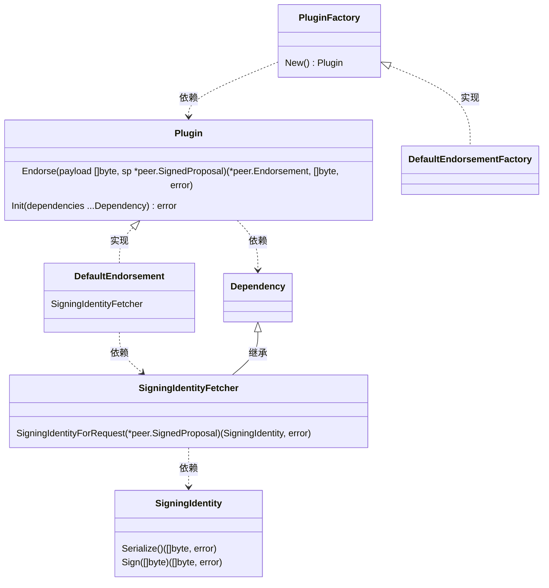

Dependency的接口在Init时通过参数传入，进行调用Endorse进行背书操作时，DefaultEndorsement调用SigningIdentityForRequest方法获取SigningIdentity实例，完成Sign签名操作。详见3.2.3节[EndorseServer](#3.2.3)

##### 3.1.1.2 <span id="3.1.1.2">Validation Plugin</span>

执行`loadCompiled(handlerFactory="DefaultValidation", handlerType=3, extraArgs={"vscc"})`方法，利用golang reflect反射机制，执行如下代码：

```go
registryMD := reflect.ValueOf(&HandlerLibrary{})
o := registryMD.MethodByName(handlerFactory="DefaultValidation")，
inst := o.Call(nil)[0].Interface()
r.validators[extraArgs[0]="vscc"] = inst.(validation.PluginFactory)
```

后，实质上的赋值为`r.validators["escc"]=&builtin.DefaultValidationFactory{}`。HandlerLibrary{}结构体定义文件中引用的buildin的路径为core/handlers/validation/builtin/default_validation.go。与Endorsement背书不同的是，Validation的接口实现仅buildin方式，无plugins方式。

接下来，在serve()方法中执行：

```go
validationPluginsByName := reg.Lookup(library.Validation).(map[string]validation.PluginFactory)

peer.Initialize(func(cid string) {...}, ccp, sccp, txvalidator.MapBasedPluginMapper(validationPluginsByName),
    pr, deployedCCInfoProvider, membershipInfoProvider, metricsProvider)
```

文件core/committer/txvalidator/plugin_validator.go中MapBasedPluginMapper的定义如下：

```go
// MapBasedPluginMapper maps plugin names to their corresponding factories
type MapBasedPluginMapper map[string]validation.PluginFactory

// PluginFactoryByName returns a plugin factory for the given plugin name, or nil if not found
func (m MapBasedPluginMapper) PluginFactoryByName(name PluginName) validation.PluginFactory {
    return m[string(name)]
}

//go:generate mockery -dir . -name PluginMapper -case underscore -output mocks/
//go:generate mockery -dir ../../handlers/validation/api/ -name PluginFactory -case underscore -output mocks/
//go:generate mockery -dir ../../handlers/validation/api/ -name Plugin -case underscore -output mocks/

// PluginMapper maps plugin names to their corresponding factory instance.
// Returns nil if the name isn't associated to any plugin.
type PluginMapper interface {
    PluginFactoryByName(name PluginName) validation.PluginFactory
}
```

文件core/peer/peer.go中定义了静态变量pluginMapper`var pluginMapper txvalidator.PluginMapper`,在启动peer节点调用`peer.Initialize`时，对变量进行赋值。

pluginMapper包含在通道中，为每个通道提供背书验证功能。其被调用图如下：

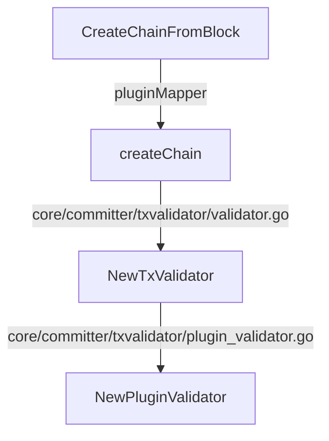

上述调用图

- 执行peer channel jion命令时，调用CreateChainFromBlock方法
- 最终NewPluginValidator方法获取PluginValidator{PluginMapper:pluginMapper}结构体，包含pluginMapper

Validation plugins的类图如下：

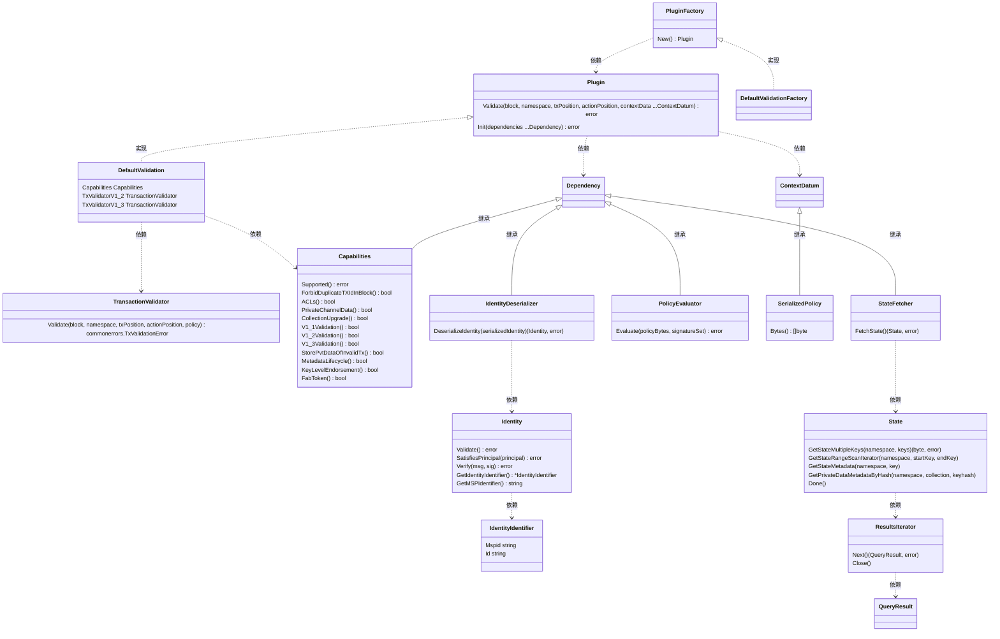

#### 3.1.2 <span id="3.1.2">启动EndorserServer</span>

- 代码`serverEndorser := endorser.NewEndorserServer(privDataDist, endorserSupport, pr, metricsProvider)、auth := authHandler.ChainFilters(serverEndorser, authFilters...)、pb.RegisterEndorserServer(peerServer.Server(), auth)`完成Endorse Server注册，负责处理SignedPropasol。serverEndorser和authFilters组合成SignedPropasol消息处理的链式调用。
  - 其中`privDataDist`函数变量赋值为`GossipService{}`接口的方法`DistributePrivateData`，详见3.1节[Peer节点的启动](#3.1)的中serve()方法代码。执行到此处时，`GossipService{}`接口变量应为`nil`，当执行到`initGossipService()`方法时才赋值。

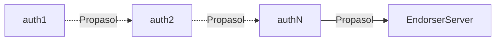

#### 3.1.3 <span id="3.1.3">初始化MSP</span>

文件peer/common/common.go中InitCmd开始的调用关系如下：

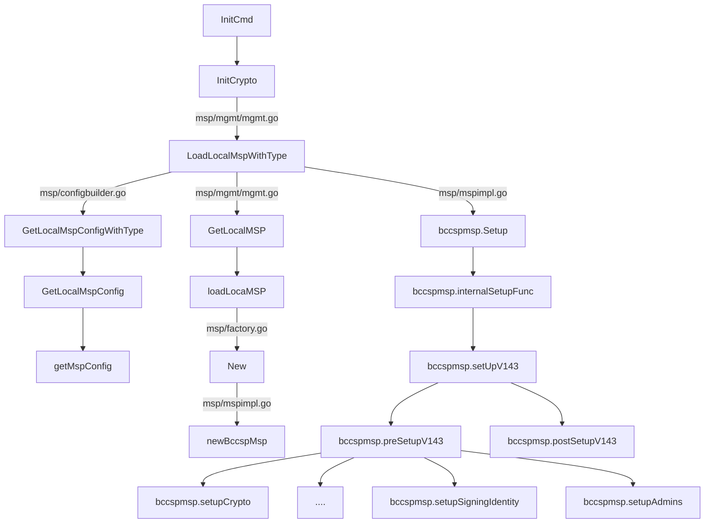

上诉调用流程通过读取Peer的配置参数，构造实现MSP{}接口的bccspbccspmsp{}结构体

首先分析一下初始化MSP的配置参数信息：

- `peer.mspConfigPath`，在sampleconfig/core.yaml中定义
  ```yaml
  peer:
     mspConfigPath:msp
  ```
- `peer.localMspId`，fabric-sample/fisrt-network项目中，在文件base/docker-compose-base.yaml中定义了配置参数`Org1MSP`及`Org1MSP`
  ```yaml  
  peer0.org1.example.com:
     environment:
        CORE_PEER_LOCALMSPID=Org1MSP
  
  peer0.org2.example.com:
     environment:
        CORE_PEER_LOCALMSPID=Org2MSP
  ```
- peer.localMspType，有两个类型，`FABRIC`及`IDEMIX`，默认使用`FABRIC`。在msp/msp.go文件中定义。

上面`peer.mspConfigPath`定义的MSP的目录，其值为`msp`。目录位于环境变量`FABRIC_CFG_PATH`目录下，其默认的值为/etc/hyperledger/fabric。因此`peer.mspConfigPath`的绝对路径即为/etc/hyperledger/fabric/msp。目录下的内容一般为cryptogen工具为组织生成的密钥及证书。fabric-sample/fisrt-network项目中，在文件base/docker-compose-base.yaml中定义了volumes参数:
```yaml  
peer0.org2.example.com:
    volumes:
        ../crypto-config/peerOrganizations/org1.example.com/peers/peer0.org1.example.com/msp:/etc/hyperledger/fabric/msp
        ../crypto-config/peerOrganizations/org1.example.com/peers/peer0.org1.example.com/tls:/etc/hyperledger/fabric/tls
```
在fisrt-network项目中./crypto-config/peerOrganizations/org1.example.com/peers/peer0.org1.example.com/msp目录中内容由cryptogen生成，其包含的目录及文件如下：

- admincerts
- cacerts
  - ca.org1.example.com-cert.pem
- config.yaml
- keystore
  - *key-id*_sk
- signcerts
  - peer0.org1.example.com-cert.pem
- tlscacerts
  - tlsca.org1.example.com-cert.pem
    明确msp目录的内容，便于理解后续bccspmsp{}变量的构造程序。

##### 3.1.3.1 <span id="3.1.3.1">MSP接口构造</span>

MSP接口封装对外提供的功能方法,文件msp/msp.go中MSP接口定义如下：

```go
// MSP is the minimal Membership Service Provider Interface to be implemented
// to accommodate peer functionality
type MSP interface {

    // IdentityDeserializer interface needs to be implemented by MSP
    IdentityDeserializer

    // Setup the MSP instance according to configuration information
    Setup(config *msp.MSPConfig) error

    // GetVersion returns the version of this MSP
    GetVersion() MSPVersion

    // GetType returns the provider type
    GetType() ProviderType

    // GetIdentifier returns the provider identifier
    GetIdentifier() (string, error)

    // GetSigningIdentity returns a signing identity corresponding to the provided identifier
    GetSigningIdentity(identifier *IdentityIdentifier) (SigningIdentity, error)

    // GetDefaultSigningIdentity returns the default signing identity
    GetDefaultSigningIdentity() (SigningIdentity, error)

    // GetTLSRootCerts returns the TLS root certificates for this MSP
    GetTLSRootCerts() [][]byte

    // GetTLSIntermediateCerts returns the TLS intermediate root certificates for this MSP
    GetTLSIntermediateCerts() [][]byte

    // Validate checks whether the supplied identity is valid
    Validate(id Identity) error

    // SatisfiesPrincipal checks whether the identity matches
    // the description supplied in MSPPrincipal. The check may
    // involve a byte-by-byte comparison (if the principal is
    // a serialized identity) or may require MSP validation
    // SatisfiesPrincipal 检查身份是否与 MSPPrincipal 中提供的描述相匹配。 
    // 检查可能涉及逐字节比较（如果主体是序列化身份）或可能需要 MSP 验证
    SatisfiesPrincipal(id Identity, principal *msp.MSPPrincipal) error
}
```

上述代码解析如下：

- `Setup(config *msp.MSPConfig) error`方法用于构造bccspmsp{}内部的变量及赋值
- `GetDefaultSigningIdentity() (SigningIdentity, error)`获取签名身份（即证书），用于背书验证。fabric-sample/fisrt-network项目中，签名证书的目录及文件为msp/signcerts/peer0.org1.example.com-cert.pem，因此背书策略的证书类型仅支持默认的Org.peer。该目录下并无Admin或User类型证书；
- `GetSigningIdentity(identifier *IdentityIdentifier) (SigningIdentity, error)`获取指定标识符的签名证书。但在bccspmsp{}结构体中，该方法未实现。

接下来分析bccspmsp{}构造流程中涉及关键方法：

```go
func GetLocalMspConfig(dir string, bccspConfig *factory.FactoryOpts, ID string) (*msp.MSPConfig, error) {
    signcertDir := filepath.Join(dir, signcerts)
    keystoreDir := filepath.Join(dir, keystore)
    bccspConfig = SetupBCCSPKeystoreConfig(bccspConfig, keystoreDir)

    err := factory.InitFactories(bccspConfig)
    if err != nil {
        return nil, errors.WithMessage(err, "could not initialize BCCSP Factories")
    }

    signcert, err := getPemMaterialFromDir(signcertDir)
    if err != nil || len(signcert) == 0 {
        return nil, errors.Wrapf(err, "could not load a valid signer certificate from directory %s", signcertDir)
    }

    /* FIXME: for now we're making the following assumptions
    1) there is exactly one signing cert
    2) BCCSP's KeyStore has the private key that matches SKI of
       signing cert
    */

    sigid := &msp.SigningIdentityInfo{PublicSigner: signcert[0], PrivateSigner: nil}

    return getMspConfig(dir, ID, sigid)
}
```

上述代码解析如下：

- 输入参数中dir的值为`peer.mspConfigPath`的参数配置，为/etc/hyperledger/fabric
- 输入参数ID的值为`peer.localMspId`的参数配置，一般为Org1MSP、Org2MSP等格式
- signcertDir目录为`peer.mspConfigPath`\msp\signcerts,`signcert, err := getPemMaterialFromDir(signcertDir)`读取该目录下的证书列表，默认为peer证书。
- 执行`sigid := &msp.SigningIdentityInfo{PublicSigner: signcert[0], PrivateSigner: nil}`，构造出

文件msp/mspimplsetup.go中setupSigningIdentity方法的代码如下:

```go
func (msp *bccspmsp) setupSigningIdentity(conf *m.FabricMSPConfig) error {
    if conf.SigningIdentity != nil {
        sid, err := msp.getSigningIdentityFromConf(conf.SigningIdentity)
        if err != nil {
            return err
        }

        expirationTime := sid.ExpiresAt()
        now := time.Now()
        if expirationTime.After(now) {
            mspLogger.Debug("Signing identity expires at", expirationTime)
        } else if expirationTime.IsZero() {
            mspLogger.Debug("Signing identity has no known expiration time")
        } else {
            return errors.Errorf("signing identity expired %v ago", now.Sub(expirationTime))
        }

        msp.signer = sid
    }

    return nil
}
```

上述代码解析如下：

- `msp.getSigningIdentityFromConf(conf.SigningIdentity)`从conf.SigningIdentity是SigningIdentityInfo{}类型,从msp目录中读取key,并最终返回SigningIdentity{}接口类型,实现该接口类型的signingidentity{}结构体的类图结构如下:

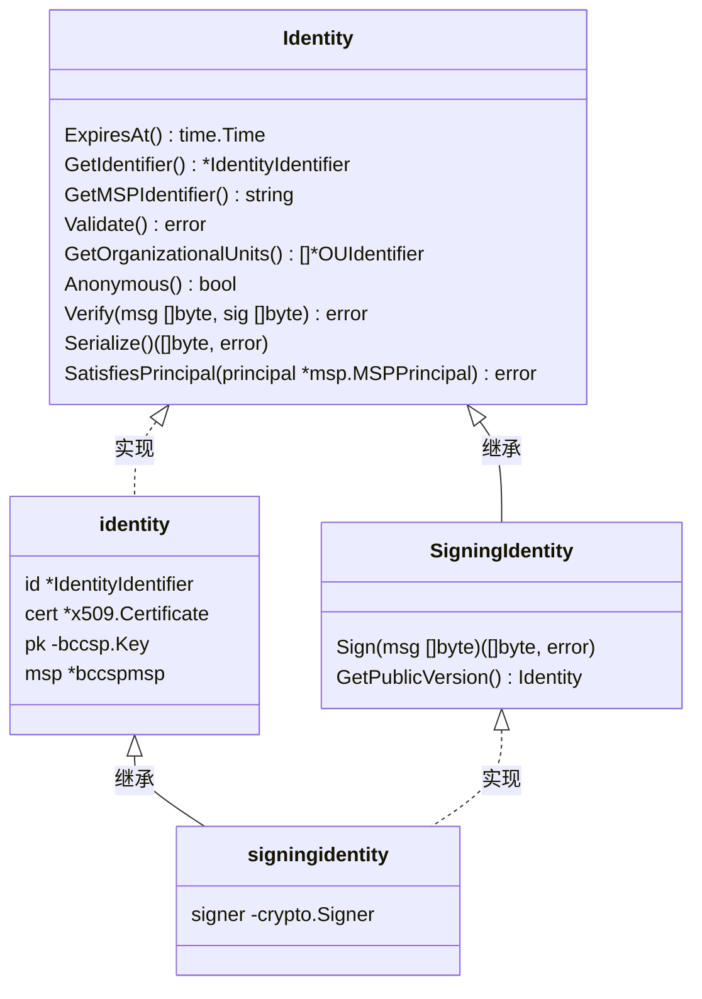

上图的接口和结构体说明：

- 接口Identity{}在文件msp/msp.go中
- 接口SigningIdentity{}在文件msp/msp.go中
- 结构体identity{}在文件msp/identities.go中
- 结构体signingidentity{}在文件msp/identities.go中

##### 3.1.3.2 <span id="3.1.3.2">MSP接口使用</span>

文件msp/mgmt/mgmt.go中GetLocalMSP方法

```go
func GetLocalMSP() msp.MSP {
    m.Lock()
    defer m.Unlock()

    if localMsp != nil {
        return localMsp
    }

    localMsp = loadLocaMSP()

    return localMsp
}
```

GetLocalMSP方法类似于静态方法,在MSP构造过程当中也被调用,初始化完成之前localMsp变量为nil,会进入后续`localMsp = loadLocaMSP()`.完成初始化后,localMsp不为空,即返回localMsp

Peer在文件中peer/common/common.go定义了静态函数变量GetDefaultSignerFnc,用于后续Peer中其他模块调用

- `GetDefaultSignerFnc func() (msp.SigningIdentity, error)`
- init()方法中`GetBroadcastClientFnc = GetBroadcastClient`

文件peer/common/common.go中,GetBroadcastClient方法定义如下:

```go
// GetDefaultSigner return a default Signer(Default/PERR) for cli
func GetDefaultSigner() (msp.SigningIdentity, error) {
    signer, err := mspmgmt.GetLocalMSP().GetDefaultSigningIdentity()
    if err != nil {
        return nil, errors.WithMessage(err, "error obtaining the default signing identity")
    }

    return signer, err
}
```

上述代码中,目前能够获取的Peer的Signer,表示Peer进行背书签名操作,仅支持Org.peer背书策略.

### 3.2 <span id="3.2">Endoser服务</span>

---

#### 3.2.1 <span id="3.2.1">Proposal提案数据结构</span>

背书服务处理三类Proposal提案数据结构，分别为SignedProposal、ProposalResponse以及SignedTransaction。
在文件protos/peer/proposal.proto中Endorse服务的处理的提案Proposal有两种类型，分别为

1. generic transaction，通用交易类型

2. CHAINCODE transaction，CHAINCODE交易类型
   两种类型的transaction交易的SignedProposal、ProposalResponse以及SignedTransaction的包含字段及扩展有所不同。
   
##### 3.2.1.1 <span id="3.2.1.1">通用交易类型数据结构</span>

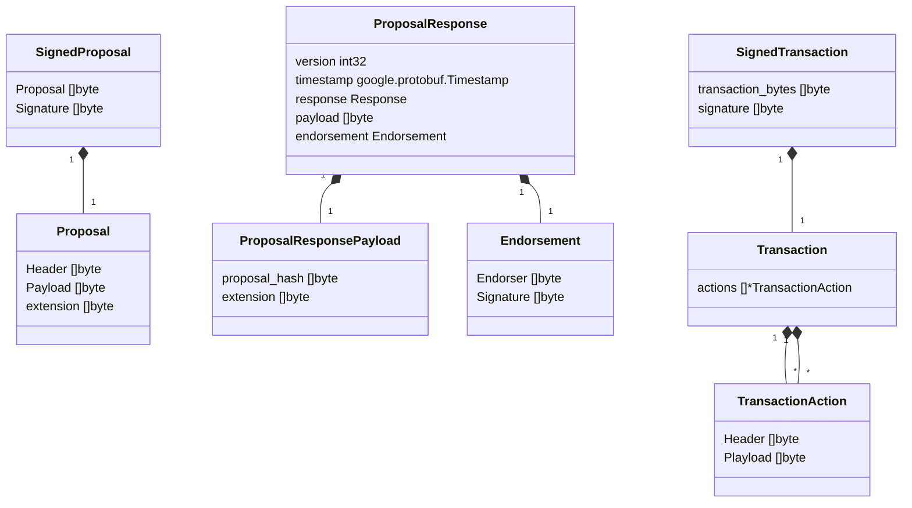


##### 3.2.1.2 <span id="3.2.1.2">CHAINCODE交易类型数据结构</span>
SignedProposal、ProposalResponse数据结构如下
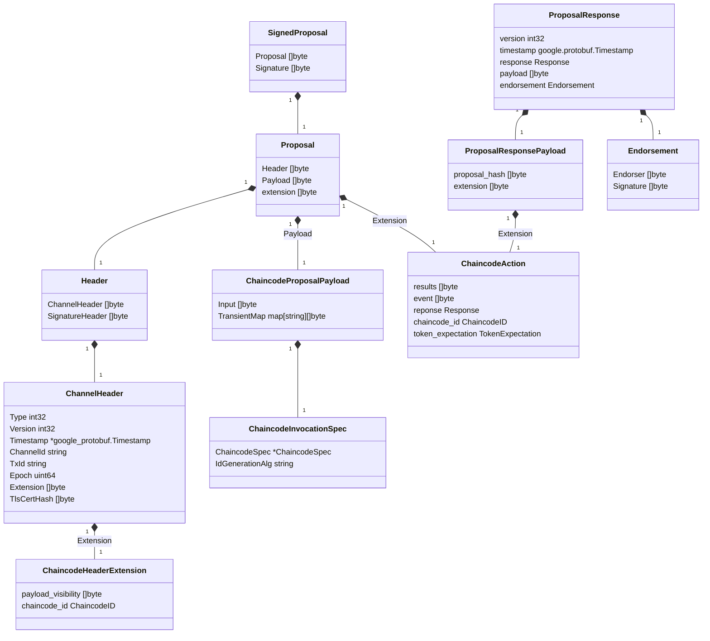

SignedTransaction的数据结构如下：

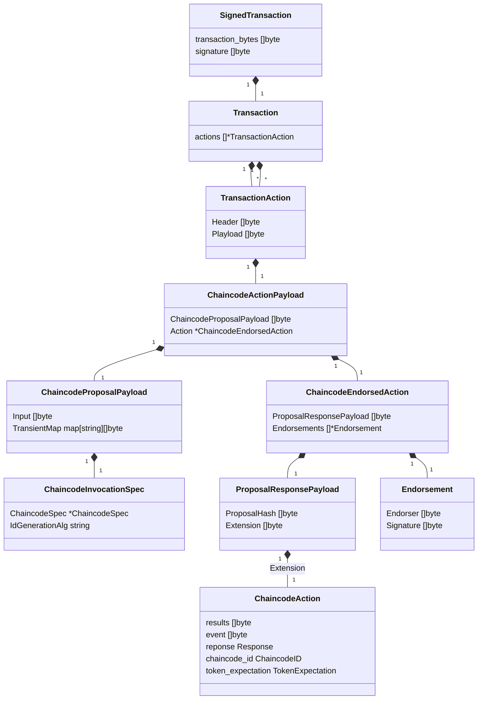

*注：从Fabrci源码的查询来看，文件中protos/peer/transaction.pb.go的`SignedTransaction`结构体并未有任何引用；但其下层的`Transaction`包含在区块的`Envelope`结构体中。详情参考[交易区块结构](#7.1.1)*

文件protos/utils/txutils.go的`CreateSignedTx`方法将输入的Proposal及ProposalResponse转换为common.Envelope，即交易区块的交易数据内容。其输入输出示意如下:

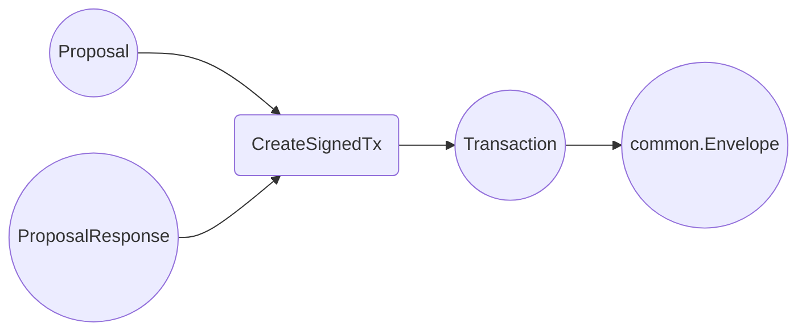

`CreateSignedTx`的代码详情如下:

```go
// CreateSignedTx assembles an Envelope message from proposal, endorsements,
// and a signer. This function should be called by a client when it has
// collected enough endorsements for a proposal to create a transaction and
// submit it to peers for ordering
func CreateSignedTx(proposal *peer.Proposal, signer msp.SigningIdentity, resps ...*peer.ProposalResponse) (*common.Envelope, error) {
    if len(resps) == 0 {
        return nil, errors.New("at least one proposal response is required")
    }

    // the original header
    hdr, err := GetHeader(proposal.Header)
    if err != nil {
        return nil, err
    }

    // the original payload
    pPayl, err := GetChaincodeProposalPayload(proposal.Payload)
    if err != nil {
        return nil, err
    }

    // check that the signer is the same that is referenced in the header
    // TODO: maybe worth removing?
    signerBytes, err := signer.Serialize()
    if err != nil {
        return nil, err
    }

    shdr, err := GetSignatureHeader(hdr.SignatureHeader)
    if err != nil {
        return nil, err
    }

    if bytes.Compare(signerBytes, shdr.Creator) != 0 {
        return nil, errors.New("signer must be the same as the one referenced in the header")
    }

    // get header extensions so we have the visibility field
    hdrExt, err := GetChaincodeHeaderExtension(hdr)
    if err != nil {
        return nil, err
    }

    // ensure that all actions are bitwise equal and that they are successful
    var a1 []byte
    for n, r := range resps {
        if n == 0 {
            a1 = r.Payload
            if r.Response.Status < 200 || r.Response.Status >= 400 {
                return nil, errors.Errorf("proposal response was not successful, error code %d, msg %s", r.Response.Status, r.Response.Message)
            }
            continue
        }

        if bytes.Compare(a1, r.Payload) != 0 {
            return nil, errors.New("ProposalResponsePayloads do not match")
        }
    }

    // fill endorsements
    endorsements := make([]*peer.Endorsement, len(resps))
    for n, r := range resps {
        endorsements[n] = r.Endorsement
    }

    // create ChaincodeEndorsedAction
    cea := &peer.ChaincodeEndorsedAction{ProposalResponsePayload: resps[0].Payload, Endorsements: endorsements}

    // obtain the bytes of the proposal payload that will go to the transaction
    propPayloadBytes, err := GetBytesProposalPayloadForTx(pPayl, hdrExt.PayloadVisibility)
    if err != nil {
        return nil, err
    }

    // serialize the chaincode action payload
    cap := &peer.ChaincodeActionPayload{ChaincodeProposalPayload: propPayloadBytes, Action: cea}
    capBytes, err := GetBytesChaincodeActionPayload(cap)
    if err != nil {
        return nil, err
    }

    // create a transaction
    taa := &peer.TransactionAction{Header: hdr.SignatureHeader, Payload: capBytes}
    taas := make([]*peer.TransactionAction, 1)
    taas[0] = taa
    tx := &peer.Transaction{Actions: taas}

    // serialize the tx
    txBytes, err := GetBytesTransaction(tx)
    if err != nil {
        return nil, err
    }

    // create the payload
    payl := &common.Payload{Header: hdr, Data: txBytes}
    paylBytes, err := GetBytesPayload(payl)
    if err != nil {
        return nil, err
    }

    // sign the payload
    sig, err := signer.Sign(paylBytes)
    if err != nil {
        return nil, err
    }

    // here's the envelope
    return &common.Envelope{Payload: paylBytes, Signature: sig}, nil
}
```

上述方法详细描述了从Endorse服务的请求和响应的数据结构中，提取所需的字段生成Envelope并提交Orderer节点排序及生成区块。Envelope的结构详见7.1.1[交易区块结构](#7.1.1)。

#### 3.2.2 <span id="3.2.2">Proposal提案流程</span>

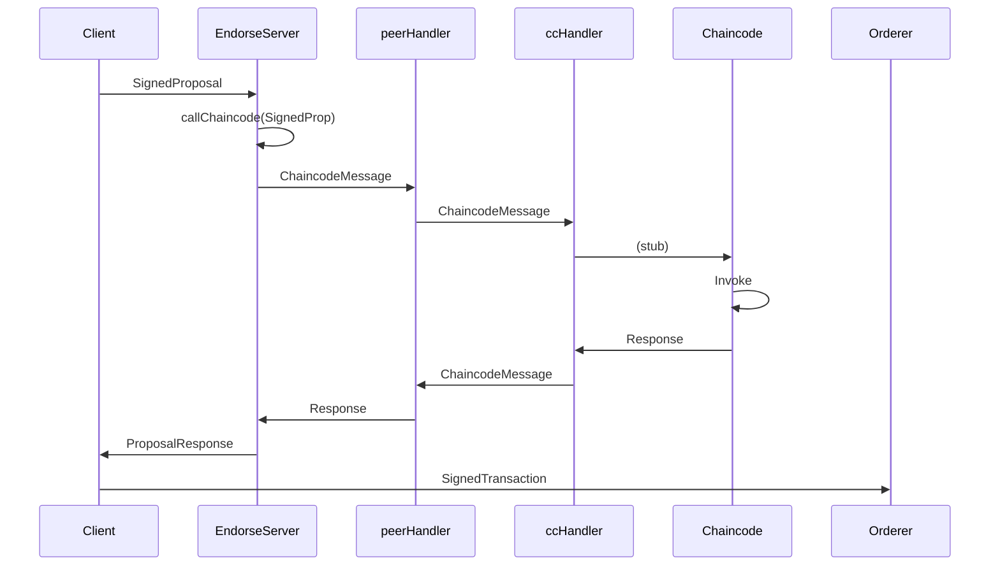

注：

- EndorseServer在Peer节点中
- Peer和Chaincode分别有所属的Handler，负责双方ChaincodeMessage{}结构体的消息交互
- Peer发送给Chaincode的ChaincodeMessage{Type: messageType, Payload: byteOfInput,Txid:txid, ChannelId: cid,}
- Chaincode返回给Peer的ChaincodeMessage{Response: response,}
  **上述流程仍需优化和**

#### 3.2.3 <span id="3.2.3">EndoserServer</span>

文件core/endorser/endorser.go中结构体`Endorser`实现protos/peer/peer.pb.go中定义的`EndorserServer`接口`ProcessProposal`方法。其调用的流程如下：

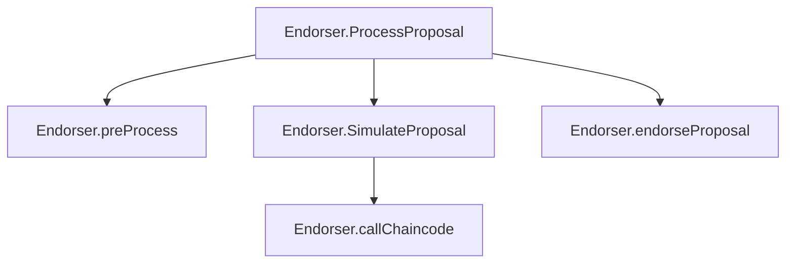

上图中Endorser结构体定义如下：

```go
// Endorser provides the Endorser service ProcessProposal
type Endorser struct {
    distributePrivateData privateDataDistributor
    s                     Support
    PlatformRegistry      *platforms.Registry
    PvtRWSetAssembler
    Metrics *EndorserMetrics
}
```

Endorser.ProcessProposal方法的源码如下：

```go
// ProcessProposal process the Proposal
func (e *Endorser) ProcessProposal(ctx context.Context, signedProp *pb.SignedProposal) (*pb.ProposalResponse, error) {
    // start time for computing elapsed time metric for successfully endorsed proposals
    startTime := time.Now()
    e.Metrics.ProposalsReceived.Add(1)

    addr := util.ExtractRemoteAddress(ctx)
    endorserLogger.Debug("Entering: request from", addr)

    // variables to capture proposal duration metric
    var chainID string
    var hdrExt *pb.ChaincodeHeaderExtension
    var success bool
    defer func() {
        // capture proposal duration metric. hdrExt == nil indicates early failure
        // where we don't capture latency metric. But the ProposalValidationFailed
        // counter metric should shed light on those failures.
        if hdrExt != nil {
            meterLabels := []string{
                "channel", chainID,
                "chaincode", hdrExt.ChaincodeId.Name + ":" + hdrExt.ChaincodeId.Version,
                "success", strconv.FormatBool(success),
            }
            e.Metrics.ProposalDuration.With(meterLabels...).Observe(time.Since(startTime).Seconds())
        }

        endorserLogger.Debug("Exit: request from", addr)
    }()

    // 0 -- check and validate
    vr, err := e.preProcess(signedProp)
    if err != nil {
        resp := vr.resp
        return resp, err
    }

    prop, hdrExt, chainID, txid := vr.prop, vr.hdrExt, vr.chainID, vr.txid

    // obtaining once the tx simulator for this proposal. This will be nil
    // for chainless proposals
    // Also obtain a history query executor for history queries, since tx simulator does not cover history
    var txsim ledger.TxSimulator
    var historyQueryExecutor ledger.HistoryQueryExecutor
    if acquireTxSimulator(chainID, vr.hdrExt.ChaincodeId) {
        if txsim, err = e.s.GetTxSimulator(chainID, txid); err != nil {
            return &pb.ProposalResponse{Response: &pb.Response{Status: 500, Message: err.Error()}}, nil
        }

        // txsim acquires a shared lock on the stateDB. As this would impact the block commits (i.e., commit
        // of valid write-sets to the stateDB), we must release the lock as early as possible.
        // Hence, this txsim object is closed in simulateProposal() as soon as the tx is simulated and
        // rwset is collected before 
         dissemination if required for privateData. For safety, we
        // add the following defer statement and is useful when an error occur. Note that calling
        // txsim.Done() more than once does not cause any issue. If the txsim is already
        // released, the following txsim.Done() simply returns.
        defer txsim.Done()

        if historyQueryExecutor, err = e.s.GetHistoryQueryExecutor(chainID); err != nil {
            return &pb.ProposalResponse{Response: &pb.Response{Status: 500, Message: err.Error()}}, nil
        }
    }

    txParams := &ccprovider.TransactionParams{
        ChannelID:            chainID,
        TxID:                 txid,
        SignedProp:           signedProp,
        Proposal:             prop,
        TXSimulator:          txsim,
        HistoryQueryExecutor: historyQueryExecutor,
    }
    // this could be a request to a chainless SysCC

    // TODO: if the proposal has an extension, it will be of type ChaincodeAction;
    //       if it's present it means that no simulation is to be performed because
    //       we're trying to emulate a submitting peer. On the other hand, we need
    //       to validate the supplied action before endorsing it

    // 1 -- simulate
    cd, res, simulationResult, ccevent, err := e.SimulateProposal(txParams, hdrExt.ChaincodeId)
    if err != nil {
        return &pb.ProposalResponse{Response: &pb.Response{Status: 500, Message: err.Error()}}, nil
    }
    if res != nil {
        if res.Status >= shim.ERROR {
            endorserLogger.Errorf("[%s][%s] simulateProposal() resulted in chaincode %s response status %d for txid: %s", chainID, shorttxid(txid), hdrExt.ChaincodeId, res.Status, txid)
            var cceventBytes []byte
            if ccevent != nil {
                cceventBytes, err = putils.GetBytesChaincodeEvent(ccevent)
                if err != nil {
                    return nil, errors.Wrap(err, "failed to marshal event bytes")
                }
            }
            pResp, err := putils.CreateProposalResponseFailure(prop.Header, prop.Payload, res, simulationResult, cceventBytes, hdrExt.ChaincodeId, hdrExt.PayloadVisibility)
            if err != nil {
                return &pb.ProposalResponse{Response: &pb.Response{Status: 500, Message: err.Error()}}, nil
            }

            return pResp, nil
        }
    }

    // 2 -- endorse and get a marshalled ProposalResponse message
    var pResp *pb.ProposalResponse

    // TODO till we implement global ESCC, CSCC for system chaincodes
    // chainless proposals (such as CSCC) don't have to be endorsed
    if chainID == "" {
        pResp = &pb.ProposalResponse{Response: res}
    } else {
        // Note: To endorseProposal(), we pass the released txsim. Hence, an error would occur if we try to use this txsim
        pResp, err = e.endorseProposal(ctx, chainID, txid, signedProp, prop, res, simulationResult, ccevent, hdrExt.PayloadVisibility, hdrExt.ChaincodeId, txsim, cd)

        // if error, capture endorsement failure metric
        meterLabels := []string{
            "channel", chainID,
            "chaincode", hdrExt.ChaincodeId.Name + ":" + hdrExt.ChaincodeId.Version,
        }

        if err != nil {
            meterLabels = append(meterLabels, "chaincodeerror", strconv.FormatBool(false))
            e.Metrics.EndorsementsFailed.With(meterLabels...).Add(1)
            return &pb.ProposalResponse{Response: &pb.Response{Status: 500, Message: err.Error()}}, nil
        }
        if pResp.Response.Status >= shim.ERRORTHRESHOLD {
            // the default ESCC treats all status codes about threshold as errors and fails endorsement
            // useful to track this as a separate metric
            meterLabels = append(meterLabels, "chaincodeerror", strconv.FormatBool(true))
            e.Metrics.EndorsementsFailed.With(meterLabels...).Add(1)
            endorserLogger.Debugf("[%s][%s] endorseProposal() resulted in chaincode %s error for txid: %s", chainID, shorttxid(txid), hdrExt.ChaincodeId, txid)
            return pResp, nil
        }
    }

    // Set the proposal response payload - it
    // contains the "return value" from the
    // chaincode invocation
    pResp.Response = res

    // total failed proposals = ProposalsReceived-SuccessfulProposals
    e.Metrics.SuccessfulProposals.Add(1)
    success = true

    return pResp, nil
}
```

Endorse.preProcess()的局部代码

```go
    // continue the validation in a way that depends on the type specified in the header
    switch common.HeaderType(chdr.Type) {
    case common.HeaderType_CONFIG:
        //which the types are different the validation is the same
        //viz, validate a proposal to a chaincode. If we need other
        //special validation for configuration, we would have to implement
        //special validation
        fallthrough
    case common.HeaderType_ENDORSER_TRANSACTION:
        // validation of the proposal message knowing it's of type CHAINCODE
        chaincodeHdrExt, err := validateChaincodeProposalMessage(prop, hdr)
        if err != nil {
            return nil, nil, nil, err
        }
```

- 代码`var hdrExt *pb.ChaincodeHeaderExtension`，在[CHAINCODE交易类型数据结构](#3.2.1.2)中定义了ChaincodeHeaderExtension仅CHAINCODE交易类型有效。若ChaincodeHeaderExtension不为空，defer()设置meterLabels，记录执行时间。

- 预处理`func (e *Endorser) preProcess(signedProp *pb.SignedProposal) (*validateResult, error) {}`检查提议消息有效性、唯一性以及ACL
  
  - 方法`preProcess`调用文件core/common/validation/msgvalidation.go中的静态方法`prop, hdr, hdrExt, err := validation.ValidateProposalMessage(signedProp)`，解析并检验提议消息的header字段、验证发起者的签名、验证TxID以及消息类型为`HeaderType_ENDORSER_TRANSACTION`。
  - 上文是`ValidateProposalMessage`方法中处理消息类型片段，当消息类型为`common.HeaderType_CONFIG`，`fallthrough`关键字执行后续`case common.HeaderType_ENDORSER_TRANSACTION`操作。
  - **具体为`common.HeaderType_CONFIG`应用场景，还需后续进一步研究**
  - 代码`e.s.IsSysCCAndNotInvokableExternal(hdrExt.ChaincodeId.Name)`检查`hdrExt.ChaincodeId.Name`是否为系统链码且不提供外部访问，正常情况下该方法返回值为false，进行后续操作，若返回值为true进入错误并退出。
  - 代码`e.s.GetTransactionByID(chainID, txid); err == nil {}`检查txid是否存在，以防止重放攻击
  - 代码`!e.s.IsSysCC(hdrExt.ChaincodeId.Name) e.s.CheckACL(signedProp, chdr, shdr, hdrExt)`检查应用链码的访问控制ACL

- 代码`acquireTxSimulator(chainID, vr.hdrExt.ChaincodeId)`判断是否需要获取`TxSimulator`类型变量，若需要则为`txsim`及`historyQueryExecutor`两个变量赋值。当为系统链码QSCC及CSCC时，不需要进行上述变量赋值

- 代码`cd, res, simulationResult, ccevent, err := e.SimulateProposal(txParams, hdrExt.ChaincodeId)`执行模拟提案。
  
  - 获取链码Chaincode的版本
  - 调用`res, ccevent, err = e.callChaincode(txParams, version, cis.ChaincodeSpec.Input, cid)`，输入参数包括`txParams`、链码名称、版本、链码输入`cis.ChaincodeSpec.Input`等。若Peer节点与链码消息Handler已建立，通过消息通道与链码进行消息发送及响应处理。系统链码部署详细描述了Peer与系统链码消息通道的建立过程，详见[launchInProc方法](#4.3.3)。完成调用后，`simResult, err = txParams.TXSimulator.GetTxSimulationResults()`获取结果。
  - 其中`simResult.PvtSimulationResults`私有数据通过`GossipService.DistributePrivateData(chainID string, txID string, privateData *transientstore.TxPvtReadWriteSetWithConfigInfo, blkHt uint64) error`方法传播到各Peer节点。
  - 其中`simResult.PubSimulationResults`上链数据返回客户端，由客户端打包到Orderer节点进行排序。

- 代码`pResp, err = e.endorseProposal(ctx, chainID, txid, signedProp, prop, res, simulationResult, ccevent, hdrExt.PayloadVisibility, hdrExt.ChaincodeId, txsim, cd)`调用ESCC获取背书。
  
  - 完成core/endorser/plugin_endorser.go文件中Context{}结构体的变量的创建及赋值，调用`return e.s.EndorseWithPlugin(ctx)`
  
  - 在core/endorser/plugin_endorser.go文件中`PluginEndorser{}`结构体实现`EndorseWithPlugin()`方法
  
  - 在`EndorseWithPlugin()`方法中，执行
    
    ```go
    plugin, err := pe.getOrCreatePlugin(PluginName(ctx.PluginName), ctx.Channel)
    endorsement, prpBytes, err := plugin.Endorse(prpBytes, ctx.SignedProposal)
    ```
  
  - 背书PluginEndorser、EndorserServer相关代码详见[Peer节点的启动](#3.1)以及[Peer handlers register](#3.1.1)。

EndorseWithPlugin方法调用的trace如下：

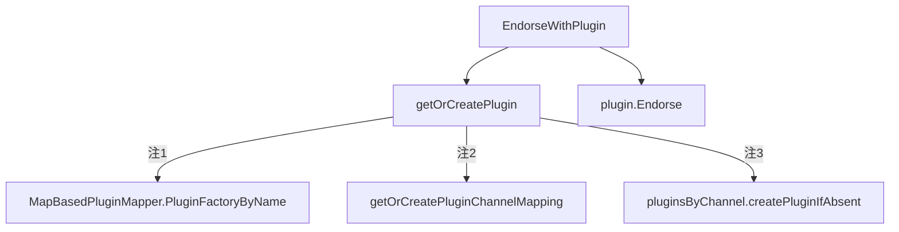

上述调用图中

1. PluginFactoryByName(escc)即返回plugins模式的DefaultEndorsementFactory{}结构体,详见3.1.1节[Peer handlers register](#3.1.1)
2. getOrCreatePluginChannelMapping输入参数包含DefaultEndorsementFactory{}结构体变量，返回pluginsByChannel{}结构体类型变量
3. pluginsByChannel是Endorse Plugin和通道的关联，每个通道都调用pluginFactory.New(),创建一个新的endorsement.Plugin{}接口实例。

```mermaid
classDiagram
class PluginEndorser {
    sync.Mutex
    PluginMapper
    pluginChannelMapping map[PluginName]*pluginsByChannel
    ChannelStateRetriever
    endorsement3.SigningIdentityFetcher
    TransientStoreRetriever
}
class pluginsByChannel {
    sync.RWMutex
    pluginFactory    endorsement.PluginFactory
    channels2Plugins map[string]endorsement.Plugin
    pe               *PluginEndorser
}
class Plugin{
    Endorse()
    Init()
}
PluginEndorser "1"*--"*" pluginsByChannel:1对多,按照PluginName[默认escc]查找或创建
pluginsByChannel "1"*--"*" Plugin:1对多,按照通道名称查找或创建
```

文件core/handlers/endorsement/builtin/default_endorsement.go中，Endorse()方法代码如下：

```go
// DefaultEndorsement is an endorsement plugin that behaves as the default endorsement system chaincode
type DefaultEndorsement struct {
    SigningIdentityFetcher
}

// Endorse signs the given payload(ProposalResponsePayload bytes), and optionally mutates it.
// Returns:
// The Endorsement: A signature over the payload, and an identity that is used to verify the signature
// The payload that was given as input (could be modified within this function)
// Or error on failure
func (e *DefaultEndorsement) Endorse(prpBytes []byte, sp *peer.SignedProposal) (*peer.Endorsement, []byte, error) {
    signer, err := e.SigningIdentityForRequest(sp)
    if err != nil {
        return nil, nil, errors.Wrap(err, "failed fetching signing identity")
    }
    // serialize the signing identity
    identityBytes, err := signer.Serialize()
    if err != nil {
        return nil, nil, errors.Wrapf(err, "could not serialize the signing identity")
    }

    // sign the concatenation of the proposal response and the serialized endorser identity with this endorser's key
    signature, err := signer.Sign(append(prpBytes, identityBytes...))
    if err != nil {
        return nil, nil, errors.Wrapf(err, "could not sign the proposal response payload")
    }
    endorsement := &peer.Endorsement{Signature: signature, Endorser: identityBytes}
    return endorsement, prpBytes, nil
}

// Init injects dependencies into the instance of the Plugin
func (e *DefaultEndorsement) Init(dependencies ...Dependency) error {
    for _, dep := range dependencies {
        sIDFetcher, isSigningIdentityFetcher := dep.(SigningIdentityFetcher)
        if !isSigningIdentityFetcher {
            continue
        }
        e.SigningIdentityFetcher = sIDFetcher
        return nil
    }
    return errors.New("could not find SigningIdentityFetcher in dependencies")
}
```

上述代码完成提案的背书

- 方法SigningIdentityForRequest定义在DefaultEndorsement{}结构体包含的SigningIdentityFetcher{}接口中，SigningIdentityFetcher{}接口实例在上述的Init()方法中为DefaultEndorsement{}结构体变量进行赋值，在文件core/handlers/endorsement/api/identities/identities.go定义如下：
  
  ```go
  // SigningIdentity signs messages and serializes its public identity to bytes
  type SigningIdentity interface {
      // Serialize returns a byte representation of this identity which is used to verify
      // messages signed by this SigningIdentity
      Serialize() ([]byte, error)
  
      // Sign signs the given payload and returns a signature
      Sign([]byte) ([]byte, error)
   }
   // SigningIdentityFetcher fetches a signing identity based on the proposal
   type SigningIdentityFetcher interface {
       endorsement.Dependency
       // SigningIdentityForRequest returns a signing identity for the given proposal
       SigningIdentityForRequest(*peer.SignedProposal) (SigningIdentity, error)
   }
  ```
  
   SigningIdentityFetcher接口在文件core/endorser/plugin_endorser.go中调用Plugin.Init方法进行赋值
  
  ```go
  func (pbc *pluginsByChannel) initPlugin(plugin endorsement.Plugin, channel string) (endorsement.Plugin, error) {
      var dependencies []endorsement.Dependency
      var err error
      ... ...
      dependencies = append(dependencies, pbc.pe.SigningIdentityFetcher)
      err = plugin.Init(dependencies...)
      return plugin, nil
  }
  ```
  
   其`signer`实例的源头在peer的`serve()`方法中
  
  ```go
  signingIdentity := mgmt.GetLocalSigningIdentityOrPanic()
  ```
  
   GetLocalSigningIdentityOrPanic方法实质上调用 
  
  ```go
  // GetLocalSigningIdentityOrPanic returns the local signing identity or panic in case
  // or error
  func GetLocalSigningIdentityOrPanic() msp.SigningIdentity {
   id, err := GetLocalMSP().GetDefaultSigningIdentity()
   if err != nil {
       mspLogger.Panicf("Failed getting local signing identity [%+v]", err)
   }
   return id
  }
  ```
  
   GetDefaultSigningIdentity方法详见3.1.3.2节[MSP接口使用](#3.1.3.2)

- 返回值`&peer.Endorsement{Signature: signature, Endorser: identityBytes}`中,Signature为SigningIdentity的私钥的签名数据,Endorser为SigningIdentity中公钥证书的二进制数据.

### 3.3 <span id="3.3">DeliverEvents服务</span>

---

DeliverEvents服务的Peer启动中生成并注册,详见[Peer节点的启动](#3.1)。 启动方法中调用的NewDeliverEventsServer方法及server定义在文件core/peer/deliverevents.go中，server实现了proto消息的Deliver及DeliverFiltered方法，接收到消息后，调用流程如下：

```mermaid
graph TD
Deliver-->|common/deliver/deliver.go|Handler.Handle
DeliverFiltered-->Handler.Handle
Handler.Handle-->Handler.deliverBlocks
```

方法中核心的处理调用`Handler.deliverBlocks(ctx, srv, envelope)`方法，获取指定区块。该方法代码详见[Deliver服务](#2.3.2)。


### 3.4 <span id="3.4">Committer记账</span>

---

#### 3.4.1 <span id="3.4.1">Committer</span>

#### 3.4.2 <span id="3.4.2">Validator</span>

文件core/committer/txvalidator/validator.go中定义了Validate

```mermaid
classDiagram
class Validator {
    Validate(block *common.Block) error
}
class vsccValidator {
    VSCCValidateTx(seq, Payload, envBytes, Block) (error, TxValidationCode)
}
class TxValidator {
    ChainID string
    Support Support
    Vscc    vsccValidator
}
class VsccValidatorImpl {
    chainID         string
    support         Support
    sccprovider     sysccprovider.SystemChaincodeProvider
    pluginValidator *PluginValidator
}
class PluginValidator {
    sync.Mutex
    pluginChannelMapping map[PluginName]*pluginsByChannel
    PluginMapper
    QueryExecutorCreator
    msp.IdentityDeserializer
    capabilities Capabilities
}

TxValidator..>vsccValidator:依赖

Validator<|..TxValidator:实现

vsccValidator<|..VsccValidatorImpl:实现

VsccValidatorImpl..>PluginValidator:依赖
```

上述类图中：

- 接口Validator{}定义在文件core/committer/txvalidator/validator.go中
- 接口vsccValidator{}定义在文件core/committer/txvalidator/validator.go中
- 结构体TxValidator{}定义在文件core/committer/txvalidator/validator.go中
- 结构体VsccValidatorImpl{}定义在文件core/committer/txvalidator/vscc_validator.go中
- 结构体PluginValidator{}定义在文件core/committer/txvalidator/plugin_validator.go中

Validator的初始化过程，从文件core/peer/peer.go中createChain方法中`validator := txvalidator.NewTxValidator(cid, vcs, sccp, pm)`开始。createChain方法的代码解析详见5.3.2.2节[peer.CreateChainFromBlock](#5.3.2.2)。调用流程图如下:

```mermaid
graph TB
createChain-->|core/committer/txvalidator/validator.go|NewTxValidator
NewTxValidator-->|core/committer/txvalidator/plugin_validator.go|NewPluginValidator
NewTxValidator-->|core/committer/txvalidator/vscc_validator.go|newVSCCValidator
```

上述调用关系中，NewPluginValidator方法返回的PluginValidator{}结构体变量作为newVSCCValidator的输入参数，赋值到VsccValidatorImpl{}结构体中

Validator执行过程，

```mermaid
graph TB
TxValidator.validateTx-->VsccValidatorImpl.VSCCValidateTx
VsccValidatorImpl.VSCCValidateTx-->VsccValidatorImpl.GetInfoForValidate
VsccValidatorImpl.VSCCValidateTx-->VsccValidatorImpl.VSCCValidateTxForCC
VsccValidatorImpl.VSCCValidateTxForCC-->PluginValidator.ValidateWithPlugin
PluginValidator.ValidateWithPlugin-->PluginValidator.getOrCreatePlugin
PluginValidator.ValidateWithPlugin-->Plugin.Validate
```

Plugin.Validate的类图详见3.1.1.2节[Validation Plugin](#3.1.1.2),其后续的调用流程如下：

```mermaid
graph TB
DefaultValidation.Validate-->Validator_v12.Validate
DefaultValidation.Validate-->Validator_v13.Validate
Validator_v12.Validate-->|core/committer/txvalidator/plugin_validator.go|PolicyEvaluator.Evaluate
Validator_v13.Validate-->PolicyEvaluator.Evaluate
PolicyEvaluator.Evaluate-->|common/cauthdsl/policy.go|NewPolicyProvider
PolicyEvaluator.Evaluate-->provider.NewPolicy
PolicyEvaluator.Evaluate-->policy.Evaluate

```

- Validator_v12是core/handlers/validation/builtin/v12/validator.go中Validator结构体对象
- Validator_v13是core/handlers/validation/builtin/v13/validator.go中Validator结构体对象

文件core/handlers/validation/builtin/default_validation.go中，DefaultValidation.Validate
```go
func (v *DefaultValidation) Validate(block *common.Block, namespace string, txPosition int, actionPosition int, contextData ...validation.ContextDatum) error {
	if len(contextData) == 0 {
		logger.Panicf("Expected to receive policy bytes in context data")
	}

	serializedPolicy, isSerializedPolicy := contextData[0].(SerializedPolicy)
	if !isSerializedPolicy {
		logger.Panicf("Expected to receive a serialized policy in the first context data")
	}
	if block == nil || block.Data == nil {
		return errors.New("empty block")
	}
	if txPosition >= len(block.Data.Data) {
		return errors.Errorf("block has only %d transactions, but requested tx at position %d", len(block.Data.Data), txPosition)
	}
	if block.Header == nil {
		return errors.Errorf("no block header")
	}

	var err error
	switch {
	case v.Capabilities.V1_3Validation():
		err = v.TxValidatorV1_3.Validate(block, namespace, txPosition, actionPosition, serializedPolicy.Bytes())

	case v.Capabilities.V1_2Validation():
		fallthrough

	default:
		err = v.TxValidatorV1_2.Validate(block, namespace, txPosition, actionPosition, serializedPolicy.Bytes())
	}

	logger.Debugf("block %d, namespace: %s, tx %d validation results is: %v", block.Header.Number, namespace, txPosition, err)
	return convertErrorTypeOrPanic(err)
}
```
上述代码分析如下：
- DefaultValidation实现了Plugin{}接口的Validate方法
- Validator_v12及Validator_v13完成验证的核心逻辑
- DefaultValidation的Capabilities变量通过Plugin.Init()方法完成，Capabilities决定了V12或V13版本选择。以下分析调用层次(call hierarchy)
  - DefaultValidation.Init(dependencies ...validation.Dependency)方法中，遍历传入的Dependency，`capabilities, isCapabilities := dep.(Capabilities);`,若为Capabilities{}接口类型，则赋值到DefaultValidation的Capabilities变量中；
  - `pluginsByChannel.initPlugin(plugin validation.Plugin, channel string) (validation.Plugin, error)`方法中执行`plugin.Init(pe, sf, pbc.pv.capabilities)`,输入参数为`pbc.pv.capabilities`；
  - `pbc.pv.capabilities`即为pluginsByChannel.PluginValidator.Capabilities，在文件core/committer/txvalidator/validator.go中`NewTxValidator(chainID string, support Support, sccp sysccprovider.SystemChaincodeProvider, pm PluginMapper) *TxValidator`方法中执行`pluginValidator := NewPluginValidator(pm, support.Ledger(), &dynamicDeserializer{support: support}, &dynamicCapabilities{support: support})`，输入参数为Support{}接口类型变量；
  - 在文件core/peer/peer.go的createChain方法中执行
    ```go
    vcs := struct {
        *chainSupport
        *semaphore.Weighted
    }{cs, validationWorkersSemaphore}
    validator := txvalidator.NewTxValidator(cid, vcs, sccp, pm)
    ```
    chainSupport的实例化过程详见5.3.2.2节[peer.CreateChainFromBlock](#5.3.2.2)中createChain方法
  - capabilities配置参数定义在configtx.yaml文件中
    以first-network为例，在文件scripts/fabric-samples/first-network/configtx.yaml中，
    ```yaml
    ################################################################################
    #
    #   SECTION: Capabilities
    #
    #   - This section defines the capabilities of fabric network. This is a new
    #   concept as of v1.1.0 and should not be utilized in mixed networks with
    #   v1.0.x peers and orderers.  Capabilities define features which must be
    #   present in a fabric binary for that binary to safely participate in the
    #   fabric network.  For instance, if a new MSP type is added, newer binaries
    #   might recognize and validate the signatures from this type, while older
    #   binaries without this support would be unable to validate those
    #   transactions.  This could lead to different versions of the fabric binaries
    #   having different world states.  Instead, defining a capability for a channel
    #   informs those binaries without this capability that they must cease
    #   processing transactions until they have been upgraded.  For v1.0.x if any
    #   capabilities are defined (including a map with all capabilities turned off)
    #   then the v1.0.x peer will deliberately crash.
    #
    ################################################################################
    Capabilities:
       # Channel capabilities apply to both the orderers and the peers and must be
       # supported by both.
       # Set the value of the capability to true to require it.
       Channel: &ChannelCapabilities
          # V1.4.3 for Channel is a catchall flag for behavior which has been
          # determined to be desired for all orderers and peers running at the v1.4.3
          # level, but which would be incompatible with orderers and peers from
          # prior releases.
          # Prior to enabling V1.4.3 channel capabilities, ensure that all
          # orderers and peers on a channel are at v1.4.3 or later.
          V1_4_3: true
          # V1.3 for Channel enables the new non-backwards compatible
          # features and fixes of fabric v1.3
          V1_3: false
          # V1.1 for Channel enables the new non-backwards compatible
          # features and fixes of fabric v1.1
          V1_1: false

       # Orderer capabilities apply only to the orderers, and may be safely
       # used with prior release peers.
       # Set the value of the capability to true to require it.
       Orderer: &OrdererCapabilities
          # V1.4.2 for Orderer is a catchall flag for behavior which has been
          # determined to be desired for all orderers running at the v1.4.2
          # level, but which would be incompatible with orderers from prior releases.
          # Prior to enabling V1.4.2 orderer capabilities, ensure that all
          # orderers on a channel are at v1.4.2 or later.
          V1_4_2: true
          # V1.1 for Orderer enables the new non-backwards compatible
          # features and fixes of fabric v1.1
          V1_1: false

       # Application capabilities apply only to the peer network, and may be safely
       # used with prior release orderers.
       # Set the value of the capability to true to require it.
       Application: &ApplicationCapabilities
          # V1.4.2 for Application enables the new non-backwards compatible
          # features and fixes of fabric v1.4.2.
          V1_4_2: true
          # V1.3 for Application enables the new non-backwards compatible
          # features and fixes of fabric v1.3.
          V1_3: false
          # V1.2 for Application enables the new non-backwards compatible
          # features and fixes of fabric v1.2 (note, this need not be set if
          # later version capabilities are set)
          V1_2: false
          # V1.1 for Application enables the new non-backwards compatible
          # features and fixes of fabric v1.1 (note, this need not be set if
          # later version capabilities are set).
          V1_1: false
    ```
  - 在文件common/capabilities/application.go中，Capabilities{}接口实现结构体的方法实现如下：
    ```go
    // V1_2Validation returns true if this channel is configured to perform stricter validation
    // of transactions (as introduced in v1.2).
    func (ap *ApplicationProvider) V1_2Validation() bool {
	   return ap.v12 || ap.v13 || ap.v142
    }

    // V1_3Validation returns true if this channel is configured to perform stricter validation
    // of transactions (as introduced in v1.3).
    func (ap *ApplicationProvider) V1_3Validation() bool {
	   return ap.v13 || ap.v142
    }
    ```
   - 根据上诉配置和结构体方法，可知first-network项目中V1_3Validation及V1_2Validation方法都返回**true**，但switch语句中首先执行`case v.Capabilities.V1_3Validation()`，因此对于first-network项目，执行v.TxValidatorV1_3.Validate分支。
   

接下来，分析文件core/handlers/validation/builtin/v12/validator.go中Validator.Validate方法代码如下：
```go
// Validate validates the given envelope corresponding to a transaction with an endorsement
// policy as given in its serialized form
func (vscc *Validator) Validate(
	block *common.Block,
	namespace string,
	txPosition int,
	actionPosition int,
	policyBytes []byte,
) commonerrors.TxValidationError {
	// get the envelope...
	env, err := utils.GetEnvelopeFromBlock(block.Data.Data[txPosition])
	if err != nil {
		logger.Errorf("VSCC error: GetEnvelope failed, err %s", err)
		return policyErr(err)
	}

	// ...and the payload...
	payl, err := utils.GetPayload(env)
	if err != nil {
		logger.Errorf("VSCC error: GetPayload failed, err %s", err)
		return policyErr(err)
	}

	chdr, err := utils.UnmarshalChannelHeader(payl.Header.ChannelHeader)
	if err != nil {
		return policyErr(err)
	}

	// validate the payload type
	if common.HeaderType(chdr.Type) != common.HeaderType_ENDORSER_TRANSACTION {
		logger.Errorf("Only Endorser Transactions are supported, provided type %d", chdr.Type)
		return policyErr(fmt.Errorf("Only Endorser Transactions are supported, provided type %d", chdr.Type))
	}

	// ...and the transaction...
	tx, err := utils.GetTransaction(payl.Data)
	if err != nil {
		logger.Errorf("VSCC error: GetTransaction failed, err %s", err)
		return policyErr(err)
	}

	cap, err := utils.GetChaincodeActionPayload(tx.Actions[actionPosition].Payload)
	if err != nil {
		logger.Errorf("VSCC error: GetChaincodeActionPayload failed, err %s", err)
		return policyErr(err)
	}

	signatureSet, err := vscc.deduplicateIdentity(cap)
	if err != nil {
		return policyErr(err)
	}

	// evaluate the signature set against the policy
	err = vscc.policyEvaluator.Evaluate(policyBytes, signatureSet)
	if err != nil {
		logger.Warningf("Endorsement policy failure for transaction txid=%s, err: %s", chdr.GetTxId(), err.Error())
		if len(signatureSet) < len(cap.Action.Endorsements) {
			// Warning: duplicated identities exist, endorsement failure might be cause by this reason
			return policyErr(errors.New(DUPLICATED_IDENTITY_ERROR))
		}
		return policyErr(fmt.Errorf("VSCC error: endorsement policy failure, err: %s", err))
	}

	// do some extra validation that is specific to lscc
	if namespace == "lscc" {
		logger.Debugf("VSCC info: doing special validation for LSCC")
		err := vscc.ValidateLSCCInvocation(chdr.ChannelId, env, cap, payl, vscc.capabilities)
		if err != nil {
			logger.Errorf("VSCC error: ValidateLSCCInvocation failed, err %s", err)
			return err
		}
	}

	return nil
}
```


## 四、<span id="4">系统链码</span>

Fabric1.4.6包含以下系统链码
系统链码 | 源文件 | 状态
---|---|:---:
Configuration System Chaincode (CSCC) | core/scc/cscc/configure.go | 有效
Life Cycle System Chaincode (LSCC) | core/scc/lscc/lscc.go | 有效
Query System Chaincode (QSCC) | core/scc/qscc/query.go | 有效 
Endorser System Chaincode (ESCC) | core/scc/escc/endorser_onevalidsignature.go | 过期
Validator System Chaincode (VSCC) | core/scc/vscc/validator_onevalidsignature.go | 过期

### 4.1 <span id="4.1">链码功能</span>

---

#### 4.1.1 <span id="4.1.1">CSCC</span>

core/scc/cscc/configure.go文件中定义了系统链码CSCC的功能

```go
// Invoke is called for the following:
// # to process joining a chain (called by app as a transaction proposal)
// # to get the current configuration block (called by app)
// # to update the configuration block (called by committer)
// Peer calls this function with 2 arguments:
// # args[0] is the function name, which must be JoinChain, GetConfigBlock or
// UpdateConfigBlock
// # args[1] is a configuration Block if args[0] is JoinChain or
// UpdateConfigBlock; otherwise it is the chain id
// TODO: Improve the scc interface to avoid marshal/unmarshal args
func (e *PeerConfiger) Invoke(stub shim.ChaincodeStubInterface) pb.Response {
    args := stub.GetArgs()
        ... ...
    sp, err := stub.GetSignedProposal()
        ... ...
    return e.InvokeNoShim(args, sp)
}

func (e *PeerConfiger) InvokeNoShim(args [][]byte, sp *pb.SignedProposal) pb.Response {
    var err error
    fname := string(args[0])

    switch fname {
    case JoinChain: 
       ... ...
    case GetConfigBlock: 
       ... ...
    case GetConfigTree:
       ... ...
    case SimulateConfigTreeUpdate:
       ... ...
    case GetChannels: 
        ... ...
    }
    return shim.Error(fmt.Sprintf("Requested function %s not found.", fname))
}
```

从上述代码中可以看到，CSCC系统链码实现五个功能，包括

- JoinChain，实现Peer节点加入通道。`peer channel join -b <channel-block-file>` 指令调用链码
- GetConfigBlock，获取通道最新的配置区块。`peer channel fetch config -o <orderer-host:ip> -c <channel-name>` 或 `peer chaincode query -C <channel-name> -n cscc -c '{"Args":["GetConfigBlock", <channel-name>]}'`指令调用链码
- GetChannels，方法用于获取peer目前所加入的通道。`peer chaincode query -C <channel-name> -n cscc -c '{"Args":["GetChannels"]}'` 或 `peer channel list`
- GetConfigTree 用于获取config结构
- SimulateConfigTreeUpdate，模拟执行config结构更新。如果要从一个通道添加或移除组织，必须获取config tree来进行修改，并在调用SimulateConfigTree方法时，必须获取CSCC的背书

#### 4.1.2 <span id="4.1.2">LSCC</span>

core/scc/lscc/lscc.go文件中定义了系统链码LSCC的功能

```go
// Invoke implements lifecycle functions "deploy", "start", "stop", "upgrade".
// Deploy's arguments -  {[]byte("deploy"), []byte(<chainname>), <unmarshalled pb.ChaincodeDeploymentSpec>}
//
// Invoke also implements some query-like functions
// Get chaincode arguments -  {[]byte("getid"), []byte(<chainname>), []byte(<chaincodename>)}
func (lscc *LifeCycleSysCC) Invoke(stub shim.ChaincodeStubInterface) pb.Response {
    args := stub.GetArgs()
    function := string(args[0])

    // Handle ACL:
    // 1. get the signed proposal
    sp, err := stub.GetSignedProposal()

    switch function {
    case INSTALL:
        ... ...
    case DEPLOY, UPGRADE:
        ... ...
    case CCEXISTS, CHAINCODEEXISTS, GETDEPSPEC, GETDEPLOYMENTSPEC, GETCCDATA, GETCHAINCODEDATA:
        ... ...
    case GETCHAINCODES, GETCHAINCODESALIAS:
        ... ...
    case GETINSTALLEDCHAINCODES, GETINSTALLEDCHAINCODESALIAS:
        ... ...
    case GETCOLLECTIONSCONFIG, GETCOLLECTIONSCONFIGALIAS:
        ... ...

    return shim.Error(InvalidFunctionErr(function).Error())
}
```

从上述代码中，可以了解到LSCC系统链码实现五个功能，包括

- INSTALL，链码安装。`peer chaincode install -n mycc -v 1.0 -p `指令完成链码安装。如果执行`peer chaincode install -n lscc -c <安装参数>`这样的指令，需要手动将链码程序转为换为安装参数。
- DEPLOY, UPGRADE，链码实例化或更新。`peer chaincode instantiate -o orderer0:7050 -C mychannel -n mycc -v 1.0 -c '{"Args":["init","a","100","b","200"]}' -P "OR ('Org1MSP', 'Org2MSP')"` 或 `peer chaincode upgrade -o orderer0:7050 -C mychannel -n mycc -v 1.0 -c '{"Args":["init","a","100","b","200"]}' -P "OR ('Org1MSP', 'Org2MSP')"` 执行链码实例化或更新
- CCEXISTS, CHAINCODEEXISTS, 判断获取合约是否存在。`peer chaincode query -C mychannel -n lscc -c '{"Args":["getid|ChaincodeExists","mychannel","mycc"]}'` 获取链码名称来判断是否存在
- GETDEPSPEC, GETDEPLOYMENTSPEC, 用于获取安装在peer上的合约的chaincode deployment spec。`peer chaincode query -C mychannel -n lscc -c '{"Args":["getdepspec|GetDeploymentSpec","mychannel","mycc"]}'`
- GETCCDATA, GETCHAINCODEDATA，用于获取合约的数据。`peer chaincode query -C mychannel -n lscc -c '{"Args":["getccdata|GetChaincodeData","mychannel","mycc"]}'`
- GETCHAINCODES, GETCHAINCODESALIAS，用于获取在部署在通道上的合约的列表。`peer chaincode list --instantiated -C mychannel` 或 `peer chaincode query -C "mychannel" -n lscc -c '{"Args":["getchaincodes|GetChaincodes"]}'`
- GETINSTALLEDCHAINCODES, GETINSTALLEDCHAINCODESALIAS，用于获取在peer上安装的合约的列表。`peer chaincode list --installed -C mychannel` 或 `peer chaincode query -C "mychannel" -n lscc -c '{"Args":["getinstalledchaincodes|GetInstalledChaincodes"]}'`
- GETCOLLECTIONSCONFIG, GETCOLLECTIONSCONFIGALIAS, `peer chaincode query -C "mychannel" -n lscc -c '{"Args":["getcollectionsconfig|GetCollectionsConfig","mycc"]}'`

#### 4.1.3 <span id="4.1.3">QSCC</span>

core/scc/qscc/query.go文件中定义了系统链码QSCC的功能

```go
// Invoke is called with args[0] contains the query function name, args[1]
// contains the chain ID, which is temporary for now until it is part of stub.
// Each function requires additional parameters as described below:
// # GetChainInfo: Return a BlockchainInfo object marshalled in bytes
// # GetBlockByNumber: Return the block specified by block number in args[2]
// # GetBlockByHash: Return the block specified by block hash in args[2]
// # GetTransactionByID: Return the transaction specified by ID in args[2]
func (e *LedgerQuerier) Invoke(stub shim.ChaincodeStubInterface) pb.Response {
    args := stub.GetArgs()
    fname := string(args[0])
    cid := string(args[1])
        ... ...
    switch fname {
    case GetTransactionByID:
        return getTransactionByID(targetLedger, args[2])
    case GetBlockByNumber:
        return getBlockByNumber(targetLedger, args[2])
    case GetBlockByHash:
        return getBlockByHash(targetLedger, args[2])
    case GetChainInfo:
        return getChainInfo(targetLedger)
    case GetBlockByTxID:
        return getBlockByTxID(targetLedger, args[2])
    }

    return shim.Error(fmt.Sprintf("Requested function %s not found.", fname))
}
```

从上述代码可以看出，QSCC 将特定的方法暴露给用户，使得用户可以查询在block storage中存储的区块和交易。它提供五个方法

- GetTransactionByID
- GetBlockByNumber，用于按照序号获取区块。`peer chaincode query -C mychannel -n qscc -c '{"Args":["GetBlockByNumber", "mychannel", "3"]}'`
- GetBlockByHash，用于按照Hash获取区块。`peer chaincode query -C mychannel -n qscc -c '{"Args":["GetBlockByNumber", "mychannel", "QBRELzUu6e/9PPllTfjxkxj4XgzYLC6eceBjBFrNp9k="]}'`
- GetChainInfo
- GetBlockByTxID

### 4.2 <span id="4.2">链码注册</span>

---

Peer节点启动的过程中，会注册系统链码。peer/node/start.go文件中包含链码注册及链码配置流程

```mermaid
graph LR
serve-->|register|startChaincodeServer;
serve-->|deploy|sccp.DeploySysCCs;
startChaincodeServer-->registerChaincodeSupport;
registerChaincodeSupport-->sccp.RegisterSysCC;
```

文件中core/scc/sccproviderimpl.go、core/scc/sysccapi.go及core/container/inproccontroller/inproccontroller.go中后续的注册流程

```mermaid
graph LR
subgraph register
Provider.RegisterSysCC-->Provider.registerSysCC
Provider.registerSysCC-->Registry.Register
end
```

*Provider.RegisterSysCC即sccp.RegisterSysCC*

#### 4.2.1 <span id="4.2.1">registerChaincodeSupport方法</span>

其中registerChaincodeSupport()方法的主要代码为：

```go
//NOTE - when we implement JOIN we will no longer pass the chainID as param
//The chaincode support will come up without registering system chaincodes
//which will be registered only during join phase.
func registerChaincodeSupport(
    grpcServer *comm.GRPCServer,
    ccEndpoint string,
    ca tlsgen.CA,
    packageProvider *persistence.PackageProvider,
    aclProvider aclmgmt.ACLProvider,
    pr *platforms.Registry,
    lifecycleSCC *lifecycle.SCC,
    ops *operations.System,
) (*chaincode.ChaincodeSupport, ccprovider.ChaincodeProvider, *scc.Provider) {
    //get user mode
    userRunsCC := chaincode.IsDevMode()

    authenticator := accesscontrol.NewAuthenticator(ca)
    ipRegistry := inproccontroller.NewRegistry()

    sccp := scc.NewProvider(peer.Default, peer.DefaultSupport, ipRegistry)
    lsccInst := lscc.New(sccp, aclProvider, pr)

    dockerProvider := dockercontroller.NewProvider(
        viper.GetString("peer.id"),
        viper.GetString("peer.networkId"),
        ops.Provider,
    )
    dockerVM := dockercontroller.NewDockerVM(
        dockerProvider.PeerID,
        dockerProvider.NetworkID,
        dockerProvider.BuildMetrics,
    )

    err := ops.RegisterChecker("docker", dockerVM)

    chaincodeSupport := chaincode.NewChaincodeSupport(
        chaincode.GlobalConfig(),
        ccEndpoint,
        userRunsCC,
        ca.CertBytes(),
        authenticator,
        packageProvider,
        lsccInst,
        aclProvider,
        container.NewVMController(
            map[string]container.VMProvider{
                dockercontroller.ContainerType: dockerProvider,
                inproccontroller.ContainerType: ipRegistry,
            },
        ),
        sccp,
        pr,
        peer.DefaultSupport,
        ops.Provider,
    )
    ipRegistry.ChaincodeSupport = chaincodeSupport
    ccp := chaincode.NewProvider(chaincodeSupport)

    ccSrv := pb.ChaincodeSupportServer(chaincodeSupport)

    csccInst := cscc.New(ccp, sccp, aclProvider)
    qsccInst := qscc.New(aclProvider)

    //Now that chaincode is initialized, register all system chaincodes.
    sccs := scc.CreatePluginSysCCs(sccp)
    for _, cc := range append([]scc.SelfDescribingSysCC{lsccInst, csccInst, qsccInst, lifecycleSCC}, sccs...) {
        sccp.RegisterSysCC(cc)
    }
    pb.RegisterChaincodeSupportServer(grpcServer.Server(), ccSrv)

    return chaincodeSupport, ccp, sccp
}
```

- 上述代码中`ccSrv := pb.ChaincodeSupportServer(chaincodeSupport)`进行类型转换，ChaincodeSupportServer接口包含Register()方法。

- 代码`sccp := scc.NewProvider(peer.Default, peer.DefaultSupport, ipRegistry)`生成如下Provider结构体的实例
  
  ```go
  // Provider implements sysccprovider.SystemChaincodeProvider
  type Provider struct {
    Peer        peer.Operations
    PeerSupport peer.Support
    Registrar   Registrar
    SysCCs      []SelfDescribingSysCC
  }
  ```

从上述代码可以看出，peeer启动过程中，需要注册lsccInst, csccInst, qsccInst, lifecycleSCC四个系统链码的实例；其中前三个为上节所述的系统链码的实例，lifecycleSCC为在core/chaincode/lifecycle/scc.go文件中的定义的SCC链码的实例。链码是一个结构体，实现了core/chaincode/shim/interfaces.go文件中链码接口的方法，Chaincode代码详见：

```go
// Chaincode interface must be implemented by all chaincodes. The fabric runs
// the transactions by calling these functions as specified.
type Chaincode interface {
    // Init is called during Instantiate transaction after the chaincode container
    // has been established for the first time, allowing the chaincode to
    // initialize its internal data
    Init(stub ChaincodeStubInterface) pb.Response

    // Invoke is called to update or query the ledger in a proposal transaction.
    // Updated state variables are not committed to the ledger until the
    // transaction is committed.
    Invoke(stub ChaincodeStubInterface) pb.Response
}
```

#### 4.2.2 <span id="4.2.2">Provider.registerSysCC方法</span>

方法调用图中core/scc/sysccapi.go的Provider.registerSysCC方法代码如下：

```go
// registerSysCC registers the given system chaincode with the peer
func (p *Provider) registerSysCC(syscc SelfDescribingSysCC) (bool, error) {
    if !syscc.Enabled() || !isWhitelisted(syscc) {
        sysccLogger.Info(fmt.Sprintf("system chaincode (%s,%s,%t) disabled", syscc.Name(), syscc.Path(), syscc.Enabled()))
        return false, nil
    }

    // XXX This is an ugly hack, version should be tied to the chaincode instance, not he peer binary
    version := util.GetSysCCVersion()

    ccid := &ccintf.CCID{
        Name:    syscc.Name(),
        Version: version,
    }
    err := p.Registrar.Register(ccid, syscc.Chaincode())
    if err != nil {
        //if the type is registered, the instance may not be... keep going
        if _, ok := err.(inproccontroller.SysCCRegisteredErr); !ok {
            errStr := fmt.Sprintf("could not register (%s,%v): %s", syscc.Path(), syscc, err)
            sysccLogger.Error(errStr)
            return false, fmt.Errorf(errStr)
        }
    }

    sysccLogger.Infof("system chaincode %s(%s) registered", syscc.Name(), syscc.Path())
    return true, err
}
```

在上述代码进行系统链码的状态判断，并输出状态的日志，方法`registerChaincodeSupport`中生成了四个系统链码的实例，并循环进行注册，上述系统在first-network项目中执行的日志如下：

```
INFO 00d system chaincode lscc(github.com/hyperledger/fabric/core/scc/lscc) registered
INFO 00e system chaincode cscc(github.com/hyperledger/fabric/core/scc/cscc) registered
INFO 00f system chaincode qscc(github.com/hyperledger/fabric/core/scc/qscc) registered
INFO 010 system chaincode (+lifecycle,github.com/hyperledger/fabric/core/chaincode/lifecycle,true) disabled
```

可以看到lifecycle并未执行注册。是由于在条件判断中`!syscc.Enabled() || !isWhitelisted(syscc)`， lifecycle 系统链码不在白名单中，白名单方法是匹配sampleconfig/core.yaml文件中`chaincode.system`的配置系统链码列表，其配置脚本如下：

```yaml
chaincode:
    # system chaincodes whitelist. To add system chaincode "myscc" to the
    # whitelist, add "myscc: enable" to the list below, and register in
    # chaincode/importsysccs.go
    system:
        cscc: enable
        lscc: enable
        escc: enable
        vscc: enable
        qscc: enable
```

从上述配置可以看到，lifecycle系统链码不在系统链码的白名单中。
代码`syscc.Enabled()`的Enabled方法定义在文件core/scc/sysccapi.go的SelfDescribingSysCC接口中，系统链码除了实现Chaincode接口的方法，同时也实现SelfDescribingSysCC接口，包括Name()、Path()、InitArgs()、Chaincode()、Enabled()等方法。

#### 4.2.3  <span id="4.2.3">Registry.Register方法</span>

方法调用图中core/container/inproccontroller/inproccontroller.go文件中Registry.Register方法的代码如下：

```go
// Registry stores registered system chaincodes.
// It implements container.VMProvider and scc.Registrar
type Registry struct {
    mutex        sync.Mutex
    typeRegistry map[string]*inprocContainer
    instRegistry map[string]*inprocContainer

    ChaincodeSupport ccintf.CCSupport
}

//Register registers system chaincode with given path. The deploy should be called to initialize
func (r *Registry) Register(ccid *ccintf.CCID, cc shim.Chaincode) error {
    r.mutex.Lock()
    defer r.mutex.Unlock()

    name := ccid.GetName()
    inprocLogger.Debugf("Registering chaincode instance: %s", name)
    tmp := r.typeRegistry[name]
    if tmp != nil {
        return SysCCRegisteredErr(name)
    }

    r.typeRegistry[name] = &inprocContainer{chaincode: cc}
    return nil
}
```

最终在Provider结构体类型的sccp变量中注册了新的系统链码，即`sccp.Registrar.typeRegistry[name]=&inprocContainer{chaincode: cc}`，其中name为系统链码的名称，inprocContainer结构体运行go例程以执行系统链码的实现的功能

### 4.3 <span id="4.3">链码部署</span>

---

在4.2节中描述了链码在peer节点中注册和部署的入口，本节详细介绍链码部署的内部逻辑过程。文件core/scc/importsysccs.go中的DeploySysCCs开始部署系统链码：

```mermaid
graph TB;
Prvoider.DeploySysCCs--core/scc/sysccapi.go-->deploySysCC
deploySysCC--core/chaincode/ccproviderimpl.go-->CCProviderImpl.ExecuteLegacyInit
CCProviderImpl.ExecuteLegacyInit--core/chaincode/chaincode_support.go-->ChaincodeSupport.ExecuteLegacyInit
ChaincodeSupport.ExecuteLegacyInit-->ChaincodeSupport.LaunchInit
ChaincodeSupport.LaunchInit-->|core/chaincode/runtime_launcher.go|ChaincodeSupport.Launch
ChaincodeSupport.Launch-->|core/chaincode/container_runtime.go|ContainerRuntime.Start
ContainerRuntime.Start-->|core/container/controller.go|VMController.Process
VMController.Process-->StartContainerReq.Do
StartContainerReq.Do-->|core/container/inproccontroller/inproccontroller.go|InprocVM.Start
InprocVM.Start-->inprocContainer.launchInProc
inprocContainer.launchInProc-->|core/chaincode/shim/chaincode.go|StartInProc
inprocContainer.launchInProc-->|core/chaincode/chaincode_support.go|ChaincodeSupport.HandleChaincodeStream
ChaincodeSupport.ExecuteLegacyInit-->ChaincodeSupport.execute
ChaincodeSupport.execute--core/chaincode/handler.go-->Handler.Execute
```

上述方法调用流程关键步骤分节说明如下：

#### 4.3.1 <span id="4.3.1">deploySysCC方法</span>

文件core/scc/sysccapi.go中deploySysCC代码详情如下：

```go
// deploySysCC deploys the given system chaincode on a chain
func deploySysCC(chainID string, ccprov ccprovider.ChaincodeProvider, syscc SelfDescribingSysCC) error {
    if !syscc.Enabled() || !isWhitelisted(syscc) {
        sysccLogger.Info(fmt.Sprintf("system chaincode (%s,%s) disabled", syscc.Name(), syscc.Path()))
        return nil
    }

    txid := util.GenerateUUID()

    // Note, this structure is barely initialized,
    // we omit the history query executor, the proposal
    // and the signed proposal
    txParams := &ccprovider.TransactionParams{
        TxID:      txid,
        ChannelID: chainID,
    }

    if chainID != "" {
        lgr := peer.GetLedger(chainID)
        if lgr == nil {
            panic(fmt.Sprintf("syschain %s start up failure - unexpected nil ledger for channel %s", syscc.Name(), chainID))
        }

        txsim, err := lgr.NewTxSimulator(txid)
        if err != nil {
            return err
        }

        txParams.TXSimulator = txsim
        defer txsim.Done()
    }

    chaincodeID := &pb.ChaincodeID{Path: syscc.Path(), Name: syscc.Name()}
    spec := &pb.ChaincodeSpec{Type: pb.ChaincodeSpec_Type(pb.ChaincodeSpec_Type_value["GOLANG"]), ChaincodeId: chaincodeID, Input: &pb.ChaincodeInput{Args: syscc.InitArgs()}}

    chaincodeDeploymentSpec := &pb.ChaincodeDeploymentSpec{ExecEnv: pb.ChaincodeDeploymentSpec_SYSTEM, ChaincodeSpec: spec}

    // XXX This is an ugly hack, version should be tied to the chaincode instance, not he peer binary
    version := util.GetSysCCVersion()

    cccid := &ccprovider.CCContext{
        Name:    chaincodeDeploymentSpec.ChaincodeSpec.ChaincodeId.Name,
        Version: version,
    }

    resp, _, err := ccprov.ExecuteLegacyInit(txParams, cccid, chaincodeDeploymentSpec)
    if err == nil && resp.Status != shim.OK {
        err = errors.New(resp.Message)
    }

    sysccLogger.Infof("system chaincode %s/%s(%s) deployed", syscc.Name(), chainID, syscc.Path())

    return err
}
```

方法deploySysCC的在调用ExecuteLegacyInit方法前，进行配置参数设置，其执行过程解析如下：

- 在Peer初始启动时，方法的输入参数chainID为空。当创建通道时，deploySysCC关联到待创建的通道再次执行；
- 同系统链码注册一样，首先进行系统链码的使能状态以及白名单列表检查；
- 系统链码的类型使用GOLANG，在文件中protos/peer/chaincode.proto，定义了四种类型:
  - UNDEFINED = 0;
  - GOLANG = 1;
  - NODE = 2;
  - CAR = 3;
  - JAVA = 4;
- 系统链码的执行环境ExecEnv设置为SYSTEM。Fabric定义了两类执行环境，分别为SYSTEM和DOCKER，其中系统链码使用SYSTEM，而应用链码使用DOCKER。因此系统链码运行为golang的例程，使用golang chan与Peer节点进行交互，应用链码运行于DOCKER容器中，使用grpc与Peer节点进行交互。

#### 4.3.2 <span id="4.3.2">ExecuteLegacyInit方法</span>

```go
// ExecuteLegacyInit is a temporary method which should be removed once the old style lifecycle
// is entirely deprecated.  Ideally one release after the introduction of the new lifecycle.
// It does not attempt to start the chaincode based on the information from lifecycle, but instead
// accepts the container information directly in the form of a ChaincodeDeploymentSpec.
func (cs *ChaincodeSupport) ExecuteLegacyInit(txParams *ccprovider.TransactionParams, cccid *ccprovider.CCContext, spec *pb.ChaincodeDeploymentSpec) (*pb.Response, *pb.ChaincodeEvent, error) {
    ccci := ccprovider.DeploymentSpecToChaincodeContainerInfo(spec)
    ccci.Version = cccid.Version

    err := cs.LaunchInit(ccci)
    if err != nil {
        return nil, nil, err
    }

    cname := ccci.Name + ":" + ccci.Version
    h := cs.HandlerRegistry.Handler(cname)
    if h == nil {
        return nil, nil, errors.Wrapf(err, "[channel %s] claimed to start chaincode container for %s but could not find handler", txParams.ChannelID, cname)
    }

    resp, err := cs.execute(pb.ChaincodeMessage_INIT, txParams, cccid, spec.GetChaincodeSpec().Input, h)
    return processChaincodeExecutionResult(txParams.TxID, cccid.Name, resp, err)
}
```

上述代码分为两部分

- 第一，启动系统链码容器并在Peer节点和系统链码容器中创建对应于系统链码的Handler。进入方法`LaunchInit`中后，首先判断`cs.HandlerRegistry.Handler(cname)`返回值非nil，则退出，若为空进行后续启动流程，详情参见方法调用流程以及4.3.3节内容。
- 第二，获取Peer侧的Handler，生成ChaincodeMessage_INIT类型消息，发送给系统容器侧Handler进行链码初始化。Handler详见4.3.3节，链码初始化详见4.3.4节。

#### 4.3.3 <span id="4.3.3">launchInProc方法</span>

文件中core/container/inproccontroller/inproccontroller.go的launchInProc的方法的代码详情如下：

```go
func (ipc *inprocContainer) launchInProc(id string, args []string, env []string) error {
    if ipc.ChaincodeSupport == nil {
        inprocLogger.Panicf("Chaincode support is nil, most likely you forgot to set it immediately after calling inproccontroller.NewRegsitry()")
    }

    peerRcvCCSend := make(chan *pb.ChaincodeMessage)
    ccRcvPeerSend := make(chan *pb.ChaincodeMessage)
    var err error
    ccchan := make(chan struct{}, 1)
    ccsupportchan := make(chan struct{}, 1)
    shimStartInProc := _shimStartInProc // shadow to avoid race in test
    go func() {
        defer close(ccchan)
        inprocLogger.Debugf("chaincode started for %s", id)
        if args == nil {
            args = ipc.args
        }
        if env == nil {
            env = ipc.env
        }
        err := shimStartInProc(env, args, ipc.chaincode, ccRcvPeerSend, peerRcvCCSend)
        if err != nil {
            err = fmt.Errorf("chaincode-support ended with err: %s", err)
            _inprocLoggerErrorf("%s", err)
        }
        inprocLogger.Debugf("chaincode ended for %s with err: %s", id, err)
    }()

    // shadow function to avoid data race
    inprocLoggerErrorf := _inprocLoggerErrorf
    go func() {
        defer close(ccsupportchan)
        inprocStream := newInProcStream(peerRcvCCSend, ccRcvPeerSend)
        inprocLogger.Debugf("chaincode-support started for  %s", id)
        err := ipc.ChaincodeSupport.HandleChaincodeStream(inprocStream)
        if err != nil {
            err = fmt.Errorf("chaincode ended with err: %s", err)
            inprocLoggerErrorf("%s", err)
        }
        inprocLogger.Debugf("chaincode-support ended for %s with err: %s", id, err)
    }()

    select {
    case <-ccchan:
        close(peerRcvCCSend)
        inprocLogger.Debugf("chaincode %s quit", id)
    case <-ccsupportchan:
        close(ccRcvPeerSend)
        inprocLogger.Debugf("chaincode support %s quit", id)
    case <-ipc.stopChan:
        close(ccRcvPeerSend)
        close(peerRcvCCSend)
        inprocLogger.Debugf("chaincode %s stopped", id)
    }
    return err
}
```

在上述代码中有两个go例程，建立系统链码容器和Peer节点的消息交互的通道。其实现通信为golang `chan`。

- 第一个例程调用方法shimStartInProc，启动系统链码容器，接收peer发送的消息，处理后将响应结果发给Peer节点，启动后生成Handler结构体接受和发送消息。
  - 调用文件core/chaincode/shim/chaincode.go中`StartInProc`方法中newInProcStream结构体定义`ccRcvPeerSend, peerRcvCCSend` 两个变量，实现了文件core/chaincode/shim/handler.go中的`PeerChaincodeStream`接口方法。`PeerChaincodeStream`接口比Peer节点的Handler的`ChaincodeStream`接口多实现`CloseSend()`方法，应由系统链码容器发起关闭双方的消息通道。
  - Handler结构体定义位于文件在目录/core/chaincode/shim/handler.go文件中。
- 第二个例程调用方法HandleChaincodeStream，在Peer增加成Handler结构体，处理系统链码容器发送的消息请求，完成消息处理后将响应发送给系统链码容器。
  - newInProcStream结构体定义`peerRcvCCSend, ccRcvPeerSend` 两个变量，实现了文件core/container/ccintf/ccintf.go中的`ChaincodeStream`接口方法
  - Handler结构体定义位于文件在目录/core/chaincode/handler.go文件中。
- 比较两个例程的通道参数，shimStartInProc方法通道参数是`ccRcvPeerSend, peerRcvCCSend`， 第二个例程调用方法HandleChaincodeStream的顺序正好相反，`peerRcvCCSend, ccRcvPeerSend`。
  - ccRcvPeerSend参数是指chaincode容器接收Peer发送的消息
  - peerRcvCCSend参数是指Peer接收chaincode容器发送的消息

在方法core/chaincode/shim/chaincode.go中chatWithPeer方法

```go
func chatWithPeer(chaincodename string, stream PeerChaincodeStream, cc Chaincode) error {
    // Create the shim handler responsible for all control logic
    handler := newChaincodeHandler(stream, cc)
    defer stream.CloseSend()

    // Send the ChaincodeID during register.
    chaincodeID := &pb.ChaincodeID{Name: chaincodename}
    payload, err := proto.Marshal(chaincodeID)
    if err != nil {
        return errors.Wrap(err, "error marshalling chaincodeID during chaincode registration")
    }
    // Register on the stream
    chaincodeLogger.Debugf("Registering.. sending %s", pb.ChaincodeMessage_REGISTER)
    if err = handler.serialSend(&pb.ChaincodeMessage{Type: pb.ChaincodeMessage_REGISTER, Payload: payload}); err != nil {
        return errors.WithMessage(err, "error sending chaincode REGISTER")
    }

    // holds return values from gRPC Recv below
    type recvMsg struct {
        msg *pb.ChaincodeMessage
        err error
    }
    msgAvail := make(chan *recvMsg, 1)
    errc := make(chan error)

    receiveMessage := func() {
        in, err := stream.Recv()
        msgAvail <- &recvMsg{in, err}
    }

    go receiveMessage()
    for {
        select {
        case rmsg := <-msgAvail:
            switch {
            case rmsg.err == io.EOF:
            case rmsg.err != nil:
            case rmsg.msg == nil:
            default:
                chaincodeLogger.Debugf("[%s]Received message %s from peer", shorttxid(rmsg.msg.Txid), rmsg.msg.Type)
                err := handler.handleMessage(rmsg.msg, errc)
                go receiveMessage()
            }
    }
}
```

上述代码分析如下：

- 代码`defer stream.CloseSend()`表明由系统链码发送通道关闭请求
- 代码 `handler.serialSend(&pb.ChaincodeMessage{Type: pb.ChaincodeMessage_REGISTER, Payload: payload})` 向Peer发送ChaincodeMessage_REGISTER类型消息。
  - Peer及系统链码的Handler结构体变量生成后其状态都为Created。状态取值包括Created、Established、Ready
  - Peer调用`HandlerRegistry.Register(h *Handler)`，将当前Handler注册到Register的hanlers数组中，供Peer节点后续使用。
  - Peer节点的Handler获取ChaincodeMessage_REGISTER消息后，执行`Handler.HandleRegister()`,首先将自身状态更新为Established，并向系统链码容器发送ChaincodeMessage_REGISTER消息
  - 系统链码容器的Handler接受到ChaincodeMessage_REGISTER消息后， 将Handler的状态置为Established
  - 
  - Peer节点在`Handler.HandleRegister()`方法中调用`Handler.notifyRegistry(nil)`方法，在`Handler.notifyAll(nil)`方法中，将Peer节点中的Handler的状态更为Ready；并向并向系统链码容器发送ChaincodeMessage_READY消息
  - 系统链码容器的Handler接受到ChaincodeMessage_READY消息后， 将Handler的状态置为Ready
  - 最终Peer及系统链码的Handler的状态都为Ready。
- `go receiveMessage() for {...}`进入go例程，等待Peer发送的消息并进行处理

综上所述，完成launchInProc方法执行，建立系统链码容器和Peer的消息通道以及状态变更，其消息处理流程如下:

```mermaid
sequenceDiagram
launchInProc->>peerHandler:HandleChaincodeStream
launchInProc->>ccHandler:shimStartInProc
note over peerHandler:Start Handler.ProcessStream(ChaincodeStream)
note over ccHandler:Start shim.chatWithPeer()
ccHandler->>ccHandler:charWithPeer
ccHandler->>peerHandler:ChaincodeMessage_REGISTER
note over peerHandler:HandleRegister
peerHandler->>peerHandler:peer.h.state=Established
peerHandler->>ccHandler:ChaincodeMessage_REGISTER
note over ccHandler:handleCreated
ccHandler->>ccHandler:cc.h.state=Established
peerHandler->>peerHandler:peer.h.state=Ready
peerHandler->>ccHandler:ChaincodeMessage_READY
note over ccHandler:handleEstablished
ccHandler->>ccHandler:cc.h.state=Ready

note over ccHandler,peerHandler: 消息通道创建，后续进行交易交互
```

上图中，ccHandler及peerHandler为golang例程，其中ccHandler运作于系统链码的系统容器中，peerHandler运行于Peer节点上。

#### 4.3.4 <span id="4.3.4">Execute方法</span>

接下来，文件core/chaincode/handler.go中的Execute方法代码详情如下：

```go
func (h *Handler) Execute(txParams *ccprovider.TransactionParams, cccid *ccprovider.CCContext, msg *pb.ChaincodeMessage, timeout time.Duration) (*pb.ChaincodeMessage, error) {
    chaincodeLogger.Debugf("Entry")
    defer chaincodeLogger.Debugf("Exit")

    txParams.CollectionStore = h.getCollectionStore(msg.ChannelId)
    txParams.IsInitTransaction = (msg.Type == pb.ChaincodeMessage_INIT)

    txctx, err := h.TXContexts.Create(txParams)
    if err != nil {
        return nil, err
    }
    defer h.TXContexts.Delete(msg.ChannelId, msg.Txid)

    if err := h.setChaincodeProposal(txParams.SignedProp, txParams.Proposal, msg); err != nil {
        return nil, err
    }

    h.serialSendAsync(msg)

    var ccresp *pb.ChaincodeMessage
    select {
    case ccresp = <-txctx.ResponseNotifier:
        // response is sent to user or calling chaincode. ChaincodeMessage_ERROR
        // are typically treated as error
    case <-time.After(timeout):
        err = errors.New("timeout expired while executing transaction")
        ccName := cccid.Name + ":" + cccid.Version
        h.Metrics.ExecuteTimeouts.With("chaincode", ccName).Add(1)
    case <-h.streamDone():
        err = errors.New("chaincode stream terminated")
    }

    return ccresp, err
}
```

从4.3.2节可知，消息的类型为ChaincodeMessage_INIT执行链码的初始化。`h.serialSendAsync(msg)`将消息发送到系统链码的Handler进行处理。

#### 4.3.5 <span id="4.3.5">链码Handler</span>

在系统链码侧的处理代码，首先core/chaincode/shim/chaincode.go中的chatWithPeer方法等待输入消息，代码详见4.3.3节，当接收到Peer发送的消息后，调用文件core/chaincode/shim/handler.go中handleMessage方法，其代码详情如下：

```go
// handleMessage message handles loop for shim side of chaincode/peer stream.
func (handler *Handler) handleMessage(msg *pb.ChaincodeMessage, errc chan error) error {
    if msg.Type == pb.ChaincodeMessage_KEEPALIVE {
        chaincodeLogger.Debug("Sending KEEPALIVE response")
        handler.serialSendAsync(msg, nil) // ignore errors, maybe next KEEPALIVE will work
        return nil
    }
    chaincodeLogger.Debugf("[%s] Handling ChaincodeMessage of type: %s(state:%s)", shorttxid(msg.Txid), msg.Type, handler.state)

    var err error

    switch handler.state {
    case ready:
        err = handler.handleReady(msg, errc)
    case established:
        err = handler.handleEstablished(msg, errc)
    case created:
        err = handler.handleCreated(msg, errc)
    default:
        err = errors.Errorf("[%s] Chaincode handler cannot handle message (%s) with payload size (%d) while in state: %s", msg.Txid, msg.Type, len(msg.Payload), handler.state)
    }

    if err != nil {
        payload := []byte(err.Error())
        errorMsg := &pb.ChaincodeMessage{Type: pb.ChaincodeMessage_ERROR, Payload: payload, Txid: msg.Txid}
        handler.serialSend(errorMsg)
        return err
    }

    return nil
}

//handle ready state
func (handler *Handler) handleReady(msg *pb.ChaincodeMessage, errc chan error) error {
    switch msg.Type {
    case pb.ChaincodeMessage_RESPONSE:
        if err := handler.sendChannel(msg); err != nil {
            chaincodeLogger.Errorf("[%s] error sending %s (state:%s): %s", shorttxid(msg.Txid), msg.Type, handler.state, err)
            return err
        }
        chaincodeLogger.Debugf("[%s] Received %s, communicated (state:%s)", shorttxid(msg.Txid), msg.Type, handler.state)
        return nil

    case pb.ChaincodeMessage_ERROR:
        if err := handler.sendChannel(msg); err != nil {
            chaincodeLogger.Errorf("[%s] error sending %s (state:%s): %s", shorttxid(msg.Txid), msg.Type, handler.state, err)
        }

        chaincodeLogger.Debugf("[%s] Error Received %s, communicated (state:%s)", shorttxid(msg.Txid), msg.Type, handler.state)

        //we don't return error on ERROR
        return nil

    case pb.ChaincodeMessage_INIT:
        chaincodeLogger.Debugf("[%s] Received %s, initializing chaincode", shorttxid(msg.Txid), msg.Type)
        // Call the chaincode's Run function to initialize
        handler.handleInit(msg, errc)
        return nil

    case pb.ChaincodeMessage_TRANSACTION:
        chaincodeLogger.Debugf("[%s] Received %s, invoking transaction on chaincode(state:%s)", shorttxid(msg.Txid), msg.Type, handler.state)
        // Call the chaincode's Run function to invoke transaction
        handler.handleTransaction(msg, errc)
        return nil
    }

    return errors.Errorf("[%s] Chaincode handler cannot handle message (%s) with payload size (%d) while in state: %s", msg.Txid, msg.Type, len(msg.Payload), handler.state)
}

// handleInit handles request to initialize chaincode.
func (handler *Handler) handleInit(msg *pb.ChaincodeMessage, errc chan error) {
    // The defer followed by triggering a go routine dance is needed to ensure that the previous state transition
    // is completed before the next one is triggered. The previous state transition is deemed complete only when
    // the beforeInit function is exited. Interesting bug fix!!
    go func() {
        var nextStateMsg *pb.ChaincodeMessage

        defer func() {
            handler.triggerNextState(nextStateMsg, errc)
        }()

        errFunc := func(err error, payload []byte, ce *pb.ChaincodeEvent, errFmt string, args ...interface{}) *pb.ChaincodeMessage {
            if err != nil {
                // Send ERROR message to chaincode support and change state
                if payload == nil {
                    payload = []byte(err.Error())
                }
                chaincodeLogger.Errorf(errFmt, args...)
                return &pb.ChaincodeMessage{Type: pb.ChaincodeMessage_ERROR, Payload: payload, Txid: msg.Txid, ChaincodeEvent: ce, ChannelId: msg.ChannelId}
            }
            return nil
        }
        // Get the function and args from Payload
        input := &pb.ChaincodeInput{}
        unmarshalErr := proto.Unmarshal(msg.Payload, input)
        if nextStateMsg = errFunc(unmarshalErr, nil, nil, "[%s] Incorrect payload format. Sending %s", shorttxid(msg.Txid), pb.ChaincodeMessage_ERROR.String()); nextStateMsg != nil {
            return
        }

        // Call chaincode's Run
        // Create the ChaincodeStub which the chaincode can use to callback
        stub := new(ChaincodeStub)
        err := stub.init(handler, msg.ChannelId, msg.Txid, input, msg.Proposal)
        if nextStateMsg = errFunc(err, nil, stub.chaincodeEvent, "[%s] Init get error response. Sending %s", shorttxid(msg.Txid), pb.ChaincodeMessage_ERROR.String()); nextStateMsg != nil {
            return
        }
        res := handler.cc.Init(stub)
        chaincodeLogger.Debugf("[%s] Init get response status: %d", shorttxid(msg.Txid), res.Status)

        if res.Status >= ERROR {
            err = errors.New(res.Message)
            if nextStateMsg = errFunc(err, []byte(res.Message), stub.chaincodeEvent, "[%s] Init get error response. Sending %s", shorttxid(msg.Txid), pb.ChaincodeMessage_ERROR.String()); nextStateMsg != nil {
                return
            }
        }

        resBytes, err := proto.Marshal(&res)
        if err != nil {
            payload := []byte(err.Error())
            chaincodeLogger.Errorf("[%s] Init marshal response error [%s]. Sending %s", shorttxid(msg.Txid), err, pb.ChaincodeMessage_ERROR)
            nextStateMsg = &pb.ChaincodeMessage{Type: pb.ChaincodeMessage_ERROR, Payload: payload, Txid: msg.Txid, ChaincodeEvent: stub.chaincodeEvent}
            return
        }

        // Send COMPLETED message to chaincode support and change state
        nextStateMsg = &pb.ChaincodeMessage{Type: pb.ChaincodeMessage_COMPLETED, Payload: resBytes, Txid: msg.Txid, ChaincodeEvent: stub.chaincodeEvent, ChannelId: stub.ChannelId}
        chaincodeLogger.Debugf("[%s] Init succeeded. Sending %s", shorttxid(msg.Txid), pb.ChaincodeMessage_COMPLETED)
    }()
}
```

上述代码中，从`handleMessage`->`handleReady`->`handleInit`，完成系统链码的初始化。

- 由于Peer中handler发送消息类型为ChaincodeMessage_INIT
- `handleInit`中调用`handler.cc.Init(stub)`,调用各系统链码实现的Init接口方法，完成系统链码的初始化操作

进一步说明，完成链码初始化后，请求系统链码操作的消息类型一般为ChaincodeMessage_TRANSACTION，调用handler.handleTransaction(msg, errc)方法，与handleInit方法类似，在handleTransaction方法中调用`handler.cc.Invoke(stub)`,调用各系统链码实现的Invoke接口方法，完成系统链码的业务操作。

## 五、<span id="5">Peer channel命令详解</span>

### 5.1 <span id="5.1">peer channel命令</span>

peer命令包含以下子命令：

- create       Create a channel
- fetch        Fetch a block
- getinfo      get blockchain information of a specified channel.
- join         Joins the peer to a channel.
- list         List of channels peer has joined.
- signconfigtx Signs a configtx update.
- update       Send a configtx update.

**表 : Peer initCmdFactory**

| 命令           | Endorser | PeerDeliver     | Orderer         |
| ------------ | -------- | --------------- | --------------- |
| create       | Not      | Not             | Required        |
| fetch        | Not      | Required<br>Not | Not<br>Required |
| getinfo      | Required | Not             | Not             |
| join         | Required | Not             | Not             |
| list         | Required | Not             | Not             |
| signconfigtx | Not      | Not             | Not             |
| update       | Not      | Not             | Required        |

- fetch命令支持两种获取途径,PeerDeliver或Orderer

三种方式服务模式区别如下:

```mermaid
graph LR
PeerChannel-->|Endoser|PeerHandler
PeerChannel-->|PeerDeliver|PeerDeliverEvent
PeerChannel-->|Orderer|OrdererAtomicBroadcast

PeerHandler-->ChaincodeHandler
ChaincodeHandler-->SysChaincode
```

### 5.2 <span id="5.2">peer channel create</span>

---

通道创建指令示例

```shell
peer channel create -o orderer.example.com:7050 -c mychannel -f ./channel-artifacts/channel.tx --tls --cafile /opt/gopath/src/github.com/hyperledger/fabric/peer/crypto/ordererOrganizations/example.com/orderers/orderer.example.com/msp/tlscacerts/tlsca.example.com-cert.pem
```

其中-o -c -f选项为必选

其交互流程如下：

```mermaid
sequenceDiagram
Client->>Orderer: sendCreateChainTransaction(Broadcast)
Orderer->>Orderer:Create next config block in system channel
Orderer->>Orderer:Create new chain (application channel) and genesis block
Orderer->>Client: OK/ERROR
Client->>Orderer: getGenesisBlock(Deliver) of new chain
Orderer->>Client: return GenesisBlock
Client->>Client: store GenesisBlock
```

#### 5.2.1 <span id="5.2.1">命令Client端流程解析</span>

peer模块中peer/channel/create.go中的executeCreate方法发起通道创建指令

```go
func executeCreate(cf *ChannelCmdFactory) error {
    err := sendCreateChainTransaction(cf)

    block, err := getGenesisBlock(cf)
    b, err := proto.Marshal(block)
    file := channelID + ".block"
    if outputBlock != common.UndefinedParamValue {
        file = outputBlock
    }
    err = ioutil.WriteFile(file, b, 0644)
    return nil
}
```

上述方法主要是两个步骤：

1. 调用方法sendCreateChainTransaction，向Orderer节点发送Broadcast服务，请求创建通道，Orderer节点接受到请求后，在系统通道上增加config block，增加新通道配置，并在Registrar的chains数组中增加新的ChainSupport结构，以支持新创建的通道，并为新通道生成账本及创建创世区块。

2. 从新通道中获取创世区块并存储，供以后peer节点加入通道使用（peer channel join命令）。获取创世区块peer节点向Orderer节点发送deliver服务，其步骤同peer channel fetch类似。
   其中sendCreateChainTransaction以及sanityCheckAndSignConfigTx方法的具体如下：
   
   ```go
   func sendCreateChainTransaction(cf *ChannelCmdFactory) error {
    var err error
    var chCrtEnv *cb.Envelope
   
    if channelTxFile != "" {
        if chCrtEnv, err = createChannelFromConfigTx(channelTxFile); err != nil {
            return err
        }
    } else {
        if chCrtEnv, err = createChannelFromDefaults(cf); err != nil {
            return err
        }
    }
    if chCrtEnv, err = sanityCheckAndSignConfigTx(chCrtEnv); err != nil {
        return err
    }
    var broadcastClient common.BroadcastClient
    broadcastClient, err = cf.BroadcastFactory()
    if err != nil {
        return errors.WithMessage(err, "error getting broadcast client")
    }
    defer broadcastClient.Close()
    err = broadcastClient.Send(chCrtEnv)
    return err
   }
   func sanityCheckAndSignConfigTx(envConfigUpdate *cb.Envelope) (*cb.Envelope, error) {
        payload, err := utils.ExtractPayload(envConfigUpdate)
        if payload.Header == nil || payload.Header.ChannelHeader == nil {
            return nil, InvalidCreateTx("bad header")
        }
        ch, err := utils.UnmarshalChannelHeader(payload.Header.ChannelHeader)
        if ch.Type != int32(cb.HeaderType_CONFIG_UPDATE) {
            return nil, InvalidCreateTx("bad type")
        }
        if ch.ChannelId == "" {
            return nil, InvalidCreateTx("empty channel id")
        }
        // Specifying the chainID on the CLI is usually redundant, as a hack, set it
        // here if it has not been set explicitly
        if channelID == "" {
            channelID = ch.ChannelId
        }
        if ch.ChannelId != channelID {
            return nil, InvalidCreateTx(fmt.Sprintf("mismatched channel ID %s != %s", ch.ChannelId, channelID))
        }
        configUpdateEnv, err := configtx.UnmarshalConfigUpdateEnvelope(payload.Data)
        if err != nil {
            return nil, InvalidCreateTx("Bad config update env")
        }

        signer := localsigner.NewSigner()
        sigHeader, err := signer.NewSignatureHeader()
        if err != nil {
            return nil, err
        }
        configSig := &cb.ConfigSignature{
            SignatureHeader: utils.MarshalOrPanic(sigHeader),
        }
        configSig.Signature, err = signer.Sign(util.ConcatenateBytes(configSig.SignatureHeader, configUpdateEnv.ConfigUpdate))
        configUpdateEnv.Signatures = append(configUpdateEnv.Signatures, configSig)
        return utils.CreateSignedEnvelope(cb.HeaderType_CONFIG_UPDATE, channelID, signer, configUpdateEnv, 0, 0)
    }
    ```
上述代码`sendCreateChainTransaction`方法中
- `channelTxFile`即是在first-network中由`configtxgen`生成的`channel.tx`配置文件。
- 调用sanityCheckAndSignConfigTx方法验证发送的envlope关键字段信息，并生成签名信息，
   - 验证消息的类型为HeaderType_CONFIG_UPDATE。
   - 执行指令查看channel.tx中的type


`docker exec cli configtxgen -inspectChannelCreateTx channel-artifacts/channel.tx`
输出JSON结构中的header字段信息如下
```json
"config_update": {
            "channel_id": "mychannel",
            "isolated_data": {},
            "read_set": {
                    "groups": {
                            "Application": {
                                    "groups": {
                                            "Org1MSP": {
        ..........

"header": {
    "channel_header": {
        "channel_id": "mychannel",
        "epoch": "0",
        "extension": null,
        "timestamp": "2021-11-07T05:47:37Z",
        "tls_cert_hash": null,
        "tx_id": "",
        "type": 2,
        "version": 0
    },
    "signature_header": null
}
```

type等于2，结合上文中*HeaderType_CONFIG_UPDATE HeaderType = 2*的定义，表明该消息为所需的配置更新类型。

#### 5.2.2 <span id="5.2.2">命令服务端流程解析（Orderer）</span>

Orderer节点处理Broadcast总体流程在2.3.1节[Broadcast服务](#2.3.1)已详细介绍，当前执行到ProcessMessage方法，判断消息类似isConfig进行后续的分支处理。从Peer侧提交请求时，确保消息类型为HeaderType_CONFIG_UPDATE，则isConfig=true。后续的在消息处理方法中的主要处理方法是：

- processor.ProcessConfigUpdateMsg(msg)
- processor.WaitReady()
- processor.Configure(config, configSeq)

在分析processor的ProcessConfigUpdateMsg及Configure方法的内部处理逻辑之前，首先看一下Fabric的process变量的接口类型及结构体定义。分析上文BroadcastChannelSupport方法代码可知，processor变量为接口类型ChannelSupport，包含msgprocessor.Processor和Consenter两个接口，分别实现ProcessConfigUpdateMsg和Configure方法。processor变量结构体为:

```go
type ChainSupport struct {
    *ledgerResources
    msgprocessor.Processor
    *BlockWriter
    consensus.Chain
    cutter blockcutter.Receiver
    crypto.LocalSigner
}
```

实现了ChannelSupport接口，其中msgprocessor.Processor接口有两个实现的结构体，分别为orderer/common/msgprocessor/standardchannel.go文件中的StandardChannel和orderer/common/msgprocessor/systemchannel.go文件中SystemChannel；

- 其中SystemChannel继承StandardChannel结构，并重载了ProcessNormalMsg、ProcessConfigUpdateMsg、ProcessConfigMsg，用于Orderer节点的系统通道上Broadcast消息的处理。SystemChannel结构体包含在Registrar结构中的ChainSuppport类型的systemChannel变量中，在Orderer节点启动过程，Registrar初始化方法中进行构造生成。
- StandardChannel用于Orderer节点的应用通道上的Broadcast消息的处理。在Registrar结构的CreateChain方法中构造生成StandardChannel结构体，增加到map[string] ChainSupport类型的chains变量中。

从上面的分析可以知道，由系统通道负责接受消息创建应用通道（具体代码实现在SupportRegistrar.BroadcastChannelSupport中）,processor是Registrar结构中SystemChannel变量，应该因此进一步分析SystemChannel.ProcessConfigUpdateMsg(msg)方法的具体代码：

```go
// ProcessConfigUpdateMsg handles messages of type CONFIG_UPDATE either for the system channel itself
// or, for channel creation.  In the channel creation case, the CONFIG_UPDATE is wrapped into a resulting
// ORDERER_TRANSACTION, and in the standard CONFIG_UPDATE case, a resulting CONFIG message
func (s *SystemChannel) ProcessConfigUpdateMsg(envConfigUpdate *cb.Envelope) (config *cb.Envelope, configSeq uint64, err error) {
    channelID, err := utils.ChannelID(envConfigUpdate)

    logger.Debugf("Processing config update tx with system channel message processor for channel ID %s", channelID)

    if channelID == s.support.ChainID() {
        return s.StandardChannel.ProcessConfigUpdateMsg(envConfigUpdate)
    }

    // XXX we should check that the signature on the outer envelope is at least valid for some MSP in the system channel

    logger.Debugf("Processing channel create tx for channel %s on system channel %s", channelID, s.support.ChainID())

    // If the channel ID does not match the system channel, then this must be a channel creation transaction

    bundle, err := s.templator.NewChannelConfig(envConfigUpdate)
    if err != nil {
        return nil, 0, err
    }

    newChannelConfigEnv, err := bundle.ConfigtxValidator().ProposeConfigUpdate(envConfigUpdate)
    if err != nil {
        return nil, 0, errors.WithMessage(err, fmt.Sprintf("error validating channel creation transaction for new channel '%s', could not succesfully apply update to template configuration", channelID))
    }

    newChannelEnvConfig, err := utils.CreateSignedEnvelope(cb.HeaderType_CONFIG, channelID, s.support.Signer(), newChannelConfigEnv, msgVersion, epoch)
    if err != nil {
        return nil, 0, err
    }

    wrappedOrdererTransaction, err := utils.CreateSignedEnvelope(cb.HeaderType_ORDERER_TRANSACTION, s.support.ChainID(), s.support.Signer(), newChannelEnvConfig, msgVersion, epoch)
    if err != nil {
        return nil, 0, err
    }

    // We re-apply the filters here, especially for the size filter, to ensure that the transaction we
    // just constructed is not too large for our consenter.  It additionally reapplies the signature
    // check, which although not strictly necessary, is a good sanity check, in case the orderer
    // has not been configured with the right cert material.  The additional overhead of the signature
    // check is negligible, as this is the channel creation path and not the normal path.
    err = s.StandardChannel.filters.Apply(wrappedOrdererTransaction)
    if err != nil {
        return nil, 0, err
    }

    return wrappedOrdererTransaction, s.support.Sequence(), nil
}
```

上述代码中配置`config_update`字段，并生成变量`newChannelEnvConfig`为`HeaderType_CONFIG`类型的`Envlope`消息；同时生成一变量`wrappedOrdererTransaction`为`HeaderType_ORDERER_TRANSACTION`类型消息，嵌入上述的`newChannelEnvConfig`消息，为后续的`Configure`方法准备消息参数。

紧接着执行`Configure`方法（忽略`WaitReady()`方法），输入参数为`ProcessConfigUpdateMsg`方法的输出参数。`Configure`方法是`ChainSupport`中`Consenter`接口中的方法，Fabric1.4.6有三种内置的共识算法实现：solo、kafka、etcdraft。以下是orderer/consensus/solo/consensus.go文件中solo共识算法的Configure代码实现

```go
// Configure accepts configuration update messages for ordering
func (ch *chain) Configure(config *cb.Envelope, configSeq uint64) error {
    select {
    case ch.sendChan <- &message{
        configSeq: configSeq,
        configMsg: config,
    }:
        return nil
    case <-ch.exitChan:
        return fmt.Errorf("Exiting")
    }
}

func (ch *chain) main() {
    var timer <-chan time.Time
    var err error

    for {
        seq := ch.support.Sequence()
        err = nil
        select {
        case msg := <-ch.sendChan:
            if msg.configMsg == nil {
                    ... ...
            } else {
                // ConfigMsg
                if msg.configSeq < seq { //???
                    msg.configMsg, _, err = ch.support.ProcessConfigMsg(msg.configMsg)
                    if err != nil {
                        logger.Warningf("Discarding bad config message: %s", err)
                        continue
                    }
                }
                batch := ch.support.BlockCutter().Cut()
                if batch != nil {
                    block := ch.support.CreateNextBlock(batch)
                    ch.support.WriteBlock(block, nil)
                }

                block := ch.support.CreateNextBlock([]*cb.Envelope{msg.configMsg})
                ch.support.WriteConfigBlock(block, nil)
                timer = nil
            }
        case <-timer:
            ... ...
        case <-ch.exitChan:
            ... ...
        }
    }
}
```

`Configure`方法降chan写入接收到的消息，进入`ConfigMsg`处理逻辑:

- `msg.configSeq` < seq ????进一步研究

- 接收到配置消息后，将通道现在的区块数据进行出块操作

- 生成配置区块，生产区块消息，调用`WriteConfigBlock`
  orderer/common/multichannel/blockwriter.go文件中的`WriteConfigBlock`方法具体如下
  
  ```go
  // WriteConfigBlock should be invoked for blocks which contain a config transaction.
  // This call will block until the new config has taken effect, then will return
  // while the block is written asynchronously to disk.
  func (bw *BlockWriter) WriteConfigBlock(block *cb.Block, encodedMetadataValue []byte) {
    ctx, err := utils.ExtractEnvelope(block, 0)
    payload, err := utils.UnmarshalPayload(ctx.Payload)
    chdr, err := utils.UnmarshalChannelHeader(payload.Header.ChannelHeader)
    switch chdr.Type {
    case int32(cb.HeaderType_ORDERER_TRANSACTION):
        newChannelConfig, err := utils.UnmarshalEnvelope(payload.Data)
        if err != nil {
            logger.Panicf("Told to write a config block with new channel, but did not have config update embedded: %s", err)
        }
        bw.registrar.newChain(newChannelConfig)
    case int32(cb.HeaderType_CONFIG):
            ... ...
    default:
        logger.Panicf("Told to write a config block with unknown header type: %v", chdr.Type)
    }
  
    bw.WriteBlock(block, encodedMetadataValue)
  }
  ```
  
  WriteConfigBlock方法在系统通道上写入创建通道的配置区块，并调用registrar.newChain方法生成新的通道（及账本）。

orderer/common/multichannel/registrar.go文件中newChain方法的代码如下

```go
func (r *Registrar) newChain(configtx *cb.Envelope) {
    r.lock.Lock()
    defer r.lock.Unlock()

    ledgerResources := r.newLedgerResources(configtx)
    // If we have no blocks, we need to create the genesis block ourselves.
    if ledgerResources.Height() == 0 {
        ledgerResources.Append(blockledger.CreateNextBlock(ledgerResources, []*cb.Envelope{configtx}))
    }

    // Copy the map to allow concurrent reads from broadcast/deliver while the new chainSupport is
    newChains := make(map[string]*ChainSupport)
    for key, value := range r.chains {
        newChains[key] = value
    }

    cs := newChainSupport(r, ledgerResources, r.consenters, r.signer, r.blockcutterMetrics)
    chainID := ledgerResources.ConfigtxValidator().ChainID()

    logger.Infof("Created and starting new chain %s", chainID)

    newChains[string(chainID)] = cs
    cs.start()

    r.chains = newChains
}
```

上述newChain方法中

- 为通道生成ledgerResources变量，该结构体包含账本legder的读写接口实现。在后续账本章节详细分析账本结构

- 若该通道的账本高度为0，为账本创建创世区块

- 调用orderer/common/multichannel/chainsupport.go文件中newChainSupport方法，代码如下
  
  ```go
  func newChainSupport(
    registrar *Registrar,
    ledgerResources *ledgerResources,
    consenters map[string]consensus.Consenter,
    signer crypto.LocalSigner,
    blockcutterMetrics *blockcutter.Metrics,
  ) *ChainSupport {
    // Read in the last block and metadata for the channel
    lastBlock := blockledger.GetBlock(ledgerResources, ledgerResources.Height()-1)
    metadata, err := utils.GetMetadataFromBlock(lastBlock, cb.BlockMetadataIndex_ORDERER)
    // Assuming a block created with cb.NewBlock(), this should not
    // error even if the orderer metadata is an empty byte slice
    if err != nil {
        logger.Fatalf("[channel: %s] Error extracting orderer metadata: %s", ledgerResources.ConfigtxValidator().ChainID(), err)
    }
  
    // Construct limited support needed as a parameter for additional support
    cs := &ChainSupport{
        ledgerResources: ledgerResources,
        LocalSigner:     signer,
        cutter: blockcutter.NewReceiverImpl(
            ledgerResources.ConfigtxValidator().ChainID(),
            ledgerResources,
            blockcutterMetrics,
        ),
    }
  
    // Set up the msgprocessor
    cs.Processor = msgprocessor.NewStandardChannel(cs, msgprocessor.CreateStandardChannelFilters(cs, registrar.config))
  
    // Set up the block writer
    cs.BlockWriter = newBlockWriter(lastBlock, registrar, cs)
  
    // Set up the consenter
    consenterType := ledgerResources.SharedConfig().ConsensusType()
    consenter, ok := consenters[consenterType]
    if !ok {
        logger.Panicf("Error retrieving consenter of type: %s", consenterType)
    }
  
    cs.Chain, err = consenter.HandleChain(cs, metadata)
    if err != nil {
        logger.Panicf("[channel: %s] Error creating consenter: %s", cs.ChainID(), err)
    }
  
    logger.Debugf("[channel: %s] Done creating channel support resources", cs.ChainID())
  
    return cs
  }
  ```
  
  上述方法为新通道创建ChainSupport结构体，后续该通道上的消息处理由其负责。ChainSupport结构体关联

- 通道的账本接口实现ledgerResources
- 通道的消息接口实现Processor
- 通道的共识算法接口实现Chain
- 通道的BlockWriter，负责出块操作。上文中系统通道的BlockWriter结构体的WriteConfigBlock负责新通道的创建。

通道创建后续的获取新通道创世区块的流程待后续peer channel fetch命令时说明。

### 5.3 <span id="5.3">peer channel join</span>

---

加入通道指令举例(first-network)

```shell
CORE_PEER_LOCALMSPID="Org1MSP"
CORE_PEER_TLS_ROOTCERT_FILE=/opt/gopath/src/github.com/hyperledger/fabric/peer/crypto/peerOrganizations/org1.example.com/peers/peer0.org1.example.com/tls/ca.crt
CORE_PEER_MSPCONFIGPATH=/opt/gopath/src/github.com/hyperledger/fabric/peer/crypto/peerOrganizations/org1.example.com/users/Admin@org1.example.com/msp
CORE_PEER_ADDRESS=peer0.org1.example.com:7051

peer channel join -b mychannel.block
```

*注：Org1的Peer0节点加入通道的环境变量*

peer channel join的流程总体上遵循Endorse服务PorcessPropose的流程，详见[Proposal提案流程](#3.2.2),其流程如下：

```mermaid
sequenceDiagram
Client->>EndorseServer(Handler):JoinChain(SignedProp)
EndorseServer(Handler)->>Chaincode(Handler):JoinChain(SignedProp)
Chaincode(Handler)->>cscc:Invoke()
Chaincode(Handler)->>EndorseServer(Handler):Resp
EndorseServer(Handler)->>Client:Resp
```

上述流程中Handler之间流程详见[链码部署](#4.3)
同时此Endorse服务调用系统链码cscc，不需要进行背书操作。在`ProcessProposal`方法执行中，语句

```go
// TODO till we implement global ESCC, CSCC for system chaincodes
// chainless proposals (such as CSCC) don't have to be endorsed
    if chainID == "" {
        pResp = &pb.ProposalResponse{Response: res}
```

#### 5.3.1 <span id="5.3.1">命令Client端流程解析</span>

peer/channel/join.go文件中executeJoin方法代码如下：

```go
func getJoinCCSpec() (*pb.ChaincodeSpec, error) {
    if genesisBlockPath == common.UndefinedParamValue {
        return nil, errors.New("Must supply genesis block file")
    }

    gb, err := ioutil.ReadFile(genesisBlockPath)
    if err != nil {
        return nil, GBFileNotFoundErr(err.Error())
    }
    // Build the spec
    input := &pb.ChaincodeInput{Args: [][]byte{[]byte(cscc.JoinChain), gb}}

    spec := &pb.ChaincodeSpec{
        Type:        pb.ChaincodeSpec_Type(pb.ChaincodeSpec_Type_value["GOLANG"]),
        ChaincodeId: &pb.ChaincodeID{Name: "cscc"},
        Input:       input,
    }

    return spec, nil
}

func executeJoin(cf *ChannelCmdFactory) (err error) {
    spec, err := getJoinCCSpec()

    // Build the ChaincodeInvocationSpec message
    invocation := &pb.ChaincodeInvocationSpec{ChaincodeSpec: spec}

    creator, err := cf.Signer.Serialize()
    if err != nil {
        return fmt.Errorf("Error serializing identity for %s: %s", cf.Signer.GetIdentifier(), err)
    }

    var prop *pb.Proposal
    prop, _, err = putils.CreateProposalFromCIS(pcommon.HeaderType_CONFIG, "", invocation, creator)
    if err != nil {
        return fmt.Errorf("Error creating proposal for join %s", err)
    }

    var signedProp *pb.SignedProposal
    signedProp, err = putils.GetSignedProposal(prop, cf.Signer)
    if err != nil {
        return fmt.Errorf("Error creating signed proposal %s", err)
    }

    var proposalResp *pb.ProposalResponse
    proposalResp, err = cf.EndorserClient.ProcessProposal(context.Background(), signedProp)
    if err != nil {
        return ProposalFailedErr(err.Error())
    }

    if proposalResp == nil {
        return ProposalFailedErr("nil proposal response")
    }

    if proposalResp.Response.Status != 0 && proposalResp.Response.Status != 200 {
        return ProposalFailedErr(fmt.Sprintf("bad proposal response %d: %s", proposalResp.Response.Status, proposalResp.Response.Message))
    }
    logger.Info("Successfully submitted proposal to join channel")
    return nil
}
```

- 上述executeJoin()方法代码分为处理包括三部分，分别为生成SignedProposal请求、调用Endosrer服务以及处理请求响应
- 首先调用getJoinCCSpec()方法，其中`gb, err := ioutil.ReadFile(genesisBlockPath)`，文件genesisBlockPath既是命令行参数mychannel.block
- 方法getJoinCCSpec()中返回值`spec`中，调用系统链码`ccsc`，链码参数是`cscc.JoinChain`，详见4.1.1节说明
- 方法executeJoin()中`proposalResp, err = cf.EndorserClient.ProcessProposal(context.Background(), signedProp)`，调用Endorser服务
- 若响应不为空，且状态为0或100则加入通道成功，否则加入通道失败，提示错误信息。

#### 5.3.2 <span id="5.3.2">命令Server流程解析（Peer节点）</span>

客户端`EndorserClient.ProcessProposal`发起Endorser服务请求，服务端流程进行Endorser处理流程。Endorse通用的处理流程详见[Endoser服务](#3.2)
在客户端提交请求时，指定的链码为cscc，输入参数为joinChain。相关的通用的流程参考其他章节的详细说明，因此对于具体指令，只需要关注core/scc/cscc/configure.go文件中cscc链码中Invoke方法处理joinChain的调用的关键方法如下：

```mermaid
graph TB;
PeerConfiger.Invoke-->PeerConfiger.InvokeNoShim
PeerConfiger.InvokeNoShim-->policyChecker.CheckPolicyNoChannel
PeerConfiger.InvokeNoShim-->joinChain
joinChain-->|core/peer/peer.go|CreateChainFromBlock
joinChain-->|core/peer/peer.go|InitChain
CreateChainFromBlock-->|core/ledger/ledgermgmt/ledger_mgmt.go|CreateLedger
CreateChainFromBlock-->createChain
```

其中`PeerConfiger.InvokeNoShim()`方法的代码如下：

```go
func (e *PeerConfiger) InvokeNoShim(args [][]byte, sp *pb.SignedProposal) pb.Response {
    var err error
    fname := string(args[0])
    switch fname {
    case JoinChain:
        if args[1] == nil {
            return shim.Error("Cannot join the channel <nil> configuration block provided")
        }

        block, err := utils.GetBlockFromBlockBytes(args[1])
        if err != nil {
            return shim.Error(fmt.Sprintf("Failed to reconstruct the genesis block, %s", err))
        }

        cid, err := utils.GetChainIDFromBlock(block)
        if err != nil {
            return shim.Error(fmt.Sprintf("\"JoinChain\" request failed to extract "+
                "channel id from the block due to [%s]", err))
        }

        if err := validateConfigBlock(block); err != nil {
            return shim.Error(fmt.Sprintf("\"JoinChain\" for chainID = %s failed because of validation "+
                "of configuration block, because of %s", cid, err))
        }

        // 2. check local MSP Admins policy
        // TODO: move to ACLProvider once it will support chainless ACLs
        if err = e.policyChecker.CheckPolicyNoChannel(mgmt.Admins, sp); err != nil {
            return shim.Error(fmt.Sprintf("access denied for [%s][%s]: [%s]", fname, cid, err))
        }

        // Initialize txsFilter if it does not yet exist. We can do this safely since
        // it's the genesis block anyway
        txsFilter := util.TxValidationFlags(block.Metadata.Metadata[common.BlockMetadataIndex_TRANSACTIONS_FILTER])
        if len(txsFilter) == 0 {
            // add array of validation code hardcoded to valid
            txsFilter = util.NewTxValidationFlagsSetValue(len(block.Data.Data), pb.TxValidationCode_VALID)
            block.Metadata.Metadata[common.BlockMetadataIndex_TRANSACTIONS_FILTER] = txsFilter
        }

        return joinChain(cid, block, e.ccp, e.sccp)
    case GetConfigBlock:
            ...     ...
    }
    return shim.Error(fmt.Sprintf("Requested function %s not found.", fname))
}

// joinChain will join the specified chain in the configuration block.
// Since it is the first block, it is the genesis block containing configuration
// for this chain, so we want to update the Chain object with this info
func joinChain(chainID string, block *common.Block, ccp ccprovider.ChaincodeProvider, sccp sysccprovider.SystemChaincodeProvider) pb.Response {
    if err := peer.CreateChainFromBlock(block, ccp, sccp); err != nil {
        return shim.Error(err.Error())
    }

    peer.InitChain(chainID)

    return shim.Success(nil)
}
```

通过链码Handler的消息处理，调用`Invoke`方法处理参数后，调用此`InvokeNoShim`方法，并进入JoinChain的case分支进行后续处理，上述方法主要实现以下处理：

- 参数的检查、区块验证，以及policy检查；其中参数要求输入参数中包括通道的创世区块，并验证该区块为配置区块，包括config、ChannelGroup等必选配置项。后需重点分析CheckPolicyNoChannel方法
- 执行加入通道操作，创建及初始化Chain对象，后续分节进行解析。

##### 5.3.2.1 <span id="5.3.2.1">policyChecker.CheckPolicyNoChannel</span>

文件core/policy/policy.go中`e.policyChecker.CheckPolicyNoChannel(mgmt.Admins, sp)`

```go
// CheckPolicyNoChannel checks that the passed signed proposal is valid with the respect to
// passed policy on the local MSP.
func (p *policyChecker) CheckPolicyNoChannel(policyName string, signedProp *pb.SignedProposal) error {
    if policyName == "" {
        return errors.New("Invalid policy name during channelless check policy. Name must be different from nil.")
    }

    if signedProp == nil {
        return fmt.Errorf("Invalid signed proposal during channelless check policy with policy [%s]", policyName)
    }

    proposal, err := utils.GetProposal(signedProp.ProposalBytes)
    if err != nil {
        return fmt.Errorf("Failing extracting proposal during channelless check policy with policy [%s]: [%s]", policyName, err)
    }

    header, err := utils.GetHeader(proposal.Header)
    if err != nil {
        return fmt.Errorf("Failing extracting header during channelless check policy with policy [%s]: [%s]", policyName, err)
    }

    shdr, err := utils.GetSignatureHeader(header.SignatureHeader)
    if err != nil {
        return fmt.Errorf("Invalid Proposal's SignatureHeader during channelless check policy with policy [%s]: [%s]", policyName, err)
    }

    // Deserialize proposal's creator with the local MSP
    id, err := p.localMSP.DeserializeIdentity(shdr.Creator)
    if err != nil {
        return fmt.Errorf("Failed deserializing proposal creator during channelless check policy with policy [%s]: [%s]", policyName, err)
    }

    // Load MSPPrincipal for policy
    principal, err := p.principalGetter.Get(policyName)
    if err != nil {
        return fmt.Errorf("Failed getting local MSP principal during channelless check policy with policy [%s]: [%s]", policyName, err)
    }

    // Verify that proposal's creator satisfies the principal
    err = id.SatisfiesPrincipal(principal)
    if err != nil {
        return fmt.Errorf("Failed verifying that proposal's creator satisfies local MSP principal during channelless check policy with policy [%s]: [%s]", policyName, err)
    }

    // Verify the signature
    return id.Verify(signedProp.ProposalBytes, signedProp.Signature)
}
```

上述代码中关键步骤`id, err := p.localMSP.DeserializeIdentity(shdr.Creator)`，通过创世区块中Creator包含的证书信息，实例化实现Identity{}接口的结构体identity{}
相关接口和结构体定义信息如下：

- 接口Identity{}在文件msp/msp.go中定义

- 结构体identity{}在文件msp/identities.go中定义
  且结构体identity{}代码定义如下：
  
  ```go
  type identity struct {
    // id contains the identifier (MSPID and identity identifier) for this instance
    id *IdentityIdentifier
  
    // cert contains the x.509 certificate that signs the public key of this instance
    cert *x509.Certificate
  
    // this is the public key of this instance
    pk bccsp.Key
  
    // reference to the MSP that "owns" this identity
    msp *bccspmsp
  }
  ```

- 区块数据中`shdr.Creator`包含x509证书，赋值给`identity.cert`，然后从x509证书中import公钥，支持的公钥类型为ECSDA、RSA，若支持国密还需支持SM2公钥。

- 然后使用&identity，执行`id.SatisfiesPrincipal(principal)`。SatisfiesPrincipal函数变量在msp结构体初始化时进行赋值，这些函数都在文件msp/mspimpl.go中详细定义。Principal消息格式在protos/msp/msp_principal.proto定义。

- 最后使用&identity，执行`id.Verify(signedProp.ProposalBytes, signedProp.Signature)`

##### 5.3.2.2 <span id="5.3.2.2">peer.CreateChainFromBlock</span>

文件中core/peer/peer.go中`peer.CreateChainFromBlock`方法：

```go
// chains is a local map of chainID->chainObject
var chains = struct {
    sync.RWMutex
    list map[string]*chain
}{list: make(map[string]*chain)}

// createChain creates a new chain object and insert it into the chains
func createChain(
    cid string,
    ledger ledger.PeerLedger,
    cb *common.Block,
    ccp ccprovider.ChaincodeProvider,
    sccp sysccprovider.SystemChaincodeProvider,
    pm txvalidator.PluginMapper,
) error {

    chanConf, err := retrievePersistedChannelConfig(ledger)
    if err != nil {
        return err
    }

    var bundle *channelconfig.Bundle

    if chanConf != nil {
        bundle, err = channelconfig.NewBundle(cid, chanConf)
        if err != nil {
            return err
        }
    } else {
        // Config was only stored in the statedb starting with v1.1 binaries
        // so if the config is not found there, extract it manually from the config block
        envelopeConfig, err := utils.ExtractEnvelope(cb, 0)
        if err != nil {
            return err
        }

        bundle, err = channelconfig.NewBundleFromEnvelope(envelopeConfig)
        if err != nil {
            return err
        }
    }

    capabilitiesSupportedOrPanic(bundle)

    channelconfig.LogSanityChecks(bundle)

    gossipEventer := service.GetGossipService().NewConfigEventer()

    gossipCallbackWrapper := func(bundle *channelconfig.Bundle) {
        ac, ok := bundle.ApplicationConfig()
        if !ok {
            // TODO, handle a missing ApplicationConfig more gracefully
            ac = nil
        }

        oc, ok := bundle.OrdererConfig()
        if !ok {
            // TODO: handle a missing OrdererConfig more gracefully
            oc = nil
        }

        gossipEventer.ProcessConfigUpdate(&gossipChannelConfig{
            Validator: bundle.ConfigtxValidator(),
            ac:        ac,
            oc:        oc,
            Channel:   bundle.ChannelConfig(),
        })
        service.GetGossipService().SuspectPeers(func(identity api.PeerIdentityType) bool {
            // TODO: this is a place-holder that would somehow make the MSP layer suspect
            // that a given certificate is revoked, or its intermediate CA is revoked.
            // In the meantime, before we have such an ability, we return true in order
            // to suspect ALL identities in order to validate all of them.
            return true
        })
    }

    trustedRootsCallbackWrapper := func(bundle *channelconfig.Bundle) {
        updateTrustedRoots(bundle)
    }

    mspCallback := func(bundle *channelconfig.Bundle) {
        // TODO remove once all references to mspmgmt are gone from peer code
        mspmgmt.XXXSetMSPManager(cid, bundle.MSPManager())
    }

    ac, ok := bundle.ApplicationConfig()
    if !ok {
        ac = nil
    }

    cs := &chainSupport{
        Application: ac, // TODO, refactor as this is accessible through Manager
        ledger:      ledger,
    }

    peerSingletonCallback := func(bundle *channelconfig.Bundle) {
        ac, ok := bundle.ApplicationConfig()
        if !ok {
            ac = nil
        }
        cs.Application = ac
        cs.Resources = bundle
    }

    cp := &capabilityProvider{}

    cs.bundleSource = channelconfig.NewBundleSource(
        bundle,
        
        CallbackWrapper,
        trustedRootsCallbackWrapper,
        mspCallback,
        peerSingletonCallback,
        cp.updateChannelConfig,
    )

    vcs := struct {
        *chainSupport
        *semaphore.Weighted
    }{cs, validationWorkersSemaphore}
    validator := txvalidator.NewTxValidator(cid, vcs, sccp, pm)
    c := committer.NewLedgerCommitterReactive(ledger, func(block *common.Block) error {
        chainID, err := utils.GetChainIDFromBlock(block)
        if err != nil {
            return err
        }
        return SetCurrConfigBlock(block, chainID)
    })

    oc, ok := bundle.OrdererConfig()
    if !ok {
        return errors.New("no orderer config in bundle")
    }

    ordererAddressesByOrg := make(map[string][]string)
    var ordererOrganizations []string
    for _, ordererOrg := range oc.Organizations() {
        ordererOrganizations = append(ordererOrganizations, ordererOrg.MSPID())
        if len(ordererOrg.Endpoints()) == 0 {
            continue
        }
        ordererAddressesByOrg[ordererOrg.MSPID()] = ordererOrg.Endpoints()
    }

    ordererAddresses := bundle.ChannelConfig().OrdererAddresses()
    if len(ordererAddresses) == 0 && len(ordererAddressesByOrg) == 0 {
        return errors.New("no ordering service endpoint provided in configuration block")
    }

    ordererAddressOverrides, err := GetOrdererAddressOverrides()
    if err != nil {
        return errors.Errorf("failed to get override addresses: %s", err)
    }

    // TODO: does someone need to call Close() on the transientStoreFactory at shutdown of the peer?
    store, err := TransientStoreFactory.OpenStore(bundle.ConfigtxValidator().ChainID())
    if err != nil {
        return errors.Wrapf(err, "[channel %s] failed opening transient store", bundle.ConfigtxValidator().ChainID())
    }

    csStoreSupport := &CollectionSupport{
        PeerLedger: ledger,
    }
    simpleCollectionStore := privdata.NewSimpleCollectionStore(csStoreSupport)

    oac := service.OrdererAddressConfig{
        Addresses:        ordererAddresses,
        AddressesByOrg:   ordererAddressesByOrg,
        Organizations:    ordererOrganizations,
        AddressOverrides: ordererAddressOverrides,
    }
    service.GetGossipService().InitializeChannel(bundle.ConfigtxValidator().ChainID(), oac, service.Support{
        Validator:            validator,
        Committer:            c,
        Store:                store,
        Cs:                   simpleCollectionStore,
        IdDeserializeFactory: csStoreSupport,
        CapabilityProvider:   cp,
    })

    chains.Lock()
    defer chains.Unlock()
    chains.list[cid] = &chain{
        cs:        cs,
        cb:        cb,
        committer: c,
    }

    return nil
}

// CreateChainFromBlock creates a new chain from config block
func CreateChainFromBlock(cb *common.Block, ccp ccprovider.ChaincodeProvider, sccp sysccprovider.SystemChaincodeProvider) error {
    cid, err := utils.GetChainIDFromBlock(cb)
    if err != nil {
        return err
    }

    var l ledger.PeerLedger
    if l, err = ledgermgmt.CreateLedger(cb); err != nil {
        return errors.WithMessage(err, "cannot create ledger from genesis block")
    }

    return createChain(cid, l, cb, ccp, sccp, pluginMapper)
}
```

上述代码解析如下：

- 执行`CreateChainFromBlock`方法，首先从所需加入通道的创世区块创建通道的区块账本。然后进入`createChain`方法(*fabric2.x，该方法更名为func (p *Peer) createChannel*)进行建链操作。`pluginMapper`在Peer节点启动时，调用同一文件中的方法`Initialize()`方法，完成`pluginMapper`变量赋值。

- 执行`validator := txvalidator.NewTxValidator(cid, vcs, sccp, pm)`，完成Committer节点中Validator模块的初始化。其内部流程详见3.4.2节[Validtor](#3.4.2)，方法的输入参数说明如下：
  - cid，ChannelId
  - vcs,chainSupport{}结构体变量
  - sccp，sysccprovider.SystemChaincodeProvider{}接口变量
  - pm， txvalidator.PluginMapper，实现方法`PluginFactoryByName(name PluginName) validation.PluginFactory`获取Validation Plugin，其初始化详见3.1节[peer节点启动](#3.1)serve()方法中调用peer.Initialize()方法

- 执行`GossipService.InitializeChannel()`方法，每个通道每次执行时调用一次，分配状态提供者

Peer节点包含chains变量，存储加入的通道列表，加入新通道需实例化通道结构体chain{}变量,并加入chains中。

*注：fabric2.2.2中，方法createChain变更为createChannel*

##### 5.3.2.3 <span id="5.3.2.3">peer.InitChain</span>

文件core/peer/peer.go中`peer.InitChain`方法：

```go
// InitChain takes care to initialize chain after peer joined, for example deploys system CCs
func InitChain(cid string) {
    if chainInitializer != nil {
        // Initialize chaincode, namely deploy system CC
        peerLogger.Debugf("Initializing channel %s", cid)
        chainInitializer(cid)
    }
}
```

初始化新通道，初始化函数`chainInitializer`在Peer节点启动时，调用文件core/peer/peer.go中的方法`Initialize()`方法，完成函数变量赋值。详情参见[Peer节点启动](#3.1)

### 5.4 <span id="5.4">peer channel fetch</span>

peer channel fetch提取指定区块并写入文件, peer channel fetch oldest|newest|number|config -c <channel> -o <orderer_host:port>

```shell
peer channel fetch 0 -c mychannel

peer channel fetch 0 -c mychannel -o orderer.example.com:7050
```

peer命令可以从peer节点Server或Orderder节点Server读取区块信息,其由命令选项-o决定.fetch的选项

- oldest,读取最新的区块,相当于number=height-1
- newest,读取创世区块,相当于number=0
- number,指定的序号的区块,其取值范围0 <= number < height
- config,读取最新的config区块,last_config在区块的metadata的第二项

peer channel fetch的交互流程如下:

```mermaid
sequenceDiagram
Client->>Client:InitCmdFactory
alt isPeerDeliverRequired
Client->>Peer:Deliver.getXXXBlock
Peer->>Client:block
else isOrdererRequired
Client->>Orderer:Deliver.getXXXBlock
Orderer->>Client:block
end
```

命令的客户端流程主要区别在设置获取区块的请求参数`ab.SeekInfo{}`的信息.oldest及newest的参数类似,以oldest举例,`ab.SeekInfo{}`的赋值如下:

```go
seekInfo := &ab.SeekInfo{
    Start:    seekOldest,
    Stop:     seekOldest,
    Behavior: ab.SeekInfo_BLOCK_UNTIL_READY,
}

seekOldest = &ab.SeekPosition{
    Type: &ab.SeekPosition_Newest{
        Newest: &ab.SeekNewest{},
    },
}
```

对于number指定区块,其`&ab.SeekPosition`的赋值如下:

```go
seekPosition := &ab.SeekPosition{
        Type: &ab.SeekPosition_Specified{
            Specified: &ab.SeekSpecified{
                Number: blockNumber,
            },
        },
    }
```

其中`blockNumber`为fetch的命令参数中的指定的block值,对于oldest,newest以及number,SeekInfo中的Start=Stop,即只取一个区块信息.

获取config区块是个组合流程

```mermaid
graph LR
getNewestBlock-->|newest block|GetLastConfigIndexFromBlock
GetLastConfigIndexFromBlock-->|index|GetSpecifiedBlock
```

`GetLastConfigIndexFromBlock`详见[2.2获取最新的ConfigBlock](#2.2)

Peer节点Server按照客户端请求获取block的流程详见[3.3DeliverEvent服务](#3.3)

Peer节点Server按照客户端请求获取block的流程详见***待补充***

### 5.5 <span id="5.5">peer channel getinfo</span>

---

peer channel getinfo获取指定通道上的区块链信息。

```shell
docker exec cli peer channel getinfo -c mychannel
```

peer channel getinfo的流程总体上遵循Endorse服务PorcessPropose的流程，详见[Proposal提案流程](#3.2.2),其流程如下：

```mermaid
sequenceDiagram
Client->>EndorseServer(Handler):GetChainInfo(SignedProp)
EndorseServer(Handler)->>Chaincode(Handler):GetChainInfo(SignedProp)
Chaincode(Handler)->>qscc:Invoke()
qscc->>qscc:getChainInfo
qscc->>Chaincode(Handler):shim.Success(blockInfoBytes)
Chaincode(Handler)->>EndorseServer(Handler):Resp
EndorseServer(Handler)->>Client:Resp
```

上述流程中Handler之间流程详见[链码部署](#4.3)

#### 5.5.1 <span id="5.5.1">命令Client端流程解析</span>

peer/channel/getinfo.go中getBlockChainInfo方法代码如下：

```go
func (cc *endorserClient) getBlockChainInfo() (*cb.BlockchainInfo, error) {
    var err error
    invocation := &pb.ChaincodeInvocationSpec{
        ChaincodeSpec: &pb.ChaincodeSpec{
            Type:        pb.ChaincodeSpec_Type(pb.ChaincodeSpec_Type_value["GOLANG"]),
            ChaincodeId: &pb.ChaincodeID{Name: "qscc"},
            Input:       &pb.ChaincodeInput{Args: [][]byte{[]byte(qscc.GetChainInfo), []byte(channelID)}},
        },
    }
    var prop *pb.Proposal
    c, _ := cc.cf.Signer.Serialize()
    prop, _, err = utils.CreateProposalFromCIS(cb.HeaderType_ENDORSER_TRANSACTION, "", invocation, c)
    if err != nil {
        return nil, errors.WithMessage(err, "cannot create proposal")
    }
    var signedProp *pb.SignedProposal
    signedProp, err = utils.GetSignedProposal(prop, cc.cf.Signer)
    if err != nil {
        return nil, errors.WithMessage(err, "cannot create signed proposal")
    }
    proposalResp, err := cc.cf.EndorserClient.ProcessProposal(context.Background(), signedProp)
    if err != nil {
        return nil, errors.WithMessage(err, "failed sending proposal")
    }
    if proposalResp.Response == nil || proposalResp.Response.Status != 200 {
        return nil, errors.Errorf("received bad response, status %d: %s", proposalResp.Response.Status, proposalResp.Response.Message)
    }
    blockChainInfo := &cb.BlockchainInfo{}
    err = proto.Unmarshal(proposalResp.Response.Payload, blockChainInfo)
    if err != nil {
        return nil, errors.Wrap(err, "cannot read qscc response")
    }
    return blockChainInfo, nil
}
```

从客户端配置的请求参数可知：

- 需要调用系统链码`qscc`,且输入参数`qscc.GetChainInfo`以及通道名称。`qscc.GetChainInfo`为`qscc`功能项，详见[QSCC](#4.1.3)
- 请求消息类型为`cb.HeaderType_ENDORSER_TRANSACTION`。

#### 5.5.2 <span id="5.5.2">命令Server端流程解析</span>

客户端`EndorserClient.ProcessProposal`发起Endorser服务请求，服务端流程进行Endorser处理流程。Endorse通用的处理流程详见[Endoser服务](#3.2)
在客户端提交请求时，指定的链码为qscc，输入参数为`qscc.GetChainInfo`以及通道名称。相关的通用的流程参考其他章节的详细说明，因此对于具体指令，关注core/scc/qscc/query.go文件中qscc链码中Invoke方法处理`qscc.GetChainInfo`的调用的关键方法如下：

```mermaid
graph LR;
LedgerQuerier.Invoke-->getChainInfo
```

```go
func getChainInfo(vledger ledger.PeerLedger) pb.Response {
    binfo, err := vledger.GetBlockchainInfo()
    if err != nil {
        return shim.Error(fmt.Sprintf("Failed to get block info with error %s", err))
    }
    bytes, err := utils.Marshal(binfo)
    if err != nil {
        return shim.Error(err.Error())
    }

    return shim.Success(bytes)
}
```

protos/common/ledger.proto

```
// Contains information about the blockchain ledger such as height, current
// block hash, and previous block hash.
message BlockchainInfo {
    uint64 height = 1;
    bytes currentBlockHash = 2;
    bytes previousBlockHash = 3;
}
```

```mermaid
graph TD;
Ledger.getChainInfo-->|core/ledger/kvledger/kv_ledger.go|kvLedger.GetBlockchainInfo
kvLedger.GetBlockchainInfo-->|common/ledger/blkstorage/fsblkstorage/fs_blockstore.go|fsBlockStore.GetBlockchainInfo
fsBlockStore.GetBlockchainInfo-->|common/ledger/blkstorage/fsblkstorage/blockfile_mgr.go|blockfileMgr.getBlockchainInfo
```

在common/ledger/blkstorage/fsblkstorage/blockfile_mgr.go中，blockfileMgr.getBlockchainInfo方法代码如下：

```go
func (mgr *blockfileMgr) getBlockchainInfo() *common.BlockchainInfo {
    return mgr.bcInfo.Load().(*common.BlockchainInfo)
}
```

其中bcInfo是`sync/atomic.Value`类型变量，sync/atomic包将底层硬件提供的原子操作封装成了Go的函数，Go语言在1.4版本的时候向sync/atomic包中添加了一个新的类型Value。此类型的值相当于一个容器，可以被用来"原子的"存储(store)和加载(load)任意类型的值。在同一文件的其他方法中两次调用Value.store()，存储bcInfo{}的变量值，相关代码如下：

```go
func newBlockfileMgr(id string, conf *Conf, indexConfig *blkstorage.IndexConfig, indexStore *leveldbhelper.DBHandle) *blockfileMgr {
    ... ... ...
    // init BlockchainInfo for external API's
    bcInfo := &common.BlockchainInfo{
        Height:            0,
        CurrentBlockHash:  nil,
        PreviousBlockHash: nil}

    if !cpInfo.isChainEmpty {
        //If start up is a restart of an existing storage, sync the index from block storage and update BlockchainInfo for external API's
        mgr.syncIndex()
        lastBlockHeader, err := mgr.retrieveBlockHeaderByNumber(cpInfo.lastBlockNumber)
        if err != nil {
            panic(fmt.Sprintf("Could not retrieve header of the last block form file: %s", err))
        }
        lastBlockHash := lastBlockHeader.Hash()
        previousBlockHash := lastBlockHeader.PreviousHash
        bcInfo = &common.BlockchainInfo{
            Height:            cpInfo.lastBlockNumber + 1,
            CurrentBlockHash:  lastBlockHash,
            PreviousBlockHash: previousBlockHash}
    }
    mgr.bcInfo.Store(bcInfo)
    return mgr
}

func (mgr *blockfileMgr) updateBlockchainInfo(latestBlockHash []byte, latestBlock *common.Block) {
    currentBCInfo := mgr.getBlockchainInfo()
    newBCInfo := &common.BlockchainInfo{
        Height:            currentBCInfo.Height + 1,
        CurrentBlockHash:  latestBlockHash,
        PreviousBlockHash: latestBlock.Header.PreviousHash}

    mgr.bcInfo.Store(newBCInfo)
}
```

上诉两个方法中的Store方法：

1. newBlockfileMgr()，在blockfileMgr结构体的初始化
2. updateBlockchainInfo，AddBlock方法调用此更新方法，即在BlockchainInfo更新时，同步更新atomic.Value容器中的值。
   以确保获取到最新的getBlockchainInfo方法获取到最新的值。

### 5.6 <span id="5.6">peer channel list</span>

---

peer channel list列出peer节点已经加入的通道。

```shell
docker exec cli peer channel list
```

peer channel list的流程总体上遵循Endorse服务PorcessPropose的流程，详见[Proposal提案流程](#3.2.2),其流程如下：

```mermaid
sequenceDiagram
Client->>EndorseServer(Handler):GetChannels(SignedProp)
EndorseServer(Handler)->>Chaincode(Handler):GetChannels(SignedProp)
Chaincode(Handler)->>cscc:Invoke()
cscc->>cscc:GetChannels
cscc->>Chaincode(Handler):shim.Success(ChannelQueryResponse)
Chaincode(Handler)->>EndorseServer(Handler):Resp
EndorseServer(Handler)->>Client:Resp
```

上述流程中Handler之间流程详见[链码部署](#4.3)

#### 5.6.1 <span id="5.6.1">命令Client端流程解析</span>

peer/channel/list.go中getChannels方法代码如下：

```go
func (cc *endorserClient) getChannels() ([]*pb.ChannelInfo, error) {
    var err error

    invocation := &pb.ChaincodeInvocationSpec{
        ChaincodeSpec: &pb.ChaincodeSpec{
            Type:        pb.ChaincodeSpec_Type(pb.ChaincodeSpec_Type_value["GOLANG"]),
            ChaincodeId: &pb.ChaincodeID{Name: "cscc"},
            Input:       &pb.ChaincodeInput{Args: [][]byte{[]byte(cscc.GetChannels)}},
        },
    }

    var prop *pb.Proposal
    c, _ := cc.cf.Signer.Serialize()
    prop, _, err = utils.CreateProposalFromCIS(common2.HeaderType_ENDORSER_TRANSACTION, "", invocation, c)
    if err != nil {
        return nil, errors.New(fmt.Sprintf("Cannot create proposal, due to %s", err))
    }

    var signedProp *pb.SignedProposal
    signedProp, err = utils.GetSignedProposal(prop, cc.cf.Signer)
    if err != nil {
        return nil, errors.New(fmt.Sprintf("Cannot create signed proposal, due to %s", err))
    }

    proposalResp, err := cc.cf.EndorserClient.ProcessProposal(context.Background(), signedProp)
    if err != nil {
        return nil, errors.New(fmt.Sprintf("Failed sending proposal, got %s", err))
    }

    if proposalResp.Response == nil || proposalResp.Response.Status != 200 {
        return nil, errors.New(fmt.Sprintf("Received bad response, status %d: %s", proposalResp.Response.Status, proposalResp.Response.Message))
    }

    var channelQueryResponse pb.ChannelQueryResponse
    err = proto.Unmarshal(proposalResp.Response.Payload, &channelQueryResponse)
    if err != nil {
        return nil, errors.New(fmt.Sprintf("Cannot read channels list response, %s", err))
    }

    return channelQueryResponse.Channels, nil
}
```

从客户端配置的请求参数可知：

- 需要调用系统链码`cscc`,且输入参数`cscc.GetChannels`以及通道名称。`cscc.GetChannels`为`cscc`功能项，详见[CSCC](#4.1.1)
- 请求消息类型为`cb.HeaderType_ENDORSER_TRANSACTION`。

#### 5.6.2 <span id="5.6.2">命令Server端流程解析</span>

客户端`EndorserClient.ProcessProposal`发起Endorser服务请求，服务端流程进行Endorser处理流程。Endorse通用的处理流程详见[Endoser服务](#3.2)
在客户端提交请求时，指定的链码为cscc，输入参数为`cscc.GetChannels`。相关的通用的流程参考其他章节的详细说明，因此对于具体指令，关注core/scc/cscc/configure.go文件中cscc链码中Invoke方法处理GetChannels的调用的关键方法如下：

```go
func (e *PeerConfiger) InvokeNoShim(args [][]byte, sp *pb.SignedProposal) pb.Response {
    ... ...
    case GetChannels:
        // 2. check local MSP Members policy
        // TODO: move to ACLProvider once it will support chainless ACLs
        if err = e.policyChecker.CheckPolicyNoChannel(mgmt.Members, sp); err != nil {
            return shim.Error(fmt.Sprintf("access denied for [%s]: %s", fname, err))
        }
        return getChannels()
    }
    return shim.Error(fmt.Sprintf("Requested function %s not found.", fname))
}

// getChannels returns information about all channels for this peer
func getChannels() pb.Response {
    channelInfoArray := peer.GetChannelsInfo()

    // add array with info about all channels for this peer
    cqr := &pb.ChannelQueryResponse{Channels: channelInfoArray}

    cqrbytes, err := proto.Marshal(cqr)
    if err != nil {
        return shim.Error(err.Error())
    }

    return shim.Success(cqrbytes)
}
```

文件core/peer/peer.go中peer.GetChannelsInfo()方法的代码如下：

```go
// GetChannelsInfo returns an array with information about all channels for
// this peer
func GetChannelsInfo() []*pb.ChannelInfo {
    // array to store metadata for all channels
    var channelInfoArray []*pb.ChannelInfo

    chains.RLock()
    defer chains.RUnlock()
    for key := range chains.list {
        channelInfo := &pb.ChannelInfo{ChannelId: key}

        // add this specific chaincode's metadata to the array of all chaincodes
        channelInfoArray = append(channelInfoArray, channelInfo)
    }

    return channelInfoArray
}
```

***思考***
peer channel list的执行流程

```mermaid
graph TD
subgraph used
PeerChannelList-->EndorseClient
EndorseClient-->PeerHandler
PeerHandler-->|chan|ccHandler
ccHandler-->cscc
cscc-->peer.GetChannelsInfo
end

subgraph why?
A(PeerChannelList)-->B(peer.GetChannelsInfo)
end
```

### 5.7 <span id="5.7">peer channel signconfigtx</span>

---

peer channel signconfigtx, 为指定的configtx更新文件原地签名。

```shell
docker exec cli peer channel signconfigtx -f updatechannel.tx
```

文件peer/channel/signconfigtx.go中sign方法代码如下:

```go
func sign(cmd *cobra.Command, args []string, cf *ChannelCmdFactory) error {
    if channelTxFile == "" {
        return InvalidCreateTx("No configtx file name supplied")
    }
    // Parsing of the command line is done so silence cmd usage
    cmd.SilenceUsage = true

    var err error
    if cf == nil {
        cf, err = InitCmdFactory(EndorserNotRequired, PeerDeliverNotRequired, OrdererNotRequired)
        if err != nil {
            return err
        }
    }

    fileData, err := ioutil.ReadFile(channelTxFile)
    if err != nil {
        return ConfigTxFileNotFound(err.Error())
    }

    ctxEnv, err := utils.UnmarshalEnvelope(fileData)
    if err != nil {
        return err
    }

    sCtxEnv, err := sanityCheckAndSignConfigTx(ctxEnv)
    if err != nil {
        return err
    }

    sCtxEnvData := utils.MarshalOrPanic(sCtxEnv)

    return ioutil.WriteFile(channelTxFile, sCtxEnvData, 0660)
}
```

上述代码

### 5.8 <span id="5.8">peer channel update</span>

---

peer channel update, 签名并发送指定的通道configtx更新文件。

```shell
docker exec cli peer channel update -c <channel> -f updatechannel.tx -o <order_host:port>
```

其中-o -c -f选项为必选

其交互流程如下：

```mermaid
sequenceDiagram
Client->>Orderer: update(Broadcast)
Orderer->>Orderer: Configure(addConfigBlock)
Orderer->>Client: OK/ERROR
```

#### 5.8.1 <span id="5.8.1">命令Client端流程解析</span>

文件中peer/channel/update.go中update方法

```go
func update(cmd *cobra.Command, args []string, cf *ChannelCmdFactory) error {
    //the global chainID filled by the "-c" command
    if channelID == common.UndefinedParamValue {
        return errors.New("Must supply channel ID")
    }

    if channelTxFile == "" {
        return InvalidCreateTx("No configtx file name supplied")
    }
    // Parsing of the command line is done so silence cmd usage
    cmd.SilenceUsage = true

    var err error
    if cf == nil {
        cf, err = InitCmdFactory(EndorserNotRequired, PeerDeliverNotRequired, OrdererRequired)
        if err != nil {
            return err
        }
    }

    fileData, err := ioutil.ReadFile(channelTxFile)
    if err != nil {
        return ConfigTxFileNotFound(err.Error())
    }

    ctxEnv, err := utils.UnmarshalEnvelope(fileData)
    if err != nil {
        return err
    }

    sCtxEnv, err := sanityCheckAndSignConfigTx(ctxEnv)
    if err != nil {
        return err
    }

    var broadcastClient common.BroadcastClient
    broadcastClient, err = cf.BroadcastFactory()
    if err != nil {
        return fmt.Errorf("Error getting broadcast client: %s", err)
    }

    defer broadcastClient.Close()
    err = broadcastClient.Send(sCtxEnv)
    if err != nil {
        return err
    }

    logger.Info("Successfully submitted channel update")
    return nil
}
```

#### 5.8.2 <span id="5.8.2">命令服务端流程解析（Orderer）</span>

Orderer节点处理Broadcast总体流程在2.3.1节[Broadcast服务](#2.3.1)已详细介绍，当前执行到ProcessMessage方法，判断消息类似isConfig进行后续的分支处理，相关处理详见[5.2.2peer channel create](#5.2.2)。和创建通道指令区别在于，peer channel update由应用通道负责`cb.HeaderType_CONFIG_UPDATE`类型消息处理，而peer channel create由系统通道负责`cb.HeaderType_CONFIG_UPDATE`类型消息处理。

文件中orderer/common/msgprocessor/standardchannel.go中ProcessConfigUpdateMsg方法代码如下：

```go
// ProcessConfigUpdateMsg will attempt to apply the config impetus msg to the current configuration, and if successful
// return the resulting config message and the configSeq the config was computed from.  If the config impetus message
// is invalid, an error is returned.
func (s *StandardChannel) ProcessConfigUpdateMsg(env *cb.Envelope) (config *cb.Envelope, configSeq uint64, err error) {
    logger.Debugf("Processing config update message for exisitng channel %s", s.support.ChainID())

    // Call Sequence first.  If seq advances between proposal and acceptance, this is okay, and will cause reprocessing
    // however, if Sequence is called last, then a success could be falsely attributed to a newer configSeq
    seq := s.support.Sequence()
    err = s.filters.Apply(env)
    if err != nil {
        return nil, 0, errors.WithMessage(err, "config update for existing channel did not pass initial checks")
    }

    configEnvelope, err := s.support.ProposeConfigUpdate(env)
    if err != nil {
        return nil, 0, errors.WithMessage(err, fmt.Sprintf("error applying config update to existing channel '%s'", s.support.ChainID()))
    }

    config, err = utils.CreateSignedEnvelope(cb.HeaderType_CONFIG, s.support.ChainID(), s.support.Signer(), configEnvelope, msgVersion, epoch)
    if err != nil {
        return nil, 0, err
    }

    // We re-apply the filters here, especially for the size filter, to ensure that the transaction we
    // just constructed is not too large for our consenter.  It additionally reapplies the signature
    // check, which although not strictly necessary, is a good sanity check, in case the orderer
    // has not been configured with the right cert material.  The additional overhead of the signature
    // check is negligible, as this is the reconfig path and not the normal path.
    err = s.filters.Apply(config)
    if err != nil {
        return nil, 0, errors.WithMessage(err, "config update for existing channel did not pass final checks")
    }

    err = s.maintenanceFilter.Apply(config)
    if err != nil {
        return nil, 0, errors.WithMessage(err, "config update for existing channel did not pass maintenance checks")
    }

    return config, seq, nil
}
```

- `s.support.ProposeConfigUpdate(env)`方法详见2.3.2.1节[ProcessConfigUpdateMsg](#2.3.2.1)
- 方法的输出config及seq，由共识算法Consenter接口的`Configure(config *cb.Envelope, configSeq uint64) error`方法产生配置区块

#### 5.8.3 <span id="5.8.3">updatechannel.tx</span>

以first-network项目中增加org3说明updatechannel.tx的生成过程

```mermaid
graph TB

subgraph initial
configtx.yaml
org3-crypto.yaml
end

subgraph generate
org3-crypto.yaml-->|cryptogen|crypto-config
crypto-config-->|configtxgen|org3.json
configtx.yaml-->|configtxgen|org3.json
end

subgraph fetch
ledger-->|peer channel fetch config|config-block.pb
config-block.pb-->|configtxlator 注1|config.json
end

subgraph append
config.json-->|jq -s|modified_config.json
org3.json-->|jq -s|modified_config.json
end

subgraph compute_update
modified_config.json-->|configtxlator|modified_config.pb
config.json-->|configtxlator|config.json.pb
modified_config.pb-->|configtxlator compute_update|org3_update.pb
config.json.pb-->|configtxlator compute_update|org3_update.pb
end

subgraph envlope
org3_update.pb-->|configtxlator|org3_update.json
org3_update.json-->|config_update 注2 > jq|org3_update_in_envlope.json
org3_update_in_envlope.json-->|configtxlator|org3_update_in_envlope.pb
end

subgraph signconfigtx
org3_update_in_envlope.pb-->|peer channel signconfigtx|org3_update_in_envlope.pb-withsignature
end

subgraph update
org3_update_in_envlope.pb-->|peer channel update|new-config-block-in-ledger
end
```

- 注1:config.pb转换为config.json时,取转换后JSON的部分数据`.data.data[0].payload.data.config`
- 注2:org3_update_in_envelope相比较于org3_update,将org3_update封装在**config_update**中,`{"payload":{"header":{"channel_header":{"channel_id":"'$CHANNEL_NAME'", "type":2}},"data":{"config_update":'$(cat org3_update.json)'}}}`

## 六、<span id="6">Peer chaincode命令详解</span>

### 6.1 <span id="6.1">peer chaincode命令</span>

---

peer chaincode命令包含以下子命令：

- install, 将指定的链码打包为CDS（Chaincode Deployment Spec）格式，并存入节点上指定的路径
- instantiate, 将指定的链码部署到网络上
- invoke, 调用指定给的链码。该命令将尝试向网络提交背书过的交易。
- list, 查询指定节点上已经安装的链码，或者查询指定通道中实例化的链码。
- package, 将指定的链码打包为CDS（Chaincode Deployment Spec：链码部署规范）格式。
- query, 获取并显示链码函数调用的背书结果。该命令不会生成交易。
- signpackage, 签名指定的链码包。
- upgrade, 升级指定的链码。当交易提交后新的链码将立即替代原来的链码。

#### 6.1.1 <span id="6.1.1">chaincode数据结构</span>

chaincode包和代码管理的相关数据结构的类图如下：

```mermaid
classDiagram
class ChaincodeDefinition {
    CCName() string
    Hash() []byte
    CCVersion() string
    Validation() (string, []byte)
    Endorsement() string
}

class ChaincodeData {
    Name                string
    Version             string
    Escc                string
    Vscc                string
    Policy              []byte
    Data                []byte
    Id                  []byte
    InstantiationPolicy []byte
}

class CCPackage{
    InitFromBuffer(buf []byte) (*ChaincodeData, error)
    InitFromFS(ccname string, ccversion string) ([]byte, *pb.ChaincodeDeploymentSpec)
    PutChaincodeToFS() error
    GetDepSpec() (*pb.ChaincodeDeploymentSpec)
    GetDepSpecBytes() []byte
    ValidateCC(ccdata *ChaincodeData) error
    GetPackageObject() proto.Message
    GetChaincodeData() *ChaincodeData
    GetId() []byte
}

class CDSPackage {
    buf     []byte
    depSpec *pb.ChaincodeDeploymentSpec
    data    *CDSData
    datab   []byte
    id      []byte    
}

class SignedCDSPackage {
    buf      []byte
    depSpec  *pb.ChaincodeDeploymentSpec
    sDepSpec *pb.SignedChaincodeDeploymentSpec
    env      *common.Envelope
    data     *SignedCDSData
    datab    []byte
    id       []byte    
}

class ChaincodeDeploymentSpec {
    ChaincodeSpec        *ChaincodeSpec
    CodePackage          []byte 
    ExecEnv              ChaincodeDeploymentSpec_ExecutionEnvironment 
}

class SignedChaincodeDeploymentSpec {
    ChaincodeDeploymentSpec []byte
    InstantiationPolicy []byte
    OwnerEndorsements    []*Endorsement
}

class ChaincodeSpec {
    Type                 ChaincodeSpec_Type
    ChaincodeId          *ChaincodeID
    Input                *ChaincodeInput
    Timeout              int32
}

class CDSData {
    CodeHash        []byte
    MetaDataHash    []byte
}

class SignedCDSData {
    CodeHash        []byte
    MetaDataHash    []byte
    SignatureHash   []byte
}

ChaincodeDefinition<|..ChaincodeData:实现

CCPackage..>ChaincodeData:依赖

CCPackage<|..CDSPackage:实现
CCPackage<|..SignedCDSPackage:实现

CDSPackage..>ChaincodeDeploymentSpec:依赖
SignedCDSPackage..>ChaincodeDeploymentSpec:依赖
SignedCDSPackage..>SignedChaincodeDeploymentSpec:依赖
SignedChaincodeDeploymentSpec..>ChaincodeDeploymentSpec:依赖

ChaincodeDeploymentSpec..>ChaincodeSpec:依赖

CDSPackage..>CDSData:依赖
SignedCDSPackage..>SignedCDSData:依赖
```

上述结构和类的定义所在文件及说明如下：

- 接口ChaincodeDefinition定义在文件core/common/ccprovider/ccprovider.go中, ChaincodeDefinition是ChaincodeData的接口，描述了Peer决定是否为特定链码背书提议以及是否验证交易的所有必要信息。

- 结构体ChaincodeData定义在文件core/common/ccprovider/ccprovider.go中
  
  - ChaincodeData 定义了要被 proto 序列化的链码的数据结构
  - Type 通过在实例化后直接使用特定包来提供额外的检查
  - 数据是特定于类型的，请参阅 CDSPackage 和 SignedCDSPackage
  - ChaincodeData 存储在 LSCC 上

- 接口CCPackage定义在文件core/common/ccprovider/ccprovider.go中，CCPackage封装了一个链码包(chaincode package)，它可以是原始的ChaincodeDeploymentSpec或SignedChaincodeDeploymentSpec，同时尝试将接口保持在具有最小接口的级别以进行可能的泛化。

- 结构体CDSPackage定义在文件core/common/ccprovider/cdspackage.go中，CDSPackage封装了原始的ChaincodeDeploymentSpec.(CDS: **C**haincode **D**eployment **S**pec)

- 结构体SignedCDSPackage定义在文件core/common/ccprovider/sigcdspackage.go中，SignedCDSPackage封装了SignedChaincodeDeploymentSpec

- 结构体ChaincodeDeploymentSpec定义在文件protos/peer/chaincode.pb.go中

- 结构体SignedChaincodeDeploymentSpec定义在文件protos/peer/signed_cc_dep_spec.pb.go中

- 结构体CDSData定义在文件core/common/ccprovider/cdspackage.go中, CDSData是在为CDSPackage实例化CC时存储在LSCC中的数据。这需要为ChaincodeData序列化，因此是protobuf格式

- 结构体SignedCDSData定义在文件core/common/ccprovider/sigcdspackage.go中, SignedCDSData是在为SignedCDSPackage实例化CC时存储在LSCC中的数据。这需要为ChaincodeData序列化，因此是protobuf格式

### 6.2 <span id="6.2">peer chaincode install</span>

---

peer chaincode install, 将指定的链码打包为CDS格式，并存入节点上指定的路径。

示例代码如下:

```shell
peer chaincode install -n mycc -v 1.0 -p github.com/chaincode/chaincode_example02/go/
```

peer channel getinfo的流程总体上遵循Endorse服务PorcessPropose的流程，详见[Proposal提案流程](#3.2.2),其流程如下：

```mermaid
sequenceDiagram
Client->>EndorseServer(Handler):InstallChaincode(SignedProp)
EndorseServer(Handler)->>Chaincode(Handler):InstallChaincode(SignedProp)
Chaincode(Handler)->>lscc:Invoke()
lscc->>lscc:executeInstall
lscc->>Chaincode(Handler):shim.Success([]byte("OK"))
Chaincode(Handler)->>EndorseServer(Handler):Resp
EndorseServer(Handler)->>Client:Resp
```

上述流程中Handler之间流程详见[链码部署](#4.3)

#### 6.2.1 <span id="6.2.1">命令Client端流程解析</span>

文件中peer/chaincode/install.go中chaincodeInstall方法

```go
// chaincodeInstall installs the chaincode. If remoteinstall, does it via a lscc call
func chaincodeInstall(cmd *cobra.Command, ccpackfile string, cf *ChaincodeCmdFactory) error {
    // Parsing of the command line is done so silence cmd usage
    cmd.SilenceUsage = true

    var err error
    if cf == nil {
        cf, err = InitCmdFactory(cmd.Name(), true, false)
        if err != nil {
            return err
        }
    }

    var ccpackmsg proto.Message
    if ccpackfile == "" {
        if chaincodePath == common.UndefinedParamValue || chaincodeVersion == common.UndefinedParamValue || chaincodeName == common.UndefinedParamValue {
            return fmt.Errorf("Must supply value for %s name, path and version parameters.", chainFuncName)
        }
        //generate a raw ChaincodeDeploymentSpec
        ccpackmsg, err = genChaincodeDeploymentSpec(cmd, chaincodeName, chaincodeVersion)
        if err != nil {
            return err
        }
    } else {
        //read in a package generated by the "package" sub-command (and perhaps signed
        //by multiple owners with the "signpackage" sub-command)
        var cds *pb.ChaincodeDeploymentSpec
        ccpackmsg, cds, err = getPackageFromFile(ccpackfile)

        if err != nil {
            return err
        }

        //get the chaincode details from cds
        cName := cds.ChaincodeSpec.ChaincodeId.Name
        cVersion := cds.ChaincodeSpec.ChaincodeId.Version

        //if user provided chaincodeName, use it for validation
        if chaincodeName != "" && chaincodeName != cName {
            return fmt.Errorf("chaincode name %s does not match name %s in package", chaincodeName, cName)
        }

        //if user provided chaincodeVersion, use it for validation
        if chaincodeVersion != "" && chaincodeVersion != cVersion {
            return fmt.Errorf("chaincode version %s does not match version %s in packages", chaincodeVersion, cVersion)
        }
    }

    err = install(ccpackmsg, cf)

    return err
}
```

分析上述代码：

- 注释中*If remoteinstall, does it via a lscc call*,**后续进一步研究**
- `ccpackfile`是输入参数`arg[0]`,不过按照上述peer chaincode install命令说明中，并未说明输入参数，因此首先进入`ccpackfile == ""`的流程。
- 对于`ccpackfile == ""`的情况下，返回值为pb.ChaincodeDeploymentSpec{}
- 对于`ccpackfile`不为空的场景，**详情后续进一步研究**
  - 返回值为pb.ChaincodeDeploymentSpec{}
  - 返回值为pb.common.Envelope,其中包含ChaincodeDeploymentSpec{}类型变量。

因此接下来，进入genChaincodeDeploymentSpec方法，代码如下：

```go
//genChaincodeDeploymentSpec creates ChaincodeDeploymentSpec as the package to install
func genChaincodeDeploymentSpec(cmd *cobra.Command, chaincodeName, chaincodeVersion string) (*pb.ChaincodeDeploymentSpec, error) {
    if existed, _ := ccprovider.ChaincodePackageExists(chaincodeName, chaincodeVersion); existed {
        return nil, fmt.Errorf("chaincode %s:%s already exists", chaincodeName, chaincodeVersion)
    }

    spec, err := getChaincodeSpec(cmd)
    if err != nil {
        return nil, err
    }

    cds, err := getChaincodeDeploymentSpec(spec, true)
    if err != nil {
        return nil, fmt.Errorf("error getting chaincode code %s: %s", chaincodeName, err)
    }

    return cds, nil
}
```

分析上述代码

- `ccprovider.ChaincodePackageExists(chaincodeName, chaincodeVersion)`检查链码的目录是否存在。在peer节点，默认的目录为${fileSystemPath}/chaincodes,在sampleconfig/core文件中默认设置为fileSystemPath: /var/hyperledger/production.first-network项目中，完成链码安装后的链码文件为/var/hyperledger/production/chaincodes/mycc.1.0，可知chaincodeName=mycc，chaincodeVersion=1.0
- `spec, err := getChaincodeSpec(cmd)`得到`pb.ChaincodeSpec{}`结构体变量，对install指令，其中的Input为nil及`pb.ChaincodeId{Path:chaincodesmycc.1.0,Name:mycc, Version:1.0}`
- `cds, err := getChaincodeDeploymentSpec(spec, true)`获取链码的二进制内容,为结构体`pb.ChaincodeDeploymentSpec{ChaincodeSpec: spec, CodePackage: codePackageBytes}`

最后调用install方法，其代码如下：

```go
//install the depspec to "peer.address"
func install(msg proto.Message, cf *ChaincodeCmdFactory) error {
    creator, err := cf.Signer.Serialize()
    if err != nil {
        return fmt.Errorf("Error serializing identity for %s: %s", cf.Signer.GetIdentifier(), err)
    }

    prop, _, err := utils.CreateInstallProposalFromCDS(msg, creator)
    if err != nil {
        return fmt.Errorf("Error creating proposal  %s: %s", chainFuncName, err)
    }

    var signedProp *pb.SignedProposal
    signedProp, err = utils.GetSignedProposal(prop, cf.Signer)
    if err != nil {
        return fmt.Errorf("Error creating signed proposal  %s: %s", chainFuncName, err)
    }

    // install is currently only supported for one peer
    proposalResponse, err := cf.EndorserClients[0].ProcessProposal(context.Background(), signedProp)
    if err != nil {
        return fmt.Errorf("Error endorsing %s: %s", chainFuncName, err)
    }

    if proposalResponse != nil {
        if proposalResponse.Response.Status != int32(pcommon.Status_SUCCESS) {
            return errors.Errorf("Bad response: %d - %s", proposalResponse.Response.Status, proposalResponse.Response.Message)
        }
        logger.Infof("Installed remotely %v", proposalResponse)
    } else {
        return errors.New("Error during install: received nil proposal response")
    }

    return nil
}
```

分析上述代码

- `prop, _, err := utils.CreateInstallProposalFromCDS(msg, creator)`，其中关键的参数如下：
  - ChaincodeId: &peer.ChaincodeID{Name: "lscc"}
  - &peer.ChaincodeInput{Args: [][]byte{[]byte(“install”), proto.Marshal(msg)}}
  - Proposal的消息结构详见3.2.1.2[CHAINCODE交易类型数据结构](#3.2.1.2)
- `proposalResponse, err := cf.EndorserClients[0].ProcessProposal(context.Background(), signedProp)`调用Endorser服务，详见3.2.2节[Proposal提案流程](#3.2.2)

#### 6.2.2 <span id="6.2.2">命令Server端流程解析</span>

客户端`EndorserClient.ProcessProposal`发起Endorser服务请求，服务端流程进行Endorser处理流程。Endorse通用的处理流程详见[Endoser服务](#3.2)
在客户端提交请求时，指定的链码为lscc，输入参数为`install`。系统链码功能概述详见4.1.2节[LSCC](#4.1.2). 相关的通用的流程参考其他章节的详细说明.
core/scc/lscc/lscc.go文件中lscc链码中Invoke方法中处理install的代码片段如下：

```go
    // Handle ACL:
    // 1. get the signed proposal
    sp, err := stub.GetSignedProposal()
    if err != nil {
        return shim.Error(fmt.Sprintf("Failed retrieving signed proposal on executing %s with error %s", function, err))
    }

    case INSTALL:
        if len(args) < 2 {
            return shim.Error(InvalidArgsLenErr(len(args)).Error())
        }

        // 2. check local MSP Admins policy
        if err = lscc.PolicyChecker.CheckPolicyNoChannel(mgmt.Admins, sp); err != nil {
            return shim.Error(fmt.Sprintf("access denied for [%s]: %s", function, err))
        }

        depSpec := args[1]

        err := lscc.executeInstall(stub, depSpec)
        if err != nil {
            return shim.Error(err.Error())
        }
        return shim.Success([]byte("OK"))
```

分析以上代码：

- `lscc.PolicyChecker.CheckPolicyNoChannel(mgmt.Admins, sp)`详见5.3.2.1节[policyChecker.CheckPolicyNoChannel](#5.3.2.1)

接下来分析`lscc.executeInstall(stub, depSpec)`的代码:

```go
// executeInstall implements the "install" Invoke transaction
func (lscc *LifeCycleSysCC) executeInstall(stub shim.ChaincodeStubInterface, ccbytes []byte) error {
    ccpack, err := ccprovider.GetCCPackage(ccbytes)
    if err != nil {
        return err
    }

    cds := ccpack.GetDepSpec()

    if cds == nil {
        return fmt.Errorf("nil deployment spec from from the CC package")
    }

    if err = lscc.isValidChaincodeName(cds.ChaincodeSpec.ChaincodeId.Name); err != nil {
        return err
    }

    if err = lscc.isValidChaincodeVersion(cds.ChaincodeSpec.ChaincodeId.Name, cds.ChaincodeSpec.ChaincodeId.Version); err != nil {
        return err
    }

    if lscc.SCCProvider.IsSysCC(cds.ChaincodeSpec.ChaincodeId.Name) {
        return errors.Errorf("cannot install: %s is the name of a system chaincode", cds.ChaincodeSpec.ChaincodeId.Name)
    }

    // Get any statedb artifacts from the chaincode package, e.g. couchdb index definitions
    statedbArtifactsTar, err := ccprovider.ExtractStatedbArtifactsFromCCPackage(ccpack, lscc.PlatformRegistry)
    if err != nil {
        return err
    }

    if err = isValidStatedbArtifactsTar(statedbArtifactsTar); err != nil {
        return InvalidStatedbArtifactsErr(err.Error())
    }

    chaincodeDefinition := &cceventmgmt.ChaincodeDefinition{
        Name:    ccpack.GetChaincodeData().Name,
        Version: ccpack.GetChaincodeData().Version,
        Hash:    ccpack.GetId()} // Note - The chaincode 'id' is the hash of chaincode's (CodeHash || MetaDataHash), aka fingerprint

    // HandleChaincodeInstall will apply any statedb artifacts (e.g. couchdb indexes) to
    // any channel's statedb where the chaincode is already instantiated
    // Note - this step is done prior to PutChaincodeToLocalStorage() since this step is idempotent and harmless until endorsements start,
    // that is, if there are errors deploying the indexes the chaincode install can safely be re-attempted later.
    err = cceventmgmt.GetMgr().HandleChaincodeInstall(chaincodeDefinition, statedbArtifactsTar)
    defer func() {
        cceventmgmt.GetMgr().ChaincodeInstallDone(err == nil)
    }()
    if err != nil {
        return err
    }

    // Finally, if everything is good above, install the chaincode to local peer file system so that endorsements can start
    if err = lscc.Support.PutChaincodeToLocalStorage(ccpack); err != nil {
        return err
    }
    logger.Infof("%s", debug.Stack())
    logger.Infof("Installed Chaincode [%s] Version [%s] to peer", ccpack.GetChaincodeData().Name, ccpack.GetChaincodeData().Version)

    return nil
}
```

分析以上代码：

- 输入参数ccbytes为结构体pb.ChaincodeDeploymentSpec{}的[]byte
- 使用正则表达式检查链码名称和版本是否合法
- `lscc.SCCProvider.IsSysCC(cds.ChaincodeSpec.ChaincodeId.Name)`检查是否系统链码
- `ccprovider.ExtractStatedbArtifactsFromCCPackagescripts` 到 `cceventmgmt.GetMgr().HandleChaincodeInstall` 从链码包中获取任何声明的工件，例如couchdb索引定义，**需要结合链码示例进一步研究**。 fabric-samples/chaincode/marbles02下存在META-INF/statedb/目录，其内容包含索引定义，用于couchdb的rich qurey，其安装及实例化过程中处理。
- `lscc.Support.PutChaincodeToLocalStorage(ccpack)`实质上调用ccpack.PutChaincodeToFS()完成链码程序写入本地存储。

`ccpack, err := ccprovider.GetCCPackage(ccbytes)`方法中ChaincodeDeploymentSpec和CDSData的关系如下：

```mermaid
graph TD
subgraph InitFromBuffer
ccbytes-->|Unmarshal|ChaincodeDeploymentSpec
end

subgraph CDSPackage.getCDSData
ChaincodeDeploymentSpec-->ChaincodeDeploymentSpec.CodePackage
ChaincodeDeploymentSpec-->ChaincodeDeploymentSpec.ChaincodeSpec
ChaincodeDeploymentSpec.CodePackage-->|Hash|CDSData.codeHash
ChaincodeDeploymentSpec.ChaincodeSpec-->|Hash chaincodeId.Name+Version|CDSData.MetaDataHash
CDSData.codeHash-->CDSData
CDSData.MetaDataHash-->CDSData
end
```

### 6.3 <span id="6.3">peer chaincode instantiate</span>

---

peer chaincode instantiate，将指定的链码部署到网络上。

示例代码如下：

```shell
export ORDERER_CA=/opt/gopath/src/github.com/hyperledger/fabric/peer/crypto/ordererOrganizations/example.com/orderers/orderer.example.com/msp/tlscacerts/tlsca.example.com-cert.pem

peer chaincode instantiate -o orderer.example.com:7050 --tls --cafile $ORDERER_CA -C mychannel -n mycc -v 1.0 -c '{"Args":["init","a","100","b","200"]}' -P "AND ('Org1MSP.peer','Org2MSP.peer')"
```

其交互流程如下：

```mermaid
sequenceDiagram
Client->>EndorseServer(Handler):ChaicodeDeploy(SignedProp)
EndorseServer(Handler)->>Chaincode(Handler):ChaicodeDeploy(SignedProp)
Chaincode(Handler)->>lscc:Invoke()
lscc->>lscc:executeDeploy
lscc->>Chaincode(Handler):shim.Success(ChaincodeData{})
Chaincode(Handler)->>EndorseServer(Handler):Resp(ChaincodeData{})
EndorseServer(Handler)->>Client:Resp(ChaincodeData{})
Client->>Orderer: sendCreateChainTransaction(Broadcast)
Orderer->>Orderer:todo
Orderer->>Orderer:todo
Orderer->>Client: OK/ERROR
Client->>Client: store GenesisBlock
```

上述流程的executeDeploy方法中，完成实例化策略的检查以及将应用状态链码的状态通过stub.PutState更新到世界状态中。系统链码lscc将调用Chaincode(Handler)向EndorseServer(Handler)请求Peer节点的账本信息，具体流程将在[6.3.2.1节](#6.3.2.1)及8.2.1节[GetState方法](#8.2.1)

#### 6.3.1 <span id="6.3.1">命令Client端流程解析</span>

文件中peer/chaincode/instantiate.go中chaincodeDeploy方法

```go
// chaincodeDeploy instantiates the chaincode. On success, the chaincode name
// (hash) is printed to STDOUT for use by subsequent chaincode-related CLI
// commands.
func chaincodeDeploy(cmd *cobra.Command, args []string, cf *ChaincodeCmdFactory) error {
    if channelID == "" {
        return errors.New("The required parameter 'channelID' is empty. Rerun the command with -C flag")
    }
    // Parsing of the command line is done so silence cmd usage
    cmd.SilenceUsage = true

    var err error
    if cf == nil {
        cf, err = InitCmdFactory(cmd.Name(), true, true)
        if err != nil {
            return err
        }
    }
    defer cf.BroadcastClient.Close()
    env, err := instantiate(cmd, cf)
    if err != nil {
        return err
    }

    if env != nil {
        err = cf.BroadcastClient.Send(env)
    }

    return err
}
```

上述代码解析：

- `InitCmdFactory(cmd.Name(), true, true)`，链码安装指令同时需要Endorse服务及Broadcase服务。
- `env, err := instantiate(cmd, cf)`方法分析下面详细分析
- 执行上一步部署链码的Endoser服务，交付lscc系统链码处理后，其响应封装成common.Envelope,执行`cf.BroadcastClient.Send(env)`提交给Orderer节点的Broadcase服务进行排序服务。

接下来，分析`env, err := instantiate(cmd, cf)`方法

```go
//instantiate the command via Endorser
func instantiate(cmd *cobra.Command, cf *ChaincodeCmdFactory) (*protcommon.Envelope, error) {
    spec, err := getChaincodeSpec(cmd)
    if err != nil {
        return nil, err
    }

    cds, err := getChaincodeDeploymentSpec(spec, false)
    if err != nil {
        return nil, fmt.Errorf("error getting chaincode code %s: %s", chaincodeName, err)
    }

    creator, err := cf.Signer.Serialize()
    if err != nil {
        return nil, fmt.Errorf("error serializing identity for %s: %s", cf.Signer.GetIdentifier(), err)
    }

    prop, _, err := utils.CreateDeployProposalFromCDS(channelID, cds, creator, policyMarshalled, []byte(escc), []byte(vscc), collectionConfigBytes)
    if err != nil {
        return nil, fmt.Errorf("error creating proposal  %s: %s", chainFuncName, err)
    }

    var signedProp *pb.SignedProposal
    signedProp, err = utils.GetSignedProposal(prop, cf.Signer)
    if err != nil {
        return nil, fmt.Errorf("error creating signed proposal  %s: %s", chainFuncName, err)
    }

    // instantiate is currently only supported for one peer
    proposalResponse, err := cf.EndorserClients[0].ProcessProposal(context.Background(), signedProp)
    if err != nil {
        return nil, fmt.Errorf("error endorsing %s: %s", chainFuncName, err)
    }

    if proposalResponse != nil {
        // assemble a signed transaction (it's an Envelope message)
        env, err := utils.CreateSignedTx(prop, cf.Signer, proposalResponse)
        if err != nil {
            return nil, fmt.Errorf("could not assemble transaction, err %s", err)
        }

        return env, nil
    }

    return nil, nil
}
```

上述代码分析：

- 执行`getChaincodeSpec(cmd)`方法：
  - 调用`checkChaincodeCmdParams(cmd)`方法，若`-P`或`--policy`命令行参数输入的背书策略`policy`参数不为空，调用`cauthdsl.FromString(policy)`将背书策略字符串生成`common.SignaturePolicyEnvelope{}`结构体变量并Marshal方法，转换为`[]byte`赋值变量`policyMarshalled`。
  - 对应于示例代码生成的返回值为返回
    ```go
    pb.ChaincodeSpec{
        Type:pb.ChaincodeSpec_GOLANG,
        Chaincode{Path:nil,Name:mycc,Version:1.0},
        Input:{"Args":["init","a","100","b","200"}
    }
    ```
- 执行`cds, err := getChaincodeDeploymentSpec(spec, false)`方法中,第二参数crtPkg==false，此时不需要获取链码的二进制内容，因此cds.CodePackage.len为零。
- 执行‵utils.CreateDeployProposalFromCDS‵方法，返回
  ```go
  &peer.ChaincodeInvocationSpec{
     ChaincodeSpec: &peer.ChaincodeSpec{
        Type:        peer.ChaincodeSpec_GOLANG,
        ChaincodeId: &peer.ChaincodeID{Name: "lscc"},
        Input:&peer.ChaincodeInput{Args: {"deploy","mychannel",cds,"AND ('Org1MSP.peer','Org2MSP.peer')",escc,vscc}},
     },
  }
  ```
  在输入参数中vscc、escc都为nil
- 执行 ‵signedProp, err = utils.GetSignedProposal(prop, cf.Signer)‵对提案进行签名，默认的实例化策略要求至少通道内的一个mspid.Admin证书签名。
- 执行‵cf.EndorserClients[0].ProcessProposal(context.Background(), signedProp)`，请求Peer节点的Endoser服务交付lscc系统链码进行处理。系统链码接受到请求后，进行应用链码的世界状态检查、实例化策略验证以及世界状态更新，并返回ChaincodeData{}结构体变量
- 执行`utils.CreateSignedTx(prop, cf.Signer, proposalResponse)`，将Endoser服务响应封装成common.Envelope。方法分析详情参见3.2.1.2节[CHAINCODE交易类型数据结构](#3.2.1.2)


#### 6.3.2 <span id="6.3.2">命令Server端流程解析</span>

##### 6.3.2.1 <span id="6.3.2.1">命令Server端Endorse服务</span>

客户端`EndorserClient.ProcessProposal`发起Endorser服务请求，服务端流程进行Endorser处理流程。Endorse通用的处理流程详见[Endoser服务](#3.2)
在客户端提交请求时，指定的链码为lscc，输入参数为`deploy`。系统链码功能概述详见4.1.2节[LSCC](#4.1.2). 相关的通用的流程参考其他章节的详细说明.
core/scc/lscc/lscc.go文件中lscc链码中Invoke方法中处理deploy的代码片段如下：

```go
    case DEPLOY, UPGRADE:
        // we expect a minimum of 3 arguments, the function
        // name, the chain name and deployment spec
        if len(args) < 3 {
            return shim.Error(InvalidArgsLenErr(len(args)).Error())
        }

        // channel the chaincode should be associated with. It
        // should be created with a register call
        channel := string(args[1])

        if !lscc.isValidChannelName(channel) {
            return shim.Error(InvalidChannelNameErr(channel).Error())
        }

        ac, exists := lscc.SCCProvider.GetApplicationConfig(channel)
        if !exists {
            logger.Panicf("programming error, non-existent appplication config for channel '%s'", channel)
        }

        // the maximum number of arguments depends on the capability of the channel
        if !ac.Capabilities().PrivateChannelData() && len(args) > 6 {
            return shim.Error(PrivateChannelDataNotAvailable("").Error())
        }
        if ac.Capabilities().PrivateChannelData() && len(args) > 7 {
            return shim.Error(InvalidArgsLenErr(len(args)).Error())
        }

        depSpec := args[2]
        cds := &pb.ChaincodeDeploymentSpec{}
        err := proto.Unmarshal(depSpec, cds)
        if err != nil {
            return shim.Error(fmt.Sprintf("error unmarshaling ChaincodeDeploymentSpec: %s", err))
        }

        // optional arguments here (they can each be nil and may or may not be present)
        // args[3] is a marshalled SignaturePolicyEnvelope representing the endorsement policy
        // args[4] is the name of escc
        // args[5] is the name of vscc
        // args[6] is a marshalled CollectionConfigPackage struct
        var EP []byte
        if len(args) > 3 && len(args[3]) > 0 {
            EP = args[3]
        } else {
            p := cauthdsl.SignedByAnyMember(peer.GetMSPIDs(channel))
            EP, err = utils.Marshal(p)
            if err != nil {
                return shim.Error(err.Error())
            }
        }

        var escc []byte
        if len(args) > 4 && len(args[4]) > 0 {
            escc = args[4]
        } else {
            escc = []byte("escc")
        }

        var vscc []byte
        if len(args) > 5 && len(args[5]) > 0 {
            vscc = args[5]
        } else {
            vscc = []byte("vscc")
        }

        var collectionsConfig []byte
        // we proceed with a non-nil collection configuration only if
        // we Support the PrivateChannelData capability
        if ac.Capabilities().PrivateChannelData() && len(args) > 6 {
            collectionsConfig = args[6]
        }

        cd, err := lscc.executeDeployOrUpgrade(stub, channel, cds, EP, escc, vscc, collectionsConfig, function)
        if err != nil {
            return shim.Error(err.Error())
        }
        cdbytes, err := proto.Marshal(cd)
        if err != nil {
            return shim.Error(err.Error())
        }
        return shim.Success(cdbytes)
```

上述代码分析如下：

- `channel := string(args[1])`，从输入参数可知，示例代码中此`channel`的值为`mychannel`
- `ac, exists := lscc.SCCProvider.GetApplicationConfig(channel)`从Peer的map集合变量chains中获取指定通道键值的chain{}结构体变量，返回chain.chainSupport.ApplicationConfig()
- `err := proto.Unmarshal(depSpec, cds)`获取输入参数中ChaincodeDeploymentSpec{}结构体变量，其详情参见客户端处理
- 接下来处理可选的输入参数，若命令行参数背书策略不为空，获取输入参数中的背书策略。若命令行背书策略为空，则`cauthdsl.SignedByAnyMember(peer.GetMSPIDs(channel))`生成默认最小限制背书策略，任一组织的Member背书即可。
- 若可选参数escc及vscc在命令行输入为空，使用默认值"escc"及"vscc"
- 最后检查命令行参数`collectionsConfig`是否为空，并进行相应赋值
- 完成参数检查及设置后，执行`cd, err := lscc.executeDeployOrUpgrade(stub, channel, cds, EP, escc, vscc, collectionsConfig, function)`。并将方法的响应转换为[]byte后返回给客户端。

在同上lscc.go文件中的lscc.executeDeployOrUpgrade方法的代码如下：

```go
// executeDeployOrUpgrade routes the code path either to executeDeploy or executeUpgrade
// depending on its function argument
func (lscc *LifeCycleSysCC) executeDeployOrUpgrade(
    stub shim.ChaincodeStubInterface,
    chainname string,
    cds *pb.ChaincodeDeploymentSpec,
    policy, escc, vscc, collectionConfigBytes []byte,
    function string,
) (*ccprovider.ChaincodeData, error) {

    chaincodeName := cds.ChaincodeSpec.ChaincodeId.Name
    chaincodeVersion := cds.ChaincodeSpec.ChaincodeId.Version

    if err := lscc.isValidChaincodeName(chaincodeName); err != nil {
        return nil, err
    }

    if err := lscc.isValidChaincodeVersion(chaincodeName, chaincodeVersion); err != nil {
        return nil, err
    }

    ccpack, err := lscc.Support.GetChaincodeFromLocalStorage(chaincodeName, chaincodeVersion)
    if err != nil {
        retErrMsg := fmt.Sprintf("cannot get package for chaincode (%s:%s)", chaincodeName, chaincodeVersion)
        logger.Errorf("%s-err:%s", retErrMsg, err)
        return nil, fmt.Errorf("%s", retErrMsg)
    }
    cd := ccpack.GetChaincodeData()

    switch function {
    case DEPLOY:
        return lscc.executeDeploy(stub, chainname, cds, policy, escc, vscc, cd, ccpack, collectionConfigBytes)
    case UPGRADE:
        return lscc.executeUpgrade(stub, chainname, cds, policy, escc, vscc, cd, ccpack, collectionConfigBytes)
    default:
        logger.Panicf("Programming error, unexpected function '%s'", function)
        panic("") // unreachable code
    }
}
```

上述代码分析如下：

- 执行`ccpack, err := lscc.Support.GetChaincodeFromLocalStorage(chaincodeName, chaincodeVersion)`， 在peer节点的链码存储路径安装链码名称及版本，获取链码的内容，返回`ccprovider.CCPackage{}`结构体变量。
- 执行`cd := ccpack.GetChaincodeData()`，从ccpack中获取相应值，赋值到返回结构体变量ChaincodeData{Name, Version, Data, Id}中
- instantiate实例化命令，执行DEPLOY分支，调用lscc.executeDeploy(stub, chainname, cds, policy, escc, vscc, cd, ccpack, collectionConfigBytes)方法

在同上lscc.go文件中的lscc.executeDeploy方法的代码如下：

```go
// executeDeploy implements the "instantiate" Invoke transaction
func (lscc *LifeCycleSysCC) executeDeploy(
    stub shim.ChaincodeStubInterface,
    chainname string,
    cds *pb.ChaincodeDeploymentSpec,
    policy []byte,
    escc []byte,
    vscc []byte,
    cdfs *ccprovider.ChaincodeData,
    ccpackfs ccprovider.CCPackage,
    collectionConfigBytes []byte,
) (*ccprovider.ChaincodeData, error) {
    //just test for existence of the chaincode in the LSCC
    chaincodeName := cds.ChaincodeSpec.ChaincodeId.Name
    _, err := lscc.getCCInstance(stub, chaincodeName)
    if err == nil {
        return nil, ExistsErr(chaincodeName)
    }

    //retain chaincode specific data and fill channel specific ones
    cdfs.Escc = string(escc)
    cdfs.Vscc = string(vscc)
    cdfs.Policy = policy

    // retrieve and evaluate instantiation policy
    cdfs.InstantiationPolicy, err = lscc.Support.GetInstantiationPolicy(chainname, ccpackfs)
    if err != nil {
        return nil, err
    }
    // get the signed instantiation proposal
    signedProp, err := stub.GetSignedProposal()
    if err != nil {
        return nil, err
    }
    err = lscc.Support.CheckInstantiationPolicy(signedProp, chainname, cdfs.InstantiationPolicy)
    if err != nil {
        return nil, err
    }

    err = lscc.putChaincodeData(stub, cdfs)
    if err != nil {
        return nil, err
    }

    err = lscc.putChaincodeCollectionData(stub, cdfs, collectionConfigBytes)
    if err != nil {
        return nil, err
    }

    return cdfs, nil
}
```

上述代码分析如下：

- `_, err := lscc.getCCInstance(stub, chaincodeName)`发送消息回Peed节点，获取指定chaincode的状态，方法内部执行`stub.GetState`方法，详情参见8.2.1节[GetState方法](#8.2.1)。lscc系统链码和应用链码一样，通过PutStae及GetState等方法可以向状态数据库存取记录。lscc系统链码记录应用链码的状态。
- `cdfs.InstantiationPolicy, err = lscc.Support.GetInstantiationPolicy(chainname, ccpackfs)`方法返回提供的链码的实例化策略（Instantiation Policy），如果没有指定，则返回通道的默认值。
  - 若ccpackfs是SignedCDSPackage类型变量时，从ccpackfs获取实例化策略。SignedCDSPackage结构体实现了`GetInstantiationPolicy`方法
  - 若cpackfs不是SignedCDSPackage类型变量时，则构造默认的通道实例化策略，为通道内任一mspid的Admin，即`cauthdsl.SignedByAnyAdmin(mspids)`
- `err = lscc.Support.CheckInstantiationPolicy(signedProp, chainname, cdfs.InstantiationPolicy)`语句验证请求实例化的signedProp满足实例化策略，根据上面语句可知，signedProp至少包含一个通道mspid.Admin证书签名即可。
- 最后将ccprovider.ChaincodeData{}结构体变量cdfs相关信息stub.PutState写入世界状态，并返回cdfs。系统lscc通过cdfs相关数据管理应用链码的信息及状态


##### 6.3.2.2 <span id="6.3.2.2">命令Server端Broadcast服务</span>

客户端`cf.BroadcastClient.Send(env)`发起Broadcast服务请求Orderer节点进行排序。2.3.1节[Broadcast服务](#2.3.1)介绍了Orderer节点上的Broadcast服务端的流程。5.2.2节[peer channel create](#5.2.2)介绍了ProcessConfigUpdateMsg方法及ProcessConfigMsg方法的流程.本节介绍其中的ProcessNormalMsg方法的流程

按照2.3.1节Handler.HandleMessage方法，对于NormalMsg处理,主要包括三个操作：

1. processor.ProcessNormalMsg(msg)
2. processor.WaitReady()
3. processor.Order(msg, configSeq)

orderer/common/msgprocessor/standardchannel.go文件中ProcessNormalMsg方法代码如下：

```go
// ProcessNormalMsg will check the validity of a message based on the current configuration.  It returns the current
// configuration sequence number and nil on success, or an error if the message is not valid
func (s *StandardChannel) ProcessNormalMsg(env *cb.Envelope) (configSeq uint64, err error) {
    oc, ok := s.support.OrdererConfig()
    if !ok {
        logger.Panicf("Missing orderer config")
    }
    if oc.Capabilities().ConsensusTypeMigration() {
        if oc.ConsensusState() != orderer.ConsensusType_STATE_NORMAL {
            return 0, errors.WithMessage(
                ErrMaintenanceMode, "normal transactions are rejected")
        }
    }

    configSeq = s.support.Sequence()
    err = s.filters.Apply(env)
    return
}
```

上述代码分析如下：

- `oc, ok := s.support.OrdererConfig()`,获取common.channelconfig.Orderer接口，Orderer接口存储共享的Orderer节点配置。其接口定义:
  ```go
  type Orderer interface {
     ConsensusType() string
     ConsensusMetadata() []byte
     ConsensusState() ab.ConsensusType_State
     BatchSize() *ab.BatchSize
     BatchTimeout() time.Duration
     MaxChannelsCount() uint64
     KafkaBrokers() []string
     Organizations() map[string]OrdererOrg
     Capabilities() OrdererCapabilities
  }
  ```
  其接口实现为common.channelconfig.OrdererOrgConfig结构体，定义:
  ```go
  type OrdererOrgConfig struct {
     *OrganizationConfig
     protos *OrdererOrgProtos
     name   string
  }
  ```

- `oc.Capabilities()`的配置在sampleconfig/configtx.yaml中的Capabilities。Capabilities定义了Fabric二进制文件中必须存在的功能，以便该二进制文件安全地参与Fabric网络。 例如，如果添加了新的MSP类型，较新的二进制文件可能会识别并验证来自该类型的签名，而没有此支持的旧二进制文件将无法验证这些事务。 这可能导致不同版本的Fabric二进制文件具有不同的世界状态。 相反，为通道定义功能会通知那些没有此功能的二进制文件，它们必须停止处理事务，直到它们升级为止。 对于 v1.0.x，如果定义了任何功能（包括关闭所有功能的映射），那么 v1.0.x Peer将崩溃。**后续进一步研究**

- `s.filters.Apply(env)`详见2.4.1节[Filter](#2.4.1)

接下来，分析processor.WaitReady()方法，其为Consenter{}接口中方法，因此根据共识算法，有三种实现。

文件orderer/consensus/solo/consensus.go中

```go
func (ch *chain) WaitReady() error {
    return nil
}
```

文件orderer/consensus/kafka/chain.go中

```go
func (chain *chainImpl) WaitReady() error {
    select {
    case <-chain.startChan: // The Start phase has completed
        select {
        case <-chain.haltChan: // The chain has been halted, stop here
            return fmt.Errorf("consenter for this channel has been halted")
        case <-chain.doneReprocessing(): // Block waiting for all re-submitted messages to be reprocessed
            return nil
        }
    default: // Not ready yet
        return fmt.Errorf("backing Kafka cluster has not completed booting; try again later")
    }
}
```

文件orderer/consensus/etcdraft/chain.go中

```go
func (c *Chain) WaitReady() error {
    if err := c.isRunning(); err != nil {
        return err
    }

    select {
    case c.submitC <- nil:
    case <-c.doneC:
        return errors.Errorf("chain is stopped")
    }

    return nil
}
```

最后分析orderer/consensus/solo/consensus.go

```go
// Order accepts normal messages for ordering
func (ch *chain) Order(env *cb.Envelope, configSeq uint64) error {
    select {
    case ch.sendChan <- &message{
        configSeq: configSeq,
        normalMsg: env,
    }:
        return nil
    case <-ch.exitChan:
        return fmt.Errorf("Exiting")
    }
}
func (ch *chain) main() {
    var timer <-chan time.Time
    var err error

    for {
        seq := ch.support.Sequence()
        err = nil
        select {
        case msg := <-ch.sendChan:
            if msg.configMsg == nil {
                // NormalMsg
                if msg.configSeq < seq {
                    _, err = ch.support.ProcessNormalMsg(msg.normalMsg)
                    if err != nil {
                        logger.Warningf("Discarding bad normal message: %s", err)
                        continue
                    }
                }
                batches, pending := ch.support.BlockCutter().Ordered(msg.normalMsg)

                for _, batch := range batches {
                    block := ch.support.CreateNextBlock(batch)
                    ch.support.WriteBlock(block, nil)
                }

                switch {
                case timer != nil && !pending:
                    // Timer is already running but there are no messages pending, stop the timer
                    timer = nil
                case timer == nil && pending:
                    // Timer is not already running and there are messages pending, so start it
                    timer = time.After(ch.support.SharedConfig().BatchTimeout())
                    logger.Debugf("Just began %s batch timer", ch.support.SharedConfig().BatchTimeout().String())
                default:
                    // Do nothing when:
                    // 1. Timer is already running and there are messages pending
                    // 2. Timer is not set and there are no messages pending
                }

            } else {
                // ConfigMsg
        case <-timer:

        case <-ch.exitChan:
            logger.Debugf("Exiting")
            return
        }
    }
}
```

分析上述代码

- `msg.configSeq < seq`，正常情况下，msg.configSeq == seq，因此此条件不成立。**成立的情况需要进一步研究**
- `batches, pending := ch.support.BlockCutter().Ordered(msg.normalMsg)`，若batches的长度大于0，产生区块，并写入账本中。

### 6.4 <span id="6.4">peer chaincode invoke</span>

---

peer chaincode invoke, 调用指定给的链码。该命令将尝试向网络提交背书过的交易。

示例代码如下：

```shell
peer chaincode invoke -o orderer.example.com:7050 -C mychannel -n mycc --peerAddresses peer0.org1.example.com:7051 --peerAddresses peer0.org2.example.com:7051 -c '{"Args":["invoke","a","b","10"]}'
```

上述示例代码，发送给Org1.Peer0以及Org2.Peer0节点，针对于6.3节[peer chaincode invoke](#6.3)链码实例化时背书策略为"AND ('Org1MSP.peer','Org2MSP.peer')"，需要org1和org2同时背书，交易才能生效。

#### 6.4.1 <span id="6.4.1">命令Client端流程解析</span>

文件中peer/chaincode/install.go中chaincodeInstall方法

```go
func chaincodeInvoke(cmd *cobra.Command, cf *ChaincodeCmdFactory) error {
    if channelID == "" {
        return errors.New("The required parameter 'channelID' is empty. Rerun the command with -C flag")
    }
    // Parsing of the command line is done so silence cmd usage
    cmd.SilenceUsage = true

    var err error
    if cf == nil {
        cf, err = InitCmdFactory(cmd.Name(), true, true)
        if err != nil {
            return err
        }
    }
    defer cf.BroadcastClient.Close()

    return chaincodeInvokeOrQuery(cmd, true, cf)
}
```

上述代码解析：

- `InitCmdFactory(cmd.Name(), true, true)`，链码安装指令同时需要Endorse服务及Broadcase服务。

接下来，文件peer/chaincode/common.go中`chaincodeInvokeOrQuery(cmd, true, cf)`中代码如下：

```go
func chaincodeInvokeOrQuery(cmd *cobra.Command, invoke bool, cf *ChaincodeCmdFactory) (err error) {
    spec, err := getChaincodeSpec(cmd)
    if err != nil {
        return err
    }
    // call with empty txid to ensure production code generates a txid.
    // otherwise, tests can explicitly set their own txid
    txID := ""
    proposalResp, err := ChaincodeInvokeOrQuery(
        spec,
        channelID,
        txID,
        invoke,
        cf.Signer,
        cf.Certificate,
        cf.EndorserClients,
        cf.DeliverClients,
        cf.BroadcastClient)

    if err != nil {
        return errors.Errorf("%s - proposal response: %v", err, proposalResp)
    }

    if invoke {
        logger.Debugf("ESCC invoke result: %v", proposalResp)
        pRespPayload, err := putils.GetProposalResponsePayload(proposalResp.Payload)
        if err != nil {
            return errors.WithMessage(err, "error while unmarshaling proposal response payload")
        }
        ca, err := putils.GetChaincodeAction(pRespPayload.Extension)
        if err != nil {
            return errors.WithMessage(err, "error while unmarshaling chaincode action")
        }
        if proposalResp.Endorsement == nil {
            return errors.Errorf("endorsement failure during invoke. response: %v", proposalResp.Response)
        }
        logger.Infof("Chaincode invoke successful. result: %v", ca.Response)
    } else {
        if proposalResp == nil {
            return errors.New("error during query: received nil proposal response")
        }
        if proposalResp.Endorsement == nil {
            return errors.Errorf("endorsement failure during query. response: %v", proposalResp.Response)
        }

        if chaincodeQueryRaw && chaincodeQueryHex {
            return fmt.Errorf("options --raw (-r) and --hex (-x) are not compatible")
        }
        if chaincodeQueryRaw {
            fmt.Println(proposalResp.Response.Payload)
            return nil
        }
        if chaincodeQueryHex {
            fmt.Printf("%x\n", proposalResp.Response.Payload)
            return nil
        }
        fmt.Println(string(proposalResp.Response.Payload))
    }
    return nil
}
```

上述代码解析：

- 执行完`getChaincodeSpec(cmd)`，对应于示例代码，返回pb.ChaincodeSpec{Type:pb.ChaincodeSpec_GOLANG,Chaincode{Path:nil,Name:mycc,Version:nil},Input:{"Args":["invoke","a","b","10"]}}

```go
// ChaincodeInvokeOrQuery invokes or queries the chaincode. If successful, the
// INVOKE form prints the ProposalResponse to STDOUT, and the QUERY form prints
// the query result on STDOUT. A command-line flag (-r, --raw) determines
// whether the query result is output as raw bytes, or as a printable string.
// The printable form is optionally (-x, --hex) a hexadecimal representation
// of the query response. If the query response is NIL, nothing is output.
//
// NOTE - Query will likely go away as all interactions with the endorser are
// Proposal and ProposalResponses
func ChaincodeInvokeOrQuery(
    spec *pb.ChaincodeSpec,
    cID string,
    txID string,
    invoke bool,
    signer msp.SigningIdentity,
    certificate tls.Certificate,
    endorserClients []pb.EndorserClient,
    deliverClients []api.PeerDeliverClient,
    bc common.BroadcastClient,
) (*pb.ProposalResponse, error) {
    // Build the ChaincodeInvocationSpec message
    invocation := &pb.ChaincodeInvocationSpec{ChaincodeSpec: spec}

    creator, err := signer.Serialize()
    if err != nil {
        return nil, errors.WithMessage(err, fmt.Sprintf("error serializing identity for %s", signer.GetIdentifier()))
    }

    funcName := "invoke"
    if !invoke {
        funcName = "query"
    }

    // extract the transient field if it exists
    var tMap map[string][]byte
    if transient != "" {
        if err := json.Unmarshal([]byte(transient), &tMap); err != nil {
            return nil, errors.Wrap(err, "error parsing transient string")
        }
    }

    prop, txid, err := putils.CreateChaincodeProposalWithTxIDAndTransient(pcommon.HeaderType_ENDORSER_TRANSACTION, cID, invocation, creator, txID, tMap)
    if err != nil {
        return nil, errors.WithMessage(err, fmt.Sprintf("error creating proposal for %s", funcName))
    }

    signedProp, err := putils.GetSignedProposal(prop, signer)
    if err != nil {
        return nil, errors.WithMessage(err, fmt.Sprintf("error creating signed proposal for %s", funcName))
    }
    var responses []*pb.ProposalResponse
    for _, endorser := range endorserClients {
        proposalResp, err := endorser.ProcessProposal(context.Background(), signedProp)
        if err != nil {
            return nil, errors.WithMessage(err, fmt.Sprintf("error endorsing %s", funcName))
        }
        responses = append(responses, proposalResp)
    }

    if len(responses) == 0 {
        // this should only happen if some new code has introduced a bug
        return nil, errors.New("no proposal responses received - this might indicate a bug")
    }
    // all responses will be checked when the signed transaction is created.
    // for now, just set this so we check the first response's status
    proposalResp := responses[0]

    if invoke {
        if proposalResp != nil {
            if proposalResp.Response.Status >= shim.ERRORTHRESHOLD {
                return proposalResp, nil
            }
            // assemble a signed transaction (it's an Envelope message)
            env, err := putils.CreateSignedTx(prop, signer, responses...)
            if err != nil {
                return proposalResp, errors.WithMessage(err, "could not assemble transaction")
            }
            var dg *deliverGroup
            var ctx context.Context
            if waitForEvent {
                var cancelFunc context.CancelFunc
                ctx, cancelFunc = context.WithTimeout(context.Background(), waitForEventTimeout)
                defer cancelFunc()

                dg = newDeliverGroup(deliverClients, peerAddresses, certificate, channelID, txid)
                // connect to deliver service on all peers
                err := dg.Connect(ctx)
                if err != nil {
                    return nil, err
                }
            }

            // send the envelope for ordering
            if err = bc.Send(env); err != nil {
                return proposalResp, errors.WithMessage(err, fmt.Sprintf("error sending transaction for %s", funcName))
            }

            if dg != nil && ctx != nil {
                // wait for event that contains the txid from all peers
                err = dg.Wait(ctx)
                if err != nil {
                    return nil, err
                }
            }
        }
    }

    return proposalResp, nil
}
```

#### 6.4.2 <span id="6.4.2">命令Server端流程解析</span>

客户端`EndorserClient.ProcessProposal`发起Endorser服务请求，一或多个Peer节点的服务端流程进行Endorser处理流程。Endorse通用的处理流程详见[Endoser服务](#3.2)

客户端`cf.BroadcastClient.Send(env)`发起Broadcast服务请求Orderer节点进行排序。2.3.1节[Broadcast服务](#2.3.1)介绍了Orderer节点上的Broadcast服务端的流程。


## 七、<span id="7">账本</span>

### 7.1 <span id="7.1">账本数据结构</span>

---

Fabric账本包括两种类型区块数据结构

1. 配置区块结构
2. 交易区块结构

配置区块配置JSON格式如下：

```json
{
  "data": {
    "data": [
      {
        "payload": {
          "data": {
            "config": {...},
            "last_update": {...}
          },
          "header": {...
          }
        },
        "signature": "..."
      }
    ]
  },
  "header": {...
  },
  "metadata": {...
  }
}
```

交易区块配置JSON格式如下：

```json
{
  "data": {
    "data": [
      {
        "payload": {
          "data": {
            "actions": [...
            ]
          },
          "header": {...}
        },
        "signature": "..."
      }
    ]
  },
  "header": {...},
  "metadata": {...}
}
```

比较配置区块与交易区块，其差异如下：

```mermaid
graph LR
subgraph Config
A(Payload)-->B(Data)
B-->D(Config)
B-->C(Last Update)
D-->Channel-group
C-->Payload
end
subgraph Transaction
Playload-->Data
Data-->actions
actions-->A1(action)
actions-->A2(action)
actions-->A3(...)
end
```

#### 7.1.1 <span id="7.1.1">交易区块结构</span>

Fabric账本数据结构用类图关系描述如下：

```mermaid
classDiagram
class Block {
    Header *BlockHeader
    Data *BlockData
    MetaData *BlockMetadata
}
class BlockHeader{
    Number unit64 
    BlockHeader [][]byte PerviousHash 
    DataHash[]byte 
}
class BlockData {
    Data [][]byte
}
class BlockMetadata{
    Metadata [][]byte
}
class MetaData{
    value []byte
    Signatures []*MetadataSignature
}
class MetadataSignature{
    SignatureHeader []byte
    Signature []byte
}
class SignatureHeader{
    Creator []byte
    Nonce []byte
}
class Envelope{
    Payload []byte
    Signature []byte
}
class Payload{
    Header *Header
    Data []byte
}
class Header {
    ChannelHeader []byte
    SignatureHeader []byte
}
class ChannelHeader{
    Type int32
    Version int32
    Timestamp *google_protobuf.Timestamp
    ChannelId string
    TxId string
    Epoch uint64
    Extension []byte
    TlsCertHash []byte
}
class Signingidentity {
    identity
    singer crypto.Signer
}
class identity{
    id *IdentityIdentifier
    cert *x509.Certificate
    pk bccsp.Key
    msp *bccspmsp
}
class Signer{
    csp bccsp.BCCSP
    key bccsp.Key
}
class Transaction{
    Actions []*TransactionAction
}
class TransactionAction{
    Header []byte
    Playload []byte
}
class ChaincodeActionPayload{
    ChaincodeProposalPayload []byte
    Action *ChaincodeEndorsedAction
}
class ChaincodeProposalPayload{
    Input []byte
    TransientMap map[string][]byte
}
class ChaincodeEndorsedAction{
    ProposalResponsePayload []byte
    Endorsements []*Endorsement
}
class ChaincodeInvocationSpec{
    ChaincodeSpec *ChaincodeSpec
    IdGenerationAlg string
}
class ProposalResponsePayload {
    ProposalHash []byte
    Extension []byte
}
class Endorsement{
    Endorser []byte
    Signature []byte
}
Block "1"*--"1" BlockHeader
Block "1"*--"1" BlockData
Block "1"*--"1" BlockMetadata

BlockMetadata "1"*--"*" MetaData
MetaData "1"*--"*" MetadataSignature
MetadataSignature "1"*--"1" SignatureHeader

BlockData "1"*--"*" Envelope
Envelope "1"*--"1" Payload
Payload "1"*--"1" Header
Header "1"*--"1" ChannelHeader
Header "1"*--"1" SignatureHeader
SignatureHeader "1"*--"1" Signingidentity
Signingidentity "1"*--"1" identity
Signingidentity "1"*--"1" Signer
Payload "1"*--"1" Transaction
Transaction "1"*--"*" TransactionAction
TransactionAction "1"*--"1" SignatureHeader
TransactionAction "1"*--"1" ChaincodeActionPayload
ChaincodeActionPayload "1"*--"1" ChaincodeProposalPayload
ChaincodeActionPayload "1"*--"1" ChaincodeEndorsedAction
ChaincodeProposalPayload "1"*--"1" ChaincodeInvocationSpec
ChaincodeEndorsedAction  "1"*--"1" ProposalResponsePayload
ChaincodeEndorsedAction  "1"*--"1" Endorsement
```
上述类图分析说明如下：
- BlockMetadata为[][]byte，

#### 7.1.2 <span id="7.1.2">配置区块结构</span>
Fabric账本数据结构用类图关系描述如下：

```mermaid
classDiagram

class Block {
    Header *BlockHeader
    Data *BlockData
    MetaData *BlockMetadata
}

```


#### 7.1.3 <span id="7.1.3">BlockMetadata</span>

protos/common/common.pb.go文件中定义了各metadata中各参数

```go
type BlockMetadataIndex int32

const (
    BlockMetadataIndex_SIGNATURES          BlockMetadataIndex = 0
    BlockMetadataIndex_LAST_CONFIG         BlockMetadataIndex = 1
    BlockMetadataIndex_TRANSACTIONS_FILTER BlockMetadataIndex = 2
    BlockMetadataIndex_ORDERER             BlockMetadataIndex = 3
    BlockMetadataIndex_COMMIT_HASH         BlockMetadataIndex = 4
)
```

从上表可以看出BlockMetatdata，账本数据的`Metadata [][]byte`元数据包含5个元数据类型，通常的区块数据仅包含`SIGNATURES`和`LAST_CONFIG`，详见2.2节[Metadata数据](#2.2)示例。
文件orderer/common/multichannel/blockwriter.go中，`commitBlock`方法提交block时，进行元数据的赋值

##### 7.1.3.1 <span id="7.1.3.1">SIGNATURES</span>

```go
// commitBlock should only ever be invoked with the bw.committingBlock held
// this ensures that the encoded config sequence numbers stay in sync
func (bw *BlockWriter) commitBlock(encodedMetadataValue []byte) {
    // Set the orderer-related metadata field
    if encodedMetadataValue != nil {
        bw.lastBlock.Metadata.Metadata[cb.BlockMetadataIndex_ORDERER] = utils.MarshalOrPanic(&cb.Metadata{Value: encodedMetadataValue})
    }

    bw.addLastConfigSignature(bw.lastBlock)
    bw.addBlockSignature(bw.lastBlock)

    err := bw.support.Append(bw.lastBlock)
    if err != nil {
        logger.Panicf("[channel: %s] Could not append block: %s", bw.support.ChainID(), err)
    }
    logger.Debugf("[channel: %s] Wrote block [%d]", bw.support.ChainID(), bw.lastBlock.GetHeader().Number)
}
```
分析上述方法的执行，仅涉及`Index_SIGNATURES`、`Index_ORDERE`和`Index_LAST_CONFIG`，可以看到其中`Index_SIGNATURES`包含`value`和`singature`，而`Index_ORDERE`、`Index_LAST_CONFIG`仅包含`value`。

- 首先判断输入参数`encodedMetadataValue`是否为空，若不空，对`Index_ORDERE`数组索引进行赋值`&cb.Metadata{Value:encodedMetadataValue}`。

- 调用`bw.addLastConfigSignature(bw.lastBlock)`方法，对`Index_LAST_CONFIG`数组索引进行赋值，且值为`&cb.Metadata{Value:&cb.LastConfig{Index: bw.lastConfigBlockNum}}`，方法代码详见7.1.3.1 节[LAST_CONFIG](#7.1.3.1)

- `bw.addBlockSignature(bw.lastBlock)`方法，对`Index_SIGNATURES`数组索引进行赋值，方法代码如下：
  ```go
  func (bw *BlockWriter) addBlockSignature(block *cb.Block) {
	blockSignature := &cb.MetadataSignature{
		SignatureHeader: utils.MarshalOrPanic(utils.NewSignatureHeaderOrPanic(bw.support)),
	}

	blockSignatureValue := utils.MarshalOrPanic(&cb.OrdererBlockMetadata{
		LastConfig:        &cb.LastConfig{Index: bw.lastConfigBlockNum},
		ConsenterMetadata: bw.lastBlock.Metadata.Metadata[cb.BlockMetadataIndex_ORDERER],
	})

	blockSignature.Signature = utils.SignOrPanic(bw.support, util.ConcatenateBytes(blockSignatureValue, blockSignature.SignatureHeader, block.Header.Bytes()))

	block.Metadata.Metadata[cb.BlockMetadataIndex_SIGNATURES] = utils.MarshalOrPanic(&cb.Metadata{
		Value: blockSignatureValue,
		Signatures: []*cb.MetadataSignature{
			blockSignature,
		},
	})
  }
  ```
  上述代码分析如下：
  - `Metadata[cb.BlockMetadataIndex_SIGNATURES]`中Value的值为`OrdererBlockMetadata{}`


##### 7.1.3.2 <span id="7.1.3.2">LAST_CONFIG</span>
在文件orderer/common/multichannel/blockwriter.go中，代码如下：
```go
func (bw *BlockWriter) addLastConfigSignature(block *cb.Block) {
	configSeq := bw.support.Sequence()
	if configSeq > bw.lastConfigSeq {
		logger.Debugf("[channel: %s] Detected lastConfigSeq transitioning from %d to %d, setting lastConfigBlockNum from %d to %d", bw.support.ChainID(), bw.lastConfigSeq, configSeq, bw.lastConfigBlockNum, block.Header.Number)
		bw.lastConfigBlockNum = block.Header.Number
		bw.lastConfigSeq = configSeq
	}

	lastConfigValue := utils.MarshalOrPanic(&cb.LastConfig{Index: bw.lastConfigBlockNum})
	logger.Debugf("[channel: %s] About to write block, setting its LAST_CONFIG to %d", bw.support.ChainID(), bw.lastConfigBlockNum)

	block.Metadata.Metadata[cb.BlockMetadataIndex_LAST_CONFIG] = utils.MarshalOrPanic(&cb.Metadata{
		Value: lastConfigValue,
	})
}
```
上述代码分析如下：
- `lastConfigValue`为`LastConfig{}`类型变量
- 其中的`Index: bw.lastConfigBlockNum`为`uint64`类型变量


##### 7.1.3.3 <span id="7.1.3.3">TRANSACTIONS_FILTER</span>
在文件protos/peer/transaction.proto中，
```proto
enum TxValidationCode {
	VALID = 0;
	NIL_ENVELOPE = 1;
	BAD_PAYLOAD = 2;
	BAD_COMMON_HEADER = 3;
	BAD_CREATOR_SIGNATURE = 4;
	INVALID_ENDORSER_TRANSACTION = 5;
	INVALID_CONFIG_TRANSACTION = 6;
	UNSUPPORTED_TX_PAYLOAD = 7;
	BAD_PROPOSAL_TXID = 8;
	DUPLICATE_TXID = 9;
	ENDORSEMENT_POLICY_FAILURE = 10;
	MVCC_READ_CONFLICT = 11;
	PHANTOM_READ_CONFLICT = 12;
	UNKNOWN_TX_TYPE = 13;
	TARGET_CHAIN_NOT_FOUND = 14;
	MARSHAL_TX_ERROR = 15;
	NIL_TXACTION = 16;
	EXPIRED_CHAINCODE = 17;
	CHAINCODE_VERSION_CONFLICT = 18;
	BAD_HEADER_EXTENSION = 19;
	BAD_CHANNEL_HEADER = 20;
	BAD_RESPONSE_PAYLOAD = 21;
	BAD_RWSET = 22;
	ILLEGAL_WRITESET = 23;
	INVALID_WRITESET = 24;
	NOT_VALIDATED = 254;
	INVALID_OTHER_REASON = 255;
}
```

在文件core/ledger/kvledger/tests/util.go中
```go
func setBlockFlagsToValid(block *common.Block) {
	utils.InitBlockMetadata(block)
	block.Metadata.Metadata[common.BlockMetadataIndex_TRANSACTIONS_FILTER] =
		lutils.NewTxValidationFlagsSetValue(len(block.Data.Data), protopeer.TxValidationCode_VALID)
}
```

在文件core/ledger/util/txvalidationflags.go中
```go
// TxValidationFlags is array of transaction validation codes. It is used when committer validates block.
type TxValidationFlags []uint8

// NewTxValidationFlags Create new object-array of validation codes with target size.
// Default values: TxValidationCode_NOT_VALIDATED
func NewTxValidationFlags(size int) TxValidationFlags {
	return newTxValidationFlagsSetValue(size, peer.TxValidationCode_NOT_VALIDATED)
}

// NewTxValidationFlagsSetValue Creates new object-array of validation codes with target size
// and the supplied value
func NewTxValidationFlagsSetValue(size int, value peer.TxValidationCode) TxValidationFlags {
	return newTxValidationFlagsSetValue(size, value)
}
```


##### 7.1.3.4 <span id="7.1.3.4">ORDERER</span>
BlockMetadataIndex_ORDERER赋值详见7.1.3.1节[SIGNATURE](#7.1.3.1),为`byte[]`类型`encodedMetadataValue`变量

针对三种排序算法solo、kafka、etcdraft有三种取值：
- 排序算法solo时，`encodedMetadataValue`为nil
- 排序算法kafka时，`encodedMetadataValue`为
  ```go
  metadata := &ab.KafkaMetadata{
			LastOffsetPersisted:         receivedOffset,
			LastOriginalOffsetProcessed: chain.lastOriginalOffsetProcessed,
			LastResubmittedConfigOffset: chain.lastResubmittedConfigOffset,
  }
  ```
  proto类型定义如下：
  ```
  // KafkaMetadata is encoded into the ORDERER block to keep track of
  // Kafka-related metadata associated with this block.
  // KafkaMetadata 被编码到 ORDERER 块中，以跟踪与此块关联的 Kafka 相关元数据。
  message KafkaMetadata {
    // LastOffsetPersisted is the encoded value for the Metadata message
    // which is encoded in the ORDERER block metadata index for the case
    // of the Kafka-based orderer.
    // LastOffsetPersisted 是元数据消息的编码值，在基于 Kafka 的排序器的情况下，
    // 它在 ORDERER 块元数据索引中编码。
    int64 last_offset_persisted = 1;

    // LastOriginalOffsetProcessed is used to keep track of the newest
    // offset processed if a message is re-validated and re-ordered.
    // This value is used to deduplicate re-submitted messages from
    // multiple orderer so that we don't bother re-processing it again.
    // LastOriginalOffsetProcessed 用于跟踪消息在重新验证和重新排序时处理的
    // 最新偏移量。 此值用于对来自多个订购者的重新提交的消息进行重复数据删除，
    // 这样我们就不必再费心重新处理它了。
    int64 last_original_offset_processed = 2;

    // LastResubmittedConfigOffset is used to capture the newest offset of
    // CONFIG kafka message, which is revalidated and resubmitted. By comparing
    // this with LastOriginalOffsetProcessed, we could detemine whether there
    // are still CONFIG messages that have been resubmitted but NOT processed
    // yet. It's used as condition to block ingress messages, so we could reduce
    // the overhead of repeatedly resubmitting messages as config seq keeps
    // advancing.
    // LastResubmittedConfigOffset用于捕获CONFIG kafka消息的最新偏移量，
    // 重新验证并重新提交。 通过将此与 LastOriginalOffsetProcessed 进行比较，
    // 我们可以确定是否仍有 CONFIG 消息已重新提交但尚未处理。 它被用作阻止入口消息
    // 的条件，因此我们可以减少随着 config seq 不断推进而重复重新提交消息的开销。
    int64 last_resubmitted_config_offset = 3;
  }
  ```

- 排序算法etcdraft时，`encodedMetadataValue`为
  ```go
  c.opts.BlockMetadata.RaftIndex = index
  if configMembership != nil {
    c.opts.BlockMetadata = configMembership.NewBlockMetadata
    c.opts.Consenters = configMembership.NewConsenters
  }

  blockMetadataBytes := utils.MarshalOrPanic(c.opts.BlockMetadata)
  ```
  proto类型定义如下：
  ```proto
  // BlockMetadata stores data used by the Raft OSNs when
  // coordinating with each other, to be serialized into
  // block meta dta field and used after failres and restarts.
  // BlockMetadata 存储 Raft OSN 相互协调时使用的数据，序列化为块元数据字段，
  // 并在失败和重启后使用。
  message BlockMetadata {
    // Maintains a mapping between the cluster's OSNs
    // and their Raft IDs.
    // 维护集群的 OSN 和他们的 Raft ID 之间的映射。
    repeated uint64 consenter_ids = 1;
    // Carries the Raft ID value that will be assigned
    // to the next OSN that will join this cluster.
    // 携带 Raft ID 值，该值将分配给将加入该集群的下一个 OSN。
    uint64 next_consenter_id = 2;
    // Index of etcd/raft entry for current block.
    // 当前块的 etcd/raft 条目索引。
    uint64 raft_index = 3;
  }
  ```


##### 7.1.3.5 <span id="7.1.3.5">COMMIT_HASH</span>
Index_COMMIT_HASH中`MetaData.Value`为`byte[]`类型`commitHash`，在core/ledger/kvledger/kv_ledger.go中相关代码如下：
```go
func (l *kvLedger) addBlockCommitHash(block *common.Block, updateBatchBytes []byte) {
	var valueBytes []byte

	txValidationCode := block.Metadata.Metadata[common.BlockMetadataIndex_TRANSACTIONS_FILTER]
	valueBytes = append(valueBytes, proto.EncodeVarint(uint64(len(txValidationCode)))...)
	valueBytes = append(valueBytes, txValidationCode...)
	valueBytes = append(valueBytes, updateBatchBytes...)
	valueBytes = append(valueBytes, l.commitHash...)

	l.commitHash = util.ComputeSHA256(valueBytes)
	block.Metadata.Metadata[common.BlockMetadataIndex_COMMIT_HASH] = utils.MarshalOrPanic(&common.Metadata{Value: l.commitHash})
}
```
其中`updateBatchBytes`的
- [ ] `CommitWithPvtData`方法后续会移到其他章节
```go
// CommitWithPvtData commits the block and the corresponding pvt data in an atomic operation
// CommitWithPvtData 在原子操作中提交块和相应的 pvt 数据
func (l *kvLedger) CommitWithPvtData(pvtdataAndBlock *ledger.BlockAndPvtData, commitOpts *ledger.CommitOptions) error {
	var err error
	block := pvtdataAndBlock.Block
	blockNo := pvtdataAndBlock.Block.Header.Number

	startBlockProcessing := time.Now()
	if commitOpts.FetchPvtDataFromLedger {
		// when we reach here, it means that the pvtdata store has the
		// pvtdata associated with this block but the stateDB might not
		// have it. During the commit of this block, no update would
		// happen in the pvtdata store as it already has the required data.
        // 当我们到达这里时，这意味着 pvtdata 存储具有与此块关联的 pvtdata，
        // 但 stateDB 可能没有它。 在此块的提交期间，pvtdata 存储中不会发生更新，
        // 因为它已经具有所需的数据。

		// if there is any missing pvtData, reconciler will fetch them
		// and update both the pvtdataStore and stateDB. Hence, we can
		// fetch what is available in the pvtDataStore. If any or
		// all of the pvtdata associated with the block got expired
		// and no longer available in pvtdataStore, eventually these
		// pvtdata would get expired in the stateDB as well (though it
		// would miss the pvtData until then)
        // 如果缺少任何 pvtData，reconciler 将获取它们并更新 pvtdataStore 
        // 和 stateDB。 因此，我们可以获取 pvtDataStore 中可用的内容。 
        // 如果与块关联的任何或所有 pvtdata 已过期并且在 pvtdataStore 中不再可用，
        // 最终这些 pvtdata 也会在 stateDB 中过期（尽管在此之前它会错过 pvtData）
		txPvtData, err := l.blockStore.GetPvtDataByNum(blockNo, nil)
		if err != nil {
			return err
		}
		pvtdataAndBlock.PvtData = convertTxPvtDataArrayToMap(txPvtData)
	}

	logger.Debugf("[%s] Validating state for block [%d]", l.ledgerID, blockNo)
	txstatsInfo, updateBatchBytes, err := l.txtmgmt.ValidateAndPrepare(pvtdataAndBlock, true)
	if err != nil {
		return err
	}
	elapsedBlockProcessing := time.Since(startBlockProcessing)

	startBlockstorageAndPvtdataCommit := time.Now()
	logger.Debugf("[%s] Adding CommitHash to the block [%d]", l.ledgerID, blockNo)
	// we need to ensure that only after a gensis block, commitHash is computed
	// and added to the block. In other words, only after joining a new channel
	// or peer reset, the commitHash would be added to the block
	if block.Header.Number == 1 || l.commitHash != nil {
		l.addBlockCommitHash(pvtdataAndBlock.Block, updateBatchBytes)
	}

	logger.Debugf("[%s] Committing block [%d] to storage", l.ledgerID, blockNo)
	l.blockAPIsRWLock.Lock()
	defer l.blockAPIsRWLock.Unlock()
	if err = l.blockStore.CommitWithPvtData(pvtdataAndBlock); err != nil {
		return err
	}
	elapsedBlockstorageAndPvtdataCommit := time.Since(startBlockstorageAndPvtdataCommit)

	startCommitState := time.Now()
	logger.Debugf("[%s] Committing block [%d] transactions to state database", l.ledgerID, blockNo)
	if err = l.txtmgmt.Commit(); err != nil {
		panic(errors.WithMessage(err, "error during commit to txmgr"))
	}
	elapsedCommitState := time.Since(startCommitState)

	// History database could be written in parallel with state and/or async as a future optimization,
	// although it has not been a bottleneck...no need to clutter the log with elapsed duration.
    // 历史数据库可以与状态和/或异步并行写入，作为未来的优化，尽管它不是瓶颈……不需要用经过的持续时间来混乱日志。
	if ledgerconfig.IsHistoryDBEnabled() {
		logger.Debugf("[%s] Committing block [%d] transactions to history database", l.ledgerID, blockNo)
		if err := l.historyDB.Commit(block); err != nil {
			panic(errors.WithMessage(err, "Error during commit to history db"))
		}
	}

	logger.Infof("[%s] Committed block [%d] with %d transaction(s) in %dms (state_validation=%dms block_and_pvtdata_commit=%dms state_commit=%dms)"+
		" commitHash=[%x]",
		l.ledgerID, block.Header.Number, len(block.Data.Data),
		time.Since(startBlockProcessing)/time.Millisecond,
		elapsedBlockProcessing/time.Millisecond,
		elapsedBlockstorageAndPvtdataCommit/time.Millisecond,
		elapsedCommitState/time.Millisecond,
		l.commitHash,
	)
	l.updateBlockStats(
		elapsedBlockProcessing,
		elapsedBlockstorageAndPvtdataCommit,
		elapsedCommitState,
		txstatsInfo,
	)
	return nil
}

```  
`addBlockCommitHash`方法中包含`Index_TRANSACTIONS_FILTER`


最后MetaData列表小结如下：
```mermaid
classDiagram
class MetaData{
    value []byte
    Signatures []*MetadataSignature
}
```

类型 | MetaData.Value | MetaData.Signatures
---|---|---
Index_SIGNATURES|&cb.OrdererBlockMetadata{LastConfig, ConsenterMetadata}|{MetadataSignature{}}
Index_LAST_CONFIG|&cb.LastConfig{Index: bw.lastConfigBlockNum}|nil
Index_TRANSACTIONS_FILTER||nil
Index_ORDERER|ConsenterMetadata|nil
Index_COMMIT_HASH|commitHash|nil

上述表格说明如下：
- Index_SIGNATURES中`MetaData.Value`的`OrdererBlockMetadata.ConsenterMetadata`即为Index_ORDERER中`MetaData.Value`的值


#### 7.1.4 <span id="7.1.4">Blockdata</span>


### 7.2 <span id="7.2">Orderer节点账本</span>
---

#### 7.2.1 <span id="7.2.1">ReadWriter接口</span>
文件common/ledger/ledger_interface.go中定义了账本的通用方法：
```go
// Factory retrieves or creates new ledgers by chainID
type Factory interface {
	// GetOrCreate gets an existing ledger (if it exists)
	// or creates it if it does not
	GetOrCreate(chainID string) (ReadWriter, error)

	// ChainIDs returns the chain IDs the Factory is aware of
	ChainIDs() []string

	// Close releases all resources acquired by the factory
	Close()
}

// Iterator is useful for a chain Reader to stream blocks as they are created
type Iterator interface {
	// Next blocks until there is a new block available, or returns an error if
	// the next block is no longer retrievable
	Next() (*cb.Block, cb.Status)
	// Close releases resources acquired by the Iterator
	Close()
}

// Reader allows the caller to inspect the ledger
type Reader interface {
	// Iterator returns an Iterator, as specified by an ab.SeekInfo message, and
	// its starting block number
	Iterator(startType *ab.SeekPosition) (Iterator, uint64)
	// Height returns the number of blocks on the ledger
	Height() uint64
}

// Writer allows the caller to modify the ledger
type Writer interface {
	// Append a new block to the ledger
	Append(block *cb.Block) error
}

//go:generate mockery -dir . -name ReadWriter -case underscore  -output mocks/

// ReadWriter encapsulates the read/write functions of the ledger
type ReadWriter interface {
	Reader
	Writer
}
```
上述代码分析如下：
- Orderer启动时，实例化`Factory{}`接口的实现结构体，并调用接口的`GetOrCreate()`方法创建账本，详情参见2.1.1节[Main方法](#2.1.1)

Orderer账本有三种类型：file、json以及ram，其中file类型的账本的Factory及ReadWriter的实现类图如下：
```mermaid
classDiagram
class Factory{
    GetOrCreate(chainID string) (ReadWriter, error)
    ChainIDs() []string
    Close()
}

class ReadWriter {
    Iterator(startType *ab.SeekPosition) (Iterator, uint64)
    Height() uint64
    Append(block *cb.Block) error
}

class Iterator {
    Next() (*cb.Block, cb.Status)
}

Factory ..> ReadWriter : 依赖 Dependency
ReadWriter ..> Iterator : 依赖 Dependency

class BlockStoreProvider {
	CreateBlockStore(ledgerid string) (BlockStore, error)
	OpenBlockStore(ledgerid string) (BlockStore, error)
	Exists(ledgerid string) (bool, error)
	List() ([]string, error)
	Close()
}

class BlockStore {
    AddBlock(block *common.Block) error
	GetBlockchainInfo() (*common.BlockchainInfo, error)
	RetrieveBlocks(startNum uint64) (ledger.ResultsIterator, error)
	RetrieveBlockByHash(blockHash []byte) (*common.Block, error)
	RetrieveBlockByNumber(blockNum uint64) (*common.Block, error) // blockNum of  math.MaxUint64 will return last block
	RetrieveTxByID(txID string) (*common.Envelope, error)
	RetrieveTxByBlockNumTranNum(blockNum uint64, tranNum uint64) (*common.Envelope, error)
	RetrieveBlockByTxID(txID string) (*common.Block, error)
	RetrieveTxValidationCodeByTxID(txID string) (peer.TxValidationCode, error)
	Shutdown()
}

BlockStoreProvider ..> BlockStore : 依赖

class fileLedgerFactory 

fileLedgerFactory ..|> Factory : 实现
fileLedgerFactory "1" *-- "1" BlockStoreProvider : 组合(应强于依赖)
fileLedgerFactory "1" *-- "n" FileLedger : 组合

class FileLedgerBlockStore {
    AddBlock(block *cb.Block) error
	GetBlockchainInfo() (*cb.BlockchainInfo, error)
	RetrieveBlocks(startBlockNumber uint64) (ledger.ResultsIterator, error)
}

class FileLedger 

FileLedger ..|> ReadWriter : 实现
FileLedger "1" *-- "1" FileLedgerBlockStore : 组合

BlockStore --|> FileLedgerBlockStore : 继承
```
结合类图，逐步深入了解相关代码：
在文件common/ledger/blockledger/file/factory.go中的New静态实例化方法代码如下：
```go
type fileLedgerFactory struct {
	blkstorageProvider blkstorage.BlockStoreProvider
	ledgers            map[string]blockledger.ReadWriter
	mutex              sync.Mutex
}

// New creates a new ledger factory
func New(directory string, metricsProvider metrics.Provider) blockledger.Factory {
	return &fileLedgerFactory{
		blkstorageProvider: fsblkstorage.NewProvider(
			fsblkstorage.NewConf(directory, -1),
			&blkstorage.IndexConfig{
				AttrsToIndex: []blkstorage.IndexableAttr{blkstorage.IndexableAttrBlockNum}},
			metricsProvider,
		),
		ledgers: make(map[string]blockledger.ReadWriter),
	}
}
```
上述代码分析如下：
- `directory`为Orderer账本存储路径，默认为`/var/hyperledger/production/orderer/<chainID>`
- `fileLedgerFactory{}` *contian-a* `BlockStoreProvider{}`以及多个`ReadWriter{}`接口的实现结构体`FileLedger{}`
- `AttrsToIndex`的index的属性仅包含`IndexableAttrBlockNum`，即Orderder节点账本的index的DB库进行按照BlockNum建立索引，这样账本仅支持`RetrieveBlockByNumber()`方法，而不支持其他Retrive方法，类如：`RetrieveBlockByHash()`、`RetrieveTxByID()`、`RetrieveTxByBlockNumTranNum()`等等。`AttrsToIndex`的详细说明参见7.2.2.4节[index](#.7.2.2.4)


`fileLedgerFactory{}`的实现`Factory{}`接口`GetOrCreate()`方法:
```go
// GetOrCreate gets an existing ledger (if it exists) or creates it if it does not
func (flf *fileLedgerFactory) GetOrCreate(chainID string) (blockledger.ReadWriter, error) {
	flf.mutex.Lock()
	defer flf.mutex.Unlock()

	key := chainID
	// check cache
	ledger, ok := flf.ledgers[key]
	if ok {
		return ledger, nil
	}
	// open fresh
	blockStore, err := flf.blkstorageProvider.OpenBlockStore(key)
	if err != nil {
		return nil, err
	}
	ledger = NewFileLedger(blockStore)
	flf.ledgers[key] = ledger
	return ledger, nil
}
```
上述代码分析如下：
- `blockStore, err := flf.blkstorageProvider.OpenBlockStore(key)`实现了底层的账本操作。
- `ledger = NewFileLedger(blockStore)`,`FileLedger{}`内置（wrap）一个`blockStore`实例，通过调用`blockStore`实现了`blockledger.ReadWriter{}`接口的功能。
- `blockStore, err := flf.blkstorageProvider.OpenBlockStore(key)`
  ```go
  // OpenBlockStore opens a block store for given ledgerid.
  // If a blockstore is not existing, this method creates one
  // This method should be invoked only once for a particular ledgerid
  func (p *FsBlockstoreProvider) OpenBlockStore(ledgerid string) (blkstorage.BlockStore, error) {
	indexStoreHandle := p.leveldbProvider.GetDBHandle(ledgerid)
	return newFsBlockStore(ledgerid, p.conf, p.indexConfig, indexStoreHandle, p.stats), nil
  }
  ``` 
  `newFsBlockStore()`方法相见7.2.2节


文件common/ledger/blockledger/file/impl.go中`FileLedger{}`结构体代码实现：
```go
// FileLedger is a struct used to interact with a node's ledger
type FileLedger struct {
	blockStore FileLedgerBlockStore
	signal     chan struct{}
}

// FileLedgerBlockStore defines the interface to interact with deliver when using a
// file ledger
type FileLedgerBlockStore interface {
	AddBlock(block *cb.Block) error
	GetBlockchainInfo() (*cb.BlockchainInfo, error)
	RetrieveBlocks(startBlockNumber uint64) (ledger.ResultsIterator, error)
}

// NewFileLedger creates a new FileLedger for interaction with the ledger
func NewFileLedger(blockStore FileLedgerBlockStore) *FileLedger {
	return &FileLedger{blockStore: blockStore, signal: make(chan struct{})}
}

type fileLedgerIterator struct {
	ledger         *FileLedger
	blockNumber    uint64
	commonIterator ledger.ResultsIterator
}

// Next blocks until there is a new block available, or until Close is called.
// It returns an error if the next block is no longer retrievable.
func (i *fileLedgerIterator) Next() (*cb.Block, cb.Status) {
	result, err := i.commonIterator.Next()
	if err != nil {
		logger.Error(err)
		return nil, cb.Status_SERVICE_UNAVAILABLE
	}
	// Cover the case where another thread calls Close on the iterator.
	if result == nil {
		return nil, cb.Status_SERVICE_UNAVAILABLE
	}
	return result.(*cb.Block), cb.Status_SUCCESS
}

// Close releases resources acquired by the Iterator
func (i *fileLedgerIterator) Close() {
	i.commonIterator.Close()
}

// Iterator returns an Iterator, as specified by an ab.SeekInfo message, and its
// starting block number
func (fl *FileLedger) Iterator(startPosition *ab.SeekPosition) (blockledger.Iterator, uint64) {
	var startingBlockNumber uint64
	switch start := startPosition.Type.(type) {
	case *ab.SeekPosition_Oldest:
		startingBlockNumber = 0
	case *ab.SeekPosition_Newest:
		info, err := fl.blockStore.GetBlockchainInfo()
		if err != nil {
			logger.Panic(err)
		}
		newestBlockNumber := info.Height - 1
		startingBlockNumber = newestBlockNumber
	case *ab.SeekPosition_Specified:
		startingBlockNumber = start.Specified.Number
		height := fl.Height()
		if startingBlockNumber > height {
			return &blockledger.NotFoundErrorIterator{}, 0
		}
	default:
		return &blockledger.NotFoundErrorIterator{}, 0
	}

	iterator, err := fl.blockStore.RetrieveBlocks(startingBlockNumber)
	if err != nil {
		return &blockledger.NotFoundErrorIterator{}, 0
	}

	return &fileLedgerIterator{ledger: fl, blockNumber: startingBlockNumber, commonIterator: iterator}, startingBlockNumber
}

// Height returns the number of blocks on the ledger
func (fl *FileLedger) Height() uint64 {
	info, err := fl.blockStore.GetBlockchainInfo()
	if err != nil {
		logger.Panic(err)
	}
	return info.Height
}

// Append a new block to the ledger
func (fl *FileLedger) Append(block *cb.Block) error {
	err := fl.blockStore.AddBlock(block)
	if err == nil {
		close(fl.signal)
		fl.signal = make(chan struct{})
	}
	return err
}
```
上述代码分析如下：
- `NewFileLedger(blockStore FileLedgerBlockStore)`方法。表示`FileLedger{}`结构体通过定义`FileLedgerBlockStore{}`接口，仅需调用`BlockStore{}`接口中的如下方法：
  - `AddBlock(block *cb.Block) error`
  - `GetBlockchainInfo() (*cb.BlockchainInfo, error)`
  - `RetrieveBlocks(startBlockNumber uint64) (ledger.ResultsIterator, error)`
  而屏蔽了`BlockStore{}`接口中的其他7个方法。**最小化原则**
- `fileLedgerIterator{}`结构体相应实现了上文中的`Iterator{}`接口中的`Next()`方法
- `FileLedger{}`结构体的`Iterator()`及`Height()`对应上文中的`Reader{}`接口方法，`Height()`对应上文中的`Writer{}`接口方法，从方法具体实现上都是调用了`FileLedgerBlockStore{}`接口定义方法：`AddBlock()`、`GetBlockchainInfo()`以及`RetrieveBlocks()`；


#### 7.2.2 <span id="7.2.2">BlockStore</span>
7.2.1节中，给出`BlockStore{}`接口类图定义，`BlockStore{}`接口作为底层实现，支持Orderer节点及Peer节点的功能，本节重点分析`FileLedgerBlockStore{}`接口功能及其实现。

文件common/ledger/blkstorage/fsblkstorage/fs_blockstore.go中
```go
// fsBlockStore - filesystem based implementation for `BlockStore`
type fsBlockStore struct {
	id      string
	conf    *Conf
	fileMgr *blockfileMgr
	stats   *ledgerStats
}

// NewFsBlockStore constructs a `FsBlockStore`
func newFsBlockStore(id string, conf *Conf, indexConfig *blkstorage.IndexConfig,
	dbHandle *leveldbhelper.DBHandle, stats *stats) *fsBlockStore {
	fileMgr := newBlockfileMgr(id, conf, indexConfig, dbHandle)

	// create ledgerStats and initialize blockchain_height stat
	ledgerStats := stats.ledgerStats(id)
	info := fileMgr.getBlockchainInfo()
	ledgerStats.updateBlockchainHeight(info.Height)

	return &fsBlockStore{id, conf, fileMgr, ledgerStats}
}
```


文件common/ledger/blkstorage/fsblkstorage/blockfile_mgr.go中`blockfileMgr{}`接口定义如下：
```go
type blockfileMgr struct {
	rootDir           string
	conf              *Conf
	db                *leveldbhelper.DBHandle
	index             index
	cpInfo            *checkpointInfo
	cpInfoCond        *sync.Cond
	currentFileWriter *blockfileWriter
	bcInfo            atomic.Value
}
/*
Creates a new manager that will manage the files used for block persistence.
创建一个新的管理器来管理用于块持久性的文件。
This manager manages the file system FS including
该管理器管理文件系统 FS，包括
  -- the directory where the files are stored
  -- 存放文件的目录
  -- the individual files where the blocks are stored
  -- 存储块的单个文件
  -- the checkpoint which tracks the latest file being persisted to
  -- 跟踪被持久化到的最新文件的检查点
  -- the index which tracks what block and transaction is in what file
  -- 跟踪哪个块和事务在哪个文件中的索引
When a new blockfile manager is started (i.e. only on start-up), it checks
if this start-up is the first time the system is coming up or is this a restart
of the system.
当新的块文件管理器启动时（即仅在启动时），它会检查此启动是系统第一次启动还是系统重新启动。

The blockfile manager stores blocks of data into a file system.  That file
storage is done by creating sequentially numbered files of a configured size
i.e blockfile_000000, blockfile_000001, etc..
块文件管理器将数据块存储到文件系统中。 该文件存储是通过创建配置大小的顺序编号文件来完成的，即 blockfile_000000、blockfile_000001 等。

Each transaction in a block is stored with information about the number of
bytes in that transaction
 Adding txLoc [fileSuffixNum=0, offset=3, bytesLength=104] for tx [1:0] to index
 Adding txLoc [fileSuffixNum=0, offset=107, bytesLength=104] for tx [1:1] to index
Each block is stored with the total encoded length of that block as well as the
tx location offsets.
块中的每个事务都存储有关该事务中字节数的信息
  将 tx[1:0] 的 txLoc [fileSuffixNum=0, offset=3, bytesLength=104] 添加到索引
  将 tx[1:1] 的 txLoc [fileSuffixNum=0, offset=107, bytesLength=104] 添加到索引
每个块都存储有该块的总编码长度以及 tx 位置偏移量。

Remember that these steps are only done once at start-up of the system.
At start up a new manager:
  *) Checks if the directory for storing files exists, if not creates the dir
  *) Checks if the key value database exists, if not creates one
       (will create a db dir)
  *) Determines the checkpoint information (cpinfo) used for storage
		-- Loads from db if exist, if not instantiate a new cpinfo
		-- If cpinfo was loaded from db, compares to FS
		-- If cpinfo and file system are not in sync, syncs cpInfo from FS
  *) Starts a new file writer
		-- truncates file per cpinfo to remove any excess past last block
  *) Determines the index information used to find tx and blocks in
  the file blkstorage
		-- Instantiates a new blockIdxInfo
		-- Loads the index from the db if exists
		-- syncIndex comparing the last block indexed to what is in the FS
		-- If index and file system are not in sync, syncs index from the FS
  *)  Updates blockchain info used by the APIs
请记住，这些步骤仅在系统启动时执行一次。
在启动新管理器时：
   *) 检查存储文件的目录是否存在，如果不存在则创建目录
   *) 检查键值数据库是否存在，如果不存在则创建一个（将创建一个 db 目录）
   *) 确定用于存储的检查点信息（cpinfo）
        -- 如果存在则从 db 加载，如果不实例化一个新的 cpinfo
        -- 如果 cpinfo 是从 db 加载的，则与 FS 相比
        -- 如果 cpinfo 和文件系统不同步，从 FS 同步 cpInfo
   *) 启动一个新的文件写入器
        -- 根据 cpinfo 截断文件以删除最后一个块之后的任何多余内容
   *) 确定用于查找 tx 和块的索引信息文件存储
        -- 实例化一个新的 blockIdxInfo
        -- 如果存在则从数据库加载索引
        --syncIndex 比较最后一个索引块和 FS 中的块
        -- 如果索引和文件系统不同步，从 FS 同步索引
   *) 更新 API 使用的区块链信息
*/
func newBlockfileMgr(id string, conf *Conf, indexConfig *blkstorage.IndexConfig, indexStore *leveldbhelper.DBHandle) *blockfileMgr {
	logger.Debugf("newBlockfileMgr() initializing file-based block storage for ledger: %s ", id)
	//Determine the root directory for the blockfile storage, if it does not exist create it
    //确定块文件存储的根目录，如果不存在则创建
	rootDir := conf.getLedgerBlockDir(id)
	_, err := util.CreateDirIfMissing(rootDir)
	if err != nil {
		panic(fmt.Sprintf("Error creating block storage root dir [%s]: %s", rootDir, err))
	}
	// Instantiate the manager, i.e. blockFileMgr structure
    // 实例化管理器，即blockFileMgr结构
	mgr := &blockfileMgr{rootDir: rootDir, conf: conf, db: indexStore}

	// cp = checkpointInfo, retrieve from the database the file suffix or number of where blocks were stored.
    // cp = checkpointInfo，从数据库中检索文件后缀或存储块的数量。
	// It also retrieves the current size of that file and the last block number that was written to that file.
    // 它还检索该文件的当前大小和写入该文件的最后一个块号。
	// At init checkpointInfo:latestFileChunkSuffixNum=[0], latestFileChunksize=[0], lastBlockNumber=[0]
	cpInfo, err := mgr.loadCurrentInfo()
	if err != nil {
		panic(fmt.Sprintf("Could not get block file info for current block file from db: %s", err))
	}
	if cpInfo == nil {
		logger.Info(`Getting block information from block storage`)
		if cpInfo, err = constructCheckpointInfoFromBlockFiles(rootDir); err != nil {
			panic(fmt.Sprintf("Could not build checkpoint info from block files: %s", err))
		}
		logger.Debugf("Info constructed by scanning the blocks dir = %s", spew.Sdump(cpInfo))
	} else {
		logger.Debug(`Synching block information from block storage (if needed)`)
		syncCPInfoFromFS(rootDir, cpInfo)
	}
	err = mgr.saveCurrentInfo(cpInfo, true)
	if err != nil {
		panic(fmt.Sprintf("Could not save next block file info to db: %s", err))
	}

	// Open a writer to the file identified by the number and truncate it to only contain the latest block
	// that was completely saved (file system, index, cpinfo, etc)
    // 打开由数字标识的文件的写入器并将其截断以仅包含完全保存的最新块（文件系统，索引，cpinfo等）
	currentFileWriter, err := newBlockfileWriter(deriveBlockfilePath(rootDir, cpInfo.latestFileChunkSuffixNum))
	if err != nil {
		panic(fmt.Sprintf("Could not open writer to current file: %s", err))
	}
	//Truncate the file to remove excess past last block
	err = currentFileWriter.truncateFile(cpInfo.latestFileChunksize)
	if err != nil {
		panic(fmt.Sprintf("Could not truncate current file to known size in db: %s", err))
	}

	// Create a new KeyValue store database handler for the blocks index in the keyvalue database
    // 为键值数据库中的块索引创建一个新的键值存储数据库处理程序
	if mgr.index, err = newBlockIndex(indexConfig, indexStore); err != nil {
		panic(fmt.Sprintf("error in block index: %s", err))
	}

	// Update the manager with the checkpoint info and the file writer
    // 使用检查点信息和文件写入器更新管理器
	mgr.cpInfo = cpInfo
	mgr.currentFileWriter = currentFileWriter
	// Create a checkpoint condition (event) variable, for the  goroutine waiting for
	// or announcing the occurrence of an event.
    // 创建一个检查点条件（事件）变量，用于等待或宣布事件发生的 goroutine。
	mgr.cpInfoCond = sync.NewCond(&sync.Mutex{})

	// init BlockchainInfo for external API's
    // 为外部 API 初始化区块链信息
	bcInfo := &common.BlockchainInfo{
		Height:            0,
		CurrentBlockHash:  nil,
		PreviousBlockHash: nil}

	if !cpInfo.isChainEmpty {
		//If start up is a restart of an existing storage, sync the index from block storage and update BlockchainInfo for external API's
        //如果启动是重新启动现有存储，则从块存储同步索引并更新外部API的区块链信息
		mgr.syncIndex()
		lastBlockHeader, err := mgr.retrieveBlockHeaderByNumber(cpInfo.lastBlockNumber)
		if err != nil {
			panic(fmt.Sprintf("Could not retrieve header of the last block form file: %s", err))
		}
		lastBlockHash := lastBlockHeader.Hash()
		previousBlockHash := lastBlockHeader.PreviousHash
		bcInfo = &common.BlockchainInfo{
			Height:            cpInfo.lastBlockNumber + 1,
			CurrentBlockHash:  lastBlockHash,
			PreviousBlockHash: previousBlockHash}
	}
	mgr.bcInfo.Store(bcInfo)
	return mgr
}
```

##### 7.2.2.1 <span id="7.2.2.1">AddBlock</span>
文件中common/ledger/blkstorage/fsblkstorage/fs_blockstore.go中AddBlock
```go
// AddBlock adds a new block
func (store *fsBlockStore) AddBlock(block *common.Block) error {
	// track elapsed time to collect block commit time
	startBlockCommit := time.Now()
	result := store.fileMgr.addBlock(block)
	elapsedBlockCommit := time.Since(startBlockCommit)

	store.updateBlockStats(block.Header.Number, elapsedBlockCommit)

	return result
}
```
上述代码分析如下：
- `store.fileMgr.addBlock(block)`，将`common.Block{}`序列化并写入账本文件中。`addBlock(block *common.Block) `方法代码见下文；
- `store.updateBlockStats()`更新区块的统计数据，提供给监控系统。


文件common/ledger/blkstorage/fsblkstorage/blockfile_mgr.go中
```go
func (mgr *blockfileMgr) addBlock(block *common.Block) error {
	bcInfo := mgr.getBlockchainInfo()
	if block.Header.Number != bcInfo.Height {
		return errors.Errorf(
			"block number should have been %d but was %d",
			mgr.getBlockchainInfo().Height, block.Header.Number,
		)
	}

	// Add the previous hash check - Though, not essential but may not be a bad idea to
	// verify the field `block.Header.PreviousHash` present in the block.
    // 添加先前的哈希检查 - 虽然不是必需的，但验证块中存在的
    // 字段 `block.Header.PreviousHash` 可能不是一个坏主意。
	// This check is a simple bytes comparison and hence does not cause any observable performance penalty
	// and may help in detecting a rare scenario if there is any bug in the ordering service.
    // 此检查是一个简单的字节比较，因此不会导致任何可观察到的性能损失，
    // 并且如果排序服务中存在任何错误，可能有助于检测罕见的情况。
	if !bytes.Equal(block.Header.PreviousHash, bcInfo.CurrentBlockHash) {
		return errors.Errorf(
			"unexpected Previous block hash. Expected PreviousHash = [%x], PreviousHash referred in the latest block= [%x]",
			bcInfo.CurrentBlockHash, block.Header.PreviousHash,
		)
	}
	blockBytes, info, err := serializeBlock(block)
	if err != nil {
		return errors.WithMessage(err, "error serializing block")
	}
	blockHash := block.Header.Hash()
	//Get the location / offset where each transaction starts in the block and where the block ends
    //获取每个事务在区块中开始的位置/偏移量以及区块结束的位置
	txOffsets := info.txOffsets
	currentOffset := mgr.cpInfo.latestFileChunksize

	blockBytesLen := len(blockBytes)
	blockBytesEncodedLen := proto.EncodeVarint(uint64(blockBytesLen))
	totalBytesToAppend := blockBytesLen + len(blockBytesEncodedLen)

	//Determine if we need to start a new file since the size of this block
	//exceeds the amount of space left in the current file
	if currentOffset+totalBytesToAppend > mgr.conf.maxBlockfileSize {
		mgr.moveToNextFile()
		currentOffset = 0
	}
	//append blockBytesEncodedLen to the file
	err = mgr.currentFileWriter.append(blockBytesEncodedLen, false)
	if err == nil {
		//append the actual block bytes to the file
		err = mgr.currentFileWriter.append(blockBytes, true)
	}
	if err != nil {
		truncateErr := mgr.currentFileWriter.truncateFile(mgr.cpInfo.latestFileChunksize)
		if truncateErr != nil {
			panic(fmt.Sprintf("Could not truncate current file to known size after an error during block append: %s", err))
		}
		return errors.WithMessage(err, "error appending block to file")
	}

	//Update the checkpoint info with the results of adding the new block
    //使用添加新块的结果更新检查点信息
	currentCPInfo := mgr.cpInfo
	newCPInfo := &checkpointInfo{
		latestFileChunkSuffixNum: currentCPInfo.latestFileChunkSuffixNum,
		latestFileChunksize:      currentCPInfo.latestFileChunksize + totalBytesToAppend,
		isChainEmpty:             false,
		lastBlockNumber:          block.Header.Number}
	//save the checkpoint information in the database
    //将检查点信息保存在数据库中
	if err = mgr.saveCurrentInfo(newCPInfo, false); err != nil {
		truncateErr := mgr.currentFileWriter.truncateFile(currentCPInfo.latestFileChunksize)
		if truncateErr != nil {
			panic(fmt.Sprintf("Error in truncating current file to known size after an error in saving checkpoint info: %s", err))
		}
		return errors.WithMessage(err, "error saving current file info to db")
	}

	//Index block file location pointer updated with file suffex and offset for the new block
    //用新块的文件后缀和偏移量更新索引块文件位置指针
	blockFLP := &fileLocPointer{fileSuffixNum: newCPInfo.latestFileChunkSuffixNum}
	blockFLP.offset = currentOffset
	// shift the txoffset because we prepend length of bytes before block bytes
    // 移动 txoffset，因为我们在块字节之前添加字节长度
	for _, txOffset := range txOffsets {
		txOffset.loc.offset += len(blockBytesEncodedLen)
	}
	//save the index in the database
    //将索引保存在数据库中
	if err = mgr.index.indexBlock(&blockIdxInfo{
		blockNum: block.Header.Number, blockHash: blockHash,
		flp: blockFLP, txOffsets: txOffsets, metadata: block.Metadata}); err != nil {
		return err
	}

	//update the checkpoint info (for storage) and the blockchain info (for APIs) in the manager
    //更新管理器中的检查点信息（用于存储）和区块链信息（用于 API）
	mgr.updateCheckpoint(newCPInfo)
	mgr.updateBlockchainInfo(blockHash, block)
	return nil
}
```
上述代码分析如下：
- 从`blockBytes, info, err := serializeBlock(block)`执行到`err = mgr.currentFileWriter.append(blockBytes, true)`；将`common.Block{}`结构体序列化，并将序列化后的长度及字节内容写入账本文件。
  当需写入内容是账本文件大于设置的账本文件时（默认为64M字节），执行`mgr.moveToNextFile()`，实例化一新的`blockfileWriter{}`结构体，创建新的账本文件并赋值`mgr.currentFileWriter`。
  ```go
  type blockfileWriter struct {
	filePath string
	file     *os.File
  }

  func newBlockfileWriter(filePath string) (*blockfileWriter, error) {
	writer := &blockfileWriter{filePath: filePath}
	return writer, writer.open()
  }

  func (w *blockfileWriter) append(b []byte, sync bool) error {
	_, err := w.file.Write(b)
	if err != nil {
		return err
	}
	if sync {
		return w.file.Sync()
	}
	return nil
  }
  ```
  - 遇到执行错误，通过`truncateFile()`方法将文件恢复到执行`append`操作前的内容
  - 区块写入文件后，通过在`newCPInfo{}`中执行`latestFileChunksize:      currentCPInfo.latestFileChunksize + totalBytesToAppend,`以更新区块文件的偏移量。
- 后续代码执行checkpoint更新；
  - `mgr.saveCurrentInfo(newCPInfo, false)`将`newCPInfo{}`存储于leveldb中，其key为`blkMgrInfoKey = []byte("blkMgrInfo")`
  - `txOffset.loc.offset += len(blockBytesEncodedLen)` ：txOffset.loc.offset += len(blockBytesEncodedLen)
- 执行`mgr.index.indexBlock`，将索引保存在数据库中，`index{}`接口及实现详见


##### 7.2.2.2 <span id="7.2.2.2">GetBlockchainInfo</span>
文件中common/ledger/blkstorage/fsblkstorage/fs_blockstore.go中GetBlockchainInfo
```go
// GetBlockchainInfo returns the current info about blockchain
func (store *fsBlockStore) GetBlockchainInfo() (*common.BlockchainInfo, error) {
	return store.fileMgr.getBlockchainInfo(), nil
}
```


文件common/ledger/blkstorage/fsblkstorage/blockfile_mgr.go中
```go
func (mgr *blockfileMgr) getBlockchainInfo() *common.BlockchainInfo {
	return mgr.bcInfo.Load().(*common.BlockchainInfo)
}
```


##### 7.2.2.3 <span id="7.2.2.3">RetrieveBlocks</span>
文件中common/ledger/blkstorage/fsblkstorage/fs_blockstore.go中RetrieveBlocks
```go
// RetrieveBlocks returns an iterator that can be used for iterating over a range of blocks
// RetrieveBlocks 返回一个迭代器，可用于迭代一系列块
func (store *fsBlockStore) RetrieveBlocks(startNum uint64) (ledger.ResultsIterator, error) {
	var itr *blocksItr
	var err error
	if itr, err = store.fileMgr.retrieveBlocks(startNum); err != nil {
		return nil, err
	}
	return itr, nil
}
```


文件common/ledger/blkstorage/fsblkstorage/blockfile_mgr.go中
```go
func (mgr *blockfileMgr) retrieveBlocks(startNum uint64) (*blocksItr, error) {
	return newBlockItr(mgr, startNum), nil
}
```


文件common/ledger/blkstorage/fsblkstorage/blocks_itr.go中
```go
// blocksItr - an iterator for iterating over a sequence of blocks
// blocksItr - 用于迭代一系列块的迭代器
type blocksItr struct {
	mgr                  *blockfileMgr
	maxBlockNumAvailable uint64
	blockNumToRetrieve   uint64
	stream               *blockStream
	closeMarker          bool
	closeMarkerLock      *sync.Mutex
}

func newBlockItr(mgr *blockfileMgr, startBlockNum uint64) *blocksItr {
	mgr.cpInfoCond.L.Lock()
	defer mgr.cpInfoCond.L.Unlock()
	return &blocksItr{mgr, mgr.cpInfo.lastBlockNumber, startBlockNum, nil, false, &sync.Mutex{}}
}

// Next moves the cursor to next block and returns true iff the iterator is not exhausted
// Next 将光标移动到下一个块，如果迭代器没有耗尽则返回 true
func (itr *blocksItr) Next() (ledger.QueryResult, error) {
	if itr.maxBlockNumAvailable < itr.blockNumToRetrieve {
		itr.maxBlockNumAvailable = itr.waitForBlock(itr.blockNumToRetrieve)
	}
	itr.closeMarkerLock.Lock()
	defer itr.closeMarkerLock.Unlock()
	if itr.closeMarker {
		return nil, nil
	}
	if itr.stream == nil {
		logger.Debugf("Initializing block stream for iterator. itr.maxBlockNumAvailable=%d", itr.maxBlockNumAvailable)
		if err := itr.initStream(); err != nil {
			return nil, err
		}
	}
	nextBlockBytes, err := itr.stream.nextBlockBytes()
	if err != nil {
		return nil, err
	}
	itr.blockNumToRetrieve++
	return deserializeBlock(nextBlockBytes)
}
```
上述代码分析如下：
- 执行方法`newBlockItr()`实例化`blocksItr{}`结构体时，其`stream`成员变量初始化为空；
- 因此在执行方法`Next()`时，若`stream == nil`，需要执行`itr.initStream()`，实例化`stream`变量
- 从`stream.nextBlockBytes()`获取下个区块，执行`deserializeBlock(nextBlockBytes)`将byte[]转化为`common.Block`结构体
- 方法`Next()`返回类型`ledger.QueryResult`是支持不同类型查询结果的通用接口`interface{}`。


common/ledger/blkstorage/fsblkstorage/blocks_itr.go
```go
func (itr *blocksItr) initStream() error {
	var lp *fileLocPointer
	var err error
	if lp, err = itr.mgr.index.getBlockLocByBlockNum(itr.blockNumToRetrieve); err != nil {
		return err
	}
	if itr.stream, err = newBlockStream(itr.mgr.rootDir, lp.fileSuffixNum, int64(lp.offset), -1); err != nil {
		return err
	}
	return nil
}
```
上述代码分析如下：
- 执行方法`index.getBlockLocByBlockNum()`
- 执行方法`newBlockStream(rootDir string, startFileNum int, startOffset int64, endFileNum int) (*blockStream, error)`，检查传入的参数：
  - `itr.mgr.rootDir`为Oradered节点上指定通道id的账本目录


common/ledger/blkstorage/fsblkstorage/block_stream.go
```go
// blockfileStream reads blocks sequentially from a single file.
// It starts from the given offset and can traverse till the end of the file
// blockfileStream 从单个文件中顺序读取块。 它从给定的偏移量开始，可以遍历到文件末尾
type blockfileStream struct {
	fileNum       int
	file          *os.File
	reader        *bufio.Reader
	currentOffset int64
}

///////////////////////////////////
// blockfileStream functions
////////////////////////////////////
func newBlockfileStream(rootDir string, fileNum int, startOffset int64) (*blockfileStream, error) {
	filePath := deriveBlockfilePath(rootDir, fileNum)
	logger.Debugf("newBlockfileStream(): filePath=[%s], startOffset=[%d]", filePath, startOffset)
	var file *os.File
	var err error
	if file, err = os.OpenFile(filePath, os.O_RDONLY, 0600); err != nil {
		return nil, errors.Wrapf(err, "error opening block file %s", filePath)
	}
	var newPosition int64
	if newPosition, err = file.Seek(startOffset, 0); err != nil {
		return nil, errors.Wrapf(err, "error seeking block file [%s] to startOffset [%d]", filePath, startOffset)
	}
	if newPosition != startOffset {
		panic(fmt.Sprintf("Could not seek block file [%s] to startOffset [%d]. New position = [%d]",
			filePath, startOffset, newPosition))
	}
	s := &blockfileStream{fileNum, file, bufio.NewReader(file), startOffset}
	return s, nil
}

func (s *blockfileStream) nextBlockBytes() ([]byte, error) {
	blockBytes, _, err := s.nextBlockBytesAndPlacementInfo()
	return blockBytes, err
}

// nextBlockBytesAndPlacementInfo returns bytes for the next block
// along with the offset information in the block file.
// An error `ErrUnexpectedEndOfBlockfile` is returned if a partial written data is detected
// which is possible towards the tail of the file if a crash had taken place during appending of a block
// 返回下一个块的字节以及块文件中的偏移信息。 如果检测到部分写入数据，则返回错误
// “ErrUnexpectedEndOfBlockfile”，如果在附加块期间发生崩溃，则可能朝向文件尾部
func (s *blockfileStream) nextBlockBytesAndPlacementInfo() ([]byte, *blockPlacementInfo, error) {
	var lenBytes []byte
	var err error
	var fileInfo os.FileInfo
	moreContentAvailable := true

	if fileInfo, err = s.file.Stat(); err != nil {
		return nil, nil, errors.Wrapf(err, "error getting block file stat")
	}
	if s.currentOffset == fileInfo.Size() {
		logger.Debugf("Finished reading file number [%d]", s.fileNum)
		return nil, nil, nil
	}
	remainingBytes := fileInfo.Size() - s.currentOffset
	// Peek 8 or smaller number of bytes (if remaining bytes are less than 8)
	// Assumption is that a block size would be small enough to be represented in 8 bytes varint
    // Peek 8 或更小的字节数（如果剩余字节数小于 8）, 假设块大小足够小，可以用 8 个字节表示 varint
	peekBytes := 8
	if remainingBytes < int64(peekBytes) {
		peekBytes = int(remainingBytes)
		moreContentAvailable = false
	}
	logger.Debugf("Remaining bytes=[%d], Going to peek [%d] bytes", remainingBytes, peekBytes)
	if lenBytes, err = s.reader.Peek(peekBytes); err != nil {
		return nil, nil, errors.Wrapf(err, "error peeking [%d] bytes from block file", peekBytes)
	}
	length, n := proto.DecodeVarint(lenBytes)
	if n == 0 {
		// proto.DecodeVarint did not consume any byte at all which means that the bytes
		// representing the size of the block are partial bytes
        // 根本没有消耗任何字节，这意味着代表块大小的字节是部分字节
		if !moreContentAvailable {
			return nil, nil, ErrUnexpectedEndOfBlockfile
		}
		panic(errors.Errorf("Error in decoding varint bytes [%#v]", lenBytes))
	}
	bytesExpected := int64(n) + int64(length)
	if bytesExpected > remainingBytes {
		logger.Debugf("At least [%d] bytes expected. Remaining bytes = [%d]. Returning with error [%s]",
			bytesExpected, remainingBytes, ErrUnexpectedEndOfBlockfile)
		return nil, nil, ErrUnexpectedEndOfBlockfile
	}
	// skip the bytes representing the block size
    // 跳过代表块大小的字节
	if _, err = s.reader.Discard(n); err != nil {
		return nil, nil, errors.Wrapf(err, "error discarding [%d] bytes", n)
	}
	blockBytes := make([]byte, length)
	if _, err = io.ReadAtLeast(s.reader, blockBytes, int(length)); err != nil {
		logger.Errorf("Error reading [%d] bytes from file number [%d], error: %s", length, s.fileNum, err)
		return nil, nil, errors.Wrapf(err, "error reading [%d] bytes from file number [%d]", length, s.fileNum)
	}
	blockPlacementInfo := &blockPlacementInfo{
		fileNum:          s.fileNum,
		blockStartOffset: s.currentOffset,
		blockBytesOffset: s.currentOffset + int64(n)}
	s.currentOffset += int64(n) + int64(length)
	logger.Debugf("Returning blockbytes - length=[%d], placementInfo={%s}", len(blockBytes), blockPlacementInfo)
	return blockBytes, blockPlacementInfo, nil
}
```
上述代码分析如下：
- 进入`newBlockfileStream()`方法
  - `deriveBlockfilePath(rootDir, fileNum)`，根据`fileNum`确定指定的区块文件；
  - 执行`os.OpenFile(filePath, os.O_RDONLY, 0600)`，以读方式打开区块文件；
  - 执行`file.Seek(startOffset, 0)`，从文件开头找到指定的文件偏移位置
  - 最后实例化`&blockfileStream{fileNum, file, bufio.NewReader(file), startOffset}`结构体
- 进入`nextBlockBytesAndPlacementInfo()`方法，区块结构为LV，其中L为变长字段，V为L定义长度的区块数据
  - 设置`peekBytes`，初始为8字节，执行`length, n ：= proto.DecodeVarint(lenBytes)`，解码边长区块长度子段，其中length表示V区块的字节数，n为变长的L字段的字节数。
  - 执行`s.reader.Discard(n)`，跳过L字段的字节数
  - 执行`io.ReadAtLeast(s.reader, blockBytes, int(length))`，读取V，即区块数据，放入缓冲变量`blockBytes`中
  - 更改`blockPlacementInfo{}`信息，偏移量增加


##### 7.2.2.4 <span id="7.2.2.4">index</span>

文件common/ledger/blkstorage/fsblkstorage/blockindex.go中`index{}`接口代码如下：
```go
type index interface {
	getLastBlockIndexed() (uint64, error)
	indexBlock(blockIdxInfo *blockIdxInfo) error
	getBlockLocByHash(blockHash []byte) (*fileLocPointer, error)
	getBlockLocByBlockNum(blockNum uint64) (*fileLocPointer, error)
	getTxLoc(txID string) (*fileLocPointer, error)
	getTXLocByBlockNumTranNum(blockNum uint64, tranNum uint64) (*fileLocPointer, error)
	getBlockLocByTxID(txID string) (*fileLocPointer, error)
	getTxValidationCodeByTxID(txID string) (peer.TxValidationCode, error)
	isAttributeIndexed(attribute blkstorage.IndexableAttr) bool
}

type blockIdxInfo struct {
	blockNum  uint64
	blockHash []byte
	flp       *fileLocPointer
	txOffsets []*txindexInfo
	metadata  *common.BlockMetadata
}
```
上述代码分析如下：
- `index{}`接口封装底层的账本索引方法，支持上层接口的各种`GetBlockByXXXX`、`RetrieveBlockByXXXX`、`GetTransactionByID`以及`GetTxValidationCodeByTxID`
- `index{}`接口返回`fileLocPointer`，以定位在账本文件中的账本或交易的位置。`fileLocPointer`代码如下：
  ```go
  // fileLocPointer
  type fileLocPointer struct {
	fileSuffixNum int
	locPointer
  }

  type locPointer struct {
	offset      int
	bytesLength int
  }
  ```


同上文件中`index{}`接口实现结构体代码如下：
```go
type blockIndex struct {
	indexItemsMap map[blkstorage.IndexableAttr]bool
	db            *leveldbhelper.DBHandle
}

func newBlockIndex(indexConfig *blkstorage.IndexConfig, db *leveldbhelper.DBHandle) (*blockIndex, error) {
	indexItems := indexConfig.AttrsToIndex
	logger.Debugf("newBlockIndex() - indexItems:[%s]", indexItems)
	indexItemsMap := make(map[blkstorage.IndexableAttr]bool)
	for _, indexItem := range indexItems {
		indexItemsMap[indexItem] = true
	}
	// This dependency is needed because the index 'IndexableAttrTxID' is used for detecting the duplicate txid
	// and the results are reused in the other two indexes. Ideally, all three indexes should be merged into one
	// for efficiency purpose - [FAB-10587]
	if (indexItemsMap[blkstorage.IndexableAttrTxValidationCode] || indexItemsMap[blkstorage.IndexableAttrBlockTxID]) &&
		!indexItemsMap[blkstorage.IndexableAttrTxID] {
		return nil, errors.Errorf("dependent index [%s] is not enabled for [%s] or [%s]",
			blkstorage.IndexableAttrTxID, blkstorage.IndexableAttrTxValidationCode, blkstorage.IndexableAttrBlockTxID)
	}
	return &blockIndex{indexItemsMap, db}, nil
}
```
文件common/ledger/blkstorage/blockstorage.go中`IndexConfig`及`IndexableAttr`代码如下：
```go
// IndexableAttr represents an indexable attribute
type IndexableAttr string

// constants for indexable attributes
const (
	IndexableAttrBlockNum         = IndexableAttr("BlockNum")
	IndexableAttrBlockHash        = IndexableAttr("BlockHash")
	IndexableAttrTxID             = IndexableAttr("TxID")
	IndexableAttrBlockNumTranNum  = IndexableAttr("BlockNumTranNum")
	IndexableAttrBlockTxID        = IndexableAttr("BlockTxID")
	IndexableAttrTxValidationCode = IndexableAttr("TxValidationCode")
)

// IndexConfig - a configuration that includes a list of attributes that should be indexed
type IndexConfig struct {
	AttrsToIndex []IndexableAttr
}
```
上述代码分析如下：
- `indexConfig.AttrsToIndex`索引属性数组确定不同节点账本的索引；
- `IndexableAttr`类型包含6中索引属性
  - Orderer节点账本`indexConfig.AttrsToIndex`仅包含`IndexableAttrBlockHash`一种属性，因此其账本仅生成一类索引
  - Peer节点账本`indexConfig.AttrsToIndex`包含以上六种索引，因此其账本生成六种属性的索引


`index.indexBlock`方法实现代码如下：
```go
func (index *blockIndex) indexBlock(blockIdxInfo *blockIdxInfo) error {
	// do not index anything
	if len(index.indexItemsMap) == 0 {
		logger.Debug("Not indexing block... as nothing to index")
		return nil
	}
	logger.Debugf("Indexing block [%s]", blockIdxInfo)
	flp := blockIdxInfo.flp
	txOffsets := blockIdxInfo.txOffsets
	txsfltr := ledgerUtil.TxValidationFlags(blockIdxInfo.metadata.Metadata[common.BlockMetadataIndex_TRANSACTIONS_FILTER])
	batch := leveldbhelper.NewUpdateBatch()
	flpBytes, err := flp.marshal()
	if err != nil {
		return err
	}

	//Index1
	if index.isAttributeIndexed(blkstorage.IndexableAttrBlockHash) {
		batch.Put(constructBlockHashKey(blockIdxInfo.blockHash), flpBytes)
	}

	//Index2
	if index.isAttributeIndexed(blkstorage.IndexableAttrBlockNum) {
		batch.Put(constructBlockNumKey(blockIdxInfo.blockNum), flpBytes)
	}

	//Index3 Used to find a transaction by it's transaction id
	if index.isAttributeIndexed(blkstorage.IndexableAttrTxID) {
		if err = index.markDuplicateTxids(blockIdxInfo); err != nil {
			logger.Errorf("error detecting duplicate txids: %s", err)
			return errors.WithMessage(err, "error detecting duplicate txids")
		}
		for _, txoffset := range txOffsets {
			if txoffset.isDuplicate { // do not overwrite txid entry in the index - FAB-8557
				logger.Debugf("txid [%s] is a duplicate of a previous tx. Not indexing in txid-index", txoffset.txID)
				continue
			}

			txFlp := newFileLocationPointer(flp.fileSuffixNum, flp.offset, txoffset.loc)
			logger.Debugf("Adding txLoc [%s] for tx ID: [%s] to txid-index", txFlp, txoffset.txID)
			txFlpBytes, marshalErr := txFlp.marshal()
			if marshalErr != nil {
				return marshalErr
			}
			batch.Put(constructTxIDKey(txoffset.txID), txFlpBytes)
		}
	}

	//Index4 - Store BlockNumTranNum will be used to query history data
	if index.isAttributeIndexed(blkstorage.IndexableAttrBlockNumTranNum) {
		for txIterator, txoffset := range txOffsets {
			txFlp := newFileLocationPointer(flp.fileSuffixNum, flp.offset, txoffset.loc)
			logger.Debugf("Adding txLoc [%s] for tx number:[%d] ID: [%s] to blockNumTranNum index", txFlp, txIterator, txoffset.txID)
			txFlpBytes, marshalErr := txFlp.marshal()
			if marshalErr != nil {
				return marshalErr
			}
			batch.Put(constructBlockNumTranNumKey(blockIdxInfo.blockNum, uint64(txIterator)), txFlpBytes)
		}
	}

	// Index5 - Store BlockNumber will be used to find block by transaction id
	if index.isAttributeIndexed(blkstorage.IndexableAttrBlockTxID) {
		for _, txoffset := range txOffsets {
			if txoffset.isDuplicate { // do not overwrite txid entry in the index - FAB-8557
				continue
			}
			batch.Put(constructBlockTxIDKey(txoffset.txID), flpBytes)
		}
	}

	// Index6 - Store transaction validation result by transaction id
	if index.isAttributeIndexed(blkstorage.IndexableAttrTxValidationCode) {
		for idx, txoffset := range txOffsets {
			if txoffset.isDuplicate { // do not overwrite txid entry in the index - FAB-8557
				continue
			}
			batch.Put(constructTxValidationCodeIDKey(txoffset.txID), []byte{byte(txsfltr.Flag(idx))})
		}
	}

	batch.Put(indexCheckpointKey, encodeBlockNum(blockIdxInfo.blockNum))
	// Setting snyc to true as a precaution, false may be an ok optimization after further testing.
	if err := index.db.WriteBatch(batch, true); err != nil {
		return err
	}
	return nil
}
```
上述代码分析如下：
- 当新增区块时，调用`index.indexBlock`方法为该区块创建索引
- 六种索引共用的Value值类型都为`fileLocPointer`类型变量，标记区块或区块内交易的文件位置，包括文件名及偏移量，并将该结构体转为字节编码
- 当索引属性`IndexableAttrBlockHash`存在时，在db中存储区块位置索引，key为区块hash，Value为区块的文件位置
- 当索引属性`IndexableAttrBlockNum`存在时，在db中存储区块位置索引，key为区块Num，Value为区块的文件位置
- 当索引属性`IndexableAttrTxID`存在时，在db中存储区块中**多个**交易位置索引，key为区块TxID，Value为每个交易的文件位置
- 当索引属性`IndexableAttrBlockNumTranNum`存在时，在db中存储区块中**多个**交易位置索引，key为区块区块Num及交易Num，Value为每个交易的文件位置
- 当索引属性`IndexableAttrBlockTxID`存在时，在db中存储区块中**多个**交易的**区块**位置索引，key为区块区块Num及交易Num，Value为**区块**的文件位置
- 当索引属性`IndexableAttrTxValidationCode`存在时，在db中存储区块中**多个**交易的**区块**位置索引，key为区块区块Num及交易Num，Value为交易的TxValidationCode


index.getBlockLocByBlockNum
```go
func (index *blockIndex) getBlockLocByBlockNum(blockNum uint64) (*fileLocPointer, error) {
	if !index.isAttributeIndexed(blkstorage.IndexableAttrBlockNum) {
		return nil, blkstorage.ErrAttrNotIndexed
	}
	b, err := index.db.Get(constructBlockNumKey(blockNum))
	if err != nil {
		return nil, err
	}
	if b == nil {
		return nil, blkstorage.ErrNotFoundInIndex
	}
	blkLoc := &fileLocPointer{}
	blkLoc.unmarshal(b)
	return blkLoc, nil
}
```
上述代码分析如下：


#### 7.2.3 <span id="7.2.3">Orderer账本创建</span>
在2.1.1节中[Main方法](#2.1.1)Ordere节点启动时`Start()`方法中调用`createLedgerFactory()`，首先创建账本工厂类；
文件orderer/common/server/util.go中`createLedgerFactory()`方法代码如下：
```go
func createLedgerFactory(conf *config.TopLevel, metricsProvider metrics.Provider) (blockledger.Factory, string) {
	var lf blockledger.Factory
	var ld string
	switch conf.General.LedgerType {
	case "file":
		ld = conf.FileLedger.Location
		if ld == "" {
			ld = createTempDir(conf.FileLedger.Prefix)
		}
		logger.Debug("Ledger dir:", ld)
		lf = fileledger.New(ld, metricsProvider)
		// The file-based ledger stores the blocks for each channel
		// in a fsblkstorage.ChainsDir sub-directory that we have
		// to create separately. Otherwise the call to the ledger
		// Factory's ChainIDs below will fail (dir won't exist).
        // 基于文件的分类帐将每个通道的块存储在我们必须单独创建的 fsblkstorage.ChainsDir
        // 子目录中。 否则调用下面的账本工厂的 ChainID 将失败（dir 将不存在）。
		createSubDir(ld, fsblkstorage.ChainsDir)
	case "json":
		ld = conf.FileLedger.Location
		if ld == "" {
			ld = createTempDir(conf.FileLedger.Prefix)
		}
		logger.Debug("Ledger dir:", ld)
		lf = jsonledger.New(ld)
	case "ram":
		fallthrough
	default:
		lf = ramledger.New(int(conf.RAMLedger.HistorySize))
	}
	return lf, ld
}
```
上述代码分析如下：
- `conf.General.LedgerType`，在配置文件oradere.yaml中，默认的账本类型为file
- `conf.FileLedger.Location`，在配置文件oradere.yaml中,默认的账本目录/var/hyperledger/production/orderer/
- `fsblkstorage.ChainsDir`常量值为`chains`
- `createSubDir(ld, fsblkstorage.ChainsDir)`创建/var/hyperledger/production/orderer/chains目录
- 执行first-network，并查看ordere节点的实际的账本目录
  ```sh
  docker exec -it orderer.example.com bash

  ## in docker of orderer bash
  /opt/gopath/src/github.com/hyperledger/fabric#cd /var/hyperledger/production/orderer/
  /var/hyperledger/production/orderer# ls
  chains	index
  /var/hyperledger/production/orderer# ls chains
  byfn-sys-channel  mychannel
  /var/hyperledger/production/orderer# ls index
  000001.log  CURRENT  LOCK  LOG	MANIFEST-000000
  ```


### 7.3 <span id="7.3">Peer节点账本</span>
---

Peer账本默认的目录为/var/hyperledger/production/ledgersData，该目录包含以下内容
```shell
root@3c6703e81a6f:/var/hyperledger/production/ledgersData# ls -lh
total 0
drwxr-xr-x. 2 root root 85 Jun 13 15:24 bookkeeper
drwxr-xr-x. 4 root root 33 Jun 13 15:25 chains
drwxr-xr-x. 2 root root 85 Jun 13 15:24 configHistory
drwxr-xr-x. 2 root root 85 Jun 13 15:24 fileLock
drwxr-xr-x. 2 root root 85 Jun 13 15:24 historyLeveldb
drwxr-xr-x. 2 root root 85 Jun 13 15:24 ledgerProvider
drwxr-xr-x. 2 root root 85 Jun 13 15:24 pvtdataStore
drwxr-xr-x. 2 root root 85 Jun 13 15:24 stateLeveldb
```
- 其中chains子目录包含
  ```shell
  root@3c6703e81a6f:/var/hyperledger/production/ledgersData# ls chains/ -lh
  total 0
  drwxr-xr-x. 3 root root 23 Jun 13 15:25 chains
  drwxr-xr-x. 2 root root 85 Jun 13 15:24 index
  ```
- bookkeeper， configHistory， fileLock， historyLeveldb， ledgerProvider， pvtdataStore，stateLeveldb以及index都为leveldb的目录结构。


#### 7.3.1 <span id="7.3.1">Peer账本接口定义/span>


文件common/ledger/ledger_interface.go中定义了账本的通用方法：
```go
// Ledger captures the methods that are common across the 'PeerLedger', 'OrdererLedger', and 'ValidatedLedger'
// Ledger 捕获 'PeerLedger'、'OrdererLedger' 和 'ValidatedLedger' 中通用的方法
type Ledger interface {
	// GetBlockchainInfo returns basic info about blockchain
	GetBlockchainInfo() (*common.BlockchainInfo, error)
	// GetBlockByNumber returns block at a given height
	// blockNumber of  math.MaxUint64 will return last block
	GetBlockByNumber(blockNumber uint64) (*common.Block, error)
	// GetBlocksIterator returns an iterator that starts from `startBlockNumber`(inclusive).
	// The iterator is a blocking iterator i.e., it blocks till the next block gets available in the ledger
	// ResultsIterator contains type BlockHolder
    // 返回一个从 `startBlockNumber`（包括）开始的迭代器。迭代器是一个阻塞迭代器，
    // 即它会阻塞直到下一个块在账本中可用 ResultsIterator 包含类型 BlockHolder
	GetBlocksIterator(startBlockNumber uint64) (ResultsIterator, error)
	// Close closes the ledger
	Close()
}

// ResultsIterator - an iterator for query result set
type ResultsIterator interface {
	// Next returns the next item in the result set. The `QueryResult` is expected to be nil when
	// the iterator gets exhausted
    // Next 返回结果集中的下一项。 当迭代器耗尽时，`QueryResult` 预计为 nil
	Next() (QueryResult, error)
	// Close releases resources occupied by the iterator
    // 关闭释放迭代器占用的资源
	Close()
}

// QueryResultsIterator - an iterator for query result set
type QueryResultsIterator interface {
	ResultsIterator
	GetBookmarkAndClose() string
}

// QueryResult - a general interface for supporting different types of query results. Actual types differ for different queries
// QueryResult - 支持不同类型查询结果的通用接口。 不同查询的实际类型不同
type QueryResult interface{}

// PrunePolicy - a general interface for supporting different pruning policies
// PrunePolicy - 支持不同剪枝策略的通用接口
type PrunePolicy interface{}

```
上述代码分析如下
- 该部分接口方法定义了在common包中的实现的方法
- `ValidatedLedger{}`接口已被移除；
- [ ] **OrdererLedger**未定义，Oerderer节点使用的账本接口定义于文件common/ledger/blockledger/ledger.go中的`ReadWriter`接口
- peer节点的账本继承并扩展`Ledger`，调用`GetBlockByNumber()`、`GetBlockchainInfo()`、`GetBlocksIterator()`等方法进行账本的操作


##### 7.3.1.1 <span id="7.3.1.1">Peer账本对外部接口</span>
文件core/ledger/ledger_interface.go中定义了Peer节点的账本接口的代码
```go
// PeerLedger differs from the OrdererLedger in that PeerLedger locally maintain a bitmask
// that tells apart valid transactions from invalid ones
// PeerLedger 与 OrdererLedger 的不同之处在于 PeerLedger 在本地维护一个位掩码，用于区分有效交易和无效交易
type PeerLedger interface {
	commonledger.Ledger
	// GetTransactionByID retrieves a transaction by id
    // GetTransactionByID 通过 id 检索交易
	GetTransactionByID(txID string) (*peer.ProcessedTransaction, error)
	
    // GetBlockByHash returns a block given it's hash
    // GetBlockByHash 返回一个给定哈希的块
	GetBlockByHash(blockHash []byte) (*common.Block, error)
	
    // GetBlockByTxID returns a block which contains a transaction
	GetBlockByTxID(txID string) (*common.Block, error)
	
    // GetTxValidationCodeByTxID returns reason code of transaction validation
    // GetTxValidationCodeByTxID 返回交易验证的原因码
	GetTxValidationCodeByTxID(txID string) (peer.TxValidationCode, error)
	
    // NewTxSimulator gives handle to a transaction simulator.
	// A client can obtain more than one 'TxSimulator's for parallel execution.
	// Any snapshoting/synchronization should be performed at the implementation level if required
    // NewTxSimulator 为事务模拟器提供句柄。 客户端可以获得多个“TxSimulator”用于并行执行。 
    // 如果需要，任何快照/同步都应在实现级别执行
	NewTxSimulator(txid string) (TxSimulator, error)
	
    // NewQueryExecutor gives handle to a query executor.
	// A client can obtain more than one 'QueryExecutor's for parallel execution.
	// Any synchronization should be performed at the implementation level if required
    // NewQueryExecutor 为查询执行器提供句柄。 一个客户端可以获得多个'QueryExecutor'
    // 用于并行执行。 如果需要，任何同步都应在实现级别执行
	NewQueryExecutor() (QueryExecutor, error)
	
    // NewHistoryQueryExecutor gives handle to a history query executor.
	// A client can obtain more than one 'HistoryQueryExecutor's for parallel execution.
	// Any synchronization should be performed at the implementation level if required
    // NewHistoryQueryExecutor 为历史查询执行器提供句柄。 一个客户端可以获得
    // 多个'HistoryQueryExecutor'来并行执行。 如果需要，任何同步都应在实现级别执行
	NewHistoryQueryExecutor() (HistoryQueryExecutor, error)
	
    // GetPvtDataAndBlockByNum returns the block and the corresponding pvt data.
	// The pvt data is filtered by the list of 'ns/collections' supplied
	// A nil filter does not filter any results and causes retrieving all the pvt data for the given blockNum
    // 返回块和对应的 pvt 数据。 pvt 数据由提供的“ns/collections”
    // 列表过滤 nil 过滤器不过滤任何结果，并导致检索给定 blockNum 的所有 pvt 数据
    GetPvtDataAndBlockByNum(blockNum uint64, filter PvtNsCollFilter) (*BlockAndPvtData, error)
    
    // GetPvtDataByNum returns only the pvt data  corresponding to the given block number
	// The pvt data is filtered by the list of 'ns/collections' supplied in the filter
	// A nil filter does not filter any results and causes retrieving all the pvt data for the given blockNum
    // 仅返回与给定块号对应的 pvt 数据 pvt 数据由过滤器中提供的“ns/collections”
    // 列表过滤 nil 过滤器不过滤任何结果，并导致检索给定的所有 pvt 数据 块号
	GetPvtDataByNum(blockNum uint64, filter PvtNsCollFilter) ([]*TxPvtData, error)
	
    // CommitWithPvtData commits the block and the corresponding pvt data in an atomic operation
	CommitWithPvtData(blockAndPvtdata *BlockAndPvtData, commitOpts *CommitOptions) error
	
    // Purge removes private read-writes set generated by endorsers at block height lesser than
	// a given maxBlockNumToRetain. In other words, Purge only retains private read-write sets
	// that were generated at block height of maxBlockNumToRetain or higher.
    // 清除删除背书者在小于给定 maxBlockNumToRetain 的块高度处生成的私有读写集。 换句话说，
    // Purge 只保留在 maxBlockNumToRetain 或更高的块高度生成的私有读写集。
	PurgePrivateData(maxBlockNumToRetain uint64) error
	
    // PrivateDataMinBlockNum returns the lowest retained endorsement block height
    // PrivateDataMinBlockNum 返回最低的保留背书区块高度
	PrivateDataMinBlockNum() (uint64, error)
	
    //Prune prunes the blocks/transactions that satisfy the given policy
    // Prune 修剪满足给定策略的块/事务
	Prune(policy commonledger.PrunePolicy) error
	
    // GetConfigHistoryRetriever returns the ConfigHistoryRetriever
    // GetConfigHistoryRetriever 返回 ConfigHistoryRetriever
	GetConfigHistoryRetriever() (ConfigHistoryRetriever, error)
	
    // CommitPvtDataOfOldBlocks commits the private data corresponding to already committed block
	// If hashes for some of the private data supplied in this function does not match
	// the corresponding hash present in the block, the unmatched private data is not
	// committed and instead the mismatch inforation is returned back
    // 提交与已提交区块对应的私有数据 如果此函数中提供的某些私有数据的哈希与
    // 块中存在的相应哈希不匹配，则不提交不匹配的私有数据，而是返回不匹配信息
	CommitPvtDataOfOldBlocks(blockPvtData []*BlockPvtData) ([]*PvtdataHashMismatch, error)
	
    // GetMissingPvtDataTracker return the MissingPvtDataTracker
	GetMissingPvtDataTracker() (MissingPvtDataTracker, error)
	
    // DoesPvtDataInfoExist returns true when
	// (1) the ledger has pvtdata associated with the given block number (or)
	// (2) a few or all pvtdata associated with the given block number is missing but the
	//     missing info is recorded in the ledger (or)
	// (3) the block is committed and does not contain any pvtData.
    // DoesPvtDataInfoExist 返回 true 时
    // (1) 分类帐具有与给定块号关联的 pvtdata (或)
    // (2) 与给定区块号相关的部分或全部 pvtdata 丢失，但丢失的信息记录在账本中（或）
    // (3) 块已提交且不包含任何 pvtData。
	DoesPvtDataInfoExist(blockNum uint64) (bool, error)
}
```
上述代码分析如下
- 接口的各方法的说明见代码中注释


##### 7.3.1.2 <span id="7.3.1.2">QueryExecutor相关接口</span>
在同一文件中，`PeerLedger{}`依赖的`QueryExecutor{}`接口的代码如下：
```go
// SimpleQueryExecutor encapsulates basic functions
type SimpleQueryExecutor interface {
	// GetState gets the value for given namespace and key. For a chaincode, the namespace corresponds to the chaincodeId
    // GetState 获取给定命名空间和键的值。 对于链码，命名空间对应于链码Id
	GetState(namespace string, key string) ([]byte, error)

	// GetStateRangeScanIterator returns an iterator that contains all the key-values between given key ranges.
	// startKey is included in the results and endKey is excluded. An empty startKey refers to the first available key
	// and an empty endKey refers to the last available key. For scanning all the keys, both the startKey and the endKey
	// can be supplied as empty strings. However, a full scan should be used judiciously for performance reasons.
	// The returned ResultsIterator contains results of type *KV which is defined in protos/ledger/queryresult.
    // GetStateRangeScanIterator 返回一个迭代器，其中包含给定键范围之间的所有键值。
    // startKey 包含在结果中，endKey 被排除在外。 一个空的 startKey 是指第一个可用的密钥，
    // 一个空的 endKey 是指最后一个可用的密钥。 对于扫描所有键，startKey 和 endKey 都可以
    // 作为空字符串提供。 但是，出于性能原因，应明智地使用完整扫描。
    // 返回的ResultsIterator 包含在protos/ledger/queryresult 中定义的*KV 类型的结果。
	GetStateRangeScanIterator(namespace string, startKey string, endKey string) (commonledger.ResultsIterator, error)
}

// QueryExecutor executes the queries
// Get* methods are for supporting KV-based data model. ExecuteQuery method is for supporting a rich datamodel and query support
//
// ExecuteQuery method in the case of a rich data model is expected to support queries on
// latest state, historical state and on the intersection of state and transactions
// QueryExecutor 执行查询
// Get* 方法用于支持基于 KV 的数据模型。 ExecuteQuery 方法用于支持丰富的数据模型和查询支持
//
// 在富数据模型的情况下，ExecuteQuery 方法有望支持对最新状态、历史状态以及状态与事务的交集的查询
type QueryExecutor interface {
	
    SimpleQueryExecutor
	
    // GetStateMetadata returns the metadata for given namespace and key
    // GetStateMetadata 返回给定命名空间和键的元数据
	GetStateMetadata(namespace, key string) (map[string][]byte, error)

	// GetStateMultipleKeys gets the values for multiple keys in a single call
    // GetStateMultipleKeys 在一次调用中获取多个键的值
	GetStateMultipleKeys(namespace string, keys []string) ([][]byte, error)

	// GetStateRangeScanIteratorWithMetadata returns an iterator that contains all the key-values between given key ranges.
	// startKey is included in the results and endKey is excluded. An empty startKey refers to the first available key
	// and an empty endKey refers to the last available key. For scanning all the keys, both the startKey and the endKey
	// can be supplied as empty strings. However, a full scan should be used judiciously for performance reasons.
	// metadata is a map of additional query parameters
	// The returned ResultsIterator contains results of type *KV which is defined in protos/ledger/queryresult.
    // GetStateRangeScanIteratorWithMetadata 返回一个迭代器，其中包含给定键范围之间的所有键值。
    // startKey 包含在结果中，endKey 被排除在外。 一个空的 startKey 是指第一个可用的密钥，
    // 一个空的 endKey 是指最后一个可用的密钥。 对于扫描所有键，startKey 和 endKey 
    // 都可以作为空字符串提供。 但是，出于性能原因，应明智地使用完整扫描。 元数据是附加查询参数的映射
    // 返回的ResultsIterator 包含在protos/ledger/queryresult 中定义的*KV 类型的结果。
	GetStateRangeScanIteratorWithMetadata(namespace string, startKey, endKey string, metadata map[string]interface{}) (QueryResultsIterator, error)

	// ExecuteQuery executes the given query and returns an iterator that contains results of type specific to the underlying data store.
	// Only used for state databases that support query
	// For a chaincode, the namespace corresponds to the chaincodeId
	// The returned ResultsIterator contains results of type *KV which is defined in protos/ledger/queryresult.
    // ExecuteQuery 执行给定的查询并返回一个迭代器，其中包含特定于底层数据存储类型的结果。
    // 仅用于支持查询的状态数据库
    // 对于一个chaincode，namespace对应chaincodeId
    // 返回的ResultsIterator 包含在protos/ledger/queryresult 中定义的*KV 类型的结果。
	ExecuteQuery(namespace, query string) (commonledger.ResultsIterator, error)

	// ExecuteQueryWithMetadata executes the given query and returns an iterator that contains results of type specific to the underlying data store.
	// metadata is a map of additional query parameters
	// Only used for state databases that support query
	// For a chaincode, the namespace corresponds to the chaincodeId
	// The returned ResultsIterator contains results of type *KV which is defined in protos/ledger/queryresult.
    // ExecuteQueryWithMetadata 执行给定的查询并返回一个迭代器，其中包含特定于底层数据存储类型的结果。
    // 元数据是附加查询参数的映射
    // 仅用于支持查询的状态数据库
    // 对于一个chaincode，namespace对应chaincodeId
    // 返回的ResultsIterator 包含在protos/ledger/queryresult 中定义的*KV 类型的结果。
	ExecuteQueryWithMetadata(namespace, query string, metadata map[string]interface{}) (QueryResultsIterator, error)

	// GetPrivateData gets the value of a private data item identified by a tuple <namespace, collection, key>
    // GetPrivateData 获取由元组 <namespace, collection, key> 标识的私有数据项的值
	GetPrivateData(namespace, collection, key string) ([]byte, error)
	
    // GetPrivateDataHash gets the hash of the value of a private data item identified by a tuple <namespace, collection, key>
	// Function `GetPrivateData` is only meaningful when it is invoked on a peer that is authorized to have the private data
	// for the collection <namespace, collection>. However, the function `GetPrivateDataHash` can be invoked on any peer
	// to get the hash of the current value
    // GetPrivateDataHash 获取由元组 <namespace, collection, key> 标识的私有数据项的值的哈希值
    // 函数 `GetPrivateData` 只有在被授权拥有集合 <namespace, collection> 的私有数据的对等方
    // 上调用时才有意义。 但是，可以在任何对等点上调用函数“GetPrivateDataHash”来获取当前值的哈希值
	GetPrivateDataHash(namespace, collection, key string) ([]byte, error)

	// GetPrivateDataMetadata gets the metadata of a private data item identified by a tuple <namespace, collection, key>
    // 获取由元组 <namespace, collection, key> 标识的私有数据项的元数据
	GetPrivateDataMetadata(namespace, collection, key string) (map[string][]byte, error)

	// GetPrivateDataMetadataByHash gets the metadata of a private data item identified by a tuple <namespace, collection, keyhash>
    // 获取由元组 <namespace, collection, keyhash> 标识的私有数据项的元数据
	GetPrivateDataMetadataByHash(namespace, collection string, keyhash []byte) (map[string][]byte, error)

	// GetPrivateDataMultipleKeys gets the values for the multiple private data items in a single call
    // 在一次调用中获取多个私有数据项的值
	GetPrivateDataMultipleKeys(namespace, collection string, keys []string) ([][]byte, error)
	
    // GetPrivateDataRangeScanIterator returns an iterator that contains all the key-values between given key ranges.
	// startKey is included in the results and endKey is excluded. An empty startKey refers to the first available key
	// and an empty endKey refers to the last available key. For scanning all the keys, both the startKey and the endKey
	// can be supplied as empty strings. However, a full scan shuold be used judiciously for performance reasons.
	// The returned ResultsIterator contains results of type *KV which is defined in protos/ledger/queryresult.
    // GetPrivateDataRangeScanIterator 返回一个迭代器，其中包含给定键范围之间的所有键值。
    // startKey 包含在结果中，endKey 被排除在外。 一个空的 startKey 是指第一个可用的密钥，
    // 一个空的 endKey 是指最后一个可用的密钥。 对于扫描所有键，startKey 和 endKey 
    // 都可以作为空字符串提供。 但是，出于性能原因，应该明智地使用全扫描。
    // 返回的ResultsIterator 包含在protos/ledger/queryresult 中定义的*KV 类型的结果。
	GetPrivateDataRangeScanIterator(namespace, collection, startKey, endKey string) (commonledger.ResultsIterator, error)
	
    // ExecuteQuery executes the given query and returns an iterator that contains results of type specific to the underlying data store.
	// Only used for state databases that support query
	// For a chaincode, the namespace corresponds to the chaincodeId
	// The returned ResultsIterator contains results of type *KV which is defined in protos/ledger/queryresult.
    // ExecuteQuery 执行给定的查询并返回一个迭代器，其中包含特定于底层数据存储类型的结果。
    // 仅用于支持查询的状态数据库
    // 对于一个chaincode，namespace对应chaincodeId
    // 返回的ResultsIterator 包含在protos/ledger/queryresult 中定义的*KV 类型的结果。
	ExecuteQueryOnPrivateData(namespace, collection, query string) (commonledger.ResultsIterator, error)

	// Done releases resources occupied by the QueryExecutor
    // 释放 QueryExecutor 占用的资源
	Done()
}

// HistoryQueryExecutor executes the history queries
type HistoryQueryExecutor interface {
	// GetHistoryForKey retrieves the history of values for a key.
	// The returned ResultsIterator contains results of type *KeyModification which is defined in protos/ledger/queryresult.
    // GetHistoryForKey 检索键值的历史记录。
    // 返回的ResultsIterator 包含在protos/ledger/queryresult 中定义的*KeyModification 类型的结果。
	GetHistoryForKey(namespace string, key string) (commonledger.ResultsIterator, error)
}

// QueryResultsIterator - an iterator for query result set
type QueryResultsIterator interface {
	commonledger.ResultsIterator
	// GetBookmarkAndClose returns a paging bookmark and releases resources occupied by the iterator
    // 返回分页书签，释放迭代器占用的资源
	GetBookmarkAndClose() string
}
```
上述代码分析如下
- 接口的各方法的说明见代码中注释


##### 7.3.1.3 <span id="7.3.1.3">TxSimulator相关接口</span>
在同一文件中，`PeerLedger{}`依赖的`TxSimulator{}`接口的代码如下：
```go
// TxSimulator simulates a transaction on a consistent snapshot of the 'as recent state as possible'
// Set* methods are for supporting KV-based data model. ExecuteUpdate method is for supporting a rich datamodel and query support
// TxSimulator 在“尽可能最近的状态”的一致快照上模拟事务
// Set* 方法用于支持基于 KV 的数据模型。 ExecuteUpdate 方法用于支持丰富的数据模型和查询支持
type TxSimulator interface {
	QueryExecutor
	
    // SetState sets the given value for the given namespace and key. For a chaincode, the namespace corresponds to the chaincodeId
    // 为给定的命名空间和键设置给定的值。 对于链码，命名空间对应于链码Id
	SetState(namespace string, key string, value []byte) error

	// DeleteState deletes the given namespace and key
    // DeleteState 删除给定的命名空间和键
	DeleteState(namespace string, key string) error

	// SetMultipleKeys sets the values for multiple keys in a single call
    // SetMultipleKeys 在一次调用中设置多个键的值
	SetStateMultipleKeys(namespace string, kvs map[string][]byte) error

	// SetStateMetadata sets the metadata associated with an existing key-tuple <namespace, key>
    // 设置与现有键元组关联的元数据 <namespace, key>
	SetStateMetadata(namespace, key string, metadata map[string][]byte) error

	// DeleteStateMetadata deletes the metadata (if any) associated with an existing key-tuple <namespace, key>
    // 删除与现有键元组关联的元数据（如果有）<namespace, key>
	DeleteStateMetadata(namespace, key string) error

	// ExecuteUpdate for supporting rich data model (see comments on QueryExecutor above)
    // 支持富数据模型的 ExecuteUpdate（见上面 QueryExecutor 的注释）
	ExecuteUpdate(query string) error

	// SetPrivateData sets the given value to a key in the private data state represented by the tuple <namespace, collection, key>
    // 将给定值设置为元组 <namespace, collection, key> 表示的私有数据状态中的键
	SetPrivateData(namespace, collection, key string, value []byte) error

	// SetPrivateDataMultipleKeys sets the values for multiple keys in the private data space in a single call
    // 在一次调用中设置私有数据空间中多个键的值
	SetPrivateDataMultipleKeys(namespace, collection string, kvs map[string][]byte) error

	// DeletePrivateData deletes the given tuple <namespace, collection, key> from private data
    // 从私有数据中删除给定的元组 <namespace, collection, key>
	DeletePrivateData(namespace, collection, key string) error

	// SetPrivateDataMetadata sets the metadata associated with an existing key-tuple <namespace, collection, key>
    // 设置与现有键元组关联的元数据 <namespace, collection, key>
	SetPrivateDataMetadata(namespace, collection, key string, metadata map[string][]byte) error

	// DeletePrivateDataMetadata deletes the metadata associated with an existing key-tuple <namespace, collection, key>
    // 删除与现有键元组关联的元数据 <namespace, collection, key>
	DeletePrivateDataMetadata(namespace, collection, key string) error

	// GetTxSimulationResults encapsulates the results of the transaction simulation.
	// This should contain enough detail for
	// - The update in the state that would be caused if the transaction is to be committed
	// - The environment in which the transaction is executed so as to be able to decide the validity of the environment
	//   (at a later time on a different peer) during committing the transactions
	// Different ledger implementation (or configurations of a single implementation) may want to represent the above two pieces
	// of information in different way in order to support different data-models or optimize the information representations.
	// Returned type 'TxSimulationResults' contains the simulation results for both the public data and the private data.
	// The public data simulation results are expected to be used as in V1 while the private data simulation results are expected
	// to be used by the gossip to disseminate this to the other endorsers (in phase-2 of sidedb)
    // GetTxSimulationResults 封装了交易模拟的结果。
    // 这应该包含足够的细节
    // - 如果要提交事务，将导致的状态更新
    // - 执行事务的环境，以便在提交事务期间能够确定环境的有效性（稍后在不同的对等方上）
    // 不同的账本实现（或单个实现的配置）可能希望以不同的方式表示上述两条信息，以支持不同的数据模型或优化信息表示。
    // 返回类型 'TxSimulationResults' 包含公共数据和私有数据的模拟结果。
    // 公开数据模拟结果预计将与 V1 中一样使用，而私有数据模拟结果预计将被八卦使用以将其传播
    // 给其他背书者（在 sidedb 的第 2 阶段）
	GetTxSimulationResults() (*TxSimulationResults, error)
}
```
上述代码分析如下
- 接口的各方法的说明见代码中注释


##### 7.3.1.4 <span id="7.3.1.4">TxPvtData相关接口</span>
在同一文件中，`PeerLedger{}`依赖的`TxPvtData{}`结构体的代码如下：
```go
// TxPvtData encapsulates the transaction number and pvt write-set for a transaction
// TxPvtData 封装了一个事务的事务 Number 和 pvt write-set
type TxPvtData struct {
	SeqInBlock uint64
	WriteSet   *rwset.TxPvtReadWriteSet
}

// TxPvtDataMap is a map from txNum to the pvtData
// TxPvtDataMap 是从 txNum 到 pvtData 的映射
type TxPvtDataMap map[uint64]*TxPvtData

// MissingPvtData contains a namespace and collection for
// which the pvtData is not present. It also denotes
// whether the missing pvtData is eligible (i.e., whether
// the peer is member of the [namespace, collection]
// MissingPvtData 包含不存在 pvtData 的命名空间和集合。 
// 它还表示丢失的 pvtData 是否符合条件（即，peer节点是否是 [namespace, collection] 的成员
type MissingPvtData struct {
	Namespace  string
	Collection string
	IsEligible bool
}

// TxMissingPvtDataMap is a map from txNum to the list of
// missing pvtData
// TxMissingPvtDataMap 是从 txNum 到缺失 pvtData 列表的映射
type TxMissingPvtDataMap map[uint64][]*MissingPvtData

// BlockAndPvtData encapsulates the block and a map that contains the tuples <seqInBlock, *TxPvtData>
// The map is expected to contain the entries only for the transactions that has associated pvt data
// BlockAndPvtData 封装了块和包含元组的映射 <seqInBlock, *TxPvtData>
// 映射应该只包含具有关联 pvt 数据的事务的条目
type BlockAndPvtData struct {
	Block          *common.Block
	PvtData        TxPvtDataMap
	MissingPvtData TxMissingPvtDataMap
}

// BlockPvtData contains the private data for a block
// BlockPvtData 包含一个块的私有数据
type BlockPvtData struct {
	BlockNum  uint64
	WriteSets TxPvtDataMap
}
```
上述代码分析如下
- 接口的各方法的说明见代码中注释
- `*rwset.TxPvtReadWriteSet`的proto消息定义如下


文件protos/ledger/rwset/rwset.proto中`TxReadWriteSet`及`TxPvtReadWriteSet`消息体定义
```proto
// TxReadWriteSet encapsulates a read-write set for a transaction
// DataModel specifies the enum value of the data model
// ns_rwset field specifies a list of chaincode specific read-write set (one for each chaincode)
// TxReadWriteSet 封装了一个事务的读写集
// DataModel 指定数据模型的枚举值
// ns_rwset 字段指定链码特定读写集的列表（每个链码一个）
message TxReadWriteSet {
    enum DataModel {
        KV = 0;
    }
    DataModel data_model = 1;
    repeated NsReadWriteSet ns_rwset = 2;
}

// NsReadWriteSet encapsulates the read-write set for a chaincode
// NsReadWriteSet 封装了链码的读写集
message NsReadWriteSet {
   string namespace = 1;
   // Data model specific serialized proto message (e.g., kvrwset.KVRWSet for KV and Document data models)
   // 数据模型特定的序列化 proto 消息（例如，kvrwset.KVRWSet 用于 KV 和 Document 数据模型）
   bytes rwset = 2; 
   repeated CollectionHashedReadWriteSet collection_hashed_rwset = 3;
}

// CollectionHashedReadWriteSet encapsulate the hashed representation for the private read-write set for a collection
// CollectionHashedReadWriteSet 封装集合的私有读写集的哈希表示
message CollectionHashedReadWriteSet {
    string collection_name = 1;
    // Data model specific serialized proto message (e.g., kvrwset.HashedRWSet for KV and Document data models)
    // 数据模型特定的序列化 proto 消息（例如，kvrwset.HashedRWSet 用于 KV 和 Document 数据模型）
    bytes hashed_rwset = 2; 
    // Hash of entire private read-write set for a specific collection. This helps in authenticating the private read-write set efficiently
    // 特定集合的整个私有读写集的哈希。 这有助于有效地验证私有读写集
    bytes pvt_rwset_hash = 3; 
}

// TxPvtReadWriteSet encapsulate the private read-write set for a transaction
// TxPvtReadWriteSet 封装事务的私有读写集
message TxPvtReadWriteSet {
    TxReadWriteSet.DataModel data_model = 1;
    repeated NsPvtReadWriteSet ns_pvt_rwset = 2;
}

// NsPvtReadWriteSet encapsulates the private read-write set for a chaincode
// NsPvtReadWriteSet 封装了链码的私有读写集
message NsPvtReadWriteSet {
   string namespace = 1;
   repeated CollectionPvtReadWriteSet collection_pvt_rwset = 2;
}

// CollectionPvtReadWriteSet encapsulates the private read-write set for a collection
// CollectionPvtReadWriteSet 封装了一个集合的私有读写集
message CollectionPvtReadWriteSet {
    string collection_name = 1;
    // Data model specific serialized proto message (e.g., kvrwset.KVRWSet for KV and Document data models)
    // 数据模型特定的序列化 proto 消息（例如，kvrwset.KVRWSet 用于 KV 和 Document 数据模型）
    bytes rwset = 2; 
}
```
上述代码分析如下
- 消息的定义见代码中注释


#### 7.3.2 <span id="7.3.2">Peer账本结构体定义</span>

##### 7.3.2.1 <span id="7.3.2.1">kvLedger结构体</span>
文件中core/ledger/kvledger/kv_ledger.go中`kvLedger{}`结构体代码如下：
```go
type kvLedger struct {
	ledgerID               string
	blockStore             *ledgerstorage.Store
	txtmgmt                txmgr.TxMgr
	historyDB              historydb.HistoryDB
	configHistoryRetriever ledger.ConfigHistoryRetriever
	blockAPIsRWLock        *sync.RWMutex
	stats                  *ledgerStats
	commitHash             []byte
}

// NewKVLedger constructs new `KVLedger`
func newKVLedger(
	ledgerID string,
	blockStore *ledgerstorage.Store,
	versionedDB privacyenabledstate.DB,
	historyDB historydb.HistoryDB,
	configHistoryMgr confighistory.Mgr,
	stateListeners []ledger.StateListener,
	bookkeeperProvider bookkeeping.Provider,
	ccInfoProvider ledger.DeployedChaincodeInfoProvider,
	stats *ledgerStats,
) (*kvLedger, error) {
	logger.Debugf("Creating KVLedger ledgerID=%s: ", ledgerID)
	// Create a kvLedger for this chain/ledger, which encasulates the underlying
	// id store, blockstore, txmgr (state database), history database
	l := &kvLedger{ledgerID: ledgerID, blockStore: blockStore, historyDB: historyDB, blockAPIsRWLock: &sync.RWMutex{}}

	// Retrieves the current commit hash from the blockstore
	var err error
	l.commitHash, err = l.lastPersistedCommitHash()
	if err != nil {
		return nil, err
	}

	// TODO Move the function `GetChaincodeEventListener` to ledger interface and
	// this functionality of regiserting for events to ledgermgmt package so that this
	// is reused across other future ledger implementations
    // TODO 将函数 `GetChaincodeEventListener` 移动到账本接口，
    // 并将事件注册功能移动到 ledgermgmt 包，以便在其他未来的账本实现中重用
	ccEventListener := versionedDB.GetChaincodeEventListener()
	logger.Debugf("Register state db for chaincode lifecycle events: %t", ccEventListener != nil)
	if ccEventListener != nil {
		cceventmgmt.GetMgr().Register(ledgerID, ccEventListener)
	}
	btlPolicy := pvtdatapolicy.ConstructBTLPolicy(&collectionInfoRetriever{l, ccInfoProvider})
	if err := l.initTxMgr(versionedDB, stateListeners, btlPolicy, bookkeeperProvider, ccInfoProvider); err != nil {
		return nil, err
	}
	l.initBlockStore(btlPolicy)
	//Recover both state DB and history DB if they are out of sync with block storage
	if err := l.recoverDBs(); err != nil {
		return nil, err
	}
	l.configHistoryRetriever = configHistoryMgr.GetRetriever(ledgerID, l)

	l.stats = stats
	return l, nil
}

func (l *kvLedger) initTxMgr(versionedDB privacyenabledstate.DB, stateListeners []ledger.StateListener,
	btlPolicy pvtdatapolicy.BTLPolicy, bookkeeperProvider bookkeeping.Provider, ccInfoProvider ledger.DeployedChaincodeInfoProvider) error {
	var err error
	l.txtmgmt, err = lockbasedtxmgr.NewLockBasedTxMgr(l.ledgerID, versionedDB, stateListeners, btlPolicy, bookkeeperProvider, ccInfoProvider)
	return err
}

func (l *kvLedger) initBlockStore(btlPolicy pvtdatapolicy.BTLPolicy) {
	l.blockStore.Init(btlPolicy)
}
```
上述代码分析如下
- `blockStore *ledgerstorage.Store`使用common.ledger中的`BlockStore`，详见7.2节[Orderer节点账本](#7.2)-
中定义
- `kvLedger`使用的几种DB：
  - `bookkeeping`，获取`leveldbhelper.DBHandle`，实现level基本的Get、put、delete等操作
  - `HistoryDB`，定义了下面接口，封装了`leveldbhelper.DBHandle`
    ```go
    // HistoryDB - an interface that a history database should implement
    type HistoryDB interface {
        NewHistoryQueryExecutor(blockStore blkstorage.BlockStore) (ledger.HistoryQueryExecutor, error)
        Commit(block *common.Block) error
        GetLastSavepoint() (*version.Height, error)
        ShouldRecover(lastAvailableBlock uint64) (bool, uint64, error)
        CommitLostBlock(blockAndPvtdata *ledger.BlockAndPvtData) error
        Name() string
    }
    ```
  - `statedb.VersionedDB`及其子类`privacyenabledstate.DB`，有两种接口实现方案：
    - leveldb，底层封装了`leveldbhelper.DBHandle`
    - couchdb
- `ccEventListener := versionedDB.GetChaincodeEventListener()`，`ccEventListener`实质上是`versionedDB{}`接口的实现结构体`CommonStorageDB{}`类型变量。`CommonStorageDB{}`结构体同时也实现了`ChaincodeLifecycleEventListener{}`接口定义的方法。


表ledger接口方法及kvLedger{}结构体成员实现对应表
序号 | 方法 | 成员 | 类型
---|---|---|---
1|GetBlockchainInfo|blockStore|ledgerstorage.Store
2|GetBlockByNumber|blockStore|ledgerstorage.Store
3|GetBlocksIterator|blockStore|ledgerstorage.Store
4|GetTransactionByID|blockStore|ledgerstorage.Store
5|GetBlockByHash|blockStore|ledgerstorage.Store
6|GetBlockByTxID|blockStore|ledgerstorage.Store
7|GetTxValidationCodeByTxID|blockStore|ledgerstorage.Store
8|NewTxSimulator|txtmgmt|txmgr.TxMgr
9|NewQueryExecutor|txtmgmt|txmgr.TxMgr
10|NewHistoryQueryExecutor|historyDB|historydb.HistoryDB
11|GetPvtDataAndBlockByNum|blockStore|ledgerstorage.Store
12|GetPvtDataByNum|blockStore|ledgerstorage.Store
13|CommitWithPvtData|blockStore|ledgerstorage.Store
13|CommitWithPvtData|txtmgmt|txmgr.TxMgr
14|PurgePrivateData|not yet implemented|
15|PrivateDataMinBlockNum|not yet implemented|
16|Prune|not yet implemented|
17|GetConfigHistoryRetriever|configHistoryRetriever|ledger.ConfigHistoryRetriever
18|CommitPvtDataOfOldBlocks|blockStore|ledgerstorage.Store
18|CommitPvtDataOfOldBlocks|txtmgmt|txmgr.TxMgr
19|GetMissingPvtDataTracker|blockStore|ledgerstorage.Store
20|DoesPvtDataInfoExist|blockStore|ledgerstorage.Store


文件core/ledger/kvledger/txmgmt/txmgr/txmgr.go中`TxMgr`接口代码如下：
```go
// TxMgr - an interface that a transaction manager should implement
// TxMgr - 事务管理器应该实现的接口
type TxMgr interface {
	NewQueryExecutor(txid string) (ledger.QueryExecutor, error)
	NewTxSimulator(txid string) (ledger.TxSimulator, error)
	ValidateAndPrepare(blockAndPvtdata *ledger.BlockAndPvtData, doMVCCValidation bool) ([]*TxStatInfo, []byte, error)
	RemoveStaleAndCommitPvtDataOfOldBlocks(blocksPvtData map[uint64][]*ledger.TxPvtData) error
	GetLastSavepoint() (*version.Height, error)
	ShouldRecover(lastAvailableBlock uint64) (bool, uint64, error)
	CommitLostBlock(blockAndPvtdata *ledger.BlockAndPvtData) error
	Commit() error
	Rollback()
	Shutdown()
	Name() string
}
```
上述代码分析如下：


##### 7.3.2.2 <span id="7.3.2.2">TxMgr实现</span>
文件core/ledger/kvledger/txmgmt/txmgr/lockbasedtxmgr/lockbased_txmgr.go中`LockBasedTxMgr{}`结构体代码如下：
```go
// LockBasedTxMgr a simple implementation of interface `txmgmt.TxMgr`.
// This implementation uses a read-write lock to prevent conflicts between transaction simulation and committing
// LockBasedTxMgr 接口 `txmgmt.TxMgr` 的简单实现。
// 此实现使用读写锁来防止事务模拟和提交之间的冲突
type LockBasedTxMgr struct {
	ledgerid        string
	db              privacyenabledstate.DB
	pvtdataPurgeMgr *pvtdataPurgeMgr
	validator       validator.Validator
	stateListeners  []ledger.StateListener
	ccInfoProvider  ledger.DeployedChaincodeInfoProvider
	commitRWLock    sync.RWMutex
	oldBlockCommit  sync.Mutex
	current         *current
}

// NewLockBasedTxMgr constructs a new instance of NewLockBasedTxMgr
func NewLockBasedTxMgr(ledgerid string, db privacyenabledstate.DB, stateListeners []ledger.StateListener,
	btlPolicy pvtdatapolicy.BTLPolicy, bookkeepingProvider bookkeeping.Provider, ccInfoProvider ledger.DeployedChaincodeInfoProvider) (*LockBasedTxMgr, error) {
	db.Open()
	txmgr := &LockBasedTxMgr{
		ledgerid:       ledgerid,
		db:             db,
		stateListeners: stateListeners,
		ccInfoProvider: ccInfoProvider,
	}
	pvtstatePurgeMgr, err := pvtstatepurgemgmt.InstantiatePurgeMgr(ledgerid, db, btlPolicy, bookkeepingProvider)
	if err != nil {
		return nil, err
	}
	txmgr.pvtdataPurgeMgr = &pvtdataPurgeMgr{pvtstatePurgeMgr, false}
	txmgr.validator = valimpl.NewStatebasedValidator(txmgr, db)
	return txmgr, nil
}
```
上述代码分析如下：


#### 7.3.3 <span id="7.3.3">Peer账本接口实现</span>

##### 7.3.3.1 <span id="7.3.3.1">NewTxSimulator</span>

文件中core/ledger/kvledger/kv_ledger_test.go中测试案例`TestKVLedgerBlockStorage`代码如下：
```go
func TestKVLedgerBlockStorage(t *testing.T) {
	env := newTestEnv(t)
	defer env.cleanup()
	provider := testutilNewProvider(t)
	defer provider.Close()

	bg, gb := testutil.NewBlockGenerator(t, "testLedger", false)
	gbHash := gb.Header.Hash()
	ledger, _ := provider.Create(gb)
	defer ledger.Close()

	bcInfo, _ := ledger.GetBlockchainInfo()
	assert.Equal(t, &common.BlockchainInfo{
		Height: 1, CurrentBlockHash: gbHash, PreviousBlockHash: nil,
	}, bcInfo)

	txid := util.GenerateUUID()
	simulator, _ := ledger.NewTxSimulator(txid)
	simulator.SetState("ns1", "key1", []byte("value1"))
	simulator.SetState("ns1", "key2", []byte("value2"))
	simulator.SetState("ns1", "key3", []byte("value3"))
	simulator.Done()
	simRes, _ := simulator.GetTxSimulationResults()
	pubSimBytes, _ := simRes.GetPubSimulationBytes()
	block1 := bg.NextBlock([][]byte{pubSimBytes})
	ledger.CommitWithPvtData(&lgr.BlockAndPvtData{Block: block1}, &lgr.CommitOptions{})

	bcInfo, _ = ledger.GetBlockchainInfo()
	block1Hash := block1.Header.Hash()
	assert.Equal(t, &common.BlockchainInfo{
		Height: 2, CurrentBlockHash: block1Hash, PreviousBlockHash: gbHash,
	}, bcInfo)

	txid = util.GenerateUUID()
	simulator, _ = ledger.NewTxSimulator(txid)
	simulator.SetState("ns1", "key1", []byte("value4"))
	simulator.SetState("ns1", "key2", []byte("value5"))
	simulator.SetState("ns1", "key3", []byte("value6"))
	simulator.Done()
	simRes, _ = simulator.GetTxSimulationResults()
	pubSimBytes, _ = simRes.GetPubSimulationBytes()
	block2 := bg.NextBlock([][]byte{pubSimBytes})
	ledger.CommitWithPvtData(&lgr.BlockAndPvtData{Block: block2}, &lgr.CommitOptions{})

	bcInfo, _ = ledger.GetBlockchainInfo()
	block2Hash := block2.Header.Hash()
	assert.Equal(t, &common.BlockchainInfo{
		Height: 3, CurrentBlockHash: block2Hash, PreviousBlockHash: block1Hash}, bcInfo)

	b0, _ := ledger.GetBlockByHash(gbHash)
	assert.True(t, proto.Equal(b0, gb), "proto messages are not equal")

	b1, _ := ledger.GetBlockByHash(block1Hash)
	assert.True(t, proto.Equal(b1, block1), "proto messages are not equal")

	b0, _ = ledger.GetBlockByNumber(0)
	assert.True(t, proto.Equal(b0, gb), "proto messages are not equal")

	b1, _ = ledger.GetBlockByNumber(1)
	assert.Equal(t, block1, b1)

	// get the tran id from the 2nd block, then use it to test GetTransactionByID()
	txEnvBytes2 := block1.Data.Data[0]
	txEnv2, err := putils.GetEnvelopeFromBlock(txEnvBytes2)
	assert.NoError(t, err, "Error upon GetEnvelopeFromBlock")
	payload2, err := putils.GetPayload(txEnv2)
	assert.NoError(t, err, "Error upon GetPayload")
	chdr, err := putils.UnmarshalChannelHeader(payload2.Header.ChannelHeader)
	assert.NoError(t, err, "Error upon GetChannelHeaderFromBytes")
	txID2 := chdr.TxId
	processedTran2, err := ledger.GetTransactionByID(txID2)
	assert.NoError(t, err, "Error upon GetTransactionByID")
	// get the tran envelope from the retrieved ProcessedTransaction
	retrievedTxEnv2 := processedTran2.TransactionEnvelope
	assert.Equal(t, txEnv2, retrievedTxEnv2)

	//  get the tran id from the 2nd block, then use it to test GetBlockByTxID
	b1, _ = ledger.GetBlockByTxID(txID2)
	assert.True(t, proto.Equal(b1, block1), "proto messages are not equal")

	// get the transaction validation code for this transaction id
	validCode, _ := ledger.GetTxValidationCodeByTxID(txID2)
	assert.Equal(t, peer.TxValidationCode_VALID, validCode)
}
```
上述代码分析如下：
- `simulator, _ := ledger.NewTxSimulator(txid)`


文件core/ledger/kvledger/kv_ledger.go中`ledger.NewTxSimulator(txid)`方法代码如下：
```go
// NewTxSimulator returns new `ledger.TxSimulator`
// NewTxSimulator 返回新的 `ledger.TxSimulator`
func (l *kvLedger) NewTxSimulator(txid string) (ledger.TxSimulator, error) {
	return l.txtmgmt.NewTxSimulator(txid)
}
```

文件core/ledger/kvledger/txmgmt/txmgr/lockbasedtxmgr/lockbased_txmgr.go中`txtmgmt.NewTxSimulator(txid)`方法代码如下：
```go
// NewTxSimulator implements method in interface `txmgmt.TxMgr`
// NewTxSimulator 在接口 `txmgmt.TxMgr` 中实现方法
func (txmgr *LockBasedTxMgr) NewTxSimulator(txid string) (ledger.TxSimulator, error) {
	logger.Debugf("constructing new tx simulator")
	s, err := newLockBasedTxSimulator(txmgr, txid)
	if err != nil {
		return nil, err
	}
	txmgr.commitRWLock.RLock()
	return s, nil
}
```

文件core/ledger/kvledger/txmgmt/txmgr/lockbasedtxmgr/lockbased_tx_simulator.go中`newLockBasedTxSimulator(txmgr, txid)`方法代码如下：
```go
// LockBasedTxSimulator is a transaction simulator used in `LockBasedTxMgr`
// LockBasedTxSimulator 是 `LockBasedTxMgr` 中使用的事务模拟器
type lockBasedTxSimulator struct {
	lockBasedQueryExecutor
	rwsetBuilder              *rwsetutil.RWSetBuilder
	writePerformed            bool
	pvtdataQueriesPerformed   bool
	simulationResultsComputed bool
	paginatedQueriesPerformed bool
}

func newLockBasedTxSimulator(txmgr *LockBasedTxMgr, txid string) (*lockBasedTxSimulator, error) {
	rwsetBuilder := rwsetutil.NewRWSetBuilder()
	helper := newQueryHelper(txmgr, rwsetBuilder)
	logger.Debugf("constructing new tx simulator txid = [%s]", txid)
	return &lockBasedTxSimulator{lockBasedQueryExecutor{helper, txid}, rwsetBuilder, false, false, false, false}, nil
}
```


上述代码分析如下：
- `lockBasedTxSimulator{}`为`ledger.TxSimulator{}`接口的实现结构体`RWSetBuilder`结构体及`NewRWSetBuilder()`方法代码如下：
```go
// RWSetBuilder helps building the read-write set
// RWSetBuilder 帮助构建读写集
type RWSetBuilder struct {
	pubRwBuilderMap map[string]*nsPubRwBuilder
	pvtRwBuilderMap map[string]*nsPvtRwBuilder
}

type nsPubRwBuilder struct {
	namespace         string
    // for mvcc validation
	readMap           map[string]*kvrwset.KVRead 
	writeMap          map[string]*kvrwset.KVWrite
	metadataWriteMap  map[string]*kvrwset.KVMetadataWrite
    // for phantom read validation
    // 用于幻读验证
	rangeQueriesMap   map[rangeQueryKey]*kvrwset.RangeQueryInfo 
	rangeQueriesKeys  []rangeQueryKey
	collHashRwBuilder map[string]*collHashRwBuilder
}

type collHashRwBuilder struct {
	collName         string
	readMap          map[string]*kvrwset.KVReadHash
	writeMap         map[string]*kvrwset.KVWriteHash
	metadataWriteMap map[string]*kvrwset.KVMetadataWriteHash
	pvtDataHash      []byte
}

type nsPvtRwBuilder struct {
	namespace         string
	collPvtRwBuilders map[string]*collPvtRwBuilder
}

type collPvtRwBuilder struct {
	collectionName   string
	writeMap         map[string]*kvrwset.KVWrite
	metadataWriteMap map[string]*kvrwset.KVMetadataWrite
}

type rangeQueryKey struct {
	startKey     string
	endKey       string
	itrExhausted bool
}

// NewRWSetBuilder constructs a new instance of RWSetBuilder
// NewRWSetBuilder 构造一个新的 RWSetBuilder 实例
func NewRWSetBuilder() *RWSetBuilder {
	return &RWSetBuilder{make(map[string]*nsPubRwBuilder), make(map[string]*nsPvtRwBuilder)}
}
```

文件protos/ledger/rwset/kvrwset/kv_rwset.proto中
```proto
// KVRWSet encapsulates the read-write set for a chaincode that operates upon a KV or Document data model
// This structure is used for both the public data and the private data
// KVRWSet 封装了在 KV 或 Document 数据模型上操作的链码的读写集
// 这个结构用于公共数据和私有数据
message KVRWSet {
    repeated KVRead reads = 1;
    repeated RangeQueryInfo range_queries_info = 2;
    repeated KVWrite writes = 3;
    repeated KVMetadataWrite metadata_writes = 4;
}

// HashedRWSet encapsulates hashed representation of a private read-write set for KV or Document data model
// HashedRWSet 封装了用于 KV 或 Document 数据模型的私有读写集的哈希表示
message HashedRWSet {
    repeated KVReadHash hashed_reads = 1;
    repeated KVWriteHash hashed_writes = 2;
    repeated KVMetadataWriteHash metadata_writes = 3;
}

// KVRead captures a read operation performed during transaction simulation
// A 'nil' version indicates a non-existing key read by the transaction
// KVRead 捕获在事务模拟期间执行的读取操作
// 'nil' 版本表示事务读取的密钥不存在
message KVRead {
    string key = 1;
    Version version = 2;
}

// KVWrite captures a write (update/delete) operation performed during transaction simulation
// KVWrite 捕获在事务模拟期间执行的写入（更新/删除）操作
message KVWrite {
    string key = 1;
    bool is_delete = 2;
    bytes value = 3;
}

// KVMetadataWrite captures all the entries in the metadata associated with a key
// KVMetadataWrite 捕获与键关联的元数据中的所有条目
message KVMetadataWrite {
    string key = 1;
    repeated KVMetadataEntry entries = 2;
}

// KVReadHash is similar to the KVRead in spirit. However, it captures the hash of the key instead of the key itself
// version is kept as is for now. However, if the version also needs to be privacy-protected, it would need to be the
// hash of the version and hence of 'bytes' type
// KVReadHash 在精神上与 KVRead 类似。 但是，它捕获密钥的散列，而不是密钥本身的版本保持原样。 
// 但是，如果版本还需要隐私保护，则它需要是版本的哈希，因此需要是“字节”类型
message KVReadHash {
    bytes key_hash = 1;
    Version version = 2;
}

// KVWriteHash is similar to the KVWrite. It captures a write (update/delete) operation performed during transaction simulation
// KVWriteHash 类似于 KVWrite。 它捕获在事务模拟期间执行的写入（更新/删除）操作
message KVWriteHash {
    bytes key_hash = 1;
    bool is_delete = 2;
    bytes value_hash = 3;
}

// KVMetadataWriteHash captures all the upserts to the metadata associated with a key hash
// KVMetadataWriteHash 捕获与键哈希关联的元数据的所有更新
message KVMetadataWriteHash {
    bytes key_hash = 1;
    repeated KVMetadataEntry entries = 2;
}

// KVMetadataEntry captures a 'name'ed entry in the metadata of a key/key-hash.
// KVMetadataEntry 在键/键哈希的元数据中捕获“命名”条目。
message KVMetadataEntry {
    string name = 1;
    bytes value = 2;
}

// Version encapsulates the version of a Key
// A version of a committed key is maintained as the height of the transaction that committed the key.
// The height is represenetd as a tuple <blockNum, txNum> where the txNum is the position of the transaction
// (starting with 0) within block
// Version封装了一个Key的版本
// 已提交密钥的版本被维护为提交密钥的事务的高度。
// 高度表示为一个元组 <blockNum, txNum> 其中 txNum 是交易在区块内的位置（从 0 开始）
message Version {
    uint64 block_num = 1;
    uint64 tx_num = 2;
}

// RangeQueryInfo encapsulates the details of a range query performed by a transaction during simulation.
// This helps protect transactions from phantom reads by varifying during validation whether any new items
// got committed within the given range between transaction simuation and validation
// (in addition to regular checks for updates/deletes of the existing items).
// readInfo field contains either the KVReads (for the items read by the range query) or a merkle-tree hash
// if the KVReads exceeds a pre-configured numbers
// RangeQueryInfo 封装了模拟期间事务执行的范围查询的详细信息。
// 这通过在验证期间验证是否有任何新项目在事务模拟和验证之间的给定范围内提交
//（除了定期检查现有项目的更新/删除）来帮助保护事务免受幻读。
// 如果 KVReads 超过预先配置的数字，readInfo 字段包含 KVReads（对于范围查询读取的项目）或 merkle 树哈希
message RangeQueryInfo {
    string start_key = 1;
    string end_key = 2;
    bool itr_exhausted = 3;
    oneof reads_info {
        QueryReads raw_reads = 4;
        QueryReadsMerkleSummary reads_merkle_hashes = 5;
    }
}

// QueryReads encapsulates the KVReads for the items read by a transaction as a result of a query execution
// QueryReads 封装了事务读取的项目的 KVReads 作为查询执行的结果
message QueryReads {
    repeated KVRead kv_reads = 1;
}

// QueryReadsMerkleSummary encapsulates the Merkle-tree hashes for the QueryReads
// This allows to reduce the size of RWSet in the presence of query results
// by storing certain hashes instead of actual results.
// maxDegree field refers to the maximum number of children in the tree at any level
// maxLevel field contains the lowest level which has lesser nodes than maxDegree (starting from leaf level)
// QueryReadsMerkleSummary 封装了 QueryReads 的 Merkle 树哈希
// 这允许在存在查询结果的情况下通过存储某些哈希而不是实际结果来减小 RWSet 的大小。
// maxDegree 字段是指树中任意层级的最大子节点数
// maxLevel 字段包含节点数少于 maxDegree 的最低级别（从叶级别开始）
message QueryReadsMerkleSummary {
    uint32 max_degree = 1;
    uint32 max_level = 2;
    repeated bytes max_level_hashes = 3;
}
```


文件core/ledger/kvledger/txmgmt/rwsetutil/rwset_builder.go中

文件core/ledger/kvledger/txmgmt/txmgr/lockbasedtxmgr/lockbased_query_executer.go中`lockBasedQueryExecutor`结构体代码如下：
```go
// LockBasedQueryExecutor is a query executor used in `LockBasedTxMgr`
// LockBasedQueryExecutor 是 `LockBasedTxMgr` 中使用的查询执行器
type lockBasedQueryExecutor struct {
	helper *queryHelper
	txid   string
}

func newQueryExecutor(txmgr *LockBasedTxMgr, txid string) *lockBasedQueryExecutor {
	helper := newQueryHelper(txmgr, nil)
	logger.Debugf("constructing new query executor txid = [%s]", txid)
	return &lockBasedQueryExecutor{helper, txid}
}
```
上述代码分析如下：
- `newLockBasedTxSimulator()`方法并未调用`newQueryExecutor()`而是直接调用`newQueryHelper()`方法，差异在于：
  - `helper := newQueryHelper(txmgr, rwsetBuilder)` 
  - `helper := newQueryHelper(txmgr, nil)`


文件core/ledger/kvledger/txmgmt/txmgr/lockbasedtxmgr/helper.go中`queryHelper`及`newQueryHelper()`方法代码如下：
```go
type queryHelper struct {
	txmgr             *LockBasedTxMgr
	collNameValidator *collNameValidator
	rwsetBuilder      *rwsetutil.RWSetBuilder
	itrs              []*resultsItr
	err               error
	doneInvoked       bool
}

func newQueryHelper(txmgr *LockBasedTxMgr, rwsetBuilder *rwsetutil.RWSetBuilder) *queryHelper {
	helper := &queryHelper{txmgr: txmgr, rwsetBuilder: rwsetBuilder}
	validator := newCollNameValidator(txmgr.ccInfoProvider, &lockBasedQueryExecutor{helper: helper})
	helper.collNameValidator = validator
	return helper
}
```


文件core/ledger/kvledger/txmgmt/txmgr/lockbasedtxmgr/collection_val.go中`collNameValidator`及`newCollNameValidator()`方法代码如下：
```go
// collNameValidator validates the presence of a collection in a namespace
// This is expected to be instantiated in the context of a simulator/queryexecutor
type collNameValidator struct {
	ccInfoProvider ledger.DeployedChaincodeInfoProvider
	queryExecutor  *lockBasedQueryExecutor
	cache          collConfigCache
}

func newCollNameValidator(ccInfoProvider ledger.DeployedChaincodeInfoProvider, qe *lockBasedQueryExecutor) *collNameValidator {
	return &collNameValidator{ccInfoProvider, qe, make(collConfigCache)}
}
```


接下来，执行`simulator.SetState()`，即`lockBasedTxSimulator.SetState()`
文件core/ledger/kvledger/txmgmt/txmgr/lockbasedtxmgr/lockbased_tx_simulator.go中
```go
// SetState implements method in interface `ledger.TxSimulator`
func (s *lockBasedTxSimulator) SetState(ns string, key string, value []byte) error {
	if err := s.checkWritePrecondition(key, value); err != nil {
		return err
	}
	s.rwsetBuilder.AddToWriteSet(ns, key, value)
	return nil
}
```

文件core/ledger/kvledger/txmgmt/rwsetutil/rwset_builder.go中`AddToWriteSet(ns, key, value)`方法代码如下：
```go
// AddToWriteSet adds a key and value to the write-set
// AddToWriteSet 将键和值添加到写入集
func (b *RWSetBuilder) AddToWriteSet(ns string, key string, value []byte) {
	nsPubRwBuilder := b.getOrCreateNsPubRwBuilder(ns)
	nsPubRwBuilder.writeMap[key] = newKVWrite(key, value)
}

func (b *RWSetBuilder) getOrCreateNsPubRwBuilder(ns string) *nsPubRwBuilder {
	nsPubRwBuilder, ok := b.pubRwBuilderMap[ns]
	if !ok {
		nsPubRwBuilder = newNsPubRwBuilder(ns)
		b.pubRwBuilderMap[ns] = nsPubRwBuilder
	}
	return nsPubRwBuilder
}

func newNsPubRwBuilder(namespace string) *nsPubRwBuilder {
	return &nsPubRwBuilder{
		namespace,
		make(map[string]*kvrwset.KVRead),
		make(map[string]*kvrwset.KVWrite),
		make(map[string]*kvrwset.KVMetadataWrite),
		make(map[rangeQueryKey]*kvrwset.RangeQueryInfo),
		nil,
		make(map[string]*collHashRwBuilder),
	}
}
```


文件core/ledger/kvledger/txmgmt/rwsetutil/rwset_proto_util.go中`newKVWrite(key, value)`方法代码如下：
```go
func newKVWrite(key string, value []byte) *kvrwset.KVWrite {
	return &kvrwset.KVWrite{Key: key, IsDelete: value == nil, Value: value}
}
```


## 八、<span id="8">链码</span>

文件core/chaincode/shim/interfaces.go中定义了Chaincode{}接口

```go
// Chaincode interface must be implemented by all chaincodes. The fabric runs
// the transactions by calling these functions as specified.
// Chaincode 接口必须由所有链码实现。 结构通过调用指定的这些函数来运行事务。
type Chaincode interface {
    // Init is called during Instantiate transaction after the chaincode container
    // has been established for the first time, allowing the chaincode to
    // initialize its internal data
    // 在第一次建立链码容器后，在 Instantiate 事务期间调用 Init，允许链码初始化其内部数据
    Init(stub ChaincodeStubInterface) pb.Response

    // Invoke is called to update or query the ledger in a proposal transaction.
    // Updated state variables are not committed to the ledger until the
    // transaction is committed.
    // 调用 Invoke 来更新或查询提案交易中的分类帐。 在提交事务之前，
    // 更新的状态变量不会提交到账本。
    Invoke(stub ChaincodeStubInterface) pb.Response
}
```

实现上述接口中`Init`、`Invoke`方法的程序就是可被Fabric安装、初始化以及调用的智能合约，即链码。链码通过Init、Invoke方法中ChaincodeStubInterface{}接口变量进行PutState()、GetState()以及DelState()操作。ChaincodeStubInterface{}接口由Fabric系统实现，本节重点分析ChaincodeStubInterface{}接口的系统实现、链码执行过程中接口变量的实例化等

### 8.1 <span id="8.1">ChaincodeStubInterface接口定义</span>

---

```go
// ChaincodeStubInterface is used by deployable chaincode apps to access and
// modify their ledgers
// ChaincodeStubInterface 被可部署的链码应用程序用来访问和修改他们的账本
type ChaincodeStubInterface interface {
    // GetArgs returns the arguments intended for the chaincode Init and Invoke
    // as an array of byte arrays.
    // GetArgs 将用于链码 Init 和 Invoke 的参数作为字节数组的数组返回。
    GetArgs() [][]byte

    // GetStringArgs returns the arguments intended for the chaincode Init and
    // Invoke as a string array. Only use GetStringArgs if the client passes
    // arguments intended to be used as strings.
    // GetStringArgs 将用于链码 Init 和 Invoke 的参数作为字符串数组返回。 如果客户端
    // 传递旨在用作字符串的参数，则仅使用 GetStringArgs。
    GetStringArgs() []string

    // GetFunctionAndParameters returns the first argument as the function
    // name and the rest of the arguments as parameters in a string array.
    // Only use GetFunctionAndParameters if the client passes arguments intended
    // to be used as strings.
    // GetFunctionAndParameters 将第一个参数作为函数名返回，其余参数作为字符串数组中的
    // 参数返回。 如果客户端传递旨在用作字符串的参数，则仅使用 GetFunctionAndParameters。
    GetFunctionAndParameters() (string, []string)

    // GetArgsSlice returns the arguments intended for the chaincode Init and
    // Invoke as a byte array
    // GetArgsSlice 将用于链码 Init 和 Invoke 的参数作为字节数组返回
    GetArgsSlice() ([]byte, error)

    // GetTxID returns the tx_id of the transaction proposal, which is unique per
    // transaction and per client. See ChannelHeader in protos/common/common.proto
    // for further details.
    // GetTxID 返回交易提案的 tx_id，每个交易和每个客户端都是唯一的。 有关更多详细信息，
    // 请参阅 protos/common/common.proto 中的 ChannelHeader。
    GetTxID() string

    // GetChannelID returns the channel the proposal is sent to for chaincode to process.
    // This would be the channel_id of the transaction proposal (see ChannelHeader
    // in protos/common/common.proto) except where the chaincode is calling another on
    // a different channel
    // GetChannelID 返回提案发送到的通道以供链码处理。 这将是交易提案的 channel_id
    // （参见 protos/common/common.proto 中的 ChannelHeader），除非链码在不同的
    // 通道上调用另一个
    GetChannelID() string

    // InvokeChaincode locally calls the specified chaincode `Invoke` using the
    // same transaction context; that is, chaincode calling chaincode doesn't
    // create a new transaction message.
    // InvokeChaincode 使用相同的事务上下文在本地调用指定的链码 `Invoke`； 也就是说，
    // 调用链码的链码不会创建新的交易消息。 
    // If the called chaincode is on the same channel, it simply adds the called
    // chaincode read set and write set to the calling transaction.
    // 如果被调用的链码在同一个通道上，它只是将被调用的链码读集和写集添加到调用事务中。
    // If the called chaincode is on a different channel,
    // only the Response is returned to the calling chaincode; any PutState calls
    // from the called chaincode will not have any effect on the ledger; that is,
    // the called chaincode on a different channel will not have its read set
    // and write set applied to the transaction. Only the calling chaincode's
    // read set and write set will be applied to the transaction. Effectively
    // the called chaincode on a different channel is a `Query`, which does not
    // participate in state validation checks in subsequent commit phase.
    // 如果被调用的链码在不同的通道上，则只向调用链码返回响应； 来自被调用链码的任何
    // PutState 调用不会对账本产生任何影响；也就是说，不同通道上被调用的链码不会将
    // 其读取集和写入集应用于事务。 只有调用链码的读集和写集才会应用于交易。 实际上，
    // 不同通道上被调用的链码是一个“查询”，它不参与后续提交阶段的状态验证检查。 
    // If `channel` is empty, the caller's channel is assumed.
    // 如果 `channel` 为空，则假定调用者的频道。
    InvokeChaincode(chaincodeName string, args [][]byte, channel string) pb.Response

    // GetState returns the value of the specified `key` from the
    // ledger. Note that GetState doesn't read data from the writeset, which
    // has not been committed to the ledger. In other words, GetState doesn't
    // consider data modified by PutState that has not been committed.
    // If the key does not exist in the state database, (nil, nil) is returned.
    // GetState 从分类帐中返回指定“key”的值。 请注意，GetState 不会从尚未提交到分类帐的
    // 写入集中读取数据。 换句话说，GetState 不考虑尚未提交的 PutState 修改的数据。 
    // 如果状态数据库中不存在该键，则返回 (nil, nil)。
    GetState(key string) ([]byte, error)

    // PutState puts the specified `key` and `value` into the transaction's
    // writeset as a data-write proposal. PutState doesn't effect the ledger
    // until the transaction is validated and successfully committed.
    // Simple keys must not be an empty string and must not start with a
    // null character (0x00) in order to avoid range query collisions with
    // composite keys, which internally get prefixed with 0x00 as composite
    // key namespace. In addition, if using CouchDB, keys can only contain
    // valid UTF-8 strings and cannot begin with an underscore ("_").
    // PutState 将指定的 `key` 和 `value` 作为数据写入提议放入事务的写入集中。 在交易
    // 被验证并成功提交之前，PutState 不会影响分类帐。 简单键不能是空字符串，也不能
    // 以空字符 (0x00) 开头，以避免与复合键的范围查询冲突，复合键在内部以 0x00
    // 为前缀作为复合键命名空间。 此外，如果使用 CouchDB，键只能包含有效的
    // UTF-8 字符串，并且不能以下划线（“_”）开头。
    PutState(key string, value []byte) error

    // DelState records the specified `key` to be deleted in the writeset of
    // the transaction proposal. The `key` and its value will be deleted from
    // the ledger when the transaction is validated and successfully committed.
    // DelState 将指定要删除的`key` 记录在交易提案的写集中。 当交易被验证并成功提交时，
    // `key` 及其值将从账本中删除。
    DelState(key string) error

    // SetStateValidationParameter sets the key-level endorsement policy for `key`.
    // SetStateValidationParameter 为“key”设置密钥级别的背书策略。
    SetStateValidationParameter(key string, ep []byte) error

    // GetStateValidationParameter retrieves the key-level endorsement policy
    // for `key`. Note that this will introduce a read dependency on `key` in
    // the transaction's readset.
    GetStateValidationParameter(key string) ([]byte, error)

    // GetStateByRange returns a range iterator over a set of keys in the
    // ledger. The iterator can be used to iterate over all keys
    // between the startKey (inclusive) and endKey (exclusive).
    // GetStateByRange 在分类帐中的一组键上返回范围迭代器。 迭代器可用于迭代
    // startKey（包含）和 endKey（不包含）之间的所有键。
    // However, if the number of keys between startKey and endKey is greater than the
    // totalQueryLimit (defined in core.yaml), this iterator cannot be used
    // to fetch all keys (results will be capped by the totalQueryLimit).
    // 但是，如果 startKey 和 endKey 之间的键数大于 totalQueryLimit（在 core.yaml 中定义），
    // 则无法使用此迭代器获取所有键（结果将受到 totalQueryLimit 的限制）。
    // The keys are returned by the iterator in lexical order. Note
    // that startKey and endKey can be empty string, which implies unbounded range
    // query on start or end.
    // 键由迭代器按词法顺序返回。 注意 startKey 和 endKey 可以是空字符串，这意味着在开始或
    // 结束时无限制范围查询。
    // Call Close() on the returned StateQueryIteratorInterface object when done.
    // The query is re-executed during validation phase to ensure result set
    // has not changed since transaction endorsement (phantom reads detected).
    // 完成后在返回的 StateQueryIteratorInterface 对象上调用 Close()。 在验证阶段
    // 重新执行查询以确保自事务背书（检测到幻读）后结果集没有更改。
    GetStateByRange(startKey, endKey string) (StateQueryIteratorInterface, error)

    // GetStateByRangeWithPagination returns a range iterator over a set of keys in the
    // ledger. The iterator can be used to fetch keys between the startKey (inclusive)
    // and endKey (exclusive).
    // GetStateByRangeWithPagination 在分类帐中的一组键上返回一个范围迭代器。 迭代器可用于
    // 获取 startKey（包含）和 endKey（不包含）之间的键。
    // When an empty string is passed as a value to the bookmark argument, the returned
    // iterator can be used to fetch the first `pageSize` keys between the startKey
    // (inclusive) and endKey (exclusive).
    // 当空字符串作为值传递给书签参数时，返回的迭代器可用于获取 startKey（包含）和 endKey（不包含）
    // 之间的第一个 `pageSize` 键。
    // When the bookmark is a non-emptry string, the iterator can be used to fetch
    // the first `pageSize` keys between the bookmark (inclusive) and endKey (exclusive).
    // Note that only the bookmark present in a prior page of query results (ResponseMetadata)
    // can be used as a value to the bookmark argument. Otherwise, an empty string must
    // be passed as bookmark.
    // 当书签是非空字符串时，迭代器可用于获取书签（包含）和 endKey（不包含）之间的第一个 `pageSize` 键。
    // 请注意，只有出现在查询结果 (ResponseMetadata) 的前一页中的书签才能用作书签参数的值。 
    // 否则，必须将空字符串作为书签传递。
    // The keys are returned by the iterator in lexical order. Note
    // that startKey and endKey can be empty string, which implies unbounded range
    // query on start or end.
    // 键由迭代器按词法顺序返回。 注意 startKey 和 endKey 可以是空字符串，这意味着在开始或结束时
    // 无限制范围查询。
    // Call Close() on the returned StateQueryIteratorInterface object when done.
    // This call is only supported in a read only transaction.
    // 完成后在返回的 StateQueryIteratorInterface 对象上调用 Close()。 此调用仅在只读事务中受支持。
    GetStateByRangeWithPagination(startKey, endKey string, pageSize int32,
        bookmark string) (StateQueryIteratorInterface, *pb.QueryResponseMetadata, error)

    // GetStateByPartialCompositeKey queries the state in the ledger based on
    // a given partial composite key. This function returns an iterator
    // which can be used to iterate over all composite keys whose prefix matches
    // the given partial composite key. However, if the number of matching composite
    // keys is greater than the totalQueryLimit (defined in core.yaml), this iterator
    // cannot be used to fetch all matching keys (results will be limited by the totalQueryLimit).
    // The `objectType` and attributes are expected to have only valid utf8 strings and
    // should not contain U+0000 (nil byte) and U+10FFFF (biggest and unallocated code point).
    // See related functions SplitCompositeKey and CreateCompositeKey.
    // Call Close() on the returned StateQueryIteratorInterface object when done.
    // The query is re-executed during validation phase to ensure result set
    // has not changed since transaction endorsement (phantom reads detected).
    GetStateByPartialCompositeKey(objectType string, keys []string) (StateQueryIteratorInterface, error)

    // GetStateByPartialCompositeKeyWithPagination queries the state in the ledger based on
    // a given partial composite key. This function returns an iterator
    // which can be used to iterate over the composite keys whose
    // prefix matches the given partial composite key.
    // When an empty string is passed as a value to the bookmark argument, the returned
    // iterator can be used to fetch the first `pageSize` composite keys whose prefix
    // matches the given partial composite key.
    // When the bookmark is a non-emptry string, the iterator can be used to fetch
    // the first `pageSize` keys between the bookmark (inclusive) and the last matching
    // composite key.
    // Note that only the bookmark present in a prior page of query result (ResponseMetadata)
    // can be used as a value to the bookmark argument. Otherwise, an empty string must
    // be passed as bookmark.
    // The `objectType` and attributes are expected to have only valid utf8 strings
    // and should not contain U+0000 (nil byte) and U+10FFFF (biggest and unallocated
    // code point). See related functions SplitCompositeKey and CreateCompositeKey.
    // Call Close() on the returned StateQueryIteratorInterface object when done.
    // This call is only supported in a read only transaction.
    GetStateByPartialCompositeKeyWithPagination(objectType string, keys []string,
        pageSize int32, bookmark string) (StateQueryIteratorInterface, *pb.QueryResponseMetadata, error)

    // CreateCompositeKey combines the given `attributes` to form a composite
    // key. The objectType and attributes are expected to have only valid utf8
    // strings and should not contain U+0000 (nil byte) and U+10FFFF
    // (biggest and unallocated code point).
    // The resulting composite key can be used as the key in PutState().
    CreateCompositeKey(objectType string, attributes []string) (string, error)

    // SplitCompositeKey splits the specified key into attributes on which the
    // composite key was formed. Composite keys found during range queries
    // or partial composite key queries can therefore be split into their
    // composite parts.
    SplitCompositeKey(compositeKey string) (string, []string, error)

    // GetQueryResult performs a "rich" query against a state database. It is
    // only supported for state databases that support rich query,
    // e.g.CouchDB. The query string is in the native syntax
    // of the underlying state database. An iterator is returned
    // which can be used to iterate over all keys in the query result set.
    // However, if the number of keys in the query result set is greater than the
    // totalQueryLimit (defined in core.yaml), this iterator cannot be used
    // to fetch all keys in the query result set (results will be limited by
    // the totalQueryLimit).
    // The query is NOT re-executed during validation phase, phantom reads are
    // not detected. That is, other committed transactions may have added,
    // updated, or removed keys that impact the result set, and this would not
    // be detected at validation/commit time.  Applications susceptible to this
    // should therefore not use GetQueryResult as part of transactions that update
    // ledger, and should limit use to read-only chaincode operations.
    GetQueryResult(query string) (StateQueryIteratorInterface, error)

    // GetQueryResultWithPagination performs a "rich" query against a state database.
    // It is only supported for state databases that support rich query,
    // e.g., CouchDB. The query string is in the native syntax
    // of the underlying state database. An iterator is returned
    // which can be used to iterate over keys in the query result set.
    // GetQueryResultWithPagination 对状态数据库执行“丰富”查询。 它仅支持支持
    // 丰富查询的状态数据库，例如 CouchDB。 查询字符串采用底层状态数据库的本机语法。 
    // 返回一个迭代器，可用于迭代查询结果集中的键。
    // When an empty string is passed as a value to the bookmark argument, the returned
    // iterator can be used to fetch the first `pageSize` of query results.
    // 当一个空字符串作为值传递给 bookmark 参数时，返回的迭代器可用于获取查询结果的第一个 `pageSize`。
    // When the bookmark is a non-emptry string, the iterator can be used to fetch
    // the first `pageSize` keys between the bookmark and the last key in the query result.
    // Note that only the bookmark present in a prior page of query results (ResponseMetadata)
    // can be used as a value to the bookmark argument. Otherwise, an empty string
    // must be passed as bookmark.
    // 当书签是非空字符串时，迭代器可用于获取书签和查询结果中最后一个键之间的第一个`pageSize`键。
    // 请注意，只有出现在查询结果 (ResponseMetadata) 的前一页中的书签才能用作书签参数的值。 
    // 否则，必须将空字符串作为书签传递。
    // This call is only supported in a read only transaction.
    // 此调用仅在只读事务中受支持。
    GetQueryResultWithPagination(query string, pageSize int32,
        bookmark string) (StateQueryIteratorInterface, *pb.QueryResponseMetadata, error)

    // GetHistoryForKey returns a history of key values across time.
    // For each historic key update, the historic value and associated
    // transaction id and timestamp are returned. The timestamp is the
    // timestamp provided by the client in the proposal header.
    // GetHistoryForKey 返回键值随时间变化的历史记录。 对于每个历史密钥更新，
    // 都会返回历史值和关联的交易 ID 和时间戳。 时间戳是客户端在提案头中提供的时间戳。
    // GetHistoryForKey requires peer configuration
    // core.ledger.history.enableHistoryDatabase to be true.
    // GetHistoryForKey要求对等配置core.ledger.history.enableHistoryDatabase为真。
    // The query is NOT re-executed during validation phase, phantom reads are
    // not detected. That is, other committed transactions may have updated
    // the key concurrently, impacting the result set, and this would not be
    // detected at validation/commit time. Applications susceptible to this
    // should therefore not use GetHistoryForKey as part of transactions that
    // update ledger, and should limit use to read-only chaincode operations.
    // 在验证阶段不会重新执行查询，也不会检测到幻读。 也就是说，其他提交的事务可能同时
    // 更新了密钥，影响了结果集，并且在验证/提交时不会检测到这种情况。 因此，易受此影响
    // 的应用程序不应使用 GetHistoryForKey 作为更新账本的交易的一部分，而应将使用限制
    // 为只读链码操作。
    GetHistoryForKey(key string) (HistoryQueryIteratorInterface, error)

    // GetPrivateData returns the value of the specified `key` from the specified
    // `collection`. Note that GetPrivateData doesn't read data from the
    // private writeset, which has not been committed to the `collection`. In
    // other words, GetPrivateData doesn't consider data modified by PutPrivateData
    // that has not been committed.
    // GetPrivateData 从指定的 `collection` 返回指定的 `key` 的值。 请注意，GetPrivateData
    // 不会从尚未提交到“集合”的私有写入集中读取数据。 换句话说，GetPrivateData 不考虑尚未提交的 
    // PutPrivateData 修改的数据。
    GetPrivateData(collection, key string) ([]byte, error)

    // GetPrivateDataHash returns the hash of the value of the specified `key` 
    // from the specified `collection`
    // GetPrivateDataHash 从指定的`collection` 返回指定`key` 的值的哈希值
    GetPrivateDataHash(collection, key string) ([]byte, error)

    // PutPrivateData puts the specified `key` and `value` into the transaction's
    // private writeset. Note that only hash of the private writeset goes into the
    // transaction proposal response (which is sent to the client who issued the
    // transaction) and the actual private writeset gets temporarily stored in a
    // transient store. PutPrivateData doesn't effect the `collection` until the
    // transaction is validated and successfully committed. Simple keys must not
    // be an empty string and must not start with a null character (0x00) in order
    // to avoid range query collisions with composite keys, which internally get
    // prefixed with 0x00 as composite key namespace. In addition, if using
    // CouchDB, keys can only contain valid UTF-8 strings and cannot begin with an
    // an underscore ("_").
    // PutPrivateData 将指定的“key”和“value”放入交易的私有写入集中。 请注意，只有私有写集的
    // 哈希值进入交易提议响应（发送给发出交易的客户端），而实际的私有写集会临时存储在临时存储中。 
    // PutPrivateData 不会影响`collection`，直到交易被验证并成功提交。 简单键不能是空字符串，
    // 也不能以空字符 (0x00) 开头，以避免与复合键的范围查询冲突，复合键在内部以 0x00 为前缀
    // 作为复合键命名空间。 此外，如果使用 CouchDB，键只能包含有效的 UTF-8 字符串，并且不能
    // 以下划线（“_”）开头。
    PutPrivateData(collection string, key string, value []byte) error

    // DelState records the specified `key` to be deleted in the private writeset of
    // the transaction. Note that only hash of the private writeset goes into the
    // transaction proposal response (which is sent to the client who issued the
    // transaction) and the actual private writeset gets temporarily stored in a
    // transient store. The `key` and its value will be deleted from the collection
    // when the transaction is validated and successfully committed.
    // DelState 在事务的私有写集中记录要删除的指定`key`。 请注意，只有私有写集的哈希值
    // 进入交易提议响应（发送给发出交易的客户端），而实际的私有写集会临时存储在临时存储中。 
    // 当交易被验证并成功提交时，`key` 及其值将从集合中删除。
    DelPrivateData(collection, key string) error

    // SetPrivateDataValidationParameter sets the key-level endorsement policy
    // for the private data specified by `key`.
    // SetPrivateDataValidationParameter 为 key 指定的私有数据设置密钥级别的背书策略。
    SetPrivateDataValidationParameter(collection, key string, ep []byte) error

    // GetPrivateDataValidationParameter retrieves the key-level endorsement
    // policy for the private data specified by `key`. Note that this introduces
    // a read dependency on `key` in the transaction's readset.
    // GetPrivateDataValidationParameter 检索由`key` 指定的私有数据的密钥级背书策略。
    // 请注意，这会在事务的 readset 中引入对“key”的读取依赖。
    GetPrivateDataValidationParameter(collection, key string) ([]byte, error)

    // GetPrivateDataByRange returns a range iterator over a set of keys in a
    // given private collection. The iterator can be used to iterate over all keys
    // between the startKey (inclusive) and endKey (exclusive).
    // GetPrivateDataByRange 在给定私有集合中的一组键上返回范围迭代器。 迭代器可用于
    // 迭代 startKey（包含）和 endKey（不包含）之间的所有键。
    // The keys are returned by the iterator in lexical order. Note
    // that startKey and endKey can be empty string, which implies unbounded range
    // query on start or end.
    // 键由迭代器按词法顺序返回。 注意 startKey 和 endKey 可以是空字符串，这意味着在
    // 开始或结束时无限制范围查询。
    // Call Close() on the returned StateQueryIteratorInterface object when done.
    // The query is re-executed during validation phase to ensure result set
    // has not changed since transaction endorsement (phantom reads detected).
    // 完成后在返回的 StateQueryIteratorInterface 对象上调用 Close()。 在验证阶段重新
    // 执行查询以确保自事务背书（检测到幻读）后结果集没有更改。
    GetPrivateDataByRange(collection, startKey, endKey string) (StateQueryIteratorInterface, error)

    // GetPrivateDataByPartialCompositeKey queries the state in a given private
    // collection based on a given partial composite key. This function returns
    // an iterator which can be used to iterate over all composite keys whose prefix
    // matches the given partial composite key. The `objectType` and attributes are
    // expected to have only valid utf8 strings and should not contain
    // U+0000 (nil byte) and U+10FFFF (biggest and unallocated code point).
    // GetPrivateDataByPartialCompositeKey 根据给定的部分组合键查询给定私有集合中的状态。 
    // 此函数返回一个迭代器，该迭代器可用于迭代前缀与给定部分组合键匹配的所有组合键。 
    // `objectType` 和属性应该只有有效的 utf8 字符串，并且不应包含 U+0000（零字节）
    // 和 U+10FFFF（最大和未分配的代码点）。
    // See related functions SplitCompositeKey and CreateCompositeKey.
    // 参见相关函数 SplitCompositeKey 和 CreateCompositeKey。
    // Call Close() on the returned StateQueryIteratorInterface object when done.
    // The query is re-executed during validation phase to ensure result set
    // has not changed since transaction endorsement (phantom reads detected).
    // 完成后在返回的 StateQueryIteratorInterface 对象上调用 Close()。 在验证阶段
    // 重新执行查询以确保自事务背书（检测到幻读）后结果集没有更改。
    GetPrivateDataByPartialCompositeKey(collection, objectType string, keys []string) (StateQueryIteratorInterface, error)

    // GetPrivateDataQueryResult performs a "rich" query against a given private
    // collection. It is only supported for state databases that support rich query,
    // e.g.CouchDB. The query string is in the native syntax
    // of the underlying state database. An iterator is returned
    // which can be used to iterate (next) over the query result set.
    // GetPrivateDataQueryResult 针对给定的私有集合执行“丰富”查询。 仅支持支持丰富查询的
    // 状态数据库，例如 CouchDB。 查询字符串采用底层状态数据库的本机语法。 返回一个迭代器，
    // 可用于迭代（下一个）查询结果集。
    // The query is NOT re-executed during validation phase, phantom reads are
    // not detected. That is, other committed transactions may have added,
    // updated, or removed keys that impact the result set, and this would not
    // be detected at validation/commit time.  Applications susceptible to this
    // should therefore not use GetQueryResult as part of transactions that update
    // ledger, and should limit use to read-only chaincode operations.
    // 在验证阶段不会重新执行查询，也不会检测到幻读。 也就是说，其他提交的事务可能已经添加、
    // 更新或删除了影响结果集的键，这在验证/提交时不会被检测到。 因此，易受此影响的应用程序
    // 不应使用 GetQueryResult 作为更新账本的事务的一部分，而应将使用限制为只读链码操作。
    GetPrivateDataQueryResult(collection, query string) (StateQueryIteratorInterface, error)

    // GetCreator returns `SignatureHeader.Creator` (e.g. an identity)
    // of the `SignedProposal`. This is the identity of the agent (or user)
    // submitting the transaction.
    // GetCreator 返回“SignedProposal”的“SignatureHeader.Creator”（例如一个身份）。 
    // 这是提交交易的代理（或用户）的身份。
    GetCreator() ([]byte, error)

    // GetTransient returns the `ChaincodeProposalPayload.Transient` field.
    // It is a map that contains data (e.g. cryptographic material)
    // that might be used to implement some form of application-level
    // confidentiality. The contents of this field, as prescribed by
    // `ChaincodeProposalPayload`, are supposed to always
    // be omitted from the transaction and excluded from the ledger.
    // GetTransient 返回 `ChaincodeProposalPayload.Transient` 字段。 
    // 它是一个包含可用于实现某种形式的应用程序级机密性的数据（例如加密材料）的映射。 
    // 该字段的内容，如“ChaincodeProposalPayload”所规定的，应该始终从交易中
    // 省略并从分类账中排除。
    GetTransient() (map[string][]byte, error)

    // GetBinding returns the transaction binding, which is used to enforce a
    // link between application data (like those stored in the transient field
    // above) to the proposal itself. This is useful to avoid possible replay
    // attacks.
    // GetBinding 返回事务绑定，它用于强制应用程序数据（如存储在上面的瞬态字段中的那些）
    // 与提案本身之间的链接。 这有助于避免可能的重放攻击。
    GetBinding() ([]byte, error)

    // GetDecorations returns additional data (if applicable) about the proposal
    // that originated from the peer. This data is set by the decorators of the
    // peer, which append or mutate the chaincode input passed to the chaincode.
    // GetDecorations 返回有关源自对等方的提案的附加数据（如果适用）。 该数据由对等端的
    // 装饰器设置，它们附加或改变传递给链码的链码输入。
    GetDecorations() map[string][]byte

    // GetSignedProposal returns the SignedProposal object, which contains all
    // data elements part of a transaction proposal.
    // GetSignedProposal 返回 SignedProposal 对象，该对象包含交易提案的所有数据元素部分。
    GetSignedProposal() (*pb.SignedProposal, error)

    // GetTxTimestamp returns the timestamp when the transaction was created. This
    // is taken from the transaction ChannelHeader, therefore it will indicate the
    // client's timestamp and will have the same value across all endorsers.
    // GetTxTimestamp 返回事务创建时的时间戳。 这是从交易 ChannelHeader 中获取的，
    // 因此它将指示客户端的时间戳，并且在所有背书者之间具有相同的值。
    GetTxTimestamp() (*timestamp.Timestamp, error)

    // SetEvent allows the chaincode to set an event on the response to the
    // proposal to be included as part of a transaction. The event will be
    // available within the transaction in the committed block regardless of the
    // validity of the transaction.
    // SetEvent 允许链码在对提案的响应上设置一个事件，作为交易的一部分。 无论事务的有效性如何，
    // 该事件都将在已提交块中的事务中可用。
    SetEvent(name string, payload []byte) error
}
```

### 8.2 <span id="8.2">ChaincodeStub</span>

---

ChaincodeStub结构体定义如下，并实现了ChaincodeStubInterface{}接口定义的方法。

```go
// ChaincodeStub is an object passed to chaincode for shim side handling of
// APIs.
type ChaincodeStub struct {
    TxID                       string
    ChannelId                  string
    chaincodeEvent             *pb.ChaincodeEvent
    args                       [][]byte
    handler                    *Handler
    signedProposal             *pb.SignedProposal
    proposal                   *pb.Proposal
    validationParameterMetakey string

    // Additional fields extracted from the signedProposal
    creator   []byte
    transient map[string][]byte
    binding   []byte

    decorations map[string][]byte
}
```

ChaincodeStub 构造是在文件core/chaincode/shim/handler.go中Handler{}执行链码Init()以及Invoke()方法时

- 执行`Handler.handleInit()`方法时：
  
  > stub := new(ChaincodeStub)
  > err := stub.init(handler, msg.ChannelId, msg.Txid, input, msg.Proposal)
  > res := handler.cc.Init(stub)

- 执行`Handler.handleTransaction()`方法时，
  
  > stub := new(ChaincodeStub)
  > err := stub.init(handler, msg.ChannelId, msg.Txid, input, msg.Proposal)
  > res := handler.cc.Invoke(stub)

#### 8.2.1 <span id="8.2.1">GetState方法</span>

#### 8.2.2 <span id="8.2.2">PutState方法</span>

### 8.3 <span id="8.3">链码启动</span>

---

#### 8.3.1 <span id="8.3.1">系统链码启动</span>

详见4.3节[链码部署](#4.3)

#### 8.3.2 <span id="8.3.2">应用链码启动</span>

从Endorser.callChaincode()方法来分析应用链码的启动流程

```mermaid
graph TB
Endorser.callChaincode-->|core/endorser/support.go|SupportImpl.Execute
SupportImpl.Execute-->|core/chaincode/chaincode_support.go|ChaincodeSupport.Execute
ChaincodeSupport.Execute-->ChaincodeSupport.Invoke

ChaincodeSupport.Invoke-->|Once|ChaincodeSupport.Launch
ChaincodeSupport.Invoke-->ChaincodeSupport.execute

ChaincodeSupport.Launch-->RuntimeLauncher.Launch
RuntimeLauncher.Launch-->|core/chaincode/container_runtime.go|ContainerRuntime.Start
ContainerRuntime.Start-->|core/container/controller.go|VMController.Process
VMController.Process-->|core/container/controller.go|StartContainerReq.Do
StartContainerReq.Do-->|core/container/dockercontroller/dockercontroller.go|DockerVM.Start

DockerVM.Start-->DockerVM.createContainer
DockerVM.Start-->dockerClient.StartContainer

DockerVM.createContainer-->dockerClient.CreateContainer
```

- dockerClient调用Docker SDK

## 九、<span id="9">gossip</span>

### 9.1. <span id="9.1">gossip概述</span>
---
Hyperledger Fabric 通过将工作负载拆分为交易执行（背书和提交）节点和交易排序节点的方式来优化区块链网络的性能、安全性和可扩展性。对网络操作这样的分割就需要一个安全、可靠和可扩展的数据传播协议来保证数据的完整性和一致性。为了满足这个需求，Fabric 实现了 Gossip 数据传播协议 。


#### 9.1.1 <span id="9.1.1">gossip协议</span>
Peer 节点通过 gossip 协议来广播来传播账本和通道数据。Gossip消息是持续的，通道中的每一个Peer节点不断地从多个节点接受当前一致的账本数据。每一个gossip消息都是带有签名的，因此拜占庭成员发送的伪造消息很容易就会被识别，并且非目标节点也不会接受与其无关的消息。Peer节点会受到延迟、网络分区或者其他原因影响而丢失区块，这时节点会通过从其他拥有这些丢失区块的节点处同步账本。

基于gossip的数据传播协议在Fabric网络中有三个主要功能（*后续通过代码分析如下功能是如何实现的*）：
- 通过持续的识别可用成员节点来管理节点发现和通道成员，还有检测离线节点。
- 向通道中的所有节点传播账本数据。所有没有和当前通道的数据同步的节点会识别丢失的区块，并将正确的数据复制过来以使自己同步。
- 通过点对点的数据传输方式，使新节点以最快速度连接到网络中并同步账本数据。
Peer 节点基于 Gossip 的数据广播操作接收通道中其他的节点的信息，然后将这些信息随机发送给通道上的一些其他节点，随机发送的节点数量是一个可配置的常量。Peer 节点可以用“拉”的方式获取信息而不用一致等待。这是一个重复的过程，以使通道中的成员、账本和状态信息同步并保持最新。在分发新区块的时候，通道中**主**节点从排序服务拉取数据然后开始在它所在的组织的节点中分发。


#### 9.1.2 <span id="9.1.2">领导者选举</span>
领导者的选举机制用于在每一个组织中**选举**出一个用于链接排序服务和初始分发新区块的节点。领导者选举使得系统可以有效地利用排序服务的带宽。领导者选举模型有两种模式可供选择：

静态模式：系统管理员手动配置一个节点为组织的主节点。
动态模式：组织中的节点自己选举出一个主节点。


##### 9.1.2.1 <span id="9.1.2.1">静态主节点选举</span>
静态主节点选举允许你手动设置组织中的一个或多个节点节点为主节点。请注意，太多的节点连接到排序服务可能会影响带宽使用效率。要开启静态主节点选举模式，需要配置 core.yaml 中的如下部分：

```yaml
peer:
    # Gossip related configuration
    gossip:
        useLeaderElection: false
        orgLeader: true
```

另外，这些配置的参数可以通过环境变量覆盖：
```shell
export CORE_PEER_GOSSIP_USELEADERELECTION=false
export CORE_PEER_GOSSIP_ORGLEADER=true
```

下边的设置会使节点进入**旁观者**模式，也就是说，它不会试图成为一个主节点：
```shell
export CORE_PEER_GOSSIP_USELEADERELECTION=false
export CORE_PEER_GOSSIP_ORGLEADER=false
```

不要将`CORE_PEER_GOSSIP_USELEADERELECTION`和`CORE_PEER_GOSSIP_ORGLEADER`都设置为 true，这将会导致错误。

在静态配置组织中，主节点失效或者崩溃都需要管理员进行处理。

##### 9.1.2.1 <span id="9.1.2.2">动态主节点选举</span>
动态主节点选举使组织中的节点可以**选举**一个节点来连接排序服务并拉取新区块。这个主节点由每个组织单独选举。

动态选举出的的主节点通过向其他节点发送**心跳**信息来证明自己处于存活状态。如果一个或者更多的节点在一个段时间内没有收到**心跳**信息，它们就会选举出一个新的主节点。

在网络比较差有多个网络分区存在的情况下，组织中会存在多个主节点以保证组织中节点的正常工作。在网络恢复正常之后，其中一个主节点会放弃领导权。在一个没有网络分区的稳定状态下，会只有**唯一**一个活动的主节点和排序服务相连。

下边的配置控制主节点**心跳**信息的发送频率：
```yaml
peer:
    # Gossip related configuration
    gossip:
        election:
            leaderAliveThreshold: 10s
```

为了开启动态节点选举，需要配置 core.yaml 中的以下参数：
```yaml
peer:
    # Gossip related configuration
    gossip:
        useLeaderElection: true
        orgLeader: false
```

同样，这些配置的参数可以通过环境变量覆盖：
```shell
export CORE_PEER_GOSSIP_USELEADERELECTION=true
export CORE_PEER_GOSSIP_ORGLEADER=false
```

#### 9.1.3 <span id="9.1.3">锚节点</span>
gossip 利用锚节点来保证不同组织间的互相通信。

当提交了一个包含锚节点更新的配置区块时，Peer节点会连接到锚节点并获取它所知道的所有节点信息。一个组织中至少有一个节点联系到了锚节点，锚节点就可以获取通道中所有节点的信息。因为gossip的通信是固定的，而且Peer节点总会被告知它们不知道的节点，所以可以建立起一个通道上成员的视图。

例如，假设我们在一个通道有三个组织 A、B、和C，一个组织C定义的锚节点`peer0.orgC`。当peer1.orgA联系到`peer0.orgC`时，它将会告诉`peer0.orgC`有关`peer0.orgA`的信息。稍后等`peer1.orgB`联系到peer0.orgC时，后者也会告诉前者关于peer0.orgA的信息。就像之前所说的，组织A和B可以不通过`peer0.orgC`而直接交换成员信息。

由于组织间的通信依赖于 gossip，所以在通道配置中必须至少有一个锚节点。为了系统的可用性和冗余性，我们强烈建议每个组织都提供自己的一些锚节点。注意，锚节点不一定和主节点是同一个节点。

**外部和内部端点**
为了让gossip高效地工作，Peer节点需要包含其所在组织以及其他组织的端点信息。

当一个Peer节点启动的时候，它会使用core.yaml文件中的peer.gossip.bootstrap来广播自己并交换成员信息，并建立所属组织中可用节点的视图。

core.yaml文件中的peer.gossip.bootstrap属性用于在一个组织内部启动gossip。如果你要使用gossip，通常会为组织中的所有节点配置为一个指向一组启动节点（使用空格隔开的节点列表）。内部端点通常是由Peer节点自动计算的，或者在core.yaml中的core.peer.address指明。

启动信息也同样需要建立**跨组织**的通信。初始的跨组织启动信息通过上面所说的“锚节点”设置提供。如果想让其他组织知道你所在组织中的其他节点，你需要设置core.yaml文件中的peer.gossip.externalendpoint。如果没有设置，节点的端点信息就不会广播到其他组织的Peer节点。

这些属性的设置如下：
```shell
export CORE_PEER_GOSSIP_BOOTSTRAP=<a list of peer endpoints within the peer's org>
export CORE_PEER_GOSSIP_EXTERNALENDPOINT=<the peer endpoint, as known outside the org>
```

#### 9.1.4 <span id="9.1.4">Peer中gossip初始化</span>
---
在3.1节[Peer节点的启动](#3.1)的中serve()方法调用同一文件中的`initGossipService`方法
```go
// initGossipService will initialize the gossip service by:
// 1. Enable TLS if configured;
// 2. Init the message crypto service;
// 3. Init the security advisor;
// 4. Init gossip related struct.
func initGossipService(policyMgr policies.ChannelPolicyManagerGetter, metricsProvider metrics.Provider,
	peerServer *comm.GRPCServer, serializedIdentity []byte, peerAddr string) error {
	var certs *gossipcommon.TLSCertificates
	if peerServer.TLSEnabled() {
		serverCert := peerServer.ServerCertificate()
		clientCert, err := peer.GetClientCertificate()
		if err != nil {
			return errors.Wrap(err, "failed obtaining client certificates")
		}
		certs = &gossipcommon.TLSCertificates{}
		certs.TLSServerCert.Store(&serverCert)
		certs.TLSClientCert.Store(&clientCert)
	}

	messageCryptoService := peergossip.NewMCS(
		policyMgr,
		localmsp.NewSigner(),
		mgmt.NewDeserializersManager(),
	)
	secAdv := peergossip.NewSecurityAdvisor(mgmt.NewDeserializersManager())
	bootstrap := viper.GetStringSlice("peer.gossip.bootstrap")
	orgLeader := viper.GetBool("peer.gossip.orgLeader")

	return service.InitGossipService(
		serializedIdentity,
		metricsProvider,
		peerAddr,
		peerServer.Server(),
		certs,
		messageCryptoService,
		secAdv,
		secureDialOpts,
		orgLeader,
		bootstrap...,
	)
}
```
上述代码执行如下功能：
- 如果Peer节点配置`CORE_PEER_TLS_ENABLED`配置为`true`，则将读取PeerServer中tls证书，供后续gossip服务使用。
- 实例化`MSPMessageCryptoService{}`结构体，该struct实现`gossip.api.MessageCryptoService{}`接口，赋值`gossipServiceImpl{}.mcs`
- 实例化`SecurityAdvisor{}`接口
- 获取gossip配置参数`CORE_PEER_GOSSIP_USELEADERELECTION`及`CORE_PEER_GOSSIP_ORGLEADER`
- 调用gossip/service/gossip_service.go文件中`InitGossipService`方法，实例化`gossipServiceImpl{}`结构体的单例。


gossip/service/gossip_service.go文件中`InitGossipService`方法代码如下：
```go
// InitGossipService initialize gossip service
func InitGossipService(
	peerIdentity []byte,
	metricsProvider metrics.Provider,
	endpoint string, s *grpc.Server,
	certs *gossipCommon.TLSCertificates,
	mcs api.MessageCryptoService,
	secAdv api.SecurityAdvisor,
	secureDialOpts api.PeerSecureDialOpts,
	orgLeader bool,
	bootPeers ...string,
) error {
	// TODO: Remove this.
	// TODO: This is a temporary work-around to make the gossip leader election module load its logger at startup
	// TODO: in order for the flogging package to register this logger in time so it can set the log levels as requested in the config
	util.GetLogger(util.ElectionLogger, "")
	return InitGossipServiceCustomDeliveryFactory(
		peerIdentity,
		metricsProvider,
		endpoint,
		s,
		certs,
		&deliveryFactoryImpl{isStaticLeader: orgLeader},
		mcs,
		secAdv,
		secureDialOpts,
		bootPeers...,
	)
}

// InitGossipServiceCustomDeliveryFactory initialize gossip service with customize delivery factory
// implementation, might be useful for testing and mocking purposes
func InitGossipServiceCustomDeliveryFactory(
	peerIdentity []byte,
	metricsProvider metrics.Provider,
	endpoint string,
	s *grpc.Server,
	certs *gossipCommon.TLSCertificates,
	factory DeliveryServiceFactory,
	mcs api.MessageCryptoService,
	secAdv api.SecurityAdvisor,
	secureDialOpts api.PeerSecureDialOpts,
	bootPeers ...string,
) error {

	var err error
	var gossip gossip.Gossip
	once.Do(func() {
		if overrideEndpoint := viper.GetString("peer.gossip.endpoint"); overrideEndpoint != "" {
			endpoint = overrideEndpoint
		}

		logger.Info("Initialize gossip with endpoint", endpoint, "and bootstrap set", bootPeers)

		gossipMetrics := gossipMetrics.NewGossipMetrics(metricsProvider)

		gossip, err = integration.NewGossipComponent(peerIdentity, endpoint, s, secAdv,
			mcs, secureDialOpts, certs, gossipMetrics, bootPeers...)
		gossipServiceInstance = &gossipServiceImpl{
			mcs:             mcs,
			gossipSvc:       gossip,
			privateHandlers: make(map[string]privateHandler),
			chains:          make(map[string]state.GossipStateProvider),
			leaderElection:  make(map[string]election.LeaderElectionService),
			deliveryService: make(map[string]deliverclient.DeliverService),
			deliveryFactory: factory,
			peerIdentity:    peerIdentity,
			secAdv:          secAdv,
			metrics:         gossipMetrics,
		}
	})
	return errors.WithStack(err)
}

// GetGossipService returns an instance of gossip service
func GetGossipService() GossipService {
	return gossipServiceInstance
}
```
上述代码中：
- 调用`integration.NewGossipComponent`方法实例化`gossip.Gossip{}`接口实例，`gossipServiceImpl`结构体实现的`GossipService`继承了`gossip.Gossip{}`接口；
- 实例化`gossip.Gossip{}`使用的`bootPeers`在first-network中的配置示例
  ```yaml
  peer0.org1.example.com:
    environment:
      - CORE_PEER_GOSSIP_BOOTSTRAP=peer1.org1.example.com:8051
      - CORE_PEER_GOSSIP_EXTERNALENDPOINT=peer0.org1.example.com:7051
  peer1.org1.example.com:
    environment:
      - CORE_PEER_GOSSIP_BOOTSTRAP=peer0.org1.example.com:8051
      - CORE_PEER_GOSSIP_EXTERNALENDPOINT=peer1.org1.example.com:7051
  ```
  其中`CORE_PEER_GOSSIP_BOOTSTRAP`为组织内的其他Peer节点可设置多个Peer节点
- 实例化`gossip.Gossip{}`使用的`endpoint`在core.yaml中设置，默认为`peerAddr`
- 静态方法`GetGossipService()`返回实现的`GossipService`接口的`gossipServiceImpl{}`结构体单例变量`gossipServiceInstance`。


在文件gossip/gossip/gossip_impl.go中，NewGossipService()方法如下：
```go
// NewGossipService creates a gossip instance attached to a gRPC server
func NewGossipService(conf *Config, s *grpc.Server, sa api.SecurityAdvisor,
	mcs api.MessageCryptoService, selfIdentity api.PeerIdentityType,
	secureDialOpts api.PeerSecureDialOpts, gossipMetrics *metrics.GossipMetrics) Gossip {
	var err error

	lgr := util.GetLogger(util.GossipLogger, conf.ID)

	g := &gossipServiceImpl{
		selfOrg:               sa.OrgByPeerIdentity(selfIdentity),
		secAdvisor:            sa,
		selfIdentity:          selfIdentity,
		presumedDead:          make(chan common.PKIidType, presumedDeadChanSize),
		disc:                  nil,
		mcs:                   mcs,
		conf:                  conf,
		ChannelDeMultiplexer:  comm.NewChannelDemultiplexer(),
		logger:                lgr,
		toDieChan:             make(chan struct{}, 1),
		stopFlag:              int32(0),
		stopSignal:            &sync.WaitGroup{},
		includeIdentityPeriod: time.Now().Add(conf.PublishCertPeriod),
		gossipMetrics:         gossipMetrics,
	}
	g.stateInfoMsgStore = g.newStateInfoMsgStore()

	g.idMapper = identity.NewIdentityMapper(mcs, selfIdentity, func(pkiID common.PKIidType, identity api.PeerIdentityType) {
		g.comm.CloseConn(&comm.RemotePeer{PKIID: pkiID})
		g.certPuller.Remove(string(pkiID))
	}, sa)

	commConfig := comm.CommConfig{
		DialTimeout:  conf.DialTimeout,
		ConnTimeout:  conf.ConnTimeout,
		RecvBuffSize: conf.RecvBuffSize,
		SendBuffSize: conf.SendBuffSize,
	}
	g.comm, err = comm.NewCommInstance(s, conf.TLSCerts, g.idMapper, selfIdentity, secureDialOpts, sa,
		gossipMetrics.CommMetrics, commConfig)

	if err != nil {
		lgr.Error("Failed instntiating communication layer:", err)
		return nil
	}

	g.chanState = newChannelState(g)
	g.emitter = newBatchingEmitter(conf.PropagateIterations,
		conf.MaxPropagationBurstSize, conf.MaxPropagationBurstLatency,
		g.sendGossipBatch)

	g.discAdapter = g.newDiscoveryAdapter()
	g.disSecAdap = g.newDiscoverySecurityAdapter()

	discoveryConfig := discovery.DiscoveryConfig{
		AliveTimeInterval:            conf.AliveTimeInterval,
		AliveExpirationTimeout:       conf.AliveExpirationTimeout,
		AliveExpirationCheckInterval: conf.AliveExpirationCheckInterval,
		ReconnectInterval:            conf.ReconnectInterval,
		BootstrapPeers:               conf.BootstrapPeers,
	}
	g.disc = discovery.NewDiscoveryService(g.selfNetworkMember(), g.discAdapter, g.disSecAdap, g.disclosurePolicy,
		discoveryConfig)
	g.logger.Infof("Creating gossip service with self membership of %s", g.selfNetworkMember())

	g.certPuller = g.createCertStorePuller()
	g.certStore = newCertStore(g.certPuller, g.idMapper, selfIdentity, mcs)

	if g.conf.ExternalEndpoint == "" {
		g.logger.Warning("External endpoint is empty, peer will not be accessible outside of its organization")
	}
	// Adding delta for handlePresumedDead and
	// acceptMessages goRoutines to block on Wait
	g.stopSignal.Add(2)
	go g.start()
	go g.connect2BootstrapPeers()

	return g
}
```


#### 9.1.5 <span id="9.1.5">GossipService{}接口定义</span>
---
文件sampleconfig/core.yaml中定义的gossip相关配置参数如下：
```yaml
peer:
    # Gossip related configuration
    gossip:
        # Bootstrap set to initialize gossip with.
        # This is a list of other peers that this peer reaches out to at startup.
        # Important: The endpoints here have to be endpoints of peers in the same
        # organization, because the peer would refuse connecting to these endpoints
        # unless they are in the same organization as the peer.
        # Bootstrap 设置为初始化 gossip。
        # 这是该Peer在启动时联系的其他Peer的列表。
        # 重要提示：这里的端点必须是同一个节点的端点组织，因为Peer将拒绝连接到这些端点
        # 除非他们与Peer在同一个组织中。
        bootstrap: 127.0.0.1:7051

        # NOTE: orgLeader and useLeaderElection parameters are mutual exclusive.
        # Setting both to true would result in the termination of the peer
        # since this is undefined state. If the peers are configured with
        # useLeaderElection=false, make sure there is at least 1 peer in the
        # organization that its orgLeader is set to true.

        # Defines whenever peer will initialize dynamic algorithm for
        # "leader" selection, where leader is the peer to establish
        # connection with ordering service and use delivery protocol
        # to pull ledger blocks from ordering service. It is recommended to
        # use leader election for large networks of peers.
        useLeaderElection: true
        # Statically defines peer to be an organization "leader",
        # where this means that current peer will maintain connection
        # with ordering service and disseminate block across peers in
        # its own organization
        orgLeader: false

        # Interval for membershipTracker polling
        membershipTrackerInterval: 5s

        # Overrides the endpoint that the peer publishes to peers
        # in its organization. For peers in foreign organizations
        # see 'externalEndpoint'
        endpoint: # 默认为Peer地址，变量PeerEndPoint{}.Address
        # Maximum count of blocks stored in memory
        maxBlockCountToStore: 100
        # Max time between consecutive message pushes(unit: millisecond)
        maxPropagationBurstLatency: 10ms
        # Max number of messages stored until a push is triggered to remote peers
        maxPropagationBurstSize: 10
        # Number of times a message is pushed to remote peers
        propagateIterations: 1
        # Number of peers selected to push messages to
        propagatePeerNum: 3 #gossip协议，随机选择指定数量的节点，进行新区块的同步
        # Determines frequency of pull phases(unit: second)
        # Must be greater than digestWaitTime + responseWaitTime
        pullInterval: 4s
        # Number of peers to pull from
        pullPeerNum: 3
        # Determines frequency of pulling state info messages from peers(unit: second)
        requestStateInfoInterval: 4s
        # Determines frequency of pushing state info messages to peers(unit: second)
        publishStateInfoInterval: 4s
        # Maximum time a stateInfo message is kept until expired
        stateInfoRetentionInterval:
        # Time from startup certificates are included in Alive messages(unit: second)
        publishCertPeriod: 10s
        # Should we skip verifying block messages or not (currently not in use)
        skipBlockVerification: false
        # Dial timeout(unit: second)
        dialTimeout: 3s
        # Connection timeout(unit: second)
        connTimeout: 2s
        # Buffer size of received messages
        recvBuffSize: 20
        # Buffer size of sending messages
        sendBuffSize: 200
        # Time to wait before pull engine processes incoming digests (unit: second)
        # Should be slightly smaller than requestWaitTime
        digestWaitTime: 1s
        # Time to wait before pull engine removes incoming nonce (unit: milliseconds)
        # Should be slightly bigger than digestWaitTime
        requestWaitTime: 1500ms
        # Time to wait before pull engine ends pull (unit: second)
        responseWaitTime: 2s
        # Alive check interval(unit: second)
        aliveTimeInterval: 5s
        # Alive expiration timeout(unit: second)
        aliveExpirationTimeout: 25s
        # Reconnect interval(unit: second)
        reconnectInterval: 25s
        # This is an endpoint that is published to peers outside of the organization.
        # If this isn't set, the peer will not be known to other organizations.
        externalEndpoint:
        # Leader election service configuration
        election:
            # Longest time peer waits for stable membership during leader election startup (unit: second)
            startupGracePeriod: 15s
            # Interval gossip membership samples to check its stability (unit: second)
            membershipSampleInterval: 1s
            # Time passes since last declaration message before peer decides to perform leader election (unit: second)
            leaderAliveThreshold: 10s
            # Time between peer sends propose message and declares itself as a leader (sends declaration message) (unit: second)
            leaderElectionDuration: 5s

        pvtData:
            # pullRetryThreshold determines the maximum duration of time private data corresponding for a given block 确定给定块对应的私有数据的最大持续时间
            # would be attempted to be pulled from peers until the block would be committed without the private data 将尝试从peers中提取，直到在没有私有数据的情况下提交块
            pullRetryThreshold: 60s
            # As private data enters the transient store, it is associated with the peer's ledger's height at that time. 当私有数据进入瞬态存储时，它与当时peer的账本高度相关联。
            # transientstoreMaxBlockRetention defines the maximum difference between the current ledger's height upon commit, 定义提交时当前分类帐高度之间的最大差异
            # and the private data residing inside the transient store that is guaranteed not to be purged.
            # Private data is purged from the transient store when blocks with sequences that are multiples
            # of transientstoreMaxBlockRetention are committed.
            transientstoreMaxBlockRetention: 1000
            # pushAckTimeout is the maximum time to wait for an acknowledgement from each peer
            # at private data push at endorsement time.
            # pushAckTimeout 是等待每个peer确认的最长时间在背书时私有数据推送。
            pushAckTimeout: 3s
            # Block to live pulling margin, used as a buffer to prevent peer from trying to pull private
            # data from peers that is soon to be purged in next N blocks.
            # This helps a newly joined peer catch up to current blockchain height quicker.
            # 用作防止peer试图拉取私有的缓冲区即将在接下来的 N 个块中清除的来自Peer的数据。
            # 这有助于新加入的同行更快地赶上当前的区块链高度。
            btlPullMargin: 10
            # the process of reconciliation is done in an endless loop, while in each iteration reconciler tries to pull from the other peers the most recent missing blocks with a maximum batch size limitation. 协调过程是在一个无限循环中完成的，而在每次迭代中，协调器都会尝试从其他Peer中提取具有最大批量大小限制的最近丢失的块。
            # reconcileBatchSize determines the maximum batch size of missing private data that will 
            # be reconciled in a single iteration. reconcileBatchSize 确定丢失私有数据的最大批量大小在一次迭代中进行协调。
            reconcileBatchSize: 10
            # reconcileSleepInterval determines the time reconciler sleeps from end of an iteration 
            # until the beginning  of the next reconciliation iteration. 确定协调器从迭代结束到下一次协调迭代开始的睡眠时间
            reconcileSleepInterval: 1m
            # reconciliationEnabled is a flag that indicates whether private data reconciliation is enable or not. 是一个标志，指示是否启用私有数据协调。
            reconciliationEnabled: true
            # skipPullingInvalidTransactionsDuringCommit is a flag that indicates whether pulling of invalid
            # transaction's private data from other peers need to be skipped during the commit time and pulled
            # only through reconciler.
            # 是一个标志，表示拉取是否无效来自其他Peer的事务的私有数据需要在提交期间被跳过并拉取仅通过协调器
            skipPullingInvalidTransactionsDuringCommit: false

        # Gossip state transfer related configuration
        state:
            # indicates whenever state transfer is enabled or not
            # default value is true, i.e. state transfer is active
            # and takes care to sync up missing blocks allowing
            # lagging peer to catch up to speed with rest network
            enabled: true
            # checkInterval interval to check whether peer is lagging behind enough to
            # request blocks via state transfer from another peer.
            checkInterval: 10s
            # responseTimeout amount of time to wait for state transfer response from
            # other peers
            responseTimeout: 3s
            # batchSize the number of blocks to request via state transfer from another peer
            batchSize: 10
            # blockBufferSize reflect the maximum distance between lowest and
            # highest block sequence number state buffer to avoid holes.
            # In order to ensure absence of the holes actual buffer size
            # is twice of this distance
            # blockBufferSize 反映最低和最高块序列号状态缓冲区之间的最大距离，以避免空洞。
            # 为了确保没有空洞，实际缓冲区大小是这个距离的两倍
            blockBufferSize: 100
            # maxRetries maximum number of re-tries to ask
            # for single state transfer request
            maxRetries: 3
```


文件gossip/service/gossip_service.go中定义的`GossipService`接口定义：
```go
type gossipSvc gossip.Gossip

// GossipService encapsulates gossip and state capabilities into single interface
type GossipService interface {
	gossip.Gossip

	// DistributePrivateData distributes private data to the peers in the collections
	// according to policies induced by the PolicyStore and PolicyParser
	DistributePrivateData(chainID string, txID string, privateData *transientstore.TxPvtReadWriteSetWithConfigInfo, blkHt uint64) error
	// NewConfigEventer creates a ConfigProcessor which the channelconfig.BundleSource can ultimately route config updates to
	NewConfigEventer() ConfigProcessor
	// InitializeChannel allocates the state provider and should be invoked once per channel per execution 分配状态提供者，并且应该在每个通道每次执行时调用一次
	InitializeChannel(chainID string, oac OrdererAddressConfig, support Support)
	// AddPayload appends message payload to for given chain
	AddPayload(chainID string, payload *gproto.Payload) error
}
```


文件gossip/gossip/gossip.go定义的
```go
// Gossip is the interface of the gossip component
type Gossip interface {

	// SelfMembershipInfo returns the peer's membership information
	SelfMembershipInfo() discovery.NetworkMember

	// SelfChannelInfo returns the peer's latest StateInfo message of a given channel
	SelfChannelInfo(common.ChainID) *proto.SignedGossipMessage

	// Send sends a message to remote peers
	Send(msg *proto.GossipMessage, peers ...*comm.RemotePeer)

	// SendByCriteria sends a given message to all peers that match the given SendCriteria
	SendByCriteria(*proto.SignedGossipMessage, SendCriteria) error

	// GetPeers returns the NetworkMembers considered alive
	Peers() []discovery.NetworkMember

	// PeersOfChannel returns the NetworkMembers considered alive
	// and also subscribed to the channel given
	PeersOfChannel(common.ChainID) []discovery.NetworkMember

	// UpdateMetadata updates the self metadata of the discovery layer
	// the peer publishes to other peers
	UpdateMetadata(metadata []byte)

	// UpdateLedgerHeight updates the ledger height the peer
	// publishes to other peers in the channel
	UpdateLedgerHeight(height uint64, chainID common.ChainID)

	// UpdateChaincodes updates the chaincodes the peer publishes
	// to other peers in the channel
	UpdateChaincodes(chaincode []*proto.Chaincode, chainID common.ChainID)

	// Gossip sends a message to other peers to the network
	Gossip(msg *proto.GossipMessage)

	// PeerFilter receives a SubChannelSelectionCriteria and returns a RoutingFilter that selects
	// only peer identities that match the given criteria, and that they published their channel participation
	PeerFilter(channel common.ChainID, messagePredicate api.SubChannelSelectionCriteria) (filter.RoutingFilter, error)

	// Accept returns a dedicated read-only channel for messages sent by other nodes that match a certain predicate.
	// If passThrough is false, the messages are processed by the gossip layer beforehand.
	// If passThrough is true, the gossip layer doesn't intervene and the messages
	// can be used to send a reply back to the sender
    // Accept 为其他节点发送的匹配某个谓词的消息返回一个专用的只读通道。
    // 如果 passThrough 为 false，则消息由 gossip 层预先处理。
    // 如果 passThrough 为真，gossip 层不干预，消息可用于向发送者发送回复
	Accept(acceptor common.MessageAcceptor, passThrough bool) (<-chan *proto.GossipMessage, <-chan proto.ReceivedMessage)

	// JoinChan makes the Gossip instance join a channel
	JoinChan(joinMsg api.JoinChannelMessage, chainID common.ChainID)

	// LeaveChan makes the Gossip instance leave a channel.
	// It still disseminates stateInfo message, but doesn't participate
	// in block pulling anymore, and can't return anymore a list of peers
	// in the channel.
	LeaveChan(chainID common.ChainID)

	// SuspectPeers makes the gossip instance validate identities of suspected peers, and close
	// any connections to peers with identities that are found invalid
	SuspectPeers(s api.PeerSuspector)

	// IdentityInfo returns information known peer identities
	IdentityInfo() api.PeerIdentitySet

	// Stop stops the gossip component
	Stop()
}
```


### 9.2 <span id="9.2">GossipService.InitializeChannel</span>
---
文件gossip/service/gossip_service.go中`gossipServiceImpl{}.InitializeChannel()`实现`GossipService{}`接口方法，详情如下：
```go
// InitializeChannel allocates the state provider and should be invoked once per channel per execution
func (g *gossipServiceImpl) InitializeChannel(chainID string, oac OrdererAddressConfig, support Support) {
	g.lock.Lock()
	defer g.lock.Unlock()
	// Initialize new state provider for given committer
	logger.Debug("Creating state provider for chainID", chainID)
	servicesAdapter := &state.ServicesMediator{GossipAdapter: g, MCSAdapter: g.mcs}

	// Embed transient store and committer APIs to fulfill
	// DataStore interface to capture ability of retrieving
	// private data
	storeSupport := &DataStoreSupport{
		TransientStore: support.Store,
		Committer:      support.Committer,
	}
	// Initialize private data fetcher
	dataRetriever := privdata2.NewDataRetriever(storeSupport)
	collectionAccessFactory := privdata2.NewCollectionAccessFactory(support.IdDeserializeFactory)
	fetcher := privdata2.NewPuller(g.metrics.PrivdataMetrics, support.Cs, g.gossipSvc, dataRetriever,
		collectionAccessFactory, chainID, privdata2.GetBtlPullMargin())

	coordinatorConfig := privdata2.CoordinatorConfig{
		TransientBlockRetention:        privdata2.GetTransientBlockRetention(),
		PullRetryThreshold:             viper.GetDuration("peer.gossip.pvtData.pullRetryThreshold"),
		SkipPullingInvalidTransactions: viper.GetBool("peer.gossip.pvtData.skipPullingInvalidTransactionsDuringCommit"),
	}

	selfSignedData := g.createSelfSignedData()
	mspID := string(g.secAdv.OrgByPeerIdentity(selfSignedData.Identity))
	coordinator := privdata2.NewCoordinator(mspID, privdata2.Support{
		ChainID:            chainID,
		CollectionStore:    support.Cs,
		Validator:          support.Validator,
		TransientStore:     support.Store,
		Committer:          support.Committer,
		Fetcher:            fetcher,
		CapabilityProvider: support.CapabilityProvider,
	}, selfSignedData, g.metrics.PrivdataMetrics, coordinatorConfig)

	reconcilerConfig := privdata2.GetReconcilerConfig()
	var reconciler privdata2.PvtDataReconciler

	if reconcilerConfig.IsEnabled {
		reconciler = privdata2.NewReconciler(chainID, g.metrics.PrivdataMetrics,
			support.Committer, fetcher, reconcilerConfig)
	} else {
		reconciler = &privdata2.NoOpReconciler{}
	}

	pushAckTimeout := viper.GetDuration("peer.gossip.pvtData.pushAckTimeout")
	g.privateHandlers[chainID] = privateHandler{
		support:     support,
		coordinator: coordinator,
		distributor: privdata2.NewDistributor(chainID, g, collectionAccessFactory, g.metrics.PrivdataMetrics, pushAckTimeout),
		reconciler:  reconciler,
	}
	g.privateHandlers[chainID].reconciler.Start()

	g.chains[chainID] = state.NewGossipStateProvider(chainID, servicesAdapter, coordinator,
		g.metrics.StateMetrics, getStateConfiguration())
	if g.deliveryService[chainID] == nil {
		var err error
		g.deliveryService[chainID], err = g.deliveryFactory.Service(g, oac, g.mcs)
		if err != nil {
			logger.Warningf("Cannot create delivery client, due to %+v", errors.WithStack(err))
		}
	}

	// Delivery service might be nil only if it was not able to get connected
	// to the ordering service
	if g.deliveryService[chainID] != nil {
		// Parameters:
		//              - peer.gossip.useLeaderElection
		//              - peer.gossip.orgLeader
		//
		// are mutual exclusive, setting both to true is not defined, hence
		// peer will panic and terminate
		leaderElection := viper.GetBool("peer.gossip.useLeaderElection")
		isStaticOrgLeader := viper.GetBool("peer.gossip.orgLeader")

		if leaderElection && isStaticOrgLeader {
			logger.Panic("Setting both orgLeader and useLeaderElection to true isn't supported, aborting execution")
		}

		if leaderElection {
			logger.Debug("Delivery uses dynamic leader election mechanism, channel", chainID)
			g.leaderElection[chainID] = g.newLeaderElectionComponent(chainID, g.onStatusChangeFactory(chainID,
				support.Committer), g.metrics.ElectionMetrics)
		} else if isStaticOrgLeader {
			logger.Debug("This peer is configured to connect to ordering service for blocks delivery, channel", chainID)
			g.deliveryService[chainID].StartDeliverForChannel(chainID, support.Committer, func() {})
		} else {
			logger.Debug("This peer is not configured to connect to ordering service for blocks delivery, channel", chainID)
		}
	} else {
		logger.Warning("Delivery client is down won't be able to pull blocks for chain", chainID)
	}
}
```
上述代码分析如下：
- 执行`servicesAdapter := &state.ServicesMediator{GossipAdapter: g, MCSAdapter: g.mcs}`，其中`ServicesMediator{}`结构体定义参见9.2.3节[GossipStateProvider](#9.2.3)


#### 9.2.1 <span id="9.2.1">主节点选择</span>
执行`newLeaderElectionComponent`方法进行主节点动态选举，其代码如下：
```go
func (g *gossipServiceImpl) newLeaderElectionComponent(chainID string, callback func(bool),
	electionMetrics *gossipMetrics.ElectionMetrics) election.LeaderElectionService {
	PKIid := g.mcs.GetPKIidOfCert(g.peerIdentity)
	adapter := election.NewAdapter(g, PKIid, gossipCommon.ChainID(chainID), electionMetrics)
	config := election.ElectionConfig{
		StartupGracePeriod:       util.GetDurationOrDefault("peer.gossip.election.startupGracePeriod", election.DefStartupGracePeriod),
		MembershipSampleInterval: util.GetDurationOrDefault("peer.gossip.election.membershipSampleInterval", election.DefMembershipSampleInterval),
		LeaderAliveThreshold:     util.GetDurationOrDefault("peer.gossip.election.leaderAliveThreshold", election.DefLeaderAliveThreshold),
		LeaderElectionDuration:   util.GetDurationOrDefault("peer.gossip.election.leaderElectionDuration", election.DefLeaderElectionDuration),
	}
	return election.NewLeaderElectionService(adapter, string(PKIid), callback, config)
}
```
上述代码分析如下：
- 上述方法`election.NewLeaderElectionService`实现主节点的动态选举，其实现代码文件为gossip/election/adapter.go及gossip/election/election.go


```mermaid
graph TB

NewLeaderElectionService-->leaderElectionSvcImpl.start
leaderElectionSvcImpl.start-->|启动通道获取消息|leaderElectionSvcImpl.handleMessages
leaderElectionSvcImpl.start-->leaderElectionSvcImpl.run

leaderElectionSvcImpl.handleMessages-->|处理消息|leaderElectionSvcImpl.handleMessages-msg
```
上图中
- [ ] **启动消息通道都是chan类型，若多个peer节点进行主节点选择，应接收gRPC消息后写入chan中**
- handleMessages-msg即是`handleMessages(msg)`方法，代码如下：
  ```go
    func (le *leaderElectionSvcImpl) handleMessage(msg Msg) {
        msgType := "proposal"
        if msg.IsDeclaration() {
            msgType = "declaration"
        }
        le.logger.Debug(le.id, ":", msg.SenderID(), "sent us", msgType)
        le.Lock()
        defer le.Unlock()

        if msg.IsProposal() {
            le.proposals.Add(string(msg.SenderID()))
        } else if msg.IsDeclaration() {
            atomic.StoreInt32(&le.leaderExists, int32(1))
            if le.sleeping && len(le.interruptChan) == 0 {
                le.interruptChan <- struct{}{}
            }
            if bytes.Compare(msg.SenderID(), le.id) < 0 && le.IsLeader() {
                le.stopBeingLeader()
            }
        } else {
            // We shouldn't get here
            le.logger.Error("Got a message that's not a proposal and not a declaration")
        }
    }
    ```
    上述代码分析如下：
    - 选举节点共有两种消息类型：proposal(请求称为leader)和delaration(声称自己是leader)
    - 如果`msg.IsProposal()`是proposal消息，则将节点加入候选者列表
    - 如果`msg.IsDeclaration()`是delaration消息，则设置leaderExists，表明主节点已存在

- `leaderElectionSvcImpl.run`方法代码如下：
  ```go
  func (le *leaderElectionSvcImpl) run() {
	defer le.stopWG.Done()
	for !le.shouldStop() {
		if !le.isLeaderExists() {
			le.leaderElection()
		}
		// If we are yielding and some leader has been elected,
		// stop yielding
		if le.isLeaderExists() && le.isYielding() {
			le.stopYielding()
		}
		if le.shouldStop() {
			return
		}
		if le.IsLeader() {
			le.leader()
		} else {
			le.follower()
		}
	}
  }
  ```


#### 9.2.2 <span id="9.2.2">主节点获取区块</span>
Orderer节点的AtomicBroadcast提供Deliver服务，供Peer节点获取区块，例如peer fetch命令可初始化DeliverClient，链接Orderer节点获取指定区块。同样gossip主节点选择完成后，通过DeliverClient访问Orderer节点的Deliver服务，获取最新的区块。Deliver服务详情参见2.3节[AtomicBroadcast](#2.3)

- 主节点动态选择方法下，获取区块
  - 上述代码中，在动态选择模式下，执行下面语句
    ```go
    g.newLeaderElectionComponent(chainID, 
        g.onStatusChangeFactory(chainID,support.Committer), 
        g.metrics.ElectionMetrics)
    ```
    其中g.onStatusChangeFactory方法返回函数类型，当主节点选择成功后，会执行该callback函数。返回函数包括如下方法：
    ```go
    func (g *gossipServiceImpl) onStatusChangeFactory(chainID string, 
            committer blocksprovider.LedgerInfo)  func(bool) {
        return func(isLeader bool) {
            if isLeader {
                yield := func() {
                    g.lock.RLock()
                    le := g.leaderElection[chainID]
                    g.lock.RUnlock()
                    le.Yield()
                }
                logger.Info("Elected as a leader, starting delivery service for channel", chainID)
                if err := g.deliveryService[chainID].StartDeliverForChannel(chainID, committer, yield); err != nil {
                    logger.Errorf("Delivery service is not able to start blocks delivery for chain, due to %+v", errors.WithStack(err))
                }
            } else {
                logger.Info("Renounced leadership, stopping delivery service for channel", chainID)
                if err := g.deliveryService[chainID].StopDeliverForChannel(chainID); err != nil {
                    logger.Errorf("Delivery service is not able to stop blocks delivery for chain, due to %+v", errors.WithStack(err))
                }

            }
        }
    }
    ```
    上述方法返回函数，当节点成为主节点执行`func(true)`，连接Orderer节点的deliver服务，获取区块；其他非主节点执行`func(false)`，终止Orderer节点的deliver服务。

    文件中gossip/election/election.go，结构体leaderElectionSvcImpl{}的相关代码如下：
    ```go
    type leadershipCallback func(isLeader bool)

    type leaderElectionSvcImpl struct {
        ...
        callback      leadershipCallback
    }
    func NewLeaderElectionService(adapter LeaderElectionAdapter, id string, callback leadershipCallback, config ElectionConfig) LeaderElectionService {
        le := &leaderElectionSvcImpl{
            ...
            callback:      noopCallback,
        }

        if callback != nil {
            le.callback = callback
        }
    }
    func (le *leaderElectionSvcImpl) beLeader() {
        le.logger.Info(le.id, ": Becoming a leader")
        atomic.StoreInt32(&le.isLeader, int32(1))
        le.callback(true)
    }
    func (le *leaderElectionSvcImpl) stopBeingLeader() {
        le.logger.Info(le.id, "Stopped being a leader")
        atomic.StoreInt32(&le.isLeader, int32(0))
        le.callback(false)
    }
    ```
    上述代码分析如下：
    - 执行`beLeader`方法，调用`le.callback(true)`，`callback`函数变量即为上文g.onStatusChangeFactory方法，从Oerder节点获取区块。
    - 执行`stopBeingLeader`方法，调用`le.callback(false)`，终止从Oerder节点获取区块。
- 静态主节点设置模式下，执行下面语句：
  ```go
  g.deliveryService[chainID].StartDeliverForChannel(chainID, support.Committer, func() {})
  ```

最后在文件core/deliverservice/deliveryclient.go中DeliverService{}接口StartDeliverForChannel方法的实现代码如下：
```go
// StartDeliverForChannel starts blocks delivery for channel
// initializes the grpc stream for given chainID, creates blocks provider instance
// that spawns in go routine to read new blocks starting from the position provided by ledger
// info instance.
// StartDeliverForChannel 开始为通道传递块为给定的chainID初始化grpc流，
// 创建在go例程中产生的块提供程序实例，以从分类帐信息实例提供的位置开始读取新块。
func (d *deliverServiceImpl) StartDeliverForChannel(chainID string, ledgerInfo blocksprovider.LedgerInfo, finalizer func()) error {
	d.lock.Lock()
	defer d.lock.Unlock()
	if d.stopping {
		errMsg := fmt.Sprintf("Delivery service is stopping cannot join a new channel %s", chainID)
		logger.Errorf(errMsg)
		return errors.New(errMsg)
	}
	if _, exist := d.deliverClients[chainID]; exist {
		errMsg := fmt.Sprintf("Delivery service - block provider already exists for %s found, can't start delivery", chainID)
		logger.Errorf(errMsg)
		return errors.New(errMsg)
	} else {
		client := d.newClient(chainID, ledgerInfo)
		logger.Info("This peer will retrieve blocks from ordering service and disseminate to other peers in the organization for channel", chainID)
		d.deliverClients[chainID] = &deliverClient{
			bp:      blocksprovider.NewBlocksProvider(chainID, client, d.conf.Gossip, d.conf.CryptoSvc),
			bclient: client,
		}
		go d.launchBlockProvider(chainID, finalizer)
	}
	return nil
}

func (d *deliverServiceImpl) launchBlockProvider(chainID string, finalizer func()) {
	d.lock.RLock()
	dc := d.deliverClients[chainID]
	d.lock.RUnlock()
	if dc == nil {
		logger.Info("Block delivery for channel", chainID, "was stopped before block provider started")
		return
	}
	dc.bp.DeliverBlocks()
	finalizer()
}
```
上述代码分析如下：
- 相比较peer channel fetch命令获取区块信息，
  - fetch命令的deliver客户端程序实现在文件peer/common/deliverclient.go中
  - gossip服务获取区块的deliver客户端程序实现在文件core/deliverservice/deliveryclient.go
- finalizer函数当主节点为静态设置时为`nil`，为动态选择时为`leaderElectionSvcImpl{}.Yield()`方法
- 代码中执行`dc.bp.DeliverBlocks()`的方法代码在文件core/deliverservice/blocksprovider/blocksprovider.go中，其内容如下：
```go
// DeliverBlocks used to pull out blocks from the ordering service to
// distributed them across peers
// DeliverBlocks 用于从排序服务中提取块以将它们分配给Peer节点
func (b *blocksProviderImpl) DeliverBlocks() {
	errorStatusCounter := 0
	statusCounter := 0
	defer b.client.Close()
	for !b.isDone() {
		msg, err := b.client.Recv()
		if err != nil {
			logger.Warningf("[%s] Receive error: %s", b.chainID, err.Error())
			return
		}
		switch t := msg.Type.(type) {
		case *orderer.DeliverResponse_Status:
			if t.Status == common.Status_SUCCESS {
				logger.Warningf("[%s] ERROR! Received success for a seek that should never complete", b.chainID)
				return
			}
			if t.Status == common.Status_BAD_REQUEST || t.Status == common.Status_FORBIDDEN {
				logger.Errorf("[%s] Got error %v", b.chainID, t)
				errorStatusCounter++
				if errorStatusCounter > b.wrongStatusThreshold {
					logger.Criticalf("[%s] Wrong statuses threshold passed, stopping block provider", b.chainID)
					return
				}
			} else {
				errorStatusCounter = 0
				logger.Warningf("[%s] Got error %v", b.chainID, t)
			}
			maxDelay := float64(maxRetryDelay)
			currDelay := float64(time.Duration(math.Pow(2, float64(statusCounter))) * 100 * time.Millisecond)
			time.Sleep(time.Duration(math.Min(maxDelay, currDelay)))
			if currDelay < maxDelay {
				statusCounter++
			}
			b.client.Disconnect()
			continue
		case *orderer.DeliverResponse_Block:
			errorStatusCounter = 0
			statusCounter = 0
			blockNum := t.Block.Header.Number

			marshaledBlock, err := proto.Marshal(t.Block)
			if err != nil {
				logger.Errorf("[%s] Error serializing block with sequence number %d, due to %s", b.chainID, blockNum, err)
				continue
			}
			if err := b.mcs.VerifyBlock(gossipcommon.ChainID(b.chainID), blockNum, marshaledBlock); err != nil {
				logger.Errorf("[%s] Error verifying block with sequence number %d, due to %s", b.chainID, blockNum, err)
				continue
			}

			numberOfPeers := len(b.gossip.PeersOfChannel(gossipcommon.ChainID(b.chainID)))
			// Create payload with a block received
			payload := createPayload(blockNum, marshaledBlock)
			// Use payload to create gossip message
			gossipMsg := createGossipMsg(b.chainID, payload)

			logger.Debugf("[%s] Adding payload to local buffer, blockNum = [%d]", b.chainID, blockNum)
			// Add payload to local state payloads buffer
			if err := b.gossip.AddPayload(b.chainID, payload); err != nil {
				logger.Warningf("Block [%d] received from ordering service wasn't added to payload buffer: %v", blockNum, err)
			}

			// Gossip messages with other nodes
			logger.Debugf("[%s] Gossiping block [%d], peers number [%d]", b.chainID, blockNum, numberOfPeers)
			if !b.isDone() {
				b.gossip.Gossip(gossipMsg)
			}
		default:
			logger.Warningf("[%s] Received unknown: %v", b.chainID, t)
			return
		}
	}
}
```
上述代码分析如下：
- `DeliverBlocks()`方法接收两类消息，一类是`DeliverResponse_Status`，一类是`DeliverResponse_Block`，定义如下：
  ```proto
  message DeliverResponse {
     oneof Type {
        common.Status status = 1;
        common.Block block = 2;
     } 
  }
  ```
  `DeliverResponse`为AtomicBroadcast服务中的Deliver方法的steam类型响应

- 其中`DeliverResponse_Status`接收的消息状态类似于HTTP status，包括：
  ```proto
  // These status codes are intended to resemble selected HTTP status codes
  enum Status {
    UNKNOWN = 0;
    SUCCESS = 200;
    BAD_REQUEST = 400;
    FORBIDDEN = 403;
    NOT_FOUND = 404;
    REQUEST_ENTITY_TOO_LARGE = 413;
    INTERNAL_SERVER_ERROR = 500;
    NOT_IMPLEMENTED = 501;
    SERVICE_UNAVAILABLE = 503;
  }
  ```
- 主节点读取到区块后，执行`b.gossip.Gossip(gossipMsg)`，向其它Peer节点同步区块数据。
- `DeliverBlocks()`方法实现了Deliver客户端侧的处理逻辑，服务器侧的处理逻辑详见2.3.2节Orader节点的[Deliver服务](#2.3.2)中的`Handlerde{}`结构体的`Handle()`方法及`deliverBlocks()`方法的代码实现。


#### 9.2.3 <span id="9.2.3">GossipStateProvider</span>
`GossipStateProvider`是获取账本区块序列的接口能够通过运行状态复制来完全填充缺失的块向其他节点发送获取丢失块的请求。

在文件gossip/state/state.go中代码如下：
```go
type GossipStateProvider interface {
	AddPayload(payload *proto.Payload) error

	// Stop terminates state transfer object
	Stop()
}

// GossipAdapter defines gossip/communication required interface for state provider
type GossipAdapter interface {
	// Send sends a message to remote peers
	Send(msg *proto.GossipMessage, peers ...*comm.RemotePeer)

	// Accept returns a dedicated read-only channel for messages sent by other nodes that match a certain predicate.
	// If passThrough is false, the messages are processed by the gossip layer beforehand.
	// If passThrough is true, the gossip layer doesn't intervene and the messages
	// can be used to send a reply back to the sender
	Accept(acceptor common2.MessageAcceptor, passThrough bool) (<-chan *proto.GossipMessage, <-chan proto.ReceivedMessage)

	// UpdateLedgerHeight updates the ledger height the peer
	// publishes to other peers in the channel
	UpdateLedgerHeight(height uint64, chainID common2.ChainID)

	// PeersOfChannel returns the NetworkMembers considered alive
	// and also subscribed to the channel given
	PeersOfChannel(common2.ChainID) []discovery.NetworkMember
}

// MCSAdapter adapter of message crypto service interface to bound
// specific APIs required by state transfer service
type MCSAdapter interface {
	// VerifyBlock returns nil if the block is properly signed, and the claimed seqNum is the
	// sequence number that the block's header contains.
	// else returns error
    // 如果块被正确签名，VerifyBlock 返回 nil，并且声明的 seqNum 是块头包含的序列号。 否则返回错误
	VerifyBlock(chainID common2.ChainID, seqNum uint64, signedBlock []byte) error

	// VerifyByChannel checks that signature is a valid signature of message
	// under a peer's verification key, but also in the context of a specific channel.
	// If the verification succeeded, Verify returns nil meaning no error occurred.
	// If peerIdentity is nil, then the verification fails.
    // VerifyByChannel 检查签名是否是对等方验证密钥下消息的有效签名，但也在特定通道的上下文中。
    // 如果验证成功，Verify 返回 nil 表示没有发生错误。 如果 peerIdentity 为 nil，则验证失败。
	VerifyByChannel(chainID common2.ChainID, peerIdentity api.PeerIdentityType, signature, message []byte) error
}

// ServicesMediator aggregated adapter to compound all mediator
// required by state transfer into single struct
type ServicesMediator struct {
	GossipAdapter
	MCSAdapter
}
```
上述代码代码分析如下：
- `GossipAdapter{}`为`GossipAdapter{}`接口子集，`MCSAdapter{}`为`gossip.api.MessageCryptoService{}`接口子集。
- `ServicesMediator{}`结构体实例化详见9.2节[InitializeChannel](#9.2)


`GossipStateProviderImpl{}`结构体代码如下：
```go
// GossipStateProviderImpl the implementation of the GossipStateProvider interface
// the struct to handle in memory sliding window of
// new ledger block to be acquired by hyper ledger
type GossipStateProviderImpl struct {
	// Chain id
	chainID string

	mediator *ServicesMediator

	// Channel to read gossip messages from
	gossipChan <-chan *proto.GossipMessage

	commChan <-chan proto.ReceivedMessage

	// Queue of payloads which wasn't acquired yet
	payloads PayloadsBuffer

	ledger ledgerResources

	stateResponseCh chan proto.ReceivedMessage

	stateRequestCh chan proto.ReceivedMessage

	stopCh chan struct{}

	done sync.WaitGroup

	once sync.Once

	stateTransferActive int32

	requestValidator *stateRequestValidator

	config *Configuration

	stateMetrics *metrics.StateMetrics
}
```
上述代码代码分析如下：
- `chainID`，链(通道)名称，每个通道（channel）实例化一个`GossipStateProviderImpl{}`结构体变量，详见9.2节[InitializeChannel](#9.2)中代码`g.chains[chainID] = state.NewGossipStateProvider(chainID, ...)`；


##### 9.2.3.1 <span id="9.2.3.1">NewGossipStateProvider</span>
`NewGossipStateProvider`方法代码如下：
```go
// NewGossipStateProvider creates state provider with coordinator instance
// to orchestrate arrival of private rwsets and blocks before committing them into the ledger.
// NewGossipStateProvider使用coordinator实例创建状态提供程序，以在将私有rwsets和块提交
// 到分类帐之前协调它们的到达。
func NewGossipStateProvider(chainID string, services *ServicesMediator, ledger ledgerResources, stateMetrics *metrics.StateMetrics, config *Configuration) GossipStateProvider {

	gossipChan, _ := services.Accept(func(message interface{}) bool {
		// Get only data messages
		return message.(*proto.GossipMessage).IsDataMsg() &&
			bytes.Equal(message.(*proto.GossipMessage).Channel, []byte(chainID))
	}, false)

	remoteStateMsgFilter := func(message interface{}) bool {
		receivedMsg := message.(proto.ReceivedMessage)
		msg := receivedMsg.GetGossipMessage()
		if !(msg.IsRemoteStateMessage() || msg.GetPrivateData() != nil) {
			return false
		}
		// Ensure we deal only with messages that belong to this channel
		if !bytes.Equal(msg.Channel, []byte(chainID)) {
			return false
		}
		connInfo := receivedMsg.GetConnectionInfo()
		authErr := services.VerifyByChannel(msg.Channel, connInfo.Identity, connInfo.Auth.Signature, connInfo.Auth.SignedData)
		if authErr != nil {
			logger.Warning("Got unauthorized request from", string(connInfo.Identity))
			return false
		}
		return true
	}

	// Filter message which are only relevant for nodeMetastate transfer
	_, commChan := services.Accept(remoteStateMsgFilter, true)

	height, err := ledger.LedgerHeight()
	if height == 0 {
		// Panic here since this is an indication of invalid situation which should not happen in normal
		// code path.
		logger.Panic("Committer height cannot be zero, ledger should include at least one block (genesis).")
	}

	if err != nil {
		logger.Error("Could not read ledger info to obtain current ledger height due to: ", errors.WithStack(err))
		// Exiting as without ledger it will be impossible
		// to deliver new blocks
		return nil
	}

	s := &GossipStateProviderImpl{
		// MessageCryptoService
		mediator: services,

		// Chain ID
		chainID: chainID,

		// Channel to read new messages from
		gossipChan: gossipChan,

		// Channel to read direct messages from other peers
		commChan: commChan,

		// Create a queue for payloads, wrapped in a metrics buffer
		payloads: &metricsBuffer{
			PayloadsBuffer: NewPayloadsBuffer(height),
			sizeMetrics:    stateMetrics.PayloadBufferSize,
			chainID:        chainID,
		},

		ledger: ledger,

		stateResponseCh: make(chan proto.ReceivedMessage, config.ChannelBufferSize),

		stateRequestCh: make(chan proto.ReceivedMessage, config.ChannelBufferSize),

		stopCh: make(chan struct{}, 1),

		stateTransferActive: 0,

		once: sync.Once{},

		requestValidator: &stateRequestValidator{},

		config: config,

		stateMetrics: stateMetrics,
	}

	logger.Infof("Updating metadata information for channel %s, "+
		"current ledger sequence is at = %d, next expected block is = %d", chainID, height-1, s.payloads.Next())
	logger.Debug("Updating gossip ledger height to", height)
	services.UpdateLedgerHeight(height, common2.ChainID(s.chainID))

	s.done.Add(4)

	// Listen for incoming communication
	go s.listen()
	// Deliver in order messages into the incoming channel
	go s.deliverPayloads()
	if s.config.EnableStateTransfer {
		// Execute anti entropy to fill missing gaps
		go s.antiEntropy()
	}
	// Taking care of state request messages
	go s.processStateRequests()

	return s
}
```
上述代码代码分析如下：


##### 9.2.3.2 <span id="9.2.3.2">AddPayload</span>
`AddPayload`方法代码如下：
```go
// AddPayload adds new payload into state.
func (s *GossipStateProviderImpl) AddPayload(payload *proto.Payload) error {
	return s.addPayload(payload, s.config.BlockingMode)
}

// addPayload adds new payload into state. It may (or may not) block according to the
// given parameter. If it gets a block while in blocking mode - it would wait until
// the block is sent into the payloads buffer.
// Else - it may drop the block, if the payload buffer is too full.
// addPayload 将新的有效负载添加到状态中。 根据给定的参数，它可能会（也可能不会）阻塞。 
// 如果它在阻塞模式下获得一个块 - 它会等到该块被发送到有效负载缓冲区。
// Else - 如果有效负载缓冲区太满，它可能会丢弃块。
func (s *GossipStateProviderImpl) addPayload(payload *proto.Payload, blockingMode bool) error {
	if payload == nil {
		return errors.New("Given payload is nil")
	}
	logger.Debugf("[%s] Adding payload to local buffer, blockNum = [%d]", s.chainID, payload.SeqNum)
	height, err := s.ledger.LedgerHeight()
	if err != nil {
		return errors.Wrap(err, "Failed obtaining ledger height")
	}

	if !blockingMode && payload.SeqNum-height >= uint64(s.config.MaxBlockDistance) {
		return errors.Errorf("Ledger height is at %d, cannot enqueue block with sequence of %d", height, payload.SeqNum)
	}

	for blockingMode && s.payloads.Size() > s.config.MaxBlockDistance*2 {
		time.Sleep(enqueueRetryInterval)
	}

	s.payloads.Push(payload)
	logger.Debugf("Blocks payloads buffer size for channel [%s] is %d blocks", s.chainID, s.payloads.Size())
	return nil
}
```
上述代码代码分析如下：
- `blockingMode`默认为`true`，当设置`peer.gossip.nonBlockingCommitMode`时，`blockingMode`设置为`false`；
- `MaxBlockDistance`从配置参数`peer.gossip.state.blockBufferSize`获取值，
  - 反映最低和最高块序列号状态缓冲区之间的最大距离，以避免空洞。为了确保没有空洞，实际缓冲区大小是这个距离的两倍。
  - 其默认取值为100
- 执行`s.payloads.Push(payload)`，将payload加入缓冲。


### 9.3 <span id="9.3">GossipService接口方法实现</span>
---

#### 9.3.1 <span id="9.3.1">Discovery接口相关方法</span>
GossipService接口中下列方法关联Discovery
1. `SelfMembershipInfo() discovery.NetworkMember`方法
2. `UpdateMetadata(metadata []byte)`方法
3. `Peers() []discovery.NetworkMember`方法

上述接口方法的实现在文件gossip/gossip/gossip_impl.go中代码如下：
```go
// SelfMembershipInfo returns the peer's membership information
func (g *gossipServiceImpl) SelfMembershipInfo() discovery.NetworkMember {
	return g.disc.Self()
}

func (g *gossipServiceImpl) UpdateMetadata(md []byte) {
	g.disc.UpdateMetadata(md)
}

// GetPeers returns a mapping of endpoint --> []discovery.NetworkMember
func (g *gossipServiceImpl) Peers() []discovery.NetworkMember {
	return g.disc.GetMembership()
}
```
上述代码代码分析如下：
- `discovery.NetworkMember`类型在文件中，代码如下：
    ```go
    // NetworkMember is a peer's representation
    type NetworkMember struct {
        Endpoint         string
        Metadata         []byte
        PKIid            common.PKIidType
        InternalEndpoint string
        Properties       *proto.Properties
        *proto.Envelope
    }
    ```

- 其中`gossipServiceImpl{}`结构体中`disc`变量即为`Discovery{}`接口的结构体实现。

`Discovery{}`接口定义如下：
```go
// Discovery is the interface that represents a discovery module
type Discovery interface {
	// Lookup returns a network member, or nil if not found
	Lookup(PKIID common.PKIidType) *NetworkMember

	// Self returns this instance's membership information
	Self() NetworkMember

	// UpdateMetadata updates this instance's metadata
	UpdateMetadata([]byte)

	// UpdateEndpoint updates this instance's endpoint
	UpdateEndpoint(string)

	// Stops this instance
	Stop()

	// GetMembership returns the alive members in the view
	GetMembership() []NetworkMember

	// InitiateSync makes the instance ask a given number of peers
	// for their membership information
	InitiateSync(peerNum int)

	// Connect makes this instance to connect to a remote instance
	// The identifier param is a function that can be used to identify
	// the peer, and to assert its PKI-ID, whether its in the peer's org or not,
	// and whether the action was successful or not
    // Connect使该实例连接到远程实例。标识符参数是一个函数，可用于识别对等体，并断言其PKI-ID，
    // 是否在对等体的组织中，以及操作是否成功
	Connect(member NetworkMember, id identifier)
}
```

`Discovery{}`接口实现`gossipDiscoveryImpl{}`结构体定义在文件gossip/discovery/discovery_impl.go中，代码如下：
```go
type gossipDiscoveryImpl struct {
	incTime          uint64
	seqNum           uint64
	self             NetworkMember
	deadLastTS       map[string]*timestamp     // H
	aliveLastTS      map[string]*timestamp     // V
	id2Member        map[string]*NetworkMember // all known members
	aliveMembership  *util.MembershipStore
	deadMembership   *util.MembershipStore
	selfAliveMessage *proto.SignedGossipMessage

	msgStore *aliveMsgStore

	comm  CommService
	crypt CryptoService
	lock  *sync.RWMutex

	toDieChan        chan struct{}
	toDieFlag        int32
	port             int
	logger           util.Logger
	disclosurePolicy DisclosurePolicy
	pubsub           *util.PubSub

	aliveTimeInterval            time.Duration
	aliveExpirationTimeout       time.Duration
	aliveExpirationCheckInterval time.Duration
	reconnectInterval            time.Duration

	bootstrapPeers []string
}
```

##### 9.3.1.1 <span id="9.3.1.1">SelfMembershipInfo方法实现</span>
`Gossip{}`接口`SelfMembershipInfo()`方法代码如下：
```go
// SelfMembershipInfo returns the peer's membership information
func (g *gossipServiceImpl) SelfMembershipInfo() discovery.NetworkMember {
	return g.disc.Self()
}
```

`Discovery{}`接口`Self()`方法代码如下：
```go

func (d *gossipDiscoveryImpl) Self() NetworkMember {
	var env *proto.Envelope
	msg, _ := d.aliveMsgAndInternalEndpoint()
	sMsg, err := msg.NoopSign()
	if err != nil {
		d.logger.Warning("Failed creating SignedGossipMessage:", err)
	} else {
		env = sMsg.Envelope
	}
	mem := msg.GetAliveMsg().Membership
	return NetworkMember{
		Endpoint: mem.Endpoint,
		Metadata: mem.Metadata,
		PKIid:    mem.PkiId,
		Envelope: env,
	}
}

func (d *gossipDiscoveryImpl) aliveMsgAndInternalEndpoint() (*proto.GossipMessage, string) {
	d.lock.Lock()
	defer d.lock.Unlock()
	d.seqNum++
	seqNum := d.seqNum
	endpoint := d.self.Endpoint
	meta := d.self.Metadata
	pkiID := d.self.PKIid
	internalEndpoint := d.self.InternalEndpoint
	msg := &proto.GossipMessage{
		Tag: proto.GossipMessage_EMPTY,
		Content: &proto.GossipMessage_AliveMsg{
			AliveMsg: &proto.AliveMessage{
				Membership: &proto.Member{
					Endpoint: endpoint,
					Metadata: meta,
					PkiId:    pkiID,
				},
				Timestamp: &proto.PeerTime{
					IncNum: uint64(d.incTime),
					SeqNum: seqNum,
				},
			},
		},
	}
	return msg, internalEndpoint
}
```
上述代码代码分析如下：
- 从方法`gossipDiscoveryImpl.Self()`及`gossipDiscoveryImpl.aliveMsgAndInternalEndpoint()`中可以看出返回结构体变量类型为`NetworkMember{}`，其成员取值为同一类型的结构体变量`gossipDiscoveryImpl.self`的取值，且`env==nil`；
- [ ] **这样实现的意义何在，为什么不直接返回`gossipDiscoveryImpl.self`**


#### 9.3.1.2 <span id="9.3.1.2">UpdateMetadata方法实现</span>
`Gossip{}`接口`UpdateMetadata()`方法代码如下：
```go
func (g *gossipServiceImpl) UpdateMetadata(md []byte) {
	g.disc.UpdateMetadata(md)
}
```

`Discovery{}`接口`UpdateMetadata()`方法代码如下：
```go
func (d *gossipDiscoveryImpl) UpdateMetadata(md []byte) {
	d.lock.Lock()
	defer d.lock.Unlock()
	d.self.Metadata = md
}
```


###### 9.3.1.3 <span id="9.3.1.3">Peers方法实现</span>
`Gossip{}`接口`Peers()`方法代码如下：
```go
// GetPeers returns a mapping of endpoint --> []discovery.NetworkMember
func (g *gossipServiceImpl) Peers() []discovery.NetworkMember {
	return g.disc.GetMembership()
}
```


`Discovery{}`接口`GetMembership()`方法代码如下：
```go
func (d *gossipDiscoveryImpl) GetMembership() []NetworkMember {
	if d.toDie() {
		return []NetworkMember{}
	}
	d.lock.RLock()
	defer d.lock.RUnlock()

	response := []NetworkMember{}
	for _, m := range d.aliveMembership.ToSlice() {
		member := m.GetAliveMsg()
		response = append(response, NetworkMember{
			PKIid:            member.Membership.PkiId,
			Endpoint:         member.Membership.Endpoint,
			Metadata:         member.Membership.Metadata,
			InternalEndpoint: d.id2Member[string(m.GetAliveMsg().Membership.PkiId)].InternalEndpoint,
			Envelope:         m.Envelope,
		})
	}
	return response
}
```


##### 9.3.1.4 <span id="9.3.1.4">InitiateSync方法实现</span>
`Discovery{}`接口`InitiateSync()`方法的调用层次结构如下：
```mermaid
graph TB

serve-->|peer/node/start.go|initGossipService
initGossipService-->|gossip/service/gossip_service.go|InitGossipService
InitGossipService-->InitGossipServiceCustomDeliveryFactory
InitGossipServiceCustomDeliveryFactory-->NewGossipComponent
NewGossipComponent-->|gossip/integration/integration.go|NewGossipService
NewGossipService-->|gossip/gossip/gossip_impl.go|gossipServiceImpl.start
gossipServiceImpl.start-->gossipServiceImpl.syncDiscovery
gossipServiceImpl.syncDiscovery-->Discovery.InitiateSync

```
`InitiateSync()`方法从`peer node start`命令开始执行


`Discovery{}`接口`InitiateSync()`方法代码如下：
```go
func (d *gossipDiscoveryImpl) InitiateSync(peerNum int) {
	if d.toDie() {
		return
	}
	var peers2SendTo []*NetworkMember
	m, err := d.createMembershipRequest(true)
	if err != nil {
		d.logger.Warningf("Failed creating membership request: %+v", errors.WithStack(err))
		return
	}
	memReq, err := m.NoopSign()
	if err != nil {
		d.logger.Warningf("Failed creating SignedGossipMessage: %+v", errors.WithStack(err))
		return
	}
	d.lock.RLock()

	n := d.aliveMembership.Size()
	k := peerNum
	if k > n {
		k = n
	}

	aliveMembersAsSlice := d.aliveMembership.ToSlice()
	for _, i := range util.GetRandomIndices(k, n-1) {
		pulledPeer := aliveMembersAsSlice[i].GetAliveMsg().Membership
		var internalEndpoint string
		if aliveMembersAsSlice[i].Envelope.SecretEnvelope != nil {
			internalEndpoint = aliveMembersAsSlice[i].Envelope.SecretEnvelope.InternalEndpoint()
		}
		netMember := &NetworkMember{
			Endpoint:         pulledPeer.Endpoint,
			Metadata:         pulledPeer.Metadata,
			PKIid:            pulledPeer.PkiId,
			InternalEndpoint: internalEndpoint,
		}
		peers2SendTo = append(peers2SendTo, netMember)
	}

	d.lock.RUnlock()

	for _, netMember := range peers2SendTo {
		d.comm.SendToPeer(netMember, memReq)
	}
}
```
上述代码分析如下：
- 方法参数`peerNum`的值定义在core.yaml文件中的`peer.gossip.PullPeerNum`，默认为3


##### 9.3.1.5 <span id="9.3.1.5">Connect方法实现</span>
`Discovery{}`接口`Connect()`方法的代码如下：
```go
func (d *gossipDiscoveryImpl) Connect(member NetworkMember, id identifier) {
	for _, endpoint := range []string{member.InternalEndpoint, member.Endpoint} {
		if d.isMyOwnEndpoint(endpoint) {
			d.logger.Debug("Skipping connecting to myself")
			return
		}
	}

	d.logger.Debug("Entering", member)
	defer d.logger.Debug("Exiting")
	go func() {
		for i := 0; i < maxConnectionAttempts && !d.toDie(); i++ {
			id, err := id()
			if err != nil {
				if d.toDie() {
					return
				}
				d.logger.Warningf("Could not connect to %v : %v", member, err)
				time.Sleep(d.reconnectInterval)
				continue
			}
			peer := &NetworkMember{
				InternalEndpoint: member.InternalEndpoint,
				Endpoint:         member.Endpoint,
				PKIid:            id.ID,
			}
			m, err := d.createMembershipRequest(id.SelfOrg)
			if err != nil {
				d.logger.Warningf("Failed creating membership request: %+v", errors.WithStack(err))
				continue
			}
			req, err := m.NoopSign()
			if err != nil {
				d.logger.Warningf("Failed creating SignedGossipMessage: %+v", errors.WithStack(err))
				continue
			}
			req.Nonce = util.RandomUInt64()
			req, err = req.NoopSign()
			if err != nil {
				d.logger.Warningf("Failed adding NONCE to SignedGossipMessage %+v", errors.WithStack(err))
				continue
			}
			go d.sendUntilAcked(peer, req)
			return
		}

	}()
}
```
上述代码分析如下：


#### 9.3.2 <span id="9.3.2">channel相关方法</span>
`GossipService`接口中下列方法主要依赖`channelState{}`结构体及`GossipChannel{}`接口的实现：
1. `SelfChannelInfo(common.ChainID) *proto.SignedGossipMessage`方法
2. `PeersOfChannel(common.ChainID) []discovery.NetworkMember`方法
3. `JoinChan(joinMsg api.JoinChannelMessage, chainID common.ChainID)`方法
4. `LeaveChan(chainID common.ChainID)`方法
5. `PeerFilter(channel common.ChainID, messagePredicate api.SubChannelSelectionCriteria) (filter.RoutingFilter, error)`方法
6. `UpdateLedgerHeight(height uint64, chainID common.ChainID)`方法
7. `UpdateChaincodes(chaincode []*proto.Chaincode, chainID common.ChainID)`方法

`channelState{}`结构体代码在文件gossip/gossip/chanstate.go中定义如下：
```go
type channelState struct {
	stopping int32
	sync.RWMutex
	channels map[string]channel.GossipChannel
	g        *gossipServiceImpl
}
```

`GossipChannel{}`接口及`gossipChannel{}`结构体在文件gossip/gossip/channel/channel.go中定义如下：
```go
// GossipChannel defines an object that deals with all channel-related messages
type GossipChannel interface {
	// Self returns a StateInfoMessage about the peer
	Self() *proto.SignedGossipMessage

	// GetPeers returns a list of peers with metadata as published by them
	GetPeers() []discovery.NetworkMember

	// PeerFilter receives a SubChannelSelectionCriteria and returns a RoutingFilter that selects
	// only peer identities that match the given criteria
	PeerFilter(api.SubChannelSelectionCriteria) filter.RoutingFilter

	// IsMemberInChan checks whether the given member is eligible to be in the channel
	IsMemberInChan(member discovery.NetworkMember) bool

	// UpdateLedgerHeight updates the ledger height the peer
	// publishes to other peers in the channel
	UpdateLedgerHeight(height uint64)

	// UpdateChaincodes updates the chaincodes the peer publishes
	// to other peers in the channel
	UpdateChaincodes(chaincode []*proto.Chaincode)

	// IsOrgInChannel returns whether the given organization is in the channel
	IsOrgInChannel(membersOrg api.OrgIdentityType) bool

	// EligibleForChannel returns whether the given member should get blocks
	// for this channel
	EligibleForChannel(member discovery.NetworkMember) bool

	// HandleMessage processes a message sent by a remote peer
	HandleMessage(proto.ReceivedMessage)

	// AddToMsgStore adds a given GossipMessage to the message store
	AddToMsgStore(msg *proto.SignedGossipMessage)

	// ConfigureChannel (re)configures the list of organizations
	// that are eligible to be in the channel
	ConfigureChannel(joinMsg api.JoinChannelMessage)

	// LeaveChannel makes the peer leave the channel
	LeaveChannel()

	// Stop stops the channel's activity
	Stop()
}

type gossipChannel struct {
	Adapter
	sync.RWMutex
	shouldGossipStateInfo     int32
	mcs                       api.MessageCryptoService
	pkiID                     common.PKIidType
	selfOrg                   api.OrgIdentityType
	stopChan                  chan struct{}
	stateInfoMsg              *proto.SignedGossipMessage
	orgs                      []api.OrgIdentityType
	joinMsg                   api.JoinChannelMessage
	blockMsgStore             msgstore.MessageStore
	stateInfoMsgStore         *stateInfoCache
	leaderMsgStore            msgstore.MessageStore
	chainID                   common.ChainID
	blocksPuller              pull.Mediator
	logger                    util.Logger
	stateInfoPublishScheduler *time.Ticker
	stateInfoRequestScheduler *time.Ticker
	memFilter                 *membershipFilter
	ledgerHeight              uint64
	incTime                   uint64
	leftChannel               int32
	membershipTracker         *membershipTracker
}
```
上述代码分析如下：


##### 9.3.2.1 <span id="9.3.2.1">SelfChannelInfo方法实现</span>
`Gossip{}`接口`SelfChannelInfo()`方法代码如下：
```go
// SelfChannelInfo returns the peer's latest StateInfo message of a given channel
func (g *gossipServiceImpl) SelfChannelInfo(chain common.ChainID) *proto.SignedGossipMessage {
	ch := g.chanState.getGossipChannelByChainID(chain)
	if ch == nil {
		return nil
	}
	return ch.Self()
}
```


`channelState{}`结构体中`getGossipChannelByChainID()`方法代码如下：
```go
func (cs *channelState) getGossipChannelByChainID(chainID common.ChainID) channel.GossipChannel {
	if cs.isStopping() {
		return nil
	}
	cs.RLock()
	defer cs.RUnlock()
	return cs.channels[string(chainID)]
}
```


`gossipChannel{}`结构体中`Self()`方法代码如下：
```go
// Self returns a StateInfoMessage about the peer
func (gc *gossipChannel) Self() *proto.SignedGossipMessage {
	gc.RLock()
	defer gc.RUnlock()
	return gc.stateInfoMsg
}
```
上述代码分析如下：
- `gc.stateInfoMsg`参见`gossipChannel{}`结构体定义，执行该结构体如下方法时，`gc.stateInfoMsg`会被更新
  - `func (gc *gossipChannel) LeaveChannel()`
  - `func (gc *gossipChannel) UpdateLedgerHeight(height uint64)`
  - `func (gc *gossipChannel) UpdateChaincodes(chaincodes []*proto.Chaincode)`

- `gc.stateInfoMsg`更新的方法调用关系图如下：
    ```mermaid
    graph TB
    LeaveChannel-->updateProperties
    UpdateLedgerHeight-->updateProperties
    UpdateChaincodes-->updateProperties

    updateProperties-->updateStateInfo
    ```
    注：上述方法都为`gossipChannel{}`结构体所属方法


- 最后`gossipChannel.updateStateInfo()`方法代码如下：
    ```go
    // UpdateStateInfo updates this channel's StateInfo message
    // that is periodically published
    func (gc *gossipChannel) updateStateInfo(msg *proto.SignedGossipMessage) {
        gc.stateInfoMsgStore.Add(msg)
        gc.ledgerHeight = msg.GetStateInfo().Properties.LedgerHeight
        gc.stateInfoMsg = msg
        atomic.StoreInt32(&gc.shouldGossipStateInfo, int32(1))
    }
   ```
   - `gossipChannel`结构体中，当更新`stateInfoMsg`后，`shouldGossipStateInfo`状态为1。
   - 当周期性执行`publishStateInfo()`方法时，检查`shouldGossipStateInfo`的值：
     - 若为1，则执行`Gossip()`方法向其他Peer节点发布此`stateInfoMsg`消息；
     - 若为0，则结束方法


##### 9.3.2.2 <span id="9.3.2.2">PeersOfChannel方法实现</span>
`Gossip{}`接口`PeersOfChannel()`方法代码如下：
```go
// PeersOfChannel returns the NetworkMembers considered alive
// and also subscribed to the channel given
func (g *gossipServiceImpl) PeersOfChannel(channel common.ChainID) []discovery.NetworkMember {
	gc := g.chanState.getGossipChannelByChainID(channel)
	if gc == nil {
		g.logger.Debug("No such channel", channel)
		return nil
	}

	return gc.GetPeers()
}
```


`gossipChannel{}`结构体中`GetPeers()`方法代码如下：
```go
// GetPeers returns a list of peers with metadata as published by them
func (gc *gossipChannel) GetPeers() []discovery.NetworkMember {
	var members []discovery.NetworkMember
	if gc.hasLeftChannel() {
		return members
	}

	for _, member := range gc.GetMembership() {
		if !gc.EligibleForChannel(member) {
			continue
		}
		stateInf := gc.stateInfoMsgStore.MsgByID(member.PKIid)
		if stateInf == nil {
			continue
		}
		props := stateInf.GetStateInfo().Properties
		if props != nil && props.LeftChannel {
			continue
		}
		member.Properties = stateInf.GetStateInfo().Properties
		member.Envelope = stateInf.Envelope
		members = append(members, member)
	}
	return members
}
```


##### 9.3.2.3 <span id="9.3.2.3">JoinChan方法实现</span>
`Gossip{}`接口`JoinChan()`方法实现代码如下：
```go
func (g *gossipServiceImpl) JoinChan(joinMsg api.JoinChannelMessage, chainID common.ChainID) {
	// joinMsg is supposed to have been already verified
	g.chanState.joinChannel(joinMsg, chainID, g.gossipMetrics.MembershipMetrics)

	g.logger.Info("Joining gossip network of channel", string(chainID), "with", len(joinMsg.Members()), "organizations")
	for _, org := range joinMsg.Members() {
		g.learnAnchorPeers(string(chainID), org, joinMsg.AnchorPeersOf(org))
	}
}
```

`channelState{}`结构体中`joinChannel()`方法代码如下：
```go
func (cs *channelState) joinChannel(joinMsg api.JoinChannelMessage, chainID common.ChainID,
	metrics *metrics.MembershipMetrics) {
	if cs.isStopping() {
		return
	}
	cs.Lock()
	defer cs.Unlock()
	if gc, exists := cs.channels[string(chainID)]; !exists {
		pkiID := cs.g.comm.GetPKIid()
		ga := &gossipAdapterImpl{gossipServiceImpl: cs.g, Discovery: cs.g.disc}
		gc := channel.NewGossipChannel(pkiID, cs.g.selfOrg, cs.g.mcs, chainID, ga, joinMsg, metrics)
		cs.channels[string(chainID)] = gc
	} else {
		gc.ConfigureChannel(joinMsg)
	}
}
```

创建`gossipChannel{}`结构体的调用层次结构如下：
```mermaid
graph TB
peer.createChain-->configEventer.ProcessConfigUpdate
configEventer.ProcessConfigUpdate-->gossipServiceImpl.updateAnchors
gossipServiceImpl.updateAnchors-->gossipServiceImpl.JoinChan
gossipServiceImpl.JoinChan-->channelState.joinChannel
channelState.joinChannel-->nelNewGossipChannel
channelState.joinChannel-->gossipChannel.ConfigureChannel
nelNewGossipChannel-->gossipChannel.ConfigureChannel

```
从调用层次结构可知，当设置锚节点时，将创建gossipChannel{}结构体


在文件gossip/gossip/channel/channel.go中`NewGossipChannel()`以及`gossipChannel.ConfigureChannel()`方法代码如下：
```go
// NewGossipChannel creates a new GossipChannel
func NewGossipChannel(pkiID common.PKIidType, org api.OrgIdentityType, mcs api.MessageCryptoService,
	chainID common.ChainID, adapter Adapter, joinMsg api.JoinChannelMessage,
	metrics *metrics.MembershipMetrics) GossipChannel {
	gc := &gossipChannel{
		incTime:                   uint64(time.Now().UnixNano()),
		selfOrg:                   org,
		pkiID:                     pkiID,
		mcs:                       mcs,
		Adapter:                   adapter,
		logger:                    util.GetLogger(util.ChannelLogger, adapter.GetConf().ID),
		stopChan:                  make(chan struct{}, 1),
		shouldGossipStateInfo:     int32(0),
		stateInfoPublishScheduler: time.NewTicker(adapter.GetConf().PublishStateInfoInterval),
		stateInfoRequestScheduler: time.NewTicker(adapter.GetConf().RequestStateInfoInterval),
		orgs:                      []api.OrgIdentityType{},
		chainID:                   chainID,
	}

	gc.memFilter = &membershipFilter{adapter: gc.Adapter, gossipChannel: gc}

	comparator := proto.NewGossipMessageComparator(adapter.GetConf().MaxBlockCountToStore)

	gc.blocksPuller = gc.createBlockPuller()

	seqNumFromMsg := func(m interface{}) string {
		return fmt.Sprintf("%d", m.(*proto.SignedGossipMessage).GetDataMsg().Payload.SeqNum)
	}
	gc.blockMsgStore = msgstore.NewMessageStoreExpirable(comparator, func(m interface{}) {
		gc.logger.Debugf("Removing %s from the message store", seqNumFromMsg(m))
		gc.blocksPuller.Remove(seqNumFromMsg(m))
	}, gc.GetConf().BlockExpirationInterval, nil, nil, func(m interface{}) {
		gc.logger.Debugf("Removing %s from the message store", seqNumFromMsg(m))
		gc.blocksPuller.Remove(seqNumFromMsg(m))
	})

	hashPeerExpiredInMembership := func(o interface{}) bool {
		pkiID := o.(*proto.SignedGossipMessage).GetStateInfo().PkiId
		return gc.Lookup(pkiID) == nil
	}
	verifyStateInfoMsg := func(msg *proto.SignedGossipMessage, orgs ...api.OrgIdentityType) bool {
		si := msg.GetStateInfo()
		// No point in verifying ourselves
		if bytes.Equal(gc.pkiID, si.PkiId) {
			return true
		}
		peerIdentity := adapter.GetIdentityByPKIID(si.PkiId)
		if len(peerIdentity) == 0 {
			gc.logger.Warning("Identity for peer", si.PkiId, "doesn't exist")
			return false
		}
		isOrgInChan := func(org api.OrgIdentityType) bool {
			if len(orgs) == 0 {
				if !gc.IsOrgInChannel(org) {
					return false
				}
			} else {
				found := false
				for _, chanMember := range orgs {
					if bytes.Equal(chanMember, org) {
						found = true
						break
					}
				}
				if !found {
					return false
				}
			}
			return true
		}

		org := gc.GetOrgOfPeer(si.PkiId)
		if !isOrgInChan(org) {
			gc.logger.Warning("peer", peerIdentity, "'s organization(", string(org), ") isn't in the channel", string(chainID))
			return false
		}
		if err := gc.mcs.VerifyByChannel(chainID, peerIdentity, msg.Signature, msg.Payload); err != nil {
			gc.logger.Warningf("Peer %v isn't eligible for channel %s : %+v", peerIdentity, string(chainID), errors.WithStack(err))
			return false
		}
		return true
	}
	gc.stateInfoMsgStore = newStateInfoCache(gc.GetConf().StateInfoCacheSweepInterval, hashPeerExpiredInMembership, verifyStateInfoMsg)

	ttl := adapter.GetConf().MsgExpirationTimeout
	pol := proto.NewGossipMessageComparator(0)

	gc.leaderMsgStore = msgstore.NewMessageStoreExpirable(pol, msgstore.Noop, ttl, nil, nil, nil)

	gc.ConfigureChannel(joinMsg)

	// Periodically publish state info
	go gc.periodicalInvocation(gc.publishStateInfo, gc.stateInfoPublishScheduler.C)
	// Periodically request state info
	go gc.periodicalInvocation(gc.requestStateInfo, gc.stateInfoRequestScheduler.C)

	ticker := time.NewTicker(gc.GetConf().TimeForMembershipTracker)
	gc.membershipTracker = &membershipTracker{
		getPeersToTrack: gc.GetPeers,
		report:          gc.reportMembershipChanges,
		stopChan:        make(chan struct{}, 1),
		tickerChannel:   ticker.C,
		metrics:         metrics,
		chainID:         chainID,
	}

	go gc.membershipTracker.trackMembershipChanges()
	return gc
}

// ConfigureChannel (re)configures the list of organizations
// that are eligible to be in the channel
func (gc *gossipChannel) ConfigureChannel(joinMsg api.JoinChannelMessage) {
	gc.Lock()
	defer gc.Unlock()

	if len(joinMsg.Members()) == 0 {
		gc.logger.Warning("Received join channel message with empty set of members")
		return
	}

	if gc.joinMsg == nil {
		gc.joinMsg = joinMsg
	}

	if gc.joinMsg.SequenceNumber() > (joinMsg.SequenceNumber()) {
		gc.logger.Warning("Already have a more updated JoinChannel message(", gc.joinMsg.SequenceNumber(), ") than", joinMsg.SequenceNumber())
		return
	}

	gc.orgs = joinMsg.Members()
	gc.joinMsg = joinMsg
	gc.stateInfoMsgStore.validate(joinMsg.Members())
}
```
上述代码分析如下：
- 发布stateInfo消息实现机制
  - `gossipChannel`结构体中涉及的变量及函数：
    - `stateInfoMsg`，待发布的stateInfo消息
    - `shouldGossipStateInfo`，是否需要Gossip协议发布stateInfo消息。当`stateInfoMsg`更新时，`shouldGossipStateInfo`设置为1，需要发布。详情参见9.5.2.1节中[updateStateInfo()](#9.5.2.1)代码
    - `stateInfoPublishScheduler`，stateInfo消息Gossip协议发布时间间隔设置，默认为4s，在core.yaml文件中`peer.gossip.publishStateInfoInterval`，详情参见9.3节中[GossipService定义](#9.3)
    - `stateInfoRequestScheduler`，stateInfo消息请求时间间隔设置，默认为4s，在core.yaml文件中`peer.gossip.requestStateInfoInterval`，详情参见9.3节中[GossipService定义](#9.3)
  - 执行`go gc.periodicalInvocation(gc.publishStateInfo, gc.stateInfoPublishScheduler.C)`，周期性调用`publishStateInfo`方法，Gossip协议发布stateInfo消息；
    - `periodicalInvocation`方法代码如下：
    ```go
    func (gc *gossipChannel) periodicalInvocation(fn func(), c <-chan time.Time) {
        for {
            select {
            case <-c:
                fn()
            case <-gc.stopChan:
                gc.stopChan <- struct{}{}
                return
            }
        }
    }
    ```
    - `publishStateInfo`方法代码如下：
    ```go
    func (gc *gossipChannel) publishStateInfo() {
        if atomic.LoadInt32(&gc.shouldGossipStateInfo) == int32(0) {
            return
        }
        gc.RLock()
        stateInfoMsg := gc.stateInfoMsg
        gc.RUnlock()
        gc.Gossip(stateInfoMsg)
        if len(gc.GetMembership()) > 0 {
            atomic.StoreInt32(&gc.shouldGossipStateInfo, int32(0))
        }
    }
    ```
  - 执行`gc.periodicalInvocation(gc.requestStateInfo, gc.stateInfoRequestScheduler.C)`，周期性调用`requestStateInfo`方法，主动获取stateInfo消息；`requestStateInfo`方法代码如下：
    ```go
    func (gc *gossipChannel) requestStateInfo() {
        req, err := gc.createStateInfoRequest()
        if err != nil {
            gc.logger.Warningf("Failed creating SignedGossipMessage: %+v", errors.WithStack(err))
            return
        }
        endpoints := filter.SelectPeers(gc.GetConf().PullPeerNum, gc.GetMembership(), gc.IsMemberInChan)
        gc.Send(req, endpoints...)
    }
    ```


##### 9.3.2.4 <span id="9.3.2.4">LeaveChan方法实现</span>
`Gossip{}`接口`LeaveChan()`方法实现代码如下：
```go
func (g *gossipServiceImpl) LeaveChan(chainID common.ChainID) {
	gc := g.chanState.getGossipChannelByChainID(chainID)
	if gc == nil {
		g.logger.Debug("No such channel", chainID)
		return
	}
	gc.LeaveChannel()
}
```

`gossipChannel{}`结构体中`LeaveChannel()`方法代码如下：
```go
// LeaveChannel makes the peer leave the channel
func (gc *gossipChannel) LeaveChannel() {
	gc.Lock()
	defer gc.Unlock()

	atomic.StoreInt32(&gc.leftChannel, 1)

	var chaincodes []*proto.Chaincode
	var height uint64
	if prevMsg := gc.stateInfoMsg; prevMsg != nil {
		chaincodes = prevMsg.GetStateInfo().Properties.Chaincodes
		height = prevMsg.GetStateInfo().Properties.LedgerHeight
	}
	gc.updateProperties(height, chaincodes, true)
}
```
上述代码分析如下：
- `atomic.StoreInt32(&gc.leftChannel, 1)`,设置标志位，表明peer离开channel。
- 由9.5.2.1节[SelfChannelInfo](9.5.2.1)调用层次结构可知，`updateProperties`方法调用`updateStateInfo()`方法后，通过周期性的`publishStateInfo`方法，使用Gossip协议发布stateInfo消息。


##### 9.3.2.5 <span id="9.3.2.5">PeerFilter方法实现</span>
`Gossip{}`接口`PeerFilter()`方法实现代码如下：
```go
// PeerFilter receives a SubChannelSelectionCriteria and returns a RoutingFilter that selects
// only peer identities that match the given criteria, and that they published their channel participation
// PeerFilter 接收一个 SubChannelSelectionCriteria 并返回一个 RoutingFilter，它只选择
// 与给定条件匹配的peer identities，并且他们发布了他们的channel参与
func (g *gossipServiceImpl) PeerFilter(channel common.ChainID, messagePredicate api.SubChannelSelectionCriteria) (filter.RoutingFilter, error) {
	gc := g.chanState.getGossipChannelByChainID(channel)
	if gc == nil {
		return nil, errors.Errorf("Channel %s doesn't exist", string(channel))
	}
	return gc.PeerFilter(messagePredicate), nil
}
```

文件gossip/filter/filter.go中，返回函数`filter.RoutingFilter`定义如下：
```go
// RoutingFilter defines a predicate on a NetworkMember
// It is used to assert whether a given NetworkMember should be
// selected for be given a message
// RoutingFilter 在 NetworkMember 上定义了一个predicate，它用于断言是否应该
// 选择给定的 NetworkMember 以获得消息
type RoutingFilter func(discovery.NetworkMember) bool
```

`gossipChannel{}`结构体中`PeerFilter()`方法代码如下：
```go
// PeerFilter receives a SubChannelSelectionCriteria and returns a RoutingFilter that selects
// only peer identities that match the given criteria
// PeerFilter 接收一个 SubChannelSelectionCriteria 并返回一个 RoutingFilter，它只选择
// 与给定条件匹配的peer identities
func (gc *gossipChannel) PeerFilter(messagePredicate api.SubChannelSelectionCriteria) filter.RoutingFilter {
	return func(member discovery.NetworkMember) bool {
		peerIdentity := gc.GetIdentityByPKIID(member.PKIid)
		if len(peerIdentity) == 0 {
			return false
		}
		msg := gc.stateInfoMsgStore.MembershipStore.MsgByID(member.PKIid)
		if msg == nil {
			return false
		}

		return messagePredicate(api.PeerSignature{
			Message:      msg.Payload,
			Signature:    msg.Signature,
			PeerIdentity: peerIdentity,
		})
	}
}
```


##### 9.3.2.6 <span id="9.3.2.6">UpdateLedgerHeight方法实现</span>
`Gossip{}`接口`UpdateLedgerHeight()`方法实现代码如下：
```go
// UpdateLedgerHeight updates the ledger height the peer
// publishes to other peers in the channel
// UpdateLedgerHeight 更新节点发布给通道中其他节点的账本高度
func (g *gossipServiceImpl) UpdateLedgerHeight(height uint64, chainID common.ChainID) {
	gc := g.chanState.getGossipChannelByChainID(chainID)
	if gc == nil {
		g.logger.Warning("No such channel", chainID)
		return
	}
	gc.UpdateLedgerHeight(height)
}
```

`gossipChannel{}`结构体中`UpdateLedgerHeight()`方法代码如下：
```go
func (gc *gossipChannel) UpdateLedgerHeight(height uint64) {
	gc.Lock()
	defer gc.Unlock()

	var chaincodes []*proto.Chaincode
	var leftChannel bool
	if prevMsg := gc.stateInfoMsg; prevMsg != nil {
		leftChannel = prevMsg.GetStateInfo().Properties.LeftChannel
		chaincodes = prevMsg.GetStateInfo().Properties.Chaincodes
	}
	gc.updateProperties(height, chaincodes, leftChannel)
}
```
上述代码分析如下：
- `updateProperties`方法调用`updateStateInfo()`方法后，通过周期性的`publishStateInfo`方法，使用Gossip协议发布stateInfo消息。


##### 9.3.2.7 <span id="9.3.2.7">UpdateChaincodes方法实现</span>
`Gossip{}`接口`UpdateChaincodes()`方法实现代码如下：
```go
// UpdateChaincodes updates the chaincodes the peer publishes
// to other peers in the channel
// UpdateChaincodes 更新对等点发布给通道中其他对等点的链码
func (g *gossipServiceImpl) UpdateChaincodes(chaincodes []*proto.Chaincode, chainID common.ChainID) {
	gc := g.chanState.getGossipChannelByChainID(chainID)
	if gc == nil {
		g.logger.Warning("No such channel", chainID)
		return
	}
	gc.UpdateChaincodes(chaincodes)
}
```

`gossipChannel{}`结构体中`UpdateChaincodes()`方法代码如下：
```go
func (gc *gossipChannel) UpdateChaincodes(chaincodes []*proto.Chaincode) {
	gc.Lock()
	defer gc.Unlock()

	var ledgerHeight uint64 = 1
	var leftChannel bool
	if prevMsg := gc.stateInfoMsg; prevMsg != nil {
		ledgerHeight = prevMsg.GetStateInfo().Properties.LedgerHeight
		leftChannel = prevMsg.GetStateInfo().Properties.LeftChannel
	}
	gc.updateProperties(ledgerHeight, chaincodes, leftChannel)
}
```
上述代码分析如下：
- `updateProperties`方法调用`updateStateInfo()`方法后，通过周期性的`publishStateInfo`方法，使用Gossip协议发布stateInfo消息。


#### 9.3.3 <span id="9.3.3">Gossip方法</span>
`Gossip(msg *proto.GossipMessage)`方法，向网络中的其他Peer节点发送Gossip协议消息，首先了解`GossipMessage`的定义，在protos/gossip/message.proto文件中：
```proto
// GossipMessage defines the message sent in a gossip network
message GossipMessage {

    // used mainly for testing, but will might be used in the future
    // for ensuring message delivery by acking
    uint64 nonce  = 1;

    // The channel of the message.
    // Some GossipMessages may set this to nil, because
    // they are cross-channels but some may not
    bytes channel = 2;


    enum Tag {
        UNDEFINED    = 0;
        EMPTY        = 1;
        ORG_ONLY     = 2;
        CHAN_ONLY    = 3;
        CHAN_AND_ORG = 4;
        CHAN_OR_ORG  = 5;
    }

    // determines to which peers it is allowed
    // to forward the message
    Tag tag = 3;

    oneof content {
        // Membership
        AliveMessage alive_msg = 5;
        MembershipRequest mem_req = 6;
        MembershipResponse mem_res = 7;

        // Contains a ledger block
        DataMessage data_msg = 8;

        // Used for push&pull
        GossipHello hello = 9;
        DataDigest  data_dig = 10;
        DataRequest data_req = 11;
        DataUpdate  data_update = 12;

        // Empty message, used for pinging
        Empty empty = 13;

        // ConnEstablish, used for establishing a connection
        ConnEstablish conn = 14;

        // Used for relaying information
        // about state
        StateInfo state_info = 15;

        // Used for sending sets of StateInfo messages
        StateInfoSnapshot state_snapshot = 16;

        // Used for asking for StateInfoSnapshots
        StateInfoPullRequest state_info_pull_req = 17;

        //  Used to ask from a remote peer a set of blocks
        RemoteStateRequest state_request = 18;

        // Used to send a set of blocks to a remote peer
        RemoteStateResponse state_response = 19;

        // Used to indicate intent of peer to become leader
        LeadershipMessage leadership_msg = 20;

        // Used to learn of a peer's certificate
        PeerIdentity peer_identity = 21;

        Acknowledgement ack = 22;

        // Used to request private data
        RemotePvtDataRequest privateReq = 23;

        // Used to respond to private data requests
        RemotePvtDataResponse privateRes = 24;

        // Encapsulates private data used to distribute
        // private rwset after the endorsement
        PrivateDataMessage private_data = 25;
    }
}
```
上述代码分析如下：
- 从文件中可知`GossipMessage`中的content字段可为21种类型消息之一
- tag和content的关系表如下

序号 | tag | content
---|---|---
01|GossipMessage_EMPTY|GossipMessage_AliveMsg
02|GossipMessage_EMPTY|GossipMessage_MemReq
03|GossipMessage_EMPTY|GossipMessage_MemRes
04|GossipMessage_CHAN_AND_ORG|GossipMessage_DataMsg
05|GossipMessage_EMPTY|GossipMessage_Hello
06|GossipMessage_CHAN_AND_ORG|GossipMessage_Hello
07|GossipMessage_EMPTY|GossipMessage_DataDig
08|GossipMessage_CHAN_AND_ORG|GossipMessage_DataDig
09|GossipMessage_EMPTY|GossipMessage_DataReq
10|GossipMessage_CHAN_AND_ORG|GossipMessage_DataReq
11|GossipMessage_EMPTY|GossipMessage_DataUpdate
12|GossipMessage_CHAN_AND_ORG|GossipMessage_DataUpdate
13|GossipMessage_EMPTY|GossipMessage_Empty
14|GossipMessage_EMPTY|GossipMessage_Conn
15|GossipMessage_CHAN_OR_ORG|GossipMessage_StateInfo
16|GossipMessage_CHAN_OR_ORG|GossipMessage_StateSnapshot
17|GossipMessage_CHAN_OR_ORG|GossipMessage_StateInfoPullReq
18|GossipMessage_CHAN_OR_ORG|GossipMessage_StateRequest
19|GossipMessage_CHAN_OR_ORG|GossipMessage_StateResponse
20|GossipMessage_CHAN_AND_ORG|GossipMessage_LeadershipMsg
21|GossipMessage_EMPTY|GossipMessage_PeerIdentity
22| |GossipMessage_Ack
23|GossipMessage_CHAN_ONLY|GossipMessage_PrivateReq
24|GossipMessage_CHAN_ONLY|GossipMessage_PrivateRes
25|GossipMessage_CHAN_ONLY|GossipMessage_PrivateData


`Gossip{}`接口`Gossip()`方法实现代码如下：
```go
// Gossip sends a message to other peers to the network
func (g *gossipServiceImpl) Gossip(msg *proto.GossipMessage) {
	// Educate developers to Gossip messages with the right tags.
	// See IsTagLegal() for wanted behavior.
	if err := msg.IsTagLegal(); err != nil {
		panic(errors.WithStack(err))
	}

	sMsg := &proto.SignedGossipMessage{
		GossipMessage: msg,
	}

	var err error
	if sMsg.IsDataMsg() {
		sMsg, err = sMsg.NoopSign()
	} else {
		_, err = sMsg.Sign(func(msg []byte) ([]byte, error) {
			return g.mcs.Sign(msg)
		})
	}

	if err != nil {
		g.logger.Warningf("Failed signing message: %+v", errors.WithStack(err))
		return
	}

	if msg.IsChannelRestricted() {
		gc := g.chanState.getGossipChannelByChainID(msg.Channel)
		if gc == nil {
			g.logger.Warning("Failed obtaining gossipChannel of", msg.Channel, "aborting")
			return
		}
		if msg.IsDataMsg() {
			gc.AddToMsgStore(sMsg)
		}
	}

	if g.conf.PropagateIterations == 0 {
		return
	}
	g.emitter.Add(&emittedGossipMessage{
		SignedGossipMessage: sMsg,
		filter: func(_ common.PKIidType) bool {
			return true
		},
	})
}
```
上述代码分析如下：
- 方法`msg.IsChannelRestricted()`，对于tag为`GossipMessage_CHAN_AND_ORG`或`GossipMessage_CHAN_OR_ORG`或`GossipMessage_CHAN_ONLY`对应的消息(详见上文表格),进行如下逻辑处理：
  - 判断消息对应的`gossipChannel{}`是否为nil，若为nil则流程终止；
  - 若消息内容为`GossipMessage_DataMsg`，则执行`gc.AddToMsgStore(sMsg)`；此处为`AddToMsgStore()`方法的唯一调用
- 最后执行`g.emitter.Add(&emittedGossipMessage{SignedGossipMessage: sMsg,filter:...})`


##### 9.3.3.1 <span id="9.3.3.1">MessageStore</span>
文件gossip/gossip/channel/channel.go中，`msgstore`详情：
```go
// AddToMsgStore adds a given GossipMessage to the message store
func (gc *gossipChannel) AddToMsgStore(msg *proto.SignedGossipMessage) {
	if msg.IsDataMsg() {
		gc.Lock()
		defer gc.Unlock()
		added := gc.blockMsgStore.Add(msg)
		if added {
			gc.logger.Debugf("Adding %v to the block puller", msg)
			gc.blocksPuller.Add(msg)
		}
	}

	if msg.IsStateInfoMsg() {
		gc.stateInfoMsgStore.Add(msg)
	}
}
```
上述代码分析如下：
- 方法`gc.blockMsgStore.Add(msg)`中的`blockMsgStore`结构体变量类型为`MessageStore{}`;
- [ ] **9.5.3节，调用`AddToMsgStore()`时, 判断msg.IsDataMsg()，则msg.IsStateInfoMsg()总是为false**，

```go
// MessageStore adds messages to an internal buffer.
// When a message is received, it might:
// 	- Be added to the buffer
// 	- Discarded because of some message already in the buffer (invalidated)
// 	- Make a message already in the buffer to be discarded (invalidates)
// When a message is invalidated, the invalidationTrigger is invoked on that message.
// MessageStore 将消息添加到内部缓冲区。
// 当收到一条消息时，它可能：
// - 被添加到缓冲区
// - 由于缓冲区中已经有一些消息而被丢弃（无效）
// - 使缓冲区中的消息被丢弃（无效）
// 当消息无效时，对该消息调用 invalidationTrigger。
type MessageStore interface {
	// add adds a message to the store
	// returns true or false whether the message was added to the store
	Add(msg interface{}) bool

	// Checks if message is valid for insertion to store
	// returns true or false whether the message can be added to the store
	CheckValid(msg interface{}) bool

	// size returns the amount of messages in the store
	Size() int

	// get returns all messages in the store
	Get() []interface{}

	// Stop all associated go routines
	Stop()

	// Purge purges all messages that are accepted by
	// the given predicate
	Purge(func(interface{}) bool)
}

// MessageReplacingPolicy Returns:
// MESSAGE_INVALIDATES if this message invalidates that
// MESSAGE_INVALIDATED if this message is invalidated by that
// MESSAGE_NO_ACTION otherwise
type MessageReplacingPolicy func(this interface{}, that interface{}) InvalidationResult

// invalidationTrigger is invoked on each message that was invalidated because of a message addition
// i.e: if add(0), add(1) was called one after the other, and the store has only {1} after the sequence of invocations
// then the invalidation trigger on 0 was called when 1 was added.
// 在由于添加消息而失效的每条消息上调用 invalidationTrigger
// 即：如果 add(0)，add(1) 一个接一个地被调用，并且 store 在调用序列之后只有 {1}
// 然后在添加 1 时调用 0 上的失效触发器。
type invalidationTrigger func(message interface{})

type messageStoreImpl struct {
	pol               common.MessageReplacingPolicy
	lock              sync.RWMutex
	messages          []*msg
	invTrigger        invalidationTrigger
	msgTTL            time.Duration
	expiredCount      int
	externalLock      func()
	externalUnlock    func()
	expireMsgCallback func(msg interface{})
	doneCh            chan struct{}
	stopOnce          sync.Once
}

// add adds a message to the store
func (s *messageStoreImpl) Add(message interface{}) bool {
	s.lock.Lock()
	defer s.lock.Unlock()

	n := len(s.messages)
	for i := 0; i < n; i++ {
		m := s.messages[i]
		switch s.pol(message, m.data) {
		case common.MessageInvalidated:
			return false
		case common.MessageInvalidates:
			s.invTrigger(m.data)
			s.messages = append(s.messages[:i], s.messages[i+1:]...)
			n--
			i--
		}
	}

	s.messages = append(s.messages, &msg{data: message, created: time.Now()})
	return true
}
```
上述代码分析如下：
- 执行`s.pol(message, m.data)`，`pol`为`MessageReplacingPolicy`函数类型变量，其返回值为
  - `MessageInvalidated`，由于缓冲区中已经有一些消息而被丢弃（无效）
  - `MessageInvalidates`，使缓冲区中的消息被丢弃（无效）当消息无效时，对该消息调用`invTrigger`函数
- 执行`s.invTrigger(m.data)`，`invTrigger`为`invalidationTrigger`函数类型变量
- `messageStoreImpl`结构体实例化时，`pol`及`invTrigger`函数变量赋值：
  - 文件中gossip/gossip/channel/channel.go，实例化`messageStoreImpl`的方法：
    ```go
    func newStateInfoCache(sweepInterval time.Duration, hasExpired func(interface{}) bool, verifyFunc membershipPredicate) *stateInfoCache {
        membershipStore := util.NewMembershipStore()
        pol := proto.NewGossipMessageComparator(0)

        s := &stateInfoCache{
            verify:          verifyFunc,
            MembershipStore: membershipStore,
            stopChan:        make(chan struct{}),
        }
        invalidationTrigger := func(m interface{}) {
            pkiID := m.(*proto.SignedGossipMessage).GetStateInfo().PkiId
            membershipStore.Remove(pkiID)
        }
        s.MessageStore = msgstore.NewMessageStore(pol, invalidationTrigger)

        go func() {
            for {
                select {
                case <-s.stopChan:
                    return
                case <-time.After(sweepInterval):
                    s.Purge(hasExpired)
                }
            }
        }()
        return s
    }
    ```
    上述变量如上`invalidationTrigger`，同步删除`MembershipStore`结构体中相关内容
    `pol := proto.NewGossipMessageComparator(0)`实例化`pol`函数变量，文件protos/gossip/extensions.go定义了其函数方法：
    ```go
    // NewGossipMessageComparator creates a MessageReplacingPolicy given a maximum number of blocks to hold
    func NewGossipMessageComparator(dataBlockStorageSize int) common.MessageReplacingPolicy {
        return (&msgComparator{dataBlockStorageSize: dataBlockStorageSize}).getMsgReplacingPolicy()
    }

    type msgComparator struct {
        dataBlockStorageSize int
    }

    func (mc *msgComparator) getMsgReplacingPolicy() common.MessageReplacingPolicy {
        return func(this interface{}, that interface{}) common.InvalidationResult {
            return mc.invalidationPolicy(this, that)
        }
    }

    func (mc *msgComparator) invalidationPolicy(this interface{}, that interface{}) common.InvalidationResult {
        thisMsg := this.(*SignedGossipMessage)
        thatMsg := that.(*SignedGossipMessage)

        if thisMsg.IsAliveMsg() && thatMsg.IsAliveMsg() {
            return aliveInvalidationPolicy(thisMsg.GetAliveMsg(), thatMsg.GetAliveMsg())
        }

        if thisMsg.IsDataMsg() && thatMsg.IsDataMsg() {
            return mc.dataInvalidationPolicy(thisMsg.GetDataMsg(), thatMsg.GetDataMsg())
        }

        if thisMsg.IsStateInfoMsg() && thatMsg.IsStateInfoMsg() {
            return mc.stateInvalidationPolicy(thisMsg.GetStateInfo(), thatMsg.GetStateInfo())
        }

        if thisMsg.IsIdentityMsg() && thatMsg.IsIdentityMsg() {
            return mc.identityInvalidationPolicy(thisMsg.GetPeerIdentity(), thatMsg.GetPeerIdentity())
        }

        if thisMsg.IsLeadershipMsg() && thatMsg.IsLeadershipMsg() {
            return leaderInvalidationPolicy(thisMsg.GetLeadershipMsg(), thatMsg.GetLeadershipMsg())
        }

        return common.MessageNoAction
    }
    ```
    `msgComparator.invalidationPolicy()`方法根据消息内容类型分别调用`aliveInvalidationPolicy()`、`msgComparator.dataInvalidationPolicy()`、`msgComparator.dataInvalidationPolicy()`、`msgComparator.stateInvalidationPolicy()`、`msgComparator.identityInvalidationPolicy()`、`leaderInvalidationPolicy()`，相关方法定义在同一文件中。


##### 9.3.3.2 <span id="9.3.3.2">batchingEmitter</span>
文件gossip/gossip/batcher.go中，`batchingEmitter{}`接口：
```go
// batchingEmitter is used for the gossip push/forwarding phase.
// Messages are added into the batchingEmitter, and they are forwarded periodically T times in batches and then discarded.
// If the batchingEmitter's stored message count reaches a certain capacity, that also triggers a message dispatch
// batchingEmitter 用于gossip推送/转发阶段。
// 消息加入到batchingEmitter中，周期性分批转发T次，然后丢弃。
// 如果 batchingEmitter 存储的消息数达到一定的容量，也会触发消息派发
type batchingEmitter interface {
	// Add adds a message to be batched
	Add(interface{})

	// Stop stops the component
	Stop()

	// Size returns the amount of pending messages to be emitted
	Size() int
}

type emitBatchCallback func([]interface{})

type batchedMessage struct {
	data           interface{}
	iterationsLeft int
}

type batchingEmitterImpl struct {
	iterations int
	burstSize  int
	delay      time.Duration
	cb         emitBatchCallback
	lock       *sync.Mutex
	buff       []*batchedMessage
	stopFlag   int32
}

// newBatchingEmitter accepts the following parameters:
// iterations: number of times each message is forwarded
// burstSize: a threshold that triggers a forwarding because of message count
// latency: the maximum delay that each message can be stored without being forwarded
// cb: a callback that is called in order for the forwarding to take place
func newBatchingEmitter(iterations, burstSize int, latency time.Duration, cb emitBatchCallback) batchingEmitter {
	if iterations < 0 {
		panic(errors.Errorf("Got a negative iterations number"))
	}

	p := &batchingEmitterImpl{
		cb:         cb,
		delay:      latency,
		iterations: iterations,
		burstSize:  burstSize,
		lock:       &sync.Mutex{},
		buff:       make([]*batchedMessage, 0),
		stopFlag:   int32(0),
	}

	if iterations != 0 {
		go p.periodicEmit()
	}

	return p
}

func (p *batchingEmitterImpl) Add(message interface{}) {
	if p.iterations == 0 {
		return
	}
	p.lock.Lock()
	defer p.lock.Unlock()

	p.buff = append(p.buff, &batchedMessage{data: message, iterationsLeft: p.iterations})

	if len(p.buff) >= p.burstSize {
		p.emit()
	}
}

func (p *batchingEmitterImpl) emit() {
	if p.toDie() {
		return
	}
	if len(p.buff) == 0 {
		return
	}
	msgs2beEmitted := make([]interface{}, len(p.buff))
	for i, v := range p.buff {
		msgs2beEmitted[i] = v.data
	}

	p.cb(msgs2beEmitted)
	p.decrementCounters()
}

```
上述代码分析如下：
- `cb`为`emitBatchCallback{}`函数类型变量，在调用`newBatchingEmitter()`方法，实例化`batchingEmitter{}`结构体时传入。
- `p.decrementCounters()`方法控制消息发送的次数

`emitBatchCallback{}`函数类型变量的代码在文件gossip/gossip/gossip_impl.go中：
```go
func (g *gossipServiceImpl) sendGossipBatch(a []interface{}) {
	msgs2Gossip := make([]*emittedGossipMessage, len(a))
	for i, e := range a {
		msgs2Gossip[i] = e.(*emittedGossipMessage)
	}
	g.gossipBatch(msgs2Gossip)
}

// gossipBatch - This is the method that actually decides to which peers to gossip the message
// batch we possess.
// For efficiency, we first isolate all the messages that have the same routing policy
// and send them together, and only after that move to the next group of messages.
// i.e: we send all blocks of channel C to the same group of peers,
// and send all StateInfo messages to the same group of peers, etc. etc.
// When we send blocks, we send only to peers that advertised themselves in the channel.
// When we send StateInfo messages, we send to peers in the channel.
// When we send messages that are marked to be sent only within the org, we send all of these messages
// to the same set of peers.
// The rest of the messages that have no restrictions on their destinations can be sent
// to any group of peers.
// gossipBatch - 这是实际决定将我们拥有的消息批处理发送给哪些对等方的方法。
// 为了效率，我们首先将所有具有相同路由策略的消息隔离并一起发送，然后才移动到下一组消息。
// 即：我们将通道 C 的所有块发送到同一组对等点，并将所有 StateInfo 消息发送到同一组对等点，等等。
// 当我们发送块时，我们只发送给在通道中通告自己的对等点。
// 当我们发送 StateInfo 消息时，我们发送给通道中的对等点。
// 当我们发送标记为仅在组织内发送的消息时，我们将所有这些消息发送到同一组对等点。
// 其余对目的地没有限制的消息可以发送到任何对等点组。
func (g *gossipServiceImpl) gossipBatch(msgs []*emittedGossipMessage) {
	if g.disc == nil {
		g.logger.Error("Discovery has not been initialized yet, aborting!")
		return
	}

	var blocks []*emittedGossipMessage
	var stateInfoMsgs []*emittedGossipMessage
	var orgMsgs []*emittedGossipMessage
	var leadershipMsgs []*emittedGossipMessage

	isABlock := func(o interface{}) bool {
		return o.(*emittedGossipMessage).IsDataMsg()
	}
	isAStateInfoMsg := func(o interface{}) bool {
		return o.(*emittedGossipMessage).IsStateInfoMsg()
	}
	aliveMsgsWithNoEndpointAndInOurOrg := func(o interface{}) bool {
		msg := o.(*emittedGossipMessage)
		if !msg.IsAliveMsg() {
			return false
		}
		member := msg.GetAliveMsg().Membership
		return member.Endpoint == "" && g.isInMyorg(discovery.NetworkMember{PKIid: member.PkiId})
	}
	isOrgRestricted := func(o interface{}) bool {
		return aliveMsgsWithNoEndpointAndInOurOrg(o) || o.(*emittedGossipMessage).IsOrgRestricted()
	}
	isLeadershipMsg := func(o interface{}) bool {
		return o.(*emittedGossipMessage).IsLeadershipMsg()
	}

	// Gossip blocks
	blocks, msgs = partitionMessages(isABlock, msgs)
	g.gossipInChan(blocks, func(gc channel.GossipChannel) filter.RoutingFilter {
		return filter.CombineRoutingFilters(gc.EligibleForChannel, gc.IsMemberInChan, g.isInMyorg)
	})

	// Gossip Leadership messages
	leadershipMsgs, msgs = partitionMessages(isLeadershipMsg, msgs)
	g.gossipInChan(leadershipMsgs, func(gc channel.GossipChannel) filter.RoutingFilter {
		return filter.CombineRoutingFilters(gc.EligibleForChannel, gc.IsMemberInChan, g.isInMyorg)
	})

	// Gossip StateInfo messages
	stateInfoMsgs, msgs = partitionMessages(isAStateInfoMsg, msgs)
	for _, stateInfMsg := range stateInfoMsgs {
		peerSelector := g.isInMyorg
		gc := g.chanState.lookupChannelForGossipMsg(stateInfMsg.GossipMessage)
		if gc != nil && g.hasExternalEndpoint(stateInfMsg.GossipMessage.GetStateInfo().PkiId) {
			peerSelector = gc.IsMemberInChan
		}

		peerSelector = filter.CombineRoutingFilters(peerSelector, func(member discovery.NetworkMember) bool {
			return stateInfMsg.filter(member.PKIid)
		})

		peers2Send := filter.SelectPeers(g.conf.PropagatePeerNum, g.disc.GetMembership(), peerSelector)
		g.comm.Send(stateInfMsg.SignedGossipMessage, peers2Send...)
	}

	// Gossip messages restricted to our org
	orgMsgs, msgs = partitionMessages(isOrgRestricted, msgs)
	peers2Send := filter.SelectPeers(g.conf.PropagatePeerNum, g.disc.GetMembership(), g.isInMyorg)
	for _, msg := range orgMsgs {
		g.comm.Send(msg.SignedGossipMessage, g.removeSelfLoop(msg, peers2Send)...)
	}

	// Finally, gossip the remaining messages
	for _, msg := range msgs {
		if !msg.IsAliveMsg() {
			g.logger.Error("Unknown message type", msg)
			continue
		}
		selectByOriginOrg := g.peersByOriginOrgPolicy(discovery.NetworkMember{PKIid: msg.GetAliveMsg().Membership.PkiId})
		selector := filter.CombineRoutingFilters(selectByOriginOrg, func(member discovery.NetworkMember) bool {
			return msg.filter(member.PKIid)
		})
		peers2Send := filter.SelectPeers(g.conf.PropagatePeerNum, g.disc.GetMembership(), selector)
		g.sendAndFilterSecrets(msg.SignedGossipMessage, peers2Send...)
	}
}

```
上述代码分析如下：
- `NewGossipService()`方法中调用`newBatchingEmitter()`方法，其中方法参数`emitBatchCallback{}`类型变量的赋值为`g.sendGossipBatch`，`g`为`gossipServiceImpl{}`结构体变量，即为`gossipServiceImpl.sendGossipBatch()`方法。`NewGossipService()`方法详见9.1.4节[gossip初始化](#9.1.4)
- `sendGossipBatch()`方法首先进行类型转化，将`[]interface{}`类型输入参数转换为`[]
emittedGossipMessage`类型参数，然后调用`gossipBatch()`方法。
- 从`isABlock`到`isLeadershipMsg`创建实现`type MessageAcceptor func(interface{}) bool`函数类型变量
- 后续调用`func partitionMessages(pred common.MessageAcceptor, a []*emittedGossipMessage) ([]*emittedGossipMessage, []*emittedGossipMessage)`方法对消息数组进行分区并处理。
  - `CombineRoutingFilters(filters ...RoutingFilter)`,即`fitler & fitler ... & fitler`
  - 消息类型为`GossipMessage_DataMsg`及`GossipMessage_LeadershipMsg`，调用`gossipInChan()`方法（详见下文）进行处理；
  - 消息类型为`GossipMessage_StateInfo`，向满足过滤条件及`g.conf.PropagatePeerNum`环境设置的数量以下的Peer节点发送消息；`g.comm.Send()`方法详见9.5.4节[Send方法](#9.5.4)
  - 消息类型为`GossipMessage_CHAN_AND_ORG`或`GossipMessage_ORG_ONLY`，向`g.conf.PropagatePeerNum`环境设置的数量以下以及与消息属于同一组织的节点发送消息；
  - 其他消息类型，调用`sendAndFilterSecrets()`方法（详见下文）进行处理；


调用`gossipServiceImpl{}.gossipInChan()`方法的代码如下：
```go
// gossipInChan gossips a given GossipMessage slice according to a channel's routing policy.
func (g *gossipServiceImpl) gossipInChan(messages []*emittedGossipMessage, chanRoutingFactory channelRoutingFilterFactory) {
	if len(messages) == 0 {
		return
	}
	totalChannels := extractChannels(messages)
	var channel common.ChainID
	var messagesOfChannel []*emittedGossipMessage
	for len(totalChannels) > 0 {
		// Take first channel
		channel, totalChannels = totalChannels[0], totalChannels[1:]
		// Extract all messages of that channel
		grabMsgs := func(o interface{}) bool {
			return bytes.Equal(o.(*emittedGossipMessage).Channel, channel)
		}
		messagesOfChannel, messages = partitionMessages(grabMsgs, messages)
		if len(messagesOfChannel) == 0 {
			continue
		}
		// Grab channel object for that channel
		gc := g.chanState.getGossipChannelByChainID(channel)
		if gc == nil {
			g.logger.Warning("Channel", channel, "wasn't found")
			continue
		}
		// Select the peers to send the messages to
		// For leadership messages we will select all peers that pass routing factory - e.g. all peers in channel and org
		membership := g.disc.GetMembership()
		var peers2Send []*comm.RemotePeer
		if messagesOfChannel[0].IsLeadershipMsg() {
			peers2Send = filter.SelectPeers(len(membership), membership, chanRoutingFactory(gc))
		} else {
			peers2Send = filter.SelectPeers(g.conf.PropagatePeerNum, membership, chanRoutingFactory(gc))
		}

		// Send the messages to the remote peers
		for _, msg := range messagesOfChannel {
			filteredPeers := g.removeSelfLoop(msg, peers2Send)
			g.comm.Send(msg.SignedGossipMessage, filteredPeers...)
		}
	}
}
```


调用`gossipServiceImpl{}.sendAndFilterSecrets()`方法代码如下：
```go
func (g *gossipServiceImpl) sendAndFilterSecrets(msg *proto.SignedGossipMessage, peers ...*comm.RemotePeer) {
	for _, peer := range peers {
		// Prevent forwarding alive messages of external organizations
		// to peers that have no external endpoints
        // 防止将外部组织的活动消息转发给没有外部端点的对等点
		aliveMsgFromDiffOrg := msg.IsAliveMsg() && !g.isInMyorg(discovery.NetworkMember{PKIid: msg.GetAliveMsg().Membership.PkiId})
		if aliveMsgFromDiffOrg && !g.hasExternalEndpoint(peer.PKIID) {
			continue
		}
		// Don't gossip secrets
		if !g.isInMyorg(discovery.NetworkMember{PKIid: peer.PKIID}) {
			msg.Envelope.SecretEnvelope = nil
		}

		g.comm.Send(msg, peer)
	}
}
```
上述代码分析如下：
- [ ] **`SecretEnvelope`用途继续研究**


#### 9.3.4 <span id="9.3.4">Send方法</span>
`Send(msg *proto.GossipMessage, peers ...*comm.RemotePeer)`方法向指定节点发送消息。与Gossip方法的区别在于：
1. Send方法向指定节点发送消息。
2. Gossip方法根据算法选取部分节点发送消息；完成节点选择后，将调用Send方法。


Send方法的实现及调用层次结构如下：
```mermaid
graph TB

gossipServiceImpl.Send-->|gossip/comm/comm_impl.go|commImpl.Send
commImpl.Send-.->|goroutine|commImpl.sendToEndpoint

subgraph sendToEndpoint
connectionStore.getConnection
connection.send
commImpl.disconnect
end

connectionStore.getConnection-.->|connection|connection.send

commImpl.sendToEndpoint-->|gossip/comm/conn.go|connectionStore.getConnection
commImpl.sendToEndpoint-->connection.send
commImpl.sendToEndpoint-->commImpl.disconnect

commImpl.disconnect-->connectionStore.closeByPKIid
```

文件gossip/gossip/gossip_impl.go及gossip/comm/comm_impl.go中Send方法如下：
```go
// Send sends a message to remote peers
func (g *gossipServiceImpl) Send(msg *proto.GossipMessage, peers ...*comm.RemotePeer) {
	m, err := msg.NoopSign()
	if err != nil {
		g.logger.Warningf("Failed creating SignedGossipMessage: %+v", errors.WithStack(err))
		return
	}
	g.comm.Send(m, peers...)
}

func (c *commImpl) Send(msg *proto.SignedGossipMessage, peers ...*RemotePeer) {
	if c.isStopping() || len(peers) == 0 {
		return
	}
	c.logger.Debug("Entering, sending", msg, "to ", len(peers), "peers")

	for _, peer := range peers {
		go func(peer *RemotePeer, msg *proto.SignedGossipMessage) {
			c.sendToEndpoint(peer, msg, nonBlockingSend)
		}(peer, msg)
	}
}

func (c *commImpl) sendToEndpoint(peer *RemotePeer, msg *proto.SignedGossipMessage, shouldBlock blockingBehavior) {
	if c.isStopping() {
		return
	}
	c.logger.Debug("Entering, Sending to", peer.Endpoint, ", msg:", msg)
	defer c.logger.Debug("Exiting")
	var err error

	conn, err := c.connStore.getConnection(peer)
	if err == nil {
		disConnectOnErr := func(err error) {
			c.logger.Warningf("%v isn't responsive: %v", peer, err)
			c.disconnect(peer.PKIID)
			conn.close()
		}
		conn.send(msg, disConnectOnErr, shouldBlock)
		return
	}
	c.logger.Warningf("Failed obtaining connection for %v reason: %v", peer, err)
	c.disconnect(peer.PKIID)
}
```
上述代码分析如下：
- `c.disconnect(peer.PKIID)`方法中也会执行`conn.close()`；
- `commImpl{}`结构体为`comm{}`接口的实现，负责完成`Gossip{}`接口的底层通信功能；


文件gossip/comm/conn.go中`getConnection`方法如下：
```go
type connectionStore struct {
	config           ConnConfig
	logger           util.Logger            // logger
	isClosing        bool                   // whether this connection store is shutting down
	connFactory      connFactory            // creates a connection to remote peer
	sync.RWMutex                            // synchronize access to shared variables
	pki2Conn         map[string]*connection // mapping between pkiID to connections
	destinationLocks map[string]*sync.Mutex //mapping between pkiIDs and locks,
	// used to prevent concurrent connection establishment to the same remote endpoint
}

func newConnStore(connFactory connFactory, logger util.Logger, config ConnConfig) *connectionStore {
	return &connectionStore{
		connFactory:      connFactory,
		isClosing:        false,
		pki2Conn:         make(map[string]*connection),
		destinationLocks: make(map[string]*sync.Mutex),
		logger:           logger,
		config:           config,
	}
}

func (cs *connectionStore) getConnection(peer *RemotePeer) (*connection, error) {
	cs.RLock()
	isClosing := cs.isClosing
	cs.RUnlock()

	if isClosing {
		return nil, fmt.Errorf("Shutting down")
	}

	pkiID := peer.PKIID
	endpoint := peer.Endpoint

	cs.Lock()
	destinationLock, hasConnected := cs.destinationLocks[string(pkiID)]
	if !hasConnected {
		destinationLock = &sync.Mutex{}
		cs.destinationLocks[string(pkiID)] = destinationLock
	}
	cs.Unlock()

	destinationLock.Lock()

	cs.RLock()
	conn, exists := cs.pki2Conn[string(pkiID)]
	if exists {
		cs.RUnlock()
		destinationLock.Unlock()
		return conn, nil
	}
	cs.RUnlock()

	createdConnection, err := cs.connFactory.createConnection(endpoint, pkiID)
	if err == nil {
		cs.logger.Debugf("Created new connection to %s, %s", endpoint, pkiID)
	}

	destinationLock.Unlock()

	cs.RLock()
	isClosing = cs.isClosing
	cs.RUnlock()
	if isClosing {
		return nil, fmt.Errorf("ConnStore is closing")
	}

	cs.Lock()
	delete(cs.destinationLocks, string(pkiID))
	defer cs.Unlock()

	// check again, maybe someone connected to us during the connection creation?
	conn, exists = cs.pki2Conn[string(pkiID)]

	if exists {
		if createdConnection != nil {
			createdConnection.close()
		}
		return conn, nil
	}

	// no one connected to us AND we failed connecting!
	if err != nil {
		return nil, err
	}

	// At this point we know the latest PKI-ID of the remote peer.
	// Perhaps we are trying to connect to a peer that changed its PKI-ID.
	// Ensure that we are not already connected to that PKI-ID,
	// and if so - close the old connection in order to keep the latest one.
	// We keep the latest one because the remote peer is going to close
	// our old connection anyway once it sensed this connection handshake.
    // 此时我们知道了远程Peer节点的最新 PKI-ID。
    // 也许我们正在尝试连接到更改其 PKI-ID 的对等方。
    // 确保我们尚未连接到该 PKI-ID，如果是，请关闭旧连接以保留最新连接。
    // 我们保留最新的，因为一旦远程对等方感知到此连接握手，它将关闭我们的旧连接。
	if conn, exists := cs.pki2Conn[string(createdConnection.pkiID)]; exists {
		conn.close()
	}

	// at this point in the code, we created a connection to a remote peer
	conn = createdConnection
	cs.pki2Conn[string(createdConnection.pkiID)] = conn

	go conn.serviceConnection()

	return conn, nil
}
```
上述代码分析如下：
- 在文件gossip/comm/comm_impl.go中`NewCommInstance()`方法调用`newConnStore()`方法：
  - 执行的语句为`commInst.connStore = newConnStore(commInst, commInst.logger, connConfig)`；
  - 从调用可知，`connFactory`为`commImpl{}`结构体变量；
- `cs.connFactory.createConnection(endpoint, pkiID)`，`commImpl{}.createConnection()`方法代码见后续说明；
- `go conn.serviceConnection()`启动connection，并监听消息


文件gossip/comm/conn.go中`send`方法如下：
```go
type connection struct {
	recvBuffSize int
	metrics      *metrics.CommMetrics
	cancel       context.CancelFunc
	info         *proto.ConnectionInfo
	outBuff      chan *msgSending
	logger       util.Logger                     // logger
	pkiID        common.PKIidType                // pkiID of the remote endpoint
	handler      handler                         // function to invoke upon a message reception
	conn         *grpc.ClientConn                // gRPC connection to remote endpoint
	cl           proto.GossipClient              // gRPC stub of remote endpoint
	clientStream proto.Gossip_GossipStreamClient // client-side stream to remote endpoint
	serverStream proto.Gossip_GossipStreamServer // server-side stream to remote endpoint
	stopFlag     int32                           // indicates whether this connection is in process of stopping
	stopChan     chan struct{}                   // a method to stop the server-side gRPC call from a different go-routine
	sync.RWMutex                                 // synchronizes access to shared variables
}

func (conn *connection) send(msg *proto.SignedGossipMessage, onErr func(error), shouldBlock blockingBehavior) {
	if conn.toDie() {
		conn.logger.Debugf("Aborting send() to %s because connection is closing", conn.info.Endpoint)
		return
	}

	m := &msgSending{
		envelope: msg.Envelope,
		onErr:    onErr,
	}

	select {
	case conn.outBuff <- m:
		// room in channel, successfully sent message, nothing to do
	default: // did not send
		if shouldBlock {
			conn.outBuff <- m // try again, and wait to send
		} else {
			conn.metrics.BufferOverflow.Add(1)
			conn.logger.Debugf("Buffer to %s overflowed, dropping message %s", conn.info.Endpoint, msg)
		}
	}
}
```
上述代码分析如下：
- `connection{}`结构体中客户端流到远程端点及服务器端流到远程端点两个变量互斥，仅有一个为非空：
  1. 客户端流到远程端点：`clientStream proto.Gossip_GossipStreamClient`
  2. 服务器端流到远程端点：`serverStream proto.Gossip_GossipStreamServer`
- `conn *grpc.ClientConn`为创建客户端流到远程端点时使用


文件gossip/comm/comm_impl.go中`createConnection`方法如下：
```go
func (c *commImpl) createConnection(endpoint string, expectedPKIID common.PKIidType) (*connection, error) {
	var err error
	var cc *grpc.ClientConn
	var stream proto.Gossip_GossipStreamClient
	var pkiID common.PKIidType
	var connInfo *proto.ConnectionInfo
	var dialOpts []grpc.DialOption

	c.logger.Debug("Entering", endpoint, expectedPKIID)
	defer c.logger.Debug("Exiting")

	if c.isStopping() {
		return nil, errors.New("Stopping")
	}
	dialOpts = append(dialOpts, c.secureDialOpts()...)
	dialOpts = append(dialOpts, grpc.WithBlock())
	dialOpts = append(dialOpts, c.opts...)
	ctx := context.Background()
	ctx, cancel := context.WithTimeout(ctx, c.dialTimeout)
	defer cancel()
	cc, err = grpc.DialContext(ctx, endpoint, dialOpts...)
	if err != nil {
		return nil, errors.WithStack(err)
	}

	cl := proto.NewGossipClient(cc)

	ctx, cancel = context.WithTimeout(context.Background(), DefConnTimeout)
	defer cancel()
	if _, err = cl.Ping(ctx, &proto.Empty{}); err != nil {
		cc.Close()
		return nil, errors.WithStack(err)
	}

	ctx, cancel = context.WithCancel(context.Background())
	if stream, err = cl.GossipStream(ctx); err == nil {
		connInfo, err = c.authenticateRemotePeer(stream, true)
		if err == nil {
			pkiID = connInfo.ID
			// PKIID is nil when we don't know the remote PKI id's
			if expectedPKIID != nil && !bytes.Equal(pkiID, expectedPKIID) {
				actualOrg := c.sa.OrgByPeerIdentity(connInfo.Identity)
				// If the identity isn't present, it's nil - therefore OrgByPeerIdentity would
				// return nil too and thus would be different than the actual organization
				identity, _ := c.idMapper.Get(expectedPKIID)
				oldOrg := c.sa.OrgByPeerIdentity(identity)
				if !bytes.Equal(actualOrg, oldOrg) {
					c.logger.Warning("Remote endpoint claims to be a different peer, expected", expectedPKIID, "but got", pkiID)
					cc.Close()
					cancel()
					return nil, errors.New("authentication failure")
				} else {
					c.logger.Infof("Peer %s changed its PKI-ID from %s to %s", endpoint, expectedPKIID, pkiID)
					c.identityChanges <- expectedPKIID
				}
			}
			connConfig := ConnConfig{
				RecvBuffSize: c.recvBuffSize,
				SendBuffSize: c.sendBuffSize,
			}
			conn := newConnection(cl, cc, stream, nil, c.metrics, connConfig)
			conn.pkiID = pkiID
			conn.info = connInfo
			conn.logger = c.logger
			conn.cancel = cancel

			h := func(m *proto.SignedGossipMessage) {
				c.logger.Debug("Got message:", m)
				c.msgPublisher.DeMultiplex(&ReceivedMessageImpl{
					conn:                conn,
					lock:                conn,
					SignedGossipMessage: m,
					connInfo:            connInfo,
				})
			}
			conn.handler = interceptAcks(h, connInfo.ID, c.pubSub)
			return conn, nil
		}
		c.logger.Warningf("Authentication failed: %+v", err)
	}
	cc.Close()
	cancel()
	return nil, errors.WithStack(err)
}
```
上述代码分析如下：
- 执行`cc, err = grpc.DialContext(ctx, endpoint, dialOpts...)`及`cl := proto.NewGossipClient(cc)`，其中：
  - `endpoint`为远程Peer节点，在配置文件中`CORE_PEER_GOSSIP_EXTERNALENDPOINT=<remotePeerIp>:<port>`
  - `cc`为`grpc.ClientConn`类型变量
  - `cl`为`proto.GossipClient`类型变量
- `conn := newConnection(cl, cc, stream, nil, c.metrics, connConfig)`创建`connection{}`仅包含`clientStream`，表示为当前Peer节点作为客户端流到远程端点
- 当前Peer节点作为服务器流到远程端点的相关代码如下：
  - 在文件gossip/comm/conn.go中的`onConnected`及`registerConn`方法代码如下：
    ```go
    func (cs *connectionStore) onConnected(serverStream proto.Gossip_GossipStreamServer,
        connInfo *proto.ConnectionInfo, metrics *metrics.CommMetrics) *connection {
        cs.Lock()
        defer cs.Unlock()

        if c, exists := cs.pki2Conn[string(connInfo.ID)]; exists {
            c.close()
        }

        return cs.registerConn(connInfo, serverStream, metrics)
    }

    func (cs *connectionStore) registerConn(connInfo *proto.ConnectionInfo,serverStream proto.Gossip_GossipStreamServer, metrics *metrics.CommMetrics) *connection {
        conn := newConnection(nil, nil, nil, serverStream, metrics, cs.config)
        conn.pkiID = connInfo.ID
        conn.info = connInfo
        conn.logger = cs.logger
        cs.pki2Conn[string(connInfo.ID)] = conn
        return conn
    }
    ```
    方法`onConnected`->`registerConn`->`newConnection`生成包含服务器流到远程端点的`connection{}`变量

  - 在文件gossip/comm/comm_impl.go中的`NewCommInstance()`方法中包含如下代码：
    ```go
    func NewCommInstance( ... ) (Comm, error) {
        ...     ...
        commInst.connStore = newConnStore(commInst, commInst.logger, connConfig)
        proto.RegisterGossipServer(s, commInst)
        return commInst, nil
    }

    func (c *commImpl) GossipStream(stream proto.Gossip_GossipStreamServer) error {
        ...     ...
        conn := c.connStore.onConnected(stream, connInfo, c.metrics)
        ...     ...
    }
    ```
    `GossipStream()`方法调用以上的`onConnected()`方法，实质上是实现了`GossipServer{}`gRPC服务器接口，该接口中包含`GossipStream()`方法
    `proto.RegisterGossipServer(s, commInst)`进行gRPC服务器的注册
  - 在文件protos/gossip/message.pb.go中
    ```go
    // GossipServer is the server API for Gossip service.
    type GossipServer interface {
        // GossipStream is the gRPC stream used for sending and receiving messages
        GossipStream(Gossip_GossipStreamServer) error
        // Ping is used to probe a remote peer's aliveness
        Ping(context.Context, *Empty) (*Empty, error)
    }

    func RegisterGossipServer(s *grpc.Server, srv GossipServer) {
        s.RegisterService(&_Gossip_serviceDesc, srv)
    }
    ```
    gossip协议的gRPC消息的服务器接口及注册方法定义


#### 9.3.5 <span id="9.3.5">Accept方法</span>
`Accept(acceptor common.MessageAcceptor, passThrough bool) (<-chan *proto.GossipMessage, <-chan proto.ReceivedMessage)`方法，为其他节点发送的匹配某个谓词的消息返回一个专用的只读通道：
- 如果 passThrough 为 false，则消息由 gossip 层预先处理。
- 如果 passThrough 为真，gossip 层不干预，消息可用于向发送者发送回复
	
文件gossip/gossip/gossip_impl.go中`Accept()`方法实现代码如下：
```go
func (g *gossipServiceImpl) Accept(acceptor common.MessageAcceptor, passThrough bool) (<-chan *proto.GossipMessage, <-chan proto.ReceivedMessage) {
	if passThrough {
		return nil, g.comm.Accept(acceptor)
	}
	acceptByType := func(o interface{}) bool {
		if o, isGossipMsg := o.(*proto.GossipMessage); isGossipMsg {
			return acceptor(o)
		}
		if o, isSignedMsg := o.(*proto.SignedGossipMessage); isSignedMsg {
			sMsg := o
			return acceptor(sMsg.GossipMessage)
		}
		g.logger.Warning("Message type:", reflect.TypeOf(o), "cannot be evaluated")
		return false
	}
	inCh := g.AddChannel(acceptByType)
	outCh := make(chan *proto.GossipMessage, acceptChanSize)
	go func() {
		for {
			select {
			case s := <-g.toDieChan:
				g.toDieChan <- s
				return
			case m := <-inCh:
				if m == nil {
					return
				}
				outCh <- m.(*proto.SignedGossipMessage).GossipMessage
			}
		}
	}()
	return outCh, nil
}
```
上述代码分析如下：
- 当`passThrough`为`true`时，执行`g.comm.Accept(acceptor)`
- 当`passThrough`为`false`时，调用`g.AddChannel(acceptByType)`方法


文件gossip/comm/comm_impl.go中，`comm{}`接口的`Accept()`方法实现代码如下：
```go
func (c *commImpl) Accept(acceptor common.MessageAcceptor) <-chan proto.ReceivedMessage {
	genericChan := c.msgPublisher.AddChannel(acceptor)
	specificChan := make(chan proto.ReceivedMessage, 10)

	if c.isStopping() {
		c.logger.Warning("Accept() called but comm module is stopping, returning empty channel")
		return specificChan
	}

	c.lock.Lock()
	c.subscriptions = append(c.subscriptions, specificChan)
	c.lock.Unlock()

	c.stopWG.Add(1)
	go func() {
		defer c.logger.Debug("Exiting Accept() loop")

		defer c.stopWG.Done()

		for {
			select {
			case msg := <-genericChan:
				if msg == nil {
					return
				}
				select {
				case specificChan <- msg.(*ReceivedMessageImpl):
				case <-c.exitChan:
					return
				}
			case <-c.exitChan:
				return
			}
		}
	}()
	return specificChan
}
```
上述代码分析如下：
- 执行`c.msgPublisher.AddChannel(acceptor)`


`gossipServiceImpl{}`及`commImpl{}`结构体的`Accept()`方法，都调用了`ChannelDeMultiplexer{}`结构体的`AddChannel()`方法，其代码如下：
```go
// ChannelDeMultiplexer is a struct that can receive channel registrations (AddChannel)
// and publications (DeMultiplex) and it broadcasts the publications to registrations
// according to their predicate
// ChannelDeMultiplexer 是一个可以接收频道注册（AddChannel）和发布（DeMultiplex）的结构，
// 它根据它们的谓词将发布广播到注册
type ChannelDeMultiplexer struct {
	channels []*channel
	lock     *sync.RWMutex
	closed   bool
}

type channel struct {
	pred common.MessageAcceptor
	ch   chan interface{}
}

// AddChannel registers a channel with a certain predicate
func (m *ChannelDeMultiplexer) AddChannel(predicate common.MessageAcceptor) chan interface{} {
	m.lock.Lock()
	defer m.lock.Unlock()
	ch := &channel{ch: make(chan interface{}, 10), pred: predicate}
	m.channels = append(m.channels, ch)
	return ch.ch
}

// DeMultiplex broadcasts the message to all channels that were returned
// by AddChannel calls and that hold the respected predicates.
// DeMultiplex 将消息广播到由 AddChannel 调用返回的所有通道，这些通道包含受尊重的谓词。
func (m *ChannelDeMultiplexer) DeMultiplex(msg interface{}) {
	m.lock.RLock()
	defer m.lock.RUnlock()
	if m.isClosed() {
		return
	}
	for _, ch := range m.channels {
		if ch.pred(msg) {
			ch.ch <- msg
		}
	}
}
```
上述代码分析如下：
- `chan interface{}`，可包含任意类型变量的通道
- `gossipServiceImpl{}`及`commImpl{}`结构体的`Accept()`方法调用`AddChannel()`后，将启动go例程，等待通道数据`channel{}.ch`
- `DeMultiplex(msg interface{})`方法将消息发送到所有符合谓词的所有通道中，调用`AddChannel()`的等待`channel{}.ch`的go例程将获取到`msg`变量
  - `commImpl{}.createConnection()`调用了`DeMultiplex()`，启动gossip通信客户端
  - `commImpl{}.GossipStream()`调用了`DeMultiplex()`，启动gossip通信服务器端


## 十、 MSP


## 十一、通用组件


### 11.1 cauthdsl
---


### 11.2 <span id="11.2">日志控制</span>
---
peer 和 orderer 中的日志是由 common/flogging 包提供的，这个包支持：

- 根据消息的严重性进行日志记录控制
- 根据生成消息的软件 记录器 的记录控制
- 根据消息的严重性，提供不同的漂亮的打印选项

日志记录严重性级别使用不区分大小写的字符串指定
`FATAL | PANIC | ERROR | WARNING | INFO | DEBUG`

peer和orderer命令的日志记录级别由日志记录规范控制，是通过`FABRIC_LOGGING_SPEC` 环境变量设置的。
first-netwwork项目为例，在文件scripts/fabric-samples/first-network/base/peer-base.yaml中可以进行设置
```yaml
services:
  peer-base:
    image: hyperledger/fabric-peer:$IMAGE_TAG
    environment:
      - FABRIC_LOGGING_SPEC=INFO
      #- FABRIC_LOGGING_SPEC=DEBUG 
    ....    ....

  orderer-base:
    image: hyperledger/fabric-orderer:$IMAGE_TAG
    environment:
      - FABRIC_LOGGING_SPEC=INFO
    ....    ....
```
`FABRIC_LOGGING_SPEC` 环境变量默认设置为INFO，可以修改为其他选项。类如DEBUG等。
同时可以使用如下语法来指定某模块的记录器：
`<logger>[,<logger>...]=<level>`
日志的模块在程序进行，例如文件common/cauthdsl/cauthdsl.go中定义了日志变量`var cauthdslLogger = flogging.MustGetLogger("cauthdsl")`，则“cauthdsl”即为日志模块，若设置peer的默认输出日志级别为INFO，而“cauthdsl”日志模块
的输出级别为DEBUG，仍以first-netwwork项目为例，可修改文件scripts/fabric-samples/first-network/base/peer-base.yaml的配置如下：
```yaml
services:
  peer-base:
    image: hyperledger/fabric-peer:$IMAGE_TAG
    environment:
      - FABRIC_LOGGING_SPEC=INFO:vscc,cauthdsl=DEBUG
      #- FABRIC_LOGGING_SPEC=DEBUG 
    ....    ....

  orderer-base:
    image: hyperledger/fabric-orderer:$IMAGE_TAG
    environment:
      - FABRIC_LOGGING_SPEC=INFO
    ....    ....
```
从上述配置`FABRIC_LOGGING_SPEC=INFO:vscc,cauthdsl=DEBUG`可以看出，INFO为默认输出级别，日志模块vscc以及cauthdsl的日志输出级别为DEBUG。配置内容也可以修改为如下内容`FABRIC_LOGGING_SPEC=vscc,cauthdsl=DEBUG:INFO`，上面两个设置是等效的。


## 附录

### 附录A Deploy blockchain-network-on-kubernetes on minikube

---

环境配置及版本
```shell
$ cat /etc/redhat-release
CentOS Linux release 7.9.2009 (Core)

$ docker -v
Docker version 20.10.12, build e91ed57

$ git version
git version 1.8.3.1

$ go version
go version go1.14.12 linux/amd64

```

#### A.1 安装minikube 
>https://minikube.sigs.k8s.io/docs/start/ 

```shell
curl -LO https://storage.googleapis.com/minikube/releases/latest/minikube-linux-amd64
sudo install minikube-linux-amd64 /usr/local/bin/minikube
```
验证minikube
- 启动minikube，执行`minikube start`
- 若已安装kubectl，执行`kubectl get po -A`
- 或者，通过minikube下载安装kubectl，执行`minikube kubectl -- get po -A`
- 状态minikube状态及关闭minikube，执行`minikube status`及`minikube stop`
  ```shell
  $ minikube stop
  * Stopping node "minikube"  ...
  * Powering off "minikube" via SSH ...
  * 1 node stopped.
  $ minikube status
  minikube
  type: Control Plane
  host: Stopped
  kubelet: Stopped
  apiserver: Stopped
  kubeconfig: Stopped
  ```

*注1：minikube安装于`/usr/local/bin/`，检查环境变量PATH是否包含`/usr/local/bin/`。*
*注2：使用minikube下载kubectl，在~/.bashrc中增加内容`alias kubectl="minikube kubectl --"`。由于别名在在sh文件中无效，因此在sh文件中执行kubectl命令需要显示执行`~/.bashrc`以便将别名生效*
*注3：服务器使用代理，若执行`minikube kubectl -- get po -A`出现如下错误，按照`minikube start`命令的提示，配置环境变量`NO_PROXY=127.0.0.1,<minikube_ip1>,<minikube_ip2>`* 

```shell
$ kubectl get pod
Unable to connect to the server: context deadline exceeded

minikube start

! You appear to be using a proxy, but your NO_PROXY environment does not include the minikube IP (192.168.49.2).
```
根据上述提示，在NO_PROXY环境变量中增加192.168.49.1,192.168.49.2


#### A.2 部署blockchain-network-on-kubernetes
> https://github.com/IBM/blockchain-network-on-kubernetes

git clone https://github.com/IBM/blockchain-network-on-kubernetes.git

进入刚下载的项目目录blockchain-network-on-kubernetes
```shell
$ cd blockchain-network-on-kubernetes
$ ls -l
total 112
drwxrwxr-x 3 luming luming    70 Feb  8 09:38 artifacts
drwxrwxr-x 2 luming luming  4096 Feb  8 09:38 configFiles
-rw-rw-r-- 1 luming luming   569 Feb  8 09:38 CONTRIBUTING.md
-rw-rw-r-- 1 luming luming  2416 Feb  8 09:38 DEBUGGING.md
-rwxrwxr-x 1 luming luming  1058 Feb  8 18:26 deleteNetwork.sh
drwxrwxr-x 2 luming luming  4096 Feb  8 09:38 images
-rw-rw-r-- 1 luming luming 11357 Feb  8 09:38 LICENSE
-rw-rw-r-- 1 luming luming  3131 Feb  8 09:38 MAINTAINERS.md
-rw-rw-r-- 1 luming luming 12752 Feb  8 09:38 README-cn.md
-rw-rw-r-- 1 luming luming 15159 Feb  8 09:38 README-ko.md
-rw-rw-r-- 1 luming luming 16749 Feb  8 09:38 README.md
-rwxr--r-- 1 luming luming  8451 Feb  8 17:58 setup_blockchainNetwork_v1.sh
-rwxr--r-- 1 luming luming  8462 Feb  8 18:27 setup_blockchainNetwork_v2.sh
```
- 执行setup_blockchainNetwork_v1.sh或setup_blockchainNetwork_v2.sh，在minikube中启动fabric网络及节点
   - 首先检查kubectl CLI版本:
     ```
     $ kubectl version --short
     Client Version: v1.23.1
     Server Version: v1.23.1
     ```
   - 如果客户端版本 <= v1.11.x 则使用 setup_blockchainNetwork_v1.sh 设置网络；如果客户端版本 > v1.11.x 即 1.12.x 或更高版本，则使用 setup_blockchainNetwork_v2.sh 设置网络。因此根据版本，使用setup_blockchainNetwork_v2.sh设置网络
- 在执行前还需修改setup_blockchainNetwork_v2.sh、deleteNetwork.sh文件。由于使用minikube安装了kubectl，因此使用别名kubectl运行该命令，但在setup_blockchainNetwork_v2.sh及deleteNetwork.sh时，会提示`command not found`，因此修改文件头如下：
  `#!/bin/bash -i`
  增加**-i**后，在运行sh时，会默认执行`~/.bashrc` 文件，包含在文件中的别名将生效
- 执行setup_blockchainNetwork_v2.sh的正确结果如下：
  ```shell
  $ ./setup_blockchainNetwork_v2.sh
  peersDeployment.yaml file was configured to use Docker in a container.
  Creating Docker deployment
  persistentvolume/docker-pv created
  persistentvolumeclaim/docker-pvc created
  service/docker created
  deployment.apps/docker-dind created


  Creating volume
  The Persistant Volume does not seem to exist or is not bound
  Creating Persistant Volume
  Running: kubectl create -f /home/luming/gopath/src/github.com/IBM/blockchain-network-on-kubernetes/configFiles/createVolume.yaml
  persistentvolume/shared-pv created
  persistentvolumeclaim/shared-pvc created
  Success creating Persistant Volume

  Creating Copy artifacts job.
  Running: kubectl create -f /home/luming/gopath/src/github.com/IBM/blockchain-network-on-kubernetes/configFiles/copyArtifactsJob.yaml
  job.batch/copyartifacts created
  Wating for container of copy artifact pod to run. Current status of copyartifacts-bb4qq is Pending
  copyartifacts-bb4qq is now Running

  Starting to copy artifacts in persistent volume.
  Waiting for 10 more seconds for copying artifacts to avoid any network delay
  Waiting for copyartifacts job to complete
  Copy artifacts job completed

  Generating the required artifacts for Blockchain network
  Running: kubectl create -f /home/luming/gopath/src/github.com/IBM/blockchain-network-on-kubernetes/configFiles/generateArtifactsJob.yaml
  job.batch/utils created

  Creating Services for blockchain network
  Running: kubectl create -f /home/luming/gopath/src/github.com/IBM/blockchain-network-on-kubernetes/configFiles/blockchain-services.yaml
  service/blockchain-ca created 
  service/blockchain-orderer created
  service/blockchain-org1peer1 created
  service/blockchain-org2peer1 created
  service/blockchain-org3peer1 created
  service/blockchain-org4peer1 created

  Creating new Deployment to create four peers in network
  Running: kubectl create -f /home/luming/gopath/src/github.com/IBM/blockchain-network-on-kubernetes/configFiles/peersDeployment.yaml
  deployment.apps/blockchain-orderer created
  deployment.apps/blockchain-ca created
  deployment.apps/blockchain-org1peer1 created
  deployment.apps/blockchain-org2peer1 created
  deployment.apps/blockchain-org3peer1 created
  deployment.apps/blockchain-org4peer1 created

  Creating channel transaction artifact and a channel
  Running: kubectl create -f /home/luming/gopath/src/github.com/IBM/blockchain-network-on-kubernetes/configFiles/create_channel.yaml
  job.batch/createchannel created
  Create Channel Completed Successfully

  Creating joinchannel job
  Running: kubectl create -f /home/luming/gopath/src/github.com/IBM/blockchain-network-on-kubernetes/configFiles/join_channel.yaml
  job.batch/joinchannel created
  Join Channel Completed Successfully

  Creating installchaincode job
  Running: kubectl create -f /home/luming/gopath/src/github.com/IBM/blockchain-network-on-kubernetes/configFiles/chaincode_install.yaml
  job.batch/chaincodeinstall created
  Chaincode Install Completed Successfully

  Creating chaincodeinstantiate job
  Running: kubectl create -f /home/luming/gopath/src/github.com/IBM/blockchain-network-on-kubernetes/configFiles/chaincode_instantiate.yaml
  job.batch/chaincodeinstantiate created
  Chaincode Instantiation Completed Successfully

  Network Setup Completed !!
  ```
  在执行原始文件时，运行到`Creating chaincodeinstantiate job`陷入死循环，通过`kubectl logs <pod_name>`查看日志时发现执行tcp://docker:2375失败，因此将tcp://docker:2375修改为unix:///host/var/run/docker.sock
  官方的Readme文件中，关于tcp://docker:2375相关配置如下：
  > Kubernetes Server v1.11.x 或更高版本使用 containerd 作为其容器运行时，因此无法使用工作节点的 docker.sock。 您需要在容器中部署和使用 Docker 守护程序。 如果您的 Kubernetes 服务器版本小于 1.11.x，那么您需要修改 configFiles/peersDeployment.yaml 文件以指向 Docker 服务。 使用文本编辑器将 tcp://docker:2375 的实例更改为 unix:///host/var/run/docker.sock。
  虽然minikuebe使用的server版本为1.23.1，高于v1.11.x，但从结果来看支持unix:///host/var/run/docker.sock，不支持tcp://docker:2375
- 执行`kubectl get pod`，查看pod
- 执行`eval $(minekube docker-env)`、`docker ps`命令，查看容器情况
- 执行fabric的peer query及peer invoke指令验证安装的链码
    - 执行`kubectl exec -it <blockchain-org1peer1 pod name> bash`
    - 进入执行blockchain-org1peer1的pod后，执行`peer chaincode query -C channel1 -n cc -c '{"Args":["query","a"]}'`
        - 若出现错误信息`endorser client failed to connect to blockchain-org1peer1:30110`
        - 则执行export CORE_PEER_ADDRESS=0.0.0.0:30110，默认CORE_PEER_ADDRESS=blockchain-org1peer1:30110
    - 及执行`peer chaincode invoke -o blockchain-orderer:31010 -C channel1 -n cc -c '{"Args":["invoke","a","b","20"]}'`
    - [ ] **为何query访问不了blockchain-org1peer1:30110，invoke指令可以访问blockchain-orderer:31010**
- 执行deleteNetwork.sh删除fabric网络及节点

### 附录B tls configure

---

以peer节点为例，文件sampleconfig/core.yaml中定义了tls的相关配置：
```yaml
peer：
    tls:
        # Require server-side TLS
        enabled:  false
        # Require client certificates / mutual TLS.
        # Note that clients that are not configured to use a certificate will
        # fail to connect to the peer.
        clientAuthRequired: false
        # X.509 certificate used for TLS server
        cert:
            file: tls/server.crt
        # Private key used for TLS server (and client if clientAuthEnabled
        # is set to true
        key:
            file: tls/server.key
        # Trusted root certificate chain for tls.cert
        rootcert:
            file: tls/ca.crt
        # Set of root certificate authorities used to verify client certificates
        clientRootCAs:
            files:
              - tls/ca.crt
        # Private key used for TLS when making client connections.  If
        # not set, peer.tls.key.file will be used instead
        clientKey:
            file:
        # X.509 certificate used for TLS when making client connections.
        # If not set, peer.tls.cert.file will be used instead
        clientCert:
            file:
```
*注：Orderer节点的tls配置在文件sampleconfig/orderer.yaml中*


### 附录C leveldb

---

github.com/syndtr/goleveldb/leveldb提供leveldb的golang实现基本的类或操作为：

#### C.1 leveldb的结构体及实例化

文件github.com/syndtr/goleveldb/leveldb/db.go中
```go
// DB is a LevelDB database.
type DB struct {
	// Need 64-bit alignment.
	seq uint64

	// Stats. Need 64-bit alignment.
	cWriteDelay            int64 // The cumulative duration of write delays
	cWriteDelayN           int32 // The cumulative number of write delays
	inWritePaused          int32 // The indicator whether write operation is paused by compaction
	aliveSnaps, aliveIters int32

	// Session.
	s *session

	// MemDB.
	memMu           sync.RWMutex
	memPool         chan *memdb.DB
	mem, frozenMem  *memDB
	journal         *journal.Writer
	journalWriter   storage.Writer
	journalFd       storage.FileDesc
	frozenJournalFd storage.FileDesc
	frozenSeq       uint64

	// Snapshot.
	snapsMu   sync.Mutex
	snapsList *list.List

	// Write.
	batchPool    sync.Pool
	writeMergeC  chan writeMerge
	writeMergedC chan bool
	writeLockC   chan struct{}
	writeAckC    chan error
	writeDelay   time.Duration
	writeDelayN  int
	tr           *Transaction

	// Compaction.
	compCommitLk     sync.Mutex
	tcompCmdC        chan cCmd
	tcompPauseC      chan chan<- struct{}
	mcompCmdC        chan cCmd
	compErrC         chan error
	compPerErrC      chan error
	compErrSetC      chan error
	compWriteLocking bool
	compStats        cStats
	memdbMaxLevel    int // For testing.

	// Close.
	closeW sync.WaitGroup
	closeC chan struct{}
	closed uint32
	closer io.Closer
}
// OpenFile opens or creates a DB for the given path.
// The DB will be created if not exist, unless ErrorIfMissing is true.
// Also, if ErrorIfExist is true and the DB exist OpenFile will returns
// os.ErrExist error.
// OpenFile 为给定的路径打开或创建一个 DB。 如果不存在，则将创建数据库，
// 除非 ErrorIfMissing 为真。 此外，如果 ErrorIfExist 为 true 并且 DB 
// 存在 OpenFile 将返回 os.ErrExist 错误。
//
// OpenFile uses standard file-system backed storage implementation as
// described in the leveldb/storage package.
// OpenFile 使用标准文件系统支持的存储实现，如 leveldb/storage 包中所述。
// 
// OpenFile will return an error with type of ErrCorrupted if corruption
// detected in the DB. Use errors.IsCorrupted to test whether an error is
// due to corruption. Corrupted DB can be recovered with Recover function.
// 如果在 DB 中检测到损坏，OpenFile 将返回类型为 ErrCorrupted 的错误。 使用 
// errors.IsCorrupted 测试错误是否是由于损坏造成的。 损坏的数据库可以使用 Recover 功能进行恢复。
// 
// The returned DB instance is safe for concurrent use.
// The DB must be closed after use, by calling Close method.
// 返回的数据库实例对于并发使用是安全的。 使用后必须通过调用 Close 方法关闭数据库。
func OpenFile(path string, o *opt.Options) (db *DB, err error) {
	stor, err := storage.OpenFile(path, o.GetReadOnly())
	if err != nil {
		return
	}
	db, err = Open(stor, o)
	if err != nil {
		stor.Close()
	} else {
		db.closer = stor
	}
	return
}
```
上述代码分析如下：
- `DB{}`结构体定义了一个leveldb，其成员变量还是挺复杂的；
- 程序提供了一个`OpenFile(path string, o *opt.Options) (db *DB, err error)`的静态方法创建或获取一个leveldb。屏蔽`DB{}`结构体的复杂性。其中
  - `path`为数据库存储的操作系统文件目录;
  - `o`定义了leveldb的参数选项，其定义如下：
    ```go
    // Options holds the optional parameters for the DB at large.
    type Options struct {
        // AltFilters defines one or more 'alternative filters'.
        // 'alternative filters' will be used during reads if a filter block
        // does not match with the 'effective filter'.
        // AltFilters 定义一个或多个“替代过滤器”。 如果过滤器块与“有效过滤器”不匹配，
        // 将在读取期间使用“替代过滤器”。
        //
        // The default value is nil
        AltFilters []filter.Filter

        // BlockCacher provides cache algorithm for LevelDB 'sorted table' block caching.
        // Specify NoCacher to disable caching algorithm.
        // BlockCacher 为 LevelDB 'sorted table' 块缓存提供缓存算法。
        // 指定 NoCacher 禁用缓存算法。
        //
        // The default value is LRUCacher.
        BlockCacher Cacher

        // BlockCacheCapacity defines the capacity of the 'sorted table' block caching.
        // Use -1 for zero, this has same effect as specifying NoCacher to BlockCacher.
        // BlockCacheCapacity 定义了“排序表”块缓存的容量。
        // 使用 -1 表示零，这与将 NoCacher 指定为 BlockCacher 的效果相同。
        //
        // The default value is 8MiB.
        BlockCacheCapacity int

        // BlockRestartInterval is the number of keys between restart points for
        // delta encoding of keys.
        // BlockRestartInterval 是键的增量编码的重启点之间的键数。
        //
        // The default value is 16.
        BlockRestartInterval int

        // BlockSize is the minimum uncompressed size in bytes of each 'sorted table'
        // block.
        // BlockSize 是每个“排序表”块的最小未压缩大小（以字节为单位）。
        //
        // The default value is 4KiB.
        BlockSize int

        // CompactionExpandLimitFactor limits compaction size after expanded.
        // This will be multiplied by table size limit at compaction target level.
        // CompactionExpandLimitFactor 限制展开后的压缩大小。 这将乘以压缩目标级别的表大小限制。
        //
        // The default value is 25.
        CompactionExpandLimitFactor int

        // CompactionGPOverlapsFactor limits overlaps in grandparent (Level + 2) that a
        // single 'sorted table' generates.
        // This will be multiplied by table size limit at grandparent level.
        // CompactionGPOverlapsFactor 限制单个“排序表”生成的祖父母（级别 + 2）中的重叠。
        // 这将乘以祖父母级别的表大小限制。
        //
        // The default value is 10.
        CompactionGPOverlapsFactor int

        // CompactionL0Trigger defines number of 'sorted table' at level-0 that will
        // trigger compaction.
        // CompactionL0Trigger 在级别 0 定义将触发压缩的“排序表”的数量。
        //
        // The default value is 4.
        CompactionL0Trigger int

        // CompactionSourceLimitFactor limits compaction source size. This doesn't apply to
        // level-0.
        // This will be multiplied by table size limit at compaction target level.
        // CompactionSourceLimitFactor 限制压缩源大小。 这不适用于 0 级。
        // 这将乘以压缩目标级别的表大小限制
        //
        // The default value is 1.
        CompactionSourceLimitFactor int

        // CompactionTableSize limits size of 'sorted table' that compaction generates.
        // The limits for each level will be calculated as:
        // CompactionTableSize 限制压缩生成的“排序表”的大小。 每个级别的限制将计算为：
        //   CompactionTableSize * (CompactionTableSizeMultiplier ^ Level)
        // The multiplier for each level can also fine-tuned using CompactionTableSizeMultiplierPerLevel.
        // 每个级别的乘数也可以使用 CompactionTableSizeMultiplierPerLevel 进行微调。
        //
        // The default value is 2MiB.
        CompactionTableSize int

        // CompactionTableSizeMultiplier defines multiplier for CompactionTableSize.
        // CompactionTableSizeMultiplier 定义 CompactionTableSize 的乘数。
        //
        // The default value is 1.
        CompactionTableSizeMultiplier float64

        // CompactionTableSizeMultiplierPerLevel defines per-level multiplier for
        // CompactionTableSize.
        // Use zero to skip a level.
        // 定义了 CompactionTableSize 的每级乘数。 使用零跳过一个级别。
        //
        // The default value is nil.
        CompactionTableSizeMultiplierPerLevel []float64

        // CompactionTotalSize limits total size of 'sorted table' for each level.
        // The limits for each level will be calculated as:
        // 限制每个级别的“排序表”的总大小。 每个级别的限制将计算为：
        //   CompactionTotalSize * (CompactionTotalSizeMultiplier ^ Level)
        // The multiplier for each level can also fine-tuned using
        // 每个级别的乘数也可以使用微调
        // CompactionTotalSizeMultiplierPerLevel.
        //
        // The default value is 10MiB.
        CompactionTotalSize int

        // CompactionTotalSizeMultiplier defines multiplier for CompactionTotalSize.
        // 定义 CompactionTotalSize 的乘数。
        //
        // The default value is 10.
        CompactionTotalSizeMultiplier float64

        // CompactionTotalSizeMultiplierPerLevel defines per-level multiplier for
        // CompactionTotalSize.
        // Use zero to skip a level.
        // 为 CompactionTotalSize 定义每级乘数。 使用零跳过一个级别。
        //
        // The default value is nil.
        CompactionTotalSizeMultiplierPerLevel []float64

        // Comparer defines a total ordering over the space of []byte keys: a 'less
        // than' relationship. The same comparison algorithm must be used for reads
        // and writes over the lifetime of the DB.
        // 比较器定义了 []byte 键空间上的总排序：“小于”关系。 在数据库的整个生命周期内，
        // 必须使用相同的比较算法进行读取和写入。
        //
        // The default value uses the same ordering as bytes.Compare.
        Comparer comparer.Comparer

        // Compression defines the 'sorted table' block compression to use.
        // Compression 定义要使用的“排序表”块压缩。
        //
        // The default value (DefaultCompression) uses snappy compression.
        Compression Compression

        // DisableBufferPool allows disable use of util.BufferPool functionality.
        // DisableBufferPool 允许禁用 util.BufferPool 功能。
        //
        // The default value is false.
        DisableBufferPool bool

        // DisableBlockCache allows disable use of cache.Cache functionality on
        // 'sorted table' block.
        // DisableBlockCache 允许在“排序表”块上禁用 cache.Cache 功能。
        //
        // The default value is false.
        DisableBlockCache bool

        // DisableCompactionBackoff allows disable compaction retry backoff.
        // DisableCompactionBackoff 允许禁用压缩重试退避。
        //
        // The default value is false.
        DisableCompactionBackoff bool

        // DisableLargeBatchTransaction allows disabling switch-to-transaction mode
        // on large batch write. If enable batch writes large than WriteBuffer will
        // use transaction.
        // DisableLargeBatchTransaction 允许在大批量写入时禁用切换到事务模式。 
        // 如果启用大于 WriteBuffer 的批量写入将使用事务。
        // 
        // The default is false.
        DisableLargeBatchTransaction bool

        // ErrorIfExist defines whether an error should returned if the DB already
        // exist.
        // ErrorIfExist 定义如果 DB 已经存在，是否应该返回错误。
        //
        // The default value is false.
        ErrorIfExist bool

        // ErrorIfMissing defines whether an error should returned if the DB is
        // missing. If false then the database will be created if missing, otherwise
        // an error will be returned.
        // ErrorIfMissing 定义如果 DB 丢失，是否应返回错误。 如果为 false，
        // 则如果缺少则将创建数据库，否则将返回错误。
        //
        // The default value is false.
        ErrorIfMissing bool

        // Filter defines an 'effective filter' to use. An 'effective filter'
        // if defined will be used to generate per-table filter block.
        // 过滤器定义了要使用的“有效过滤器”。 如果定义了“有效过滤器”，则将用于生成每个表的过滤器块。
        // 
        // The filter name will be stored on disk.
        // 过滤器名称将存储在磁盘上。
        // 
        // During reads LevelDB will try to find matching filter from
        // 'effective filter' and 'alternative filters'.
        // 在读取期间，LevelDB 将尝试从“有效过滤器”和“替代过滤器”中找到匹配的过滤器。
        // 
        // Filter can be changed after a DB has been created. It is recommended
        // to put old filter to the 'alternative filters' to mitigate lack of
        // filter during transition period.
        // 创建数据库后可以更改过滤器。 建议将旧过滤器放在“替代过滤器”中，
        // 以减少过渡期间过滤器的不足。
        //
        // A filter is used to reduce disk reads when looking for a specific key.
        // 过滤器用于在查找特定键时减少磁盘读取。
        //
        // The default value is nil.
        Filter filter.Filter

        // IteratorSamplingRate defines approximate gap (in bytes) between read
        // sampling of an iterator. The samples will be used to determine when
        // compaction should be triggered.
        // IteratorSamplingRate 定义迭代器读取采样之间的近似间隔（以字节为单位）。 
        // 样本将用于确定何时应触发压缩。
        //
        // The default is 1MiB.
        IteratorSamplingRate int

        // NoSync allows completely disable fsync.
        // NoSync 允许完全禁用 fsync。
        //
        // The default is false.
        NoSync bool

        // NoWriteMerge allows disabling write merge.
        // NoWriteMerge 允许禁用写入合并。
        //
        // The default is false.
        NoWriteMerge bool

        // OpenFilesCacher provides cache algorithm for open files caching.
        // Specify NoCacher to disable caching algorithm.
        // OpenFilesCacher 为打开的文件缓存提供缓存算法。 指定 NoCacher 以禁用缓存算法。
        //
        // The default value is LRUCacher.
        OpenFilesCacher Cacher

        // OpenFilesCacheCapacity defines the capacity of the open files caching.
        // OpenFilesCacheCapacity 定义了打开文件缓存的容量。
        // Use -1 for zero, this has same effect as specifying NoCacher to OpenFilesCacher.
        // 使用 -1 表示零，这与将 NoCacher 指定为 OpenFilesCacher 的效果相同。
        //
        // The default value is 500.
        OpenFilesCacheCapacity int

        // If true then opens DB in read-only mode.
        // 如果为 true，则以只读模式打开 DB。
        //
        // The default value is false.
        ReadOnly bool

        // Strict defines the DB strict level.
        // Strict 定义了数据库的严格级别。
        Strict Strict

        // WriteBuffer defines maximum size of a 'memdb' before flushed to
        // 'sorted table'. 'memdb' is an in-memory DB backed by an on-disk
        // unsorted journal.
        // WriteBuffer 在刷新到“排序表”之前定义了“memdb”的最大大小。 
        // “memdb”是由磁盘上未排序日志支持的内存数据库。
        //
        // LevelDB may held up to two 'memdb' at the same time.
        // LevelDB 最多可以同时容纳两个“memdb”。
        //
        // The default value is 4MiB.
        WriteBuffer int

        // WriteL0StopTrigger defines number of 'sorted table' at level-0 that will
        // pause write.
        // WriteL0StopTrigger 在级别 0 定义将暂停写入的“排序表”的数量。
        //
        // The default value is 12.
        WriteL0PauseTrigger int

        // WriteL0SlowdownTrigger defines number of 'sorted table' at level-0 that
        // will trigger write slowdown.
        // WriteL0SlowdownTrigger 在级别 0 定义将触发写入减速的“排序表”的数量。
        //
        // The default value is 8.
	    WriteL0SlowdownTrigger int
    }

    ```
    虽然选项比较多，但每个选项都定义了默认值。例如Fabric封装的leveldbhelper中`Option{}`结构体中设置了`ErrorIfMissing`选项。以下代码可看到`BlockCacher Cacher`变量默认值的定义及实现
    ```go
    var (
        DefaultBlockCacher                   = LRUCacher
    )
    func (o *Options) GetBlockCacher() Cacher {
        if o == nil || o.BlockCacher == nil {
            return DefaultBlockCacher
        } else if o.BlockCacher == NoCacher {
            return nil
        }
        return o.BlockCacher
    }
    ```

#### C.2 leveldb的常用方法

对leveldb常用的操作包括`Get`、`Put`、`Delete`、`Write`、`NewIterator`等
文件github.com/syndtr/goleveldb/leveldb/db.go中，`Get`、`NewIterator`方法代码如下：
```go
// Get gets the value for the given key. It returns ErrNotFound if the
// DB does not contains the key.
// Get 获取给定键的值。 如果数据库不包含密钥，则返回 ErrNotFound。
// 
// The returned slice is its own copy, it is safe to modify the contents
// of the returned slice.
// 返回的切片是它自己的副本，修改返回切片的内容是安全的。
// 
// It is safe to modify the contents of the argument after Get returns.
// 在 Get 返回后修改参数的内容是安全的。
func (db *DB) Get(key []byte, ro *opt.ReadOptions) (value []byte, err error) {
	err = db.ok()
	if err != nil {
		return
	}

	se := db.acquireSnapshot()
	defer db.releaseSnapshot(se)
	return db.get(nil, nil, key, se.seq, ro)
}

// NewIterator returns an iterator for the latest snapshot of the
// underlying DB.
// NewIterator 返回底层数据库最新快照的迭代器。
//
// The returned iterator is not safe for concurrent use, but it is safe to use
// multiple iterators concurrently, with each in a dedicated goroutine.
// It is also safe to use an iterator concurrently with modifying its
// underlying DB. The resultant key/value pairs are guaranteed to be
// consistent.
// 返回的迭代器对于并发使用是不安全的，但同时使用多个迭代器是安全的，
// 每个迭代器都在一个专用的 goroutine 中。 在修改其底层数据库的同时使用迭代器
// 也是安全的。 生成的键/值对保证是一致的。
// 
// Slice allows slicing the iterator to only contains keys in the given
// range. A nil Range.Start is treated as a key before all keys in the
// DB. And a nil Range.Limit is treated as a key after all keys in
// the DB.
// Slice 允许将迭代器切片为仅包含给定范围内的键。 nil Range.Start 被视为数据库中
// 所有键之前的键。 在数据库中的所有键之后，nil Range.Limit 被视为一个键。
// 
// The iterator must be released after use, by calling Release method.
// 迭代器在使用后必须通过调用 Release 方法释放。
// 
// Also read Iterator documentation of the leveldb/iterator package.
// 另请阅读 leveldb/iterator 包的迭代器文档。
func (db *DB) NewIterator(slice *util.Range, ro *opt.ReadOptions) iterator.Iterator {
	if err := db.ok(); err != nil {
		return iterator.NewEmptyIterator(err)
	}

	se := db.acquireSnapshot()
	defer db.releaseSnapshot(se)
	// Iterator holds 'version' lock, 'version' is immutable so snapshot
	// can be released after iterator created.
	return db.newIterator(nil, nil, se.seq, slice, ro)
}
```

文件vendor/github.com/syndtr/goleveldb/leveldb/db_write.go中，`Put`、`Delete`、`Write`方法代码如下：
```go
// Put sets the value for the given key. It overwrites any previous value
// for that key; a DB is not a multi-map. Write merge also applies for Put, see
// Write.
// Put 设置给定键的值。 它会覆盖该键的任何先前值； 数据库不是多map。
// 写入合并也适用于 Put，请参阅写入。
//
// It is safe to modify the contents of the arguments after Put returns but not
// before.
// 在 Put 返回之后而不是之前修改参数的内容是安全的。
func (db *DB) Put(key, value []byte, wo *opt.WriteOptions) error {
	return db.putRec(keyTypeVal, key, value, wo)
}

// Delete deletes the value for the given key. Delete will not returns error if
// key doesn't exist. Write merge also applies for Delete, see Write.
// Delete 删除给定键的值。 如果键不存在，删除不会返回错误。 写入合并也适用于删除，请参阅写入。
// 
// It is safe to modify the contents of the arguments after Delete returns but
// not before.
// 在 Delete 返回之后而不是之前修改参数的内容是安全的。
func (db *DB) Delete(key []byte, wo *opt.WriteOptions) error {
	return db.putRec(keyTypeDel, key, nil, wo)
}

// Write apply the given batch to the DB. The batch records will be applied
// sequentially. Write might be used concurrently, when used concurrently and
// batch is small enough, write will try to merge the batches. Set NoWriteMerge
// option to true to disable write merge.
// 将给定的批次写入数据库。 批次记录将按顺序应用。 write 可能是并发使用的，
// 当并发使用并且batch 足够小时，write 会尝试合并batch。 将 NoWriteMerge 
// 选项设置为 true 以禁用写入合并。
//
// It is safe to modify the contents of the arguments after Write returns but
// not before. Write will not modify content of the batch.
// 在 Write 返回之后而不是之前修改参数的内容是安全的。 写入不会修改批处理的内容。
func (db *DB) Write(batch *Batch, wo *opt.WriteOptions) error {
	if err := db.ok(); err != nil || batch == nil || batch.Len() == 0 {
		return err
	}

	// If the batch size is larger than write buffer, it may justified to write
	// using transaction instead. Using transaction the batch will be written
	// into tables directly, skipping the journaling.
    // 如果批量大小大于写入缓冲区，则可以改为使用事务写入。 使用事务，批处理将直接写入表，跳过日志。
	if batch.internalLen > db.s.o.GetWriteBuffer() && !db.s.o.GetDisableLargeBatchTransaction() {
		tr, err := db.OpenTransaction()
		if err != nil {
			return err
		}
		if err := tr.Write(batch, wo); err != nil {
			tr.Discard()
			return err
		}
		return tr.Commit()
	}

	merge := !wo.GetNoWriteMerge() && !db.s.o.GetNoWriteMerge()
	sync := wo.GetSync() && !db.s.o.GetNoSync()

	// Acquire write lock.
	if merge {
		select {
		case db.writeMergeC <- writeMerge{sync: sync, batch: batch}:
			if <-db.writeMergedC {
				// Write is merged.
				return <-db.writeAckC
			}
			// Write is not merged, the write lock is handed to us. Continue.
		case db.writeLockC <- struct{}{}:
			// Write lock acquired.
		case err := <-db.compPerErrC:
			// Compaction error.
			return err
		case <-db.closeC:
			// Closed
			return ErrClosed
		}
	} else {
		select {
		case db.writeLockC <- struct{}{}:
			// Write lock acquired.
		case err := <-db.compPerErrC:
			// Compaction error.
			return err
		case <-db.closeC:
			// Closed
			return ErrClosed
		}
	}

	return db.writeLocked(batch, nil, merge, sync)
}

func (db *DB) putRec(kt keyType, key, value []byte, wo *opt.WriteOptions) error {
	if err := db.ok(); err != nil {
		return err
	}

	merge := !wo.GetNoWriteMerge() && !db.s.o.GetNoWriteMerge()
	sync := wo.GetSync() && !db.s.o.GetNoSync()

	// Acquire write lock.
	if merge {
		select {
		case db.writeMergeC <- writeMerge{sync: sync, keyType: kt, key: key, value: value}:
			if <-db.writeMergedC {
				// Write is merged.
				return <-db.writeAckC
			}
			// Write is not merged, the write lock is handed to us. Continue.
		case db.writeLockC <- struct{}{}:
			// Write lock acquired.
		case err := <-db.compPerErrC:
			// Compaction error.
			return err
		case <-db.closeC:
			// Closed
			return ErrClosed
		}
	} else {
		select {
		case db.writeLockC <- struct{}{}:
			// Write lock acquired.
		case err := <-db.compPerErrC:
			// Compaction error.
			return err
		case <-db.closeC:
			// Closed
			return ErrClosed
		}
	}

	batch := db.batchPool.Get().(*Batch)
	batch.Reset()
	batch.appendRec(kt, key, value)
	return db.writeLocked(batch, batch, merge, sync)
}
```

#### C.2 Fabric对leveldb的操作

在文件common/ledger/util/leveldbhelper/leveldb_helper.go中，fabric封装了`DB{}`及相关操作，以简化对leveldb的使用和操作。`DB{}`结构体定义及创建的代码如下：
```go
type DB struct {
	conf    *Conf
	db      *leveldb.DB
	dbState dbState
	mux     sync.Mutex

	readOpts        *opt.ReadOptions
	writeOptsNoSync *opt.WriteOptions
	writeOptsSync   *opt.WriteOptions
}

// CreateDB constructs a `DB`
func CreateDB(conf *Conf) *DB {
	readOpts := &opt.ReadOptions{}
	writeOptsNoSync := &opt.WriteOptions{}
	writeOptsSync := &opt.WriteOptions{}
	writeOptsSync.Sync = true

	return &DB{
		conf:            conf,
		dbState:         closed,
		readOpts:        readOpts,
		writeOptsNoSync: writeOptsNoSync,
		writeOptsSync:   writeOptsSync}
}

// Open opens the underlying db
func (dbInst *DB) Open() {
	dbInst.mux.Lock()
	defer dbInst.mux.Unlock()
	if dbInst.dbState == opened {
		return
	}
	dbOpts := &opt.Options{}
	dbPath := dbInst.conf.DBPath
	var err error
	var dirEmpty bool
	if dirEmpty, err = util.CreateDirIfMissing(dbPath); err != nil {
		panic(fmt.Sprintf("Error creating dir if missing: %s", err))
	}
	dbOpts.ErrorIfMissing = !dirEmpty
	if dbInst.db, err = leveldb.OpenFile(dbPath, dbOpts); err != nil {
		panic(fmt.Sprintf("Error opening leveldb: %s", err))
	}
	dbInst.dbState = opened
}
```

对leveldb的操作
```go
// Get returns the value for the given key
func (dbInst *DB) Get(key []byte) ([]byte, error) {
	value, err := dbInst.db.Get(key, dbInst.readOpts)
	if err == leveldb.ErrNotFound {
		value = nil
		err = nil
	}
	if err != nil {
		logger.Errorf("Error retrieving leveldb key [%#v]: %s", key, err)
		return nil, errors.Wrapf(err, "error retrieving leveldb key [%#v]", key)
	}
	return value, nil
}

// Put saves the key/value
func (dbInst *DB) Put(key []byte, value []byte, sync bool) error {
	wo := dbInst.writeOptsNoSync
	if sync {
		wo = dbInst.writeOptsSync
	}
	err := dbInst.db.Put(key, value, wo)
	if err != nil {
		logger.Errorf("Error writing leveldb key [%#v]", key)
		return errors.Wrapf(err, "error writing leveldb key [%#v]", key)
	}
	return nil
}

// Delete deletes the given key
func (dbInst *DB) Delete(key []byte, sync bool) error {
	wo := dbInst.writeOptsNoSync
	if sync {
		wo = dbInst.writeOptsSync
	}
	err := dbInst.db.Delete(key, wo)
	if err != nil {
		logger.Errorf("Error deleting leveldb key [%#v]", key)
		return errors.Wrapf(err, "error deleting leveldb key [%#v]", key)
	}
	return nil
}

// GetIterator returns an iterator over key-value store. The iterator should be released after the use.
// GetIterator 返回一个基于键值存储的迭代器。 迭代器应在使用后释放。
// The resultset contains all the keys that are present in the db between the startKey (inclusive) and the endKey (exclusive).
// 结果集包含在 startKey（包括）和 endKey（不包括）之间的 db 中存在的所有键。
// A nil startKey represents the first available key and a nil endKey represent a logical key after the last available key
// 一个 nil startKey 表示第一个可用键，一个 nil endKey 表示最后一个可用键之后的逻辑键
func (dbInst *DB) GetIterator(startKey []byte, endKey []byte) iterator.Iterator {
	return dbInst.db.NewIterator(&goleveldbutil.Range{Start: startKey, Limit: endKey}, dbInst.readOpts)
}

// WriteBatch writes a batch
func (dbInst *DB) WriteBatch(batch *leveldb.Batch, sync bool) error {
	wo := dbInst.writeOptsNoSync
	if sync {
		wo = dbInst.writeOptsSync
	}
	if err := dbInst.db.Write(batch, wo); err != nil {
		return errors.Wrap(err, "error writing batch to leveldb")
	}
	return nil
}
```

文件common/ledger/util/leveldbhelper/leveldb_helper_test.go中的单元测试案例：
```go
func TestLevelDBHelper(t *testing.T) {
	env := newTestDBEnv(t, testDBPath)
	//defer env.cleanup()
	db := env.db

	db.Open()
	// second time open should not have any side effect
	db.Open()
	db.Put([]byte("key1"), []byte("value1"), false)
	db.Put([]byte("key2"), []byte("value2"), true)
	db.Put([]byte("key3"), []byte("value3"), true)

	val, _ := db.Get([]byte("key2"))
	assert.Equal(t, "value2", string(val))

	db.Delete([]byte("key1"), false)
	db.Delete([]byte("key2"), true)

	val1, err1 := db.Get([]byte("key1"))
	assert.NoError(t, err1, "")
	assert.Equal(t, "", string(val1))

	val2, err2 := db.Get([]byte("key2"))
	assert.NoError(t, err2, "")
	assert.Equal(t, "", string(val2))

	db.Close()
	// second time open should not have any side effect
	db.Close()

	val3, err3 := db.Get([]byte("key3"))
	assert.Error(t, err3)

	db.Open()
	batch := &leveldb.Batch{}
	batch.Put([]byte("key1"), []byte("value1"))
	batch.Put([]byte("key2"), []byte("value2"))
	batch.Delete([]byte("key3"))
	db.WriteBatch(batch, true)

	val1, err1 = db.Get([]byte("key1"))
	assert.NoError(t, err1, "")
	assert.Equal(t, "value1", string(val1))

	val2, err2 = db.Get([]byte("key2"))
	assert.NoError(t, err2, "")
	assert.Equal(t, "value2", string(val2))

	val3, err3 = db.Get([]byte("key3"))
	assert.NoError(t, err3, "")
	assert.Equal(t, "", string(val3))

	keys := []string{}
	itr := db.GetIterator(nil, nil)
	for itr.Next() {
		keys = append(keys, string(itr.Key()))
	}
	assert.Equal(t, []string{"key1", "key2"}, keys)
}
```


### 附录M mermaid

---
#### M.1 classDiagram
```mermaid
classDiagram
Cycle --|> Sharp : 继承 Inheritance

ServiceImpl ..|> ServiceInterface : 实现 Realization

Company "1" *-- "n" Department : 组合 Composition

Car o-- Tire : 聚合 Aggregation

Student "1" --> "n" Course : 关联 Association

UserService ..> UserDao : 依赖 Dependency
```
说明
- 继承关系(Inheritance)是泛化(generalization)关系的一种；
- 关系强弱示意 ： 泛化（类与继承关系） = 实现（类与接口关系） > 组合（整体与部分的关系） > 聚合（整体与部分的关系） > 关联（拥有的关系） > 依赖（使用的关系）