# FATE Code Review

[TOC]


## 一、<span id="1">FATE_ARCH</span>

FATE_ARCH提供基础的抽象类定义及其多种实现，包括
- address
- components
- computing
- federation
- storage
以上抽象类一般存在eggroll, spark, standalone等多种引擎、计算及存储的实现。

### 1.1 Address

Address相关的类层次结构如下：

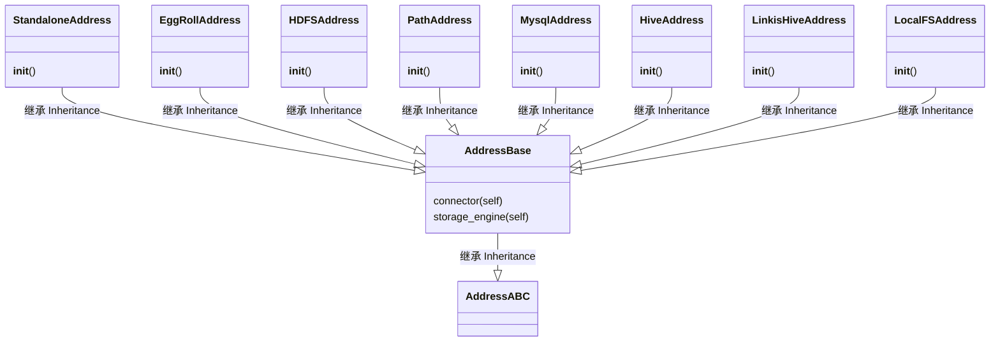
```mermaid
classDiagram

class AddressABC 

class AddressBase {
    connector(self)
    storage_engine(self)
}

class StandaloneAddress {
    __init__()

}
 
class EggRollAddress {
    __init__()
}

class HDFSAddress {
    __init__()
}

class PathAddress {
    __init__()
}

class MysqlAddress {
    __init__()
}

class HiveAddress {
    __init__()
}

class LinkisHiveAddress {
    __init__()
}

class LocalFSAddress {
    __init__()
}


AddressBase --|> AddressABC : 继承 Inheritance

StandaloneAddress--|>AddressBase : 继承 Inheritance
EggRollAddress--|>AddressBase : 继承 Inheritance
HDFSAddress--|>AddressBase : 继承 Inheritance
PathAddress--|>AddressBase : 继承 Inheritance
MysqlAddress--|>AddressBase : 继承 Inheritance
HiveAddress--|>AddressBase : 继承 Inheritance
LinkisHiveAddress--|>AddressBase : 继承 Inheritance
LocalFSAddress--|>AddressBase : 继承 Inheritance

```
上述类图结构说明如下：
- `AddressABC(metaclass=abc.ABCMeta)`, 无方法
- `AddressBase`提供`connector`及`storage_engine`方法
- 具体的实现类包括
  - `StandaloneAddress`, 其实例变量包括: `home`, `name`, `namespace`, `storage_type`, `connector_name`
  - `EggRollAddress`, 其实例变量包括: `home`, `name`, `namespace`, `connector_name`
  - `HDFSAddress`, 其实例变量包括: `name_node`, `path`, `connector_name`
  - `PathAddress`, 其实例变量包括: `path`, `connector_name`
  - `MysqlAddress`, 其实例变量包括: `user`, `passwd`, `host`, `port`, `db`, `name`, `connector_name`
  - `HiveAddress`, 其实例变量包括: `host`, `port=10000`, `username`, `database='default'`, `name`, , `connector_name`
  - `LinkisHiveAddress`, 其实例变量包括: `host="127.0.0.1"`, `port=9001`, `username`, `database`, `name`, `run_type='hql'`, `execute_application_name="hive"`, `source`, `params`, `auth_mechanism='PLAIN'`, `password`, `connector_name`
  - `LocalFSAddress`, 其实例变量包括: `path`, `connector_name`

上述地址中`StandaloneAddress`是使用频率最高的。
> 执行python3 examples/pipeline/hetero_logistic_regression/pipeline-hetero-lr-normal.py，`StandaloneAddress`的指分别为：
  <br>{name:'breast_hetero_guest',  namespace:'experiment' storage_type:'LMDB'}, 从LMDB数据库中读取表breast_hetero_guest
  <br>{name:'88ea49a04fcd11edb137000c298591df',  namespace:'output_data_202210200045585800640_reader_0_0',storage_type:'LMDB'}
  <br>{name:'a45bdb3a4fce11eda78f000c298591df',  namespace:'output_data_202210200045585800640_data_transform_0_0', storage_type:None}
  <br>{name:'a88bcf084fce11eda3c4000c298591df',  namespace:'output_data_202210200045585800640_data_transform_0_0', storage_type:None}
  <br>{name:'045851584fcf11edbb8e000c298591df',  namespace:'output_data_202210200045585800640_intersection_0_0', storage_type:None}
  <br>{name:'04650f9c4fcf11ed96a4000c298591df',  namespace:'output_data_202210200045585800640_intersection_0_0', storage_type:None}
  <br>{name:'a96472e44fcf11edbf6b000c298591df',  namespace:'output_data_202210200045585800640_hetero_lr_0_0', storage_type:None}


### 1.2 Computing

文件python/fate_arch/abc/_computing.py包含两个抽象类
- CTableABC
- CSessionABC


#### 1.2.1 CTableABC

CTableABC相关的类层次结构如下：

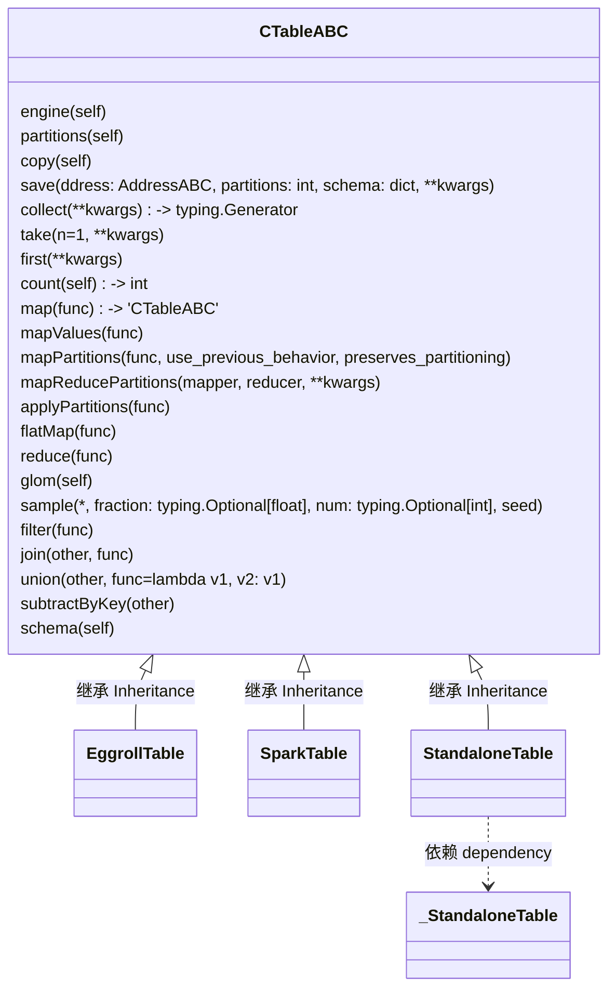
```mermaid
classDiagram

class CTableABC {
    engine(self)
    partitions(self)
    copy(self)
    save(ddress: AddressABC, partitions: int, schema: dict, **kwargs)
    collect(**kwargs) -> typing.Generator
    take(n=1, **kwargs)
    first(**kwargs)
    count(self) -> int
    map(func) -> 'CTableABC'
    mapValues(func)
    mapPartitions(func, use_previous_behavior, preserves_partitioning)
    mapReducePartitions(mapper, reducer, **kwargs)
    applyPartitions(func)
    flatMap(func)
    reduce(func)
    glom(self)
    sample(*, fraction: typing.Optional[float], num: typing.Optional[int], seed)
    filter(func)
    join(other, func)
    union(other, func=lambda v1, v2: v1)
    subtractByKey(other)
    schema(self)
}

class EggrollTable

class SparkTable

class StandaloneTable

class _StandaloneTable

CTableABC <|-- EggrollTable : 继承 Inheritance
CTableABC <|-- SparkTable : 继承 Inheritance
CTableABC <|-- StandaloneTable : 继承 Inheritance

StandaloneTable ..> _StandaloneTable : 依赖 dependency

```
上述类图概述如下：
- 抽象类`CTableABC`有三种实现类， 分别为：
  - 类图中`EggrollTable`实际是`fate_arch.computing.eggroll.Table`
  - 类图中`SparkTable`实际是`fate_arch.computing.spark.Table`
  - 类图中`StandaloneTable`实际是`fate_arch.computing.standalone.Table`

- 类图中`_StandaloneTable`实际是`fate_arch._standalone.Table`, `StandaloneTable`封装wrap了一个`fate_arch._standalone.Table`类型变量，完成同名的方法。

- 方法`engine`，返回表的引擎名称，不同的实现返回不同引擎名称，分别为：
  - eggroll, `ComputingEngine.EGGROLL`
  - spark, `ComputingEngine.SPARK`
  - standalone, `ComputingEngine.STANDALONE`

- 方法`partitions`返回分区的数量, 分区数在yaml文件或DSL文件中配置

- 方法`copy`

- 方法`mapValues(self, func)`, 对`Table`每个元素的values进行数据func操作,元素个数不能改变;

- 方法`mapPartitions(func, use_previous_behavior, preserves_partitioning)`, `mapPartitions`是`map`的一个变种。map的输入函数是应用于`Table`中每个元素，而`mapPartitions`的输入函数是应用于每个分区，也就是把每个分区中的内容作为整体来处理的


#### 1.2.2 CSessionABC

computing session to load/create/clean tables

CSessionABC相关的类层次结构如下：

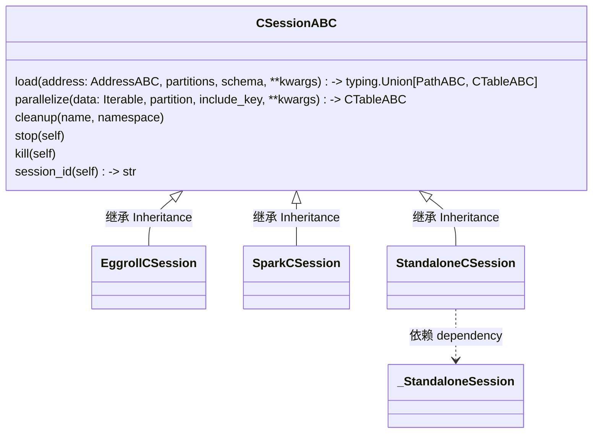
```mermaid
classDiagram

class CSessionABC {
    load(address: AddressABC, partitions, schema, **kwargs) -> typing.Union[PathABC, CTableABC]
    parallelize(data: Iterable, partition, include_key, **kwargs) -> CTableABC
    cleanup(name, namespace)
    stop(self)
    kill(self)
    session_id(self) -> str
}

class EggrollCSession
class SparkCSession
class StandaloneCSession

class  _StandaloneSession

CSessionABC <|-- EggrollCSession : 继承 Inheritance
CSessionABC <|-- SparkCSession : 继承 Inheritance
CSessionABC <|-- StandaloneCSession : 继承 Inheritance

StandaloneCSession ..> _StandaloneSession : 依赖 dependency

```
上述类图概述如下：
- 方法`load`， 从指定的地址加载表


### 1.3 Federation
`Federation`接口用于联邦的多方，包括Guest，host以及arbiter，交换变量

文件python/fate_arch/abc/_federation.py及python/fate_arch/abc/_gc.py中定义了
- FederationABC及
- GarbageCollectionABC相关的类层次结构
详情如下：

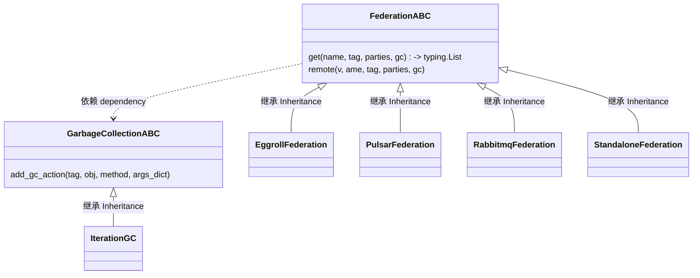
```mermaid
classDiagram

class GarbageCollectionABC {
    add_gc_action(tag, obj, method, args_dict)
}

class IterationGC

GarbageCollectionABC <|-- IterationGC : 继承 Inheritance

class FederationABC {
    get(name, tag, parties, gc) -> typing.List
    remote(v, ame, tag, parties, gc)
}

class EggrollFederation
class PulsarFederation
class RabbitmqFederation
class StandaloneFederation

FederationABC <|-- EggrollFederation : 继承 Inheritance
FederationABC <|-- PulsarFederation : 继承 Inheritance
FederationABC <|-- RabbitmqFederation : 继承 Inheritance
FederationABC <|-- StandaloneFederation : 继承 Inheritance

FederationABC ..> GarbageCollectionABC : 依赖 dependency

```
上述类图说明如下：
- 类`FederationABC`中方法：
  - 方法`get`, get objects/tables from `parties`。例如`Guest`从`Host`获取变量
  - 方法`remote`, remote object/table to `parties`。例如`arbiter`向`Guest`，`Host`发送变量
  - 方法中参数`gc`为`GarbageCollectionABC`类型变量
- 类`IterationGC`，详见2.1.1节[transfer_variable](#2.1.1)

Fate针对不同的模式支持多种技术方案：
- Eggroll
- Pulsar
- RabbitMQ
- Local Table


### 1.4 Storage

文件python/fate_arch/abc/_storage.py包含两个抽象类
- StorageTableMetaABC
- StorageSessionABC
- StorageTableABC


#### 1.4.1 StorageTableMetaABC

StorageTableMetaABC相关的类层次结构如下：

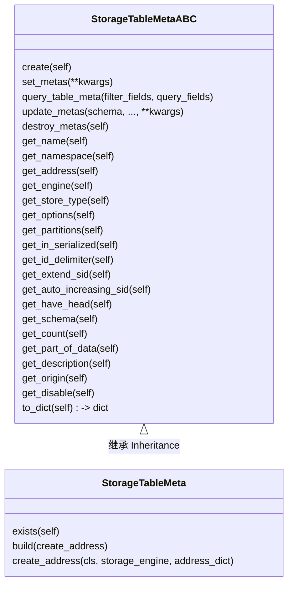
```mermaid
classDiagram

class StorageTableMetaABC {
    create(self)
    set_metas(**kwargs)
    query_table_meta(filter_fields, query_fields)
    update_metas(schema, ..., **kwargs)
    destroy_metas(self)
    get_name(self)
    get_namespace(self)
    get_address(self)
    get_engine(self)
    get_store_type(self)
    get_options(self)
    get_partitions(self)
    get_in_serialized(self)
    get_id_delimiter(self)
    get_extend_sid(self)
    get_auto_increasing_sid(self)
    get_have_head(self)
    get_schema(self)
    get_count(self)
    get_part_of_data(self)
    get_description(self)
    get_origin(self)
    get_disable(self)
    to_dict(self) -> dict
}

class StorageTableMeta{
    exists(self)
    build(create_address)
    create_address(cls, storage_engine, address_dict)
}

StorageTableMetaABC <|-- StorageTableMeta : 继承 Inheritance

```
上述类图说明如下：
- 类`StorageTableMeta`定义于文件python/fate_arch/storage/_table.py中
- update_metas 包括 schema, count, part_of_data, description, partitions, **kwargs

#### 1.4.2 StorageSessionABC

StorageTableMetaABC相关的类层次结构如下：

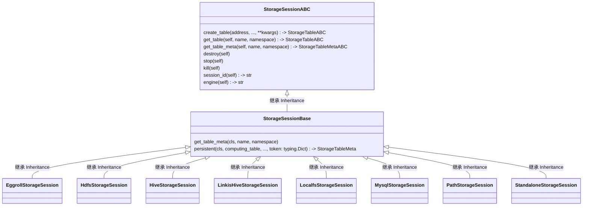
```mermaid
classDiagram

class StorageSessionABC {
    create_table(address, ..., **kwargs) -> StorageTableABC
    get_table(self, name, namespace) -> StorageTableABC
    get_table_meta(self, name, namespace) -> StorageTableMetaABC
    destroy(self)
    stop(self)
    kill(self)
    session_id(self) -> str
    engine(self) -> str
}

class StorageSessionBase {
    get_table_meta(cls, name, namespace)
    persistent(cls, computing_table, ..., token: typing.Dict) -> StorageTableMeta
}

StorageSessionABC <|-- StorageSessionBase : 继承 Inheritance
StorageSessionBase <|-- EggrollStorageSession : 继承 Inheritance
StorageSessionBase <|-- HdfsStorageSession : 继承 Inheritance
StorageSessionBase <|-- HiveStorageSession : 继承 Inheritance
StorageSessionBase <|-- LinkisHiveStorageSession : 继承 Inheritance
StorageSessionBase <|-- LocalfsStorageSession : 继承 Inheritance
StorageSessionBase <|-- MysqlStorageSession : 继承 Inheritance
StorageSessionBase <|-- PathStorageSession : 继承 Inheritance
StorageSessionBase <|-- StandaloneStorageSession : 继承 Inheritance
```
上述类图说明如下：
- 类`StorageSessionBase`定义于文件python/fate_arch/storage/_session.py中
- create_table 包括address, name, namespace, partitions, storage_type, options, **kwargs
- persistent包括 computing_table, namespace, name, schema, part_of_data, engine, engine_address, store_type, token: typing.Dict

#### 1.4.3 StorageTableABC

StorageTableMetaABC相关的类层次结构如下：

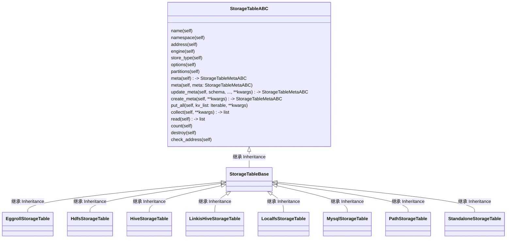
```mermaid
classDiagram

class StorageTableABC {
    name(self)
    namespace(self)
    address(self)
    engine(self)
    store_type(self)
    options(self)
    partitions(self)
    meta(self) -> StorageTableMetaABC
    meta(self, meta: StorageTableMetaABC)
    update_meta(self, schema, ..., **kwargs) -> StorageTableMetaABC
    create_meta(self, **kwargs) -> StorageTableMetaABC
    put_all(self, kv_list: Iterable, **kwargs)
    collect(self, **kwargs) -> list
    read(self) -> list
    count(self)
    destroy(self)
    check_address(self)
}

class StorageTableBase 

StorageTableABC <|-- StorageTableBase : 继承 Inheritance

StorageTableBase <|-- EggrollStorageTable : 继承 Inheritance
StorageTableBase <|-- HdfsStorageTable : 继承 Inheritance
StorageTableBase <|-- HiveStorageTable : 继承 Inheritance
StorageTableBase <|-- LinkisHiveStorageTable : 继承 Inheritance
StorageTableBase <|-- LocalfsStorageTable : 继承 Inheritance
StorageTableBase <|-- MysqlStorageTable : 继承 Inheritance
StorageTableBase <|-- PathStorageTable : 继承 Inheritance
StorageTableBase <|-- StandaloneStorageTable : 继承 Inheritance
```
上述类图说明如下：
- 类`StorageTableBase`定义于文件python/fate_arch/storage/_table.py中
- update_meta,包括schema, count, part_of_data, description, partitions, **kwargs等


### 1.5 Session

文件python/fate_arch/session/_session.py中定义了`Session`类及相关类

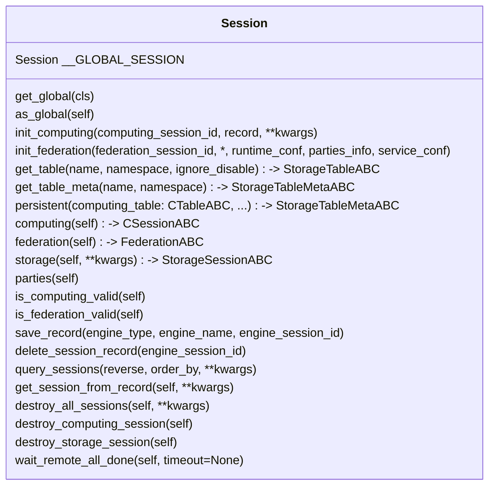
```mermaid
classDiagram

class Session {
    Session __GLOBAL_SESSION
    get_global(cls)
    as_global(self)
    init_computing(computing_session_id, record, **kwargs)
    init_federation(federation_session_id, *, runtime_conf, parties_info, service_conf)
    get_table(name, namespace, ignore_disable) -> StorageTableABC
    get_table_meta(name, namespace) -> StorageTableMetaABC
    persistent(computing_table: CTableABC, ...) -> StorageTableMetaABC
    computing(self) -> CSessionABC
    federation(self) -> FederationABC
    storage(self, **kwargs) -> StorageSessionABC
    parties(self)
    is_computing_valid(self)
    is_federation_valid(self)
    save_record(engine_type, engine_name, engine_session_id)
    delete_session_record(engine_session_id)
    query_sessions(reverse, order_by, **kwargs)
    get_session_from_record(self, **kwargs)
    destroy_all_sessions(self, **kwargs)
    destroy_computing_session(self)
    destroy_storage_session(self)
    wait_remote_all_done(self, timeout=None)
}

```
上述类图说明如下：
- 类`Session`包含上述三类session: `CSessionABC`, `FederationABC`以及`StorageSessionABC`并提供各类session的初始化及统一调用。
- persistent 方法 computing_table: CTableABC, namespace, name, schema=None, part_of_data=None, engine=None, engine_address=None, store_type=None, token: typing.Dict = None


类`Session`的调用关系图如下：

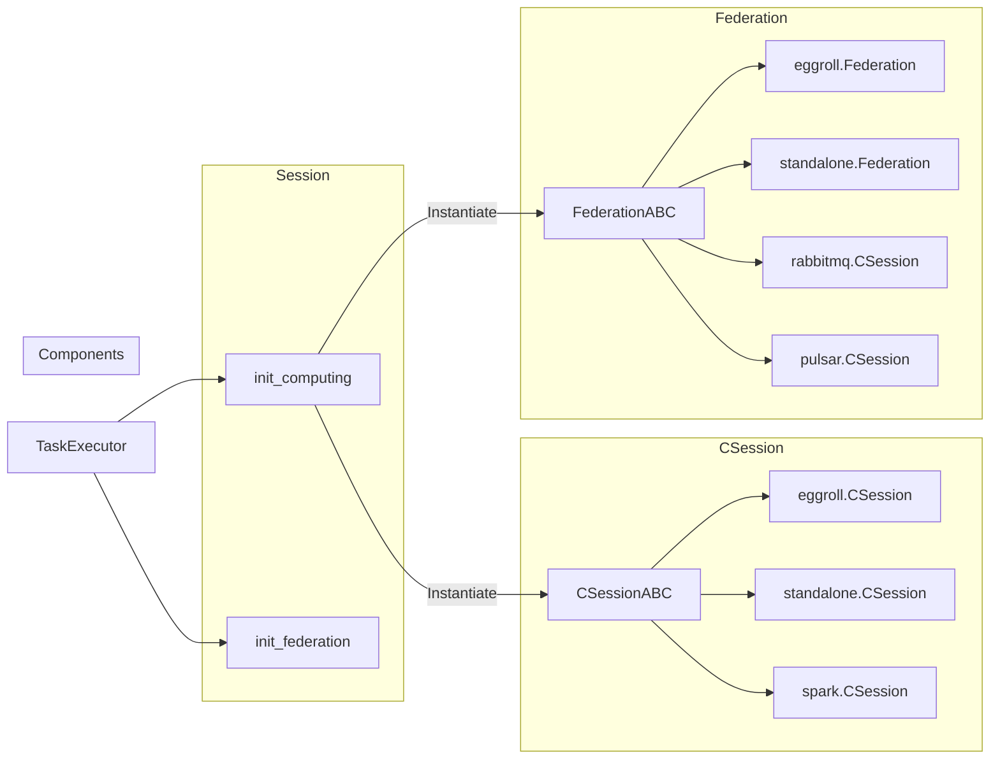
```mermaid
graph LR

TaskExecutor

CSessionABC

subgraph Components


end

subgraph Session

init_computing
init_federation

end

TaskExecutor-->init_computing
TaskExecutor-->init_federation

subgraph CSession

init_computing-->|Instantiate|CSessionABC
CSessionABC-->eggroll.CSession
CSessionABC-->standalone.CSession
CSessionABC-->spark.CSession

end


subgraph Federation

init_computing-->|Instantiate|FederationABC
FederationABC-->eggroll.Federation
FederationABC-->standalone.Federation
FederationABC-->rabbitmq.CSession
FederationABC-->pulsar.CSession

end

```


### Computing Relationship
**Table: The relationship of ComputingEngine, StorageEngine and FederationEngine** 
| ComputingEngine | StorageEngine | FederationEngine | 
| :---: | :---: | :---: |
| STANDALONE | STANDALONE | STANDALONE |
| EGGROLL | EGGROLL | EGGROLL |
| SPARK | HDFS as default<br>HIVE<br>LOCALFS | RABBITMQ as default<br>PULSAR |
| LINKIS_SPARK | LINKIS_HIVE | RABBITMQ as default<br>PULSAR |

> python/fate_arch/relation_ship.py


## 二、<span id="2">FEDRATEDML</span>

### 2.1 <span id="2.1">ModelBase</span>

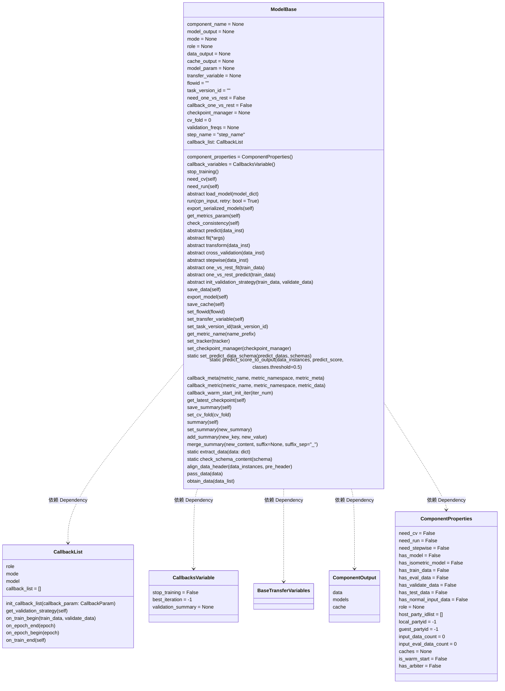
```mermaid
classDiagram

class ModelBase {
    component_name = None
    model_output = None
    mode = None
    role = None
    data_output = None
    cache_output = None
    model_param = None
    transfer_variable = None
    flowid = ""
    task_version_id = ""
    need_one_vs_rest = False
    callback_one_vs_rest = False
    checkpoint_manager = None
    cv_fold = 0
    validation_freqs = None
    component_properties = ComponentProperties()
    step_name = "step_name"
    callback_list: CallbackList
    callback_variables = CallbacksVariable()
    stop_training()
    need_cv(self)
    need_run(self)
    abstract load_model(model_dict)
    run(cpn_input, retry: bool = True)
    export_serialized_models(self)
    get_metrics_param(self)
    check_consistency(self)
    abstract predict(data_inst)
    abstract fit(*args)
    abstract transform(data_inst)
    abstract cross_validation(data_inst)
    abstract stepwise(data_inst)
    abstract one_vs_rest_fit(train_data)
    abstract one_vs_rest_predict(train_data)
    abstract init_validation_strategy(train_data, validate_data)
    save_data(self)
    export_model(self)
    save_cache(self)
    set_flowid(flowid)
    set_transfer_variable(self)
    set_task_version_id(task_version_id)
    get_metric_name(name_prefix)
    set_tracker(tracker)
    set_checkpoint_manager(checkpoint_manager)
    static set_predict_data_schema(predict_datas, schemas)
    static predict_score_to_output(data_instances, predict_score, classes.threshold=0.5)
    callback_meta(metric_name, metric_namespace, metric_meta)
    callback_metric(metric_name, metric_namespace, metric_data)
    callback_warm_start_init_iter(iter_num)
    get_latest_checkpoint(self)
    save_summary(self)
    set_cv_fold(cv_fold)
    summary(self)
    set_summary(new_summary)
    add_summary(new_key, new_value)
    merge_summary(new_content, suffix=None, suffix_sep="_")
    static extract_data(data: dict)
    static check_schema_content(schema)
    align_data_header(data_instances, pre_header)
    pass_data(data)
    obtain_data(data_list)
    
}

class CallbackList {
    role
    mode
    model
    callback_list = []
    init_callback_list(callback_param: CallbackParam)
    get_validation_strategy(self)
    on_train_begin(train_data, validate_data)
    on_epoch_end(epoch)
    on_epoch_begin(epoch)
    on_train_end(self)
}

class CallbacksVariable {
    stop_training = False
    best_iteration = -1
    validation_summary = None
}

class ComponentOutput {
    data
    models
    cache
}

class ComponentProperties {
    need_cv = False
    need_run = False
    need_stepwise = False
    has_model = False
    has_isometric_model = False
    has_train_data = False
    has_eval_data = False
    has_validate_data = False
    has_test_data = False
    has_normal_input_data = False
    role = None
    host_party_idlist = []
    local_partyid = -1
    guest_partyid = -1
    input_data_count = 0
    input_eval_data_count = 0
    caches = None
    is_warm_start = False
    has_arbiter = False

}

class BaseTransferVariables

ModelBase ..> CallbackList : 依赖 Dependency
ModelBase ..> CallbacksVariable : 依赖 Dependency
ModelBase ..> BaseTransferVariables : 依赖 Dependency
ModelBase ..> ComponentOutput : 依赖 Dependency
ModelBase ..> ComponentProperties : 依赖 Dependency
```
上述类图ModelBase包含的成员变量如下：
- `mode`包含两个选项：`HETERO = "hetero"`及`HOMO = "homo"`
- `role`包含三个选项：`ARBITER = 'arbiter'`、`HOST = 'host'`及`GUEST = 'guest'`
- `component_name`，定义于目录python/federatedml/components/下的各个Component，例如：
  - 文件hetero_lr.py中的`hetero_lr_cpn_meta = ComponentMeta("HeteroLR")`
  - 文件intersection.py中的`intersection_cpn_meta = ComponentMeta("Intersection")`
  - 上述文件中的`HeteroLR`， `Intersection`即为`component_name`
  - 文件python/federatedml/components/components.py中代码
    ```python
    def _get_runner(self, role: str):
        if role in self._role_to_runner_cls:
            runner_class = self._role_to_runner_cls[role]

        elif role in self._role_to_runner_cls_getter:
            runner_class = self._role_to_runner_cls_getter[role]()

        else:
            raise ModuleNotFoundError(
                f"Runner for component `{self.name}` at role `{role}` not found"
            )
        runner_class.set_component_name(self.alias[0])
        return runner_class
    ```
    代码中`runner_class.set_component_name(self.alias[0])`调用`ModelBase`类的`set_component_name`方法
- `model_output`，其数据结构如下：
  ```python
  result = {
      MODEL_META_NAME: meta_obj,
      MODEL_PARAM_NAME: param_obj
  }
  self.model_output = result
  ```
- `data_output`，可以为`None`或`fate_arch.computing.standalone.Table`,详见[CTableABC](#1.2.1)
- `cache_output`, 不详，使用场景不明确
- `model_param`，每个模型组件都有相应的模型参数，例如
  - `HeteroLRBase`组件对应的模型参数为`HeteroLogisticParam`
  - `BaseKmeansModel`组件对应的模型参数为`KmeansParam`，其包括的参数有
    - self.k = k
    - self.max_iter
    - self.tol
    - self.random_stat
- `transfer_variable`及`flowid`
  ```python
  def set_flowid(self, flowid):
      # self.flowid = '.'.join([self.task_version_id, str(flowid)])
      self.flowid = flowid
      self.set_transfer_variable()

   def set_transfer_variable(self):
       if self.transfer_variable is not None:
          LOGGER.debug(
             "set flowid to transfer_variable, flowid: {}".format(self.flowid)
          )
          self.transfer_variable.set_flowid(self.flowid)
  ```
  从上述代码可知，`transfer_variable`及`flowid`是相关联的
  `transfer_variable`为`BaseTransferVariables`的具体子类的实例变量，详见2.1.1节[transfer_variable](#2.1.1) 
- `task_version_id`取值见[表-ModelBase成员变量](#t_2_1)所示
- `need_one_vs_rest`，其取值见[表-ModelBase成员变量](#t_2_1)所示
- `callback_one_vs_rest`，其取值见[表-ModelBase成员变量](#t_2_1)所示
- `checkpoint_manager`，其取值见[表checkpoint_manager](#t_2_4)所示


运行python3 examples/pipeline/hetero_logistic_regression/pipeline-hetero-lr-normal.py，涉及到`ModelBase`的子类的实例及其实例的成员变量

**<span id="t_2_1">表-`ModelBase`成员变量</span>**
| Fields | DataTransform | Intersection | HeteroLR |  Evaluation |
| :--- | :--- | :--- | :--- | :--- |
| cache_output | None | None | None | None |
| callback_list | [] | [] | [ModelCheckpoint] | [] |
| callback_one_vs_rest | False | False | False | False |
| callback_variables | 见下表 | 见下表 | 见下表 | 见下表 |
| checkpoint_manager | 见下表 | 见下表 | 见下表 | 见下表 |
| component_name | DataTransform | Intersection | HeteroLR | Evaluation |
| component_properties | 见下表 | 见下表 | 见下表 | 见下表 |
| cv_fold | 0 | 0 | 0 | 0 |
| data_output | None | None<br>standalone._table.Table | None<br>standalone._table.Table | None<br>standalone._table.Table |
| flowid | fit | fit | validate | fit |
| mode | None | None | 'hetero' | None |
| model_output | None | None | None | None |
| model_param | None | IntersectParam | HeteroLogisticRegressionParam | EvaluateParam |
| need_one_vs_rest | False | False | False | False |
| role | guest<br>host | guest<br>host | arbiter<br>guest<br>host | arbiter<br>guest<br>host |
| step_name | step_name | step_name | step_name | step_name |
| task_version_id | '_data_transform_0_0' | '_intersection_0_0' | '_hetero_lr_0_0' |'_evaluation_0_0' |
| transfer_variable | None | IntersectionFuncTransferVariable | HeteroLRTransferVariable | None |
| validation_freqs | None | None | None | None |


> 仅角色为guest时，data_output=Table


**<span id="t_2_2">表callback_variables</span>**

| Fields | DataTransform | Intersection | HeteroLR | Evaluation |
| :--- | :--- | :--- | :--- | :--- |
| best_iteration | -1 | -1 | -1 | -1 |
| stop_training | False | False | False | False |
| validation_summary | None | None | None | None |


**<span id="t_2_3">表ComponentProperties</span>**

| Fields | DataTransform | Intersection | HeteroLR | Evaluation |
| :--- | :--- | :--- | :--- | :--- |
| caches |  None | None | None | None |
| guest_partyid | 9999 | 9999 | None | None |
| has_arbiter | False | False | True | True |
| has_eval_data | False | False | False | False |
| has_isometric_model | False | False | False | False |
| has_model | False |False | False | False |
| has_normal_input_data | True | True | False | True |
| has_test_data | False | False | False | False |
| has_train_data | False | False | True | False |
| has_validate_data | False | False | False | False |
| host_party_idlist | [10000] | [10000] | [10000] | [10000] |
| input_data_count | 569 | 569 | 0 | 0 |
| input_eval_data_count | 0 | 0 | 0 | 0 |
| is_warm_start | False | False | False | False |
| local_partyid | 9999 | 9999 | 10000 | 10000 |
| need_cv | False | False | False | False |
| need_run | True | True | True | True |
| need_stepwise | False | False | False | False |
| role | guest | guest | arbiter | arbiter |


**<span id="t_2_4">表表checkpoint_manager</span>**
| Fields | DataTransform | Intersection | HeteroLR | Evaluation |
| :--- | :--- | :--- | :--- | :--- |
| checkpoints | deque([]) | deque([]) | deque([checkpoint) len:30 | deque([]) |
| checkpoints_number | 0 | 0 | 0 |
| component_name | 'data_transform_0' | 'intersection_0' |'hetero_lr_0' | 'evaluation_0' |
| direcotry | checkpoint/data_transform_0' | checkpoint/intersection_0' | checkpoint/hetero_lr_0' | checkpoint/evaluation_0' |
| job_id | 'xxx' | 同左 | 同左 | 同左 |
| job_parameters | RunParameter | RunParameter | RunParameter | RunParameter |
| latest_checkpiont | None | None | Checkpiont | None |
| latest_step_index | None | None | 29 | None |
| latest_step_name | None | None | step_name | None |
| max_checkpoint_number | None | None | None | None |
| mkdir | True | True | True | True |
| model_id | x | x | x | x |
| model_version | x  | x | x | x |
| model_name | DataTransform | Intersection | HeteroLR |
| name_indexed_checkpoints | OrderedDict([]) | OrderedDict([]) | OrderedDict([step_name, step_index:29]) | OrderedDict([]) |
| number_indexed_checkpoints | OrderedDict([]) | OrderedDict([]) | OrderedDict([Checkpiont]) len:30 | OrderedDict([]) |
| party_id | 9999 | 9999 | 10000 | 10000 |
| party_model_id | x | x | x | x |
| role | guest | guest | arbiter | arbiter |
| task_id | 202212280008507835440_data_transform_0 | x_data_transform_0 | x_hetero_lr_0 | '_evaluation_0'
| task_version | guest | guest | '0' | '0' |


---
#### 2.1.1 <span id="2.1.1">transfer_variable</span>
当组件Component需要联邦时，定义`transfer_variable`类，并继承`BaseTransferVariables`类

文件python/fate_arch/federation/transfer_variable.py中`BaseTransferVariables`类图定义如下：

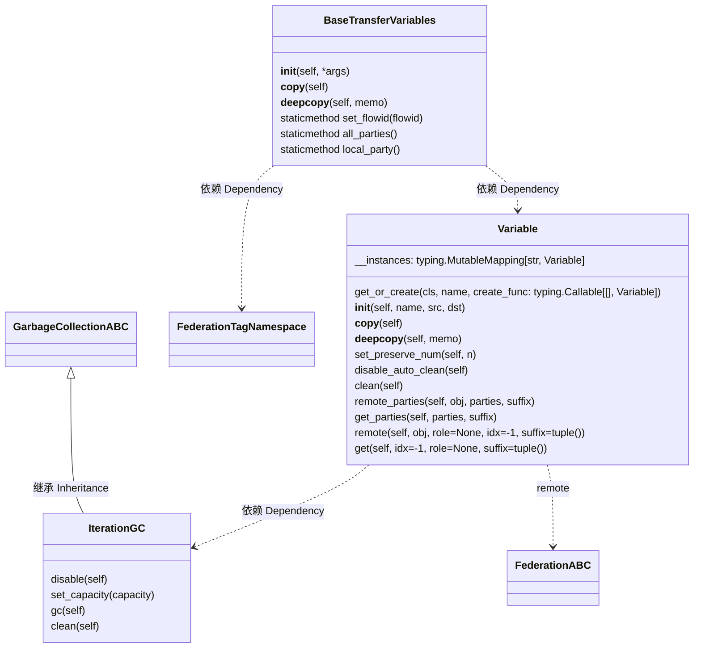
```mermaid
classDiagram

class BaseTransferVariables {
    __init__(self, *args)
    __copy__(self)
    __deepcopy__(self, memo)
    staticmethod set_flowid(flowid)
    staticmethod all_parties()
    staticmethod local_party()
}

class Variable {
    __instances: typing.MutableMapping[str, Variable]
    get_or_create(cls, name, create_func: typing.Callable[[], Variable])
    __init__( self, name, src, dst)
    __copy__(self)
    __deepcopy__(self, memo)
    set_preserve_num(self, n)
    disable_auto_clean(self)
    clean(self)
    remote_parties(self, obj, parties, suffix)
    get_parties(self, parties, suffix)
    remote(self, obj, role=None, idx=-1, suffix=tuple())
    get(self, idx=-1, role=None, suffix=tuple())
}

class FederationTagNamespace

class IterationGC {
    disable(self)
    set_capacity(capacity)
    gc(self)
    clean(self)
}

class GarbageCollectionABC
class FederationABC

BaseTransferVariables ..> FederationTagNamespace : 依赖 Dependency
BaseTransferVariables ..> Variable : 依赖 Dependency
Variable ..> IterationGC : 依赖 Dependency
Variable ..> FederationABC : remote
GarbageCollectionABC <|-- IterationGC : 继承 Inheritance

```
上述类说明：
- `IterationGC`仅用于pulsar，rabbitmq等Federation类型，standardlone类型不用


实现`BaseTransferVariables`的组件Component相应的类包括：
- `HomoTransferBase`类及其子类：
  - `AggregatorTransVar`
  - `DHTransVar`
  - `HasConvergedTransVar`
  - `ModelBroadcasterTransVar`
  - `ModelScatterTransVar`
  - `PaillierCipherTransVar`
  - `RandomPaddingCipherTransVar`
  - `SecureAggregatorTransVar`
  - `UUIDTransVar`
  - `LegacyAggregatorTransVar`
  - `HomoNNDefaultTransVar`
- `BatchGeneratorTransferVariable`类
- `CipherCompressorTransferVariable`类
- `ConvergeCheckerTransferVariable`类
- `CrossValidationTransferVariable`类
- `DataSplitTransferVariable`类
- `DhIntersectTransferVariable`类
- `FeldmanVerifiableSumTransferVariables`类
- `FTLTransferVariable`类
- `HeteroBoostingTransferVariable`类
- `HeteroDecisionTreeTransferVariable`类
- `HeteroDNNLRTransferVariable`类
- `HeteroFeatureBinningTransferVariable`类
- `HeteroFeatureSelectionTransferVariable`类
- `HeteroKmeansTransferVariable`类
- `HeteroLinRTransferVariable`类
- `HeteroLRTransferVariable`类
- `HeteroNNTransferVariable`类
- `HeteroPoissonTransferVariable`类
- `HeteroSecureBoostingTreeTransferVariable`类
- `HeteroSecureBoostTransferVariable`类
- `HeteroSecureBoostingTreeTransferVariable`类
- `HomoBinningTransferVariable`类
- `HomoDecisionTreeTransferVariable`类
- `HomoLabelEncoderTransferVariable`类
- `HomoLRTransferVariable`类
- `HomoOneHotTransferVariable`类
- `HomoSecureBoostingTreeTransferVariable`类
- `HomoTransferVariable`类
- `IntersectionFuncTransferVariable`类
- `ObliviousTransferTransferVariable`类
- `OneVsRestTransferVariable`类
- `RawIntersectTransferVariable`类
- `RsaIntersectTransferVariable`类
- `SampleTransferVariable`类
- `SecretShareTransferVariable`类
- `SecureAddExampleTransferVariable`类
- `SecureInformationRetrievalTransferVariable`类
- `SSHEModelTransferVariable`类
- `StepwiseTransferVariable`类
- `ValidationStrategyVariable`类


---
### 2.2 <span id="2.2">HeteroLR</span>

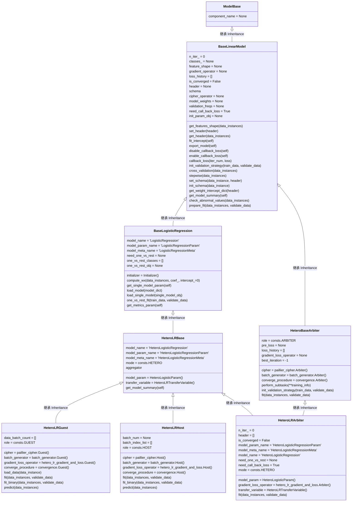
```mermaid
classDiagram

class ModelBase {
    component_name = None
}

class BaseLinearModel {
    n_iter_ = 0
    classes_ = None
    feature_shape = None
    gradient_operator = None
    loss_history = []
    is_converged = False
    header = None
    schema
    cipher_operator = None
    model_weights = None
    validation_freqs = None
    need_call_back_loss = True
    init_param_obj = None

    get_features_shape(data_instances)
    set_header(header)
    get_header(data_instances)
    fit_intercept(self)
    export_model(self)
    disable_callback_loss(self)
    enable_callback_loss(self)
    callback_loss(iter_num, loss)
    init_validation_strategy(train_data, validate_data)
    cross_validation(data_instances)
    stepwise(data_instances)
    set_schema(data_instance, header)
    init_schema(data_instance)
    get_weight_intercept_dict(header)
    get_model_summary(self)
    check_abnormal_values(data_instances)
    prepare_fit(data_instances, validate_data)
}


class BaseLogisticRegression {
    initializer = Initializer()
    model_name = 'LogisticRegression'
    model_param_name = 'LogisticRegressionParam'
    model_meta_name = 'LogisticRegressionMeta'
    need_one_vs_rest = None
    one_vs_rest_classes = []
    one_vs_rest_obj = None

    compute_wx(data_instances, coef_, intercept_=0)
    get_single_model_param(self)
    load_model(model_dict)
    load_single_model(single_model_obj)
    one_vs_rest_fit(train_data, validate_data)
    get_metrics_param(self)
}


class HeteroLRBase {
    model_name = 'HeteroLogisticRegression'
    model_param_name = 'HeteroLogisticRegressionParam'
    model_meta_name = 'HeteroLogisticRegressionMeta'
    mode = consts.HETERO
    model_param = HeteroLogisticParam()
    transfer_variable = HeteroLRTransferVariable()
    aggregator
    get_model_summary(self)
}


class HeteroLRGuest {
    data_batch_count = []
    role = consts.GUEST
    cipher = paillier_cipher.Guest()
    batch_generator = batch_generator.Guest()
    gradient_loss_operator = hetero_lr_gradient_and_loss.Guest()
    converge_procedure = convergence.Guest()
    load_data(data_instance)
    fit(data_instances, validate_data)
    fit_binary(data_instances, validate_data)
    predict(data_instances)
}

class HeteroLRHost {
    batch_num = None
    batch_index_list = []
    role = consts.HOST
    cipher = paillier_cipher.Host()
    batch_generator = batch_generator.Host()
    gradient_loss_operator = hetero_lr_gradient_and_loss.Host()
    converge_procedure = convergence.Host()
    fit(data_instances, validate_data)
    fit_binary(data_instances, validate_data)
    predict(data_instances)
}

class HeteroBaseArbiter {
    role = consts.ARBITER
    pre_loss = None
    loss_history = []
    cipher = paillier_cipher.Arbiter()
    batch_generator = batch_generator.Arbiter()
    gradient_loss_operator = None
    converge_procedure = convergence.Arbiter()
    best_iteration = -1
    perform_subtasks(**training_info)
    init_validation_strategy(train_data, validate_data)
    fit(data_instances, validate_data)
}

class HeteroLRArbiter {
    model_param = HeteroLogisticParam()
    gradient_loss_operator = hetero_lr_gradient_and_loss.Arbiter()
    n_iter_ = 0
    header = []
    is_converged = False
    model_param_name = 'HeteroLogisticRegressionParam'
    model_meta_name = 'HeteroLogisticRegressionMeta'
    model_name = 'HeteroLogisticRegression'
    need_one_vs_rest = None
    need_call_back_loss = True
    mode = consts.HETERO
    transfer_variable = HeteroLRTransferVariable()
    fit(data_instances, validate_data)
}

ModelBase <|-- BaseLinearModel : 继承 Inheritance

BaseLinearModel <|-- BaseLogisticRegression : 继承 Inheritance

BaseLogisticRegression <|-- HeteroLRBase : 继承 Inheritance

HeteroLRBase <|-- HeteroLRGuest : 继承 Inheritance

HeteroLRBase <|-- HeteroLRHost : 继承 Inheritance

BaseLinearModel <|--HeteroBaseArbiter : 继承 Inheritance

HeteroBaseArbiter <|-- HeteroLRArbiter : 继承 Inheritance

HeteroLRBase <|-- HeteroLRArbiter : 继承 Inheritance

```
上述类图说明：
- `ModelBase`详情参见2.1[ModelBase](#2.1)


---
### 2.2.1 <span id="2.2.1">HeteroLRTransferVariable</span>


---
### 2.A <span id="2.A">Compare</span>

**fate_client/pipeline/component**  **federatedml/component**
比较以上两个目录下
- 每个Component对应一个文件，因此上述两个目录下文件名基本相同
- 内容比较

**fate_client/pipeline/param/**  **federatedml/param**
- 每个Component的param对应一个文件，，因此上述两个目录下文件名基本相同
- 文件的参数定义的内容基本相同

**初步的结论：存在大量的重复代码，代码的结构有问题，开发效率低**


## 三、<span id="3">FATE Flow</span>

### 3.1 <span id="3.1">Secheduler</span>

Fateflow提供DAGScheduler、FederatedScheduler以及TaskScheduler三个Scheduler相关的类，其类图(Class Diagram)如下：

<span id="C3-1">类图3-1</span>

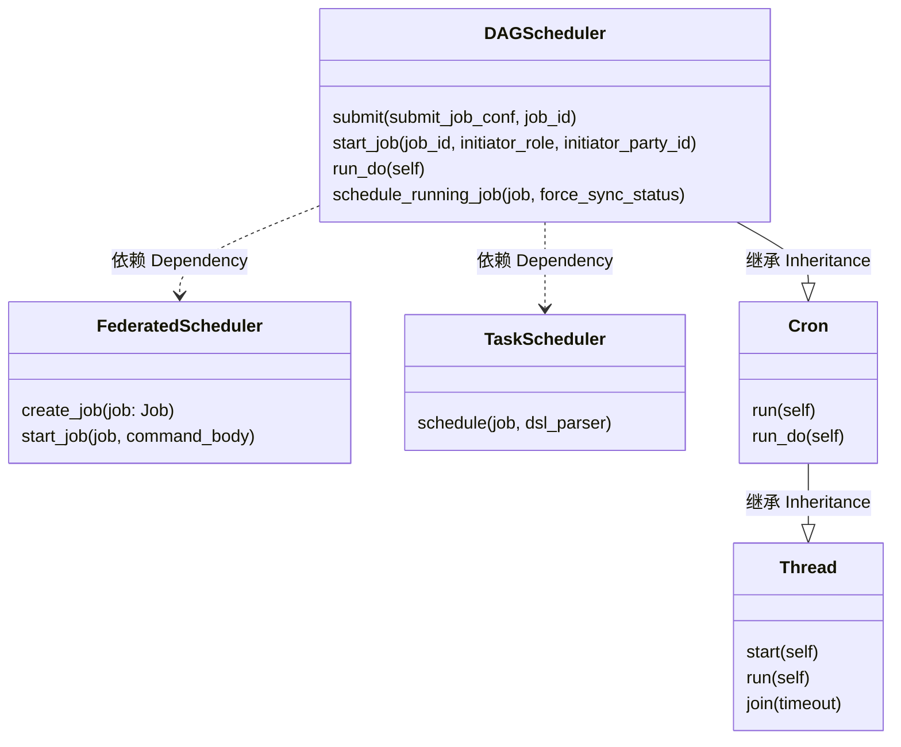
```mermaid
classDiagram

class FederatedScheduler{
    create_job(job: Job)
    start_job(job, command_body)
}

class TaskScheduler{
    schedule(job, dsl_parser)
}

class DAGScheduler{
    submit(submit_job_conf, job_id)
    start_job(job_id, initiator_role, initiator_party_id)
    run_do(self)
    schedule_running_job(job, force_sync_status)
}

class Cron{
    run(self)
    run_do(self)
}


class Thread{
    start(self)
    run(self)
    join(timeout)
}

DAGScheduler ..> FederatedScheduler : 依赖 Dependency

DAGScheduler ..> TaskScheduler : 依赖 Dependency

DAGScheduler --|> Cron : 继承 Inheritance

Cron --|> Thread : 继承 Inheritance

```


#### 3.1.1 <span id="3.1.1">DAGSecheduler方法</span>

DAGSecheduler方法的被调用的关系图如下：

<span id="G3-1">图3-1</span>

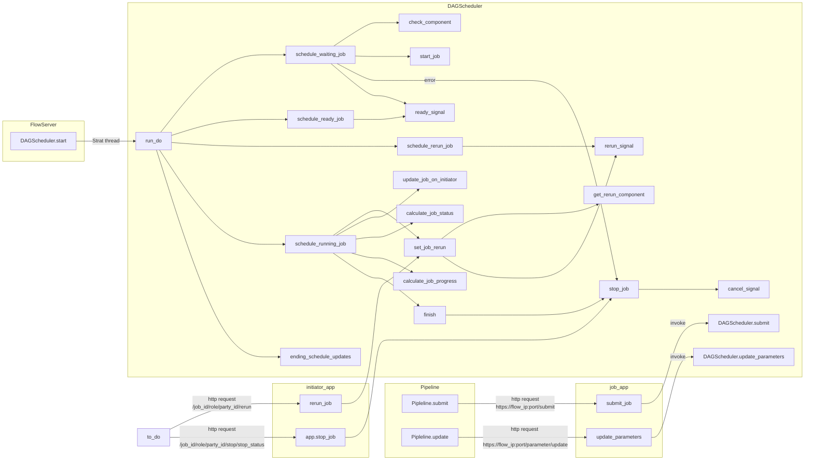
```mermaid
graph LR

subgraph Pipeline

Pipleline.submit
Pipleline.update

end


subgraph job_app

submit_job
update_parameters

Pipleline.submit-->|http request <br> https://flow_ip:port/submit|submit_job
Pipleline.update-->|http request <br> https://flow_ip:port/parameter/update|update_parameters

end

subgraph FlowServer

DAGScheduler.start

end

subgraph initiator_app

rerun_job
app.stop_job

end

subgraph DAGScheduler

%% External Relationships
submit_job-->|invoke|DAGScheduler.submit
update_parameters-->|invoke|DAGScheduler.update_parameters
DAGScheduler.start-->|Strat thread|run_do

rerun_job-->set_job_rerun
app.stop_job-->stop_job

%% Internal Relationships

run_do-->schedule_waiting_job
run_do-->schedule_ready_job
run_do-->schedule_rerun_job
run_do-->schedule_running_job
run_do-->ending_schedule_updates

schedule_waiting_job-->check_component
schedule_waiting_job-->start_job
schedule_waiting_job-->|error|stop_job
schedule_waiting_job-->ready_signal

schedule_ready_job-->ready_signal

schedule_rerun_job-->rerun_signal

schedule_running_job-->set_job_rerun
schedule_running_job-->update_job_on_initiator
schedule_running_job-->calculate_job_status
schedule_running_job-->calculate_job_progress
schedule_running_job-->finish

set_job_rerun-->get_rerun_component
set_job_rerun-->rerun_signal

stop_job-->cancel_signal

finish-->stop_job

end

to_do-->|http request<br> /job_id/role/party_id/rerun|rerun_job
to_do-->|http request<br> /job_id/role/party_id/stop/stop_status|app.stop_job


```

DAGSecheduler类中方法都为@classmethod类方法，各方法的功能描述如下：
- submit
- update_parameters
- run_do
- schedule_waiting_job
- check_component
- schedule_ready_job
- schedule_rerun_job
- start_job
- schedule_running_job
- set_job_rerun
- get_rerun_component
- update_job_on_initiator
- calculate_job_status
- calculate_job_progress
- stop_job
- ready_signal
- cancel_signal
- rerun_signal
- ending_schedule_updates
- finish


#### 3.1.2 <span id="3.1.2">TaskScheduler方法</span>

TaskScheduler类中各方法的被调用的关系图如下：

<span id="G3-2">图3-2</span>

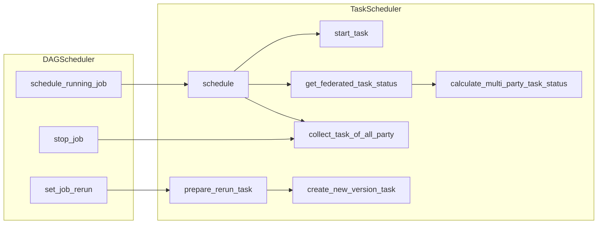
```mermaid
graph LR

subgraph DAGScheduler

schedule_running_job
set_job_rerun
stop_job

end

subgraph TaskScheduler

schedule_running_job-->schedule

schedule-->start_task
schedule-->get_federated_task_status
schedule-->collect_task_of_all_party

set_job_rerun-->prepare_rerun_task
prepare_rerun_task-->create_new_version_task
stop_job-->collect_task_of_all_party

get_federated_task_status-->calculate_multi_party_task_status

end


```

TaskScheduler类中方法都为@classmethod类方法，各方法的功能描述如下：
- schedule
- start_task
- prepare_rerun_task
- create_new_version_task
- collect_task_of_all_party
- get_federated_task_status
- calculate_multi_party_task_status


#### 3.1.3 <span id="3.1.3">FederatedScheduler方法</span>

FederatedScheduler类使用http/grpc协议，实现联邦计算各方节点之间的协作，类中各方法的被调用的关系图如下：

<span id="G3-3">图3-3</span>

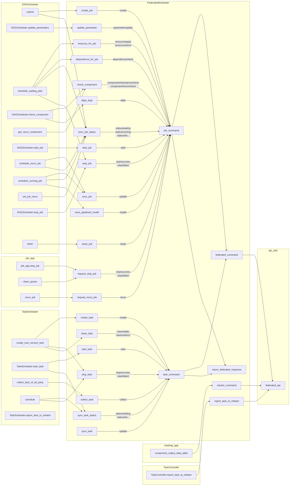
```mermaid
graph LR

subgraph job_app

job_app.stop_job
clean_queue
rerun_job

end


subgraph DAGScheduler

submit
DAGScheduler.update_parameters
schedule_waiting_jobs
DAGScheduler.check_component
get_rerun_component
DAGScheduler.start_job
schedule_rerun_job
schedule_running_job
set_job_rerun
DAGScheduler.stop_job
finish

end

subgraph TaskScheduler

create_new_version_task
TaskScheduler.start_task
collect_task_of_all_party
schedule
TaskScheduler.report_task_to_initiator

end

subgraph TaskController

TaskController.report_task_to_initiator

end

subgraph tracking_app

component_output_data_table

end


subgraph api_utils

federated_api

end

subgraph FederatedScheduler

submit-->create_job
DAGScheduler.update_parameters-->update_parameter
schedule_waiting_jobs-->resource_for_job
DAGScheduler.check_component-->check_component
get_rerun_component-->check_component
schedule_waiting_jobs-->dependence_for_job
DAGScheduler.start_job-->start_job
DAGScheduler.check_component-->align_args
schedule_rerun_job-->sync_job
schedule_running_job-->sync_job
submit-->sync_job_status
schedule_waiting_jobs-->sync_job_status
schedule_rerun_job-->sync_job_status
schedule_running_job-->sync_job_status
set_job_rerun-->sync_job_status
schedule_running_job-->save_pipelined_model
schedule_waiting_jobs-->stop_job
DAGScheduler.stop_job-->stop_job

job_app.stop_job-->request_stop_job
clean_queue-->request_stop_job
rerun_job-->request_rerun_job
finish-->clean_job

create_job-->|create|job_command
update_parameter-->|parameter/update|job_command
resource_for_job-->|resource/apply<br>resource/return|job_command
check_component-->|component/inheritance/check<br>component/rerun/check|job_command
dependence_for_job-->|dependence/check|job_command
start_job-->|start|job_command
align_args-->|align|job_command
sync_job-->|update|job_command
sync_job_status-->|status/waiting<br>status/running<br>status/etc..|job_command
save_pipelined_model-->|model|job_command
stop_job-->|stop/success<br>stop/failed|job_command
request_stop_job-->|stop/success<br>stop/failed|job_command
request_rerun_job-->|rerun|job_command
clean_job-->|clean|job_command

create_new_version_task-->create_task
TaskScheduler.start_task-->start_task
collect_task_of_all_party-->collect_task
schedule-->sync_task_status
TaskScheduler.start_task-->sync_task_status
create_new_version_task-->stop_task
schedule-->stop_task
create_new_version_task-->clean_task


create_task-->|create|task_command
start_task-->|start|task_command
collect_task-->|collect|task_command
sync_task-->|update|task_command
sync_task_status-->|status/waiting<br>status/etc..|task_command
stop_task-->|stop/success<br>stop/failed|task_command
clean_task-->|clean/table<br>clean/metrics|task_command


job_command-->federated_command
task_command-->federated_command

TaskController.report_task_to_initiator-->report_task_to_initiator
component_output_data_table-->tracker_command

federated_command-->federated_api
report_task_to_initiator-->federated_api
tracker_command-->federated_api

job_command-->return_federated_response
task_command-->return_federated_response

end

```

FederatedScheduler类中方法都为@classmethod类方法，主要实现Job和Task相关命令的发送，
其中Job相关方法及功能描述如下：
- create_job
- update_parameter
- resource_for_job
- check_component
- dependence_for_job
- start_job
- align_args
- sync_job
- sync_job_status
- save_pipelined_model
- stop_job
- request_stop_job
- request_rerun_job
- clean_job
- job_command

Task任务相关方法及功能描述如下
- create_task
- start_task
- collect_task
- sync_task
- sync_task_status
- stop_task
- clean_task

其他方法及功能描述如下：
- federated_command
- report_task_to_initiator
- task_command


##### 3.1.3.1 <span id="3.1.3.1">Job Command</span>
从方法调用关系中可以看到，从方法`create_job`到`clean_job`，都调用`job_command`执行后续的http/grpc请求。`job_command`将上述方法进行分类为以下Command类型：
- create
- parameter/update
- resource/apply或resource/return
- component/inheritance/check或component/rerun/check
- start
- align
- update
- status/{job_status}
- model
- stop/{job_status}
- rerun
- clean

以上Command类型在图的调用`job_command`关系上标识


在FederatedScheduler类中，`job_command`方法的代码如下：
```python
@classmethod
def job_command(cls, job, command, command_body=None, dest_only_initiator=False, specific_dest=None, parallel=False):
    federated_response = {}
    job_parameters = job.f_runtime_conf_on_party["job_parameters"]
    if dest_only_initiator:
        dest_partis = [(job.f_initiator_role, [job.f_initiator_party_id])]
        api_type = "initiator"
    elif specific_dest:
        dest_partis = specific_dest.items()
        api_type = "party"
    else:
        dest_partis = job.f_roles.items()
        api_type = "party"
    threads = []
    for dest_role, dest_party_ids in dest_partis:
        federated_response[dest_role] = {}
        for dest_party_id in dest_party_ids:
            endpoint = f"/{api_type}/{job.f_job_id}/{dest_role}/{dest_party_id}/{command}"
            args = (job.f_job_id, job.f_role, job.f_party_id, dest_role, dest_party_id, endpoint, command_body, job_parameters["federated_mode"], federated_response)
            if parallel:
                t = threading.Thread(target=cls.federated_command, args=args)
                threads.append(t)
                t.start()
            else:
                cls.federated_command(*args)
    for thread in threads:
        thread.join()
    return cls.return_federated_response(federated_response=federated_response)

```
分析上述代码：
- `api_type`取值有`initiator`, `party`, 表示http请求调用的的不同文件，不同的文件为映射为不同的URL，
  - `initiator`表示命令将请求fateflow/python/fate_flow/scheduling_apps/initiator_app.py文件中的URL路由
  - `party`表示命令将请求fateflow/python/fate_flow/scheduling_apps/party_app.py文件中的URL路由
  - 文件中fateflow/python/fate_flow/apps/__init__.py定义了所有http请求服务提供文件的page配置，其主要代码如下：
    ```python
    pages_dir = [
        Path(__file__).parent,
        Path(__file__).parent.parent / 'scheduling_apps'
    ]
    pages_path = [j for i in pages_dir for j in i.glob('*_app.py')]
    ```
    所有http请求的服务器端都包含在目录fate-flow目录下的apps和scheduling_apps的子目录中
- `return_federated_response`聚合arbiter, guest, host的各角色的响应结果，若各角色的都为响应结果`SUCCESS`，则聚合结果`federated_response`才为`SUCCESS`，若存在错误或异常，则返回响应的错误码。 代码在文件fateflow/python/fate_flow/scheduler/federated_scheduler.py中


- `endpoint`的取值为`f"/{api_type}/{job.f_job_id}/{dest_role}/{dest_party_id}/{command}`，为http/grpc请求访问的URL目标
- 接受请求的`api_type`及`dest_role`
  **Table ： Job related command api_type**
  | method | dest_only_initiator | specific_dest | api_type | file |
  | :--- | :--- | :--- | :--- | :--- |
  | create_job | False | None | party | party_app.py |
  | update_parameter | False | None | party | party_app.py |
  | resource_for_job | False | specific_dest<br>when rollback | party | party_app.py |
  | check_component | False | None | party | party_app.py |
  | dependence_for_job | False | None | party | party_app.py |
  | start_job | False | None | party | party_app.py |
  | align_args | False | None | party | party_app.py |
  | sync_job | False | None | party | party_app.py |
  | sync_job_status | False | None | party | party_app.py |
  | save_pipelined_model | False | None | party | party_app.py |
  | stop_job | False | None | party | party_app.py |
  | request_stop_job | True | None | initiator | initiator_app.py |
  | request_rerun_job | True | None | initiator | initiator_app.py |
  | clean_job | False | None | party | party_app.py |
  
  > 注，specific_dest=None，需要向guest，host及arbiter都发送请求


##### 3.1.3.2 <span id="3.1.3.2">Task Command</span>
从方法调用关系中可以看到，从方法`create_task`到`clean_task`，都调用`task_command`执行后续的http/grpc请求。`job_command`将上述方法进行分类为以下Command类型：
- create_task
- start_task
- collect_task
- sync_task
- sync_task_status
- stop_task
- clean_task

以上Command类型在图的调用`task_command`关系上标识


在FederatedScheduler类中，`task_command`方法的代码如下：
```python
@classmethod
def task_command(cls, job: Job, task: Task, command, command_body=None, parallel=False, need_user=False):
    msg = f"execute federated task {task.f_component_name} command({command})"
    federated_response = {}
    job_parameters = job.f_runtime_conf_on_party["job_parameters"]
    tasks = JobSaver.query_task(task_id=task.f_task_id, only_latest=True)
    threads = []
    for task in tasks:
        dest_role, dest_party_id = task.f_role, task.f_party_id
        federated_response[dest_role] = federated_response.get(dest_role, {})
        endpoint = f"/party/{task.f_job_id}/{task.f_component_name}/{task.f_task_id}/{task.f_task_version}/{dest_role}/{dest_party_id}/{command}"
        if need_user:
            command_body["user_id"] = job.f_user.get(dest_role, {}).get(str(dest_party_id), "")
            schedule_logger(job.f_job_id).info(f'user:{job.f_user}, dest_role:{dest_role}, dest_party_id:{dest_party_id}')
            schedule_logger(job.f_job_id).info(f'command_body: {command_body}')
        args = (job.f_job_id, job.f_role, job.f_party_id, dest_role, dest_party_id, endpoint, command_body, job_parameters["federated_mode"], federated_response)
        if parallel:
            t = threading.Thread(target=cls.federated_command, args=args)
            threads.append(t)
            t.start()
        else:
            cls.federated_command(*args)
    for thread in threads:
        thread.join()
    status_code, response = cls.return_federated_response(federated_response=federated_response)
    if status_code == FederatedSchedulingStatusCode.SUCCESS:
        schedule_logger(job.f_job_id).info(successful_log(msg))
    elif status_code == FederatedSchedulingStatusCode.NOT_EFFECTIVE:
        schedule_logger(job.f_job_id).warning(warning_log(msg))
    elif status_code == FederatedSchedulingStatusCode.ERROR:
        schedule_logger(job.f_job_id).critical(failed_log(msg, detail=response))
    else:
        schedule_logger(job.f_job_id).error(failed_log(msg, detail=response))
    return status_code, response

```
分析上述代码：
- `task_command`相关方法都调用party-apps.py中的URL服务路由
- 方法最后记录日志的代码是否装饰器模式更简洁和优雅


#### 3.1.4 <span id="3.1.4">Scheduling apps</span>

fateflow/python/fate_flow/scheduling_apps目录下包含以下文件，实现了Python Flash应用
- initiator_app，提供功能接口给发起者，用于控制Job的执行，包括stop_job, rerun_job等方法。
- operation_app
- party_app，提供功能接口给`FederatedScheduler`，按不同角色调用`JobController`、`TaskController`执行create_job, start_job, create_task, start_task等方法。是Scheduler和Controller之间的枢纽。
- track_app


##### 3.1.4.1 <span id="3.1.4.1">Job Commands</span>
文件fateflow/python/fate_flow/scheduling_apps/party_app.py中包含Job相关方法请求，其中start_job方法代码如下：
```python
@manager.route('/<job_id>/<role>/<party_id>/start', methods=['POST'])
def start_job(job_id, role, party_id):
    JobController.start_job(job_id=job_id, role=role, party_id=int(party_id), extra_info=request.json)
    return get_json_result(retcode=0, retmsg='success')
```
分析上述代码：
- start_job`方法提供的HTTP URL为`/party/<job_id>/<role>/<party_id>/start`,与上节[Job Command]()中的`endpiont`的结构相同，其中`start_job`对应的`<command>`为`start`
- 调用`JobController.start_job`方法


Job command相关方法和JobController方法的关联关系如下：
<span id="G3-4">图3-4</span>

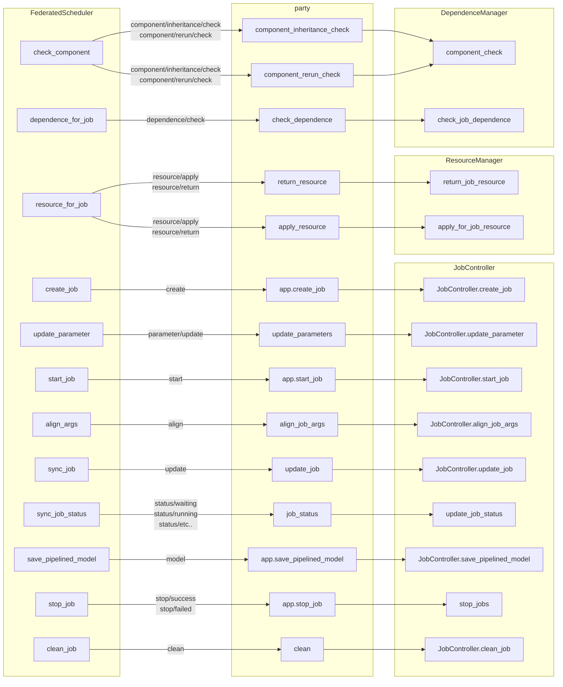
```mermaid
graph LR

subgraph party

app.create_job
update_parameters
apply_resource
return_resource
component_inheritance_check
component_rerun_check
check_dependence
app.start_job
align_job_args
update_job
job_status
app.save_pipelined_model
app.stop_job
clean

end

subgraph JobController

JobController.create_job
JobController.update_parameter
JobController.start_job
JobController.align_job_args
JobController.update_job
update_job_status
JobController.save_pipelined_model
stop_jobs
JobController.clean_job

end

subgraph ResourceManager

return_job_resource
apply_for_job_resource

end

subgraph  DependenceManager

component_check
check_job_dependence

end


subgraph FederatedScheduler

%% realtionship between FederatedScheduler and party
create_job-->|create|app.create_job
update_parameter-->|parameter/update|update_parameters
resource_for_job-->|resource/apply<br>resource/return|apply_resource
resource_for_job-->|resource/apply<br>resource/return|return_resource
check_component-->|component/inheritance/check<br>component/rerun/check|component_inheritance_check
check_component-->|component/inheritance/check<br>component/rerun/check|component_rerun_check
dependence_for_job-->|dependence/check|check_dependence
start_job-->|start|app.start_job
align_args-->|align|align_job_args
sync_job-->|update|update_job
sync_job_status-->|status/waiting<br>status/running<br>status/etc..|job_status
save_pipelined_model-->|model|app.save_pipelined_model
stop_job-->|stop/success<br>stop/failed|app.stop_job
clean_job-->|clean|clean

%% realtionship between party and JobController/ResourceManager/DependenceManager
app.create_job-->JobController.create_job
update_parameters-->JobController.update_parameter
apply_resource-->apply_for_job_resource
return_resource-->return_job_resource
component_inheritance_check-->component_check
component_rerun_check-->component_check
check_dependence-->check_job_dependence
app.start_job-->JobController.start_job
align_job_args-->JobController.align_job_args
update_job-->JobController.update_job
job_status-->update_job_status
app.save_pipelined_model-->JobController.save_pipelined_model
app.stop_job-->stop_jobs
clean-->JobController.clean_job

end

```
*注：Job相关的request_stop_job、request_rerun_job调用initiator_app*


##### 3.1.4.2 <span id="3.1.4.2">Task Commands</span>
文件fateflow/python/fate_flow/scheduling_apps/party_app.py中包含Task相关方法请求，其中task_job方法代码如下：
```python
@manager.route('/<job_id>/<component_name>/<task_id>/<task_version>/<role>/<party_id>/start', methods=['POST'])
@request_authority_certification(party_id_index=-2, role_index=-3, command='run')
def start_task(job_id, component_name, task_id, task_version, role, party_id):
    TaskController.start_task(job_id, component_name, task_id, task_version, role, party_id, **request.json)
    return get_json_result(retcode=0, retmsg='success')
```
分析上述代码：
- `start_task`方法提供的HTTP URL为`/<job_id>/<component_name>/<task_id>/<task_version>/<role>/<party_id>/start`,与上节[Job Command]()中的`endpiont`的结构相同，其中`start_task`对应的`<command>`为`start`
- 相比较`start_job`，`start_task`的HTTP URL增加了`<component_name>/<task_id>/<task_version>`三个参数`
- 调用`TaskController.start_task`方法


Task command相关方法和TaskController方法的关联关系如下：
<span id="G3-5">图3-5</span>

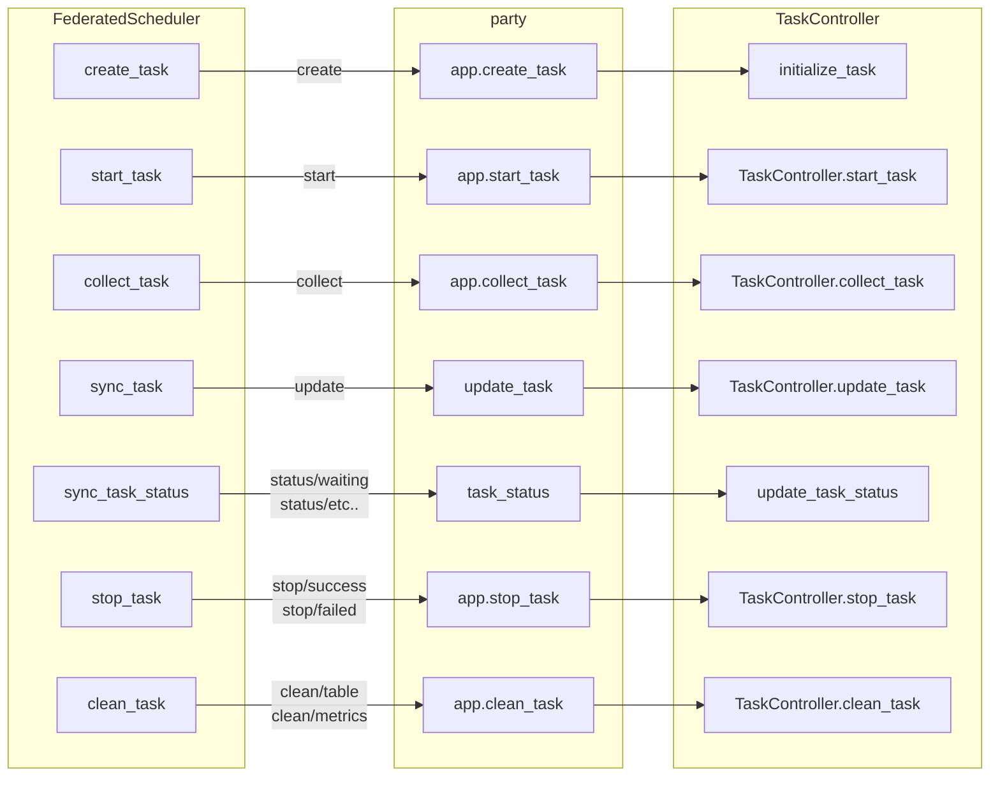
```mermaid
graph LR

subgraph party

app.create_task
app.start_task
app.collect_task
update_task
task_status
app.stop_task
app.clean_task

end


subgraph TaskController

initialize_task
TaskController.start_task
TaskController.collect_task
TaskController.update_task
update_task_status
TaskController.stop_task
TaskController.clean_task

end


subgraph FederatedScheduler

%% Realtionship between FederatedScheduler and party
create_task-->|create|app.create_task
start_task-->|start|app.start_task
collect_task-->|collect|app.collect_task
sync_task-->|update|update_task
sync_task_status-->|status/waiting<br>status/etc..|task_status
stop_task-->|stop/success<br>stop/failed|app.stop_task
clean_task-->|clean/table<br>clean/metrics|app.clean_task

%% Realtionship between party and TaskController

app.create_task-->initialize_task
app.start_task-->TaskController.start_task
app.collect_task-->TaskController.collect_task
update_task-->TaskController.update_task
task_status-->update_task_status
app.stop_task-->TaskController.stop_task
app.clean_task-->TaskController.clean_task


end

```

Task任务report相关的流程从TaskController发起，在返回到FederatedScheduler，再将请求传递给发起方的TaskController，其流程图如下:
<span id="G3-6">图3-6</span>

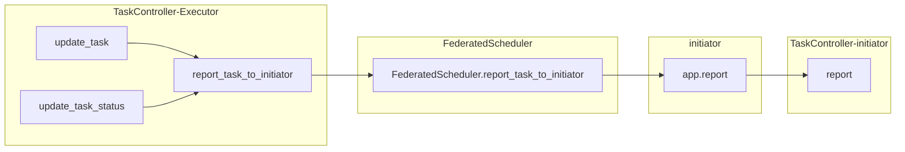
```mermaid
graph LR

subgraph initiator

app.report

end

subgraph TaskController-Executor

update_task-->report_task_to_initiator
update_task_status-->report_task_to_initiator

end


subgraph TaskController-initiator

report

end


subgraph FederatedScheduler

%% Realtionship between TaskController and FederatedScheduler
report_task_to_initiator-->FederatedScheduler.report_task_to_initiator

%% Realtionship between FederatedScheduler and initiator
FederatedScheduler.report_task_to_initiator-->app.report

%% Realtionship between initiator and TaskController
app.report-->report


end

```

### 3.2 <span id="3.2">Manager</span>

#### 3.2.1 <span id="3.2.1">ResourceManager</span>

资源指基础引擎资源，主要指计算引擎的CPU资源和内存资源，传输引擎的CPU资源和网络资源，目前仅支持计算引擎CPU资源的管理

同时当前版本未实现自动获取基础引擎的资源大小，因此你通过配置文件$FATE_PROJECT_BASE/conf/service_conf.yaml进行配置，也即当前引擎分配给FATE集群的资源大小

详情参加资源管理的[官方文档](https://fate-flow.readthedocs.io/en/latest/zh/fate_flow_resource_management/)

fate-flow启动的CPU资源定义在配置文件conf/service_conf.yaml中
```yaml
fate_on_standalone:
  standalone:
    cores_per_node: 20
    nodes: 1
fate_on_eggroll:
  clustermanager:
    cores_per_node: 16
    nodes: 1
  rollsite:
    host: 127.0.0.1
    port: 9370
fate_on_spark:
  spark:
    # default use SPARK_HOME environment variable
    home:
    cores_per_node: 20
    nodes: 2
```
上述配置中standalone、eggroll、spark三种不同执行引擎分配设置了的CPU资源数量包括：
- 每节点核心数`cores_per_node`
- 节点数`nodes`
- 总核心数为`cores_per_node*nodes`

而作业JOB默认使用的资源定义在配置文件fateflow/conf/job_default_config.yaml中
```yaml
# resource
total_cores_overweight_percent: 1  # 1 means no overweight
total_memory_overweight_percent: 1  # 1 means no overweight
task_parallelism: 1
task_cores: 4
task_memory: 0 # mb
max_cores_percent_per_job: 1  # 1 means total
```
经验证：
- `task_cores`是生效的，`task_core < cores_per_node*nodes`
  - 默认系统cores为20， 任务cores为4，正常执行
  - 调整参数当`task_core > cores_per_node*nodes`,资源参数检查错误
  - 调整参数当`cores_per_node*nodes/2 < task_core <= cores_per_node*nodes`,可提交作业JOB, 但是一直在等待中:`status == JobStatus.WAITING`
    ```sh
    2022-10-04 02:00:43Job is still waiting, time elapse: 0:04:38
    2022-10-04 02:01:45.951 | INFO     | pipeline.utils.invoker.job_submitter:monitor_job_status:144 -
    ```
  - 调整参数当`0 <= task_core <= cores_per_node*nodes/2`,可提交作业JOB并完成作业

- `task_memory`并未判断
- 系统使用的CPU资源仅通过配置，并未动态检测实际的系统资源


目前fate-flow实现的资源管理并未动态获取系统资源，并未真正的为作业分配系统CPU及内存资源，仅是一个内部的判断。
实现ResourceManager的类图如下：
<span id="C3-2">类图3-2</span>

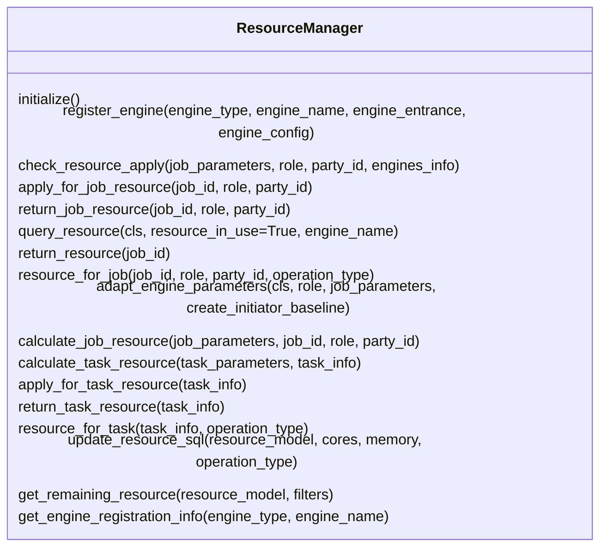
```mermaid
classDiagram

class ResourceManager {
    initialize()
    register_engine(engine_type, engine_name, engine_entrance, engine_config)
    check_resource_apply(job_parameters, role, party_id, engines_info)
    apply_for_job_resource(job_id, role, party_id)
    return_job_resource(job_id, role, party_id)
    query_resource(cls, resource_in_use=True, engine_name)
    return_resource(job_id)
    resource_for_job(job_id, role, party_id, operation_type)
    adapt_engine_parameters(cls, role, job_parameters, create_initiator_baseline)
    calculate_job_resource(job_parameters, job_id, role, party_id)
    calculate_task_resource(task_parameters, task_info)
    apply_for_task_resource(task_info)
    return_task_resource(task_info)
    resource_for_task(task_info, operation_type)
    update_resource_sql(resource_model, cores, memory, operation_type)
    get_remaining_resource(resource_model, filters)
    get_engine_registration_info(engine_type, engine_name)
}

```
类图中方法说明：
- 类`ResourceManager`中都为`@classmethod`类型方法
- 资源初始化相关方法。`initialize`及`register_engine`完成资源的初始化配置，将上述配置文件conf/service_conf.yaml的资源参数导入到数据库T_ENGINE_REGISTRY表中，表中记录示例如下：
   **表T_ENGINE_REGISTRY的资源记录**
   | f_engine_name | f_engine_name | f_engine_entrance | f_cores | f_remaining_cores | f_nodes |
   | :--- | :--- | :--- | ---: | ---: | ---: | 
   | computing | STANDALONE | fate_on_standalone | 20 | 20 | 1 |
   | computing | EGGROLL | fate_on_eggroll |16 | 16  | 1 |
   | computing | SPARK | fate_on_spark | 40 | 40 | 2 |
   | computing | LINKIS_SPARK | fate_on_spark |  40| 40 | 2 |
- 作业JOB分配回收资源相关方法。`apply_for_task_resource`， `return_task_resource`以及`resource_for_job`用于任务JOB资源的分配与回收。目前的实现每个任务所需的资源在上述配置文件fateflow/conf/job_default_config.yaml中定义。运行示例程序`python3 examples/pipeline/hetero_logistic_regression/pipeline-hetero-lr-normal.py`，完成作业的资源分配后T_ENGINE_REGISTRY表记录变更如下：
   **表T_ENGINE_REGISTRY的资源记录**
   | f_engine_name | f_engine_name | f_engine_entrance | f_cores | f_remaining_cores | f_nodes |
   | :--- | :--- | :--- | ---: | ---: | ---: | 
   | computing | STANDALONE | fate_on_standalone | 20 | 12 | 1 |
   | computing | EGGROLL | fate_on_eggroll |16 | 16  | 1 |
   | computing | SPARK | fate_on_spark | 40 | 40 | 2 |
   | computing | LINKIS_SPARK | fate_on_spark |  40| 40 | 2 |
   > 说明：STANDALONE引擎下，可用资源减少了8cores，分配给`pipeline-hetero-lr-normal.py`任务中的guest和host角色。
   
   而T_JOB表新增如下任务记录
   **表T_JOB的资源记录**
   | f_job_id | f_role | f_cores | f_remaining_cores | 
   | :--- | :--- | :--- | ---: |
   | 202210080016557485290 | arbiter | 0 | 0 |
   | 202210080016557485290 | host | 4 | 4  | 
   | 202210080016557485290 | guest | 4 | 4 | 
   > 说明
   1、guest和host上的作业JOB资源情况，`f_cores`、`f_remaining_cores`字段都为4cores的CPU资源
   2、其中`f_cores`表明作业分配到4cores资源3、而`f_remaining_cores`表明4cores资源可用，后续将分配给任务TASK。

- 任务JOB分配回收资源相关方法。`apply_for_job_resource`， `return_job_resource`以及`resource_for_task`用于任务JOB资源的分配与回收。完成任务的资源分配后T_JOB表记录变更如下：
   **表T_JOB的资源记录**
   | f_job_id | f_role | f_cores | f_remaining_cores | 
   | :--- | :--- | :--- | ---: | 
   | 202210080016557485290 | arbiter | 0 | 0 |
   | 202210080016557485290 | host | 4 | 0  | 
   | 202210080016557485290 | guest | 4 | 0 | 
   > 说明：
   1、guest和host上的作业JOB资源情况，`f_cores`仍为4cores资源，而`f_remaining_cores`为0，表明资源已分配给作业的任务中。
   2、当作业的中的一个任务执行完成后，会归还资源，`f_remaining_cores`变更为4，资源会继续分配给下一个任务

- 资源查询变更方法。`calculate_job_resource`, `get_remaining_resource`, `get_engine_registration_info`, `query_resource`以及`update_resource_sql`用于查询及变更表T_ENGINE_REGISTRY, T_JOB中资源记录。

- 存在问题。 host角色的分配和回收存在BUG，`f_remaining_cores`的值会递增。
   **表T_JOB的资源记录**
   | f_job_id | f_role | f_cores | f_remaining_cores | 
   | :--- | :--- | :--- | ---: |
   | 202210080016557485290 | arbiter | 0 | 0 |
   | 202210080016557485290 | host | 4 | 24  | 
   | 202210080016557485290 | guest | 4 | 4 | 
   > 说明
   执行完任务后，f_remaining_cores理论上为4，但实际上递增到24，`pipeline-hetero-lr-normal.py`中作业JOB包含了6个任务TASK。
  
文件fateflow/python/fate_flow/manager/resource_manager.py中作业资源分配回收的方法如下：
```python
@classmethod
@DB.connection_context()
def resource_for_job(cls, job_id, role, party_id, operation_type: ResourceOperation):
    operate_status = False
    engine_name, cores, memory = cls.calculate_job_resource(job_id=job_id, role=role, party_id=party_id)
    try:
        with DB.atomic():
            updates = {
                Job.f_engine_type: EngineType.COMPUTING,
                Job.f_engine_name: engine_name,
                Job.f_cores: cores,
                Job.f_memory: memory,
            }
            filters = [
                Job.f_job_id == job_id,
                Job.f_role == role,
                Job.f_party_id == party_id,
            ]
            if operation_type is ResourceOperation.APPLY:
                updates[Job.f_remaining_cores] = cores
                updates[Job.f_remaining_memory] = memory
                updates[Job.f_resource_in_use] = True
                updates[Job.f_apply_resource_time] = base_utils.current_timestamp()
                filters.append(Job.f_resource_in_use == False)
            elif operation_type is ResourceOperation.RETURN:
                updates[Job.f_resource_in_use] = False
                updates[Job.f_return_resource_time] = base_utils.current_timestamp()
                filters.append(Job.f_resource_in_use == True)
            operate = Job.update(updates).where(*filters)
            record_status = operate.execute() > 0
            if not record_status:
                raise RuntimeError(f"record job {job_id} resource {operation_type} failed on {role} {party_id}")

            if cores or memory:
                filters, updates = cls.update_resource_sql(resource_model=EngineRegistry,
                                                            cores=cores,
                                                            memory=memory,
                                                            operation_type=operation_type,
                                                            )
                filters.append(EngineRegistry.f_engine_type == EngineType.COMPUTING)
                filters.append(EngineRegistry.f_engine_name == engine_name)
                operate = EngineRegistry.update(updates).where(*filters)
                apply_status = operate.execute() > 0
            else:
                apply_status = True
            if not apply_status:
                raise RuntimeError(
                    f"update engine {engine_name} record for job {job_id} resource {operation_type} on {role} {party_id} failed")
        operate_status = True
    except Exception as e:
        schedule_logger(job_id).warning(e)
        schedule_logger(job_id).warning(
            f"{operation_type} job resource(cores {cores} memory {memory}) on {role} {party_id} failed")
        operate_status = False
    finally:
        remaining_cores, remaining_memory = cls.get_remaining_resource(EngineRegistry,
                                                                        [
                                                                            EngineRegistry.f_engine_type == EngineType.COMPUTING,
                                                                            EngineRegistry.f_engine_name == engine_name])
        operate_msg = "successfully" if operate_status else "failed"
        schedule_logger(job_id).info(
            f"{operation_type} job resource(cores {cores} memory {memory}) on {role} {party_id} {operate_msg}, remaining cores: {remaining_cores} remaining memory: {remaining_memory}")
        return operate_status

@classmethod
def update_resource_sql(cls, resource_model: typing.Union[EngineRegistry, Job], cores, memory, operation_type: ResourceOperation):
    if operation_type is ResourceOperation.APPLY:
        filters = [
            resource_model.f_remaining_cores >= cores,
            resource_model.f_remaining_memory >= memory
        ]
        updates = {resource_model.f_remaining_cores: resource_model.f_remaining_cores - cores,
                    resource_model.f_remaining_memory: resource_model.f_remaining_memory - memory}
    elif operation_type is ResourceOperation.RETURN:
        filters = []
        updates = {resource_model.f_remaining_cores: resource_model.f_remaining_cores + cores,
                    resource_model.f_remaining_memory: resource_model.f_remaining_memory + memory}
    else:
        raise RuntimeError(f"can not support {operation_type} resource operation type")
    return filters, updates

```
分析上述代码：
- 代码核心的逻辑是对T_JOB和T_ENGINE_REGISTRY表构建SQL语句，当`resource_model.f_remaining_cores >= cores`当可用资源大于等于申请分配资源时，分配并更改表中的资源记录。
- 资源的分配和任务执行所用的实际资源并无关联。


#### 3.2.2 <span id="3.2.2">DependenceManager</span>

文件fateflow/python/fate_flow/manager/dependence_manager.py中`DependenceManager`类图如下：

<span id="C3-3">类图3-3</span>

```mermaid
classDiagram

class DependenceManager {
    check_job_dependence(job)
    check_job_inherit_dependence(cls, job)
    component_check(job, check_type="inheritance")
    start_inheriting_job(job)
    check_spark_dependence(job)
    check_upload(job_id, provider_group, fate_flow_version_provider_info, storage_engine)
    upload_spark_dependence(job, upload_details, storage_engine)
    record_upload_process(provider, dependence_type, pid, storage_engine)
    kill_upload_process(version, storage_engine, dependence_type)
}

```
类图中方法说明：
- 类`DependenceManager`中都为`@classmethod`类型方法
- 其中`check_job_dependence`及`component_check`方法为party_app调用
- 其中`kill_upload_process`为Detector进程调用
- 其他方法为内部方法


#### 3.2.3 <span id="3.2.3">WorkManger</span>

文件fateflow/python/fate_flow/manager/worker_manager.py中, WorkerManager类图如下

<span id="C3-4">类图3-4</span>

```mermaid
classDiagram

class WorkerManager {
    start_general_worker(worker_name, job_id, role=, party_id, provider, initialized_config, run_in_subprocess, **kwargs)
    start_task_worker(worker_name, task, task_parameters, executable, extra_env, **kwargs)
    get_process_dirs(worker_name: WorkerName, job_id, role, party_id, task: Task = None)
    get_config(config_dir, config, log_dir)
    get_env(job_id, provider_info)
    cmd_to_func_kwargs(cls, cmd)
    save_worker_info(task: Task, worker_name: WorkerName, worker_id, **kwargs)
    kill_task_all_workers(cls, task: Task)
    kill_worker(worker_info: WorkerInfo)
}
```
类图`WorkerManager`方法中`start_general_worker`及`start_task_worker`为两个核心方法，其他方法类似`get_process_dirs`及`get_env`等为辅助配置方法：
- `start_general_worker`方法
- `start_task_worker`方法


`start_general_worker`方法的代码如下：
```python
@classmethod
def start_general_worker(cls, worker_name: WorkerName, job_id="", role="", party_id=0, provider: ComponentProvider = None,
                            initialized_config: dict = None, run_in_subprocess=True, **kwargs):
    if RuntimeConfig.DEBUG:
        run_in_subprocess = True
    participate = locals()
    worker_id, config_dir, log_dir = cls.get_process_dirs(worker_name=worker_name,
                                                            job_id=job_id,
                                                            role=role,
                                                            party_id=party_id)
    if worker_name in [WorkerName.PROVIDER_REGISTRAR, WorkerName.DEPENDENCE_UPLOAD]:
        if not provider:
            raise ValueError("no provider argument")
        config = {
            "provider": provider.to_dict()
        }
        if worker_name == WorkerName.PROVIDER_REGISTRAR:
            from fate_flow.worker.provider_registrar import ProviderRegistrar
            module = ProviderRegistrar
            module_file_path = sys.modules[ProviderRegistrar.__module__].__file__
            specific_cmd = []
        elif worker_name == WorkerName.DEPENDENCE_UPLOAD:
            from fate_flow.worker.dependence_upload import DependenceUpload
            module = DependenceUpload
            module_file_path = sys.modules[DependenceUpload.__module__].__file__
            specific_cmd = [
                '--dependence_type', kwargs.get("dependence_type")
            ]
        provider_info = provider.to_dict()
    elif worker_name is WorkerName.TASK_INITIALIZER:
        if not initialized_config:
            raise ValueError("no initialized_config argument")
        config = initialized_config
        job_conf = job_utils.save_using_job_conf(job_id=job_id,
                                                    role=role,
                                                    party_id=party_id,
                                                    config_dir=config_dir)

        from fate_flow.worker.task_initializer import TaskInitializer
        module = TaskInitializer
        module_file_path = sys.modules[TaskInitializer.__module__].__file__
        specific_cmd = [
            '--dsl', job_conf["dsl_path"],
            '--runtime_conf', job_conf["runtime_conf_path"],
            '--train_runtime_conf', job_conf["train_runtime_conf_path"],
            '--pipeline_dsl', job_conf["pipeline_dsl_path"],
        ]
        provider_info = initialized_config["provider"]
    else:
        raise Exception(f"not support {worker_name} worker")
    config_path, result_path = cls.get_config(config_dir=config_dir, config=config, log_dir=log_dir)

    process_cmd = [
        sys.executable or "python3",
        module_file_path,
        "--config", config_path,
        '--result', result_path,
        "--log_dir", log_dir,
        "--parent_log_dir", os.path.dirname(log_dir),
        "--worker_id", worker_id,
        "--run_ip", RuntimeConfig.JOB_SERVER_HOST,
        "--job_server", f"{RuntimeConfig.JOB_SERVER_HOST}:{RuntimeConfig.HTTP_PORT}",
    ]

    if job_id:
        process_cmd.extend([
            "--job_id", job_id,
            "--role", role,
            "--party_id", party_id,
        ])

    process_cmd.extend(specific_cmd)
    if run_in_subprocess:
        p = process_utils.run_subprocess(job_id=job_id, config_dir=config_dir, process_cmd=process_cmd,
                                            added_env=cls.get_env(job_id, provider_info), log_dir=log_dir,
                                            cwd_dir=config_dir, process_name=worker_name.value, process_id=worker_id)
        participate["pid"] = p.pid
        if job_id and role and party_id:
            logger = schedule_logger(job_id)
            msg = f"{worker_name} worker {worker_id} subprocess {p.pid}"
        else:
            logger = stat_logger
            msg = f"{worker_name} worker {worker_id} subprocess {p.pid}"
        logger.info(ready_log(msg=msg, role=role, party_id=party_id))

        # asynchronous
        if worker_name in [WorkerName.DEPENDENCE_UPLOAD]:
            if kwargs.get("callback") and kwargs.get("callback_param"):
                callback_param = {}
                participate.update(participate.get("kwargs", {}))
                for k, v in participate.items():
                    if k in kwargs.get("callback_param"):
                        callback_param[k] = v
                kwargs.get("callback")(**callback_param)
        else:
            try:
                p.wait(timeout=120)
                if p.returncode == 0:
                    logger.info(successful_log(msg=msg, role=role, party_id=party_id))
                else:
                    logger.info(failed_log(msg=msg, role=role, party_id=party_id))
                if p.returncode == 0:
                    return p.returncode, load_json_conf(result_path)
                else:
                    std_path = process_utils.get_std_path(log_dir=log_dir, process_name=worker_name.value, process_id=worker_id)
                    raise Exception(f"run error, please check logs: {std_path}, {log_dir}/INFO.log")
            except subprocess.TimeoutExpired as e:
                err = failed_log(msg=f"{msg} run timeout", role=role, party_id=party_id)
                logger.exception(err)
                raise Exception(err)
            finally:
                try:
                    p.kill()
                    p.poll()
                except Exception as e:
                    logger.exception(e)
    else:
        kwargs = cls.cmd_to_func_kwargs(process_cmd)
        code, message, result = module().run(**kwargs)
        if code == 0:
            return code, result
        else:
            raise Exception(message)

```
上述代码分析如下：
- `start_general_worker`方法处理三种通用的情况，由`worker_name: WorkerName`定义，包括：
  - `WorkerName.TASK_INITIALIZER = "task_initializer"`
  - `WorkerName.PROVIDER_REGISTRAR = "provider_registrar"`
  - `WorkerName.DEPENDENCE_UPLOAD = "dependence_upload"`
- 当`WorkName == WorkerName.TASK_INITIALIZER`时, 执行python子进程, 目标文件为fateflow/python/fate_flow/worker/task_initializer.py的`TaskInitializer().run()`, 并处理子进程的返回数据
- 当`WorkName == WorkerName.PROVIDER_REGISTRAR`时, 执行python子进程, 目标文件中fateflow/python/fate_flow/worker/provider_registrar.py的`ProviderRegistrar().run()`
- 当`WorkName == WorkerName.DEPENDENCE_UPLOAD`时, 执行python子进程, 目标文件为fateflow/python/fate_flow/worker/dependence_upload.py的的`DependenceUpload().run()`
- `start_general_worker`使用两种方法执行worker: 
  - python子进程, `process_utils.run_subprocess`方法执行python子进程
  - 进程内调用`TaskInitializer.run方法`
- 类`DependenceUpload`, `ProviderRegistrar`, `TaskInitializer`详见3.5节[Worker](#3.5)


`start_task_worker`方法的代码如下：
```python
@classmethod
def start_task_worker(cls, worker_name, task: Task, task_parameters: RunParameters = None,
                        executable: list = None, extra_env: dict = None, **kwargs):
    worker_id, config_dir, log_dir = cls.get_process_dirs(worker_name=worker_name,
                                                            job_id=task.f_job_id,
                                                            role=task.f_role,
                                                            party_id=task.f_party_id,
                                                            task=task)

    session_id = job_utils.generate_session_id(task.f_task_id, task.f_task_version, task.f_role, task.f_party_id)
    federation_session_id = job_utils.generate_task_version_id(task.f_task_id, task.f_task_version)

    info_kwargs = {}
    specific_cmd = []
    if worker_name is WorkerName.TASK_EXECUTOR:
        from fate_flow.worker.task_executor import TaskExecutor
        module_file_path = sys.modules[TaskExecutor.__module__].__file__
    else:
        raise Exception(f"not support {worker_name} worker")

    if task_parameters is None:
        task_parameters = RunParameters(**job_utils.get_job_parameters(task.f_job_id, task.f_role, task.f_party_id))

    config = task_parameters.to_dict()
    config["src_user"] = kwargs.get("src_user")
    config_path, result_path = cls.get_config(config_dir=config_dir, config=config, log_dir=log_dir)

    if executable:
        process_cmd = executable
    else:
        process_cmd = [sys.executable or "python3"]

    common_cmd = [
        module_file_path,
        "--job_id", task.f_job_id,
        "--component_name", task.f_component_name,
        "--task_id", task.f_task_id,
        "--task_version", task.f_task_version,
        "--role", task.f_role,
        "--party_id", task.f_party_id,
        "--config", config_path,
        '--result', result_path,
        "--log_dir", log_dir,
        "--parent_log_dir", os.path.dirname(log_dir),
        "--worker_id", worker_id,
        "--run_ip", RuntimeConfig.JOB_SERVER_HOST,
        "--job_server", f"{RuntimeConfig.JOB_SERVER_HOST}:{RuntimeConfig.HTTP_PORT}",
        "--session_id", session_id,
        "--federation_session_id", federation_session_id,
    ]
    process_cmd.extend(common_cmd)
    process_cmd.extend(specific_cmd)
    env = cls.get_env(task.f_job_id, task.f_provider_info)
    if extra_env:
        env.update(extra_env)
    schedule_logger(task.f_job_id).info(
        f"task {task.f_task_id} {task.f_task_version} on {task.f_role} {task.f_party_id} {worker_name} worker subprocess is ready")
    p = process_utils.run_subprocess(job_id=task.f_job_id, config_dir=config_dir, process_cmd=process_cmd,
                                        added_env=env, log_dir=log_dir, cwd_dir=config_dir, process_name=worker_name.value,
                                        process_id=worker_id)
    cls.save_worker_info(task=task, worker_name=worker_name, worker_id=worker_id, run_ip=RuntimeConfig.JOB_SERVER_HOST, run_pid=p.pid, config=config, cmd=process_cmd, **info_kwargs)
    return {"run_pid": p.pid, "worker_id": worker_id, "cmd": process_cmd}

```
上述代码分析如下：
- `start_task_worker`方法`WorkerName.TASK_EXECUTOR`的情况。执行python子进程, 目标文件为fateflow/python/fate_flow/worker/task_executor.py


### 3.3 <span id="3.3">Controllers</span>


#### 3.3.1 <span id="3.3.1">JobController</span>

文件fateflow/python/fate_flow/controller/job_controller.py中`JobController`类图如下：

<span id="C3-4">类图3-4</span>

```mermaid
classDiagram

class JobController {
    create_job(job_id, role, party_id, job_info)
    set_federated_mode(job_parameters: RunParameters)
    set_engines(job_parameters: RunParameters, engine_type)
    create_common_job_parameters(job_id, initiator_role, common_job_parameters: RunParameters)
    create_job_parameters_on_party(role, party_id, job_parameters: RunParameters)
    fill_party_specific_parameters(role, party_id, job_parameters: RunParameters)
    fill_default_job_parameters(job_id, job_parameters: RunParameters)
    adapt_job_parameters(role, job_parameters: RunParameters, create_initiator_baseline=False)
    get_job_engines_address(job_parameters: RunParameters)
    check_parameters(job_parameters: RunParameters, role, party_id, engines_info)
    gen_updated_parameters(job_id, initiator_role, initiator_party_id, input_job_parameters, input_component_parameters)
    merge_update(inputs: dict, results: dict)
    update_parameter(job_id, role, party_id, updated_parameters: dict)
    initialize_task(role, party_id, task_info: dict)
    initialize_tasks(job_id, role, party_id, run_on_this_party, initiator_role, initiator_party_id, job_parameters: RunParameters = None, dsl_parser, components: list = None, **kwargs)
    initialize_task_holder_for_scheduling(role, party_id, components, common_task_info, provider_info)
    initialize_job_tracker(job_id, role, party_id, job_parameters: RunParameters, roles, is_initiator, dsl_parser)
    get_dataset(is_initiator, role, party_id, roles, job_args)
    query_job_input_args(input_data, role, party_id)
    align_job_args(job_id, role, party_id, job_info)
    start_job(job_id, role, party_id, extra_info)
    update_job(job_info)
    update_job_status(job_info)
    stop_jobs(job_id, stop_status, role, party_id)
    stop_job(job, stop_status)
    save_pipelined_model(job_id, role, party_id)
    clean_job(job_id, role, party_id, roles)
    job_reload(job)
    load_source_target_tasks(job)
    load_tasks(component_list, job_id, role, party_id)
    load_task_tracker(tasks: dict)
    log_reload(job)
    output_reload(job, source_tasks: dict, target_tasks: dict)
    status_reload(job, source_tasks, target_tasks)
    output_model_reload(job, source_job)
    checkpoint_reload(job, source_job)
}

```
类图中方法说明：
- 提供类方法供`DAGScheduler`方法调用, 包括如下方法: 
  - create_common_job_parameters
  - initialize_tasks
  - gen_updated_parameters
- 提供类方法供`FederatedScheduler`方法的http/grpc远程调用，详见`FederatedScheduler`方法的[Job Command](#)
- 以及配置相关内部方法，供`JobController`类自身调用，包括
  - create_job_parameters_on_party
  - set_federated_mode
  - set_engines
  - fill_default_job_parameters
  - fill_party_specific_parameters
  - adapt_job_parameters
  - get_job_engines_address
  - check_parameters
  - merge_update
  - get_dataset

`JobController`类中的核心方法如下：

##### 3.3.1.1 <span id="3.3.1.1">create_job</span>

文件fateflow/python/fate_flow/controller/job_controller.py中create_job方法的代码如下：

```python
@classmethod
def create_job(cls, job_id, role, party_id, job_info):
    # parse job configuration
    dsl = job_info['dsl']
    runtime_conf = job_info['runtime_conf']
    train_runtime_conf = job_info['train_runtime_conf']
    if USE_AUTHENTICATION:
        authentication_check(src_role=job_info.get('src_role', None), src_party_id=job_info.get('src_party_id', None),
                                dsl=dsl, runtime_conf=runtime_conf, role=role, party_id=party_id)

    dsl_parser = schedule_utils.get_job_dsl_parser(dsl=dsl,
                                                    runtime_conf=runtime_conf,
                                                    train_runtime_conf=train_runtime_conf)
    job_parameters = dsl_parser.get_job_parameters(runtime_conf)
    schedule_logger(job_id).info('job parameters:{}'.format(job_parameters))
    dest_user = job_parameters.get(role, {}).get(party_id, {}).get('user', '')
    user = {}
    src_party_id = int(job_info['src_party_id']) if job_info.get('src_party_id') else 0
    src_role = job_info.get('src_role', '')
    src_user = job_parameters.get(src_role, {}).get(src_party_id, {}).get('user', '') if src_role else ''
    for _role, party_id_item in job_parameters.items():
        user[_role] = {}
        for _party_id, _parameters in party_id_item.items():
            user[_role][_party_id] = _parameters.get("user", "")
    schedule_logger(job_id).info('job user:{}'.format(user))
    if USE_DATA_AUTHENTICATION:
        job_args = dsl_parser.get_args_input()
        schedule_logger(job_id).info('job args:{}'.format(job_args))
        dataset_dict = cls.get_dataset(False, role, party_id, runtime_conf.get("role"), job_args)
        dataset_list = []
        if dataset_dict.get(role, {}).get(party_id):
            for k, v in dataset_dict[role][party_id].items():
                dataset_list.append({"namespace": v.split('.')[0], "table_name": v.split('.')[1]})
        data_authentication_check(src_role=job_info.get('src_role'), src_party_id=job_info.get('src_party_id'),
                                    src_user=src_user, dest_user=dest_user, dataset_list=dataset_list)
    job_parameters = RunParameters(**job_parameters.get(role, {}).get(party_id, {}))

    # save new job into db
    if role == job_info["initiator_role"] and party_id == job_info["initiator_party_id"]:
        is_initiator = True
    else:
        is_initiator = False
    job_info["status"] = JobStatus.READY
    job_info["user_id"] = dest_user
    job_info["src_user"] = src_user
    job_info["user"] = user
    # this party configuration
    job_info["role"] = role
    job_info["party_id"] = party_id
    job_info["is_initiator"] = is_initiator
    job_info["progress"] = 0
    cls.create_job_parameters_on_party(role=role, party_id=party_id, job_parameters=job_parameters)
    # update job parameters on party
    job_info["runtime_conf_on_party"]["job_parameters"] = job_parameters.to_dict()
    JobSaver.create_job(job_info=job_info)
    schedule_logger(job_id).info("start initialize tasks")
    initialized_result, provider_group = cls.initialize_tasks(job_id=job_id, role=role, party_id=party_id, run_on_this_party=True,
                                                                initiator_role=job_info["initiator_role"], initiator_party_id=job_info["initiator_party_id"], job_parameters=job_parameters, dsl_parser=dsl_parser)
    schedule_logger(job_id).info("initialize tasks success")
    for provider_key, group_info in provider_group.items():
        for cpn in group_info["components"]:
            dsl["components"][cpn]["provider"] = provider_key

    roles = job_info['roles']
    cls.initialize_job_tracker(job_id=job_id, role=role, party_id=party_id,
                                job_parameters=job_parameters, roles=roles, is_initiator=is_initiator, dsl_parser=dsl_parser)

    job_utils.save_job_conf(job_id=job_id,
                            role=role,
                            party_id=party_id,
                            dsl=dsl,
                            runtime_conf=runtime_conf,
                            runtime_conf_on_party=job_info["runtime_conf_on_party"],
                            train_runtime_conf=train_runtime_conf,
                            pipeline_dsl=None)
    return {"components": initialized_result}

```
上述代码分析如下：
- 从`dict`类型`job_info`变量中获取`dsl`及`runtime_conf`，调用`schedule_utils.get_job_dsl_parser`方法，获取到`Class DSLParserV2`的实例变量`dsl_parser`
- 按角色生成作业JOB的`job_info`变量中`runtime_conf_on_party`以及其他字典信息
- 将`dict`类型job_info`变量存储到数据库表T_JOB中，每个角色生成一条记录
- 作业JOB的角色包括arbiter, guest以及host
- 调用`cls.initialize_tasks`及`cls.initialize_job_tracker`@classmethod类型方法


##### 3.3.1.2 <span id="3.3.1.2">start_job</span>

文件fateflow/python/fate_flow/controller/job_controller.py中start_job方法的代码如下：

```python
@classmethod
def start_job(cls, job_id, role, party_id, extra_info=None):
    schedule_logger(job_id).info(
        f"try to start job on {role} {party_id}")
    job_info = {
        "job_id": job_id,
        "role": role,
        "party_id": party_id,
        "status": JobStatus.RUNNING,
        "start_time": current_timestamp()
    }
    if extra_info:
        schedule_logger(job_id).info(f"extra info: {extra_info}")
        job_info.update(extra_info)
    cls.update_job_status(job_info=job_info)
    cls.update_job(job_info=job_info)
    schedule_logger(job_id).info(
        f"start job on {role} {party_id} successfully")

@classmethod
def update_job(cls, job_info):
    """
    Save to local database
    :param job_info:
    :return:
    """
    return JobSaver.update_job(job_info=job_info)
```
上述代码分析如下：
- `start_job`, `update_job`仅更改任务的状态，并更新到数据库中
- `start_job`, `update_job`的调用关系见上节


##### 3.3.1.3 <span id="3.3.1.3">initialize_task</span>

文件fateflow/python/fate_flow/controller/job_controller.py中initialize_task方法的代码如下：

```python
@classmethod
def initialize_task(cls, role, party_id, task_info: dict):
    task_info["role"] = role
    task_info["party_id"] = party_id
    initialized_result, provider_group = cls.initialize_tasks(components=[task_info["component_name"]], **task_info)
    return initialized_result

@classmethod
def initialize_tasks(cls, job_id, role, party_id, run_on_this_party, initiator_role, initiator_party_id, job_parameters: RunParameters = None, dsl_parser=None, components: list = None, **kwargs):
    common_task_info = {}
    common_task_info["job_id"] = job_id
    common_task_info["initiator_role"] = initiator_role
    common_task_info["initiator_party_id"] = initiator_party_id
    common_task_info["role"] = role
    common_task_info["party_id"] = party_id
    common_task_info["run_on_this_party"] = run_on_this_party
    common_task_info["federated_mode"] = kwargs.get("federated_mode", job_parameters.federated_mode if job_parameters else None)
    common_task_info["federated_status_collect_type"] = kwargs.get("federated_status_collect_type", job_parameters.federated_status_collect_type if job_parameters else None)
    common_task_info["auto_retries"] = kwargs.get("auto_retries", job_parameters.auto_retries if job_parameters else None)
    common_task_info["auto_retry_delay"] = kwargs.get("auto_retry_delay", job_parameters.auto_retry_delay if job_parameters else None)
    common_task_info["task_version"] = kwargs.get("task_version")
    if dsl_parser is None:
        dsl_parser = schedule_utils.get_job_dsl_parser_by_job_id(job_id)
    provider_group = ProviderManager.get_job_provider_group(dsl_parser=dsl_parser,
                                                            components=components)
    initialized_result = {}
    for group_key, group_info in provider_group.items():
        initialized_config = {}
        initialized_config.update(group_info)
        initialized_config["common_task_info"] = common_task_info
        if run_on_this_party:
            code, _result = WorkerManager.start_general_worker(worker_name=WorkerName.TASK_INITIALIZER,
                                                                job_id=job_id,
                                                                role=role,
                                                                party_id=party_id,
                                                                initialized_config=initialized_config,
                                                                run_in_subprocess=False if initialized_config["if_default_provider"] else True)
            initialized_result.update(_result)
        else:
            cls.initialize_task_holder_for_scheduling(role=role,
                                                        party_id=party_id,
                                                        components=initialized_config["components"],
                                                        common_task_info=common_task_info,
                                                        provider_info=initialized_config["provider"])
    return initialized_result, provider_group

@classmethod
def initialize_task_holder_for_scheduling(cls, role, party_id, components, common_task_info, provider_info):
    for component_name in components:
        task_info = {}
        task_info.update(common_task_info)
        task_info["component_name"] = component_name
        task_info["component_module"] = ""
        task_info["provider_info"] = provider_info
        task_info["component_parameters"] = {}
        TaskController.create_task(role=role, party_id=party_id,
                                    run_on_this_party=common_task_info["run_on_this_party"],
                                    task_info=task_info)
```
上述代码分析如下：
- 执行`provider_group = ProviderManager.get_job_provider_group(...)`包含如下族件
  1. fate_flow@version，包括name, path, class_path等参数配置，提供reader,update等DSL能力
  2. fate@version, 包括name, path, class_path等参数配置。其中path设置了python/federatedml的安装路径，Task运行时需要引用到federatedml中的算法组件。提供federatedml中联邦计算的能力组件，包括Dataform， Evaluation， 
  3. provider是提供Task能力的功能组件，
- 若`run_on_this_party=true`，执行`WorkerManager.start_general_worker`方法，进而执行`python3 fateflow/python/fate_flow/worker/task_initializer.py`， 调用`ProviderManager`获取各role执行任务TASK, 生成Task记录并保存到T_TASK表中。例如执行example`python3 examples/pipeline/hetero_logistic_regression/pipeline-hetero-lr-normal.py`，各角色的执行任务TASK的结果如下：
  **各角色执行任务表**  
  | task | arbiter need_run | host need_run | guest need_run | 
  | :--- | ---: | ---: | ---: | 
  | reader_0 | False | True | True | 
  | data_transform_0 | False | True | True | 
  | intersection_0 | False | True | True | 
  | hetero_lr_0 | True | True | True | 
  | evaluation_0 | True | True | True | 
若`run_on_this_party=false`，执行`TaskController.create_task`方法, 生成Task记录并保存到T_TASK表中。

<span id="G3-7">图3-7</span>

```mermaid
graph LR

subgraph party

app.initialize_task

end

subgraph DAGScheduler

submit

end

subgraph TaskScheduler

create_new_version_task

end

subgraph JobController

submit-->|run_on_this_party=Flase|initialize_tasks
create_new_version_task-->|run_on_this_party=Flase|initialize_tasks

create_job-->|run_on_this_party=True|initialize_tasks
initialize_tasks-->run_on_this_party{run_on_this_party?}

run_on_this_party-->|False|initialize_task_holder_for_scheduling

app.initialize_task-->initialize_task
initialize_task-->initialize_tasks


end

subgraph TaskController

initialize_task_holder_for_scheduling-->create_task

end

subgraph WorkerManager

run_on_this_party-->|True|start_general_worker
start_general_worker-->| |TaskInitializer.run
TaskInitializer.run-->create_task

end

```


#### 3.3.2 <span id="3.3.2">TaskController</span>

文件fateflow/python/fate_flow/controller/task_controller.py中`TaskController`类图如下：

<span id="C3-5">图3-5</span>

```mermaid
classDiagram

class TaskController {
    create_task(role, party_id, run_on_this_party, task_info)
    start_task(job_id, component_name, task_id, task_version, role, party_id, **kwargs)
    update_task(task_info)
    update_task_status(task_info)
    report_task_to_initiator(task_info)
    collect_task(job_id, component_name, task_id, task_version, role, party_id)
    stop_task(task, stop_status)
    kill_task(task: Task)
    clean_task(job_id, task_id, task_version, role, party_id, content_type)
}

```
类图中方法说明：
- `create_task`, 在数据库表T_TASK中增加任务TASK记录，为后续的任务执行记录任务的参数及状态
- `start_task`, 通过构造联邦计算的引擎Engine，间接调用`TaskExecutor`执行任务
- `update_task`及`update_task_status`, 更改TASK数据库状态，并调用`report_task_to_initiator`， 通知任务发起者
- `report_task_to_initiator`， 通知任务发起者。其流程详见[图3-6](#G3-6)
- `collect_task`, 
- `stop_task`调用`kill_task`方法，中止任务进程，并`update_task`及`update_task_status`, 更改TASK数据库状态

其中核心的`start_task`方法，代码如下：
```python
@classmethod
def start_task(cls, job_id, component_name, task_id, task_version, role, party_id, **kwargs):
    """
    Start task, update status and party status
    :param job_id:
    :param component_name:
    :param task_id:
    :param task_version:
    :param role:
    :param party_id:
    :return:
    """
    job_dsl = job_utils.get_job_dsl(job_id, role, party_id)
    PrivilegeAuth.authentication_component(job_dsl, src_party_id=kwargs.get('src_party_id'), src_role=kwargs.get('src_role'),
                                            party_id=party_id, component_name=component_name)

    schedule_logger(job_id).info(
        f"try to start task {task_id} {task_version} on {role} {party_id} executor subprocess")
    task_executor_process_start_status = False
    task_info = {
        "job_id": job_id,
        "task_id": task_id,
        "task_version": task_version,
        "role": role,
        "party_id": party_id,
    }
    is_failed = False
    try:
        task = JobSaver.query_task(task_id=task_id, task_version=task_version, role=role, party_id=party_id)[0]
        run_parameters_dict = job_utils.get_job_parameters(job_id, role, party_id)
        run_parameters_dict["src_user"] = kwargs.get("src_user")
        run_parameters = RunParameters(**run_parameters_dict)

        config_dir = job_utils.get_task_directory(job_id, role, party_id, component_name, task_id, task_version)
        os.makedirs(config_dir, exist_ok=True)

        run_parameters_path = os.path.join(config_dir, 'task_parameters.json')
        with open(run_parameters_path, 'w') as fw:
            fw.write(json_dumps(run_parameters_dict))

        schedule_logger(job_id).info(f"use computing engine {run_parameters.computing_engine}")
        task_info["engine_conf"] = {"computing_engine": run_parameters.computing_engine}
        backend_engine = build_engine(run_parameters. )
        run_info = backend_engine.run(task=task,
                                        run_parameters=run_parameters,
                                        run_parameters_path=run_parameters_path,
                                        config_dir=config_dir,
                                        log_dir=job_utils.get_job_log_directory(job_id, role, party_id, component_name),
                                        cwd_dir=job_utils.get_job_directory(job_id, role, party_id, component_name),
                                        user_name=kwargs.get("user_id"))
        task_info.update(run_info)
        task_info["start_time"] = current_timestamp()
        task_executor_process_start_status = True
    except Exception as e:
        schedule_logger(job_id).exception(e)
        is_failed = True
    finally:
        try:
            cls.update_task(task_info=task_info)
            task_info["party_status"] = TaskStatus.RUNNING
            cls.update_task_status(task_info=task_info)
            if is_failed:
                task_info["party_status"] = TaskStatus.FAILED
                cls.update_task_status(task_info=task_info)
        except Exception as e:
            schedule_logger(job_id).exception(e)
        schedule_logger(job_id).info(
            "task {} {} on {} {} executor subprocess start {}".format(task_id, task_version, role, party_id, "success" if task_executor_process_start_status else "failed"))

def build_engine(computing_engine):
    if not computing_engine:
        return None
    if computing_engine in {ComputingEngine.EGGROLL, ComputingEngine.STANDALONE}:
        engine_session = EggrollEngine()
    elif computing_engine == ComputingEngine.SPARK:
        engine_session = SparkEngine()
    elif computing_engine == ComputingEngine.LINKIS_SPARK:
        engine_session = LinkisSparkEngine()
    else:
        raise ValueError(f"{computing_engine} is not supported")
    return engine_session
```
上述代码分析如下：
- `start_task`方法实例化`backend_engine = build_engine(run_parameters.computing_engine)`引擎，并调用引擎`backend_engine.run(task=task,...)`执行任务。
- `build_engine`方法中，包含三类引擎分别为
  - `EggrollEngine`, 启动python3子进程subprocess，执行任务
  - `SparkEngine`, 启动pyspark子进程subprocess，执行任务
  - `LinkisSparkEngine`，将构造任务执行脚本，并发送到远程Spark引擎中

`start_task`方法的调用关系图如下：

```mermaid
graph TB

subgraph party

app.start_task

end

subgraph DAGScheduler

schedule_running_job

end

subgraph FederatedScheduler

FederatedScheduler.start_task

end

subgraph TaskScheduler
schedule_running_job-->schedule
schedule-->TaskScheduler.start_task
TaskScheduler.start_task-->FederatedScheduler.start_task
FederatedScheduler.start_task-.->|http to arbiter|app.start_task
FederatedScheduler.start_task-.->|http to guest|app.start_task
FederatedScheduler.start_task-.->|http to host|app.start_task

end


subgraph TaskController

app.start_task-->start_task
start_task-->build_engine
end

subgraph WorkManager

build_engine-->EggrollEngine.run
EggrollEngine.run-->start_task_worker

end

subgraph TaskExecutor

start_task_worker-.->|subprocess|TaskExecutor.run
TaskExecutor.run-->run_object.run

end

```
上述流程图中：
- `run_object`实质上为文件python/federatedml/model_base.py中`ModelBase`类的各子类。例如执行example`python3 examples/pipeline/hetero_logistic_regression/pipeline-hetero-lr-normal.py`中`hetero_lr_0`任务时，根据不同的角色，`run_object`分别为下列类的实例：
  - `HeteroLRGuest`， 当角色为guest时
  - `HeteroLRHost`， 当角色为host时
  - `HeteroLRArbiter`， 当角色为Arbiter时
  - 详情定义在文件python/federatedml/components/hetero_lr.py中


### 3.4 <span id="3.4">Flask Application</span>


### 3.5 <span id="3.5">Worker</span>

#### 3.5.1 <span id="3.5.1">Worker的类层次结构</span>


```mermaid
classDiagram

class BaseWorker {
    run(self, **kwargs)
    def _run(self)
    _handle_exception(self)
    get_args(self, **kwargs)
}

class DependenceUpload {
    _run(self)
    upload_dependencies_to_hadoop()
    zip_dir()
    zip_write()
    copy_dir()
    move_dir()
    rewrite_pyvenv_cfg()
}

class JobInherit {
    _run(self)
}

class ProviderRegistrar{
    _run(self)
}

class TaskInitializer {
    _run(self)
}

class BaseTaskWorker {
    _run(self)
    _run_(self)
    _handle_exception(self)
    report_task_info_to_driver(self)
    request_data_exchange_proxy()
}

class TaskExecutor {
    _run_(self)
    log_output_data_table_tracker()
    get_job_args_on_party()
    get_task_run_args()
    monkey_patch()
}

DependenceUpload --|> BaseWorker : 继承 Inheritance
JobInherit --|> BaseWorker : 继承 Inheritance
ProviderRegistrar --|> BaseWorker : 继承 Inheritance
TaskInitializer --|> BaseWorker : 继承 Inheritance
BaseTaskWorker --|> BaseWorker : 继承 Inheritance
TaskExecutor --|> BaseTaskWorker : 继承 Inheritance

```
上述类图中，Worker类的实现子类包括：
- `DependenceUpload`, 仅`DependenceManager.upload_spark_dependence`调用此方法。
- `JobInherit`, 仅`DependenceManager.start_inheriting_job`调用此方法。`JobInherit`类代码如下：
   ```python
   class JobInherit(BaseWorker):
        def _run(self):
        job = JobSaver.query_job(job_id=self.args.job_id, role=self.args.role, party_id=self.args.party_id)[0]
        try:
            JobController.job_reload(job)
        except Exception as e:
            traceback.print_exc()
            JobSaver.update_job(job_info={"job_id": job.f_job_id, "role": job.f_role, "party_id": job.f_party_id,
                                          "inheritance_status": JobInheritanceStatus.FAILED})
            LOGGER.exception(e)


   if __name__ == '__main__':
   JobInherit().run()
   ```
- 


#### 3.5.2 <span id="3.5.2">TaskExecutor</span>

文件fateflow/python/fate_flow/worker/task_executor.py中`_run_(self)`方法代码如下：


### 3.6 <span id="3.6">Component</span>

#### 3.6.1 <span id="3.6.1">ComponentInput</span>
```mermaid
classDiagram

class ComponentInput {
    tracker : TrackerClient,
    checkpoint_manager,
    task_version_id,
    parameters,
    datasets,
    models,
    caches,
    job_parameters,
    roles,
    flow_feeded_parameters
}

class CheckpointManager {
    job_id
    role
    party_id
    model_id
    model_version
    party_model_id
    component_name
    module_name = component_module_name
    task_id
    task_version
    job_parameters:RunParameters
    directory
    checkpoints = deque(maxlen=max_to_keep)
}

class RunParameters{
    job_type = "train"
    inheritance_info
    computing_engine
    federation_engine
    storage_engine
    engines_address
    federated_mode
    federation_info
    task_cores
    task_parallelism
    computing_partitions
    federated_status_collect_type
    federated_data_exchange_type
    model_id
    model_version
    dsl_version
    auto_retries
    auto_retry_delay
    timeout
    eggroll_run
    spark_run
    rabbitmq_run
    pulsar_run
    adaptation_parameters
    assistant_role
    map_table_name
    map_namespace
}

class TrackerClient {
    job_id
    role
    party_id
    model_id
    model_version
    component_name
    component_module_name
    task_id
    task_version
    job_parameters
    job_tracker : Tracker
}

class Tracker {
    job_id
    job_parameters
    role
    party_id
    component_name
    module_name = component_module_name
    task_id
    task_version
    model_id
    party_model_id
    model_version
    pipelined_model
    metric_manager
}


ComponentInput ..> TrackerClient : 依赖 dependency
ComponentInput ..> CheckpointManager : 依赖 dependency

CheckpointManager ..> RunParameters : 依赖 dependency

TrackerClient ..> Tracker : 依赖 dependency

```


## 附录A <span id="A">Code counter</span>

### <span id="A.1">A.1 FATE code counter</span>
Total : 3727 files,  356695 codes, 121950 comments, 62379 blanks, all 541024 lines


**Table 1 ： Code Statitics by Languages**
| language | files | code | comment | blank | total |
| :--- | ---: | ---: | ---: | ---: | ---: |
| Python | 1,702 | 143,505 | 38,857 | 33,320 | 215,682 |
| JSON | 659 | 68,356 | 0 | 187 | 68,543 |
| CSS | 96 | 40,220 | 68,830 | 2,531 | 111,581 |
| Markdown | 324 | 37,776 | 667 | 14,261 | 52,704 |
| JavaScript | 205 | 19,494 | 4,505 | 1,769 | 25,768 |
| Java | 190 | 13,964 | 3,646 | 3,639 | 21,249 |
| Scala | 123 | 13,344 | 2,742 | 2,851 | 18,937 |
| SCSS | 109 | 7,220 | 1,215 | 1,535 | 9,970 |
| Shell Script | 53 | 3,365 | 645 | 686 | 4,696 |
| YAML | 91 | 2,761 | 124 | 196 | 3,081 |
| Protocol Buffers | 67 | 2,451 | 0 | 451 | 2,902 |
| XML | 48 | 1,672 | 262 | 229 | 2,163 |
| reStructuredText | 4 | 588 | 6 | 297 | 891 |
| Lua | 7 | 535 | 117 | 86 | 738 |
| SQL | 8 | 420 | 42 | 98 | 560 |
| Docker | 16 | 302 | 136 | 120 | 558 |
| HTML | 6 | 233 | 15 | 30 | 278 |
| Properties | 8 | 220 | 61 | 59 | 340 |
| C++ | 4 | 148 | 76 | 25 | 249 |
| pip requirements | 6 | 110 | 4 | 8 | 122 |
| Ini | 1 | 11 | 0 | 1 | 12 |


### <span id="A.2">A.2 Secureflow code counter</span>

Total : 216 files,  18236 codes, 5200 comments, 3470 blanks, all 26906 lines

**Table 2 ： Code Statitics by Languages**
| language | files | code | comment | blank | total |
| :--- | ---: | ---: | ---: | ---: | ---: |
| Python | 186 | 14,719 | 5,099 | 3,021 | 22,839 |
| XML | 4 | 2,125 | 0 | 4 | 2,129 |
| Ini | 1 | 527 | 0 | 149 | 676 |
| Markdown | 9 | 382 | 0 | 135 | 517 |
| C++ | 5 | 338 | 79 | 102 | 519 |
| reStructuredText | 5 | 103 | 21 | 52 | 176 |
| pip requirements | 2 | 20 | 0 | 2 | 22 |
| YAML | 1 | 10 | 0 | 4 | 14 |
| Shell Script | 2 | 9 | 1 | 1 | 11 |
| CSS | 1 | 3 | 0 | 0 | 3 |

### <span id="A.3">A.3 Code comparison between FATE and Secureflow</span>

**Table 3 ： Code comparison**
| Item | FATE | SecureFlow |
| :--- | ---: | ---: | 
| Files | 3,727 | 216 |
| Python | 215,682 | 22,839 |
| JSON | 68,543 | 0 |
| Markdown | 52,704 | 517 |
| JavaScript | 25,768 | 0 |
| Java | 21,249 | 0 |
| Scala | 18,937 | 0 |
| C++ | 0 | 519 |
| **Total** | **541,024** | **26,906** |


## <span id="B">B 其他</span>
### <span id="B.1">B.1 UML示例</span>
```mermaid
classDiagram
Cycle --|> Sharp : 继承 Inheritance

ServiceImpl ..|> ServiceInterface : 实现 Realization

Company "1" *-- "n" Department : 组合 Composition

Car o-- Tire : 聚合 Aggregation

Student "1" --> "n" Course : 关联 Association

UserService ..> UserDao : 依赖 Dependency
```
