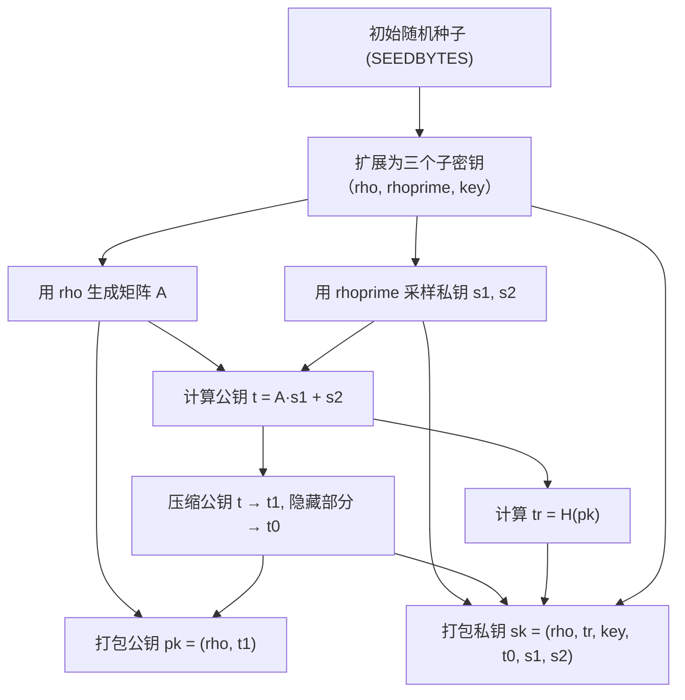
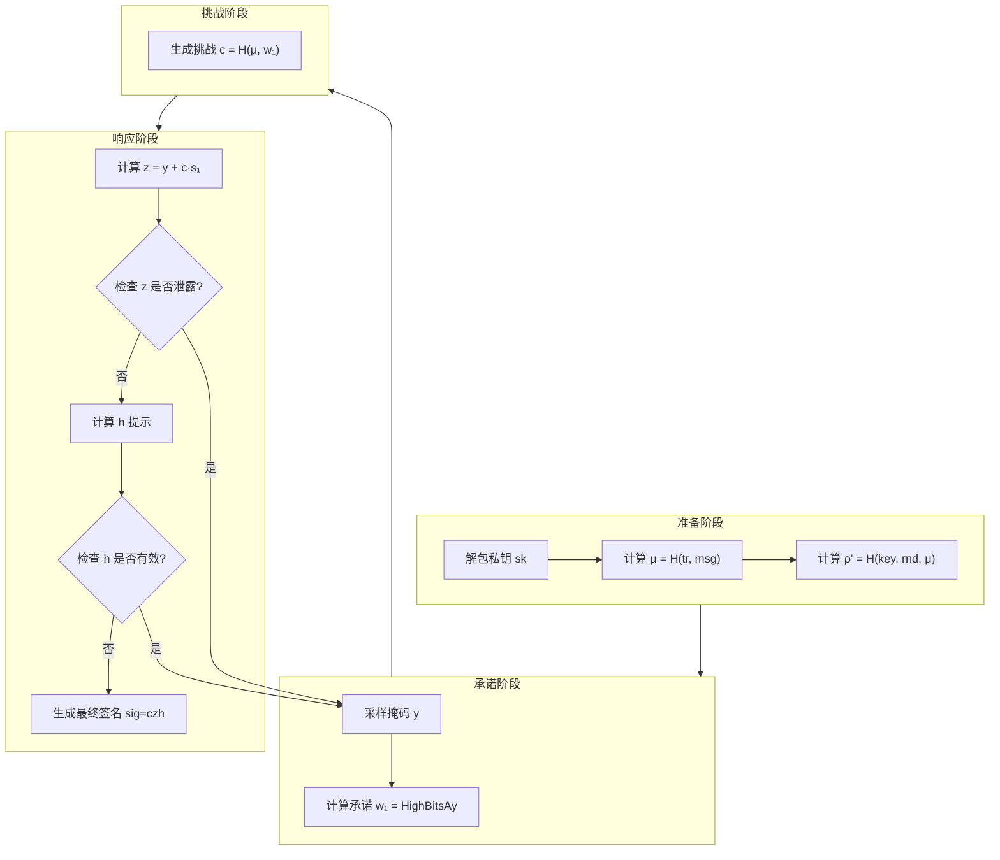

<font size="8"><strong>Dilithium</strong></font>
<font size="6.5"><strong>A Progammer's Perspective</strong></font>

[toc]

# 1. Dilithium 概述


## sign.c

### Dilithium 密钥生成
crypto_sign_keypair 方法



方法代码分步解释
1. 获取并扩展随机性，从一个较短的真正随机数 (SEEDBYTES，通常32字节) 扩展出密码学安全且足够长的随机字节流，用于后续所有步骤。
    ```c
    uint8_t seedbuf[2*SEEDBYTES + CRHBYTES];
    randombytes(seedbuf, SEEDBYTES); // 1. 获取初始随机性
    seedbuf[SEEDBYTES+0] = K;        // 2. 掺入算法参数K, L（域分离）
    seedbuf[SEEDBYTES+1] = L;
    shake256(seedbuf, 2*SEEDBYTES + CRHBYTES, seedbuf, SEEDBYTES+2); // 3. 扩展

    // 4. 分割出三个子密钥
    rho = seedbuf;                   // 矩阵生成种子
    rhoprime = rho + SEEDBYTES;      // 私钥采样种子
    key = rhoprime + CRHBYTES;       // 签名随机化种子
    ```
    - $randombytes(seedbuf, SEEDBYTES)$: 从系统随机源获取初始熵。
    - 域分离 (Domain Separation)：将算法参数 K 和 L（定义多项式向量的维度）混入种子。这确保了即使其他部分相同，为不同参数生成的密钥也是完全独立且安全的。
    - shake256(输出, 输出长度, 输入, 输入长度): 使用 SHAKE256 这个可扩展输出函数 (XOF) 进行扩展。它接收输入缓冲区 (seedbuf 的前 SEEDBYTES+2 字节)，并输出指定长度 ($2*SEEDBYTES + CRHBYTES$) 的数据，直接写回覆盖 seedbuf。这是一个高效且安全的确定性随机性扩展过程。
    - 将扩展后的缓冲区 seedbuf 逻辑上分割为三个部分，作为三个不同用途的种子。

2. 扩展矩阵 A，公开种子 $\rho$ 确定性地生成一个 $K\times L$ 的多项式矩阵 A，矩阵中的每个多项式系数都均匀分布在环 $R_q$ 上。
    ```c
    polyvec_matrix_expand(mat, rho);
    ```
    - 内部通过调用 $shake256$ 或类似的 $XOF$，以 $\rho$ 为种子，生成足够多的随机字节，然后将这些字节转换为多项式系数。
    - 这是 MLWE 问题的公共矩阵，是密码系统的基础。相同的 $\rho$ 总是生成相同的矩阵 A。

3. 采样私钥向量 s1 和 s2，使用种子 $\rho'$ 采样得到私钥向量 s1 (长度为 L) 和 s2 (长度为 K)。
    ```c
    polyvecl_uniform_eta(&s1, rhoprime, 0);
    polyveck_uniform_eta(&s2, rhoprime, L);
    ```
    - uniform_eta 表示从中心二项分布 (Centered Binomial Distribution) 中采样，参数为 η。这个分布的值集中在 0 附近（小值），这是格密码“错误”或“噪声”的来源，也使得私钥是“短”向量。
    - 使用不同的 nonce 参数 (0 和 L) 来调用同一个函数，确保即使使用相同的种子 $\rho'$，也会生成两个统计独立的向量 s1 和 s2（即从两个不同的随机流中采样）。

4. 计算公钥 t， 执行 MLWE 的核心运算 $t = A * s1 + s2$。
    ```c
    s1hat = s1;
    polyvecl_ntt(&s1hat); // 将 s1 转换到 NTT 域
    polyvec_matrix_pointwise_montgomery(&t1, mat, &s1hat); // t1 = A ◦ s1hat (NTT 域乘法)
    polyveck_reduce(&t1); // 规约
    polyveck_invntt_tomont(&t1); // 将结果转换回常规域

    polyveck_add(&t1, &t1, &s2); // t1 = A*s1 + s2
    ```
    - 数论变换 (NTT)：多项式乘法在常规域是 O(n²) 复杂度，而在 NTT 域是 O(n) 的点乘。这是一种极其重要的性能优化手段。
      - 将向量 s1 转换到 NTT 域。
      - 在 NTT 域中执行矩阵 A 和向量 s1hat 的点乘（注意：矩阵 A 通常在生成时就已经以 NTT 形式存储）。
      - 将结果转换回常规域。
    - 蒙哥马利约减 (Montgomery Reduction)：一种高效的大数模约减算法。
    - 最后加上错误向量 s2，得到未压缩的公钥 t。

5. 压缩公钥并打包，减小公钥尺寸。
    ```c
    polyveck_caddq(&t1); // 确保所有系数在 [0, Q-1] 范围内
    polyveck_power2round(&t1, &t0, &t1); // 将 t 分解为高位 t1 和低位 t0

    pack_pk(pk, rho, &t1); // 公钥 pk = (rho, t1)
    ```
    - power2round(t, &t1, &t0)：将多项式的每个系数 t_i 分解为 t_i = t1_i * 2^d + t0_i。其中 t1_i 是高位有效位，被放入公钥；t0_i 是低位，需要保留在私钥中用于正确签名。解压时，人们只能用 t1_i 来近似 t_i，而不知道 t0_i，这增加了问题的难度，是安全性的一部分。

6. 计算跟踪哈希 tr 并打包私钥，生成最终密钥对。
    ```c
    shake256(tr, TRBYTES, pk, CRYPTO_PUBLICKEYBYTES); // tr = H(pk)
    pack_sk(sk, rho, tr, key, &t0, &s1, &s2); // 打包私钥
    ```
    - tr (跟踪哈希)：是公钥 pk 的哈希值。在签名时，它会和消息一起被哈希，将签名协议绑定到这一对特定的密钥，防止恶意公钥替换攻击。
    - 私钥 sk 包含:
      - rho: 用于重建矩阵 A。
      - tr: 用于签名。
      - key: 用于签名过程中生成随机性（在 crypto_sign_signature 中）。
      - t0: 公钥 t 的隐藏低位部分，解密或签名时需用到。
      - s1, s2: 核心的私钥短向量。


### Dilithium 签名
crypto_sign_signature_internal 方法



1. 解包私钥与初始化，从输入的私钥 sk 中恢复出所有必要的组件。
    ```c
    unpack_sk(rho, tr, key, &t0, &s1, &s2, sk);
    ```
    - rho: 用于之后重新生成公共矩阵 A。
    - tr: 公钥的哈希（“跟踪器”），用于将签名绑定到这个特定密钥。
    - key: 一个秘密种子，用于生成签名所需的随机性。
    - t0, s1, s2: 核心私钥材料。

2. 计算一个代表被签名消息（和公钥）的哈希值 μ。
    ```c
    shake256_init(&state);
    shake256_absorb(&state, tr, TRBYTES);  // 绑定到公钥
    shake256_absorb(&state, pre, prelen);  // 可能的前缀（用于域分离）
    shake256_absorb(&state, m, mlen);      // 吸收消息本身
    shake256_finalize(&state);
    shake256_squeeze(mu, CRHBYTES, &state); // μ = H(tr, pre, m)
    ```
    - 将 tr 包含在内是至关重要的，它可以防止恶意公钥替换攻击。即使攻击者能为一对(消息, 公钥)获取一个有效签名，他也无法将这个签名转移到另一对不同的(消息, 公钥)上。

3. 生成随机性种子 ρ‘ (rhoprime)，生成一个确定性的、但对旁观者来说是随机的种子 ρ‘，用于后续采样。
    ```c
    shake256_init(&state);
    shake256_absorb(&state, key, SEEDBYTES); // 私钥中的秘密种子
    shake256_absorb(&state, rnd, RNDBYTES);  // 外部提供的随机数（可选）
    shake256_absorb(&state, mu, CRHBYTES);   // 上一步的消息摘要
    shake256_finalize(&state);
    shake256_squeeze(rhoprime, CRHBYTES, &state); // ρ' = H(key, rnd, μ)
    ```
    - 使用 key 确保了只有私钥持有者才能产生相同的 ρ‘ 流。
    - 掺入外部随机数 rnd 可以进一步增强随机性（在某些模式下）。
    - 掺入 μ 将这次签名的随机性绑定到了特定的消息上。
    - 这是FS启发式的核心：ρ‘ 的生成模拟了交互协议中 verifier 发送随机挑战的过程，但这里是用哈希函数基于消息和已有信息“虚拟地”生成这个挑战。

4. 准备矩阵和NTT变换，为后续高效的多项式运算做准备。
    ```c
    polyvec_matrix_expand(mat, rho); // 从 ρ 重新生成矩阵 A
    polyvecl_ntt(&s1);               // 将私钥 s1 转换到 NTT 域
    polyveck_ntt(&s2);               // 将私钥 s2 转换到 NTT 域
    polyveck_ntt(&t0);               // 将 t0 转换到 NTT 域
    ```
    - 矩阵 A 必须从存储的 rho 确定性重新生成，而不是存储整个矩阵，这极大地节省了私钥存储空间。
    - 将 s1, s2, t0 转换到 NTT 域，是为了后续在 NTT 域中进行快速的点乘运算。

5. 采样掩码向量 y 并计算承诺 w，生成一个临时秘密 y（称为“掩码”），并计算其对应的承诺 w = A * y。 y 需要从一个比 s1 大得多的区间（参数 γ1）中采样，以隐藏私钥。
    ```c
    rej: // 拒绝采样标签
    polyvecl_uniform_gamma1(&y, rhoprime, nonce++); // 从较大区间采样 y
    z = y;
    polyvecl_ntt(&z);
    polyvec_matrix_pointwise_montgomery(&w1, mat, &z); // w = A ◦ y (NTT域)
    polyveck_reduce(&w1);
    polyveck_invntt_tomont(&w1);                      // w = A * y (常规域)
    polyveck_caddq(&w1);
    polyveck_decompose(&w1, &w0, &w1);                // w -> HighBits(w1), LowBits(w0)
    polyveck_pack_w1(sig, &w1);                       // 将 w1 打包到 sig 缓冲区    
    ```
    - nonce 是一个计数器，如果采样被拒绝，它可以确保下次循环使用 ρ‘ 流中的新部分来生成不同的 y。
    - Decompose 操作将 w 分解为高位 w1（将被发送作为承诺）和低位 w0（暂时保留）。

6. 生成挑战 c，模拟交互协议中 verifier 发送随机挑战 c 的步骤。
    ```c
    shake256_init(&state);
    shake256_absorb(&state, mu, CRHBYTES);               // 吸收消息摘要 μ
    shake256_absorb(&state, sig, K*POLYW1_PACKEDBYTES); // 吸收承诺 w1
    shake256_finalize(&state);
    shake256_squeeze(sig, CTILDEBYTES, &state);          // 输出哈希到签名缓冲区
    poly_challenge(&cp, sig);                            // 将哈希值解释为多项式 c
    poly_ntt(&cp);                                       // 将挑战 c 转换到 NTT 域 
    ```
    - 这是 Fiat-Shamir 启发式的另一个关键应用：对消息 μ 和承诺 w1 进行哈希，生成一个短多项式 c（其系数为 {-1, 0, 1}）。c 的稀疏性是其安全性的重要组成部分。
    - 任何对 (m, w1) 的修改都会产生一个完全不同的挑战 c，这使得签名不可伪造。

7. 计算响应 z 并检查其安全性（第一次拒绝，计算响应 z，并确保它不会泄露私钥 s1 的信息。
    ```c
    polyvecl_pointwise_poly_montgomery(&z, &cp, &s1); // z = c ◦ s1 (NTT域)
    polyvecl_invntt_tomont(&z);                       // z = c * s1 (常规域)
    polyvecl_add(&z, &z, &y);                         // z = c*s1 + y
    polyvecl_reduce(&z);
    if(polyvecl_chknorm(&z, GAMMA1 - BETA))           // 检查 z 的范数是否过大
        goto rej;  
    ```
    - 理想的响应是 z = y + c*s1。验证者之后可以计算 A*z - c*t = A*y + c*A*s1 - c*(A*s1 + s2) = A*y - c*s2，并检查其结果是否“很小”。
    - 拒绝采样：如果 z 的任何一个系数绝对值过大（超过 γ1 - β），它可能会泄露 s1 的信息（因为 y 已知，z - y = c*s1）。为了保护 s1，必须丢弃这个 z 并回到 rej 标签处用新的 y 重试。这是签名过程中可能循环的主要原因。

8. 计算并检查 w0 的安全性（第二次拒绝），验证在减去 c*s2 后，之前计算的 w0（即 Ay 的低位）是否仍然很小。
    ```c
    polyveck_pointwise_poly_montgomery(&h, &cp, &s2); // h = c ◦ s2 (NTT域)
    polyveck_invntt_tomont(&h);                       // h = c * s2 (常规域)
    polyveck_sub(&w0, &w0, &h);                       // w0 = w0 - c*s2
    polyveck_reduce(&w0);
    if(polyveck_chknorm(&w0, GAMMA2 - BETA))          // 检查 w0 的范数是否过大
        goto rej;
    ```
    - 在验证时， verifier 将独立计算 w' = A*z - c*t。由于 t = A*s1 + s2，所以 w' = A*(y + c*s1) - c*(A*s1 + s2) = A*y - c*s2。
    - A*y 我们之前分解为了 w1*2^d + w0。所以 w' = (w1*2^d + w0) - c*s2。
    - 为了让 verifier 能从 w' 中正确恢复出 w1（这是验证的核心），w0 - c*s2 这一项必须足够小。如果它的范数太大， verifier 的恢复可能会失败，导致签名无效，因此必须拒绝并重试。

9. 生成提示并检查其大小（第三次拒绝），生成一个“提示” h，帮助 verifier 在不知道 t0 的情况下，从 A*z - c*t1*2^d 中正确恢复出 w1。
    ```c
    polyveck_pointwise_poly_montgomery(&h, &cp, &t0); // h = c ◦ t0 (NTT域)
    polyveck_invntt_tomont(&h);                       // h = c * t0 (常规域)
    polyveck_reduce(&h);
    if(polyveck_chknorm(&h, GAMMA2))                  // 检查 c*t0 的范数是否过大
        goto rej;

    polyveck_add(&w0, &w0, &h);                       // w0 = (w0 - c*s2) + c*t0
    n = polyveck_make_hint(&h, &w0, &w1);             // 生成提示 h，使得 w1 = UseHint(h, w0 + c*t0)
    if(n > OMEGA)                                     // 检查提示 h 中“1”的数量是否过多
        goto rej;
    ```
    - 因为公钥只包含 t1（t 的高位），而 t = t1*2^d + t0。所以 verifier 实际计算的是 A*z - c*t1*2^d = (A*y - c*s2) + c*t0 = w‘ + c*t0。
    - make_hint 函数的作用是：生成一个比特向量 h，指示 verifier 在哪个系数上需要进行“四舍五入”校正，才能从 w‘ + c*t0 中得到正确的 w1。
    - 拒绝采样：如果提示 h 中“1”的数量超过了一个预设的阈值 OMEGA，意味着这个提示太大了，会导致签名尺寸膨胀，因此需要拒绝并重试。

10. 打包最终签名，组装最终签名。
    ```c
    pack_sig(sig, sig, &z, &h); // 签名 sig = (压缩的挑战 c, 响应 z, 提示 h)
    *siglen = CRYPTO_BYTES;
    return 0;
    ```
    - 签名包含三个部分：
      - c: 挑战哈希（很短，因为它是稀疏的）。
      - z: 响应，证明签名者知道 s1。
     - h: 提示，帮助验证者校正由于公钥压缩带来的误差。
    - 在计算过程中，sig 缓冲区被临时用来存储 w1 和 c，最后被覆盖为最终的签名数据。
