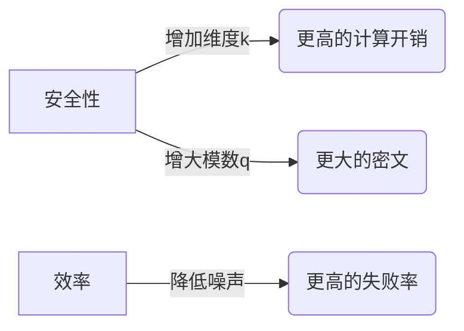
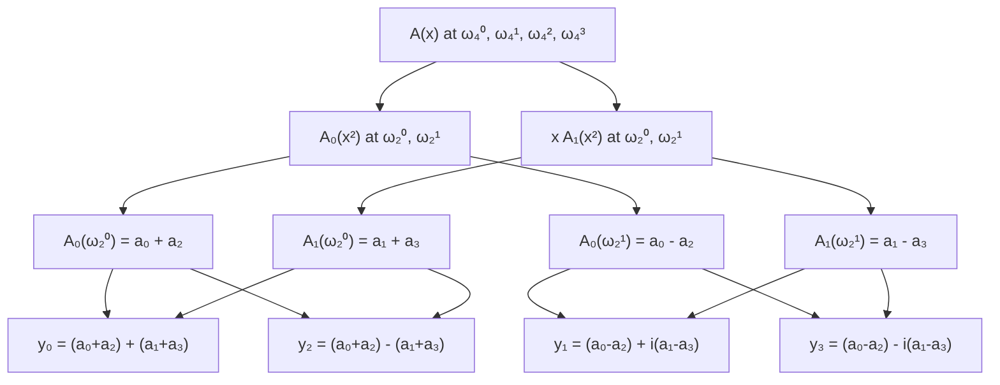
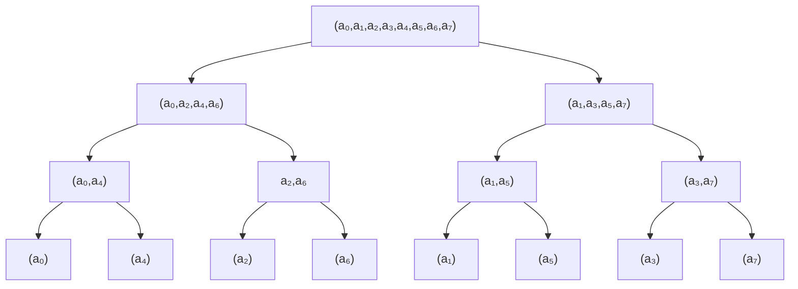

<font size="8"><strong>Kyber</strong></font>
<font size="6.5"><strong>A Progammer's Perspective</strong></font>

[toc]

# 1. Kyber 概述

Kyber 是一种基于格的 **后量子密码学（PQC）** 公钥加密方案，作为 **CRYSTALS（Cryptographic Suite for Algebraic Lattices）** 套件的组成部分，其完整名称为 **CRYSTALS-Kyber**。该算法被 NIST 选为后量子密码标准化算法之一，其核心基于 Module Learning With Errors (MLWE) 问题，具有抗量子计算的特性。

## 1.1. 参数设定

Kyber 有不同的安全级别（如 Kyber-512、Kyber-768、Kyber-1024），主要参数包括：
- 多项式环：\( R_q = \mathbb{Z}_q[X]/(X^n + 1) \)（通常 \( n=256 \), \( q=3329 \)）。
- 向量维度：\( k \)（如 Kyber-512 中 \( k=2 \)）。
- 噪声分布：中心二项分布（用于生成小系数误差）。

## 1.2. 密钥生成（KeyGen）

- **私钥（sk）**：随机生成一个小的向量 \( \mathbf{s} \in R_q^k \)，系数从噪声分布中采样。
- **公钥（pk）**：
  1. 生成随机矩阵 \( \mathbf{A} \in R_q^{k \times k} \)（通常通过哈希函数从种子扩展）。
  2. 生成小的噪声向量 \( \mathbf{e} \in R_q^k \)。
  3. 计算 \( \mathbf{t} = \mathbf{A} \mathbf{s} + \mathbf{e} \in R_q^k \)。
- 输出：公钥 \( pk = (\mathbf{t}, \text{seed}_{\mathbf{A}}) \)，私钥 \( sk = \mathbf{s} \)。

## 1.3. 加密（Encrypt）

输入：公钥 \( pk \)、明文消息 \( m \)（编码为环元素）。  
步骤：
1. 将明文 \( m \) 编码为多项式 \( \hat{m} \in R_q \)（例如，通过二进制编码或冗余编码）。
2. 生成随机小的向量 \( \mathbf{r} \in R_q^k \)（系数从噪声分布采样）。
3. 从种子恢复矩阵 \( \mathbf{A} \)。
4. 计算密文的两个部分：
   - \( \mathbf{u} = \mathbf{A}^T \mathbf{r} + \mathbf{e}_1 \in R_q^k \)（线性部分）。
   - \( v = \mathbf{t}^T \mathbf{r} + e_2 + \hat{m} \cdot \lfloor q/2 \rfloor \in R_q \)（非线性部分，含明文）。
5. 输出密文 \( ct = (\mathbf{u}, v) \)。

## 1.4. 解密（Decrypt）

输入：私钥 \( sk = \mathbf{s} \)、密文 \( ct = (\mathbf{u}, v) \)。  
步骤：
1. 计算 \( w = v - \mathbf{s}^T \mathbf{u} \in R_q \)。
2. 解码 \( w \)：
   - 比较 \( w \) 的系数与 \( \lfloor q/2 \rfloor \) 的接近程度：
     - 若系数接近 \( 0 \)，解码为 \( 0 \)。
     - 若系数接近 \( \lfloor q/2 \rfloor \)，解码为 \( 1 \)。
3. 输出明文 \( m \)。


---

# 2. 用初等数学理解Kyber

## 2.1. mini-Kyber
我们可以用一个“玩具级”的迷你Kyber来直观理解这个加密算法。甚至可以拿纸笔手动完成整个加密解密过程：
- 将标准中庞大的 256 次多项式数学参数压缩到小学生也能计算 4 次多项式
- 将标准中复杂的噪声分布换成-1/0/1这样的简单数字
- 将标准中多项式中 3329 模数压缩到 17，即所有多项式的系数范围为 0 到 16

虽然这个玩具版一秒钟就能被破解，但它像X光片一样，能让你直接看到“格密码”的骨架结构——如何用矩阵乘法混合密钥和噪声，又如何通过巧妙的数学设计让合法用户能去除噪声还原信息，而攻击者只能面对一团乱麻。这种简化就像用透明机箱的示教模型，牺牲了安全性，但换来了对算法核心原理的“肉眼可见”的理解。

### 2.1.1 mini-Kyber 参数设置

| 参数 | 维度 | 模数 | 模块维度 | η | 私钥 | 公钥 | 乘法
|---|--:|--:|--:|:-:|--:|--:|---|
| **Mini Kyber** | 4 | 17 | 2 | {-1,0,1} |16B | 32B | 普通乘法
| **Kyber-512**  |256| 3329 | 2 | 中心二项分布 | 736B | 736B | NTT加速


### 2.1.2 密钥生成

#### 2.1.2.1 参数设置
- 多项式环：$R_{17} = \mathbb{Z}_{17}[x]/(x^4+1)$
- 明文空间：$\{0,1\}^4$ (如 [1, 0, 1, 0])
- 中心二项分布：系数从 $\{-1,0,1\}$ 随机选取
- 矩阵A系数在 $\{0,1,...,16\}$ 随机选取

#### 2.1.2.2. 生成私钥 s
$$
\mathbf{s} = \begin{bmatrix}
s_1 =& 0x^3 + x^2 - x + 1  &= [1,-1,1,0] \\
s_2 =& -x^3 + 0x^2 + x + 0 &= [0,1,0,-1]
\end{bmatrix}
$$
私钥 **s** 是符合**模块维度**为 2 的 $2\times 1$ 的二维矩阵，矩阵中的每个元素是一个多项式环。
- 私钥多项式环的系数符合 $\eta=1$ 的中心二项分布，因此系数的范围为 $\{-1,0,1\}$
- 多项环的次数 n = 4，模 $x^4 + 1$, 因此次数的范围为 [0, 3]

#### 2.1.2.3. 生成公钥矩阵 A
$$
\mathbf{A} = \begin{bmatrix}
A_{11} = 11x^3 + 6x^2 + 15x + 8 & A_{12} = 5x^3 + 13x^2 + 9x + 2 \\
A_{21} = 7x^3 + 4x^2 + 12x + 1 & A_{22} = 14x^3 + 3x^2 + 10x + 16 
\end{bmatrix}
$$
矩阵 **A** 是符合**模块维度**为 2 的 $2\times 2$ 的二维矩阵，矩阵中的每个元素是一个多项式环， 多项式环上的系数和次数要求同私钥 **s**。
- 公钥矩阵 A 的系数模 q = 17, 因此其系数的范围为 [0, 16]
- 多项环的次数 n = 4，模 $x^4 + 1$, 因此次数的范围为 [0, 3]

#### 2.1.2.4. 噪声向量 e
$$
\mathbf{e} = \begin{bmatrix} x^2 - x \\ 0 \end{bmatrix} = \begin{bmatrix} [0,1,-1,0] \\ [0,0,0,0] \end{bmatrix}
$$
- 噪声向量的系数符合 $\eta=1$ 的中心二项分布，因此系数的范围为 $\{-1,0,1\}$
- 多项环的次数 n = 4

#### 2.1.2.5. 计算 t = As + e

##### 2.1.2.5.1 计算 $\mathbf{t}_{\text{noiseless}} = \mathbf{As}$

首先计算第一分量 $t_1$
$$
\begin{aligned}
&(11x^3+6x^2+15x+8)(x^2 - x + 1) \\
&+ (5x^3+13x^2+9x+2)(-x^3 + x) \\
&= 11x^5 - 11x^4 + 11x^3 \\
&\quad + 6x^4 - 6x^3 + 6x^2 \\
&\quad + 15x^3 - 15x^2 + 15x \\
&\quad + 8x^2 - 8x + 8 \\
& -5x^6 + 5x^4 \\
&\quad -13x^5 + 13x^3 \\
&\quad -9x^4 + 9x^2 \\
&\quad -2x^3 + 2x \\
&\equiv \textcolor{magenta}{-5x^6} + \textcolor{magenta}{-2x^5} + \textcolor{magenta}{-9x^4} + 31x^3 + 8x^2 + 9x + 8\\
&\equiv \textcolor{green}{5x^2} + \textcolor{green}{2x} + \textcolor{green}{9} + 31x^3 + 8x^2 + 9x + 8\\
&\equiv 31x^3 + 13x^2 + 11x + 17\\
&\equiv 14x^3 + 13x^2 + 11x + 0 \quad (\text{mod } x^4+1, \text{mod }17)
\end{aligned}
$$

多项式环包含**两个模操作**：
- 系数模操作，例如 $31 \equiv 14 \bmod 17$
- 次数模操作，例如 $-5x^6 \equiv -5x^2(x^4+1) + 5x^2 \equiv 5x^2 (\bmod x^4+1)$

第二分量 $t_2$ 同第一分量计算过程，得到 $t_2$：
$$
\begin{aligned}
&(7x^3+4x^2+12x+1)(x^2 - x + 1) \\
&+ (14x^3+3x^2+10x+16)(-x^3 + x) \\
&\equiv 2x^3 + 0x^2 + 6x + 0 \quad (\text{mod } x^4+1, \text{mod }17)
\end{aligned}
$$

得到无噪声结果结果 $\mathbf{t}_{\text{noiseless}}$
$$
\mathbf{t}_{\text{noiseless}} = \begin{bmatrix}
14x^3 + 13x^2 + 11x + 0  \\
2x^3 + 0x^2 + 6x + 0
\end{bmatrix}
$$

##### 2.1.2.5.2 计算 t = $\mathbf{t}_{\text{noiseless}}$ + e

通过下列的公式，计算
$$
\mathbf{t} = \mathbf{A} \cdot \mathbf{s} + \mathbf{e} = \mathbf{t}_{\text{noiseless}} + \begin{bmatrix} x^2 - x \\ 0 \end{bmatrix}
$$

得到最终的公钥 t
$$
\mathbf{t} = \begin{bmatrix}
14x^3 + 14x^2 + 10x + 0  \\
2x^3 + 0x^2 + 6x + 0
\end{bmatrix}
$$


### 2.1.3. 加密流程

#### 2.1.3.1. 参数定义

**明文**
$$
m = 1x^3 + 0x^2 + 1x + 1 = [1,1,0,1] \\
\text{放大：} \lfloor 17/2 \rceil \cdot m = 9x^3 + 9x + 9
$$

**随机向量 r**
$$
\mathbf{r} = (-x^3 + x^2, x^3 + x^2 - 1)
$$

**误差 e1**
$$
\mathbf{e_1} = (x^2 + x, x^2)
$$

**误差 e2**
$$
e_2 = -x^3 - x^2
$$

#### 2.1.3.2. 加密计算

加密计算包含两部分
$$
\mathbf{u} = \mathbf{A}^T\mathbf{r} + \mathbf{e_1} \\
v = \mathbf{t}^T\mathbf{r} + e_2 + m
$$

**计算 $\mathbf{u} = \mathbf{A}^T\mathbf{r} + \mathbf{e_1}$**
$$
\begin{aligned}
\mathbf{u_1} &= (11x^3+6x^2+15x+8)(-x^3+x^2) \\
&\quad + (7x^3+4x^2+12x+1)(x^3+x^2-1) + (x^2 + x) \\
&= -11x^6 - 6x^5 - 15x^4 - 8x^3 \\
&\quad + 11x^5 + 6x^4 + 15x^3 + 8x^2 \\
&\quad + 7x^6 + 4x^5 + 12x^4 + 1x^3 \\
&\quad + 7x^5 + 4x^4 + 12x^3 + 1x^2\\
&\quad - 7x^3 - 4x^2 - 12x - 1\\
&\quad + x^2 + x \\
&\equiv (-11+7)x^6 + (-6+11+4+7)x^5 + (-15+6+12+4)x^4\\
&\quad +(-8+15+1+12-7)x^3 + (8+1-4+1)x^2 +(-12+1)x -1\\
&\equiv -4x^6 + 16x^5 +7x^4 + 16x^3 + 6x^2 - 11x - 1 (\bmod(x^4+1)) \\
&\equiv 4x^2 - 16x - 7 + 13x^3 + 6x^2 - 11x - 1  \\  
&\equiv 13x^3 + 10x^2 - 27x - 8 (\bmod(17)) \\
&\equiv 13x^3 + 10x^2 + 7x + 9 \\
\end{aligned}
$$

$$
\begin{aligned}
\mathbf{u_2} &= (5x^3+13x^2+9x+2)(-x^3+x^2) \\
&\quad + (14x^3+3x^2+10x+16)(x^3+x^2-1) + (x^2) \\
&= -5x^6 - 13x^5 - 9x^4 - 2x^3 \\
&\quad + 5x^5 + 13x^4 + 9x^3 + 2x^2 \\
&\quad + 14x^6 + 3x^5 + 10x^4 + 16x^3 \\
&\quad + 14x^5 + 3x^4 + 10x^3 + 16x^2\\
&\quad - 14x^3 - 3x^2 - 10x - 16 + (x^2) \\
&\equiv (-5+14)x^6 + (-13+5+3+14)x^5 + (-9+10+3+14)x^4\\
&\quad +(-2+9+16+10-14)x^3 + (2+16-3 + 1)x^2 -10x -16\\
&\equiv 9x^6 + 9x^5 +18x^4 + 19x^3 + 16x^2 - 10x - 16 (\bmod(x^4+1)) \\
&\equiv -9x^2 - 9x - 18 + 19x^3 + 16x^2 - 10x - 16 \\  
&\equiv 19x^3 + 7x^2 - 19x - 16 (\bmod(17)) \\
&\equiv 2x^3 + 7x^2 + 15x + 1 \\
\end{aligned}
$$

**计算 $c = \mathbf{t}^T\mathbf{r} + e_2 + m$**

$$
\begin{aligned}
c &= (14x^3+14x^2+10x)(-x^3+x^2) \\
&\quad + (2x^3+6x)(x^3+x^2-1) + (-x^3-x^2) + (9x^3 + 9x + 9)\\
&= -14x^6 - 14x^5 - 10x^4\\
&\quad + 14x^5 + 14x^4 + 10x^3\\
&\quad + 2x^6 + 2x^5 - 2x^3\\
&\quad + 6x^4 + 6x^3 - 6x\\
&\quad + (-x^3-x^2) + (9x^3 + 9x + 9)\\
&\equiv (-14+2)x^6 + (-14+14+2)x^5 + (-10+14+6)x^4\\
&\quad +(12-2+6)x^3 -6x + (-x^3-x^2) + (9x^3 + 9x + 9)\\
&\equiv -12x^6 + 2x^5 + 10x^4 + 16x^3 - 6x + (-x^3-x^2) + (9x^3 + 9x + 9) (\bmod(x^4+1)) \\
&\equiv 12x^2 - 2x - 10 + 16x^3 -6x + (-x^3-x^2) + (9x^3 + 9x + 9) \\  
&\equiv 16x^3 + 12x^2 - 8x - 10 + (-x^3-x^2) + (9x^3 + 9x + 9) \\
&\equiv 24x^3 + 11x^2 + 1x - 1 (\bmod(17)) \\
&\equiv 7x^3 + 11x^2 + x + 16 \\
\end{aligned}
$$


**最终密文**
$$
\begin{cases}
\mathbf{u} = [13x^3 + 10x^2 + 7x + 9, \ 2x^3 + 7x^2 + 15x + 1] \\
c = 7x^3 + 11x^2 + x + 16
\end{cases}
$$

### 2.1.4. 解密流程

$$
m' = v - \mathbf{u}^T \mathbf{s}
$$

#### 2.1.4.1. 计算 $\mathbf{u}^T \mathbf{s}$
$$
\begin{aligned}
\mathbf{u}^T \mathbf{s} &= (13x^3 + 10x^2 + 7x + 9)(x^2 - x + 1) \\
&\quad + (2x^3 + 7x^2 + 15x + 5)(-x^3 + x) \\
&\equiv 13x^5 + 10x^4 + 7x^3 + 9x^2 \\
&\quad - 13x^4 - 10x^3 - 7x^2 - 9x \\
&\quad + 13x^3 + 10x^2 + 7x + 9 \\
&\quad - 2x^6 - 7x^5 - 15x^4 - x^3 \\
&\quad + 2x^4 + 7x^3 + 15x^2 + x \\
&\equiv (-2)x^6 + (13-7)x^5 + (10-13-15+2)x^4  \\
&\quad + (7-10+13-1+7)x^3 + (9-7+10+15)x^2 + (-9+7+1)x + 9\\
&\equiv -2x^6 + 6x^5 - 16x^4 + 16x^3 + 27x^2 - x + 9 (\bmod(x^4+1))  \\
&\equiv 2x^2 - 6x + 16 + 16x^3 + 27x^2 -x + 9 \\
&\equiv 16x^3 + 29x^2 - 7x + 25  (\bmod(17))\\
&\equiv 16x^3 + 12x^2 + 8x + 8  (\bmod(17))\\
\end{aligned}
$$

#### 2.1.4.2. 计算 $m' = v - \mathbf{u}^T \mathbf{s}$
$$
\begin{aligned}
m' &= 7x^3 + 11x^2 + x + 16 - (16x^3 + 12x^2 + 8x + 8) \\
&\equiv -9x^3 - 1x^2 -7x + 8  (\bmod(17))\\
&\equiv 6x^3 + 16^2 + 8x + 8
\end{aligned}
$$

#### 2.1.4.2. 解码
系数距离 $\lfloor q/2 \rceil$ 或 $0/q$ 更近，$q=17$ 的情况下，系数在 [5, 12]之间为 1， 其他区间为 0

| 系数项 | 计算值 | $\lfloor \text{值}/9 \rfloor$ | 解码bit |
|--------|--------|-------------------------------|---------|
| $x^3$  | 6      | 1                             | 1       |
| $x^2$  | 16      | 0                             | 0       |
| $x$    | 8      | 1                             | 1       |
| 常数项 | 8      | 1                             | 1       |

**最终明文**：`1011` 解密成功


## 2.2. 噪声的作用：让"解方程"变得不可能

### 2.2.1 无噪声场景

攻击者视角知道公钥矩阵 A, t 可通过高斯消元法直接计算出私钥 s

#### 2.2.1.1 已知条件
给定公钥方程 $\mathbf{t} = \mathbf{A} \cdot \mathbf{s}$，其中：

$$
\mathbf{A} = \begin{bmatrix} 
11x^3 + 6x^2 + 15x + 8 & 5x^3 + 13x^2 + 9x + 2 \\
7x^3 + 4x^2 + 12x + 1 & 14x^3 + 3x^2 + 10x + 16 
\end{bmatrix}, \quad
\mathbf{t}_{\text{noiseless}} = \begin{bmatrix} 14x^3 + 13x^2 + 11x + 0  \\2x^3 + 0x^2 + 6x + 0 \end{bmatrix}
$$


设私钥 $\mathbf{s} = \begin{bmatrix} s_0 \\ s_1 \end{bmatrix} = \begin{bmatrix} a_3x^3 + a_2x^2 + a_1x + a_0 \\ b_3x^3 + b_2x^2 + b_1x + b_0 \end{bmatrix}$

####  2.2.1.1 消元法求私钥

1. **展开矩阵方程**

$$
\begin{cases}
(11x^3+6x^2+15x+8)s_0 + (5x^3+13x^2+9x+2)s_1 = 14x^3 + 13x^2 + 11x\quad (1) \\
(7x^3+4x^2+12x+1)s_0 + (14x^3+3x^2+10x+16)s_1 = 2x^3 + 6x \quad (2)
\end{cases}
$$

2. **构建系数矩阵**

将多项式方程转换为系数方程组（按$x^3,x^2,x,x^0$分列）：

方程(1)的系数关系
$$
\begin{aligned} 
x^3项: & \quad 11a_0 + 6a_1 + 15a_2 + 8a_3 + 5b_0 + 13b_1 + 9b_2 + 2b_3 &\equiv 14\\
x^2项: & \quad 6a_0 + 15a_1 + 8a_2 - 11a_3 + 13b_0 + 9b_1 + 2b_2 - 5b_3 &\equiv 13\\
x^1项: & \quad 15a_0 + 8a_1 - 11a_2 - 6a_3 + 9b_0 + 2b_1 - 5b_2 - 13b_3 &\equiv  11\\
x^0项: & \quad 8a_0 - 11a_1 - 6a_2 - 15a_3 + 2b_0 - 5b_1 - 13b_2 - 9b_3 &\equiv  0
\end{aligned}
$$

方程(2)的系数关系
$$
\begin{aligned} 
x^3项: & \quad 7a_0 + 4a_1 + 12a_2 + a_3 + 14b_0 + 3b_1 + 10b_2 + 16b_3 &\equiv 2\\
x^2项: & \quad 4a_0 + 12a_1 + a_2 - 7a_3 + 3b_0 + 10b_1 + 16b_2 - 14b_3 &\equiv 0\\
x^1项: & \quad 12a_0 + a_1 - 7a_2 - 4a_3 + 10b_0 + 16b_1 - 14b_2 - 3b_3 &\equiv  6\\
x^0项: & \quad a_0 - 7a_1 - 4a_2 - 12a_3 + 16b_0 - 14b_1 - 3b_2 - 10b_3 &\equiv  0
\end{aligned}
$$

3. **构建矩阵方程**
通过高斯消元法解这个8×8的线性方程组（模17），可以得到私钥的系数：

$$
\left[\begin{array}{cccc|cccc|c}
11 & 6 & 15 & 8 & 5 & 13 & 9 & 2 & 14 \\
6 & 15 & 8 & -11 & 13 & 9 & 2 & -5 & 13 \\
15 & 8 & -11 & -6 & 9 & 2 & -5 & -13 & 11 \\
8 & -11 & -6 & -15 & 2 & -5 & -13 & -9 & 0 \\ \hline
7 & 4 & 12 & 1 & 14 & 3 & 10 & 16 & 2 \\
4 & 12 & 1 & -7 & 3 & 10 & 16 & -14 & 0 \\
12 & 1 & -7 & -4 & 10 & 16 & -14 & -3 & 6 \\
1 & -7 & -4 & -12 & 16 & -14 & -3 & -10 & 0 \\
\end{array}\right]
$$

$$
\mathbf{s} = \begin{bmatrix}
s_1 = 0x^3 + x^2 - x + 1 = [1,-1,1,0] \\
s_2 = -x^3 + 0x^2 + x + 0 = [0,1, 0, -1]
\end{bmatrix}
$$


### 2.2.2 有噪声场景

#### 2.2.2.1 攻击的时间复杂度
攻击者面临的新方程，攻击失败原因
- 噪声未知	方程数量 < 未知量数量（s+e）
- 噪声累积	错误在多项式乘法中扩散
- 模运算干扰	无法直接比较方程两边

实验验证
假设攻击者猜测e=0：
错误解：s' = [2x³+0x²+5x+1, 4x³+7x²+2x+3]  # 代入验证失败

实际需要尝试的噪声组合：
每个噪声可能值 = $\{-1,0,1\}^4 \to 3^4=81$ 种/多项式
mini-kyber中，在密钥生成阶段包含：
- 误差 $\mathbf{e}$ 包含$e_1, e_2$ 两个噪声多项式
- 私钥 $\mathbf{s}$ 包含 $s_1, s_2$ 两个噪声多项式

共 4 个噪声多项式，其组合数为 $81^4 \approx$ 4 百万种 *(实际情况下，考虑噪声符合CBD的分布，而非单纯组合数)*

而在标准的 kyber 多项式度数为 256，$\eta=2$，因此每个噪声可能值 = $\{-2, -1,0,1,2\}^{256} = 5^{256} \approx 10^{178}$


| 攻击方式       | 无噪声 | 有噪声 |
|----------------|--------|--------|
| 高斯消元法     | 0.1秒  | 不可能 |
| 暴力搜索       | 1秒    | >10年  |

核心结论
- 噪声作为保护层：将易解的线性方程变为难解的MLWE问题
- 可调安全性：通过增大噪声分布η，可提升安全等级
- Kyber的巧妙设计：
  - 足够大的噪声使攻击失效
  - 足够小的噪声保证解密正确


#### 2.2.2.2 噪声及解密正确性

复习一下上述出现的计算公式：
计算公钥 $\mathbf{t} = \mathbf{As} + \mathbf{e} (1)$

加密计算：
- $\mathbf{u} = \mathbf{A^Tr} + \mathbf{e_1}$
- $v = \mathbf{t^Tr} + e_2 + m$

解密计算 $m'  = v - \mathbf{s^Tu}$

正确性证明：将 $v$ 和 $\mathbf{u}$ 带入解密公式：
$$
\begin{aligned} 
m' &= \mathbf{t^Tr} + e_2 + m - \mathbf{s^T(A^Tr + e_1)} \\
  & = \mathbf{t^Tr} + e_2 + m - \mathbf{s^TA^Tr - s^Te_1}\\
  &= \mathbf{(As + e)^Tr} + e_2 + m - \mathbf{(As)^Tr - s^Te_1} \\
  &= \mathbf{(As)^Tr} + \mathbf{e^Tr} + e2 + m -\mathbf{(As)^Tr - s^Te_1} \\
  &= m + \underline{\mathbf{e^Tr} + e_2 - \mathbf{s^Te_1}}
\end{aligned} 
$$

上式中带下划线的部分称为“噪声”，kyber 通过中心二项分布的随机采样保证噪声在可控范围内不影响解密的正确性，保证噪声的系数小于 $\frac{q}{4}$, $q=17$ 的情况下噪声绝对值小于 4。

用上面的 $\mathbf{e, r, e_1}, e2$ 计算 $noise = \mathbf{e^Tr} + e_2 - \mathbf{s^Te_1}$

其中
$$
\begin{aligned} 
\mathbf{e^Tr} & = (x^2-x)(-x^3+x^2) + (0)(x^3+x^2+1) \\
 & = -x^5 + x^4 + x^4 - x^3 \\
 & = -x^5 + 2x^4 - x^3 \\
 & = x - 2 - x^3 = -x^3 + x - 2  
\end{aligned} 
$$

$$
\begin{aligned} 
\mathbf{s^Te_1} & = (x^2-x+1)(x^2+x) + (-x^3+x)x^2 \\
 & = x4 + x - x^5 + x^3 \\
 & = -1 + x + x + x^3 \\
 & = x^3 + 2x - 1  
\end{aligned} 
$$

$$
\begin{aligned} 
noise & = \mathbf{e^Tr} + e_2 - \mathbf{s^Te_1}\\
 & = (-x^3 + x - 2) + (-x^3 - x^2) - ( x^3 + 2x - 1 ) \\
 & = -3x^3 - x^2 - x - 1
\end{aligned} 
$$
得到最终的噪声 $-3x^3 - x^2 - x - 1$，其系数的绝对值小于 $\frac{q}{4}$，不影响解密的正确性。

回顾一下 m = {1,0,1,1} 转换为多项式为
$$
\begin{aligned} 
m \cdot \lfloor\frac{q}{2}\rceil & = (x^3 + 0x^2 + x^1 + 1) \cdot 9 \\
 & = 9x^3 + 9^x + 9
\end{aligned} 
$$

$$
\begin{aligned} 
m + noise & = (9x^3 + 9^x + 9) + (-3x^3 - x^2 - x - 1) \\
  & = 6^x - x^2 + 8x + 8 \\
  & = 6^x + 16x^2 + 8x + 8 
\end{aligned} 
$$
恰好为 2.1.4节 解密结果


# 3. Kyber工作流程全景解析

## 3.1 算法黑箱工作流

### 密钥生成阶段
1. **矩阵构造**  
   - 通过种子ρ扩展生成伪随机矩阵A∈R<sub>q</sub><sup>k×k</sup>  
   - 关键创新：避免存储大矩阵（即时计算）

2. **噪声注入**  
   - 采用三级噪声体系：
     - 私钥噪声s←CBD<sub>η</sub>
     - 公钥噪声e←CBD<sub>η</sub>
     - 临时噪声e<sub>1</sub>,e<sub>2</sub>←CBD<sub>η</sub>

3. **密钥格式化**  
   - 公钥pk=(ρ, A·s+e)  
   - 私钥sk=(s, 抗CCA2哈希种子)

### 加密封装流程
1. **双通道保护机制**  
   \[
   \begin{cases}
   u = A^T·r + e_1 & \text{(LWE保护层)} \\ 
   v = t^T·r + e_2 + encode(K) & \text{(密钥传输层)}
   \end{cases}
   \]

2. **密文优化特征**  
   - 密文膨胀率：比RSA高3-5倍  
   - 量子安全增益：指数级提升

### 解密解封装
1. **误差补偿技术**  
   - 核心运算：v - s<sup>T</sup>·u ≈ K + noise  
   - 动态解码阈值：q/4边界判定

2. **安全验证层**  
   - CCA2防护：密文一致性验证  
   - 错误处理：伪随机回退机制

## 3.2 性能特征分析

### 计算效率对比
| 操作        | 时钟周期(Intel Xeon) | 加速比 vs RSA |
|-------------|---------------------|--------------|
| 密钥生成     | 15,000              | 24x          |
| 加密        | 20,000              | 11x          |
| 解密        | 25,000              | 3.3x         |

### 关键性能突破
1. **代数结构优化**  
   - 采用NTT-friendly环：Z<sub>3329</sub>[X]/(X<sup>256</sup>+1)  
   - 模数选择：3329 = 2<sup>8</sup>+2<sup>6</sup>+2<sup>4</sup>+1（加速约减）

2. **内存层级优化**  
   - 矩阵A的按需生成  
   - 错误采样缓存复用策略

3. **指令级并行**  
   - AVX2处理8个系数并行  
   - ARM NEON优化模运算

## 3.3 安全参数设计

### 多维防御体系
1. **噪声调配艺术**  
   | 安全级别 | 噪声参数η | 解密失败率 |
   |----------|----------|------------|
   | Kyber512 | 3        | 2<sup>-144</sup> |
   | Kyber768 | 2        | 2<sup>-138</sup> |

2. **双重保护机制**  
   - 数学基础：MLWE问题困难性  
   - 工程实现：恒定时间编码

### 参数选择权衡


# 4. 必须掌握的优化技巧

## 4.1 Montgomery 模乘

Montgomery模乘算法是一种高效的大数模乘计算方法，由Peter L. Montgomery在1985年提出。它通过将数字转换到 Montgomery 域中，避免了模运算中耗时的除法操作，特别适合硬件实现和密码学应用。

### 4.1.1 普通模乘
在普通计算模q时，利用的是带余除法。
```c++
// 常规模乘计算
int naive_modmul(int a, int b, int q) {
    return (a * b) % q  // 需要昂贵的除法
}
```
除法运算需要太多次乘法，计算复杂度较高。现代CPU下，加减法及位操作的时钟周期需要1～3时钟周期，乘法需要3～10个时钟周期，而除法需要30+时钟周期。


### 4.1.2 Montgomery 模乘介绍

参数定义，相对于普通模乘的模数 q 之外，需要定义：
- 基数 $R = 2^k > q, R \bot q $
- 预计算常数 $qinv \equiv q^{-1} \bmod R $

> **逆元**
在模运算中，给定整数 a 和模数 m，如果存在整数使得： $a\cdot x \equiv 1(\bmod m)$； 则称 x 是 a 在模 m 下的逆元（或模逆元），记作 $a^{-1}$

$q^{-1}$ 是 q 在模 R 下的逆元。即 $q^{-1}q \equiv 1 \bmod R $

python 内置函数逆元的计算，示例如下：
```python
q = 3329
R = 65536      # 2 ** 16
# qinv = pow(q, q-2, R) # 欧拉定理/费马小定理
qinv = pow(q, -1, R)  # q = 62209 = -3327 mod R
qinv * q % R          # 结果为 1
```
> 其他语言需要通过扩展欧几里德算法或快速幂计算逆元


基数 R 通常是 2 的幂，幂为 k，也就是说 k 是 q 的位宽。

Montgomery模乘可以分为 3 个步骤：
1. 转换输入到Montgomery域
2. 计算 Montgomery 约减
3. 转换回常规域（可选）

则对于常规域 $x \in \Z_q$，x 对应的 Montgomery 域下的数 $\tilde{x}$ 的计算方法如下：
$$
\tilde{x} = xR \bmod q
$$

Montgomery域与普通域关键操作对比
| 操作类型 | 普通域运算  | Montgomery域运算 | 说明 |
|---|---|---|---|
| 加法 | $(a + b) \bmod q$ | $(\tilde{a}  + \tilde{b} ) \bmod q$  | 完全一致，直接模加|
| 减法 | $(a - b) \bmod q$ | $(\tilde{a}  + \tilde{b}) \bmod q$  | 完全一致，直接模减 |
| 标量乘 | $(ka) \bmod q$ | $(k\tilde{a}) \bmod q$  | 完全一致，直接模减 |
| 乘法 | $(a × b) \bmod q$ | $montmul(\tilde{a}, \tilde{b}) = (\tilde{a}×\tilde{b}×R^{-1}) \bmod q$  | Montgomery核心优化：<br>1. 用乘法和移位代替除法<br>2. 需预计算$q'=-q^{-1} \bmod R$ |
| 转换 | - | $\tilde{a} = montmul(a, R^2)$| 进入Montgomery域的代价                                              |
| 逆转换 | - | $a = montmul(\tilde{a}, 1)$ | 退出Montgomery域的代价                                              |

说明：
- Montgomery域上的加法，减法以及标量乘法后，操作的结果仍在 Montgomery 域中，因此直接进行操作即可。由于加法、减法或标量乘操作可能超出模 q 的范围，其处理有如下三种方式：
  1. 暂时溢出，待执行Montgomery域乘法时进行约简，这种方法称为 *惰性约简*
  2. 进行加法操作后，可以执行以下语句：
     ```c
     if (result>=q) result -= q;
     ```
  3. 必须严格模N的情况，采用[4.2Barrett约减]()等无除法算法

- 由于 $\tilde{a}\times \tilde{b} = abR^2$, 因此结果已经不在Montgomery 域中，因此需要乘以 $R^{-1}modq$，将结果重新映射到 Montgomery 域中。因此方法 $montmul$ 执行Montgomery域上乘法，又称为[4.1.2Montgomery约简]()，是Montgomery模乘的核心。


### 4.1.3 Montgomery约减

Montgomery 域中两数直接相乘后，$\tilde{a}\times\tilde{b}\equiv (ab)R^2\bmod q$，其目标是 $\tilde{a}\times\tilde{b}\equiv (ab)R\bmod q$，因此需要除以 R 或乘以 $R^{-1}$.即：

$$
montmul(\tilde{a}, \tilde{b}) = (\tilde{a}\times\tilde{b}\times R^{-1}) \bmod q
$$

具体的实现步骤：
1. 计算未约减的中间结果
$$
T = \tilde{a}\times\tilde{b}, 其中 0\leq T < q^2
$$

2. 构造约减因子 m
求解 m 使得 $T - m\times q$ 能被 R 整除
$$
\begin{aligned} 
m &\equiv  T\cdot qinv (\bmod R) \\
m &\equiv (T \bmod R) \times qinv (\bmod R)
\end{aligned} 
$$


3. 约减运算
通过加法和移位消除低位：
$$
\frac{T - m\times q}{R}\equiv T\cdot R^{-1} (\bmod q), where: T -m\times q \equiv 0 (\bmod R)
$$


**正确性证明**
将 2 代入 $T - m\times q$ 得到：
$$
T - m\times q \equiv T - [(T \bmod R)\cdot qinv]\cdot q (mod R)
$$
因为 $qinv\cdot q\equiv 1 (bmod R)$ 代入上式:
$$
\begin{aligned} 
T - m\times q &\equiv T - (T \bmod R)\cdot (qinv\cdot q) (mod R) \\
&\equiv T - (T \bmod R) (\bmod R)
\end{aligned} 
$$
T 可以表示为 $(T\div R)\cdot R + (T \bmod R), 其中 (T\div R) 是整数除法的商， (T\bmod R) 是余数，代入上式 $
$$
\begin{aligned} 
T - m\times q &\equiv (T\div R)\cdot R + (T \bmod R) - (T \bmod R) (mod R) \\
&\equiv (T\div R)\cdot R (\bmod R) \equiv 0 (\bmod R)
\end{aligned} 
$$

由于 $T - m\times q$ 能被 R 整除，因此最终除以 R 即可。

**性能优化**
第 2, 3 步会对 R 进行取模和除法操作，相比较于对 q 进行取模和除法操作（30个时钟周期），对于特殊取值的 R（2的幂）的取模和除法操作，可通过移位和异或操作完成，仅需要1~3个时钟周期。以下是实际的实现代码：
```c
// 例如 R = 2 ^ 16, 
// 等价于 a % R
int mod(int a) {
   return a ^ ((1<<16) - 1);
}

// 等价于 a / R
int div(int a) {
   return a >> 16;
}
```

更加直观的理解，对于十进制数 123456 除以/模 56, 需要大量的除法计算。但是如果 123456 除以/模 1000, 一眼就可以算出结果，商为 123, 余数为 456。二机制下 R 取 2的幂，原理是一致的。


### 4.1.4 Montgomery 应用场景

Montgomery模乘算法的核心优势在于其计算效率。该算法通过预计算参数将模约减操作转化为移位运算，显著提升了模乘运算速度，特别适用于硬件实现。其运算时间恒定，能够有效抵御侧信道攻击，在需要连续模乘运算的密码学应用中表现优异。

该算法的主要局限性在于初始化成本较高。每次更换模数都需要重新计算相关参数，导致其在动态模数环境下的适用性受限。同时，数据在普通域和Montgomery域之间的转换增加了实现复杂度，对于资源受限的嵌入式系统或单次运算场景可能不够理想。

综合来看，Montgomery算法是处理固定模数、在montgomery域下进行高频率模乘运算的理想选择，但在动态模数或低频率运算场景中，其优势可能无法体现。

而[4.2Barrett]()约减通过预计算和算术技巧显著提升模运算效率，适合单次约减。

### 4.1.5 在 Kyber 中应用

kyber中的Montgomery模乘是上面模乘的一个实例化。以下分段列出涉及到的代码

ref/reduce.h 文件中，定义 Montgomery 域相关的预处理值。
```c
#define MONT -1044 // 2^16 mod q
#define QINV -3327 // q^-1 mod 2^16
```

ref/reduce.c 文件中，定义了montgomery约简方法 montgomery_reduce，其：
- 输入是两个 montgomery 域上数的乘积，已不在 montgomery 域上。
- 输出是一个montgomery 域上乘积转换。
```c
int16_t montgomery_reduce(int32_t a)
{
  int16_t t;

  t = (int16_t)a*QINV;
  t = (a - (int32_t)t*KYBER_Q) >> 16;
  return t;
}
```

ref/poly.c 文件中，将多项式上的系数从常规域转换到 montgomery 域。
```c
void poly_tomont(poly *r)
{
  unsigned int i;
  const int16_t f = (1ULL << 32) % KYBER_Q;
  for(i=0;i<KYBER_N;i++)
    r->coeffs[i] = montgomery_reduce((int32_t)r->coeffs[i]*f);
}
```
其中 $f$ 即是上节介绍的 $R^2$

ref/ntt.c 文件中，定义了montgomery 模乘方法，其关键调用了 montgomery_reduce
```c
static int16_t fqmul(int16_t a, int16_t b) {
  return montgomery_reduce((int32_t)a*b);
}
```


## 4.2 Barrett 约减

Barrett约减（Barrett Reduction）是一种用于大整数模运算的快速算法，由Paul Barrett在1986年提出。它通过预计算一个与模数相关的常数，将耗时的除法操作转化为乘法和移位运算，从而提升模约减的效率，尤其适用于重复对同一模数取模的场景（如密码学中的模幂运算）。

### 4.1.1 Barrett 介绍

参数定义，对于对于固定的模数 q，预先计算常数 $\mu = \lfloor\frac{2^{2k}}{q}\rfloor$，其中 k 是 q 的二进制位数。

约减阶段，对于任意整数 $x < q^2$，通过以下步骤计算 通过以下步骤计算 $x\bmod q$:
- 近似商计算: $m \leftarrow \lfloor\frac{x\cdot\mu}{2^{2k}}\rfloor$
- 精确化余数： $r \leftarrow x - m\cdot q$
- 调整结果：若 $r \geq q$，则 $r \leftarrow r - q$


**正确性证明**
根据上面的计算公式，需要证明正式商 $m_{true}$ 与上面计算的近似商 m 的误差不超过 1。
定义真实商：
$$
m_{\text{true}} = \left\lfloor \frac{x}{q} \right\rfloor
$$
由 $\mu$ 的定义：
$$
\frac{2^{2k}}{q} - 1 < \mu \leq \frac{2^{2k}}{q} 
$$
因此，不等式两端同乘以 $\frac{x}{2^{2k}}$ 可以得到下式：
$$
\frac{x \cdot \mu}{2^{2k}} \leq \frac{x\cdot\frac{2^{2k}}{q}}{2^{2k}} =\frac{x}{q} \qquad and \\
\frac{x \cdot \mu}{2^{2k}} \gt \frac{x(\frac{2^{2k}}{q}-1)}{x^{2k}} = \frac{x}{m} - \frac{x}{2^{2k}}
$$
由于 $x < m^2 < 2^{2k}$，有 $\frac{x}{2^{2k}} < 1$，得到
$$
\frac{x}{q}-1 < \frac{x\cdot u}{2^{2k}} \leq \frac{x}{q}
$$
取整后得到：
$$
\lfloor\frac{x}{q}\rfloor-1 < \frac{x\cdot u}{2^{2k}} \leq \lfloor\frac{x}{q}\rfloor
$$

### 4.1.2 在 Kyber 中应用
为了适配格密码学的特殊需求，尤其是针对多项式环上的模运算优化。kyber 中使用的 barrett 约减的方法实现与标准存在差异：
- 固定模数时 q = 3329 (12-bit)，预计算的常数不是 $\mu=\lfloor\frac{2^{24}}{3329}\rfloor$，而是 $v=\lfloor\frac{2^{26}+3329/2}{3329}\rfloor$，
  - 用 $2^{26}$ 代替 $2^{26}$，是因为 $2^{26} >> q^{2}$，确保精度
  - 其中分子加上q/2，是为了四舍五入，减少误差
- 约减中差异
  - 计算近似商时，$\mu*a$ 替换为 $v*a + (1<<25)$，将标准约减区间 $[0, q)$ 调整到 $[-q/2, q/2)$ 中
  - t >> 26  代替 t >> 24；
  - 由于精度的提升，以及四舍五入，可以避免条件判断。可以进一步提升性能。

具体代码如下：
```c
int16_t barrett_reduce(int16_t a) {
  int16_t t;
  const int16_t v = ((1<<26) + KYBER_Q/2)/KYBER_Q;

  t  = ((int32_t)v*a + (1<<25)) >> 26;
  t *= KYBER_Q;
  return a - t;
}
```
代码 计算 v 的表达式完全由编译期常量（KYBER_Q等）构成,编译器会直接将其计算结果硬编码到二进制中。


# 5. 噪声的艺术：概率分布


# 6. 环与多项式：Kyber的数学舞台
Kyber算法的核心运算依赖于高效的多项式乘法。对于256次多项式，传统计算方法需要进行65,536次系数乘加运算。这样的计算量会导致约3.8毫秒的处理延迟，这比传统RSA-2048算法的0.3毫秒慢了近13倍。如此显著的计算开销对于高性能业务场景是不可接受，特别是考虑到现代TLS握手通常要求在1毫秒内完成。正是这种性能差距促使Kyber必须采用FTT/NTT等优化技术，将计算时间降低至与传统密码算法相当的水平。

在优化多项式乘法的探索中，工程师首先评估了经典算法方案。Karatsuba算法能将计算量降至约3,000次操作，但会导致系数规模膨胀，影响后续模运算的准确性。Toom-Cook算法在理论上具有更优的时间复杂度，但其实现复杂度使得在实际应用中的表现反而不尽理想。最直观的查表法方案需要预先存储16,777,216个系数，这远超现代服务器CPU的L3缓存容量。以Intel Xeon处理器为例，其典型的L3缓存为30-60MB，而查表法仅系数存储就需要至少128MB内存空间，这将导致严重的缓存失效和内存访问延迟。

**突破性进展**出现在快速傅里叶变换（FFT）的应用上。FFT通过巧妙的分治策略，将多项式转换为点值表示：选取特定的"单位根"作为采样点，利用对称性将计算复杂度从 $O(n^2)$ 降至 $O(n\log n)$。对于 $n=256$ 的情况，仅需 2,048 次操作即可完成乘法——这是革命性的突破。

但FFT存在致命缺陷：它依赖复数运算。在256次的迭代过程中，浮点误差会累积到 $10^{-14}$ 量级。这个看似微小的误差会导致模 3329 运算时出现致命错误——假设理论结果应为0，实际可能得到 0.00000000000012 ，取整后变成 1，最终导致解密失败。

尽管FFT展现了理论上的突破，但其浮点运算特性与密码学要求的确定性计算存在根本冲突。这种矛盾最终导向了数论变换（NTT）的发现——它继承了FFT的分治思想，同时通过有限域算术保证了精确性。


## 6.1 快速傅里叶变换（FFT）的启示

### 6.1.1 多项式环的基本性质

次数界为 n 的**多项式系数表示法**
$$
A(x) = \sum_{i=0}^{n-1} a_i x^i = a_0 + a_1x + \cdots + a_{n-1} x^{n-1} \quad \text{其中} \ a_i \in \mathbb{Z}_{q} \qquad (6.1) \\
B(x) = \sum_{i=0}^{n-1} b_i x^i = b_0 + b_1x + \cdots + b_{n-1} x^{n-1} \quad \text{其中} \ b_i \in \mathbb{Z}_{q} \qquad (6.2)
$$
其中：
- $n$ 为多项式次数界（Kyber中 $n=256$）
- $q$ 为模数（Kyber中 $q=3329$）

**普通多项式乘法及环 $R_q$ 中的模约简**
未取模时的乘积为 $2n-2$ 次多项式：
$$
A(x) \cdot B(x) = \sum_{k=0}^{2n-2} c_k x^k \quad \text{其中} \ c_k = \sum_{i+j=k} a_i b_j  \qquad (6.3)
$$

进一步，在商环 $R_q = \mathbb{Z}_q[x]/(x^n + 1)$ 中，利用 $x^n \equiv -1$ 的性质：

$$
C(x) = A(x) \otimes B(x) = \sum_{k=0}^{n-1} \left( \sum_{i=0}^{n-1} a_i b_{(k-i) \bmod n} \cdot (-1)^{\left\lfloor \frac{k-i}{n} \right\rfloor} \right) x^k \qquad (6.4)
$$

举例说明，当 n = 4, k = 2 的情况下：
$$
\begin{aligned} 
c_2 &= (\sum_{i=0}^{n-1} a_ib_{(2-i)\bmod 4}\cdot (-1)^{\lfloor\frac{2-i}{n}\rfloor}) x^2 \\
&= (a_0b_{(2-0)\bmod 4}\cdot(-1)^{\lfloor\frac{2-0}{4}\rfloor} + a_1b_{(2-1)\bmod 4}\cdot(-1)^{\lfloor\frac{2-1}{4}\rfloor} + a_2b_{(2-2)\bmod 4}\cdot(-1)^{\lfloor\frac{2-2}{4}\rfloor} + a_3b_{(2-3)\bmod 4}\cdot(-1)^{\lfloor\frac{2-3}{4}\rfloor}) x^2 \\
&= (a_0b_2\cdot(-1)^0 + a_1b_1\cdot(-1)^0 + a_2b_0\cdot(-1)^0 + a_3b_3\cdot(-1)^{-1}) x^2 \\
&= (a_0b_2 + a_1b_1 + a_2b_0 - a_3b_3) x^2 \\
\end{aligned} 
$$

系数表示法是多项式环中最基础的表示方法，直接体现多项式的代数结构，适用于理论推导,易于实现基本加法及求值运算，但高次多项式的乘法时间复杂度较高为 $O(n^2)$，当 kyber 的参数 n = 256 时，需要 65536 次乘法。


**多项式的点值表示法**
在解析几何中，一条直线可以由两个不同的点唯一确定。例如：给定点 $(x_0, y_0)$ 和 $(x_1, y_1)$，可以唯一确定一个**一次多项式**（直线方程）：
  $$ f(x) = a x + b $$
使得 $f(x_0) = y_0$ 和 $f(x_1) = y_1$。

给定三个点， $\{(x_0,y_0),(x_1,y_1),(x_2,y_2)\}\rightarrow f(x)=ax^2+bx+c$，可以唯一确定**一条二次多项式** 抛物线方程

> 注：直线方程的次数界为 2，抛物线方程的次数界为 3。

推广到一般多项式：形式化描述
设 $f(x)$ 是环 $R$ 上的一个次数界为 $n$ 次多项式：
$$ f(x) = a_n x^n + a_{n-1} x^{n-1} + \cdots + a_1 x + a_0 $$

给定 $n+1$ 个不同的点 $x_0, x_1, \ldots, x_n \in R$，计算 $f(x)$ 在这些点的取值：
$$ y_i = f(x_i), \quad i = 0, 1, \ldots, n $$

则集合 $\{(x_0, y_0), (x_1, y_1), \ldots, (x_n, y_n)\}$ 称为 $f(x)$ 的**点值表示**。

若 $f$ 和 $g$ 在相同点集求值，乘积 $h$ 的点值可直接计算：$$ h(x_i) = f(x_i) \cdot g(x_i) $$ 仅需 $O(n)$ 时间。

对于一个系数形式表达的多项式来说，在原则上计算其点值表达是简单易行的，所要做的就是选取 n 个不同的 $x_0, x_1, \cdots, x_{n-1}$，然后对 $k = 0, 1, 2, \cdots, n-1$ 使用霍纳法则（参见附录B）求出 $A(x_k)$。 其时间复杂度为 $\Theta(n^2)$。 在 6.1.2 中使用快速傅里叶变换，巧妙的选取点 $x_k$，使其运算时间变为 $\Theta(n\log n)$。

求值计算的逆，即从一个多项式的点值表示确定其系数表达形式，称为插值。当插值多项式的次数界等于已知的点值对的数目，插值才是明确的。通过范德蒙德矩阵，构造系数表示求解点值的矩阵计算形式，计算范德蒙德矩阵的逆，就可以算出系数的向量表示，其时间复杂度为 $\Theta(n^3)$。一种更快的基于 n 个点的插值算法是拉格朗日公式，可以在 $\Theta(n^2)$ 的时间复杂度为计算多项式的所用系数。

n 个点的求值运算与插值运算是定义的完备的互逆运算，它们将多项式的系数表达和点值表达相互转换。


**表6-1 多项式系数表示和点值表示的比较**
场景 | 系数表示 | 点值表示
|---|---|---|
存储/传输效率 | 优(n 系数) |劣(n点对值) 
加法/线性运算 | 直接支持 | 需要点集一致
乘法效率 | $\Theta(n\log n)$ 需 FFT/NTT| $\Theta(n)$
模约减 | 直接支持 | 困难 |
兼容性 | 标准化 | 需定制 |

Kyber 选择以系数表示法为主，仅在关键乘法步骤使用 NTT 加速，是效率与通用性的最优平衡。

由于求值运算和插值运算的时间复杂度为 $\Theta(n^2)$，并不能系数表达的多项式乘法的时间复杂度。因此如何高效的完成多项式环的系数表示法与点值表示法的转换，就是提升多项式环乘法运算的关键。

对于一个采用点值表达的多项式，如何求其在某个新点上的值。对于这个问题，最简单不过的方法就是把多项式转换为系数形式表达，然后在新点求值。


多项式环中从系数表示法转换为点值表示法的主要方法可分为直接计算法和快速变换法两类，其中直接计算法包括和拉格朗日插值法，但是直接计算的时间复杂度为 $O(n^2)$，这样多项式环乘法的总体的时间复杂度并未减少。

能否利用基于点值形式表达的多项式的线性时间乘法算法，来加速基于系数形式表达的多项式的乘法运算呢？答案关键在于能否快速把一个多项式从系数形式转换为点值形式，以及从点值形式转换为系数形式。

可以采用任何点作为求值点，但通过精心的挑选求值点，可以把两种表示法之间的转换所需的时间复杂度变为 $\Theta(n\log n)$。如果选择 “单位复数根” 作为求值点，利用快速傅里叶变换通过分治(二分法)的思想，将多项式环的系数和点值表示的转换时间降低到 $\Theta(n\log n)$。


### 6.1.2 单位复数根
n 个单位复数根是满足 $\omega^n = 1$ 的复数 $\omega$。 n 次单位复数根恰好有 n 个：对于 $k = 1, 2, \cdots, n-1$, 这些根为
$$
\omega_n^k = (e^{2\pi i/n})^k = e^{2\pi i/n \cdot k} = cos(2k\pi/n) + i \cdot sin(2k\pi/n)   \qquad (6.5)
$$
值 $\omega_n = e^{2\pi i/n}$ 称为 **主 n 次单位根**，所有其他 n 次单位复数根都是 $\omega_n$ 的幂次。均匀的分别在以复平面的原点为圆心的单位半径的圆周上。


上图是 n = 8的单位复数根的分布，其中 $w_8^0 = w_8^8 = 1, w_8^4 = -1$

复数单位根的性质及定理

**定理6.1 消去引理** 对于任何整数 $n \leq 0, k \leq 0, d > 0, \omega_{dn}^{dk} = \omega_n^k  \qquad (6.7)$
**证明** 根据 $\omega$ 定义：
$$
\omega_{dn}^{dk} = (e^{2\pi i/dn})^{dk} = (e^{2\pi i/n})^k \omega_n^k \qquad \blacksquare
$$


**定理6.2 折半引理** 如果 n > 0 为偶数，那么 n 个 n 次单位复数根的平方的结合就是 n/2 个 n/2次 单位复数根的集合。
**证明** 根据消去引理定义，对于任意飞赴整数 k，都有 $(\omega_n^k)^2 = \omega_{n/2}^{k}$。
$$
(\omega_n^{k+n/2})^2 = \omega_n^{2k+n} = \omega_n^{2k}\omega_n^{n} = \omega_n^{2k} = (\omega_n^k)^2
$$
因此 $\omega_n^{k+n/2}$ 和 $\omega_n^k$ 平方相同，因此平方后的集合减半 $\qquad \blacksquare$。

折半定理对于用分治策略来对多项式的系数与点值表达进行相互转换是非常重要的，因为它保证递归子问题的规模只是递归调用前的一般，使得多项式的二分递归可以进行下去，直到最后的递归边界 $\omega_1^0$

**定理6.3 求和引理** 对于任意整数 $n\leq 1$ 和不能被 n 整除的非负整数 k，有 $\sum_j^{n-1}(\omega_n^k)^j = 0$
**证明** 几何级数的求和公式 $\sum_{k=0}^nx^k=1+x+x^2+\cdots+x^n=\frac{x^{n+1-1}}{x-1}, x\neq 1$ 同样适合于复数，因此
$$
\sum_j^{n-1}(\omega_n^k)^j = \frac{(\omega_n^k)^n-1}{\omega_n^k-1} = \frac{(\omega_n^n)^k-1}{\omega_n^k-1} = \frac{(1)^k-1}{\omega_n^k-1} = 0
$$
定理的条件 k 不能被 n 整除，$\omega_n^k\neq 1$，分母不为 0，证毕。 $\blacksquare$

同时单位复数根还满足如下性质：
**性质** 对于 $\forall i\neq j, \omega_n^i \neq \omega_n^j$，即可满足取 n 个单位根使得取 n 个不同的点。

**性质** $\omega_n^{k+\frac{n}{2}} = -\omega_n^k$，相当于一个向量旋转了 180 度， x、 y坐标都乘以了一个负号。


### 6.1.3 离散傅里叶变换
回顾一下，希望计算次数界为 n 的多项式 
$$
A(x)= \sum_{j=0}^{n-1}a_jx^j
$$
在 $\omega_n^0, \omega_n^1, \omega_n^2, \cdots, \omega_n^{n-1}$ 处的值。假设 A 以系数形式给出 $ a = (a_0, a_1, \cdots, a_{n-1})$，接下来对 $k = 1, 2, \cdots, n-1$, 定义结果 $y_k$ 为：
$$
y_k = A(\omega_n^k) = \sum_{j=0}^{n-1}a_j\omega_n^{kj}   \qquad (6.8)
$$
向量 $ y = (y_0, y_1, \cdots, y_{n-1})$ 即是系数向量 $ a = (a_0, a_1, \cdots, a_{n-1})$ 的 **离散傅里叶变换(DFT)**，记为 $y=DFT_n(a)$

通过使用一种称为 **快速傅里叶变换(FFT)** 的方法，利用单位复数根的特殊性质，就可以在 $\Theta(n\log n)$ 时间内计算出 $DFT_n(a)$，假设 n 恰好是 2 的整数幂。

FFT利用分治的策略，充分利用单位复数根的性质，将 $A(x)$ 按奇偶次项分解，分别定义两个新的次数界为 n/2 的多项式 $A^{[0]}(x)$ 和 $A^{[1]}(x)$:
$$
\begin{aligned} 
A^{[0]}(x) &= a_0 + a_2x + a_4x^2 + \cdots + a_{n-2}x^{n/2-1} \\
A^{[1]}(x) &= a_1 + a_3x + a_5x^2 + \cdots + a_{n-1}x^{n/2-1} + \cdots
\end{aligned} 
$$
于是有：
$$
A(x) = A^{[0]}(x^2) + x\cdot A^{[1]}(x^2)
$$
因此求 A(x) 在 n 次单位复数根 $\omega_n^0, \omega_n^1, \omega_n^2, \cdots, \omega_n^{n-1}$ 处的值的问题转换为：
1. 求次数界为 n/2 的多项式 $A^{[0]}(x)$ 和 $A^{[1]}(x)$ 在点 $(\omega_n^0)^2, (\omega_n^1)^2, \cdots, (\omega_n^{n-1})^2 (式-6.1)$ 的取值。
2. 根据折半引理，式-6.1 并不是由 n 个不同的值组成，而是由 n/2 个 n/2 次单位复数根所组成，每个根正好出现两次，因此递归的对次数界 n/2 的多项式 $A^{[0]}(x)$ 和 $A^{[1]}(x)$ 在 n/2 个 n/2 次单位复数根处求值。这些子问题与原始问题形式相同，但规模变为一半。现在已成功的把一个 n 个单元的 $DFT_n$ 计算划分为两个规模为 n/2 个元素的 $DFT_{n/2}$ 计算。


递归的 fft 实现的参考代码
```python {.line-numbers}
import numpy as np

def recursive_fft(a):
    n = len(a)
    if n == 1:
        return a
    omega = np.exp(2j * np.pi / n)
    y_0 = recursive_fft(a[::2])
    y_1 = recursive_fft(a[1::2])
    y = np.zeros(n, dtype=complex)
    for k in range(n//2):
        y[k] = y_0[k] + omega**k * y_1[k]
        y[k + n//2] = y_0[k] - omega**k * y_1[k]
    return y

a = np.array([1, 2, 3, 4, 5, 6, 7, 8], dtype=complex)
y = recursive_fft(a)

```
上述代码的执行过程如下：
- 第 4～5 行代表递归的基础；一个元素的 FFT 就是该元素自身，因为在这种情形下 $y_0 = a_0\cdot\omega_1^0 = a_0\cdot 1 = a_0$

- 第 8～9 行中的 a[::2]，a[1::2] 定义多项式$A^{[0]}(x^2)$ 和 $A^{[1]}(x^2)$ 的系数向量。同时这两行执行递归计算 $DFT_{n/2}$，对于 $k = 0, 1,\cdots, n/2-1$，$y_k^{[0]}=A^{[0]}(\omega_{n/2}^k)$，$y_k^{[1]}=A^{[1]}(\omega_{n/2}^k)$，
  根据消去定理，有 $\omega_{n/2}^k=\omega_n^{2k}$,于是 $y_k^{[0]}=A^{[0]}(\omega_n^{2k})$，$y_k^{[1]}=A^{[1]}(\omega_n^{2k})$

- 第 12～13 行综合了递归 $DFT_{n/2}$ 的计算结果。对 $y_0, y_1, \cdots, y_{n/2-1}$，其中第 12 行推出：
  $$
  \begin{aligned} 
  y_k &= y_k^{[0]} + \omega_n^k y_k^{[1]} \\
      &= A^{[0]}(\omega_n^{2k}) + \omega_n^k A^{[1]}(\omega_n^{2k}) \\
      &= A(\omega_n^k)
  \end{aligned} 
  $$
  对 $y_{n/2}, y_{n/2+1}, \cdots, y_{n-1}$，其中第 13 行推出：
  $$
  \begin{aligned}
  y_{k+n/2} &= y_k^{[0]} - \omega_n^k y_k^{[1]} \\
      &= y_k^{[0]} + \omega_n^{k+n/2} y_k^{[1]} \\
      &= A^{[0]}(\omega_n^{2k}) + \omega_n^{k+n/2} A^{[1]}(\omega_n^{2k}) \\
      &= A^{[0]}(\omega_n^{2k+n}) + \omega_n^{k+n/2} A^{[1]}(\omega_n^{2k+n}) \\
      &= A(\omega_n^{k+n/2})
  \end{aligned} 
  $$
  因此，由 fft 返回的向量 y 确实是输入向量 a 的 DFT。

- 在第 12～13 行对 $y_0, y_1, \cdots, y_{n/2-1}$，每个值 $y_k^{[1]}$ 乘以 $\omega_n^k$。在第 12 行，这个乘积加到了 $y_k^{[0]}$ 上，然后第 13 行又减去它。因为应用了每个因子 $\omega_n^k$ 的正数形式和负数形式，因此把因子 $\omega_n^k$ 称为旋转因子(twiddle factor)。


**在单位复数根处插值**
现在要在单位复数根处插值来完成多项式乘法方案，使得把一个多项式从点值表示转换回系数表示。把 DFT 写成一个矩阵方程 $y=V_na$，其中 $V_n$ 是一个由 $\omega_n$ 适当幂次填充成的**范德蒙德矩阵**:

```math
\begin{bmatrix}
y_0 \\ 
y_1 \\ 
y_2 \\ 
\vdots \\ 
y_{n-1}
\end{bmatrix}
=
\begin{bmatrix}
1 & 1 & 1 & \cdots & 1 \\
1 & \omega_n & \omega_n^2 & \cdots & \omega_n^{n-1} \\
1 & \omega_n^2 & \omega_n^4 & \cdots & \omega_n^{2(n-1)} \\
\vdots & \vdots & \vdots & \ddots & \vdots \\
1 & \omega_n^{n-1} & \omega_n^{2(n-1)} & \cdots & \omega_n^{(n-1)^2}
\end{bmatrix}
\begin{bmatrix}
a_0 \\ 
a_1 \\ 
a_2 \\ 
\vdots \\ 
a_{n-1}
\end{bmatrix}
```
对 $j, k = 0, 1, \cdots, n-1, V_n$ 的 (k, j) 处元素为 $\omega_n^{kj}$。 $V_n$ 中元素的指数组成一张乘法表。对于逆运算 $a = DFT_n^{-1}(y)$，把 y 乘以 $V_n$ 的逆矩阵 $V_n{-1}$ 来进行处理。

**定理6.4** 对 $j, k = 0, 1, \cdots, n-1, V_n$ 的 (k, j) 处元素为 $\omega_n^{-kj}/n$。
**证明** 需要验证 $V_n{-1}V_n = I_n$，其中 $I_n$ 为 $n\times n$ 的单位矩阵，即可完成证明。
考虑 $V_n{-1}V_n$ 中 $(j, j')$ 处的元素：
$$
\begin{aligned}
[V_n{-1}V_n]_{jj'} &= \sum_{k=0}^{n-1}(\omega_n^{-kj}/n)(\omega_n^{kj'}) = \frac{1}{n}\sum_{k=0}^{n-1}\omega_n^{k(j'-j)} \\
&= 
\begin{cases}
\frac{1}{n}\sum_{k=0}^{n-1}\omega_n^0 = \frac{1}{n} \sum_{k=0}^{n-1}1 = 1 & j = j' \\
\\
\frac{1}{n}\sum_{k=0}^{n-1}\omega_n^{km} = 0 & j\neq j', m=j'-j \quad 6.3 求和引理 \\
\end{cases}
\end{aligned}
$$
因此 $V_n{-1}V_n = I_n$，证毕。 $\blacksquare$

给定逆矩阵 $V_n{-1}$，可以推导出 $DFT_n^{-1}(y)$
$$
a_j = \frac{1}{n}\sum_{k=0}^{n-1}y_k\omega_n^{-kj}    \qquad (6.9)
$$
其中 $j=0, 1,\cdots, n-1$。通过比较式(6.8)和式(6.9)，可以看到，对FFT算法进行如下修改就可以计算出逆 DFT：
- 把 a 与 y 互换
- 用 $\omega_n^{-1}$ 替换 $\omega_n$
- 并将计算结果除以 n
因此也可以在 $\Theta(n\lg n)$ 时间内计算出 $DFT_n^{-1}$。

**定理3.8 卷积定理** 对任意两个长度为 n 的向量 a 和 b，其中 n 是 2 的幂，
$$
a \otimes b = DFT_{2n}^{-1}(DFT_{2n}(a)\cdot DFT_{2n}(b))
$$
其中向量 a 和 b 用 0 填充，使其长度达到 2n，并用 "." 表示 2 个 2n 个元素组成的向量的点乘。


举例说明，当 n = 256 时，
- 初始计算 A(x) 计算, 其中 x 在 $\omega_{256}^0, \omega_{256}^1, \omega_{256}^2, \cdots, \omega_{256}^{255} $ 256 个单位复数根

- 第 1 次递归计算 $A^{[0]}(x)$ 和 $A^{[1]}(x)$ 2 个式子，其中 x 在 $\omega_{128}^0, \omega_{128}^1, \omega_{128}^2, \cdots, \omega_{128}^{127} $ 共计 128 个单位根；例如 $(\omega_{256}^1)^2 = (\omega_{256}^{129})^2 = \omega_{128}^1$

- 第 i 次递归计算需要计算 $\omega_{256/2^i}^0, \omega_{256/2^i}^1, \omega_{256/2^i}^2, \cdots, \omega_{256/2^i}^{{256/2^i}-1} $ 共计 ${256/2^i}-1$ 个单位根，$2^i$ 个式子

- 第 i+1 次递归计算需要计算 $\omega_{256/2^{i+1}}^0, \omega_{256/2^{i+1}}^1, \omega_{256/2^{i+1}}^2, =\cdots, \omega_{256/2^{i+1}}^{{2^{i+1}}-1}$ 共计 ${256/2^{i+1}}-1$ 个单位根，$2^{i+1}$ 个式子

- 第 8 次递归计算需要计算 $\omega_{1}^0$ 共计 1 个单位根，256 个式子，

因此，仅需要 $\log 256 = 8$ 次递归，时间复杂度为 $\Theta(n\log n)$

在 FFT 的递归实现中，通过不断乘以主单位根 $\omega_n=e^{2\pi i/n}$ 可以间接代入多项式在不同单位根处的值，在递归计算 $A^{[0]}(x^2)$ 和 $A^{[1]}(x^2)$ 时，需要计算： 
$$
(x_k) = A^{[0]}(x_k^2) + x_k\cdot A^{[1]}(x_k^2)
$$
其中 $A(x_k) = \omega_n^k$ 是第 k 个单位根。关键在于通过主单位根 $\omega_n^1$ 的幂次生成所有单位根： $(\omega_n^k) = (\omega_n^1)^k$

每次递归时，子问题的规模减半，从 n 点变为 n/2 点，同时主单位根的定义也相应变化，原问题是 n 个单位根的 fft，主单位根为 $\omega_n^1$；子问题变为  n/2 个单位根的 fft，主单位根为 $\omega_n^2 = \omega_{n/2}^{2/2} = \omega_{n/2}^1$。递归展开(回归)时，当问题规模为 n=1 时，直接返回系数；当 n>1 时，计算 $A^{[0]}(x^2)$ 和 $A^{[1]}(x^2)$ 在 n/2 个单位根 $\omega_{n/2}^0, \omega_{n/2}^1, \cdots, \omega_{n/2}^{n/2-1}$，并使用 $\omega_n^k$ 调节 $A^{[1]}$ 的贡献。

以下是递归树的图示(n=4)

**图 6-1**

### 6.1.4 高效实现傅里叶变换
首先在 `recursive_fft` 中，第 12～13 行的 for 循环中包含了 $\omega_n^ky_k^{[1]}$ 即 `omega**k * y_1[k]`。该值为公共子表达式，可以改变循环，使其仅计算一次，并将其存储在临时变量 `t` 中。在这个循环中，把旋转因子 $\omega=\omega_n^k$ 乘以 $y_k^{[1]}$，把所得乘积存入 `t` 中，然后从 $y_k^{[0]}$ 中增加或减去 `t`，这一系列操作称为一个蝴蝶操作(bufferfly operation)。

现在来说明如何使 FFT 算法采用迭代结构而不是递归结构。在递归程序中，把输入向量安排在一次 `recursive_fft` 调用相关的各次递归中，将输入向量安排成树形结构，其中初始调用时有 n=8。树中的每一个节点对应每次递归调用，由相应的输入向量标记。每次 `recursive_fft` 调用产生两个递归调用，形成如下图的结构：


**图 6-2**

观察此树，如果把初始向量 a 中的元素按其在叶中出现的次序排列，就可以对 `recursive_fft` 的执行进行追踪，不过是自底向上而不是自顶向下。首先成对取出元素，利用一次蝴蝶操作计算出，每对的 DFT，然后用其 DFT 取代这对元素。这样向量中包含了 n/2 个二元素的 DFT。下一步，按对取出这 n/2 个 DFT，通过两次蝴蝶操作计算出具有四个元素向量的 DFT，并用一个具有四个元素的 DFT 取代对应的两个二元素的 DFT。于是向量中包含 n/4 个 四元素的 DFT。继续这一过程，直至向量包含两个具有 n/2 个元素的 DFT。

实现自底向上方法的代码，采用了一个数组 A[0..n-1]，初始时该数组包含初始输入向量 a 中的元素，其顺序为它们在图6-2中树叶出现的顺序。因为需要在树的每一层进行组合，于是引入一个变量 s 以计算树的层次，取值范围从 1 到 $\lg n$ 层。


迭代的 fft 实现的参考代码
```python
import numpy as np
import math

def bit_reverse(a):
    n = len(a)
    rev = [0] * n
    bits = int(math.log2(n))
    for i in range(n):
        rev[i] = (rev[i>>1] >> 1) | (i & 1) << (bits-1)
    for i in range(n//2):
        if i < rev[i]:
            a[i], a[rev[i]] = a[rev[i]], a[i]


def iterative_fft(a):
    bit_reverse(a)
    n = len(a)
    # expo = int(math.log2(n))
    m = 1
    while m < n:
        # m = 1 << i
        omega = np.exp(1j * np.pi / m)    #
        for k in range(0, n, m*2):
            w = 1
            for j in range(m):
                t = w * a[k + j + m]
                u = a[k+j]
                a[k+j] = u + t
                a[k+j+m] = u-t
                w *= omega
        m <<= 1
      

a = np.array([1, 2, 3, 4, 5, 6, 7, 8], dtype=complex)
iterative_fft(a)

```

迭代的 inv_fft 实现的参考代码

```python 
import numpy as np
import math

def inv_fft(a):
    n = len(a)
    bit_reverse(a)
    m = 1
    while m < n:        
        omega = np.exp(-1j * np.pi / m)    #
        for k in range(0, n, m*2):
            w = 1
            for j in range(m):
                t = w * a[k + j + m]
                u = a[k+j]
                a[k+j] = u + t
                a[k+j+m] = u-t
                w *= omega
        m <<= 1
    for i in range(n): a[i] /= n

inv_fft(a)
```

### 6.1.5 从 FFT 到 NTT
快速傅里叶变换（FFT）利用复数单位根实现高效的分治计算，但其依赖复数运算的特性带来了显著缺陷：不仅需要额外的存储和计算开销，浮点运算引入的舍入误差更使其无法满足密码学对整数精确性的严格要求。正是这些局限性催生了数论变换（NTT）的发展——作为有限域上的FFT，NTT通过采用模数运算体系彻底规避了浮点误差，同时完美契合格密码的代数结构。这种变革不仅解决了精度问题，更通过优化模约减算法将运算效率提升至新的高度，使其成为后量子密码标准化的核心计算工具。

NTT 的基本原理是在有限域 $\Bbb Z_q$ (q为质数) 中模拟 FFT，使用模质数的本原单位根替代复数单位根。其中质数 q 满足 $q = k\cdot n + 1$，n 是变换长度且是 2 的幂，同时存在模 q 的 n次本原单位根 g，满足 $g^n \equiv 1 \bmod q$ 且 $g^k \not\equiv 1 \bmod p, 0 < k < n$

从抽象代数的视角看，NTT 与 FFT 的关联本质上是基于代数结构的同态性--当有限域 $\Bbb F_q$ 满足 $q\equiv 1\bmod 2^n$ 时，其乘法子群与复数域的单位圆群存在同态映射，使得复数单位根 $e^{2\pi i/n}$ 的运算性质可由数论单位根 $\gamma\in\Bbb F_q, \gamma^n\equiv 1\bmod q$ 严格对应。这种同态性将 FFT 的复数域框架"移植"到整数模运算体系，形成了 NTT 的理论基础。 NTT 将这一同态关系转化为实际计算，完全基于整数运算，从根本上避免了浮点数计算带来的精度误差，特别适合密码学中要求严格精确计算的场景。作为离散傅里叶变换（DFT）在有限域上的对应形式，NTT 天然支持模运算，利用数论版本的卷积定理，不仅保证了计算结果的数学精确性，还显著提升了运算效率。

**表6-2** FFT 与 NTT 对应关系
| 特性 | FFT | NTT 
|---|:--|:--|
运算域 | 复数域 | 整数域
单位根 | $\omega=e^{2\pi i/n}$ | 模 q 的 n 次本原单位根 $\gamma$
单位根性质 | $\omega^n=1, \omega^{n/2}=-1 $| $\gamma^n\equiv 1\bmod q, \gamma^{n/2}\equiv -1\bmod q$
使用场景 | 信号处理，浮点数运算 | 密码学、精确整数计算

因此将 FFT 转换为 NTT，需要完成一下几步即可：
1. 选择合适的质数 q，例如计算长度 n = 8 的 NTT，可选 q = 17, 17 = 8 * 2 + 1
2. 找到模 q 的 n 次本原单位根 $\gamma$，例如对于 $n = 8, q = 17, \gamma = 2$ 满足 $2^8\equiv 256 \equiv 1 \bmod 17$，$2^4\equiv 16 \equiv -1 \bmod 17$ 
3. 将 FFT 中的复数运算替换为模运算，在模运算中，除以 x 转换为乘以 x的逆 $x^{-1}$

迭代的 ntt 实现的参考代码
```python {.line-numbers}
import math

n = 8
q = 17
def iterative_ntt(a:List[int], g:int):
    bit_reverse(a)
    n = len(a)
    m = 1
    while m < n:
        root = pow(g, n // 2 // m, q)  # 计算m次本原单位根

        for k in range(0, n, m*2):
            w = 1
            for j in range(m):
                t = w * a[k + j + m] % q
                u = a[k+j]
                a[k+j] = (u + t) % q
                a[k+j+m] = (u-t) % q
                w = w * root % q
        m <<= 1


def inv_ntt(a:List[int], g:int):
    g_inv = pow(g, q-2, q)  # g的逆元
    iterative_ntt(a, g_inv)
    n_inv = pow(n, q-2, q)
    for i in range(n):
        a[i] = a[i] * n_inv % q


a = [i+1 for i in range(8)]

iterative_ntt(a, 2)
inv_ntt(a, 2)
```
上述方法从 `iterative_fft` 及 `inv_fft` 根据要求转换而来，关键点说明如下：
- FFT 中每次迭代的 `omega = np.exp(-2j * np.pi / m)` 等价转换为 `root = pow(g, n // 2 // m, q)`
- `inv_ntt` 中对应 $\omega^{-1}$，需要求解 $\gamma^{-1}$，在模运算下，根据费马小定理，$\gamma^{-1} = g^{q-2}\bmod q$，即代码中的 `g_inv = pow(g, q-2, q)`。
- `inv_ntt` 中结果的归一化，乘以 $n^{-1} = n^{q-2}\bmod q$，代替除法。相应的代码转换为 `n_inv = pow(n, q-2, q)` 及 `a[i] = a[i] * n_inv % q`


## 6.2 分圆多项式及分圆环


### 6.2.1 分圆多项式定义及性质
多项式乘法的"交通规则"。想象两个高速行驶的列车（多项式）要在环形轨道上完成货物交换（乘法运算）。如果没有特殊规则，它们的乘积会像失控的爆炸一样，项数急剧膨胀（$\Theta(n^2)$复杂度）。而分圆多项式 $x^n + 1$ 就像一套精妙的轨道切换系统：

**本原单位根** 定义：若 n 次单位根 z 满足 $z^k \neq 1$ 对所有 $1\leq k < n$ 成立，则称 z 为 n 次本原单位根。
性质： 
- n 次本原单位根的数量为 $\phi(n)$ (欧拉函数，表示小于 n 且与 n 互质的正整数个数)。若 n 的质因子分解为 $n = \prod p_i^{e_i}$, 则：
  $$
  \phi(n) = n \prod_{p_i|n} (1-\frac{1}{p_i})
  $$
- 例如 n = 4 时，$\phi(4) = 2$，本原单位根为 i 和 -i； n = 3 时，$\phi(3) = 2$，本原单位根为 $e^{2\pi i/3}$ 和 $e^{4\pi i/3}$


**分圆多项式**（Cyclotomic Polynomial）分圆多项式是数论和代数中一类重要的多项式，与单位根密切相关，在数论、代数数论、群论等领域有广泛应用。分圆多项式为 NTT 提供了理论基石，其核心作用在于构造满足特定条件的单位根，使得 NTT 能够在模运算下高效完成卷积等运算。分圆多项式为 NTT 提供了理论基石，其核心作用在于构造满足特定条件的单位根，使得 NTT 能够在模运算下高效完成卷积等运算。将从分圆多项式的定义出发，逐步揭示其性质及用法。


**定义** 分圆多项式 $\Phi_n(x)$ 以所有本原 n 次单位根为根的首一多项式，记作 $\Phi_n(x)$。其表达式为：$\Phi_n(x) = \prod_{1\leq k\leq n, gcd(k,n)=1} (x-e^{2\pi ik/n})$

例如：
- $\Phi_1(x) = x - 1$，唯一的单位根及本原根都为 1。
- $\Phi_2(x) = x + 1$，单位根为 1, -1, 本原根为 -1。
- $\Phi_3(x) = (x-\omega)(x-\omega^2) = x^2 + x + 1$，单位根为 1, $\omega$, $\omega^2$, $\omega=e^{2\pi i/3}$ 本原根为 $\omega$, $\omega^2$。
- $\Phi_4(x) = (x-i)(x+i) = x^2 + 1$，单位根为 1, i, -1, i, 本原根为 i, -i。
- $\Phi_5(x) = (x-\zeta)(x-\zeta^2)(x-\zeta^3)(x-\zeta^4) = x^4 + x^3 + x^2 + x + 1$，单位根为 1, $\zeta$, $\zeta^2$, $\zeta^3$, $\zeta^4$, 本原单位根都为 $\zeta$, $\zeta^2$, $\zeta^3$, $\zeta^4$。
- $\Phi_6(x) = (x-e^{\pi i/3})(x+e^{\pi i/3}) = x^2 -x + 1$，单位根为 1, $-\omega^2$, $\omega$, $\omega^2$, -1, $-\omega$ 本原根为 $-\omega^2=e^{2\pi i/6}=e^{\pi i/3}$, $-\omega=e^{10\pi i/6}=e^{5\pi i/3}=e^{-\pi i/3}$。


分圆多项式的性质:
**次数**，$\Phi_n(x)$ 的次数为欧拉函数 $\phi(n)$，即 1 到 n 中与 n 互质的整数个数

**分解关系**，所有 n 次单位更的多项式可分解为分圆多项式的乘积 $x^n-1 = \prod_{d|n}\Phi_d(x)$
例如：
$x^5-1= \Phi_1(x)\Phi_5(x) = (x-1)(x^4 + x^3 + x^2 + x + 1)$
$x^6-1= \Phi_1(x)\Phi_2(x)\Phi_3(x)\Phi_6(x) = (x-1)(x + 1)(x^2 + x + 1)(x^2 - x + 1)$

**不可约性**，在有理数域 $\Bbb Q$ 上，$\Phi_n(x)$ 是不可约多项式，这一性质可通过代数数论中的**艾森斯坦判别法**或**模素数约简**方法证明。。


### 6.2.2 分圆环
分圆环是由分圆多项式生成的代数结构，是分圆多项式 $\Phi_n(x)$ 生成的商环 $R_q=\Bbb Z_q[x]/\Phi_n(x)$。其元素可唯一表示为次数小于 n 的整系数多项式。加法和乘法均在模 $\Phi_n(x)$ 下进行。其性质包括：
- 环结构，分圆环是含单位元的交换环，其理想对应结构化格（如主理想(f(x))生成的格）。

- 单位群：环中的可逆元素构成单位群 $R^\times$，其结构与分圆域的单位群密切相关。

- 数论变换(NTT)友好性，当 n 为 2 的幂时，分圆环中的多项式乘法可通过快速数论变换(NTT)高效实现，这对密码学应用至关重要。


## 6.3 Kyber 数论变换应用
数论变换（NTT）可视为离散傅里叶变换的专用精确版本。在 Kyber 中，NTT 用于提高环 $R_q$ 中乘法的效率。环 $R_q$ 与另一个环 $T_q$ 同构，$T_q$ 是 $\Bbb Z_q$ 的二次域扩张的直和。NTT 是这两个环之间的计算高效同构。当输入多项式 $f\in R_q$，NTT 输出元素 $\hat f:=NTT(f)\in T_q$, $\hat f$ 称为 $f$ 的NTT表示。NTT 被视为 ML-KEM 的组成部分，而不仅仅是优化。

### 6.3.1 数学基础
Kyber 中引入的多项式环。多项式和多项式环的乘法在采用NTT（数论变换）时的核心区别在于运算目标和约束条件。其中多项式乘法(定义参见公式 6.3)，特点是无模运算，结果多项式次数是两者次数之和，属于线性卷积。多项式环乘法(定义参见公式 6.4)是圆周卷积，结果多项式次数被限制为 $< n$。

多项式和多项式环乘法的共同点如下：
- **核心加速原理相同**，均通过 NTT 将多项式从系数域转换到数论变换域，在频域进行逐点相乘，再通过逆 NTT（INTT）转换回系数域，降低乘法复杂度。

- **依赖数论条件**，均需模数 q 满足存在 n 次单位根（即 $q \equiv 1 \bmod n$），例如 q = kn+1（k 为整数），确保 NTT 运算合法。

关键差异的数学解析
- 线性卷积 vs 圆周卷积
  - 多项式乘法的线性卷积
    设 $f(x), g(x)$次数分别为 $m, n$，则乘积 $h(x) = f(x)g(x)$ 的次数为 $m+n$。若用 NTT 加速，需选择变换长度 $L \geq m+n+1$。通常取 $L = 2^{\lceil \log_2(m+n+1) \rceil}$，确保频域点乘后能通过 INTT 恢复完整线性卷积结果。
  - 多项式环乘法的圆周卷积
    在环 $\Bbb Z_q[x]/(x^n+1)$ 中，乘法等价于计算 $f(x)g(x) \bmod (x^n+1)$，即 $x^n \equiv -1$，因此 $x^{n+k} = -x^k$。此时，NTT 长度固定为 n，频域点乘结果对应圆周卷积，无需额外处理即可直接通过 INTT 得到模约化后的多项式。

- 模约化的实现方式
  - 多项式乘法：若仅对系数模 q(如 $\Bbb Z_q[x]$ 中的乘法)，则 NTT 过程中只需对系数进行模运算，无需多项式形式的约化。
  - 多项式环乘法：需在 NTT 域中隐含实现 $x^n \equiv -1$ 的约束。例如，当 n 为 2 的幂时，圆周卷积可通过 NTT 的对称性自然满足，无需显式约化步骤（数学上等价于循环卷积）。


### 6.3.2 Kyber 的NTT
Kyber形成的 NIST 标准 FIPS203 ML-KEM 中批准的参数：
|  | n | q | k | $\eta_1$ | $\eta_2$ | $d_u$ | $d_v$ | RBG |
|---|:--|:--|:--|:--|:--|:--|:--|:--|
ML-KEM-512 | 256 | 3229 | 2 | 3 | 2 | 10 | 4 | 128
ML-KEM-512 | 256 | 3229 | 3 | 2 | 2 | 10 | 4 | 192
ML-KEM-512 | 256 | 3229 | 4 | 2 | 2 | 11 | 5 | 256

根据 n = 256, q = 3329, 分圆环的最小零点值 $\zeta = 17$


Kyber 分圆环为 $R_q = \Bbb Z_q[X]/f(X)$，其中 $f(X) = \Phi_{512}(X) = X^{256} + 1$，即 $f(X) = X^{256} + 1$。因此存在 $2^7 = 128$ 个 256 次本原单位根，恰好是 $X^{256} + 1$ 的所有零点；最小的本原单位根 $\zeta$，具有如下**性质**：
1. $\zeta^n = \zeta^{256} = 1，对于 \forall k\in \Bbb Z^+, k<256, \zeta^k \neq 1$
   $17^{256} \equiv 1 \bmod 3329 $
   $17^k \bmod 3329 \neq 1, k<256 $

2. $f(\zeta) = \zeta^{n/2} + 1  = \zeta^{128} + 1 = 0,  \zeta^{n/2} = \zeta^{128} = -1 $
   $17^{128} \equiv 3328 \equiv -1 \bmod 3329 $

3. $\zeta, \zeta^3, \zeta^5, \cdots, \zeta^{255}$，即 $\zeta$ 的小于 $n = 2^8$ 的奇数次幂构成 f(X) 的全部零点
   $17^{128} \equiv 17^{3* 128} \equiv 17^{5 *128} \equiv \cdots \equiv 17^{255 *128} \equiv 3328 \equiv -1 \bmod 3329$

$$
\begin{aligned}
f(X) &= X^n + 1 = X^n + \zeta^{n} &\quad 性质1 \\
     &= X^n + \zeta^{n/2} \cdot \zeta^{n/2} = X^n - \zeta^{n/2} &\quad 性质2 \\
     &= (X^{n/2} - \zeta^{n/4})(X^{n/2} + \zeta^{n/4})  &\quad
\end{aligned}
$$

运用中国剩余扩展定理，即分圆环上的中国剩余定理。
$$
\Bbb Z_q[X]/(X^n + 1) = \Bbb Z_q[X]/(X^n - \zeta^{n/2}) = \Bbb Z_q[X]/(X^{n/2} - \zeta^{n/4}) \times \Bbb Z_q[X]/(X^{n/2} + \zeta^{n/4})
$$

由于 $n = 2^k$，若 $n/2 \neq 1$，左半部分也就自然可以继续递归降阶；
至于右半部分，则有可以利用 $\zeta^{n}=1, \zeta^{n/2}=-1$ 的性质，对右式进行转换
$$
\Bbb Z_q[X]/(X^{n/2} + \zeta^{n/4}) = \Bbb Z_q[X]/(X^{n/2} + \zeta^{n}\zeta^{n/4}) = \Bbb Z_q[X]/(X^{n/2} - \zeta^{n/2}\zeta^{n/4})= \Bbb Z_q[X]/(X^{n/2} - \zeta^{3n/4})
$$
完成上式的转换后，右式同样可以继续递归降阶；于是便有了类比标准 FFT/NTT 算法的全部条件。

递归展开式示意如下：
$$
\begin{aligned}
  f(X) &= X^n - \zeta^{n/2}     & \qquad 0-Level  \\
       &= (X^{n/2} - \zeta^{n/4}),(X^{n/2} - \zeta^{3n/4}) & \qquad 1-Level \\
       &= (X^{n/4} - \zeta^{n/8}),(X^{n/4} - \zeta^{5n/8}) ,(X^{n/4} - \zeta^{3n/8}),(X^{n/4} - \zeta^{7n/8}) & \qquad 2-Level\\
 & \cdots & \\
   &= (X^2 - \zeta),(X^2 - \zeta^{2brv(1)+1}) ,(X^2 - \zeta^{2brv(2)+1}), \cdots, (X^2 - \zeta^{2brv(2^{d-1}-1)+1}) & \qquad 7-Level \\
\end{aligned}
$$


# 7. 安全性的根基：MLWE问题

## 7.1 MLWE问题的数学基础
### 7.1.1 从LWE到MLWE的演进
LWE（Learning With Errors）问题定义为：给定矩阵$A \in \Bbb Z_q^{m×n}$ 和向量 $b = A\cdot s + e \bmod q$，其中 $e$ 为小误差，要求恢复秘密向量 $s\in \Bbb Z_q^n$。其局限性在于密钥尺寸大，计算效率低。

MLWE（Module-LWE）将LWE推广到分圆环上的模结构：
Rq = ℤq[x]/(x^n + 1)
秘密s ∈ Rq^k，误差e ∈ Rq^m
样本形式：(A, A·s + e)，其中A ∈ Rq^{m×k}

### 7.1.2 核心参数说明
- 环维度n：多项式次数（通常取2^k），如Kyber方案中n=256
- 模数q：素数（需满足q ≡ 1 mod 2n），如Kyber中q=3329
- 模秩k：模的秩（平衡效率与安全），Kyber中k=2,3

## 7.2 MLWE的安全性分析
### 7.2.1 抗量子特性
MLWE具有以下抗量子特性：
1. 无已知量子算法能有效解决该问题
2. 即使使用Grover算法也只能获得平方加速
3. 其困难性可归约到理想格上的近似最短向量问题

### 7.2.2 与RLWE的对比
| 特性        | RLWE           | MLWE            |
|------------|---------------|----------------|
| 代数结构    | 单分圆环Rq     | 多个环的直和Rq^k |
| 安全性      | 依赖单一环     | 模块化增强灵活性 |
| 效率        | 密钥较小       | 更优的平衡性    |

## 7.3 MLWE的密码学应用
### 7.3.1 NIST后量子标准方案
1. Kyber（KEM）：
   - 基于MLWE问题
   - 参数(n=256,q=3329,k=2)
   - 公钥仅896字节

2. Dilithium（签名）：
   - 结合MLWE和Module-SIS问题
   - 签名长度2.5KB

### 7.3.2 协议设计要点
密钥生成流程：
```python
def keygen():
    A = random_matrix(Rq, m, k)  # 公钥矩阵
    s = small_random_vector(Rq, k)  # 私钥
    e = small_random_vector(Rq, m)  # 误差
    b = A @ s + e  # 公钥向量
    return (A, b), s
```
加密/解密：
MLWE的线性结构使得加解密可转化为多项式乘法（NTT加速）。


# 8. 被忽略的关键细节

## 8.1 随机预言模型（ROM）与CCA2转换

## 8.2 侧信道防护：时间恒定实现技巧


# 9. 从理论到现实

## 9.1 参数选择背后的博弈（安全vs效率）

# 附录

## A. 攻击模型清单

## B. 霍纳法则

使用霍纳法则，对于一个给定的点 $x_0$，可以在 $\Theta(n)$ 时间复杂度完成求值运算：
$$
A(x_0) = a_0 + x_0(a_1 + x_0(a_2 + \cdots + x_0(a_{n-1})\cdots ))
$$
因此对于次数界为 n 的多项式，点值法需要使用 n 个点 $(x_i, A(x_i)), i\in [0,n-1]$表示一个次数界为 n 的多项式，因此总的时间复杂度为 $\Theta(n^2)$。


