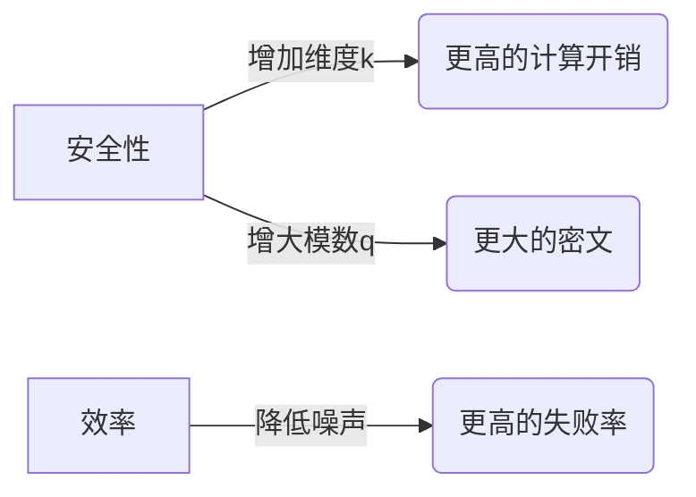

<font size="8"><strong>Kyber</strong></font>
<font size="6.5"><strong>A Progammer's Perspective</strong></font>

[toc]

# 1. Kyber 概述

Kyber 是一种基于格的 **后量子密码学（PQC）** 公钥加密方案，作为 **CRYSTALS（Cryptographic Suite for Algebraic Lattices）** 套件的组成部分，其完整名称为 **CRYSTALS-Kyber**。该算法被 NIST 选为后量子密码标准化算法之一，其核心基于 Module Learning With Errors (MLWE) 问题，具有抗量子计算的特性。

## 1.1. 参数设定

Kyber 有不同的安全级别（如 Kyber-512、Kyber-768、Kyber-1024），主要参数包括：
- 多项式环：\( R_q = \mathbb{Z}_q[X]/(X^n + 1) \)（通常 \( n=256 \), \( q=3329 \)）。
- 向量维度：\( k \)（如 Kyber-512 中 \( k=2 \)）。
- 噪声分布：中心二项分布（用于生成小系数误差）。

## 1.2. 密钥生成（KeyGen）

- **私钥（sk）**：随机生成一个小的向量 \( \mathbf{s} \in R_q^k \)，系数从噪声分布中采样。
- **公钥（pk）**：
  1. 生成随机矩阵 \( \mathbf{A} \in R_q^{k \times k} \)（通常通过哈希函数从种子扩展）。
  2. 生成小的噪声向量 \( \mathbf{e} \in R_q^k \)。
  3. 计算 \( \mathbf{t} = \mathbf{A} \mathbf{s} + \mathbf{e} \in R_q^k \)。
- 输出：公钥 \( pk = (\mathbf{t}, \text{seed}_{\mathbf{A}}) \)，私钥 \( sk = \mathbf{s} \)。

## 1.3. 加密（Encrypt）

输入：公钥 \( pk \)、明文消息 \( m \)（编码为环元素）。  
步骤：
1. 将明文 \( m \) 编码为多项式 \( \hat{m} \in R_q \)（例如，通过二进制编码或冗余编码）。
2. 生成随机小的向量 \( \mathbf{r} \in R_q^k \)（系数从噪声分布采样）。
3. 从种子恢复矩阵 \( \mathbf{A} \)。
4. 计算密文的两个部分：
   - \( \mathbf{u} = \mathbf{A}^T \mathbf{r} + \mathbf{e}_1 \in R_q^k \)（线性部分）。
   - \( v = \mathbf{t}^T \mathbf{r} + e_2 + \hat{m} \cdot \lfloor q/2 \rfloor \in R_q \)（非线性部分，含明文）。
5. 输出密文 \( ct = (\mathbf{u}, v) \)。

## 1.4. 解密（Decrypt）

输入：私钥 \( sk = \mathbf{s} \)、密文 \( ct = (\mathbf{u}, v) \)。  
步骤：
1. 计算 \( w = v - \mathbf{s}^T \mathbf{u} \in R_q \)。
2. 解码 \( w \)：
   - 比较 \( w \) 的系数与 \( \lfloor q/2 \rfloor \) 的接近程度：
     - 若系数接近 \( 0 \)，解码为 \( 0 \)。
     - 若系数接近 \( \lfloor q/2 \rfloor \)，解码为 \( 1 \)。
3. 输出明文 \( m \)。


---

# 2. 用初等数学理解Kyber

## 2.1. mini-Kyber
我们可以用一个“玩具级”的迷你Kyber来直观理解这个加密算法。甚至可以拿纸笔手动完成整个加密解密过程：
- 将标准中庞大的 256 次多项式数学参数压缩到小学生也能计算 4 次多项式
- 将标准中复杂的噪声分布换成-1/0/1这样的简单数字
- 将标准中多项式中 3329 模数压缩到 17，即所有多项式的系数范围为 0 到 16

虽然这个玩具版一秒钟就能被破解，但它像X光片一样，能让你直接看到“格密码”的骨架结构——如何用矩阵乘法混合密钥和噪声，又如何通过巧妙的数学设计让合法用户能去除噪声还原信息，而攻击者只能面对一团乱麻。这种简化就像用透明机箱的示教模型，牺牲了安全性，但换来了对算法核心原理的“肉眼可见”的理解。

### 2.1.1 mini-Kyber 参数设置

| 参数 | 维度 | 模数 | 模块维度 | η | 私钥 | 公钥 | 乘法
|---|--:|--:|--:|:-:|--:|--:|---|
| **Mini Kyber** | 4 | 17 | 2 | {-1,0,1} |16B | 32B | 普通乘法
| **Kyber-512**  |256| 3329 | 2 | 中心二项分布 | 736B | 736B | NTT加速


### 2.1.2 密钥生成

#### 2.1.2.1 参数设置
- 多项式环：$R_{17} = \mathbb{Z}_{17}[x]/(x^4+1)$
- 明文空间：$\{0,1\}^4$ (如 [1, 0, 1, 0])
- 中心二项分布：系数从 $\{-1,0,1\}$ 随机选取
- 矩阵A系数在 $\{0,1,...,16\}$ 随机选取

#### 2.1.2.2. 生成私钥 s
$$
\mathbf{s} = \begin{bmatrix}
s_1 =& 0x^3 + x^2 - x + 1  &= [1,-1,1,0] \\
s_2 =& -x^3 + 0x^2 + x + 0 &= [0,1,0,-1]
\end{bmatrix}
$$
私钥 **s** 是符合**模块维度**为 2 的 $2\times 1$ 的二维矩阵，矩阵中的每个元素是一个多项式环。
- 私钥多项式环的系数符合 $\eta=1$ 的中心二项分布，因此系数的范围为 $\{-1,0,1\}$
- 多项环的次数 n = 4，模 $x^4 + 1$, 因此次数的范围为 [0, 3]

#### 2.1.2.3. 生成公钥矩阵 A
$$
\mathbf{A} = \begin{bmatrix}
A_{11} = 11x^3 + 6x^2 + 15x + 8 & A_{12} = 5x^3 + 13x^2 + 9x + 2 \\
A_{21} = 7x^3 + 4x^2 + 12x + 1 & A_{22} = 14x^3 + 3x^2 + 10x + 16 
\end{bmatrix}
$$
矩阵 **A** 是符合**模块维度**为 2 的 $2\times 2$ 的二维矩阵，矩阵中的每个元素是一个多项式环， 多项式环上的系数和次数要求同私钥 **s**。
- 公钥矩阵 A 的系数模 q = 17, 因此其系数的范围为 [0, 16]
- 多项环的次数 n = 4，模 $x^4 + 1$, 因此次数的范围为 [0, 3]

#### 2.1.2.4. 噪声向量 e
$$
\mathbf{e} = \begin{bmatrix} x^2 - x \\ 0 \end{bmatrix} = \begin{bmatrix} [0,1,-1,0] \\ [0,0,0,0] \end{bmatrix}
$$
- 噪声向量的系数符合 $\eta=1$ 的中心二项分布，因此系数的范围为 $\{-1,0,1\}$
- 多项环的次数 n = 4

#### 2.1.2.5. 计算 t = As + e

##### 2.1.2.5.1 计算 $\mathbf{t}_{\text{noiseless}} = \mathbf{As}$

首先计算第一分量 $t_1$
$$
\begin{aligned}
&(11x^3+6x^2+15x+8)(x^2 - x + 1) \\
&+ (5x^3+13x^2+9x+2)(-x^3 + x) \\
&= 11x^5 - 11x^4 + 11x^3 \\
&\quad + 6x^4 - 6x^3 + 6x^2 \\
&\quad + 15x^3 - 15x^2 + 15x \\
&\quad + 8x^2 - 8x + 8 \\
& -5x^6 + 5x^4 \\
&\quad -13x^5 + 13x^3 \\
&\quad -9x^4 + 9x^2 \\
&\quad -2x^3 + 2x \\
&\equiv \textcolor{magenta}{-5x^6} + \textcolor{magenta}{-2x^5} + \textcolor{magenta}{-9x^4} + 31x^3 + 8x^2 + 9x + 8\\
&\equiv \textcolor{green}{5x^2} + \textcolor{green}{2x} + \textcolor{green}{9} + 31x^3 + 8x^2 + 9x + 8\\
&\equiv 31x^3 + 13x^2 + 11x + 17\\
&\equiv 14x^3 + 13x^2 + 11x + 0 \quad (\text{mod } x^4+1, \text{mod }17)
\end{aligned}
$$

多项式环包含**两个模操作**：
- 系数模操作，例如 $31 \equiv 14 \bmod 17$
- 次数模操作，例如 $-5x^6 \equiv -5x^2(x^4+1) + 5x^2 \equiv 5x^2 (\bmod x^4+1)$

第二分量 $t_2$ 同第一分量计算过程，得到 $t_2$：
$$
\begin{aligned}
&(7x^3+4x^2+12x+1)(x^2 - x + 1) \\
&+ (14x^3+3x^2+10x+16)(-x^3 + x) \\
&\equiv 2x^3 + 0x^2 + 6x + 0 \quad (\text{mod } x^4+1, \text{mod }17)
\end{aligned}
$$

得到无噪声结果结果 $\mathbf{t}_{\text{noiseless}}$
$$
\mathbf{t}_{\text{noiseless}} = \begin{bmatrix}
14x^3 + 13x^2 + 11x + 0  \\
2x^3 + 0x^2 + 6x + 0
\end{bmatrix}
$$

##### 2.1.2.5.2 计算 t = $\mathbf{t}_{\text{noiseless}}$ + e

通过下列的公式，计算
$$
\mathbf{t} = \mathbf{A} \cdot \mathbf{s} + \mathbf{e} = \mathbf{t}_{\text{noiseless}} + \begin{bmatrix} x^2 - x \\ 0 \end{bmatrix}
$$

得到最终的公钥 t
$$
\mathbf{t} = \begin{bmatrix}
14x^3 + 14x^2 + 10x + 0  \\
2x^3 + 0x^2 + 6x + 0
\end{bmatrix}
$$


### 2.1.3. 加密流程

#### 2.1.3.1. 参数定义

**明文**
$$
m = 1x^3 + 0x^2 + 1x + 1 = [1,1,0,1] \\
\text{放大：} \lfloor 17/2 \rceil \cdot m = 9x^3 + 9x + 9
$$

**随机向量 r**
$$
\mathbf{r} = (-x^3 + x^2, x^3 + x^2 - 1)
$$

**误差 e1**
$$
\mathbf{e_1} = (x^2 + x, x^2)
$$

**误差 e2**
$$
e_2 = -x^3 - x^2
$$

#### 2.1.3.2. 加密计算

加密计算包含两部分
$$
\mathbf{u} = \mathbf{A}^T\mathbf{r} + \mathbf{e_1} \\
v = \mathbf{t}^T\mathbf{r} + e_2 + m
$$

**计算 $\mathbf{u} = \mathbf{A}^T\mathbf{r} + \mathbf{e_1}$**
$$
\begin{aligned}
\mathbf{u_1} &= (11x^3+6x^2+15x+8)(-x^3+x^2) \\
&\quad + (7x^3+4x^2+12x+1)(x^3+x^2-1) + (x^2 + x) \\
&= -11x^6 - 6x^5 - 15x^4 - 8x^3 \\
&\quad + 11x^5 + 6x^4 + 15x^3 + 8x^2 \\
&\quad + 7x^6 + 4x^5 + 12x^4 + 1x^3 \\
&\quad + 7x^5 + 4x^4 + 12x^3 + 1x^2\\
&\quad - 7x^3 - 4x^2 - 12x - 1\\
&\quad + x^2 + x \\
&\equiv (-11+7)x^6 + (-6+11+4+7)x^5 + (-15+6+12+4)x^4\\
&\quad +(-8+15+1+12-7)x^3 + (8+1-4+1)x^2 +(-12+1)x -1\\
&\equiv -4x^6 + 16x^5 +7x^4 + 16x^3 + 6x^2 - 11x - 1 (\bmod(x^4+1)) \\
&\equiv 4x^2 - 16x - 7 + 13x^3 + 6x^2 - 11x - 1  \\  
&\equiv 13x^3 + 10x^2 - 27x - 8 (\bmod(17)) \\
&\equiv 13x^3 + 10x^2 + 7x + 9 \\
\end{aligned}
$$

$$
\begin{aligned}
\mathbf{u_2} &= (5x^3+13x^2+9x+2)(-x^3+x^2) \\
&\quad + (14x^3+3x^2+10x+16)(x^3+x^2-1) + (x^2) \\
&= -5x^6 - 13x^5 - 9x^4 - 2x^3 \\
&\quad + 5x^5 + 13x^4 + 9x^3 + 2x^2 \\
&\quad + 14x^6 + 3x^5 + 10x^4 + 16x^3 \\
&\quad + 14x^5 + 3x^4 + 10x^3 + 16x^2\\
&\quad - 14x^3 - 3x^2 - 10x - 16 + (x^2) \\
&\equiv (-5+14)x^6 + (-13+5+3+14)x^5 + (-9+10+3+14)x^4\\
&\quad +(-2+9+16+10-14)x^3 + (2+16-3 + 1)x^2 -10x -16\\
&\equiv 9x^6 + 9x^5 +18x^4 + 19x^3 + 16x^2 - 10x - 16 (\bmod(x^4+1)) \\
&\equiv -9x^2 - 9x - 18 + 19x^3 + 16x^2 - 10x - 16 \\  
&\equiv 19x^3 + 7x^2 - 19x - 16 (\bmod(17)) \\
&\equiv 2x^3 + 7x^2 + 15x + 1 \\
\end{aligned}
$$

**计算 $c = \mathbf{t}^T\mathbf{r} + e_2 + m$**

$$
\begin{aligned}
c &= (14x^3+14x^2+10x)(-x^3+x^2) \\
&\quad + (2x^3+6x)(x^3+x^2-1) + (-x^3-x^2) + (9x^3 + 9x + 9)\\
&= -14x^6 - 14x^5 - 10x^4\\
&\quad + 14x^5 + 14x^4 + 10x^3\\
&\quad + 2x^6 + 2x^5 - 2x^3\\
&\quad + 6x^4 + 6x^3 - 6x\\
&\quad + (-x^3-x^2) + (9x^3 + 9x + 9)\\
&\equiv (-14+2)x^6 + (-14+14+2)x^5 + (-10+14+6)x^4\\
&\quad +(12-2+6)x^3 -6x + (-x^3-x^2) + (9x^3 + 9x + 9)\\
&\equiv -12x^6 + 2x^5 + 10x^4 + 16x^3 - 6x + (-x^3-x^2) + (9x^3 + 9x + 9) (\bmod(x^4+1)) \\
&\equiv 12x^2 - 2x - 10 + 16x^3 -6x + (-x^3-x^2) + (9x^3 + 9x + 9) \\  
&\equiv 16x^3 + 12x^2 - 8x - 10 + (-x^3-x^2) + (9x^3 + 9x + 9) \\
&\equiv 24x^3 + 11x^2 + 1x - 1 (\bmod(17)) \\
&\equiv 7x^3 + 11x^2 + x + 16 \\
\end{aligned}
$$


**最终密文**
$$
\begin{cases}
\mathbf{u} = [13x^3 + 10x^2 + 7x + 9, \ 2x^3 + 7x^2 + 15x + 1] \\
c = 7x^3 + 11x^2 + x + 16
\end{cases}
$$

### 2.1.4. 解密流程

$$
m' = v - \mathbf{u}^T \mathbf{s}
$$

#### 2.1.4.1. 计算 $\mathbf{u}^T \mathbf{s}$
$$
\begin{aligned}
\mathbf{u}^T \mathbf{s} &= (13x^3 + 10x^2 + 7x + 9)(x^2 - x + 1) \\
&\quad + (2x^3 + 7x^2 + 15x + 5)(-x^3 + x) \\
&\equiv 13x^5 + 10x^4 + 7x^3 + 9x^2 \\
&\quad - 13x^4 - 10x^3 - 7x^2 - 9x \\
&\quad + 13x^3 + 10x^2 + 7x + 9 \\
&\quad - 2x^6 - 7x^5 - 15x^4 - x^3 \\
&\quad + 2x^4 + 7x^3 + 15x^2 + x \\
&\equiv (-2)x^6 + (13-7)x^5 + (10-13-15+2)x^4  \\
&\quad + (7-10+13-1+7)x^3 + (9-7+10+15)x^2 + (-9+7+1)x + 9\\
&\equiv -2x^6 + 6x^5 - 16x^4 + 16x^3 + 27x^2 - x + 9 (\bmod(x^4+1))  \\
&\equiv 2x^2 - 6x + 16 + 16x^3 + 27x^2 -x + 9 \\
&\equiv 16x^3 + 29x^2 - 7x + 25  (\bmod(17))\\
&\equiv 16x^3 + 12x^2 + 8x + 8  (\bmod(17))\\
\end{aligned}
$$

#### 2.1.4.2. 计算 $m' = v - \mathbf{u}^T \mathbf{s}$
$$
\begin{aligned}
m' &= 7x^3 + 11x^2 + x + 16 - (16x^3 + 12x^2 + 8x + 8) \\
&\equiv -9x^3 - 1x^2 -7x + 8  (\bmod(17))\\
&\equiv 6x^3 + 16^2 + 8x + 8
\end{aligned}
$$

#### 2.1.4.2. 解码
系数距离 $\lfloor q/2 \rceil$ 或 $0/q$ 更近，$q=17$ 的情况下，系数在 [5, 12]之间为 1， 其他区间为 0

| 系数项 | 计算值 | $\lfloor \text{值}/9 \rfloor$ | 解码bit |
|--------|--------|-------------------------------|---------|
| $x^3$  | 6      | 1                             | 1       |
| $x^2$  | 16      | 0                             | 0       |
| $x$    | 8      | 1                             | 1       |
| 常数项 | 8      | 1                             | 1       |

**最终明文**：`1011` 解密成功


## 2.2. 噪声的作用：让"解方程"变得不可能

### 2.2.1 无噪声场景

攻击者视角知道公钥矩阵 A, t 可通过高斯消元法直接计算出私钥 s

#### 2.2.1.1 已知条件
给定公钥方程 $\mathbf{t} = \mathbf{A} \cdot \mathbf{s}$，其中：

$$
\mathbf{A} = \begin{bmatrix} 
11x^3 + 6x^2 + 15x + 8 & 5x^3 + 13x^2 + 9x + 2 \\
7x^3 + 4x^2 + 12x + 1 & 14x^3 + 3x^2 + 10x + 16 
\end{bmatrix}, \quad
\mathbf{t}_{\text{noiseless}} = \begin{bmatrix} 14x^3 + 13x^2 + 11x + 0  \\2x^3 + 0x^2 + 6x + 0 \end{bmatrix}
$$


设私钥 $\mathbf{s} = \begin{bmatrix} s_0 \\ s_1 \end{bmatrix} = \begin{bmatrix} a_3x^3 + a_2x^2 + a_1x + a_0 \\ b_3x^3 + b_2x^2 + b_1x + b_0 \end{bmatrix}$

####  2.2.1.1 消元法求私钥

1. **展开矩阵方程**

$$
\begin{cases}
(11x^3+6x^2+15x+8)s_0 + (5x^3+13x^2+9x+2)s_1 = 14x^3 + 13x^2 + 11x\quad (1) \\
(7x^3+4x^2+12x+1)s_0 + (14x^3+3x^2+10x+16)s_1 = 2x^3 + 6x \quad (2)
\end{cases}
$$

2. **构建系数矩阵**

将多项式方程转换为系数方程组（按$x^3,x^2,x,x^0$分列）：

方程(1)的系数关系
$$
\begin{aligned} 
x^3项: & \quad 11a_0 + 6a_1 + 15a_2 + 8a_3 + 5b_0 + 13b_1 + 9b_2 + 2b_3 &\equiv 14\\
x^2项: & \quad 6a_0 + 15a_1 + 8a_2 - 11a_3 + 13b_0 + 9b_1 + 2b_2 - 5b_3 &\equiv 13\\
x^1项: & \quad 15a_0 + 8a_1 - 11a_2 - 6a_3 + 9b_0 + 2b_1 - 5b_2 - 13b_3 &\equiv  11\\
x^0项: & \quad 8a_0 - 11a_1 - 6a_2 - 15a_3 + 2b_0 - 5b_1 - 13b_2 - 9b_3 &\equiv  0
\end{aligned}
$$

方程(2)的系数关系
$$
\begin{aligned} 
x^3项: & \quad 7a_0 + 4a_1 + 12a_2 + a_3 + 14b_0 + 3b_1 + 10b_2 + 16b_3 &\equiv 2\\
x^2项: & \quad 4a_0 + 12a_1 + a_2 - 7a_3 + 3b_0 + 10b_1 + 16b_2 - 14b_3 &\equiv 0\\
x^1项: & \quad 12a_0 + a_1 - 7a_2 - 4a_3 + 10b_0 + 16b_1 - 14b_2 - 3b_3 &\equiv  6\\
x^0项: & \quad a_0 - 7a_1 - 4a_2 - 12a_3 + 16b_0 - 14b_1 - 3b_2 - 10b_3 &\equiv  0
\end{aligned}
$$

3. **构建矩阵方程**
通过高斯消元法解这个8×8的线性方程组（模17），可以得到私钥的系数：

$$
\left[\begin{array}{cccc|cccc|c}
11 & 6 & 15 & 8 & 5 & 13 & 9 & 2 & 14 \\
6 & 15 & 8 & -11 & 13 & 9 & 2 & -5 & 13 \\
15 & 8 & -11 & -6 & 9 & 2 & -5 & -13 & 11 \\
8 & -11 & -6 & -15 & 2 & -5 & -13 & -9 & 0 \\ \hline
7 & 4 & 12 & 1 & 14 & 3 & 10 & 16 & 2 \\
4 & 12 & 1 & -7 & 3 & 10 & 16 & -14 & 0 \\
12 & 1 & -7 & -4 & 10 & 16 & -14 & -3 & 6 \\
1 & -7 & -4 & -12 & 16 & -14 & -3 & -10 & 0 \\
\end{array}\right]
$$

$$
\mathbf{s} = \begin{bmatrix}
s_1 = 0x^3 + x^2 - x + 1 = [1,-1,1,0] \\
s_2 = -x^3 + 0x^2 + x + 0 = [0,1, 0, -1]
\end{bmatrix}
$$


### 2.2.2 有噪声场景

#### 2.2.2.1 攻击的时间复杂度
攻击者面临的新方程，攻击失败原因
- 噪声未知	方程数量 < 未知量数量（s+e）
- 噪声累积	错误在多项式乘法中扩散
- 模运算干扰	无法直接比较方程两边

实验验证
假设攻击者猜测e=0：
错误解：s' = [2x³+0x²+5x+1, 4x³+7x²+2x+3]  # 代入验证失败

实际需要尝试的噪声组合：
每个噪声可能值 = $\{-1,0,1\}^4 \to 3^4=81$ 种/多项式
mini-kyber中，在密钥生成阶段包含：
- 误差 $\mathbf{e}$ 包含$e_1, e_2$ 两个噪声多项式
- 私钥 $\mathbf{s}$ 包含 $s_1, s_2$ 两个噪声多项式

共 4 个噪声多项式，其组合数为 $81^4 \approx$ 4 百万种 *(实际情况下，考虑噪声符合CBD的分布，而非单纯组合数)*

而在标准的 kyber 多项式度数为 256，$\eta=2$，因此每个噪声可能值 = $\{-2, -1,0,1,2\}^{256} = 5^{256} \approx 10^{178}$


| 攻击方式       | 无噪声 | 有噪声 |
|----------------|--------|--------|
| 高斯消元法     | 0.1秒  | 不可能 |
| 暴力搜索       | 1秒    | >10年  |

核心结论
- 噪声作为保护层：将易解的线性方程变为难解的MLWE问题
- 可调安全性：通过增大噪声分布η，可提升安全等级
- Kyber的巧妙设计：
  - 足够大的噪声使攻击失效
  - 足够小的噪声保证解密正确


#### 2.2.2.2 噪声及解密正确性

复习一下上述出现的计算公式：
计算公钥 $\mathbf{t} = \mathbf{As} + \mathbf{e} (1)$

加密计算：
- $\mathbf{u} = \mathbf{A^Tr} + \mathbf{e_1}$
- $v = \mathbf{t^Tr} + e_2 + m$

解密计算 $m'  = v - \mathbf{s^Tu}$

正确性证明：将 $v$ 和 $\mathbf{u}$ 带入解密公式：
$$
\begin{aligned} 
m' &= \mathbf{t^Tr} + e_2 + m - \mathbf{s^T(A^Tr + e_1)} \\
  & = \mathbf{t^Tr} + e_2 + m - \mathbf{s^TA^Tr - s^Te_1}\\
  &= \mathbf{(As + e)^Tr} + e_2 + m - \mathbf{(As)^Tr - s^Te_1} \\
  &= \mathbf{(As)^Tr} + \mathbf{e^Tr} + e2 + m -\mathbf{(As)^Tr - s^Te_1} \\
  &= m + \underline{\mathbf{e^Tr} + e_2 - \mathbf{s^Te_1}}
\end{aligned} 
$$

上式中带下划线的部分称为“噪声”，kyber 通过中心二项分布的随机采样保证噪声在可控范围内不影响解密的正确性，保证噪声的系数小于 $\frac{q}{4}$, $q=17$ 的情况下噪声绝对值小于 4。

用上面的 $\mathbf{e, r, e_1}, e2$ 计算 $noise = \mathbf{e^Tr} + e_2 - \mathbf{s^Te_1}$

其中
$$
\begin{aligned} 
\mathbf{e^Tr} & = (x^2-x)(-x^3+x^2) + (0)(x^3+x^2+1) \\
 & = -x^5 + x^4 + x^4 - x^3 \\
 & = -x^5 + 2x^4 - x^3 \\
 & = x - 2 - x^3 = -x^3 + x - 2  
\end{aligned} 
$$

$$
\begin{aligned} 
\mathbf{s^Te_1} & = (x^2-x+1)(x^2+x) + (-x^3+x)x^2 \\
 & = x4 + x - x^5 + x^3 \\
 & = -1 + x + x + x^3 \\
 & = x^3 + 2x - 1  
\end{aligned} 
$$

$$
\begin{aligned} 
noise & = \mathbf{e^Tr} + e_2 - \mathbf{s^Te_1}\\
 & = (-x^3 + x - 2) + (-x^3 - x^2) - ( x^3 + 2x - 1 ) \\
 & = -3x^3 - x^2 - x - 1
\end{aligned} 
$$
得到最终的噪声 $-3x^3 - x^2 - x - 1$，其系数的绝对值小于 $\frac{q}{4}$，不影响解密的正确性。

回顾一下 m = {1,0,1,1} 转换为多项式为
$$
\begin{aligned} 
m \cdot \lfloor\frac{q}{2}\rceil & = (x^3 + 0x^2 + x^1 + 1) \cdot 9 \\
 & = 9x^3 + 9^x + 9
\end{aligned} 
$$

$$
\begin{aligned} 
m + noise & = (9x^3 + 9^x + 9) + (-3x^3 - x^2 - x - 1) \\
  & = 6^x - x^2 + 8x + 8 \\
  & = 6^x + 16x^2 + 8x + 8 
\end{aligned} 
$$
恰好为 2.1.4节 解密结果


# 3. Kyber工作流程全景解析

## 3.1 算法黑箱工作流

### 密钥生成阶段
1. **矩阵构造**  
   - 通过种子ρ扩展生成伪随机矩阵A∈R<sub>q</sub><sup>k×k</sup>  
   - 关键创新：避免存储大矩阵（即时计算）

2. **噪声注入**  
   - 采用三级噪声体系：
     - 私钥噪声s←CBD<sub>η</sub>
     - 公钥噪声e←CBD<sub>η</sub>
     - 临时噪声e<sub>1</sub>,e<sub>2</sub>←CBD<sub>η</sub>

3. **密钥格式化**  
   - 公钥pk=(ρ, A·s+e)  
   - 私钥sk=(s, 抗CCA2哈希种子)

### 加密封装流程
1. **双通道保护机制**  
   \[
   \begin{cases}
   u = A^T·r + e_1 & \text{(LWE保护层)} \\ 
   v = t^T·r + e_2 + encode(K) & \text{(密钥传输层)}
   \end{cases}
   \]

2. **密文优化特征**  
   - 密文膨胀率：比RSA高3-5倍  
   - 量子安全增益：指数级提升

### 解密解封装
1. **误差补偿技术**  
   - 核心运算：v - s<sup>T</sup>·u ≈ K + noise  
   - 动态解码阈值：q/4边界判定

2. **安全验证层**  
   - CCA2防护：密文一致性验证  
   - 错误处理：伪随机回退机制

## 3.2 性能特征分析

### 计算效率对比
| 操作        | 时钟周期(Intel Xeon) | 加速比 vs RSA |
|-------------|---------------------|--------------|
| 密钥生成     | 15,000              | 24x          |
| 加密        | 20,000              | 11x          |
| 解密        | 25,000              | 3.3x         |

### 关键性能突破
1. **代数结构优化**  
   - 采用NTT-friendly环：Z<sub>3329</sub>[X]/(X<sup>256</sup>+1)  
   - 模数选择：3329 = 2<sup>8</sup>+2<sup>6</sup>+2<sup>4</sup>+1（加速约减）

2. **内存层级优化**  
   - 矩阵A的按需生成  
   - 错误采样缓存复用策略

3. **指令级并行**  
   - AVX2处理8个系数并行  
   - ARM NEON优化模运算

## 3.3 安全参数设计

### 多维防御体系
1. **噪声调配艺术**  
   | 安全级别 | 噪声参数η | 解密失败率 |
   |----------|----------|------------|
   | Kyber512 | 3        | 2<sup>-144</sup> |
   | Kyber768 | 2        | 2<sup>-138</sup> |

2. **双重保护机制**  
   - 数学基础：MLWE问题困难性  
   - 工程实现：恒定时间编码

### 参数选择权衡


# 4. 必须掌握的优化技巧

## 4.1 Montgomery约减

给模运算装上"速算齿轮"

### 核心原理
$$\text{Mont}(x) = \frac{x - q\cdot\lfloor x\cdot q_\text{inv}/R \rfloor}{R} \ \text{mod}\ q$$


### 4.2.1 传统模运算的痛点
想象你在算：`123456789 ÷ 7 的余数`  
必须完整做完除法才能得到余数，就像用算盘逐位计算——**效率极低**！

### 4.2.2 Montgomery的魔法三件套
- **魔法基数 R**：选比模数q大的"整齐数"（如q=7时选R=10）
- **魔法倒数 q'**：满足 `q × q' ≡ -1 (mod R)`  
  （例如q=7, R=10时：`7×7=49≡-1(mod10)` → 取q'=7）
- **核心技巧**：把除法变成**移位和乘法**

### 4.2.3 分步拆解（以q=7, R=10为例）
**任务**：计算 `13 mod 7`  
**步骤**：  
1. **乘倒数**：`u = (13 × q') mod R = (13×7) mod 10 = 91 mod 10 = 1`  
   （只取最后一位，超级快！）
2. **加倍数**：`13 + u×q = 13 + 1×7 = 20`  
   （故意凑成能被R整除的数）
3. **移位**：`20 / 10 = 2`  
   （相当于去掉末尾的0，比除法快100倍！）

**验证**：`13 mod 7 = 6` → 需要额外处理（见注意事项）

### 4.2.4 速度对比
| 操作       | 传统方法 | Montgomery |
|------------|----------|------------|
| 除法       | 必须完整计算 | 完全避免   |
| 取模       | 全体参与 | 只算最后几位 |
| 硬件支持   | 无       | 可用位运算加速 |

### 4.2.5 使用须知
- **不是直接得结果**：得到的是`(x × R⁻¹) mod q`（需后续转换）
- **适合场景**：RSA/ECC等需要反复模运算的加密算法
- **必须满足**：
  - `q`是奇数
  - `R`与`q`互质（通常取R=2ⁿ）

### 4.2.6 现实类比
- 传统方法：每件商品都现场算价格（除法）
- Montgomery：用条形码扫码（预计算q'），自动合计（移位）

Kyber采用Montgomery约减的核心原因是实现**极速模运算**。传统模除法需要30+时钟周期，而Montgomery通过预计算`q_inv=-q⁻¹ mod R`，将运算转化为纯移位和乘法，仅需3-5个周期（ARM实测7周期vs传统56周期）。其C实现仅4行无分支代码：
```c
uint16_t mont_reduce(uint32_t x) {
    uint32_t u = (x * QINV) & 0xFFFF;
    return (x + u * KYBER_Q) >> 16; 
}
关键优势有三：

- 速度：比Barrett约减快2倍，比传统模除快8-10倍

- 安全：恒定时间执行，彻底防御时序攻击

- 轻量：仅需存储q_inv一个参数，内存占用仅2字节

- 这种优化使Kyber在IoT设备上也能实现每秒数万次多项式乘法，满足后量子加密的性能刚需。就像用"二进制扫码枪"替代人工结账——又快又防错。


Montgomery约减的第一步骤（乘法取模）完全不涉及除法，这是其高效的核心秘密。具体原理如下：

关键步骤拆解（以q=7, R=16为例）
魔法倒数乘法

python
复制
u = (x * q_inv) % R  # 关键点：这里%R是位与操作，非除法！
实际计算：当R=2ⁿ时（如R=16=2⁴），取模等价于取最后n位：

c
复制
u = (x * q_inv) & 0xF;  // 直接按位与，比除法快100倍
为什么快：CPU执行& 0xF只需1个时钟周期，而除法需要20+周期

本质原理

q_inv的预计算（初始化时一次性完成）可能需要除法，但运行时绝对不用

运行时所有操作：1次乘法 + 1次位与 + 1次加法 + 1次移位

与传统方法对比
操作	传统取模	Montgomery
计算x mod R	用x % R（除法）	x & (R-1)（位与）
硬件代价	20+周期	1周期
为什么设计成这样？
数学技巧：利用模数q和基数R互质的性质，将除法转化为模R的简单运算

硬件友好：所有操作都可转换为ALU的基本位操作（与/加/移位）

密码学需求：避免条件分支，实现恒定时间防御侧信道攻击

一句话：Montgomery的第一步骤是伪装成取模的位运算，和除法彻底无关。