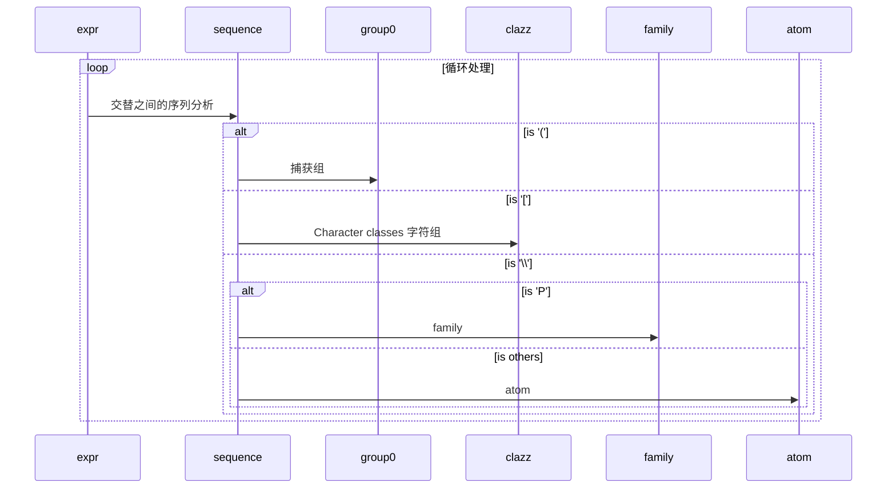

# Code Review of Pattern

[toc]

## expr(Node end)方法
正则规则处理流程



## 分析一个简单的例子
```java
String REGEX_TEL = "^(\\d{3,4}-)?\\d{6,8}$";
Pattern PATTERN_REGEX_TEL = Pattern.compile(REGEX_TEL);
```

### 返回值

返回值matchRoot及其结构如下：


上述`Node`结构说明如下：
- 基本说明：
  - 统一使用`#`代替`@`，`@`为mermaid制图工具的特殊符号
  - `$Node*2*`即为`$Node[2]`,[]在mermaid制图工具为直角长方形
  - $Node#50为类`Pattern`的静态成员`accept`, 并为多个Node节点共享
  - LastNode#35为类`Pattern`的静态成员`lastAccept`
- 起始类型节点`matchRoot:$Begin#37`, `Begin`类型节点对应于正则串中起始字符`^`,而`Dollar`类型节点对应于正则串中起始字符`$`
- 接下来就是`next:$Branch#55`，表明正则表达式包含多个分支，可以通过如下示例，进一步了解正则表达式是否包含分支：
  - `^d{6,8}$` **不包含** ~~`Branch`~~ 节点
  - `d{6,8}` **不包含** ~~`Branch`~~ 节点
  - `(\\d{6,8})?` **包含**`Branch`节点。*注*，若为`(...)+`格式，则**包含**`Prolog`节点
  - `Branch`节点包含`atoms`为`Node`节点数组。
- `0:$GroupHead#40`为`Branch.atoms[0]`,当遇到'(',捕获group
- Group节点，即()中包含`next:$Curly#47`的说明：
  - Curly对应正则表达式中{...}格式规则
  - `atom$Ctype#45`节点，ctype:1024，类型定义在类`ASCII`中`static final int DIGIT = 0x00000400;`，表明是数字类型，同时Ctpye节点包括如下字符类型：
    - 数字及非数字类型, 类型定义为`ASCII.DIGIT`, 正则表达式中写法为：`\d`, `\D`
    - 字符及非字符类型, 类型定义为`ASCII.WORD`, 正则表达式中写法为：`\w`, `\W`
    - 空格及非空格类型, 类型定义为`ASCII.SPACE`, 正则表达式中写法为：`\s`, `\S`
    - `atom`变量，`atom()`解析一个Slice类型或Single类型节点
  - 长度为cmax=4，cmin=3
  - 以上匹配正则表达式中的`\\d{3,4}`要求
  - 子节点`next:$Single#49`，对应于正则串中起始字符`-`。Single类型节点代表一个独立的字符。如果多个字符，例如`--`，将使用Slice类型节点
