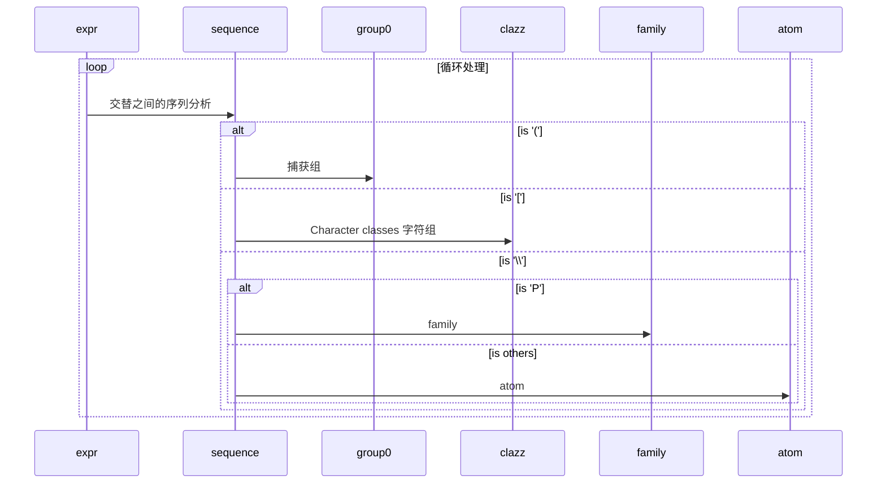
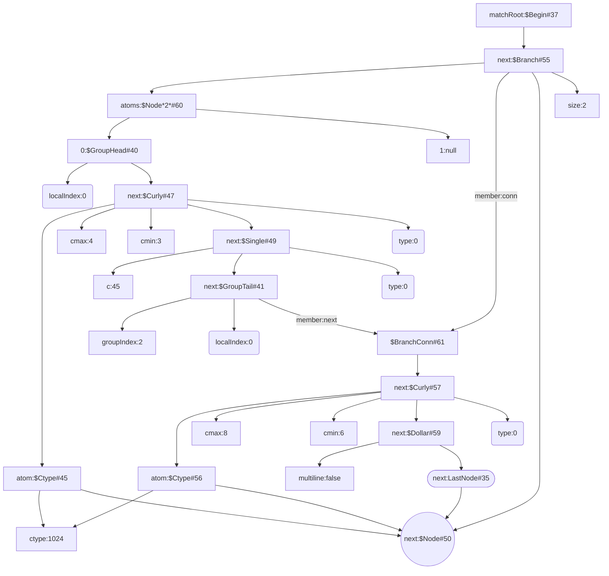

# Code Review of Pattern

[toc]

## expr(Node end)方法
正则规则处理流程



```java
String REGEX_TEL = "^(\\d{3,4}-)?\\d{6,8}$";
Pattern PATTERN_REGEX_TEL = Pattern.compile(REGEX_TEL);
```


上述`Node`结构说明如下：
- 统一使用`#`代替`@`，`@`为mermaid制图工具的特殊符号
- `$Node*2*`即为`$Node[2]`,[]在mermaid制图工具为直角长方形
- next:$Node#50为类`Pattern`的静态成员`accept`
- next:LastNode#35为类`Pattern`的静态成员`lastAccept`
- next:$Curly#47的说明：
  - ctype:1024，类型定义在类`ASCII`中`static final int DIGIT   = 0x00000400;`，表明是数字类型，
  - 长度为cmax=4，cmin=3
  - 匹配正则表达式中的`d{3,4}`要求
